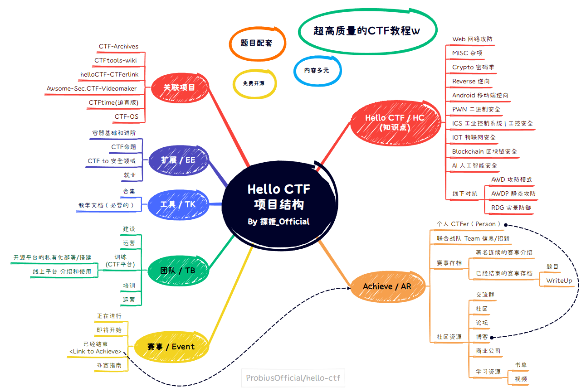

     <h2>Hello CTF</h2>
     

    
    
 
    
    
    
    
     
     
     
    

文档依靠Mkdocs-material 基于Github-Page 依靠 gh-pages 部署在 [https://hello-ctf.com/](https://hello-ctf.com/)   

因接入CDN，本站链接变更为：[https://hello-ctf.com/](https://hello-ctf.com/) ，感谢渊龙Sec安全团队[@AabyssZG](https://github.com/AabyssZG) 曾哥提供的CDN支持~

您可以直接访问该页面[在线阅读](https://hello-ctf.com/)，如果您想要转载本项目，请带上项目源地址：https://github.com/ProbiusOfficial/Hello-CTF

如果文档有帮助到你，麻烦点一个:star:支持一下！！

## 关于

随着网络安全的发展，有越来越多的小伙伴了解到了 **CTF** ，并且想要参与到比赛中来，但仅仅寻找学习资源就耗费了大量精力；  
同时每年招新时 或者带新人入门的时候 都会面临很多相似的问题，于是本项目应运而生。  
本项目旨在创建一本开源免费、新手友好的「 **夺旗赛 | CTF(Capture The Flag)** 」入门教程。  

- 对于每个方向的基础知识点，我们都会尽力提供相应的题目(包括题目附件 题目源码 Dockerfile),所有题目均可本地部署也可在NSSCTF平台上直接开启,我们会在教程中逐步引导读者,并且鼓励读者自行复现,使学习过程更加具象;  
- 在提供基础知识外，本书也将提供CTF相关的信息聚合，以消除信息差;  
- 书籍在每篇文章下都设置有讨论区，欢迎讨论，提问，以及建议;   

## 加入我们

本书仍然处于更新阶段，我们还有很多内容需要完善，欢迎您加入我们，一起完善本书，让更多的人了解CTF，参与CTF，享受CTF的乐趣。
您随时可以通过提交 [「 Pr (PullRequest) 」](https://github.com/ProbiusOfficial/Hello-CTF/pulls)来协助我们完成本项目。

- 如果您在阅读过程中发现任何 知识点错误，内容模糊，名词拼写错误等等的问题，还请您协助我们进行修改，您可以直接在评论区中提出，也可以直接提交PR。
- 如果您有好的题目，好的题解，好的知识点讲解，或者其他合作意向，也欢迎您联系探姬([By QQ](2293808331))或者开启issue。

## 致谢
本项目基于[Mkdocs-material](https://github.com/squidfunk/mkdocs-material)搭建，感谢该项目提供的优秀的文档编写平台。  

项目最初只是一个Readme文档，受到 **[Hello-algo](https://github.com/krahets/hello-algo/)** 项目的启发，这才有了这个项目现在的样子，如果你对算法感兴趣，强烈推荐这本在数据结构期末考试前帮了我大忙的书籍。  

在提出这个项目的想法的时候，因为国内的环境问题，我怀疑过很多次自己这样做是否有意义，感谢 [*Ari @deCafLatte*](https://github.com/deCafLatte) 的支持和鼓励，让我有动力做自己喜欢的事情。

本项目的完成离不开以下小伙伴的贡献，感谢他们的付出。

    

**向每一个为开源社区做出努力和贡献的人，致以崇高的敬意！！！**
