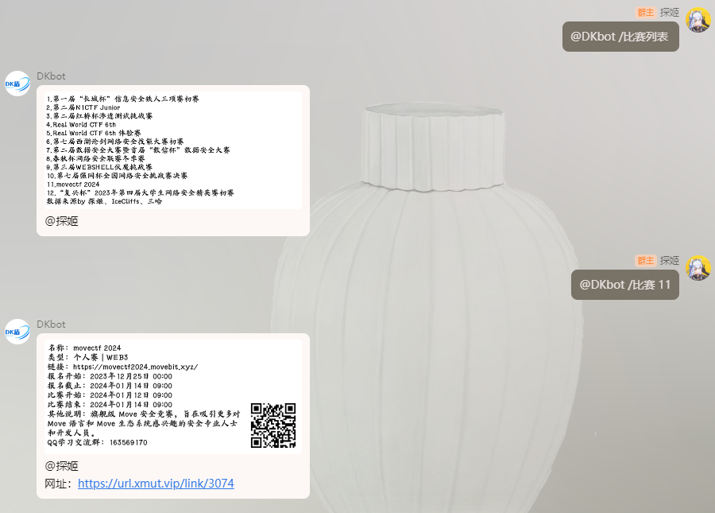

!!! note "关于赛事页"
    涵盖 CTF 国内外 即将进行，正在进行，已经结束的所有比赛信息，详细见左侧栏目。  

    - [即将开始的比赛](/ET/Upcoming_events/)
    - [正在进行的比赛](/ET/Now_running/)
    - [已经结束的比赛](/ET/Past_events/)

    对于有办赛需求的团队提供相关支持 (文档写作中哦~)  

    [点击加入催更群ww](https://qm.qq.com/q/ysLYMrtpGE)

## 添加赛事Bot到群聊

=== "Usage"

    [{ width="200" align=left }](https://qun.qq.com/qunpro/robot/qunshare?robot_uin=3889001776&robot_appid=102074091)
    赛事API现已接入QQ官方机器人，通过扫描二维码或者点击跳转到对应页面可将机器人添加到自己的群聊中。

    添加后在聊天框中输入 / 会自动弹出功能列表 (*该功能需要最新版本的手机QQ)  

    或者:  

    - `@DKbot /比赛列表` - 获取所有比赛信息

    - `@DKbot /比赛 +比赛序号` - 获取对应比赛的详细信息 (*比赛序号在比赛列表中获取)


=== "Demo"

    <figure markdown>
    
    <figcaption>Demo</figcaption>
    </figure>
    

    
## 获取数据？

> 数据基于[Hello-CTFtime](https://github.com/ProbiusOfficial/Hello-CTFtime)项目，每小时更新一次。  
  数据获取以及示例:

=== "国内赛事"

    ``` markdown title="CN.json"
    /GET https://raw.githubusercontent.com/ProbiusOfficial/Hello-CTFtime/main/CN.json
    ```

    <div class="result" markdown>

    ```json
    {
      "success": true,
      "data": {
        "result": [
          {
            "name": "HelloCTF",
            "link": "https://ctf.probius.xyz/",
            "type": "团队赛|1-3人",
            "bmks": "2099年11月15日 00:00",
            "bmjz": "2099年12月31日 00:00",
            "bsks": "2099年12月31日 00:00",
            "bsjs": "2099年12月31日 00:00",
            "readmore": "这是一条备注",
            "id": 114,
            "status": 1 /0 报名未开始 /1 报名进行中 /2 报名已结束 /3 比赛进行中 /4 比赛已结束
          },
              ],
        "total": 62,
        "page": 1,
        "size": 20
      },...
      "msg": ""
    }
    ```

    </div>

=== "国外赛事"

    ``` markdown title="Global.json"
    /GET https://raw.githubusercontent.com/ProbiusOfficial/Hello-CTFtime/main/Global.json
    ```

    <div class="result" markdown>

    ```json
    [
      {
        "比赛名称": "Example CTF",
        "比赛时间": "2024-01-01 00:00:00 - 2024-01-01 08:00:00 UTC+8",
        "添加日历": "https://ctftime.org/event/1234.ics",
        "比赛形式": "Jeopardy",
        "比赛链接": "https://examplectf.com/",
        "比赛标志": "https://ctftime.org/media/events/logo",
        "比赛权重": "0.00",
        "赛事主办": "Example (https://ctftime.org/team/1234)",
        "比赛ID": "1234",
        "比赛状态": "oncoming / nowrunning / past"
      },...
    ]
    ```

    </div>

## 数据源

> 国内赛事数据来源: 三哈 - https://su-sanha.cn/events  
  国外赛事数据来源: CTFtime RSS源 - https://ctftime.org

加入赛事交流群体验Bot获取比赛信息:
=== "CTF赛事通知报名群_1"
    <figure markdown>
      { width="300" }
    </figure>
=== "CTF赛事通知报名群_2"
    <figure markdown>
      { width="300" }
    </figure>
