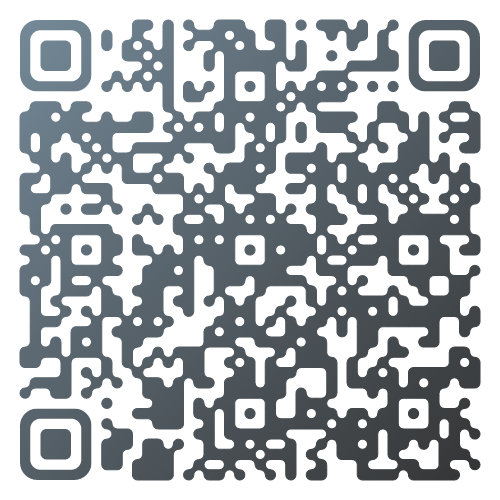
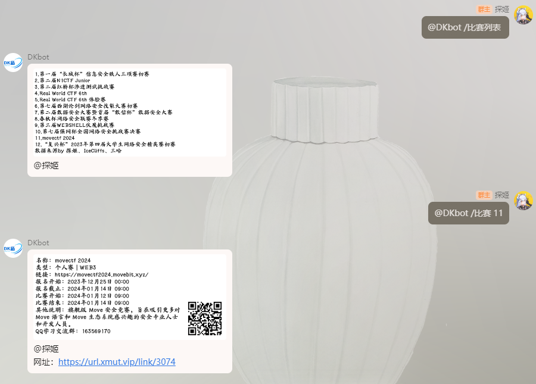

<style>
/* 赛事页日历：与首页 index.html FullCalendar 风格一致 */
#calendar {
  margin-bottom: 0;
  margin-top: 0;
  font-size: 0.75rem;
}

#calendar .fc-header-toolbar {
  gap: 0.75rem 1rem;
  flex-wrap: wrap;
  align-items: center;
  margin-bottom: 1rem !important;
  padding: 0.15rem 0;
}
#calendar .fc-toolbar-chunk {
  display: flex;
  align-items: center;
}
#calendar .fc-toolbar-title {
  font-size: 1.05rem !important;
  font-weight: 700;
  font-family: ui-monospace, "JetBrains Mono", "Fira Code", monospace;
  letter-spacing: -0.02em;
}
#calendar .fc-button-group {
  display: inline-flex !important;
  gap: 6px;
  box-shadow: none;
}
#calendar .fc-button-group > .fc-button {
  margin-left: 0 !important;
  margin-right: 0 !important;
}
#calendar .fc-button {
  border-radius: 0.75rem !important;
  border: 2px solid rgba(59, 130, 246, 0.3) !important;
  background: rgba(255, 255, 255, 0.92) !important;
  color: #2563eb !important;
  font-weight: 600 !important;
  font-size: 0.8rem !important;
  padding: 0.45em 0.85em !important;
  line-height: 1.35 !important;
  text-transform: none !important;
  box-shadow: 0 1px 2px rgba(59, 130, 246, 0.06);
  transition: transform 0.18s ease, box-shadow 0.18s ease, background 0.18s ease, border-color 0.18s ease, color 0.18s ease;
}
#calendar .fc-button:hover {
  background: rgba(59, 130, 246, 0.08) !important;
  border-color: rgba(59, 130, 246, 0.5) !important;
  color: #1d4ed8 !important;
  transform: translateY(-1px);
  box-shadow: 0 4px 12px rgba(59, 130, 246, 0.14);
}
#calendar .fc-button.fc-button-active {
  background: linear-gradient(135deg, #3b82f6, #6366f1) !important;
  border-color: transparent !important;
  color: #fff !important;
  box-shadow: 0 4px 14px rgba(59, 130, 246, 0.35);
}
#calendar .fc-button.fc-button-active:hover {
  background: linear-gradient(135deg, #2563eb, #4f46e5) !important;
  color: #fff !important;
  transform: translateY(-1px);
}
#calendar .fc-button:focus {
  outline: none !important;
  box-shadow: 0 0 0 3px rgba(59, 130, 246, 0.25) !important;
}
#calendar .fc-button.fc-button-active:focus {
  box-shadow: 0 0 0 3px rgba(99, 102, 241, 0.35), 0 4px 14px rgba(59, 130, 246, 0.35) !important;
}
#calendar .fc-icon {
  font-size: 1.15em;
}

[data-md-color-scheme="slate"] #calendar .fc-button,
.dark #calendar .fc-button {
  background: rgba(30, 41, 59, 0.9) !important;
  border-color: rgba(129, 140, 248, 0.35) !important;
  color: #e2e8f0 !important;
  box-shadow: 0 1px 2px rgba(0, 0, 0, 0.2);
}
[data-md-color-scheme="slate"] #calendar .fc-button:hover,
.dark #calendar .fc-button:hover {
  background: rgba(59, 130, 246, 0.18) !important;
  border-color: rgba(129, 140, 248, 0.55) !important;
  color: #f8fafc !important;
}
[data-md-color-scheme="slate"] #calendar .fc-button.fc-button-active,
.dark #calendar .fc-button.fc-button-active {
  background: linear-gradient(135deg, #3b82f6, #6366f1) !important;
  border-color: transparent !important;
  color: #fff !important;
}
[data-md-color-scheme="slate"] #calendar .fc-button.fc-button-active:hover,
.dark #calendar .fc-button.fc-button-active:hover {
  background: linear-gradient(135deg, #2563eb, #4f46e5) !important;
  color: #fff !important;
}

/* FullCalendar 标准包暗黑变量（Material slate + .dark） */
[data-md-color-scheme="slate"] #calendar,
[data-md-color-scheme="slate"] #calendar .fc,
.dark #calendar,
.dark #calendar .fc {
  --fc-page-bg-color: #0f172a;
  --fc-neutral-bg-color: rgba(51, 65, 85, 0.75);
  --fc-neutral-text-color: #cbd5e1;
  --fc-border-color: #334155;
  --fc-button-text-color: #f1f5f9;
  --fc-button-bg-color: #334155;
  --fc-button-border-color: #475569;
  --fc-button-hover-bg-color: #475569;
  --fc-button-hover-border-color: #64748b;
  --fc-button-active-bg-color: #1e293b;
  --fc-button-active-border-color: #334155;
  --fc-today-bg-color: rgba(251, 191, 36, 0.14);
  --fc-more-link-bg-color: #334155;
  --fc-more-link-text-color: #e2e8f0;
  --fc-highlight-color: rgba(59, 130, 246, 0.22);
  --fc-list-event-hover-bg-color: #1e293b;
  --fc-non-business-color: rgba(15, 23, 42, 0.45);
}
[data-md-color-scheme="slate"] #calendar .fc-toolbar-title,
.dark #calendar .fc-toolbar-title {
  color: #f1f5f9;
}
[data-md-color-scheme="slate"] #calendar .fc-col-header-cell,
.dark #calendar .fc-col-header-cell {
  background: var(--fc-neutral-bg-color) !important;
}
[data-md-color-scheme="slate"] #calendar .fc-col-header-cell-cushion,
.dark #calendar .fc-col-header-cell-cushion {
  color: #cbd5e1 !important;
}
[data-md-color-scheme="slate"] #calendar .fc-scrollgrid-section-sticky > *,
.dark #calendar .fc-scrollgrid-section-sticky > * {
  background: var(--fc-page-bg-color) !important;
}
[data-md-color-scheme="slate"] #calendar .fc-daygrid-day-number,
[data-md-color-scheme="slate"] #calendar .fc-daygrid-day-top,
.dark #calendar .fc-daygrid-day-number,
.dark #calendar .fc-daygrid-day-top {
  color: #e2e8f0;
}
[data-md-color-scheme="slate"] #calendar .fc-day-other .fc-daygrid-day-number,
.dark #calendar .fc-day-other .fc-daygrid-day-number {
  color: #64748b;
}

/*
 * FullCalendar 默认会给 .fc-h-event 上蓝色；先清空变量，再用 className 上色（浅色/暗色均适用）。
 * 圆角；不限制单日条数（全部展开）。跨天条目标题用省略号避免窄格乱码。
 * 勿给 .fc-daygrid-event-harness 加 margin：会破坏 FC 对 top 的计算，导致跨天条与单日条在同一格内重叠。
 */
#calendar .fc {
  --fc-event-bg-color: transparent;
  --fc-event-border-color: transparent;
}
#calendar .fc-h-event {
  border-radius: 6px;
  font-size: 0.72rem;
  box-shadow: 0 1px 2px rgba(15, 23, 42, 0.06);
}
#calendar .fc-h-event .fc-event-main-frame {
  min-width: 0;
}
#calendar .fc-h-event .fc-event-title,
#calendar .fc-h-event .fc-event-time {
  overflow: hidden;
  text-overflow: ellipsis;
  white-space: nowrap;
}

/* 浅色 · 进行中 */
[data-md-color-scheme="default"] #calendar .fc-h-event.event-running {
  background: linear-gradient(180deg, rgba(220, 252, 231, 0.98), rgba(187, 247, 208, 0.88)) !important;
  border: 1px solid rgba(34, 197, 94, 0.42) !important;
}
[data-md-color-scheme="default"] #calendar .fc-h-event.event-running .fc-event-main {
  color: #14532d !important;
}
/* 浅色 · 即将开始 */
[data-md-color-scheme="default"] #calendar .fc-h-event.event-oncoming {
  background: linear-gradient(180deg, rgba(224, 242, 254, 0.98), rgba(186, 230, 253, 0.88)) !important;
  border: 1px solid rgba(14, 165, 233, 0.45) !important;
}
[data-md-color-scheme="default"] #calendar .fc-h-event.event-oncoming .fc-event-main {
  color: #0c4a6e !important;
}
/* 浅色 · 已结束 */
[data-md-color-scheme="default"] #calendar .fc-h-event.event-ended {
  background: linear-gradient(180deg, rgba(248, 250, 252, 0.98), rgba(241, 245, 249, 0.92)) !important;
  border: 1px solid rgba(148, 163, 184, 0.65) !important;
}
[data-md-color-scheme="default"] #calendar .fc-h-event.event-ended .fc-event-main {
  color: #475569 !important;
}

[data-md-color-scheme="default"] #calendar .fc .fc-daygrid-more-link {
  background: rgba(241, 245, 249, 0.95) !important;
  color: #3b82f6 !important;
  border: 1px dashed rgba(59, 130, 246, 0.35);
  border-radius: 6px;
  font-weight: 600;
}

/* 暗色 · 保持可读，略提高对比 */
[data-md-color-scheme="slate"] #calendar .fc-h-event.event-running,
.dark #calendar .fc-h-event.event-running {
  background-color: rgba(34, 197, 94, 0.2) !important;
  border: 1px solid rgba(74, 222, 128, 0.45) !important;
  box-shadow: none;
}
[data-md-color-scheme="slate"] #calendar .fc-h-event.event-oncoming,
.dark #calendar .fc-h-event.event-oncoming {
  background-color: rgba(14, 165, 233, 0.22) !important;
  border: 1px solid rgba(56, 189, 248, 0.5) !important;
  box-shadow: none;
}
[data-md-color-scheme="slate"] #calendar .fc-h-event.event-ended,
.dark #calendar .fc-h-event.event-ended {
  background-color: rgba(148, 163, 184, 0.18) !important;
  border: 1px solid rgba(148, 163, 184, 0.4) !important;
  box-shadow: none;
}
[data-md-color-scheme="slate"] #calendar .fc-h-event .fc-event-main,
.dark #calendar .fc-h-event .fc-event-main {
  color: #f8fafc !important;
}
[data-md-color-scheme="slate"] #calendar .fc-h-event.event-ended .fc-event-main,
.dark #calendar .fc-h-event.event-ended .fc-event-main {
  color: #cbd5e1 !important;
}
[data-md-color-scheme="slate"] #calendar .fc .fc-daygrid-more-link,
.dark #calendar .fc .fc-daygrid-more-link {
  background: rgba(51, 65, 85, 0.9) !important;
  color: #93c5fd !important;
  border: 1px dashed rgba(96, 165, 250, 0.4);
  border-radius: 6px;
}
</style>

<script>
    /** 解析国内赛时间串 yyyy年mm月dd日 hh:mm（东八区墙上时刻，与 Hello-CTFtime CN.json 一致） */
    function parseCNTime(rawTime) {
        const s = String(rawTime).trim()
        const m = s.match(/^(\d{4})年(\d{1,2})月(\d{1,2})日\s+(\d{1,2}):(\d{2})$/)
        if (!m) throw new Error('Invalid CN time: ' + rawTime)
        const y = +m[1]
        const mo = +m[2]
        const d = +m[3]
        const h = +m[4]
        const mi = +m[5]
        const iso = `${y}-${String(mo).padStart(2, '0')}-${String(d).padStart(2, '0')}T${String(h).padStart(2, '0')}:${String(mi).padStart(2, '0')}:00+08:00`
        return new Date(iso)
    }

    /** CN.json 不再包含 status；用当前时刻与比赛起止比较推导日历样式 */
    function cnDerivedEventClass(startTime, endTime) {
        const now = new Date()
        if (now < startTime) return 'event-oncoming'
        if (now < endTime) return 'event-running'
        return 'event-ended'
    }
    
    /** 
     * @description 解析日期 格式为 YYYY年MM月DD日 HH:mm
     * @param rawTime {string}
     */
    function parseGlobalTime(rawTime) {
        const [startDate, endDate] = rawTime.split(' - ')
        return [new Date(startDate), new Date(endDate)]
    }
    
    const CN = 'cn'
    const GLOBAL = 'gl'

    /**
     * @param feed {string}
     */
    async function fetchCNCTFTime(feed) {
        const res = await fetch(feed)
        /** 
         * @type {{data: {result: Array<{
         *   name: string
         *   link: string
         *   comp_time_start: string
         *   comp_time_end: string
         *   detail: string
         *   readmore?: string
         * }>}}}
         */
        const timeData = await res.json();
        
        /**
         * @description 传给 fullcalendar
         * @type {Array<{
         *   id: string
         *   start: string
         *   end: string
         *   title: string
         *   url: link
         *   className: string
         *   region: CN | GLOBAL
         *   extendedProps: { detail: string }
         * >}}
         */
        const events = []
        timeData.data.result.forEach((v, idx) => {
            try {
                const startTime = parseCNTime(v.comp_time_start)
                const endTime = parseCNTime(v.comp_time_end)
                const detail = v.detail != null && v.detail !== '' ? v.detail : (v.readmore || '')

                events.push({
                    id: 'cn-' + idx + '-' + String(v.comp_time_start || '').replace(/\s/g, '_'),
                    start: startTime.toISOString(),
                    end: endTime.toISOString(),
                    title: v.name,
                    url: v.link,
                    extendedProps: { detail },
                    className: cnDerivedEventClass(startTime, endTime),
                    region: CN,
                    display: 'block'
                })
            } catch(err) {
                console.error('日期解析错误！', err)
                console.error(v)
            }
        })
        
        return events;
    }

    /**
     * @param feed {string}
     */
    async function fetchGlobalCTFTime(feed) {
        const res = await fetch(feed)
        /** 
         * @type Array<{
         *   "比赛名称": string
         *   "比赛时间": string
         *   "比赛链接": string
         *   "比赛ID": string
         *   "比赛权重"?: string | number
         * }>
         */
        const timeData = await res.json();
        
        /**
         * @description 传给 fullcalendar
         * @type {Array<{
         *   id: number
         *   start: string
         *   end: string
         *   title: string
         *   url: link
         *   classNames: string[]
         *   region: CN | GLOBAL
         * }>}
         */
        const events = []

        timeData.forEach((v) => {
            try {
                /* 仅国外赛：权重不足 10 的不进入日历（国内赛不受此规则影响） */
                const weightRaw = v.比赛权重
                const weight = parseFloat(String(weightRaw ?? '').replace(/,/g, ''))
                if (Number.isFinite(weight) && weight < 25) {
                    return
                }

                const [startTime, endTime] = parseGlobalTime(v.比赛时间)

                events.push({
                    id: 'gl-' + v.比赛ID,
                    start: startTime.toISOString(),
                    end: endTime.toISOString(),
                    title: v.比赛名称,
                    url: v.比赛链接,
                    className: endTime < new Date() ? 'event-ended' : startTime > new Date() ? 'event-oncoming' : 'event-running',
                    region: GLOBAL,
                    display: 'block'
                })
            } catch(err) {
                console.error('日期解析错误！', err)
                console.error(v)
            }
        })
        
        return events;
    }

    async function loadCalendar() {
        const calendarEl = document.getElementById('calendar')
        
        const cnEvents = await fetchCNCTFTime('json/CN.json')
        const globalEvents = await fetchGlobalCTFTime('json/Global.json')

        const calendar = new FullCalendar.Calendar(calendarEl, {
            height: 'auto',
            locale: "zh",
            themeSystem: 'standard',
            buttonText: {
              month: '月',
              list: '列表'
            },
            headerToolbar: {
              start: "custom2 custom1",
              center: "title",
              end: "prev,next dayGridMonth,listMonth"
            },
            customButtons: {
              custom1: {
                text: "只看国内",
                click: function () {
                    calendar.removeAllEventSources();
                    calendar.addEventSource(cnEvents);
                }
              },
              custom2: {
                text: "只看国外",
                click: function () {
                    calendar.removeAllEventSources();
                    calendar.addEventSource(globalEvents);
                }
              }
            },
            events: globalEvents,
            eventClick: function (info) {
                info.jsEvent.preventDefault();

                if (info.event.url) window.open(info.event.url);
            }
        });
        calendar.render();
        
        globalThis.calendar = calendar;
    }
    
    // 前端路由变更
    if (document.getElementById('calendar')) loadCalendar()
    else 
    // 首次进入
        document.addEventListener('DOMContentLoaded', loadCalendar)

</script>

<div class="grid cards">
  <ul>
    <li>
      <p><span class="twemoji lg middle"><svg xmlns="http://www.w3.org/2000/svg" viewBox="0 0 24 24"><path d="M14 14H7v2h7m5 3H5V8h14m0-5h-1V1h-2v2H8V1H6v2H5a2 2 0 0 0-2 2v14a2 2 0 0 0 2 2h14a2 2 0 0 0 2-2V5a2 2 0 0 0-2-2m-2 7H7v2h10v-2Z"></path></svg></span> <strong>赛事日历</strong></p>
      <hr>
      <div class="grid cards">
        <!-- 日历 HTML部分 -->
        <div id='calendar' />
      </div>
    </li>
  </ul>
</div>

<div class="grid cards"  markdown>

-   :material-flag-triangle:{ .lg .middle } __比赛一览__

    --- 
    > 在此处控制赛事标签状态 : [∨全部展开][full_open] | [∧全部收起][full_close]
    [full_open]: javascript:(function(){document.querySelectorAll('details.quote').forEach(function(detail){detail.open=true;});})()
    [full_close]: javascript:(function(){document.querySelectorAll('details.quote').forEach(function(detail){detail.open=false;});})()

    <!-- 赛事内容部分_开始 -->
    === "查看比赛:"
    
        !!! warning "健康比赛忠告"
            抵制不良比赛，拒绝盗版比赛。注意自我保护，谨防受骗上当。  
            适度CTF益脑，沉迷CTF伤身。合理安排时间，享受健康生活。
    
    === "*正在报名*"
    
    === "*即将开始*"
        === "国内赛事"
    
        === "国外赛事"
            ??? Quote "[jailCTF 2026](https://ctf.pyjail.club/)"  
                [{ width="200" align=left }](https://ctf.pyjail.club/)  
                **比赛名称** : [jailCTF 2026](https://ctf.pyjail.club/)  
                **比赛形式** : Jeopardy  
                **比赛时间** : 2026-07-25 04:00:00 - 2026-07-28 04:00:00 UTC+8  
                **比赛权重** : 37.00  
                **赛事主办** : jailctf (https://ctftime.org/team/311088)  
                **添加日历** : https://ctftime.org/event/3286.ics  
                
            ??? Quote "[DIVER OSINT CTF 2026](https://ctfd.diverctf.org/)"  
                [{ width="200" align=left }](https://ctfd.diverctf.org/)  
                **比赛名称** : [DIVER OSINT CTF 2026](https://ctfd.diverctf.org/)  
                **比赛形式** : Jeopardy  
                **比赛时间** : 2026-07-25 11:10:00 - 2026-07-26 11:10:00 UTC+8  
                **比赛权重** : 0.00  
                **赛事主办** : diver_osint (https://ctftime.org/team/299569)  
                **添加日历** : https://ctftime.org/event/3268.ics  
                
            ??? Quote "[D^3CTF 2026](https://d3c.tf/)"  
                [{ width="200" align=left }](https://d3c.tf/)  
                **比赛名称** : [D^3CTF 2026](https://d3c.tf/)  
                **比赛形式** : Jeopardy  
                **比赛时间** : 2026-07-25 20:00:00 - 2026-07-26 20:00:00 UTC+8  
                **比赛权重** : 69.22  
                **赛事主办** : D^3CTF Organizers (https://ctftime.org/team/91096)  
                **添加日历** : https://ctftime.org/event/3201.ics  
                
            ??? Quote "[BushBash CTF](http://bushbash.cssa.club/)"  
                [{ width="200" align=left }](http://bushbash.cssa.club/)  
                **比赛名称** : [BushBash CTF](http://bushbash.cssa.club/)  
                **比赛形式** : Jeopardy  
                **比赛时间** : 2026-07-31 15:00:00 - 2026-08-02 15:00:00 UTC+8  
                **比赛权重** : 0.00  
                **赛事主办** : CSSA (https://ctftime.org/team/133080)  
                **添加日历** : https://ctftime.org/event/3372.ics  
                
            ??? Quote "[DeadSec CTF 2026 - POSTPONED](https://www.deadsec.xyz/)"  
                [{ width="200" align=left }](https://www.deadsec.xyz/)  
                **比赛名称** : [DeadSec CTF 2026 - POSTPONED](https://www.deadsec.xyz/)  
                **比赛形式** : Jeopardy  
                **比赛时间** : 2026-07-31 20:00:00 - 2026-08-01 20:00:00 UTC+8  
                **比赛权重** : 39.00  
                **赛事主办** : DeadSec (https://ctftime.org/team/19339)  
                **添加日历** : https://ctftime.org/event/3303.ics  
                
            ??? Quote "[L3akCTF 2026](https://ctf.l3ak.team/)"  
                [{ width="200" align=left }](https://ctf.l3ak.team/)  
                **比赛名称** : [L3akCTF 2026](https://ctf.l3ak.team/)  
                **比赛形式** : Jeopardy  
                **比赛时间** : 2026-08-01 02:00:00 - 2026-08-03 02:00:00 UTC+8  
                **比赛权重** : 34.47  
                **赛事主办** : L3ak (https://ctftime.org/team/220336)  
                **添加日历** : https://ctftime.org/event/3061.ics  
                
            ??? Quote "[VuwCTF 2026](https://2026.vuwctf.com/)"  
                [{ width="200" align=left }](https://2026.vuwctf.com/)  
                **比赛名称** : [VuwCTF 2026](https://2026.vuwctf.com/)  
                **比赛形式** : Jeopardy  
                **比赛时间** : 2026-08-01 06:00:00 - 2026-08-02 13:00:00 UTC+8  
                **比赛权重** : 25.00  
                **赛事主办** : VuwCTF (https://ctftime.org/team/378359)  
                **添加日历** : https://ctftime.org/event/3311.ics  
                
            ??? Quote "[Universal CTF](https://ctf.uctf.io/)"  
                [{ width="200" align=left }](https://ctf.uctf.io/)  
                **比赛名称** : [Universal CTF](https://ctf.uctf.io/)  
                **比赛形式** : Jeopardy  
                **比赛时间** : 2026-08-01 15:00:00 - 2026-08-02 23:00:00 UTC+8  
                **比赛权重** : 0.00  
                **赛事主办** : U-CTF (https://ctftime.org/team/430827)  
                **添加日历** : https://ctftime.org/event/3237.ics  
                
            ??? Quote "[Lexington Informatics Tournament CTF 2026](https://lit.lhsmathcs.org/)"  
                [{ width="200" align=left }](https://lit.lhsmathcs.org/)  
                **比赛名称** : [Lexington Informatics Tournament CTF 2026](https://lit.lhsmathcs.org/)  
                **比赛形式** : Jeopardy  
                **比赛时间** : 2026-08-01 23:00:00 - 2026-08-03 23:00:00 UTC+8  
                **比赛权重** : 84.79  
                **赛事主办** : LIT CTF (https://ctftime.org/team/157660)  
                **添加日历** : https://ctftime.org/event/3373.ics  
                
            ??? Quote "[Kali Team - CTF 26](https://register.kali-team.online/)"  
                [{ width="200" align=left }](https://register.kali-team.online/)  
                **比赛名称** : [Kali Team - CTF 26](https://register.kali-team.online/)  
                **比赛形式** : Jeopardy  
                **比赛时间** : 2026-08-05 15:00:00 - 2026-08-06 03:00:00 UTC+8  
                **比赛权重** : 0.00  
                **赛事主办** : Kali Team (https://ctftime.org/team/387378)  
                **添加日历** : https://ctftime.org/event/3328.ics  
                
            ??? Quote "[AEROSPACE VILLAGE STARPWN CTF](https://starpwn.ctfd.io/)"  
                [{ width="200" align=left }](https://starpwn.ctfd.io/)  
                **比赛名称** : [AEROSPACE VILLAGE STARPWN CTF](https://starpwn.ctfd.io/)  
                **比赛形式** : Jeopardy  
                **比赛时间** : 2026-08-07 01:00:00 - 2026-08-10 02:00:00 UTC+8  
                **比赛权重** : 24.65  
                **赛事主办** : Visionspace (https://ctftime.org/team/383284)  
                **添加日历** : https://ctftime.org/event/3342.ics  
                
            ??? Quote "[RoboHack AI CTF (Robotic Hacking Community at DEFCON 34)](https://www.robotichackingcommunity.com/)"  
                [{ width="200" align=left }](https://www.robotichackingcommunity.com/)  
                **比赛名称** : [RoboHack AI CTF (Robotic Hacking Community at DEFCON 34)](https://www.robotichackingcommunity.com/)  
                **比赛形式** : Hack quest  
                **比赛时间** : 2026-08-07 08:00:00 - 2026-08-09 08:00:00 UTC+8  
                **比赛权重** : 0  
                **赛事主办** : robotichackingcommunity (https://ctftime.org/team/436123)  
                **添加日历** : https://ctftime.org/event/3305.ics  
                
            ??? Quote "[DEF CON CTF 2026](https://bbbirds.org/)"  
                [{ width="200" align=left }](https://bbbirds.org/)  
                **比赛名称** : [DEF CON CTF 2026](https://bbbirds.org/)  
                **比赛形式** : Attack-Defense  
                **比赛时间** : 2026-08-08 00:00:00 - 2026-08-10 03:00:00 UTC+8  
                **比赛权重** : 0.00  
                **赛事主办** : Benevolent Bureau of Birds (https://ctftime.org/team/425757)  
                **添加日历** : https://ctftime.org/event/3322.ics  
                
            ??? Quote "[scriptCTF 2026](https://ctf.scriptsorcerers.xyz/)"  
                [{ width="200" align=left }](https://ctf.scriptsorcerers.xyz/)  
                **比赛名称** : [scriptCTF 2026](https://ctf.scriptsorcerers.xyz/)  
                **比赛形式** : Jeopardy  
                **比赛时间** : 2026-08-08 08:00:00 - 2026-08-10 08:00:00 UTC+8  
                **比赛权重** : 24.70  
                **赛事主办** : ScriptSorcerers (https://ctftime.org/team/284260)  
                **添加日历** : https://ctftime.org/event/3052.ics  
                
            ??? Quote "[UIUCTF 2026](https://uiuc.tf/)"  
                [{ width="200" align=left }](https://uiuc.tf/)  
                **比赛名称** : [UIUCTF 2026](https://uiuc.tf/)  
                **比赛形式** : Jeopardy  
                **比赛时间** : 2026-08-08 08:00:00 - 2026-08-10 08:00:00 UTC+8  
                **比赛权重** : 69.35  
                **赛事主办** : SIGPwny (https://ctftime.org/team/27763)  
                **添加日历** : https://ctftime.org/event/3148.ics  
                
            ??? Quote "[Thryve CTF 2026](https://ctf.thryvectf.org/)"  
                [{ width="200" align=left }](https://ctf.thryvectf.org/)  
                **比赛名称** : [Thryve CTF 2026](https://ctf.thryvectf.org/)  
                **比赛形式** : Jeopardy  
                **比赛时间** : 2026-08-14 19:00:00 - 2026-08-15 04:00:00 UTC+8  
                **比赛权重** : 0.00  
                **赛事主办** : Thryve (https://ctftime.org/team/419961)  
                **添加日历** : https://ctftime.org/event/3330.ics  
                
            ??? Quote "[gaslightCTF 2026](https://gaslightctf.cooking/)"  
                [{ width="200" align=left }](https://gaslightctf.cooking/)  
                **比赛名称** : [gaslightCTF 2026](https://gaslightctf.cooking/)  
                **比赛形式** : Jeopardy  
                **比赛时间** : 2026-08-14 20:00:00 - 2026-08-17 20:00:00 UTC+8  
                **比赛权重** : 0.00  
                **赛事主办** : gaslighting (https://ctftime.org/team/299906)  
                **添加日历** : https://ctftime.org/event/3181.ics  
                
            ??? Quote "[HackHowl 2026](https://hackhowl.com/)"  
                [{ width="200" align=left }](https://hackhowl.com/)  
                **比赛名称** : [HackHowl 2026](https://hackhowl.com/)  
                **比赛形式** : Jeopardy  
                **比赛时间** : 2026-08-15 08:00:00 - 2026-08-17 13:00:00 UTC+8  
                **比赛权重** : 0.00  
                **赛事主办** : Hack Howl (https://ctftime.org/team/436949)  
                **添加日历** : https://ctftime.org/event/3318.ics  
                
            ??? Quote "[THJCC CTF 2026 summer](https://ctf2026-sum.thjcc.org/)"  
                [{ width="200" align=left }](https://ctf2026-sum.thjcc.org/)  
                **比赛名称** : [THJCC CTF 2026 summer](https://ctf2026-sum.thjcc.org/)  
                **比赛形式** : Jeopardy  
                **比赛时间** : 2026-08-15 08:00:01 - 2026-08-16 20:00:00 UTC+8  
                **比赛权重** : 0.00  
                **赛事主办** : CakeisTheFake (https://ctftime.org/team/276544)  
                **添加日历** : https://ctftime.org/event/3343.ics  
                
            ??? Quote "[BrunnerCTF 2026](https://ctf.brunnerne.dk/)"  
                [{ width="200" align=left }](https://ctf.brunnerne.dk/)  
                **比赛名称** : [BrunnerCTF 2026](https://ctf.brunnerne.dk/)  
                **比赛形式** : Jeopardy  
                **比赛时间** : 2026-08-21 20:00:00 - 2026-08-23 20:00:00 UTC+8  
                **比赛权重** : 24.66  
                **赛事主办** : Brunnerne (https://ctftime.org/team/155032)  
                **添加日历** : https://ctftime.org/event/3065.ics  
                
            ??? Quote "[HITCON CTF 2026 Quals](http://ctf.hitcon.org/)"  
                [{ width="200" align=left }](http://ctf.hitcon.org/)  
                **比赛名称** : [HITCON CTF 2026 Quals](http://ctf.hitcon.org/)  
                **比赛形式** : Jeopardy  
                **比赛时间** : 2026-08-28 22:00:00 - 2026-08-30 22:00:00 UTC+8  
                **比赛权重** : 91.16  
                **赛事主办** : HITCON (https://ctftime.org/team/8299)  
                **添加日历** : https://ctftime.org/event/3340.ics  
                
            ??? Quote "[COMPFEST CTF 2026](https://compfest.id/)"  
                [{ width="200" align=left }](https://compfest.id/)  
                **比赛名称** : [COMPFEST CTF 2026](https://compfest.id/)  
                **比赛形式** : Jeopardy  
                **比赛时间** : 2026-08-29 08:00:00 - 2026-08-30 08:00:00 UTC+8  
                **比赛权重** : 96.00  
                **赛事主办** : CSUI (https://ctftime.org/team/70551)  
                **添加日历** : https://ctftime.org/event/3290.ics  
                
            ??? Quote "[ASIS CTF Quals 2026](https://asisctf.com/)"  
                [{ width="200" align=left }](https://asisctf.com/)  
                **比赛名称** : [ASIS CTF Quals 2026](https://asisctf.com/)  
                **比赛形式** : Jeopardy  
                **比赛时间** : 2026-08-29 22:00:00 - 2026-08-30 22:00:00 UTC+8  
                **比赛权重** : 90.53  
                **赛事主办** : ASIS (https://ctftime.org/team/4140)  
                **添加日历** : https://ctftime.org/event/3033.ics  
                
            ??? Quote "[UND CyberHawks National CTF Competition 2026 Qualifiers](https://ctf.hackthebox.com/event/details/und-cyberhawks-national-ctf-competition-2026-qualifiers-3444)"  
                [{ width="200" align=left }](https://ctf.hackthebox.com/event/details/und-cyberhawks-national-ctf-competition-2026-qualifiers-3444)  
                **比赛名称** : [UND CyberHawks National CTF Competition 2026 Qualifiers](https://ctf.hackthebox.com/event/details/und-cyberhawks-national-ctf-competition-2026-qualifiers-3444)  
                **比赛形式** : Jeopardy  
                **比赛时间** : 2026-08-29 22:00:00 - 2026-08-30 13:00:00 UTC+8  
                **比赛权重** : 0  
                **赛事主办** : UND CyberHawks (https://ctftime.org/team/439400)  
                **添加日历** : https://ctftime.org/event/3347.ics  
                
            ??? Quote "[NNS CTF 2026](https://nnsc.tf/)"  
                [{ width="200" align=left }](https://nnsc.tf/)  
                **比赛名称** : [NNS CTF 2026](https://nnsc.tf/)  
                **比赛形式** : Jeopardy  
                **比赛时间** : 2026-09-05 00:00:00 - 2026-09-07 00:00:00 UTC+8  
                **比赛权重** : 25.00  
                **赛事主办** : Norske Nøkkelsnikere (https://ctftime.org/team/222749)  
                **添加日历** : https://ctftime.org/event/3097.ics  
                
            ??? Quote "[TFC CTF 2026](https://ctf.thefewchosen.com/)"  
                [{ width="200" align=left }](https://ctf.thefewchosen.com/)  
                **比赛名称** : [TFC CTF 2026](https://ctf.thefewchosen.com/)  
                **比赛形式** : Jeopardy  
                **比赛时间** : 2026-09-05 18:00:00 - 2026-09-06 18:00:00 UTC+8  
                **比赛权重** : 77.08  
                **赛事主办** : The Few Chosen (https://ctftime.org/team/140885)  
                **添加日历** : https://ctftime.org/event/3344.ics  
                
            ??? Quote "[K17 CTF 2026](https://k17ctf.secso.cc/)"  
                [{ width="200" align=left }](https://k17ctf.secso.cc/)  
                **比赛名称** : [K17 CTF 2026](https://k17ctf.secso.cc/)  
                **比赛形式** : Jeopardy  
                **比赛时间** : 2026-09-11 18:00:00 - 2026-09-13 18:00:00 UTC+8  
                **比赛权重** : 24.83  
                **赛事主办** : K17 (https://ctftime.org/team/17058)  
                **添加日历** : https://ctftime.org/event/3145.ics  
                
            ??? Quote "[PatriotCTF 2026](https://pctf.competitivecyber.club/)"  
                [{ width="200" align=left }](https://pctf.competitivecyber.club/)  
                **比赛名称** : [PatriotCTF 2026](https://pctf.competitivecyber.club/)  
                **比赛形式** : Jeopardy  
                **比赛时间** : 2026-09-12 06:00:00 - 2026-09-14 06:00:00 UTC+8  
                **比赛权重** : 35.46  
                **赛事主办** : Competitive Cyber at Mason (https://ctftime.org/team/176906)  
                **添加日历** : https://ctftime.org/event/3348.ics  
                
            ??? Quote "[VolgaCTF 2026 Final](https://volgactf.ru/en/volgactf-2026/final/)"  
                [{ width="200" align=left }](https://volgactf.ru/en/volgactf-2026/final/)  
                **比赛名称** : [VolgaCTF 2026 Final](https://volgactf.ru/en/volgactf-2026/final/)  
                **比赛形式** : Attack-Defense  
                **比赛时间** : 2026-09-17 13:00:00 - 2026-09-17 23:00:00 UTC+8  
                **比赛权重** : 25.00  
                **赛事主办** : VolgaCTF.org (https://ctftime.org/team/27094)  
                **添加日历** : https://ctftime.org/event/3265.ics  
                
            ??? Quote "[NullOrigin CTF Qualifiers](https://nullorigin.cyberhx.com/)"  
                [{ width="200" align=left }](https://nullorigin.cyberhx.com/)  
                **比赛名称** : [NullOrigin CTF Qualifiers](https://nullorigin.cyberhx.com/)  
                **比赛形式** : Jeopardy  
                **比赛时间** : 2026-09-18 12:30:00 - 2026-09-19 00:30:00 UTC+8  
                **比赛权重** : 0.00  
                **赛事主办** : CyberXoX (https://ctftime.org/team/374041)  
                **添加日历** : https://ctftime.org/event/3346.ics  
                
            ??? Quote "[CSAW CTF Qualification Round 2026](https://ctf.csaw.io/)"  
                [{ width="200" align=left }](https://ctf.csaw.io/)  
                **比赛名称** : [CSAW CTF Qualification Round 2026](https://ctf.csaw.io/)  
                **比赛形式** : Jeopardy  
                **比赛时间** : 2026-09-19 00:00:00 - 2026-09-21 00:00:00 UTC+8  
                **比赛权重** : 10.93  
                **赛事主办** : NYUSEC (https://ctftime.org/team/439)  
                **添加日历** : https://ctftime.org/event/3355.ics  
                
            ??? Quote "[WATCHLIST](https://ctf.xposedornot.com/)"  
                [{ width="200" align=left }](https://ctf.xposedornot.com/)  
                **比赛名称** : [WATCHLIST](https://ctf.xposedornot.com/)  
                **比赛形式** : Jeopardy  
                **比赛时间** : 2026-09-19 11:30:00 - 2026-09-20 11:30:00 UTC+8  
                **比赛权重** : 0.00  
                **赛事主办** : WatchList CTF (https://ctftime.org/team/436923)  
                **添加日历** : https://ctftime.org/event/3326.ics  
                
            ??? Quote "[H7CTF 2026 Quals](https://2026.h7tex.com/)"  
                [{ width="200" align=left }](https://2026.h7tex.com/)  
                **比赛名称** : [H7CTF 2026 Quals](https://2026.h7tex.com/)  
                **比赛形式** : Jeopardy  
                **比赛时间** : 2026-09-26 11:30:00 - 2026-09-27 23:30:00 UTC+8  
                **比赛权重** : 27.49  
                **赛事主办** : H7Tex (https://ctftime.org/team/281844)  
                **添加日历** : https://ctftime.org/event/3093.ics  
                
            ??? Quote "[FAUST CTF 2026](https://2026.faustctf.net/)"  
                [{ width="200" align=left }](https://2026.faustctf.net/)  
                **比赛名称** : [FAUST CTF 2026](https://2026.faustctf.net/)  
                **比赛形式** : Attack-Defense  
                **比赛时间** : 2026-09-26 20:00:00 - 2026-09-27 05:00:00 UTC+8  
                **比赛权重** : 72.29  
                **赛事主办** : FAUST (https://ctftime.org/team/550)  
                **添加日历** : https://ctftime.org/event/3312.ics  
                
            ??? Quote "[Pointer Overflow CTF - 2026](https://pointeroverflowctf.com/)"  
                [{ width="200" align=left }](https://pointeroverflowctf.com/)  
                **比赛名称** : [Pointer Overflow CTF - 2026](https://pointeroverflowctf.com/)  
                **比赛形式** : Jeopardy  
                **比赛时间** : 2026-09-27 22:00:00 - 2026-12-06 22:00:00 UTC+8  
                **比赛权重** : 0  
                **赛事主办** : UWSP Pointers (https://ctftime.org/team/231536)  
                **添加日历** : https://ctftime.org/event/3020.ics  
                
            ??? Quote "[Securinets CTF Quals 2026](https://quals.securinets.tn/)"  
                [{ width="200" align=left }](https://quals.securinets.tn/)  
                **比赛名称** : [Securinets CTF Quals 2026](https://quals.securinets.tn/)  
                **比赛形式** : Jeopardy  
                **比赛时间** : 2026-10-03 17:00:00 - 2026-10-05 05:00:00 UTC+8  
                **比赛权重** : 0.00  
                **赛事主办** : Securinets (https://ctftime.org/team/5084)  
                **添加日历** : https://ctftime.org/event/3364.ics  
                
            ??? Quote "[CDCTF 2026](https://uacrimsondefense.github.io/cdctf.html)"  
                [{ width="200" align=left }](https://uacrimsondefense.github.io/cdctf.html)  
                **比赛名称** : [CDCTF 2026](https://uacrimsondefense.github.io/cdctf.html)  
                **比赛形式** : Jeopardy  
                **比赛时间** : 2026-10-03 23:00:00 - 2026-10-04 11:00:00 UTC+8  
                **比赛权重** : 25.00  
                **赛事主办** : Crimson Defense (https://ctftime.org/team/65283)  
                **添加日历** : https://ctftime.org/event/3293.ics  
                
            ??? Quote "[GaianSpace CTF 2026](https://gaian.space/ctf)"  
                [{ width="200" align=left }](https://gaian.space/ctf)  
                **比赛名称** : [GaianSpace CTF 2026](https://gaian.space/ctf)  
                **比赛形式** : Jeopardy  
                **比赛时间** : 2026-10-11 05:00:00 - 2026-10-15 05:00:00 UTC+8  
                **比赛权重** : 0.00  
                **赛事主办** : GaianSpace (https://ctftime.org/team/373034)  
                **添加日历** : https://ctftime.org/event/3354.ics  
                
            ??? Quote "[DEADFACE CTF 2026](https://ctf.deadface.io/)"  
                [{ width="200" align=left }](https://ctf.deadface.io/)  
                **比赛名称** : [DEADFACE CTF 2026](https://ctf.deadface.io/)  
                **比赛形式** : Jeopardy  
                **比赛时间** : 2026-10-17 22:00:00 - 2026-10-19 08:00:00 UTC+8  
                **比赛权重** : 35.39  
                **赛事主办** : Cyber Hacktics (https://ctftime.org/team/127017)  
                **添加日历** : https://ctftime.org/event/3279.ics  
                
            ??? Quote "[Hack.lu CTF 2026](https://flu.xxx/)"  
                [{ width="200" align=left }](https://flu.xxx/)  
                **比赛名称** : [Hack.lu CTF 2026](https://flu.xxx/)  
                **比赛形式** : Jeopardy  
                **比赛时间** : 2026-10-24 02:00:00 - 2026-10-26 02:00:00 UTC+8  
                **比赛权重** : 94.74  
                **赛事主办** : FluxFingers (https://ctftime.org/team/551)  
                **添加日历** : https://ctftime.org/event/3207.ics  
                
            ??? Quote "[H7CTF 2026 Finals](https://2026.h7tex.com/)"  
                [{ width="200" align=left }](https://2026.h7tex.com/)  
                **比赛名称** : [H7CTF 2026 Finals](https://2026.h7tex.com/)  
                **比赛形式** : Attack-Defense  
                **比赛时间** : 2026-10-24 14:30:00 - 2026-10-25 14:30:00 UTC+8  
                **比赛权重** : 0.00  
                **赛事主办** : H7Tex (https://ctftime.org/team/281844)  
                **添加日历** : https://ctftime.org/event/3094.ics  
                
            ??? Quote "[PINK+ CTF 2026](https://ctf.pink.bayern/)"  
                [{ width="200" align=left }](https://ctf.pink.bayern/)  
                **比赛名称** : [PINK+ CTF 2026](https://ctf.pink.bayern/)  
                **比赛形式** : Jeopardy  
                **比赛时间** : 2026-11-06 20:00:00 - 2026-11-09 20:00:00 UTC+8  
                **比赛权重** : 0.00  
                **赛事主办** : PINK+ (https://ctftime.org/team/438626)  
                **添加日历** : https://ctftime.org/event/3331.ics  
                
            ??? Quote "[CSCTF 2026](https://2026.chronos-security.ro/)"  
                [{ width="200" align=left }](https://2026.chronos-security.ro/)  
                **比赛名称** : [CSCTF 2026](https://2026.chronos-security.ro/)  
                **比赛形式** : Jeopardy  
                **比赛时间** : 2026-11-06 21:00:00 - 2026-11-08 21:00:00 UTC+8  
                **比赛权重** : 0.00  
                **赛事主办** : Chronos Security (https://ctftime.org/team/395297)  
                **添加日历** : https://ctftime.org/event/3333.ics  
                
            ??? Quote "[BlackAlps CTF 2026](https://blackalps.ch/ba/)"  
                [{ width="200" align=left }](https://blackalps.ch/ba/)  
                **比赛名称** : [BlackAlps CTF 2026](https://blackalps.ch/ba/)  
                **比赛形式** : Jeopardy  
                **比赛时间** : 2026-11-07 02:15:00 - 2026-11-07 06:30:00 UTC+8  
                **比赛权重** : 0.00  
                **赛事主办** : BlackAlps (https://ctftime.org/team/89021)  
                **添加日历** : https://ctftime.org/event/3242.ics  
                
            ??? Quote "[HITCON CTF 2026 Final](http://ctf.hitcon.org/)"  
                [{ width="200" align=left }](http://ctf.hitcon.org/)  
                **比赛名称** : [HITCON CTF 2026 Final](http://ctf.hitcon.org/)  
                **比赛形式** : Attack-Defense  
                **比赛时间** : 2026-11-07 08:00:00 - 2026-11-08 18:00:00 UTC+8  
                **比赛权重** : 0.00  
                **赛事主办** : HITCON (https://ctftime.org/team/8299)  
                **添加日历** : https://ctftime.org/event/3341.ics  
                
            ??? Quote "[WolvCTF 2026](https://wolvctf.io/)"  
                [{ width="200" align=left }](https://wolvctf.io/)  
                **比赛名称** : [WolvCTF 2026](https://wolvctf.io/)  
                **比赛形式** : Jeopardy  
                **比赛时间** : 2026-11-14 07:00:00 - 2026-11-16 07:00:00 UTC+8  
                **比赛权重** : 0.00  
                **赛事主办** : wolvsec (https://ctftime.org/team/83621)  
                **添加日历** : https://ctftime.org/event/3049.ics  
                
            ??? Quote "[Platypwn 2026](https://platypwnies.de/events/platypwn/)"  
                [{ width="200" align=left }](https://platypwnies.de/events/platypwn/)  
                **比赛名称** : [Platypwn 2026](https://platypwnies.de/events/platypwn/)  
                **比赛形式** : Jeopardy  
                **比赛时间** : 2026-11-14 17:00:00 - 2026-11-16 05:00:00 UTC+8  
                **比赛权重** : 37.00  
                **赛事主办** : Platypwnies (https://ctftime.org/team/112550)  
                **添加日历** : https://ctftime.org/event/3082.ics  
                
            ??? Quote "[GlacierCTF 2026](https://glacierctf.com/)"  
                [{ width="200" align=left }](https://glacierctf.com/)  
                **比赛名称** : [GlacierCTF 2026](https://glacierctf.com/)  
                **比赛形式** : Jeopardy  
                **比赛时间** : 2026-11-21 02:00:00 - 2026-11-22 02:00:00 UTC+8  
                **比赛权重** : 73.17  
                **赛事主办** : LosFuzzys (https://ctftime.org/team/8323)  
                **添加日历** : https://ctftime.org/event/3337.ics  
                
            ??? Quote "[SwampCTF 2026](https://ctf.swampctf.com/)"  
                [{ width="200" align=left }](https://ctf.swampctf.com/)  
                **比赛名称** : [SwampCTF 2026](https://ctf.swampctf.com/)  
                **比赛形式** : Jeopardy  
                **比赛时间** : 2026-11-21 05:00:00 - 2026-11-23 05:00:00 UTC+8  
                **比赛权重** : 0.00  
                **赛事主办** : Kernel Sanders (https://ctftime.org/team/397)  
                **添加日历** : https://ctftime.org/event/3118.ics  
                
            ??? Quote "[ASIS CTF Finals 2026](https://asisctf.com/)"  
                [{ width="200" align=left }](https://asisctf.com/)  
                **比赛名称** : [ASIS CTF Finals 2026](https://asisctf.com/)  
                **比赛形式** : Jeopardy  
                **比赛时间** : 2026-12-27 22:00:00 - 2026-12-28 22:00:00 UTC+8  
                **比赛权重** : 99.38  
                **赛事主办** : ASIS (https://ctftime.org/team/4140)  
                **添加日历** : https://ctftime.org/event/3062.ics  
                
    === "*正在进行*"
        === "国内赛事"
    
        === "国外赛事"
            ??? Quote "[Codegate CTF 2026 Finals](https://codegate.org/)"  
                [{ width="200" align=left }](https://codegate.org/)  
                **比赛名称** : [Codegate CTF 2026 Finals](https://codegate.org/)  
                **比赛形式** : Jeopardy  
                **比赛时间** : 2026-07-23 09:00:00 - 2026-07-24 09:00:00 UTC+8  
                **比赛权重** : 0  
                **赛事主办** : CODEGATE (https://ctftime.org/team/39352)  
                **添加日历** : https://ctftime.org/event/3292.ics  
                
    === "*已经结束*"
        === "国内赛事"
            ??? Quote "[NepCTF 2026](https://www.nepctf.com/)"  
                **比赛名称** : [NepCTF 2026](https://www.nepctf.com/)  
                **比赛时间** : 2026年07月17日 19:00 - 2026年07月19日 19:00  
                **比赛详细** : 赛制/类型: 线上Jeopardy解题赛  
                
        === "国外赛事"
            ??? Quote "[BDSec CTF 2026](https://2026.bdsec-ctf.com/)"  
                [{ width="200" align=left }](https://2026.bdsec-ctf.com/)  
                **比赛名称** : [BDSec CTF 2026](https://2026.bdsec-ctf.com/)  
                **比赛形式** : Jeopardy  
                **比赛时间** : 2026-07-20 23:00:00 - 2026-07-21 23:00:00 UTC+8  
                **比赛权重** : 15.62  
                **赛事主办** : Knight Squad (https://ctftime.org/team/141739)  
                **添加日历** : https://ctftime.org/event/3349.ics  
                
            ??? Quote "[ENOWARS 10](https://10.enowars.com/)"  
                [{ width="200" align=left }](https://10.enowars.com/)  
                **比赛名称** : [ENOWARS 10](https://10.enowars.com/)  
                **比赛形式** : Attack-Defense  
                **比赛时间** : 2026-07-18 20:00:00 - 2026-07-19 05:00:00 UTC+8  
                **比赛权重** : 83.50  
                **赛事主办** : ENOFLAG (https://ctftime.org/team/1438)  
                **添加日历** : https://ctftime.org/event/3324.ics  
                
            ??? Quote "[HoneyBadger CTF AvitoTech](https://avitoctf.ru/)"  
                [{ width="200" align=left }](https://avitoctf.ru/)  
                **比赛名称** : [HoneyBadger CTF AvitoTech](https://avitoctf.ru/)  
                **比赛形式** : Jeopardy  
                **比赛时间** : 2026-07-18 17:00:00 - 2026-07-19 23:00:00 UTC+8  
                **比赛权重** : 0  
                **赛事主办** : SPbCTF (https://ctftime.org/team/30003)  
                **添加日历** : https://ctftime.org/event/3362.ics  
                
            ??? Quote "[AxiomCTF 2026 Finals](https://axiomctf.ru/)"  
                [{ width="200" align=left }](https://axiomctf.ru/)  
                **比赛名称** : [AxiomCTF 2026 Finals](https://axiomctf.ru/)  
                **比赛形式** : Attack-Defense  
                **比赛时间** : 2026-07-18 15:00:00 - 2026-07-18 23:00:00 UTC+8  
                **比赛权重** : 0.00  
                **赛事主办** : 4x10m (https://ctftime.org/team/418607)  
                **添加日历** : https://ctftime.org/event/3357.ics  
                
            ??? Quote "[ATHENA CTF](https://ctf.athena-ctf.com/)"  
                [{ width="200" align=left }](https://ctf.athena-ctf.com/)  
                **比赛名称** : [ATHENA CTF](https://ctf.athena-ctf.com/)  
                **比赛形式** : Jeopardy  
                **比赛时间** : 2026-07-18 13:30:00 - 2026-07-19 13:30:00 UTC+8  
                **比赛权重** : 0  
                **赛事主办** : Athena-CTF (https://ctftime.org/team/438608)  
                **添加日历** : https://ctftime.org/event/3366.ics  
                
            ??? Quote "[DownUnderCTF 2026 - CANCELLED](https://duc.tf/)"  
                [{ width="200" align=left }](https://duc.tf/)  
                **比赛名称** : [DownUnderCTF 2026 - CANCELLED](https://duc.tf/)  
                **比赛形式** : Jeopardy  
                **比赛时间** : 2026-07-18 03:30:00 - 2026-07-20 03:30:00 UTC+8  
                **比赛权重** : 94.99  
                **赛事主办** : DownUnderCTF (https://ctftime.org/team/126400)  
                **添加日历** : https://ctftime.org/event/3112.ics  
                
            ??? Quote "[OmniCTF 2026 Quals](https://omnictf.com/)"  
                [{ width="200" align=left }](https://omnictf.com/)  
                **比赛名称** : [OmniCTF 2026 Quals](https://omnictf.com/)  
                **比赛形式** : Jeopardy  
                **比赛时间** : 2026-07-17 23:00:00 - 2026-07-19 23:00:00 UTC+8  
                **比赛权重** : 0  
                **赛事主办** : OmniCYBR (https://ctftime.org/team/383015)  
                **添加日历** : https://ctftime.org/event/3104.ics  
                
            ??? Quote "[EYCC CTF 2026](https://eycc.stemeghackclub.org/)"  
                [{ width="200" align=left }](https://eycc.stemeghackclub.org/)  
                **比赛名称** : [EYCC CTF 2026](https://eycc.stemeghackclub.org/)  
                **比赛形式** : Jeopardy  
                **比赛时间** : 2026-07-17 19:00:00 - 2026-07-19 19:00:00 UTC+8  
                **比赛权重** : 0  
                **赛事主办** : Mont5ab El2hwa (https://ctftime.org/team/402823)  
                **添加日历** : https://ctftime.org/event/3353.ics  
                
            ??? Quote "[Clash of Cybers I](https://1940-team.com/games/2)"  
                [{ width="200" align=left }](https://1940-team.com/games/2)  
                **比赛名称** : [Clash of Cybers I](https://1940-team.com/games/2)  
                **比赛形式** : Jeopardy  
                **比赛时间** : 2026-07-13 16:00:00 - 2026-07-14 16:00:00 UTC+8  
                **比赛权重** : 24.90  
                **赛事主办** : 1940 (https://ctftime.org/team/307762)  
                **添加日历** : https://ctftime.org/event/3368.ics  
                
            ??? Quote "[BroncoCTF 2026](https://broncoctf.ctfd.io/)"  
                [{ width="200" align=left }](https://broncoctf.ctfd.io/)  
                **比赛名称** : [BroncoCTF 2026](https://broncoctf.ctfd.io/)  
                **比赛形式** : Jeopardy  
                **比赛时间** : 2026-07-12 00:00:00 - 2026-07-13 00:00:00 UTC+8  
                **比赛权重** : 17.41  
                **赛事主办** : BroncoSec (https://ctftime.org/team/112673)  
                **添加日历** : https://ctftime.org/event/3144.ics  
                
            ??? Quote "[Junior.Crypt.2026 CTF](http://ctf-spcs.mf.grsu.by/)"  
                [{ width="200" align=left }](http://ctf-spcs.mf.grsu.by/)  
                **比赛名称** : [Junior.Crypt.2026 CTF](http://ctf-spcs.mf.grsu.by/)  
                **比赛形式** : Jeopardy  
                **比赛时间** : 2026-07-11 17:00:00 - 2026-07-12 17:00:00 UTC+8  
                **比赛权重** : 23.42  
                **赛事主办** : Beavers0 (https://ctftime.org/team/269281)  
                **添加日历** : https://ctftime.org/event/3335.ics  
                
            ??? Quote "[LYKNCTF](https://ctf.itzdenkii.me/)"  
                [{ width="200" align=left }](https://ctf.itzdenkii.me/)  
                **比赛名称** : [LYKNCTF](https://ctf.itzdenkii.me/)  
                **比赛形式** : Jeopardy  
                **比赛时间** : 2026-07-06 08:00:00 - 2026-07-08 08:00:00 UTC+8  
                **比赛权重** : 24.42  
                **赛事主办** : LYKNCTF (https://ctftime.org/team/365692)  
                **添加日历** : https://ctftime.org/event/3280.ics  
                
            ??? Quote "[Fluid Attacks' CTF 2026-2](https://fluidattacks.com/ctf)"  
                [{ width="200" align=left }](https://fluidattacks.com/ctf)  
                **比赛名称** : [Fluid Attacks' CTF 2026-2](https://fluidattacks.com/ctf)  
                **比赛形式** : Jeopardy  
                **比赛时间** : 2026-07-04 21:00:00 - 2026-07-05 09:00:00 UTC+8  
                **比赛权重** : 0  
                **赛事主办** : Fluid Attacks (https://ctftime.org/team/126627)  
                **添加日历** : https://ctftime.org/event/3325.ics  
                
            ??? Quote "[R3CTF 2026](https://ctf2026.r3kapig.com/)"  
                [{ width="200" align=left }](https://ctf2026.r3kapig.com/)  
                **比赛名称** : [R3CTF 2026](https://ctf2026.r3kapig.com/)  
                **比赛形式** : Jeopardy  
                **比赛时间** : 2026-07-04 10:00:00 - 2026-07-06 10:00:00 UTC+8  
                **比赛权重** : 35.95  
                **赛事主办** : r3kapig (https://ctftime.org/team/58979)  
                **添加日历** : https://ctftime.org/event/3149.ics  
                
            ??? Quote "[No Hack No CTF 2026](https://nhnc.ic3dt3a.org/)"  
                [{ width="200" align=left }](https://nhnc.ic3dt3a.org/)  
                **比赛名称** : [No Hack No CTF 2026](https://nhnc.ic3dt3a.org/)  
                **比赛形式** : Jeopardy  
                **比赛时间** : 2026-07-04 08:00:00 - 2026-07-06 08:00:00 UTC+8  
                **比赛权重** : 23.47  
                **赛事主办** : ICEDTEA (https://ctftime.org/team/303514)  
                **添加日历** : https://ctftime.org/event/3180.ics  
                
            ??? Quote "[MindBreak 2026 by ESGI](https://linktr.ee/m1ndbr34k)"  
                [{ width="200" align=left }](https://linktr.ee/m1ndbr34k)  
                **比赛名称** : [MindBreak 2026 by ESGI](https://linktr.ee/m1ndbr34k)  
                **比赛形式** : Jeopardy  
                **比赛时间** : 2026-07-04 05:00:00 - 2026-07-04 14:00:00 UTC+8  
                **比赛权重** : 0.00  
                **赛事主办** : ESGI (https://ctftime.org/team/3151)  
                **添加日历** : https://ctftime.org/event/3315.ics  
                
            ??? Quote "[MntcrlCTF 2026](https://ctf.mntcrl.it/)"  
                [{ width="200" align=left }](https://ctf.mntcrl.it/)  
                **比赛名称** : [MntcrlCTF 2026](https://ctf.mntcrl.it/)  
                **比赛形式** : Jeopardy  
                **比赛时间** : 2026-06-28 00:00:00 - 2026-06-29 00:00:00 UTC+8  
                **比赛权重** : 25.00  
                **赛事主办** : Mntcrl (https://ctftime.org/team/195096)  
                **添加日历** : https://ctftime.org/event/3282.ics  
                
            ??? Quote "[SekaiCTF 2026](https://ctf.sekai.team/)"  
                [{ width="200" align=left }](https://ctf.sekai.team/)  
                **比赛名称** : [SekaiCTF 2026](https://ctf.sekai.team/)  
                **比赛形式** : Jeopardy  
                **比赛时间** : 2026-06-27 16:00:00 - 2026-06-29 16:00:00 UTC+8  
                **比赛权重** : 79.25  
                **赛事主办** : Project Sekai (https://ctftime.org/team/169557)  
                **添加日历** : https://ctftime.org/event/3113.ics  
                
            ??? Quote "[Grey Cat The Flag 2026 Finals](https://ctf.nusgreyhats.org/)"  
                [{ width="200" align=left }](https://ctf.nusgreyhats.org/)  
                **比赛名称** : [Grey Cat The Flag 2026 Finals](https://ctf.nusgreyhats.org/)  
                **比赛形式** : Jeopardy  
                **比赛时间** : 2026-06-27 10:00:00 - 2026-06-28 10:00:00 UTC+8  
                **比赛权重** : 0.00  
                **赛事主办** : NUS GreyHats (https://ctftime.org/team/16740)  
                **添加日历** : https://ctftime.org/event/3173.ics  
                
            ??? Quote "[V1T CTF 2026](https://ctf.v1t.site/)"  
                [{ width="200" align=left }](https://ctf.v1t.site/)  
                **比赛名称** : [V1T CTF 2026](https://ctf.v1t.site/)  
                **比赛形式** : Jeopardy  
                **比赛时间** : 2026-06-27 10:00:00 - 2026-06-28 22:00:00 UTC+8  
                **比赛权重** : 22.14  
                **赛事主办** : V1t (https://ctftime.org/team/280950)  
                **添加日历** : https://ctftime.org/event/3249.ics  
                
            ??? Quote "[TraceBash CTF 2026](https://ctf.tracebash.xyz/)"  
                [{ width="200" align=left }](https://ctf.tracebash.xyz/)  
                **比赛名称** : [TraceBash CTF 2026](https://ctf.tracebash.xyz/)  
                **比赛形式** : Jeopardy  
                **比赛时间** : 2026-06-26 17:30:00 - 2026-06-27 17:30:00 UTC+8  
                **比赛权重** : 25.00  
                **赛事主办** : TraceBash (https://ctftime.org/team/392990)  
                **添加日历** : https://ctftime.org/event/3323.ics  
                
            ??? Quote "[Google Capture The Flag 2026](https://g.co/ctf)"  
                [{ width="200" align=left }](https://g.co/ctf)  
                **比赛名称** : [Google Capture The Flag 2026](https://g.co/ctf)  
                **比赛形式** : Jeopardy  
                **比赛时间** : 2026-06-20 02:00:00 - 2026-06-22 02:00:00 UTC+8  
                **比赛权重** : 88.82  
                **赛事主办** : Google CTF (https://ctftime.org/team/23929)  
                **添加日历** : https://ctftime.org/event/3222.ics  
                
            ??? Quote "[RIFFHACK: Black Market Break-In](http://riffhack.biterra.co/)"  
                [{ width="200" align=left }](http://riffhack.biterra.co/)  
                **比赛名称** : [RIFFHACK: Black Market Break-In](http://riffhack.biterra.co/)  
                **比赛形式** : Jeopardy  
                **比赛时间** : 2026-06-19 20:00:00 - 2026-06-22 08:00:00 UTC+8  
                **比赛权重** : 0  
                **赛事主办** : Biterra (https://ctftime.org/team/414340)  
                **添加日历** : https://ctftime.org/event/3297.ics  
                
            ??? Quote "[BCACTF 7.0 [postponed]](https://www.bcactf.com/)"  
                [{ width="200" align=left }](https://www.bcactf.com/)  
                **比赛名称** : [BCACTF 7.0 [postponed]](https://www.bcactf.com/)  
                **比赛形式** : Jeopardy  
                **比赛时间** : 2026-06-19 18:00:00 - 2026-06-22 18:00:00 UTC+8  
                **比赛权重** : 65.05  
                **赛事主办** : Bing Chilling Academies (https://ctftime.org/team/283028)  
                **添加日历** : https://ctftime.org/event/3246.ics  
                
            ??? Quote "[Sieberrsec CTF 7.0](https://sieberr.live/)"  
                [{ width="200" align=left }](https://sieberr.live/)  
                **比赛名称** : [Sieberrsec CTF 7.0](https://sieberr.live/)  
                **比赛形式** : Jeopardy  
                **比赛时间** : 2026-06-17 09:00:00 - 2026-06-17 21:00:00 UTC+8  
                **比赛权重** : 24.97  
                **赛事主办** : sieberr.live (https://ctftime.org/team/387795)  
                **添加日历** : https://ctftime.org/event/3299.ics  
                
            ??? Quote "[SCTF 2026](https://sctf2026.xctf.org.cn/)"  
                [{ width="200" align=left }](https://sctf2026.xctf.org.cn/)  
                **比赛名称** : [SCTF 2026](https://sctf2026.xctf.org.cn/)  
                **比赛形式** : Jeopardy  
                **比赛时间** : 2026-06-14 09:00:00 - 2026-06-15 09:00:00 UTC+8  
                **比赛权重** : 29.12  
                **赛事主办** : Syclover (https://ctftime.org/team/455)  
                **添加日历** : https://ctftime.org/event/3314.ics  
                
            ??? Quote "[Operation Heist CTF 2026](https://registration.hackkap.com/)"  
                [{ width="200" align=left }](https://registration.hackkap.com/)  
                **比赛名称** : [Operation Heist CTF 2026](https://registration.hackkap.com/)  
                **比赛形式** : Jeopardy  
                **比赛时间** : 2026-06-13 22:00:00 - 2026-06-14 22:00:00 UTC+8  
                **比赛权重** : 0  
                **赛事主办** : HACK KAP (https://ctftime.org/team/436808)  
                **添加日历** : https://ctftime.org/event/3327.ics  
                
            ??? Quote "[CyberSci Nationals 2025-2026](https://cybersecuritychallenge.ca/)"  
                [{ width="200" align=left }](https://cybersecuritychallenge.ca/)  
                **比赛名称** : [CyberSci Nationals 2025-2026](https://cybersecuritychallenge.ca/)  
                **比赛形式** : Jeopardy  
                **比赛时间** : 2026-06-13 21:00:00 - 2026-06-15 07:00:00 UTC+8  
                **比赛权重** : 0.00  
                **赛事主办** : CyberSciOrganizers (https://ctftime.org/team/157536)  
                **添加日历** : https://ctftime.org/event/3125.ics  
                
            ??? Quote "[Anti-Slop CTF 2026](https://ctf.antislopp.i.ng/)"  
                [{ width="200" align=left }](https://ctf.antislopp.i.ng/)  
                **比赛名称** : [Anti-Slop CTF 2026](https://ctf.antislopp.i.ng/)  
                **比赛形式** : Jeopardy  
                **比赛时间** : 2026-06-13 09:00:00 - 2026-06-15 09:00:00 UTC+8  
                **比赛权重** : 24.69  
                **赛事主办** : hackme (https://ctftime.org/team/77185)  
                **添加日历** : https://ctftime.org/event/3272.ics  
                
            ??? Quote "[boroCTF 2026](https://boroctf.com/)"  
                [{ width="200" align=left }](https://boroctf.com/)  
                **比赛名称** : [boroCTF 2026](https://boroctf.com/)  
                **比赛形式** : Jeopardy  
                **比赛时间** : 2026-06-13 04:00:00 - 2026-06-16 11:59:00 UTC+8  
                **比赛权重** : 25.00  
                **赛事主办** : KyteBytes (https://ctftime.org/team/424457)  
                **添加日历** : https://ctftime.org/event/3309.ics  
                
            ??? Quote "[CyberSibir2026](https://masksafe.ru/cyberv/2026/ctf)"  
                [{ width="200" align=left }](https://masksafe.ru/cyberv/2026/ctf)  
                **比赛名称** : [CyberSibir2026](https://masksafe.ru/cyberv/2026/ctf)  
                **比赛形式** : Attack-Defense  
                **比赛时间** : 2026-06-09 11:30:00 - 2026-06-09 20:30:00 UTC+8  
                **比赛权重** : 0  
                **赛事主办** : keva (https://ctftime.org/team/2980)  
                **添加日历** : https://ctftime.org/event/3332.ics  
                
            ??? Quote "[DalCTF 2026](https://dalctf2026.com/)"  
                [{ width="200" align=left }](https://dalctf2026.com/)  
                **比赛名称** : [DalCTF 2026](https://dalctf2026.com/)  
                **比赛形式** : Jeopardy  
                **比赛时间** : 2026-06-06 21:00:00 - 2026-06-07 23:00:00 UTC+8  
                **比赛权重** : 24.89  
                **赛事主办** : Status 418 (https://ctftime.org/team/361970)  
                **添加日历** : https://ctftime.org/event/3320.ics  
                
            ??? Quote "[SAS CTF 2026 Quals](https://ctf.thesascon.com/)"  
                [{ width="200" align=left }](https://ctf.thesascon.com/)  
                **比赛名称** : [SAS CTF 2026 Quals](https://ctf.thesascon.com/)  
                **比赛形式** : Jeopardy  
                **比赛时间** : 2026-06-06 20:00:00 - 2026-06-07 20:00:00 UTC+8  
                **比赛权重** : 31.00  
                **赛事主办** : Drovosec, SAS CREW (https://ctftime.org/team/210132, https://ctftime.org/team/283057)  
                **添加日历** : https://ctftime.org/event/3109.ics  
                
            ??? Quote "[ZeroDay Heist 2026](https://ctf.cyberhx.com/)"  
                [{ width="200" align=left }](https://ctf.cyberhx.com/)  
                **比赛名称** : [ZeroDay Heist 2026](https://ctf.cyberhx.com/)  
                **比赛形式** : Jeopardy  
                **比赛时间** : 2026-06-06 14:30:00 - 2026-06-06 20:30:00 UTC+8  
                **比赛权重** : 24.33  
                **赛事主办** : CyberXoX (https://ctftime.org/team/374041)  
                **添加日历** : https://ctftime.org/event/3308.ics  
                
            ??? Quote "[RPCA CTF 2026](https://grandctf.rpca.ac.th/)"  
                [{ width="200" align=left }](https://grandctf.rpca.ac.th/)  
                **比赛名称** : [RPCA CTF 2026](https://grandctf.rpca.ac.th/)  
                **比赛形式** : Jeopardy  
                **比赛时间** : 2026-06-06 01:00:00 - 2026-06-09 01:00:00 UTC+8  
                **比赛权重** : 0  
                **赛事主办** : RPCA Cyber Club (https://ctftime.org/team/132960)  
                **添加日历** : https://ctftime.org/event/3278.ics  
                
            ??? Quote "[GPN CTF 2026](https://gpn24.ctf.kitctf.de/)"  
                [{ width="200" align=left }](https://gpn24.ctf.kitctf.de/)  
                **比赛名称** : [GPN CTF 2026](https://gpn24.ctf.kitctf.de/)  
                **比赛形式** : Jeopardy  
                **比赛时间** : 2026-06-05 18:00:00 - 2026-06-07 06:00:00 UTC+8  
                **比赛权重** : 69.00  
                **赛事主办** : KITCTF (https://ctftime.org/team/7221)  
                **添加日历** : https://ctftime.org/event/3041.ics  
                
            ??? Quote "[bhackari CTF 2026](https://ctf.bhackari.it/)"  
                [{ width="200" align=left }](https://ctf.bhackari.it/)  
                **比赛名称** : [bhackari CTF 2026](https://ctf.bhackari.it/)  
                **比赛形式** : Jeopardy  
                **比赛时间** : 2026-05-30 18:00:00 - 2026-05-31 18:00:00 UTC+8  
                **比赛权重** : 24.75  
                **赛事主办** : bhackari (https://ctftime.org/team/194130)  
                **添加日历** : https://ctftime.org/event/3302.ics  
                
            ??? Quote "[Pwn2Play Open CTF](https://pwn2play.biterra.co/)"  
                [{ width="200" align=left }](https://pwn2play.biterra.co/)  
                **比赛名称** : [Pwn2Play Open CTF](https://pwn2play.biterra.co/)  
                **比赛形式** : Jeopardy  
                **比赛时间** : 2026-05-30 17:00:00 - 2026-05-31 02:00:00 UTC+8  
                **比赛权重** : 0  
                **赛事主办** : DMUHackers26 (https://ctftime.org/team/392860)  
                **添加日历** : https://ctftime.org/event/3220.ics  
                
            ??? Quote "[WhiteHats TrojanCTF 2026](https://eshatrojan.nl/trojanctf)"  
                [{ width="200" align=left }](https://eshatrojan.nl/trojanctf)  
                **比赛名称** : [WhiteHats TrojanCTF 2026](https://eshatrojan.nl/trojanctf)  
                **比赛形式** : Jeopardy  
                **比赛时间** : 2026-05-30 17:00:00 - 2026-05-31 03:00:00 UTC+8  
                **比赛权重** : 0.00  
                **赛事主办** : E.S.H.A. Trojan (https://ctftime.org/team/248605)  
                **添加日历** : https://ctftime.org/event/3243.ics  
                
            ??? Quote "[HSE CTF 2026](https://ctf.miem.hse.ru/)"  
                [{ width="200" align=left }](https://ctf.miem.hse.ru/)  
                **比赛名称** : [HSE CTF 2026](https://ctf.miem.hse.ru/)  
                **比赛形式** : Jeopardy  
                **比赛时间** : 2026-05-30 15:00:00 - 2026-05-30 21:00:00 UTC+8  
                **比赛权重** : 0.00  
                **赛事主办** : HSE CTF Crew (https://ctftime.org/team/436827)  
                **添加日历** : https://ctftime.org/event/3313.ics  
                
            ??? Quote "[Grey Cat The Flag 2026 Qualifiers](https://ctf.nusgreyhats.org/)"  
                [{ width="200" align=left }](https://ctf.nusgreyhats.org/)  
                **比赛名称** : [Grey Cat The Flag 2026 Qualifiers](https://ctf.nusgreyhats.org/)  
                **比赛形式** : Jeopardy  
                **比赛时间** : 2026-05-30 10:00:00 - 2026-05-31 10:00:00 UTC+8  
                **比赛权重** : 47.50  
                **赛事主办** : NUS GreyHats (https://ctftime.org/team/16740)  
                **添加日历** : https://ctftime.org/event/3178.ics  
                
            ??? Quote "[BYUCTF 2026](https://ctfd.cyberjousting.com/)"  
                [{ width="200" align=left }](https://ctfd.cyberjousting.com/)  
                **比赛名称** : [BYUCTF 2026](https://ctfd.cyberjousting.com/)  
                **比赛形式** : Jeopardy  
                **比赛时间** : 2026-05-30 08:00:00 - 2026-05-31 08:00:00 UTC+8  
                **比赛权重** : 53.29  
                **赛事主办** : BYU Cyberia (https://ctftime.org/team/155711)  
                **添加日历** : https://ctftime.org/event/3247.ics  
                
            ??? Quote "[THEM?!CTF 2026](https://themctf.com/)"  
                [{ width="200" align=left }](https://themctf.com/)  
                **比赛名称** : [THEM?!CTF 2026](https://themctf.com/)  
                **比赛形式** : Jeopardy  
                **比赛时间** : 2026-05-30 02:00:00 - 2026-06-01 02:00:00 UTC+8  
                **比赛权重** : 25.00  
                **赛事主办** : THEM?! (https://ctftime.org/team/387399)  
                **添加日历** : https://ctftime.org/event/3209.ics  
                
            ??? Quote "[Hardwear.io USA 2026 Hardware CTF](https://hwc.tf/)"  
                [{ width="200" align=left }](https://hwc.tf/)  
                **比赛名称** : [Hardwear.io USA 2026 Hardware CTF](https://hwc.tf/)  
                **比赛形式** : Jeopardy  
                **比赛时间** : 2026-05-30 01:00:00 - 2026-05-31 04:50:00 UTC+8  
                **比赛权重** : 0.00  
                **赛事主办** : Hardware CTF (https://ctftime.org/team/274600)  
                **添加日历** : https://ctftime.org/event/3174.ics  
                
            ??? Quote "[HASBLCTF26](https://www.hasblctf.tech/)"  
                [{ width="200" align=left }](https://www.hasblctf.tech/)  
                **比赛名称** : [HASBLCTF26](https://www.hasblctf.tech/)  
                **比赛形式** : Jeopardy  
                **比赛时间** : 2026-05-30 01:00:00 - 2026-06-01 01:00:00 UTC+8  
                **比赛权重** : 25.00  
                **赛事主办** : ExploitsFromHeaven1337 (https://ctftime.org/team/435592)  
                **添加日历** : https://ctftime.org/event/3301.ics  
                
            ??? Quote "[Hackअस्त्र](https://ctf.hackastra.tech/)"  
                [{ width="200" align=left }](https://ctf.hackastra.tech/)  
                **比赛名称** : [Hackअस्त्र](https://ctf.hackastra.tech/)  
                **比赛形式** : Jeopardy  
                **比赛时间** : 2026-05-29 18:15:00 - 2026-05-31 01:15:00 UTC+8  
                **比赛权重** : 25.00  
                **赛事主办** : Ethical HCK (https://ctftime.org/team/434372)  
                **添加日历** : https://ctftime.org/event/3270.ics  
                
            ??? Quote "[ZEROBREACH CTF](http://ctf.cyberspacevr.in/)"  
                [{ width="200" align=left }](http://ctf.cyberspacevr.in/)  
                **比赛名称** : [ZEROBREACH CTF](http://ctf.cyberspacevr.in/)  
                **比赛形式** : Jeopardy  
                **比赛时间** : 2026-05-24 12:30:00 - 2026-05-25 00:30:00 UTC+8  
                **比赛权重** : 0.00  
                **赛事主办** : CyberSpaceVR (https://ctftime.org/team/434393)  
                **添加日历** : https://ctftime.org/event/3271.ics  
                
            ??? Quote "[SecLeaf Q2 CTF 2026](http://secleaf.tech/)"  
                [{ width="200" align=left }](http://secleaf.tech/)  
                **比赛名称** : [SecLeaf Q2 CTF 2026](http://secleaf.tech/)  
                **比赛形式** : Jeopardy  
                **比赛时间** : 2026-05-23 22:00:00 - 2026-05-24 22:00:00 UTC+8  
                **比赛权重** : 0.00  
                **赛事主办** : SecLeaf (https://ctftime.org/team/421974)  
                **添加日历** : https://ctftime.org/event/3136.ics  
                
            ??? Quote "[Panther CTF 2026](http://pantherctf.secleaf.tech/)"  
                [{ width="200" align=left }](http://pantherctf.secleaf.tech/)  
                **比赛名称** : [Panther CTF 2026](http://pantherctf.secleaf.tech/)  
                **比赛形式** : Jeopardy  
                **比赛时间** : 2026-05-23 16:30:00 - 2026-05-24 16:30:00 UTC+8  
                **比赛权重** : 0  
                **赛事主办** : SecLeaf (https://ctftime.org/team/421974)  
                **添加日历** : https://ctftime.org/event/3264.ics  
                
            ??? Quote "[Hack4Krak CTF 2026 - High School Edition](https://hack4krak.pl/)"  
                [{ width="200" align=left }](https://hack4krak.pl/)  
                **比赛名称** : [Hack4Krak CTF 2026 - High School Edition](https://hack4krak.pl/)  
                **比赛形式** : Jeopardy  
                **比赛时间** : 2026-05-23 16:00:00 - 2026-05-24 22:00:00 UTC+8  
                **比赛权重** : 0  
                **赛事主办** : Hack4Krak (https://ctftime.org/team/385787)  
                **添加日历** : https://ctftime.org/event/3284.ics  
                
            ??? Quote "[ZeroDayTM CTF](https://ctf.info.uvt.ro/invite/ckhbsit2kfmk)"  
                [{ width="200" align=left }](https://ctf.info.uvt.ro/invite/ckhbsit2kfmk)  
                **比赛名称** : [ZeroDayTM CTF](https://ctf.info.uvt.ro/invite/ckhbsit2kfmk)  
                **比赛形式** : Jeopardy  
                **比赛时间** : 2026-05-23 15:00:00 - 2026-05-23 23:00:00 UTC+8  
                **比赛权重** : 0  
                **赛事主办** : ZeroDayTM (https://ctftime.org/team/427754)  
                **添加日历** : https://ctftime.org/event/3298.ics  
                
            ??? Quote "[DEF CON CTF Qualifier 2026](https://bbbirds.org/)"  
                [{ width="200" align=left }](https://bbbirds.org/)  
                **比赛名称** : [DEF CON CTF Qualifier 2026](https://bbbirds.org/)  
                **比赛形式** : Jeopardy  
                **比赛时间** : 2026-05-23 05:00:00 - 2026-05-25 05:00:00 UTC+8  
                **比赛权重** : 63.22  
                **赛事主办** : Benevolent Bureau of Birds (https://ctftime.org/team/425757)  
                **添加日历** : https://ctftime.org/event/3205.ics  
                
            ??? Quote "[Hack for a Change 2026 May: UN SDG 1](https://www.hackforachange.org/)"  
                [{ width="200" align=left }](https://www.hackforachange.org/)  
                **比赛名称** : [Hack for a Change 2026 May: UN SDG 1](https://www.hackforachange.org/)  
                **比赛形式** : Jeopardy  
                **比赛时间** : 2026-05-19 08:00:00 - 2026-05-22 07:59:59 UTC+8  
                **比赛权重** : 24.53  
                **赛事主办** : Hack for a Change (https://ctftime.org/team/419248)  
                **添加日历** : https://ctftime.org/event/3277.ics  
                
            ??? Quote "[0xV01D CTF 2026](https://0xv01d-ctf.xyz/)"  
                [{ width="200" align=left }](https://0xv01d-ctf.xyz/)  
                **比赛名称** : [0xV01D CTF 2026](https://0xv01d-ctf.xyz/)  
                **比赛形式** : Jeopardy  
                **比赛时间** : 2026-05-18 12:00:00 - 2026-05-20 12:00:00 UTC+8  
                **比赛权重** : 19.48  
                **赛事主办** : OxV01D (https://ctftime.org/team/427687)  
                **添加日历** : https://ctftime.org/event/3269.ics  
                
            ??? Quote "[UralCUP 2026 // Quals](https://uralctf.org/)"  
                [{ width="200" align=left }](https://uralctf.org/)  
                **比赛名称** : [UralCUP 2026 // Quals](https://uralctf.org/)  
                **比赛形式** : Jeopardy  
                **比赛时间** : 2026-05-17 13:00:00 - 2026-05-17 21:00:00 UTC+8  
                **比赛权重** : 0  
                **赛事主办** : TyumGUard (https://ctftime.org/team/380152)  
                **添加日历** : https://ctftime.org/event/3214.ics  
                
            ??? Quote "[DaVinciCTF 2026](https://dvc.tf/)"  
                [{ width="200" align=left }](https://dvc.tf/)  
                **比赛名称** : [DaVinciCTF 2026](https://dvc.tf/)  
                **比赛形式** : Jeopardy  
                **比赛时间** : 2026-05-16 16:00:00 - 2026-05-17 01:00:00 UTC+8  
                **比赛权重** : 32.59  
                **赛事主办** : DaVinciCode (https://ctftime.org/team/112645)  
                **添加日历** : https://ctftime.org/event/3132.ics  
                
            ??? Quote "[TJCTF 2026](https://tjctf.org/)"  
                [{ width="200" align=left }](https://tjctf.org/)  
                **比赛名称** : [TJCTF 2026](https://tjctf.org/)  
                **比赛形式** : Jeopardy  
                **比赛时间** : 2026-05-16 00:00:00 - 2026-05-18 00:00:00 UTC+8  
                **比赛权重** : 65.05  
                **赛事主办** : tjcsc (https://ctftime.org/team/53812)  
                **添加日历** : https://ctftime.org/event/3195.ics  
                
            ??? Quote "[SamaraCTF 2026](https://samara.volgactf.ru/)"  
                [{ width="200" align=left }](https://samara.volgactf.ru/)  
                **比赛名称** : [SamaraCTF 2026](https://samara.volgactf.ru/)  
                **比赛形式** : Jeopardy  
                **比赛时间** : 2026-05-15 23:00:00 - 2026-05-17 23:00:00 UTC+8  
                **比赛权重** : 25.00  
                **赛事主办** : SamaraCTF.ru (https://ctftime.org/team/436135)  
                **添加日历** : https://ctftime.org/event/3306.ics  
                
            ??? Quote "[NDIAS Automotive/IoT CTF](https://ctf.ndias.jp/)"  
                [{ width="200" align=left }](https://ctf.ndias.jp/)  
                **比赛名称** : [NDIAS Automotive/IoT CTF](https://ctf.ndias.jp/)  
                **比赛形式** : Jeopardy  
                **比赛时间** : 2026-05-15 17:00:00 - 2026-05-17 17:00:00 UTC+8  
                **比赛权重** : 25.00  
                **赛事主办** : cartagaitai (https://ctftime.org/team/434311)  
                **添加日历** : https://ctftime.org/event/3276.ics  
                
            ??? Quote "[NorthSec 2026](https://nsec.io/competition/)"  
                [{ width="200" align=left }](https://nsec.io/competition/)  
                **比赛名称** : [NorthSec 2026](https://nsec.io/competition/)  
                **比赛形式** : Hack quest  
                **比赛时间** : 2026-05-15 08:00:00 - 2026-05-18 07:00:00 UTC+8  
                **比赛权重** : 0.00  
                **赛事主办** : NorthSec Organizers (https://ctftime.org/team/2492)  
                **添加日历** : https://ctftime.org/event/3258.ics  
                
            ??? Quote "[Midnight Sun CTF 2026 Quals](https://play.midnightsunctf.com/)"  
                [{ width="200" align=left }](https://play.midnightsunctf.com/)  
                **比赛名称** : [Midnight Sun CTF 2026 Quals](https://play.midnightsunctf.com/)  
                **比赛形式** : Jeopardy  
                **比赛时间** : 2026-05-10 21:00:00 - 2026-05-11 21:00:00 UTC+8  
                **比赛权重** : 48.17  
                **赛事主办** : HackingForSoju (https://ctftime.org/team/3208)  
                **添加日历** : https://ctftime.org/event/2773.ics  
                
            ??? Quote "[RAMunchers CTF](https://ctf.ramunchers.com/)"  
                [{ width="200" align=left }](https://ctf.ramunchers.com/)  
                **比赛名称** : [RAMunchers CTF](https://ctf.ramunchers.com/)  
                **比赛形式** : Jeopardy  
                **比赛时间** : 2026-05-10 16:00:00 - 2026-05-13 23:00:00 UTC+8  
                **比赛权重** : 23.30  
                **赛事主办** : R0073R5 (https://ctftime.org/team/147263)  
                **添加日历** : https://ctftime.org/event/3283.ics  
                
            ??? Quote "[Azure Assassin Alliance CTF 2026](https://actf2026.xctf.org.cn/)"  
                [{ width="200" align=left }](https://actf2026.xctf.org.cn/)  
                **比赛名称** : [Azure Assassin Alliance CTF 2026](https://actf2026.xctf.org.cn/)  
                **比赛形式** : Jeopardy  
                **比赛时间** : 2026-05-10 09:00:00 - 2026-05-11 09:00:00 UTC+8  
                **比赛权重** : 45.60  
                **赛事主办** : Azure Assassin Alliance (https://ctftime.org/team/194222)  
                **添加日历** : https://ctftime.org/event/3266.ics  
                
            ??? Quote "[Hack2Dawn 2026](https://events.mlh.io/events/14208-hack2dawn)"  
                [{ width="200" align=left }](https://events.mlh.io/events/14208-hack2dawn)  
                **比赛名称** : [Hack2Dawn 2026](https://events.mlh.io/events/14208-hack2dawn)  
                **比赛形式** : Hack quest  
                **比赛时间** : 2026-05-10 03:00:00 - 2026-05-10 10:00:00 UTC+8  
                **比赛权重** : 0.00  
                **赛事主办** : PawnGuard (https://ctftime.org/team/427740)  
                **添加日历** : https://ctftime.org/event/3256.ics  
                
            ??? Quote "[Maltego Community OSINT CTF](https://maltego.ctfd.io/)"  
                [{ width="200" align=left }](https://maltego.ctfd.io/)  
                **比赛名称** : [Maltego Community OSINT CTF](https://maltego.ctfd.io/)  
                **比赛形式** : Jeopardy  
                **比赛时间** : 2026-05-09 22:00:00 - 2026-05-09 23:00:00 UTC+8  
                **比赛权重** : 25.00  
                **赛事主办** : Maltego OSINT (https://ctftime.org/team/433400)  
                **添加日历** : https://ctftime.org/event/3267.ics  
                
            ??? Quote "[From Dusk Till Dawn Quals](https://till-dawn.fibonhack.it/)"  
                [{ width="200" align=left }](https://till-dawn.fibonhack.it/)  
                **比赛名称** : [From Dusk Till Dawn Quals](https://till-dawn.fibonhack.it/)  
                **比赛形式** : Jeopardy  
                **比赛时间** : 2026-05-09 17:00:00 - 2026-05-10 17:00:00 UTC+8  
                **比赛权重** : 20.14  
                **赛事主办** : fibonhack (https://ctftime.org/team/117538)  
                **添加日历** : https://ctftime.org/event/3111.ics  
                
            ??? Quote "[BKISC CTF 2026](https://ctf.bkisc.com/)"  
                [{ width="200" align=left }](https://ctf.bkisc.com/)  
                **比赛名称** : [BKISC CTF 2026](https://ctf.bkisc.com/)  
                **比赛形式** : Jeopardy  
                **比赛时间** : 2026-05-09 09:00:00 - 2026-05-10 09:00:00 UTC+8  
                **比赛权重** : 25.00  
                **赛事主办** : BKISC (https://ctftime.org/team/199510)  
                **添加日历** : https://ctftime.org/event/2927.ics  
                
            ??? Quote "[plfanzen CFT 2026](https://plfanzen.lol/)"  
                [{ width="200" align=left }](https://plfanzen.lol/)  
                **比赛名称** : [plfanzen CFT 2026](https://plfanzen.lol/)  
                **比赛形式** : Jeopardy  
                **比赛时间** : 2026-05-09 00:00:00 - 2026-05-10 20:00:00 UTC+8  
                **比赛权重** : 25.00  
                **赛事主办** : plfanzen (https://ctftime.org/team/418962)  
                **添加日历** : https://ctftime.org/event/3090.ics  
                
            ??? Quote "[Break The Syntax CTF 2026](https://bts2026.wh.edu.pl/)"  
                [{ width="200" align=left }](https://bts2026.wh.edu.pl/)  
                **比赛名称** : [Break The Syntax CTF 2026](https://bts2026.wh.edu.pl/)  
                **比赛形式** : Jeopardy  
                **比赛时间** : 2026-05-09 00:00:00 - 2026-05-10 18:00:00 UTC+8  
                **比赛权重** : 56.25  
                **赛事主办** : PWr Synt@x Err0r (https://ctftime.org/team/88205)  
                **添加日历** : https://ctftime.org/event/3137.ics  
                
            ??? Quote "[PHONIX VIPER NOVA CTF#2](http://pwnctf.ro/)"  
                [{ width="200" align=left }](http://pwnctf.ro/)  
                **比赛名称** : [PHONIX VIPER NOVA CTF#2](http://pwnctf.ro/)  
                **比赛形式** : Jeopardy  
                **比赛时间** : 2026-05-08 18:00:00 - 2026-05-11 01:00:00 UTC+8  
                **比赛权重** : 0.00  
                **赛事主办** : PH03N1X V1P3R N0V4 CTF (https://ctftime.org/team/395369)  
                **添加日历** : https://ctftime.org/event/3018.ics  
                
            ??? Quote "[THCon 2K26 CTF](https://thcon.party/)"  
                [{ width="200" align=left }](https://thcon.party/)  
                **比赛名称** : [THCon 2K26 CTF](https://thcon.party/)  
                **比赛形式** : Jeopardy  
                **比赛时间** : 2026-05-07 19:00:00 - 2026-05-08 19:00:00 UTC+8  
                **比赛权重** : 34.67  
                **赛事主办** : pony7 (https://ctftime.org/team/20769)  
                **添加日历** : https://ctftime.org/event/3186.ics  
                
            ??? Quote "[RAZER CTF 2026](http://ctf.droidecks.sbs/)"  
                [{ width="200" align=left }](http://ctf.droidecks.sbs/)  
                **比赛名称** : [RAZER CTF 2026](http://ctf.droidecks.sbs/)  
                **比赛形式** : Jeopardy  
                **比赛时间** : 2026-05-05 14:30:00 - 2026-05-06 14:30:00 UTC+8  
                **比赛权重** : 0.00  
                **赛事主办** : Droidex (https://ctftime.org/team/430693)  
                **添加日历** : https://ctftime.org/event/3241.ics  
                
            ??? Quote "[UniVsThreats 26 Finals CTF]()"  
                [{ width="200" align=left }]()  
                **比赛名称** : [UniVsThreats 26 Finals CTF]()  
                **比赛形式** : Jeopardy  
                **比赛时间** : 2026-05-02 16:00:00 - 2026-05-03 23:00:00 UTC+8  
                **比赛权重** : 25.00  
                **赛事主办** : UVT-CTF (https://ctftime.org/team/214520)  
                **添加日历** : https://ctftime.org/event/3244.ics  
                
            ??? Quote "[LakeCTF Finals 25-26](https://ctfnew.polygl0ts.ch/)"  
                [{ width="200" align=left }](https://ctfnew.polygl0ts.ch/)  
                **比赛名称** : [LakeCTF Finals 25-26](https://ctfnew.polygl0ts.ch/)  
                **比赛形式** : Jeopardy  
                **比赛时间** : 2026-05-01 15:00:00 - 2026-05-01 23:00:00 UTC+8  
                **比赛权重** : 54.00  
                **赛事主办** : polygl0ts (https://ctftime.org/team/53791)  
                **添加日历** : https://ctftime.org/event/3295.ics  
                
            ??? Quote "[KubSTU CTF](https://kubstu-ctf.ru/)"  
                [{ width="200" align=left }](https://kubstu-ctf.ru/)  
                **比赛名称** : [KubSTU CTF](https://kubstu-ctf.ru/)  
                **比赛形式** : Jeopardy  
                **比赛时间** : 2026-05-01 15:00:00 - 2026-05-03 03:00:00 UTC+8  
                **比赛权重** : 24.83  
                **赛事主办** : Capybaras (https://ctftime.org/team/223931)  
                **添加日历** : https://ctftime.org/event/3177.ics  
                
            ??? Quote "[MCTF 5.0](https://mctf.microclub.info/)"  
                [{ width="200" align=left }](https://mctf.microclub.info/)  
                **比赛名称** : [MCTF 5.0](https://mctf.microclub.info/)  
                **比赛形式** : Jeopardy  
                **比赛时间** : 2026-05-01 03:00:00 - 2026-05-02 15:00:00 UTC+8  
                **比赛权重** : 0.00  
                **赛事主办** : Micro Club (https://ctftime.org/team/425393)  
                **添加日历** : https://ctftime.org/event/3168.ics  
                
            ??? Quote "[CTF@AC26 - Quals](https://ctf.ac.upt.ro/)"  
                [{ width="200" align=left }](https://ctf.ac.upt.ro/)  
                **比赛名称** : [CTF@AC26 - Quals](https://ctf.ac.upt.ro/)  
                **比赛形式** : Jeopardy  
                **比赛时间** : 2026-04-25 15:00:00 - 2026-04-26 15:00:00 UTC+8  
                **比赛权重** : 24.53  
                **赛事主办** : UPT-CTF (https://ctftime.org/team/276942)  
                **添加日历** : https://ctftime.org/event/3192.ics  
                
            ??? Quote "[Alfa CTF 2026](https://alfactf.ru/)"  
                [{ width="200" align=left }](https://alfactf.ru/)  
                **比赛名称** : [Alfa CTF 2026](https://alfactf.ru/)  
                **比赛形式** : Jeopardy  
                **比赛时间** : 2026-04-25 14:00:00 - 2026-04-26 02:00:00 UTC+8  
                **比赛权重** : 21.67  
                **赛事主办** : SPbCTF (https://ctftime.org/team/30003)  
                **添加日历** : https://ctftime.org/event/3250.ics  
                
            ??? Quote "[HACKTHEON SEJONG 2026 Qualifier](https://hacktheon.org/)"  
                [{ width="200" align=left }](https://hacktheon.org/)  
                **比赛名称** : [HACKTHEON SEJONG 2026 Qualifier](https://hacktheon.org/)  
                **比赛形式** : Jeopardy  
                **比赛时间** : 2026-04-25 09:00:00 - 2026-04-25 16:00:00 UTC+8  
                **比赛权重** : 0  
                **赛事主办** : Sejong City Hall (https://ctftime.org/team/214900)  
                **添加日历** : https://ctftime.org/event/3199.ics  
                
            ??? Quote "[UMDCTF 2026](https://umdctf.io/)"  
                [{ width="200" align=left }](https://umdctf.io/)  
                **比赛名称** : [UMDCTF 2026](https://umdctf.io/)  
                **比赛形式** : Jeopardy  
                **比赛时间** : 2026-04-25 06:00:00 - 2026-04-27 06:00:00 UTC+8  
                **比赛权重** : 85.48  
                **赛事主办** : UMDCSEC (https://ctftime.org/team/87711)  
                **添加日历** : https://ctftime.org/event/3056.ics  
                
            ??? Quote "[TRX CTF 2026](https://ctf.theromanxpl0.it/)"  
                [{ width="200" align=left }](https://ctf.theromanxpl0.it/)  
                **比赛名称** : [TRX CTF 2026](https://ctf.theromanxpl0.it/)  
                **比赛形式** : Jeopardy  
                **比赛时间** : 2026-04-25 03:00:00 - 2026-04-27 03:00:00 UTC+8  
                **比赛权重** : 24.16  
                **赛事主办** : TheRomanXpl0it (https://ctftime.org/team/46516)  
                **添加日历** : https://ctftime.org/event/3141.ics  
                
            ??? Quote "[CyberNSK-Finals](https://cybernsk.ru/)"  
                [{ width="200" align=left }](https://cybernsk.ru/)  
                **比赛名称** : [CyberNSK-Finals](https://cybernsk.ru/)  
                **比赛形式** : Attack-Defense  
                **比赛时间** : 2026-04-19 20:00:00 - 2026-04-26 20:00:00 UTC+8  
                **比赛权重** : 0  
                **赛事主办** : siberiansecurityleague (https://ctftime.org/team/425775)  
                **添加日历** : https://ctftime.org/event/3213.ics  
                
            ??? Quote "[JerseyCTF VI](https://ctf.jerseyctf.com/)"  
                [{ width="200" align=left }](https://ctf.jerseyctf.com/)  
                **比赛名称** : [JerseyCTF VI](https://ctf.jerseyctf.com/)  
                **比赛形式** : Jeopardy  
                **比赛时间** : 2026-04-19 03:00:00 - 2026-04-20 03:00:00 UTC+8  
                **比赛权重** : 37.00  
                **赛事主办** : Highlander Hackers (https://ctftime.org/team/173925)  
                **添加日历** : https://ctftime.org/event/3117.ics  
                
            ??? Quote "[HiveCTF](https://mctf.io/hivectf)"  
                [{ width="200" align=left }](https://mctf.io/hivectf)  
                **比赛名称** : [HiveCTF](https://mctf.io/hivectf)  
                **比赛形式** : Jeopardy  
                **比赛时间** : 2026-04-18 23:00:00 - 2026-04-19 07:00:00 UTC+8  
                **比赛权重** : 25.00  
                **赛事主办** : DSU CTF Club (https://ctftime.org/team/427677)  
                **添加日历** : https://ctftime.org/event/3233.ics  
                
            ??? Quote "[K!nd4SUS CTF 2026](https://ctf.k1nd4sus.it/)"  
                [{ width="200" align=left }](https://ctf.k1nd4sus.it/)  
                **比赛名称** : [K!nd4SUS CTF 2026](https://ctf.k1nd4sus.it/)  
                **比赛形式** : Jeopardy  
                **比赛时间** : 2026-04-18 20:00:00 - 2026-04-19 20:00:00 UTC+8  
                **比赛权重** : 18.70  
                **赛事主办** : K!nd4SUS (https://ctftime.org/team/150337)  
                **添加日历** : https://ctftime.org/event/3143.ics  
                
            ??? Quote "[pingCTF 2026](http://ctf.knping.pl/)"  
                [{ width="200" align=left }](http://ctf.knping.pl/)  
                **比赛名称** : [pingCTF 2026](http://ctf.knping.pl/)  
                **比赛形式** : Jeopardy  
                **比赛时间** : 2026-04-18 18:00:00 - 2026-04-19 18:00:00 UTC+8  
                **比赛权重** : 46.20  
                **赛事主办** : pingCTF (https://ctftime.org/team/147266)  
                **添加日历** : https://ctftime.org/event/3147.ics  
                
            ??? Quote "[b01lers CTF 2026](https://b01lersc.tf/)"  
                [{ width="200" align=left }](https://b01lersc.tf/)  
                **比赛名称** : [b01lers CTF 2026](https://b01lersc.tf/)  
                **比赛形式** : Jeopardy  
                **比赛时间** : 2026-04-18 08:00:00 - 2026-04-20 08:00:00 UTC+8  
                **比赛权重** : 66.00  
                **赛事主办** : b01lers (https://ctftime.org/team/11464)  
                **添加日历** : https://ctftime.org/event/3153.ics  
                
            ??? Quote "[squ1rrel CTF 2026](https://ctf.squ1rrel.dev/)"  
                [{ width="200" align=left }](https://ctf.squ1rrel.dev/)  
                **比赛名称** : [squ1rrel CTF 2026](https://ctf.squ1rrel.dev/)  
                **比赛形式** : Jeopardy  
                **比赛时间** : 2026-04-18 07:00:00 - 2026-04-19 14:00:00 UTC+8  
                **比赛权重** : 32.47  
                **赛事主办** : squ1rrel (https://ctftime.org/team/201730)  
                **添加日历** : https://ctftime.org/event/3234.ics  
                
            ??? Quote "[BlueHens CTF 2026](https://bluehens.ctfd.io/)"  
                [{ width="200" align=left }](https://bluehens.ctfd.io/)  
                **比赛名称** : [BlueHens CTF 2026](https://bluehens.ctfd.io/)  
                **比赛形式** : Jeopardy  
                **比赛时间** : 2026-04-18 01:00:00 - 2026-04-19 13:00:00 UTC+8  
                **比赛权重** : 44.77  
                **赛事主办** : Blue Hens (https://ctftime.org/team/64660)  
                **添加日历** : https://ctftime.org/event/3235.ics  
                
            ??? Quote "[CTF@CIT 2026](https://ctf.cyber-cit.club/)"  
                [{ width="200" align=left }](https://ctf.cyber-cit.club/)  
                **比赛名称** : [CTF@CIT 2026](https://ctf.cyber-cit.club/)  
                **比赛形式** : Jeopardy  
                **比赛时间** : 2026-04-18 00:00:00 - 2026-04-20 03:00:00 UTC+8  
                **比赛权重** : 23.93  
                **赛事主办** : HACK@CIT (https://ctftime.org/team/287896)  
                **添加日历** : https://ctftime.org/event/3156.ics  
                
            ??? Quote "[CPCTF 2026](https://cpctf.space/)"  
                [{ width="200" align=left }](https://cpctf.space/)  
                **比赛名称** : [CPCTF 2026](https://cpctf.space/)  
                **比赛形式** : Jeopardy  
                **比赛时间** : 2026-04-17 19:00:00 - 2026-04-19 19:00:00 UTC+8  
                **比赛权重** : 0  
                **赛事主办** : traP (https://ctftime.org/team/62510)  
                **添加日历** : https://ctftime.org/event/3077.ics  
                
            ??? Quote "[47CON CTF 2026](https://sugusuva.es/ctfd/)"  
                [{ width="200" align=left }](https://sugusuva.es/ctfd/)  
                **比赛名称** : [47CON CTF 2026](https://sugusuva.es/ctfd/)  
                **比赛形式** : Jeopardy  
                **比赛时间** : 2026-04-17 16:00:00 - 2026-04-18 16:00:00 UTC+8  
                **比赛权重** : 0  
                **赛事主办** : SUGUS (https://ctftime.org/team/274509)  
                **添加日历** : https://ctftime.org/event/3253.ics  
                
            ??? Quote "[ZeroSecure CTF 2026](https://www.zerosecurectf.online/)"  
                [{ width="200" align=left }](https://www.zerosecurectf.online/)  
                **比赛名称** : [ZeroSecure CTF 2026](https://www.zerosecurectf.online/)  
                **比赛形式** : Jeopardy  
                **比赛时间** : 2026-04-17 13:30:00 - 2026-04-18 13:30:00 UTC+8  
                **比赛权重** : 0.00  
                **赛事主办** : CLIENT - ZERO (https://ctftime.org/team/381031)  
                **添加日历** : https://ctftime.org/event/3252.ics  
                
            ??? Quote "[WRECKCTF 2026](http://wreckctf.com/)"  
                [{ width="200" align=left }](http://wreckctf.com/)  
                **比赛名称** : [WRECKCTF 2026](http://wreckctf.com/)  
                **比赛形式** : Jeopardy  
                **比赛时间** : 2026-04-17 12:00:00 - 2026-04-18 12:00:00 UTC+8  
                **比赛权重** : 0.00  
                **赛事主办** : greyhatgt (https://ctftime.org/team/38564)  
                **添加日历** : https://ctftime.org/event/3240.ics  
                
            ??? Quote "[Incognito 7.0](https://incognito.axiosiiitl.dev/)"  
                [{ width="200" align=left }](https://incognito.axiosiiitl.dev/)  
                **比赛名称** : [Incognito 7.0](https://incognito.axiosiiitl.dev/)  
                **比赛形式** : Jeopardy  
                **比赛时间** : 2026-04-14 08:00:00 - 2026-04-15 08:00:00 UTC+8  
                **比赛权重** : 16.56  
                **赛事主办** : Byt3Scr4pp3rs (https://ctftime.org/team/57772)  
                **添加日历** : https://ctftime.org/event/3225.ics  
                
            ??? Quote "[PUTCyberDays CTF 2026](https://putcyberdays.pl/en/)"  
                [{ width="200" align=left }](https://putcyberdays.pl/en/)  
                **比赛名称** : [PUTCyberDays CTF 2026](https://putcyberdays.pl/en/)  
                **比赛形式** : Jeopardy  
                **比赛时间** : 2026-04-11 18:00:00 - 2026-04-12 18:00:00 UTC+8  
                **比赛权重** : 24.94  
                **赛事主办** : PUTrequest_ (https://ctftime.org/team/196643)  
                **添加日历** : https://ctftime.org/event/3202.ics  
                
            ??? Quote "[KAALCHAKRA CTF Finals](https://kaalchakractf.com/)"  
                [{ width="200" align=left }](https://kaalchakractf.com/)  
                **比赛名称** : [KAALCHAKRA CTF Finals](https://kaalchakractf.com/)  
                **比赛形式** : Jeopardy  
                **比赛时间** : 2026-04-11 12:30:00 - 2026-04-11 19:30:00 UTC+8  
                **比赛权重** : 0.00  
                **赛事主办** : TH3_RANG3RS (https://ctftime.org/team/406018)  
                **添加日历** : https://ctftime.org/event/3230.ics  
                
            ??? Quote "[Cybersplash 2026](https://lobby-ctf.secplayground.com/lobby/8c09ae30-a668-448b-b6dc-b777b1e62521)"  
                [{ width="200" align=left }](https://lobby-ctf.secplayground.com/lobby/8c09ae30-a668-448b-b6dc-b777b1e62521)  
                **比赛名称** : [Cybersplash 2026](https://lobby-ctf.secplayground.com/lobby/8c09ae30-a668-448b-b6dc-b777b1e62521)  
                **比赛形式** : Jeopardy  
                **比赛时间** : 2026-04-11 10:00:00 - 2026-04-12 10:00:00 UTC+8  
                **比赛权重** : 0.00  
                **赛事主办** : SECPlayground (https://ctftime.org/team/375409)  
                **添加日历** : https://ctftime.org/event/3190.ics  
                
            ??? Quote "[UMassCTF 2026](https://ctf.umasscybersec.org/)"  
                [{ width="200" align=left }](https://ctf.umasscybersec.org/)  
                **比赛名称** : [UMassCTF 2026](https://ctf.umasscybersec.org/)  
                **比赛形式** : Jeopardy  
                **比赛时间** : 2026-04-11 06:00:00 - 2026-04-13 06:00:00 UTC+8  
                **比赛权重** : 65.95  
                **赛事主办** : SavedByTheShell (https://ctftime.org/team/78233)  
                **添加日历** : https://ctftime.org/event/2937.ics  
                
            ??? Quote "[DawgCTF 2026](https://metactf.com/join/dawgctf26)"  
                [{ width="200" align=left }](https://metactf.com/join/dawgctf26)  
                **比赛名称** : [DawgCTF 2026](https://metactf.com/join/dawgctf26)  
                **比赛形式** : Jeopardy  
                **比赛时间** : 2026-04-11 00:00:00 - 2026-04-13 00:00:00 UTC+8  
                **比赛权重** : 66.64  
                **赛事主办** : UMBC Cyber Dawgs (https://ctftime.org/team/18405)  
                **添加日历** : https://ctftime.org/event/3102.ics  
                
    <!-- 赛事内容部分_结束 -->
</div>
  

## 添加赛事Bot到群聊

=== "Usage"

    [{ width="200" align=left }](https://qun.qq.com/qunpro/robot/qunshare?robot_uin=3889001776&robot_appid=102074091)
    赛事API现已接入QQ官方机器人，通过扫描二维码或者点击跳转到对应页面可将机器人添加到自己的群聊中。  
    添加后在聊天框中输入 / 会自动弹出功能列表 (*该功能需要最新版本的手机QQ)  
    具体命令:
    ```
    @DKbot /比赛列表 - 获取国内所有比赛信息  
    @DKbot /比赛列表 g - 获取国外所有比赛信息  
    @DKbot /比赛 +比赛序号 - 获取国内对应比赛的详细信息 (*比赛序号在比赛列表中获取)  
    @DKbot /比赛g +比赛序号 - 获取国外对应比赛的详细信息 (*比赛序号在比赛列表中获取)  
    ```


=== "Demo"

    <figure markdown>
    
    <figcaption>Demo</figcaption>
    </figure>
    

    
## 获取数据？

> 数据基于 [Hello-CTFtime](https://github.com/ProbiusOfficial/Hello-CTFtime) 项目，每小时更新一次。  
> 国内赛事 `CN.json` 每条仅含 **名称、链接、比赛起止时间、详细说明** 五类字段；**不再包含** `status` 等旧字段，「即将开始 / 正在进行 / 已经结束」由前端用比赛时间与当前时间比较推导。  
  数据获取以及示例:

=== "国内赛事"

    ``` markdown title="CN.json"
    /GET https://raw.githubusercontent.com/ProbiusOfficial/Hello-CTFtime/main/CN.json
    ```

    <div class="result" markdown>

    ```json
    {
      "success": true,
      "data": {
        "result": [
          {
            "name": "HelloCTF",
            "link": "https://hello-ctf.com/",
            "comp_time_start": "2099年12月31日 00:00",
            "comp_time_end": "2099年12月31日 00:00",
            "detail": "这是一条备注"
          }
        ],
        "total": 62,
        "page": 1,
        "size": 20
      },
      "msg": ""
    }
    ```

    </div>

=== "国外赛事"

    ``` markdown title="Global.json"
    /GET https://raw.githubusercontent.com/ProbiusOfficial/Hello-CTFtime/main/Global.json
    ```

    <div class="result" markdown>

    ```json
    [
      {
        "比赛名称": "Example CTF",
        "比赛时间": "2024-01-01 00:00:00 - 2024-01-01 08:00:00 UTC+8",
        "添加日历": "https://ctftime.org/event/1234.ics",
        "比赛形式": "Jeopardy",
        "比赛链接": "https://examplectf.com/",
        "比赛标志": "https://ctftime.org/media/events/logo",
        "比赛权重": "0.00",
        "赛事主办": "Example (https://ctftime.org/team/1234)",
        "比赛ID": "1234",
        "比赛状态": "oncoming / nowrunning / past"
      },...
    ]
    ```

    </div>

## 数据源

> 国内赛事数据来源: 三哈，探姬 - https://github.com/ProbiusOfficial/Hello-CTFtime 
  国外赛事数据来源: CTFtime RSS源 - https://ctftime.org

加入赛事交流群体验Bot获取比赛信息:
=== "CTF赛事通知报名群_1"
    <figure markdown>
      { width="300" }
    </figure>
=== "CTF赛事通知报名群_2"
    <figure markdown>
      { width="300" }
    </figure>
