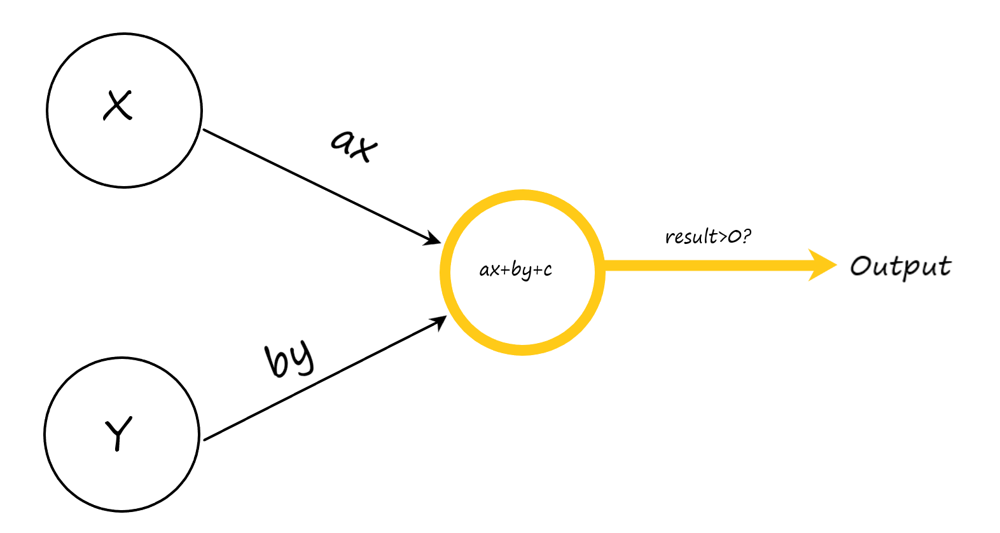
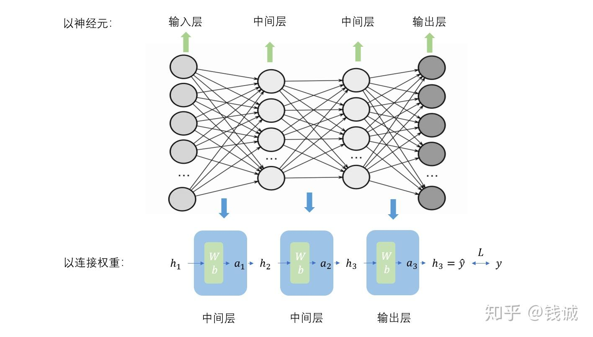
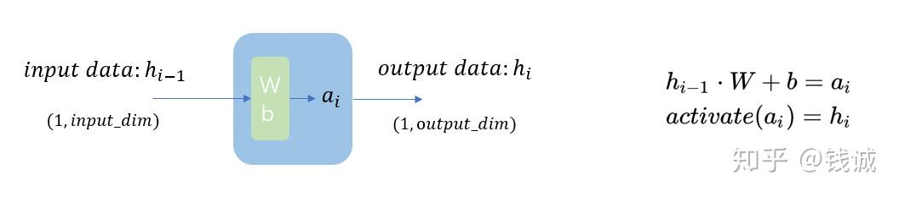
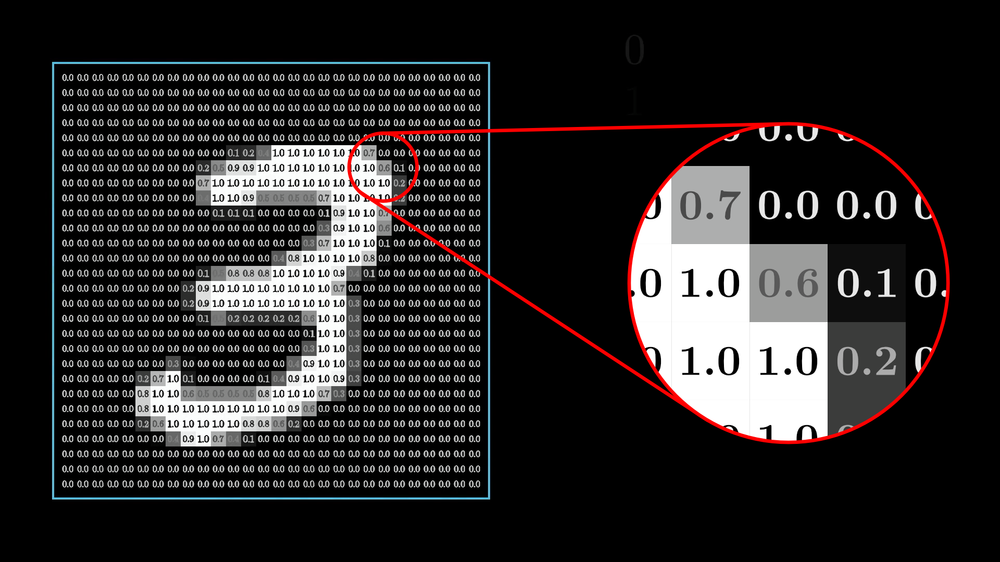
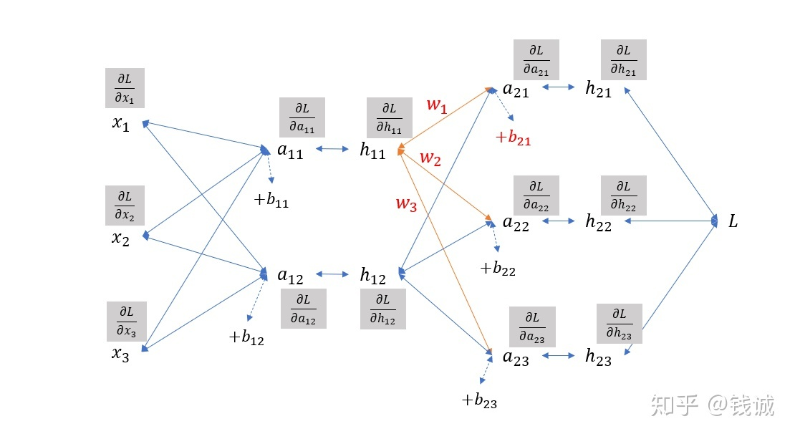

# 你的第一个神经网络

神经网络是当前机器学习领域普遍所应用的，例如可利用神经网络进行图像识别、语音识别等，从而将其拓展应用于自动驾驶汽车。它是一种高度并行的信息处理系统，具有很强的自适应学习能力，不依赖于研究对象的数学模型，对被控对象的的系统参数变化及外界干扰有很好的鲁棒性，能处理复杂的多输入、多输出非线性系统，**神经网络要解决的基本问题是分类问题** 。

我们的第一个神经网络选择 **基于 BP 误差反向传播法的 MLP 神经网络模型** 。


## 前置导引

### 朴素感知机

感知机是由美国学者 FrankRosenblatt 在 1957 年提出来的。感知机是作为神经网络（深度学习）的起源的算法。因此，学习感知机的构造也就是学习通向神经网络和深度学习的一种重要思想。
感知机接收多个输入信号，输出一个信号。这里所说的“信号”可以想象成电流或河流那样具备“流动性”的东西。像电流流过导线，向前方输送电子一样，感知机的信号也会形成流，向前方输送信息。但是，和实际的电流不同的是，感知机的信号只有“流/不流”（1/0）两种取值。这里我们认为 0 对应“不传递信号”， 1 对应“传递信号”。

!!! attention "现在是数学时间！"

    这里有很多的点，其中一部分的位置如图所示，你能找出一条直线，尽可能多的将所有的点（包括还没画出的）分开吗？对了，记得给我他的函数式。
    
    <figure markdown>
        { width="300" }
    </figure>


让我们假设这条直线的方程是 $f(x,y) = ax+by+c$，小学二年级学过的知识告诉我们，对于给出的每一个点 $（x , y）$, 代入直线方程后根据结果大小来判断他和直线的位置关系。因此，我们可以把这个过程抽象为下面的感知机：

{ width="50%" }

我们还可以把整个感知机抽象为下面的数学模型。

$$
Output = \left\{\begin{matrix} 
  Red,  f(x, y)> 0\\  
  Green,  f(x, y)< 0\end{matrix}\right.
$$

如你所见，最简单的感知机就是将输入进行处理得到中间结果，再将结果经过非线性函数处理输出。一般的，我们也把上述的模型称为 **神经元** 。

### 神经网络

神经网络的灵感取自于生物上的神经元细胞，如下图所示：


这是人体神经元的基本构成，其中树突主要用于接收其他神经元的信号，轴突用于输出该神经元的信号，数以万计的神经元相互合作，使得我们人类能够进行高级的思考，能够不断地对新事物进行学习。因此，我们就希望仿照人类神经网络的结构，搭建一种人为的神经网络结构，从而使其能够完成一些计算任务，这也是神经网络名字的由来。

神经网络中计算的基本单元是 **神经元** ，一般称作「节点」（node）或者「单元」（unit）。每个节点可以从其他节点接收输入，或者从外部源接收输入，然后计算输出。每个输入都各自的「权重」（weight，即 w），用于调节该输入对输出影响的大小，节点的结构如图所示：


其中 x1, x2 作为该节点的输入，其权重分别为 w1 和 w2。同时，还有配有「偏置 b」（bias）的输入 ，偏置的主要功能是为每一个节点提供可训练的常量值（在节点接收的正常输入以外）。

## 多层感知机

多层感知机（Multilayer Perceptron）缩写为 MLP，也称作前馈神经网络（Feedforward Neural Network）。它是一种基于神经网络的机器学习模型，通过多层非线性变换对输入数据进行高级别的抽象和分类。

在上面的例子中，我们假定了直线的方程式为 $f(x)=ax+by+c$，但如果是一些复杂的情况，我们可能无法通过简单的数学计算找到对应的函数。但与单层感知机相比，MLP 有多个隐藏层，每个隐藏层由多个神经元组成，每个神经元通过对上一层的输入进行加权和处理，再通过激活函数进行非线性映射。这样我们便可以表达这个抽象的映射关系。

### 基本结构

下图显示了一个最典型的 MLP，它包括包括三层： **输入层、隐层（全连接层）和输出层** （全连接的意思就是：上一层的任何一个神经元与下一层的所有神经元都有连接）。


 它的工作分为两部分:

- **前向传播** ：输入数据被馈送到输入层，然后传递到隐藏层，并最终生成输出层的输出。每一层的每一个神经元都会计算其加权输入和非线性激活函数的输出。

- **反向传播** ：在训练过程中，输出与期望的输出进行比较，产生一个误差值。这个误差随后被反向传播到网络中，权重得到相应的更新。

因为参与运算的各元素都是 **矩阵** ，我们可以使用 Numpy 来构造一个三层的 MLP：

```python
import numpy as np

class BPNetwork_Numpy:
    def __init__(self):
        self.weights = {
            'fc1': np.random.randn(128, 28 * 28),
            'fc2': np.random.randn(64, 128),
            'fc3': np.random.randn(10, 64)
        }
        self.biases = {
            'fc1': np.random.randn(128),
            'fc2': np.random.randn(64),
            'fc3': np.random.randn(10)
        }
```

### **为什么需要引入隐藏层？**

1. **模型复杂性和表示能力** ：隐藏层增加了网络的容量，使其能够学习并表示更复杂的函数。理论上，一个单隐藏层的神经网络可以近似任何连续函数，但在实践中，增加更多的隐藏层可以更容易（需要更少的神经元）地近似这些函数，并且可以更高效地学习。
2. **层次化特征学习** ：深度网络（有多个隐藏层的网络）可以学习层次化的特征。例如，在图像识别中，第一层可能会学习边缘和纹理，第二层可能会学习更复杂的结构（如形状或模式），以此类推。这种层次化的表示使得网络能够更有效地捕捉数据的内在结构。
3. **非线性堆叠** ：通过引入多个隐藏层并在每个层之后应用非线性激活函数，网络可以表示更复杂的非线性函数。这增加了模型对各种数据分布和关系的灵活性。
4. **降低参数数量** ：与一个非常宽的单隐藏层相比，深度结构可以用较少的总参数来实现同样的模型容量。这可以提高计算效率，并可能减少过拟合的风险。
5. **实际成功案例** ：在许多实际的机器学习任务中，深度神经网络（带有多个隐藏层）已经表现出比浅层网络更好的性能。例如，深度学习模型已经在图像识别、语音识别、机器翻译等任务中取得了突破性的结果。

总的来说，隐藏层提供了网络更多的能力和灵活性来学习和逼近复杂的关系和数据结构。当然，引入太多的隐藏层和神经元也可能导致模型的过拟合，因此需要采用适当的正则化策略来平衡模型的容量和训练数据的数量。

### 计算方式

让我们把上面的 MLP 细节化：



在一般情况下，参与运算的各元素都是 **矩阵**，其中的蓝色方块代表着 **激活函数**，绿色方块代表着 **权重 Weight** 和 **偏置 Bias** 。需要注意的是， ***权重和偏置对应上图中不同神经元的连线***，例如 1-> 3 和 1-> 4 的参数不同。详细计算方式如下图及下式：



**在分类问题中，最后的输出层元素个数一般等于分类数目，最终的结果代表着该输入被这个 MLP 分为某一类的可能性大小，指越大，代表越可能属于该类。为了便于观测，我们通常使用 softmax 函数将将上一层的原始数据进行归一化，转化为一个$(0,1)$之间的数值，这些数值可以被当做概率分布，用来作为多分类的目标预测值。**


同样的，我们可以使用 Numpy 帮我们完成计算（向前传播）部分：

```python
 def forward(self, x):
        x = x.flatten()
        self.layer1_output = np.dot(self.weights['fc1'], x) + self.biases['fc1']
        self.layer1_activation = np.maximum(0, self.layer1_output)
        self.layer2_output = np.dot(self.weights['fc2'], self.layer1_activation) + self.biases['fc2']
        self.layer2_activation = np.maximum(0, self.layer2_output)
        self.layer3_output = np.dot(self.weights['fc3'], self.layer2_activation) + self.biases['fc3']
        return np.softmax(self.layer3_output)
```

其中，np.dot()函数提供了矩阵乘法，np.maximum()作为我们的激活函数，最后的 np.softmax()用来输出数据转化为概率，方便我们观测结果。

### 激活函数

!!! question "什么？你有问题？"
	“*到这里，可能有同学要问了，为什么要有激活函数？（上图中的* *f(x)* *，引例中的* *是否大于 0* *）*”  
    
	“谁问你了（×”
	
	“我们来看下面这幅图片，对于下面这样更偏向于现实的情况，你还能找出一条 **直线**，尽可能多的将所有的点（包括还没画出的）分开吗？”
	
	{ width="50%" }

很明显，直线是无法做到的，也就意味着，***仅有线性函数无法处理复杂问题***。使用激活函数，能够给神经元引入非线性因素，使得神经网络增加了模型的表示能力，能够捕捉到数据中更复杂的模式和关系，这样神经网络就可以利用到更多的现实复杂模型中。

{ width="67%" }

其次，处理复杂问题时，仅靠一个神经元是远远不够的，我们更多的是使用多层感知机，不妨来看下面的推导：


$$
\begin{align}
&f_1(x)  = a_1x+b_1\\
&f_2(x)  = a_2f_1(x)+b_2\\
&f_i(x)  = a_if_{i-1} (x)+bi\\
&其中的 f(x)均为线性函数，由数学归纳法可得 n 层感知机的输出\\
& \left\{\begin{matrix} 
Bias = \sum_{k = 1}^{n}\prod_{j = 1}^{k-1}a_j \cdot b_k  \\
Weight = \prod_{k = 1}^{n}a_{k}\\
Output = Weight \cdot x + Bias
\end{matrix}\right.    
\end{align}
$$

我们可以看到最后的 Output 表达式和一个神经元的别无两样，因此 ***如果不使用激活函数，每一层输出都是上层输入的线性函数，无论神经网络有多少层，输出都是输入的线性组合。***

常见的激活函数我们会在另一章节详细讲解。

## 图片的另一种形态

了解了什么是 MLP，每一层如何计算，输出是怎么样的，我们再来思考一下输入，如何把一张图片塞到计算机中？

!!! question "从 misc 看图片"
    如果让你向一位视力障碍人来描述一幅图片，你会怎样去描述它？物体和他们的属性、风格、情感、布局

    如果是想计算机呢，你又该怎么去描述它？

每一张图片，我们都可以看作是几个二维矩阵的叠加（ARGB-4 个，RGB-3 个，L-1 个），如下图这张黑白图片所示，每个 x，y 所对应的点都具有自己的值，我们通过归一化将他们从 0-255 整型数映射到 0.0-1.0 的浮点数，颜色越淡（白），值越大。这样，我们可以把每一张图片拆为一个 n 维矩阵。通过这样的方式，我们可以把我们的视觉和计算机的数据联系起来，然后通过一些方式进行计算。



因此对于一张 28 * 28 的灰度图像，我们可以将他* *展平 flatten* *为一个 28 * 28 = 784 个元素的矩阵

{: style='width: 100%'}

紧接着，用我们上面讲到的知识，将这个矩阵放到 MLP 中进行计算，得到最后的输出，选择最大值的下标作为它的预测结果。下图中亮起的神经元代表某次计算中，输出经过激活函数后激活了。


<video style="width: 100%" muted="" controls="" alt="type:video">
   <source src="../assets/network-propagation.mp4" type="video/mp4">
</video>

!!! note "骚话环节"

    怎么样？经过可视化后，现在是不是好理解多了？那快夸夸 Cain 宝（×

## BP 误差反向传播法

!!! question "如何训练呢？"

	“那么我该如何训练我自己的 MLP 呢？”
	
	“谁问你了...”
	
	“我问的！（举手”

下图简要的展示了反向传播算法的核心概念，大致来说：**通过比较现实输出与期望输出之间的差异，根据差异来反向更新每一层的参数，从而使现实输出更加贴近于期望输出。**


!!! quote "多一行公式，少一个观众"

	~~为什么要大致的说呢，因为我猜下面的推导没有人看（bushi~~

### 数学推导过程

损失对参数梯度的反向传播可以被这样直观解释：由 A 到传播 B，即由 $\partial L/\partial A$ 得到 $\partial L/\partial B$ ，由导数链式法则 $\partial L/\partial B=(\partial L/\partial A)\cdot(\partial A/\partial B)$。所以神经网络的 BP 就是通过链式法则求出 $L$ 对所有参数梯度的过程。

如下图示例，输入 $x$ ，经过网络的参数 $w,b$ ，得到一系列中间结果 $a,h$ 。



 $a$ 表示通过权重和偏置的结果，还未经过激活函数， ℎ 表示经过激活函数后的结果。灰色框内表示 $L$ 对各中间计算结果的梯度，这些梯度的反向传播有两类：

- 由 $h$到$a$ ，通过激活函数，如右上角

$$
\begin{aligned}\frac{\partial l}{\partial a_{21}}&=\frac{\partial l}{\partial h_{21}}\cdot\frac{\partial h_{21}}{\partial a_{21}}=\frac{\partial l}{\partial h_{21}}\cdot activate'(a_{21})\end{aligned}
$$

- 由到$a$到$h$  ，通过权重，如橙线部分
  $$
  \begin{gathered}
  L = f(a_{21}, a_{22}, a_{23}) \\
  \frac{\partial L}{\partial h_{11}}=\frac{\partial L}{\partial a_{21}}\frac{\partial a_{21}}{\partial h_{11}}+\frac{\partial L}{\partial a_{22}}\frac{\partial a_{22}}{\partial h_{11}}+\frac{\partial L}{\partial a_{23}}\frac{\partial a_{23}}{\partial h_{11}} \\
  \frac{\partial L}{\partial h_{11}}=\frac{\partial L}{\partial a_{21}}w_{1}+\frac{\partial L}{\partial a_{22}}w_{2}+\frac{\partial L}{\partial a_{23}}w_{3} 
  \end{gathered}
  $$
  可以看出梯度的传播和前向传播的模式是一致的，只是方向不同。

  计算完了灰色框的部分（损失对中间结果 $a,h$ 的梯度），损失对参数 $w,b$ 的梯度也就显而易见了，以图中红色的 $w_1$ 和 $b_{21}$ 为例：
  $$
  \begin{aligned}\frac{\partial L}{\partial w_1}&=\frac{\partial L}{\partial a_{21}}\cdot\frac{\partial a_{21}}{\partial w_1}=\frac{\partial L}{\partial a_{21}}\cdot h_{11}\\\\\frac{\partial L}{\partial b_{21}}&=\frac{\partial L}{\partial a_{21}}\cdot\frac{\partial a_{21}}{\partial b_{21}}=\frac{\partial L}{\partial a_{21}}\end{aligned}
  $$

  因此，我们可以如下图，将反向传播的表达式和代码如下。


输出层的反向传播略有不同，因为在分类任务中输出层若用到 softmax 激活函数， $a$  到 $h$ 不是逐个对应的，如下图所示，因此 $\partial L/\partial B=(\partial L/\partial A)\cdot(\partial A/\partial B)$ 中的 element-wise 相乘是失效的，需要用 $\partial L/\partial h$ 乘以向量 $h$ 到向量  $a$ 的向量梯度（雅可比矩阵）。


但实际上，**经过看上去复杂的计算后输出层 $\partial L/\partial h$ 会计算出一个非常简洁的结果: $h - y $**

- 以分类任务为例（交叉熵损失、softmax、训练标签 $y$ 为 one-hot 向量其中第 $k$​ 维为 1）：

    $$
    \begin{gather*}
      L =-\sum_{i = 1}^ny_i\log h_i\\
      \frac{\partial L}{\partial\mathrm{a}}= [\frac{\partial L}{\partial h_1}\frac{\partial L}{\partial h_2}\ldots\frac{\partial L}{\partial h_n}]\cdot\begin{bmatrix}\partial h_1/\partial a_1&\partial h_1/\partial a_2&\ldots\partial h_1/\partial a_n\\\partial h_2/\partial a_1&\partial h_2/\partial a_2&\ldots\partial h_2/\partial a_n\\\ldots\\\partial h_n/\partial a_1&\partial h_n/\partial a_2&\ldots\partial h_n/\partial a_n\end{bmatrix}\\\\
      \left.\frac{\partial L}{\partial\mathrm{a}}= [0,\ldots,-\frac{1}{h_k},\ldots,0]\cdot\left [\begin{matrix}h_1(1-h_1)&-h_1h_2&\ldots&-h_1h_n\\h_2h_1&h_2(1-h_2)&\ldots&-h_2h_n\\\ldots\\h_nh_1&-h_nh_2&\ldots&h_n(1-h_n)\end{matrix}\right.\right]\\
      \dfrac{\partial L}{\partial\text{a}}=-\dfrac{1}{h_k}\cdot [\begin{matrix}-h_kh_1&-h_kh_2&\ldots&h_k(1-h_k)&\ldots&-h_kh_n\end{matrix}]\\
      \dfrac{\partial L}{\partial\text{a}}= [h_1, h_2,\ldots, h_n]-[0,\ldots,1,\ldots,0] = h-y
      \\
      \end{gather*}
    $$

- 以回归任务为例（二次损失、线性激活、训练标签 $y$ 为实数向量）：
    $$
     \begin{gather*}
       L = 1/2\cdot||h-y||_2^2\\\\
       \frac{\partial L}{\partial\mathrm{a}}=\frac{\partial L}{\partial h}= h-y
       \end{gather*}
    $$

### 底层实现

同样的，用 numpy 来实现底层的算法，在下面的例子中，我们选择 ReLU 函数作为激活函数：

```python
    def backward(self, x, y):
        # 计算输出层的梯度
        one_hot_y = np.zeros_like(self.layer3_output)
        one_hot_y[y] = 1
        delta3 = self.layer3_output - one_hot_y

        # 计算第二隐藏层的梯度
        delta2 = np.dot(self.weights['fc3'].T, delta3)
        delta2[self.layer2_output <= 0] = 0  # ReLU的导数

        # 计算第一隐藏层的梯度
        delta1 = np.dot(self.weights['fc2'].T, delta2)
        delta1[self.layer1_output <= 0] = 0  # ReLU的导数

        # 计算权重和偏置项的梯度
        dW3 = np.outer(delta3, self.layer2_activation)
        db3 = delta3
        dW2 = np.outer(delta2, self.layer1_activation)
        db2 = delta2
        dW1 = np.outer(delta1, x.flatten())
        db1 = delta1

        # 更新权重和偏置项
        learning_rate = 0.01
        self.weights['fc3'] -= learning_rate * dW3
        self.biases['fc3'] -= learning_rate * db3
        self.weights['fc2'] -= learning_rate * dW2
        self.biases['fc2'] -= learning_rate * db2
        self.weights['fc1'] -= learning_rate * dW1
        self.biases['fc1'] -= learning_rate * db1
```

## MNIST 数据集

!!! quote "越老越妖"
	为什么这次的例子中输入都是 $28*28=784$ 的？为什么是黑白图片，常规的图片不是有三至四个维度吗？

就像无数人从敲下“Hello World”开始代码之旅一样，许多研究员从“MNIST 数据集”开启了人工智能的探索之路。

**MNIST 数据集**（Mixed National Institute of Standards and Technology database）来自美国国家标准与技术研究所，训练集 (training set) 由来自 250 个不同人手写的数字构成, 其中 50% 是高中学生, 50% 来自人口普查局 (the Census Bureau) 的工作人员. 测试集(test set) 也是同样比例的手写数字数据。是一个用来训练各种图像处理系统的二进制图像数据集，广泛应用于机器学习中的训练和测试。作为一个入门级的计算机视觉数据集，发布 20 多年来，它已经被无数机器学习入门者“咀嚼”千万遍，是最受欢迎的深度学习数据集之一。


整个数据集包含两部分，**训练集** 和 **测试集**。训练集 60000 张图像，其中 30000 张来自 NIST 的 Special Database 3，30000 张来自 NIST 的 Special Database 1；测试集 10000 张图像，其中 5000 张来自 NIST 的 Special Database 3，5000 张来自 NIST 的 Special Database 1。

MNIST 原始的 Special Database 3 数据集和 Special Database 1 数据集均是二值图像，MNIST 从这两个数据集中取出图像后，通过图像处理方法使得每张图像都变成 28 × 28 大小的灰度图像，且手写数字在图像中居中显示。


## Pytorch 实现与解析

!!! Tip "终于"   
	上述所有原理看懂了吗？~~没看懂也没事（×~~

	抱着不求甚解的态度来学习在 python 中怎么使用吧，下面就是你擅长的部分了
	
	什么？！你代码也写不好？女孩子请找我，我来教你写；男孩子也可以来找我，我给你一拳，没用的东西


下面的代码使用 **pytorch** 构造了一个简单的三层（784 --> 128 --> 64 --> 10）MLP，使用了 ReLU 作为激活函数，最后一层通过 softmax 进行归一化，转化为概率分布，我们将依靠 MNIST 这个著名的数据集对它进行训练，并测试我们的模型效果。


```python
import torch
import torch.nn as nn
from torch.optim import Adam
from torchvision import datasets,transforms
from torch.utils.data import DataLoader
import numpy as np

BATCH_SIZE = 64		#设置每一批的大小
EPOCHS = 5		#设置训练轮数
DEVICE = torch.device("cuda" if torch.cuda.is_available() else "cpu")		#确定是否有可用的CUDA设备

#定义一个BPNet类，它继承于nn.Module类，nn.Module是pytorch给出的默认神经网络类
class MLP(nn.Module):		
    def __init__(self):		#定义类对象实例化方法
        super().__init__()		#初始化神经网络
        #定义类的接口函数，使用nn.Sequential将操作合并到一起
        self.classifier = nn.Sequential(
            nn.Linear(28 * 28, 128),		#放入了一个全连接层，从28*28—>128，28*28是图像大小
            nn.ReLU(inplace=True),			#放入了一个ReLU激活函数，inplace=True节省显存
            nn.Linear(128, 64),				#放入了一个全连接层，从128—>64，128是上层大小
            nn.ReLU(inplace=True),			#放入了一个ReLU激活函数
            nn.Linear(64, 10)				#放入了一个全连接层，从64—>10，64是上层大小
        )
    #forward函数定义该神经如何处理数据，也就是数据如何在网络中前进
    def forward(self, x):
        x = torch.flatten(x,1)		#首先将x展平为一维数组
        x = self.classifier(x)		#将x放入上面定义的函数中
        x = torch.softmax(x, dim=1)           #将x进行归一化处理，转换为概率分布
        return x
   
     
#定义训练神经网络模型的代码
def train(model):
    
    #使用pytorch框架给出的接口datasets，创建一个MNIST数据集
    train_dataset = datasets.MNIST(root=r'data',		#root指明文件存储位置 
                                train=True,		#train代表是否是训练集 
                                transform=transforms.ToTensor(),		#transform表明数据集的数据应该如何处理
                                download=True)		#download表明是否运行下载
    #使用pytorch框架给出的接口DataLoader，将数据集载入    
    train_loader = DataLoader(dataset=train_dataset,		#dataset指明数据集
                            batch_size=BATCH_SIZE,		#batch_size指明批大小
                            shuffle=True)		#shuffle指明是否需要打乱
    
    #实例化一个Adam优化器，用来对数据进行优化
    optimizer = Adam(model.parameters(), lr=0.05)		#第一个参数指明需要被优化的数据是模型的参数，lr指明了学习率
    criterion = nn.CrossEntropyLoss()		#指明误差计算方式，这里使用交叉熵损失  
    model.train()		#可以先理解为：训练模式，启动！（启用 Batch Normalization 和 Dropout）

    #训练EPOCHS这么多轮（话说是不是es
    for epoch in range(EPOCHS):
        #使用enumerate对train_loader进行迭代
        for index, (data, target) in enumerate(train_loader):

            data, target = data.to(DEVICE), target.to(DEVICE)		#将数据和真实标签部署在选定的设备上，加快运算速度
            optimizer.zero_grad()		#每次训练前要先将梯度归零

            pred = model(data)		#使用现在的模型得到现实输出
            loss = criterion(pred, target)		#计算现实输出和期望输出之间的误差

            loss.backward()		#反向传播计算得到每个参数的梯度值
            optimizer.step()		#梯度下降执行一步参数更新

            #每到一定阶段就打印目前训练进度以及相关信息，下面代码是print(f"")格式化输出，看不懂就把代码跑起来一看就懂
            if index % 100 == 0:
                print(f'Train Epoch: {epoch} [{index * len(data)}/{len(train_loader)} ({(100. * index / len(train_loader)):.0f}%)]\tLoss: {loss.item():.6f}')


    model.eval()		#训练结束（不启用 Batch Normalization 和 Dropout）
    torch.save(model.state_dict(),"MLP.pth")		#保存模型（仅保存参数）

    
#定义校验模型效果的代码
def test(model):
	#如果你问我这里为什么没注释我就梆梆给你两拳你自己看看上面写的什么气死我了我再梆梆给你两拳自己往上翻读代码去
    test_dataset = datasets.MNIST(root='data',
                            train=False,
                            transform=transforms.ToTensor(),
                            download=True)
    test_loader = DataLoader(dataset=test_dataset,
                            batch_size=BATCH_SIZE,
                            shuffle=False)
    total = 0		#总计
    correct = 0		#正确
    
    #和训练一样，使用enumerate对test_loader进行迭代
    for index, (data, target) in enumerate(test_loader):
        data, target = data.to(DEVICE), target.to(DEVICE)

        pred = model(data)
        correct += (torch.argmax(pred, dim=1) == target).sum()		#检测预测是否正确，因为是批处理，所以求和
        total += pred.size(0)

    print("Correct : ",correct,'/',total,sep='')
    print('Accuracy : ',float(correct)/float(total) * 100. ,"%",sep='')
             
    
    
#通过main函数调用个函数及方法    
if __name__ == "__main__":
    model = MLP().to(DEVICE)		#在指定的设备（cpu或者gpu）上将模型实例化
    train(model)
    test(model)

```


