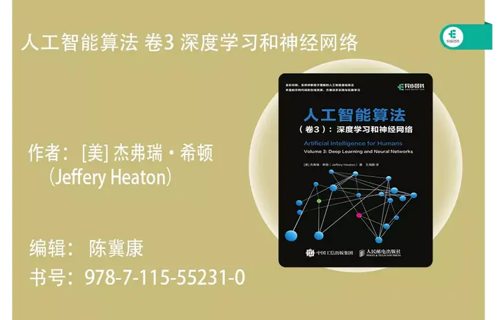

# 什么是人工智能

## 概述

> " **人工智能**（英语：artificial intelligence，缩写为 **AI** ）亦称 **机器智能** ，指由人制造出来的机器所表现出来的[智能](https://zh.wikipedia.org/wiki/智慧)。通常人工智能是指通过普通计算机程序来呈现人类智能的技术。该词也指出研究这样的智能系统是否能够实现，以及如何实现。同时，通过[医学](https://zh.wikipedia.org/wiki/醫學)、[神经科学](https://zh.wikipedia.org/wiki/神經科學)、[机器人学](https://zh.wikipedia.org/wiki/机器人学)及[统计学](https://zh.wikipedia.org/wiki/統計學)等的进步，常态预测则认为人类的很多职业也逐渐被其取代。"   
--维基百科

人工智能这个词的出现最早可以追溯至1956年的达特茅斯会议。  
1956年8月，在美国汉诺斯小镇的达特茅斯学院，以约翰·麦卡锡（John McCarthy）、马文·明斯基（Marvin Minsky）、克劳德·香农（Claude Shannon）、艾伦·纽厄尔（Allen Newell）、赫伯特·西蒙（Herbert Simon）等为首的科学家们相聚在一起，讨论如何让机器模拟人类的学习能力，并在此次会议中正式提出了“人工智能”这个概念。

事实上，直到现在人工智能都没有一个非常明确且统一的定义。如果让我用一两句话来描述，我会说：“让机器明白人类的世界，或者我的意思是，让思想可以被数学描述。”（~~哦我的上帝这该死的翻译腔~~。是的，人工智能的本质就是去找到一些数学方法，将现实世界中人能感知的事物，人能做出的决策普适化、信息化，接着让机器学习这种方法，从而使得机器具有了智能。

## AI安全

!!! quote "众所周知"
    *“科技就像一把双刃剑，既有利也有弊” —— 人教版 《道德与法治》八年级上册*

随着OpenAI掀起的这场大模型狂潮中，人工智能这个“旧时王谢堂前燕”也已经“飞入寻常百姓家”。越来越多的优秀的人工智能赛题出现在CTF比赛中，我把他们分成这样几类：

**数据投毒**

  给出训练数据集，期望在题目要求的限定条件下进行修改，导致模型性能大幅度下降或失效。

**对抗样本**

​		给出一个数据和一个模型，期望在题目要求的限定条件下对数据进行修改，导致该模型对图片的分类失败。

**逆向工程**

  给出一个模型和输出，期望通过模型结构等神经网络特性逆向还原输出。

**模型应用**

  给出输入数据和部分参数，期望通过搭建合适的模型结构来完成任务。

**后门模型**

  给出一个模型，在题目要求的限制条件下，判断该模型是否存在后门，还原对应标签和触发器，并且试图在不训练、不影响模型性能情况下对该模型进行修复。

**数据篡改和评估**

  给出一些数据，期望通过算法构造一个判别器，判断数据是否来源于真实世界。

**模型窃取**

  给出一个模型的接口，期望通过交互，训练一个模型来窃取目标模型的性能与结构。

- 等等等等

!!! note "Cain宝の碎碎念"  
    在之后的内容，我会用自己的微薄的知识，结合自己学习的特点与理解（指抽象的比喻×），帮助师傅们入门AI安全，如果有任何内容有误或表述不清的地方，请及时联系我和探姬，我们会第一时间更正。最后，欢迎加入N0wayBack喵\~关注wx公众号喵\~欢迎投送简历喵~

## 如何学习

!!! Success "好耶"  
    ~~😆好的，我们先来学习线性代数和泛函空间吧~~ 

在之后的章节中我会将重点放到 ***应用*** 而不是原理，但是就如同密码学一般，人工智能底层的数学原理是简约、美丽、令人着迷的。本着“多一个公式，少十个观众”的原理，因此我会在尽可能少涉及原理的基础上，采取直观和可视化的方式帮助大家学习。此外，相比于书本，我更推荐 **视频+代码** 的学习方式，更多的动手实践和可视化对于这些日新月异的技术，会比书上既古板又晦涩难懂的文字好懂不少。

### 关于教材

如果你还是想看纸质书学习原理，那么你应该参考以下的基本教材：

- 《线性代数》（国内教材好像大多数没什么区别，要是看国外的岂不是还要多两本46级英语词汇×

  

- 《深度学习》

- 《人工智能算法系列》

### 关于框架

现在主流的深度学习框架主要有下面几种：

#### **PyTorch**

  - **主要维护方：** Facebook
  - **支持的语言：** C/C++/Python
  - **GitHub源码地址：** [https://github.com/pytorch/pytorch](https://link.zhihu.com/?target=https%3A//github.com/pytorch/pytorch)

  PyTorch是Facebook团队于2017年1月发布的一个深度学习框架，虽然晚于TensorFlow、Keras等框架，**但自发布之日起，其受到的关注度就在不断上升**，目前在GitHub上的热度已经超过Theano、Caffe、MXNet等框架。

  Pytorch是基于用Lua编写的Torch库的Python实现的深度学习库，目前被广泛应用于学术界和工业界，随着Caffe2项目并入Pytorch，也稳固了Pytorch ***\*紧追并迫近\**** TensorFlow在深度学习应用框架领域的地位。

  Pytorch库足够简单，跟NumPy，SciPy等可以无缝连接，而且基于tensor的GPU加速非常给力

  Pytorch是基于训练网络迭代的核心-梯度的计算，Autograd架构（借鉴于Chainer），在Pytorch，我们可以动态的设计网络，而无需笨拙的定义静态网络图，**基于简单，灵活的设计，Pytorch快速成为了学术界的主流深度学习框架。**

  不过现在，如果稍微深入的了解TensorFlow和Pytorch，就会发现他们越来越像：TF加入了动态图架构，Pytorch致力于其在 ***\*工业界更加易用\**** 。打开各自的官网，你也会发现文档风格也越发的相似。

  

#### **TensorFlow**

  - **主要维护方：** Google

  - **支持的语言：** C++/Python/Java/R 等

  - **GitHub源码地址：** [tensorflow/tensorflow: An Open Source Machine Learning Framework for Everyone (github.com)](https://github.com/tensorflow/tensorflow)

  当进入AI时，你会听到的第一个框架之一就是Google的TensorFlow。

  TensorFlow是 谷歌基于DistBelief进行研发的第二代 人工智能 学习系统，其命名来源于本身的运行原理。Tensor（张量）意味着N维数组，Flow（流）意味着基于数据流图的计算，TensorFlow为张量从流图的一端流动到另一端计算过程。

  TensorFlow编程接口支持Python、C++、Java、Go、R和Haskell API的alpha版本。此外，TensorFlow还可在GoogleCloud和AWS中运行。TensorFlow还支持 Windows 7、Windows 10和Windows Server 2016。由于TensorFlow使用C++ Eigen库，所以库可在ARM架构上编译和优化。这也就意味着用户可以在各种服务器和移动设备上部署自己的训练模型，无须执行单独的模型解码器或者加载Python解释器。

  TensorFlow编程入门难度较大。初学者需要仔细考虑神经网络的架构，正确评估输入和输出数据的维度和数量。

  TensorFlow的学习曲线太过陡峭，直接使用底层的深度学习的API，需要不断练习、探索社区并继续阅读文章来掌握TensorFlow的诀窍, 入门的门槛较高。

  TensorFlow使用静态计算图进行操作。也就是说，我们需要先定义图形，然后运行计算，如果我们需要对架构进行更改，则需要重新训练模型。选择这样的方法是为了提高效率，但是许多现代神经网络工具已经能够在学习过程中改进，并且不会显著降低学习速度。在这方面，TensorFlow的主要竞争对手是PyTorch。

  

#### **PaddlePaddle**

  - **主要维护方：** Baidu
  - **支持的语言：** C++/Python
  - **GitHub源码地址：** [https://github.com/PaddlePaddle/Paddle/](https://link.zhihu.com/?target=https%3A//github.com/PaddlePaddle/Paddle/)

  PaddlePaddle是由百度自主开发的开源深度学习框架，近期发现有了中文名字，飞桨。

  PaddlePaddle飞桨刚发布的时候，并不被看好，感觉更像是Google有，百度也要有的腔调。

  PaddlePaddle飞浆在功能上，同时支持动态图和静态图，能方便的调试模型，方便的部署，非常适合业务应用的落地实现。

  PaddlePaddle飞桨也已经支持数百个节点的高效并行训练。可以说在过去几年的时间里，深度学习领域在大规模的落地应用，各家框架也都在快速的发展，但是百度的PaddlePaddle看来是这个阶段发展更快的框架，甚至是发展更快的AI开发生态。

  PaddlePaddle飞浆的文档与社区对于英语小白来说更加友好。

  

#### **Keras**

  - **主要维护方：** Google
  - **支持的语言：** Python/R
  - **GitHub源码地址：** [https://github.com/keras-team/keras](https://link.zhihu.com/?target=https%3A//github.com/keras-team/keras)

  Keras被认为是最酷的Python深度学习库之一，高度模块化，搭建网络非常简洁。

  Keras提供了非常简明的机制来表达神经网络结构。它也提供了许多非常棒的工具用于神经网络模型的编译、数据的处理、以及网络结构的可视化等等。

  Keras本质上是对Tensorflow、Theano等基础框架作进一步的封装，以提供统一的、简化的API来简化神经网络的构建与训练。

  

#### **Caffe**

  - **主要维护方：** BVLC
  - **支持的语言：** C++/Python/Matlab
  - **GitHub源码地址：** [https://github.com/BVLC/caffe](https://link.zhihu.com/?target=https%3A//github.com/BVLC/caffe)

  Caffe，全称Convolutional Architecture for Fast Feature Embedding，是一个兼具表达性、速度和思维模块化的深度学习框架。由伯克利人工智能研究小组和伯克利视觉和学习中心开发。虽然其内核是用C++编写的，但Caffe有Python和Matlab 相关接口。

  Caffe来自与学院派，重在专业性，因此在可用性方面和通用性方面有点欠缺。

  Caffe 最老牌的框架之一，而是老牌中的老牌。 Caffe 有非常好的特性，但也有一些小缺点。起初的时候它并不是一个通用框架，而仅仅关注计算机视觉。

  Caffe 的缺点是它不够灵活。如果你想给它来一点新改变，那你就需要使用 C++ 和 CUDA 编程，不过你也可以使用 Python 或 Matlab 接口进行一些小改变。 Caffe 的文档非常贫乏。你需要花大量时间检查代码才能理解它，Caffe 的最大缺点之一是它的安装。它需要解决大量的依赖包。

  

#### **MXNet**

  - **主要维护方：** DMLC
  - **支持的语言：** C++/Python/R等
  - **GitHub源码地址：** [https://github.com/apache/incubator-mxnet](https://link.zhihu.com/?target=https%3A//github.com/apache/incubator-mxnet)

  MXNet 是亚马逊（Amazon）选择的深度学习库。它拥有类似于 Theano 和 TensorFlow 的数据流图，为多 GPU 配置提供了良好的配置，有着类似于 Lasagne 和 Blocks 更高级别的模型构建块，并且可以在你可以想象的任何硬件上运行（包括手机）。对 Python 的支持只是其冰山一角—MXNet 同样提供了对 R、Julia、C++、Scala、Matlab，和 Javascript 的接口

  MXNet 是一款设计为效率和灵活性的深度学习框架。它允许你混合符号编程和命令式编程，从而最大限度提高效率和生产力。在其核心是一个动态的依赖调度，它能够自动并行符号和命令的操作。

  MXNet有一个图形优化层，使得符号执行速度快，内存使用高效。这个库便携，轻量，而且能够扩展到多个 GPU 和多台机器。

#### **Theano** 
  - **主要维护方：** UdeM
  - **支持的语言：** Python
  - **GitHub源码地址：** [https://github.com/Theano/Theano](https://link.zhihu.com/?target=https%3A//github.com/Theano/Theano)

#### **CNTK**

  - **主要维护方：** Microsoft
  - **支持的语言：** C++/Python/C#/.NET/Java/R
  - **GitHub源码地址：** [https://github.com/Microsoft/CNTK](https://link.zhihu.com/?target=https%3A//github.com/Microsoft/CNTK)

#### **Deeplearning4j**

  - **主要维护方：** Eclipse
  - **支持的语言：** Java/Scala等

  - **GitHub源码地址：** [https://github.com/eclipse/deeplearning4j](https://link.zhihu.com/?target=https%3A//github.com/eclipse/deeplearning4j)

#### **ONNX**
  - **主要维护方：** Microsoft/ Facebook
  - **支持的语言：** Python/R
  - **GitHub源码地址：** [https://github.com/onnx/onnx](https://link.zhihu.com/?target=https%3A//github.com/onnx/onnx)

#### 如何选择？

!!! question "猜对了有奖励，猜错了有惩罚（喜"
    “所以我应该选择什么框架呢？”

​	“Cain宝写这么多肯定意味就是想告诉我们权衡利弊，自己决定啦！”

​	“好！我看网上说TensorFlow不错，我去下载框架了”

​	“嗯嗯！我看Keras不错，我去试试”

​	*（一段时间过后......）*

​	“我靠，TensorFlow这么难写，好多奇奇怪怪的报错！”

​	“Keras也是，我快改吐了。”

​	“哎，等等，你看Cain宝下面说的这句话：***之后的所有内容我都会基于PyTorch框架去实现，大家可以先和我一起入门，融会贯通后基于需求去更改***

​	“。。。那我没挂代理下了两天不是白费了。。。啊啊啊啊啊啊啊啊啊”

对我来说，其实不同的框架对于我们学生的区别是微乎其微的，更多的问题在于找到一个自己能熟练操作的框架，以及 ***大家都在使用的**（~~变成了比赛和论文的样子~~*。在我的印象里，17-19年的论文，多基于TensorFlow；19-20年更多的是Keras；但现在，越来越多的论文基于PyTorch。

### 关于显卡

显卡所提供的算力对于模型训练是锦上添花的，但是对于CTF来说，没有科研中更多的实验、训练等算力要求，所以我的评价是：“如果你很穷，那就别买，这并不会影响你学习；如果你有钱，那就买，更多的做实验，别让显卡吃灰；如果你很有钱，请联系我，送我一张（伸手”

