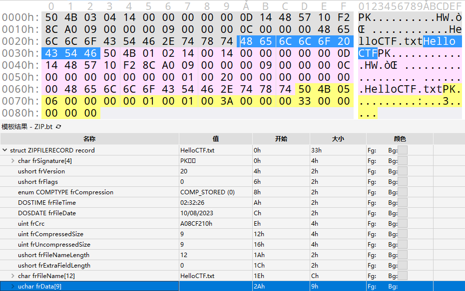
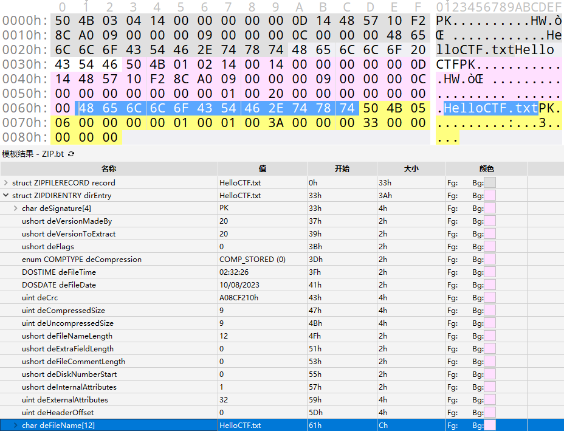
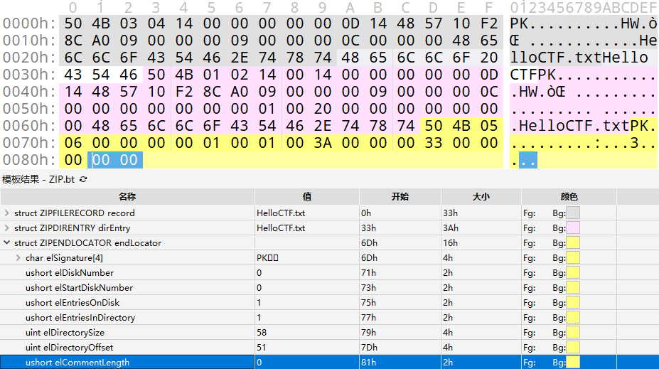
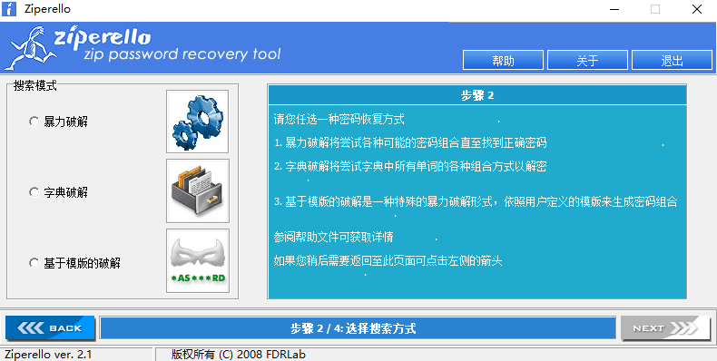

# 压缩包

## 文件结构

### .Zip

一个 ZIP 文件由三个部分组成:

**\+ 压缩源文件数据区**

{ width="85%" }  
 \- `local file header` 由固定值 `50 4B 03 04` 即 .zip 文件的魔法数字作为开始。  
 \- `file data` 记录相应压缩文件的数据  
 \- `data descriptor` 数据描述符用于标识该文件压缩结束，该结构只有在相应的 `local file header` 中通用标记字段的第 `3 bit` 设为 `1` 时才会出现，紧接在压缩文件源数据后。  
**\+ 压缩源文件目录区**

{ width="85%" }  
 \- `Central directory` 记录了压缩文件的目录信息，在这个数据区中每一条纪录对应在压缩源文件数据区中的一条数据。  
**\+ 压缩源文件目录结束标志**

{ width="85%" }  
 \- `End of central directory record(EOCD)` 目录结束标识存在于整个归档包的结尾，用于标记压缩的目录数据的结束。每个压缩文件必须有且只有一个 `EOCD` 记录。  

具体详细的结构可以参考下面 010Editor .zip 模板对照表.

??? note "010Editor .zip 模板对照表"
    ```
    + ZIPFILERECORD record # 压缩源文件数据区
        - char frSignature[4] # 压缩源文件标志
        - ushort frVersion # 压缩源文件版本
        - ushort frFlags # 压缩源文件标志 （有无加密，这个更改这里进行伪加密，改为01 00打开就会提示有密码了）
        - enum COMPTYPE frCompression 
        - DOSTIME frFileTime # 压缩源文件时间
        - DOSDATE frFileDate # 压缩源文件日期
        - uint frCrc # 压缩源文件CRC32校验值
        - uint frCompressedSize # 压缩源文件压缩后大小
        - uint frUncompressedSize # 压缩源文件压缩前大小
        - ushort frFileNameLength # 压缩源文件名长度
        - ushort frExtraFieldLength # 压缩源文件扩展域长度
        - char frFileName[frFileNameLength] # 压缩源文件名
        - uchar frData[frCompressedSize] # 压缩源文件数据
    + ZIPDIRENTRY dirEntry # 压缩源文件目录区
        - char deSignature[4] # 目录标志
        - ushort deVersionMadeBy # 创建该条目的版本
        - ushort deVersionNeeded # 解压该条目所需的版本
        - ushort deFlags # 标志位 
        - enum COMPTYPE deCompression # 压缩方法
        - DOSTIME deFileTime # 最后修改时间
        - DOSDATE deFileDate # 最后修改日期
        - uint deCrc # CRC32校验值
        - uint deCompressedSize # 压缩后的大小
        - uint deUncompressedSize # 压缩前的大小
        - ushort deFileNameLength # 文件名长度
        - ushort deExtraFieldLength # 扩展域长度
        - ushort deFileCommentLength # 文件评论长度
        - ushort deDiskNumberStart # 起始磁盘编号
        - ushort deInternalAttributes # 内部属性
        - uint deExternalAttributes # 外部属性
        - uint deRelativeOffset # 该条目在 ZIP 文件中的偏移位置
        - char deFileName[deFileNameLength] # 文件名
        - char deExtraField[deExtraFieldLength] # 扩展域
        - char deFileComment[deFileCommentLength] # 文件评论
    + ZIPENDLOCATOR endLocator # 压缩源文件目录结束标志
        - char elSignature[4] # 结束标志
        - ushort elDiskNumber # 当前磁盘编号
        - ushort elStartDiskNumber # 目录开始的磁盘编号
        - ushort elEntriesOnDisk # 当前磁盘上的条目数量
        - ushort elEntriesTotal # 总条目数量
        - uint elSizeOfDirectory # 目录的总大小
        - uint elOffsetOfDirectory # 目录开始的偏移位置
        - ushort elCommentLength # 注释长度
        - char elComment[elCommentLength] # 注释
    ```

### .RAR

一个 RAR 文件主要由以下部分组成:

**+ 标记块和压缩文件头块**


\- `RAR 文件头` 为 `0x 52 61 72 21 1A 07 00`，是RAR文件的魔法数字作为开始。

**+ 文件头块**


\- `File Header` 包含多个字段，如文件CRC、压缩方法、文件大小、文件名等等。

**+ 结尾块**


\- `Terminator` 是每个RAR文件的结尾块，其结构固定，主要用于标记RAR文件的结束。

## 爆破攻击

最简单，最直接的攻击方式，适合密码较为容易或已知密码范围 / 格式，包括字典爆破、掩码攻击等。

### ARCHPR


### Ziperello



### fcrackzip

**Usage**

```
USAGE: fcrackzip
          [-b|--brute-force]            use brute force algorithm
          [-D|--dictionary]             use a dictionary
          [-B|--benchmark]              execute a small benchmark
          [-c|--charset characterset]   use characters from charset
          [-h|--help]                   show this message
          [--version]                   show the version of this program
          [-V|--validate]               sanity-check the algorithm
          [-v|--verbose]                be more verbose
          [-p|--init-password string]   use string as initial password/file
          [-l|--length min-max]         check password with length min to max
          [-u|--use-unzip]              use unzip to weed out wrong passwords
          [-m|--method num]             use method number "num" (see below)
          [-2|--modulo r/m]             only calculcate 1/m of the password
          file...                    the zipfiles to crack
```

 **实例**

暴力破解 hello.zip ，密码为数字+大小写字母，长度为1-10

```
fcrackzip -b -c 'aA1' -l 1-10 -u hello.zip
```

暴力破解 ctf.zip ，密码为纯数字，长度为3

```bash
fcrackzip -b -c'1' -l 3 -u ctf.zip 
```

用 rockyou.txt 作为字典爆破 flag.zip

```
fcrackzip  -D -p rockyou.txt -u flag.zip
```

## 伪加密


## 明文攻击


## CRC32碰撞