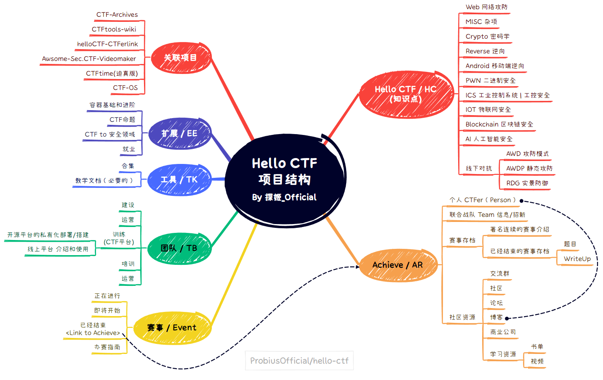

# 关于本书

本项目旨在创建一本开源免费、新手友好的CTF(Capture The Flag，夺旗赛)入门教程。

- 对于每个方向的基础知识点，我们都会尽力提供相应的题目(包括题目附件 题目源码 Dockerfile),所有题目均可本地部署也可在NSSCTF平台上直接开启,我们会在教程中逐步引导读者,并且鼓励读者自行复现,使学习过程更加具象;  
- 在提供基础知识外，本书也将提供CTF相关的信息聚合，以消除信息差;  
- 书籍在每篇文章下都设置有讨论区，欢迎讨论，提问，以及建议;  

## 读者对象

如果你对CTF感兴趣，但是不曾了解，亦或者 了解但不知从何学起，是很纯正的「CTF萌新选手」那建议仔细阅读本书 (bushi  

如果你熟悉CTF并且已经有一门或者多门熟悉的方向，是「CTF老手」，那么本书也可以作为您尝试其他方向 成为全栈✌ 路上的垫脚石 (x   

如果你的CTF已经炉火纯青，是「CTFの神」，我们期待您的宝贵建议，或者，您也可以加入我们一起创作！！　　

!!! Note "前置条件"

    您需要至少熟悉任意一个方向，对该方向有一定的认知，能够针对该方向知识点完成对应题目的命题。
    (以Web方向举例 您除了需要会Web方向的基础以外，还需要熟悉Docker技术)
    
## 内容结构

本项目围绕CTF分为了下面几个板块.  

### **[HelloCTF](https://ctf.probius.xyz/)(/HC)** 

HelloCTF项目的核心部分，包含CTF各个方向 (包括但不限于MISC,WEB,CRYPTO,REVERSE,PWN),覆盖入门到提高各个阶段,每个知识点享有配套题目。 

### **[赛事](https://ctf.probius.xyz/ET/) Event (/ET)**

涵盖CTF 国内外 即将进行，正在进行，已经结束的所有比赛信息。

对于有办赛需求的团队提供相关支持。

### **[工具](https://ctf.probius.xyz/TK/) CTFToolKit (/TK)** 

与项目 [CTFtools-wiki](https://github.com/ProbiusOfficial/CTFtools-wiki) 同步,分类收录各种 CTF 工具。  

### **[团队](https://ctf.probius.xyz/TB/) TeamBuilding (/TB)** 
应对高校CTF战队 / 网络安全社团 等建设,提供必要的解决方案(如，培训资料，公文模板，比赛材料申报等)

### **[扩展](https://ctf.probius.xyz/EE) Extension (/EE)** 
目前围绕容器技术提供如Docker的相关教学以及命题技巧和封装教程。  

后续会更新如何从CTF过渡到安全实战领域，以及CTFer会面临的就业问题。

### **[CTF档案馆](https://ctf.probius.xyz/AR) Archives (/AR)** 

收录CTF相关内容，包括但不限于: 

- 师傅们的博客收录

- CTF联合战队信息以及招新公告(如果有的话)

- CTFChanel 会列出CTF相关内容的UP主

- CTF历届比赛信息，题目，以及WriteUp (题目包括对附件 / Docker存档 )
  
  该部分 (CTF档案馆) 将基于Github组织 [CTF-Archives](https://github.com/CTF-Archives) 进行维护，所有涉及到的题目都会上传到 [NSSCTF](https://www.nssctf.cn/) 平台上，方便大家复现。

