## 壳

### 概念
“壳”，顾名思义，是程序外面的 **“保护层”**，主要分为压缩壳和加密壳两种。比赛中常见的一般是压缩壳，它在程序中加入一些代码隐藏程序真正的入口，使其难以被反编译。

### 查壳
软件：EXEInfoPE、PEID、StudyPE+、DIE等

它们的使用都差不多，下面以DIE为例：

我们可以看到程序使用的操作系统位数、加壳的情况等等。

## 脱壳
既然知道了如何查壳，那么如何脱去这层烦人的外衣呢？
这里分为两种脱壳方法：

- **工具脱壳**：用软件脱壳，方便快捷，只不过能解决的壳有限，不一定能解决魔改壳。

- **手动脱壳**：用xdbg、OD等动态调试软件脱壳，难度高，但通杀。

以最常见的UPX壳举例：
- 工具脱壳：使用官方工具`upx.exe`,使用命令即为`upx.exe -d <文件(加后缀)>`

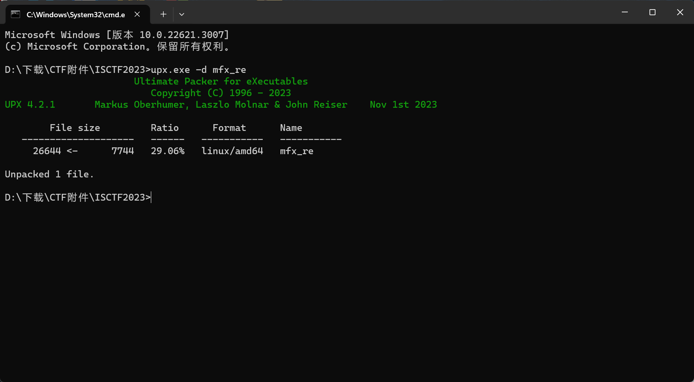

- 手动脱壳：
    - 32位：OllyDbg脱壳（较简单，可参考网上大量教程）
    - 64位：x64dbg
示例为 [SWPUCTF 2022 新生赛]upx 中的附件（64位，UPX3.96壳），可以用工具脱壳。下面尝试手动脱壳。 

XP后的系统都有ASLR（地址空间随机化），导致dump后程序运行出错，因此我们首先用CFF Explorer修改该文件的Nt Header，禁用ASLR

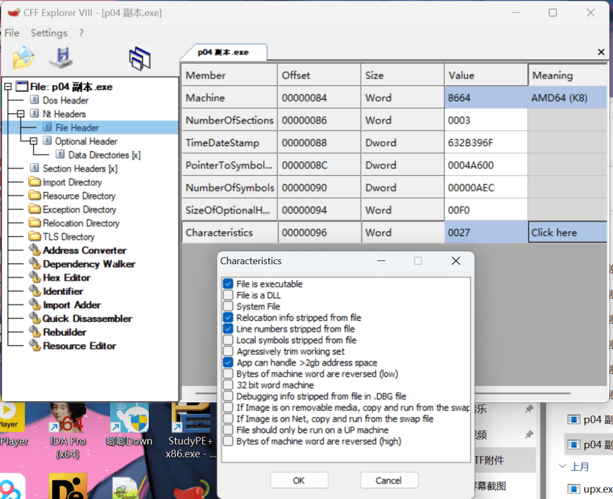

在Nt Header下的Optional Header里修改Characteristics，勾选Relocation info srtipped from file。关闭后记得保存。 
用x64dbg打开文件，进入系统断点（push rbx）。

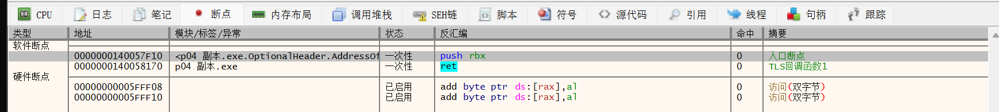 
 

按F9到达该断点（这里要按两次，上面还有个别的什么断点） 
F7走完push压栈部分

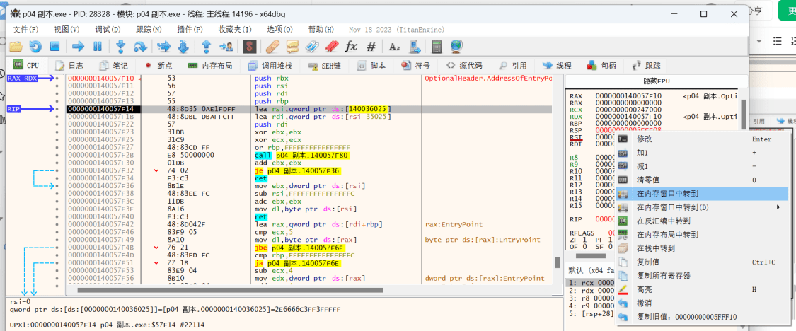 

观察到RSP的变化，在其上右键“在内存窗口中转到” 

 

在右下角该地址右键，设置硬件断点 

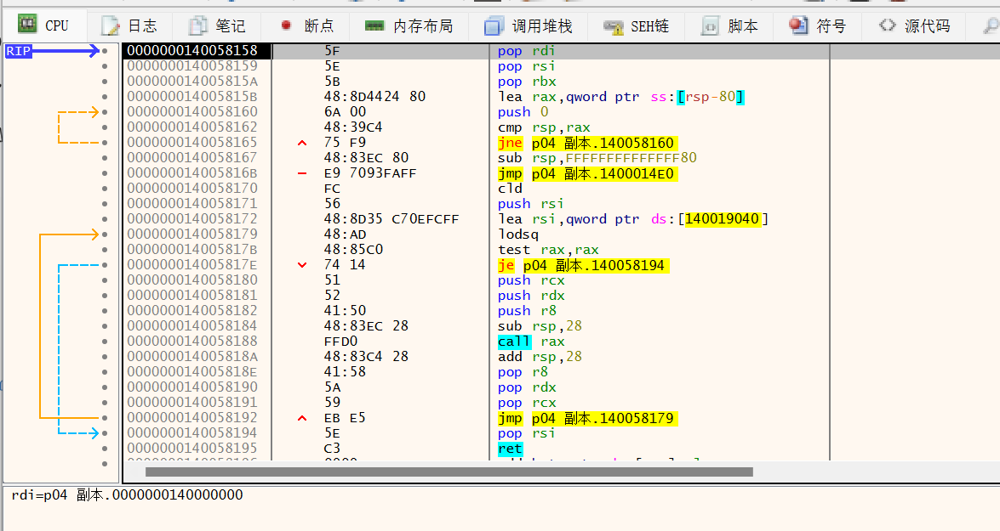 

F9运行到断点处，看到下面的jmp大跳应该是入口，设置断点，F9跳过去 

 

F7步入程序 
 

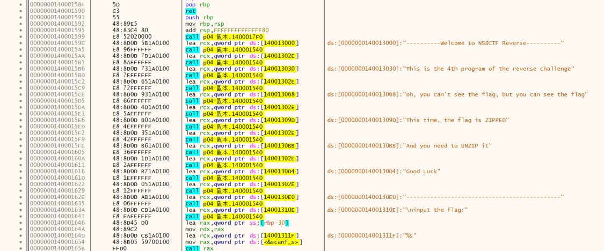 

往下翻可以看到提示字符串 
这就正式进入了原程序，可以进行dump了 

 

先点“IAT Autosearch”，再点“Get Imports”,在“Imports”中删除掉带有红色叉叉的，再点击“Dump”，之后“Fix Dump”选中之前的Dump文件，修复成功。 

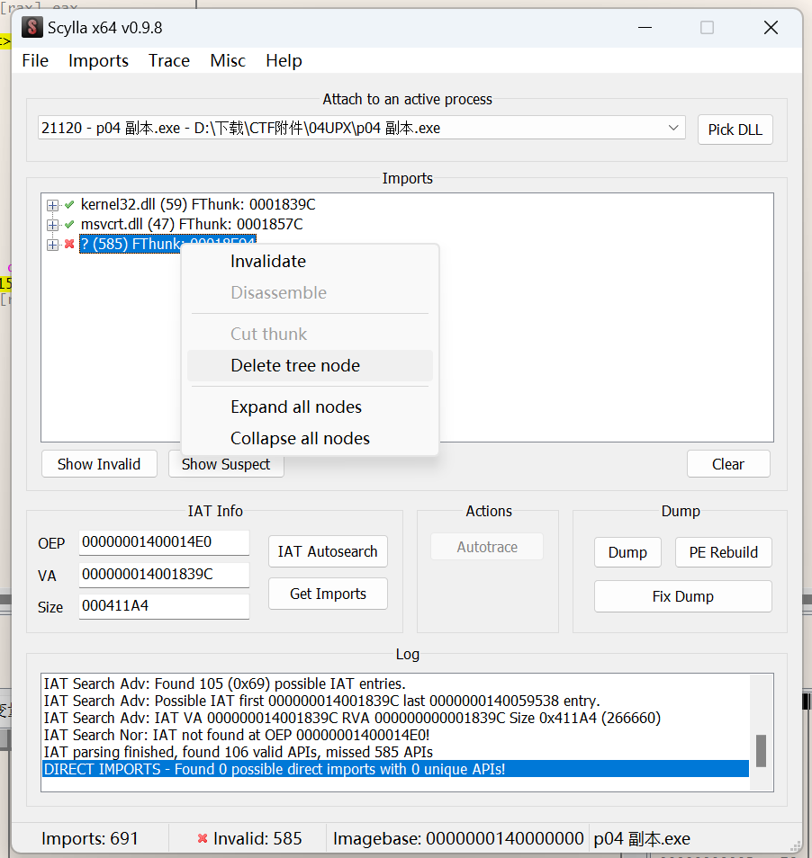 
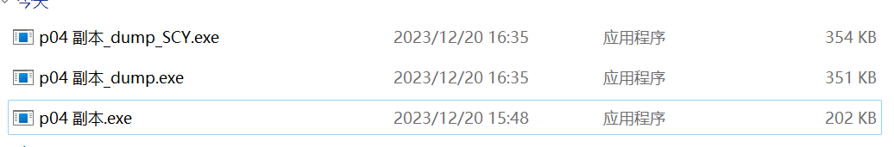 
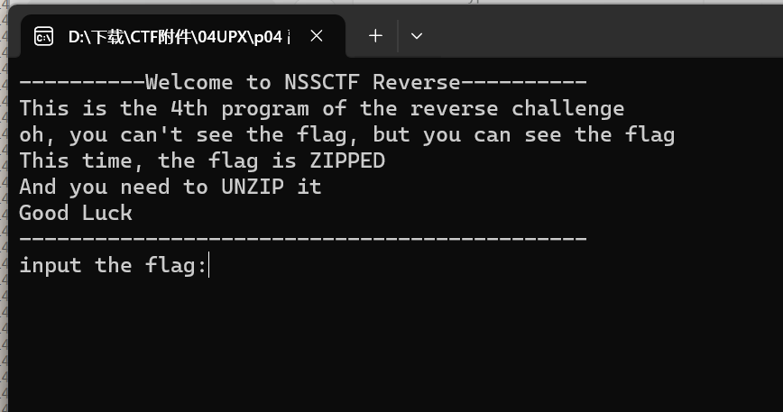 

p04 副本_dump_SCY.exe 也可以正常运行 拖入IDA中，这里会报错，Yes不用管它 

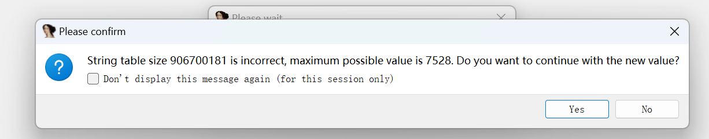 
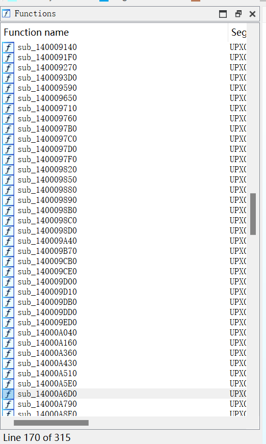 

（由于某种神秘力量？）没有main函数，只能通过字符串来找函数 

 
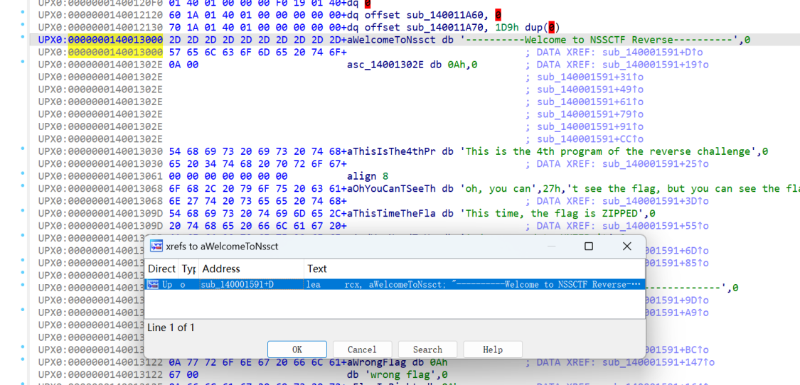 

X键找一下位置 

 

可以看到大致的代码 
如果想把字符串展开看，可以（退到IDA View-A中）修改Segment，取消w勾选 

 
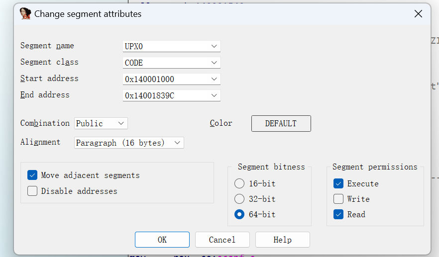 修复后  

显然sub_140001540是printf函数，脱壳结束

## 干扰
虽然我们有脱壳的各种方法，但是出题人并不总是想让你顺利地解出答案。

### 魔改UPX头
让我们以NCTF2023的中文编程2为例：

当我们查壳时发现UPX的版本号被抹去，那就是文件头被魔改了。这时候手动脱壳依然是有效的，不过有时候太麻烦，所以我们也可以手动把UPX头改回来。

用`010Editor`打开文件：

发现字符串提示，这些地方应该是被改了。
对比一下正常的upx文件：

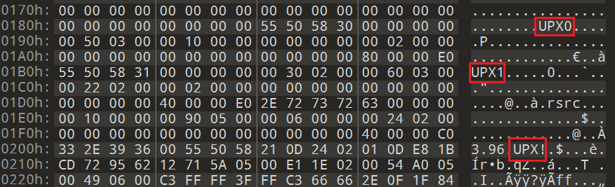

分别是UPX0、UPX1、UPX！
改一下（注意在左边改，在右边改会把后面的.覆盖掉）

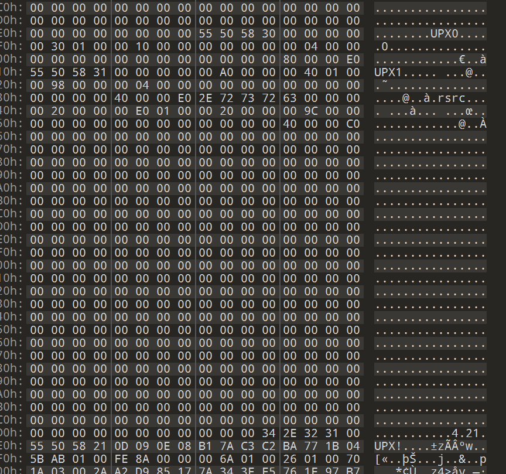

版本号出来了，可以正常脱壳

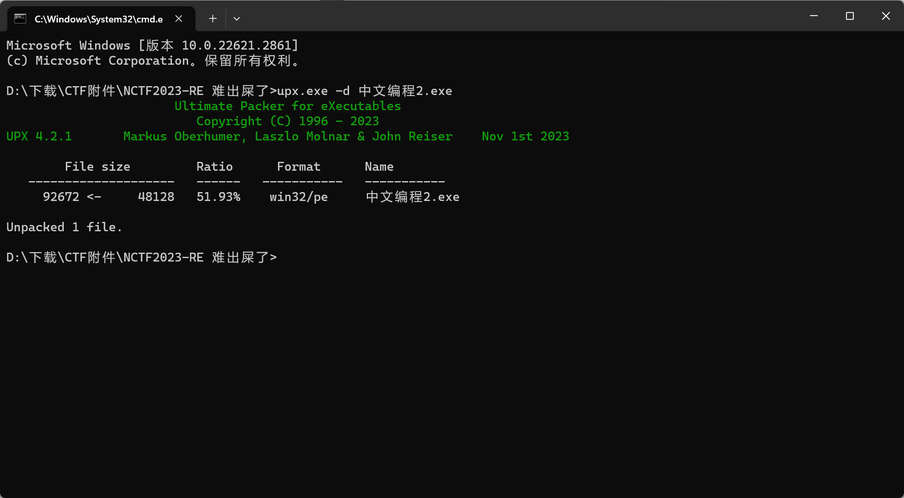

成功了！我的朋友！