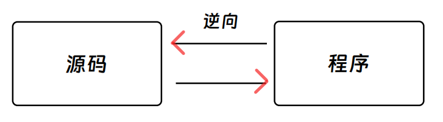

## 引导篇：灵魂 F&Q

本章节将会通过三个问题作为切入点，向你介绍关于 CTF 中的逆向工程(Reserve)的一些基本情况：**是什么？有什么？怎么做？**

#### 1.是什么？🤨

你说得对，但逆向工程一般指软件逆向工程，即对已经编译完成的 **可执行文件** 进行分析，通过反汇编工具查看程序的二进制代码，以及汇编块，研究程序的行为和算法，然后以此为依据，得出出题人想隐藏的 flag。当然，这只是通俗易懂的针对 CTF 比赛的解释，实战中的逆向工程，会涉及到更多方面，解释也会更加复杂，这里不再赘述。

💡 Tips：建议尽你所能去了解一下什么是 **可执行文件**，本板块中不会对可执行文件进行完整的解释。

#### 2.有什么？🧐

逆向类题目是 CTF 中难度相对较高的题型，现已覆盖 Windows 逆向、Linux 逆向和 Android 逆向，再加上 Flash 逆向、Python 逆向、.NET 逆向、ARM 逆向等。

目前主流的逆向文件平台有 Windows 和 Linux，这两个平台的逆向工程发展时间最久，其可变灵活度也很高，所以目前 CTF 中的逆向题目也就自然而然地成为了难度很大的方向。

CTF 中给出的题目常见形式有 ELF 文件、exe 文件、dll 文件等。同时，也不乏有直接将一段汇编代码塞到 txt 里直接丢给你的情况。以上这些在后续的例题中也会随之讲到。

以上这些文件形式又会以不同的加密方法出现：混淆、花指令、加壳、复杂算法、复杂汇编等。我们都需要突破这些障碍，去拿到我们想要的 flag 字符串。

#### 3.怎么做？🤔

目前，从我个人观点来讲，在进行 CTF 逆向时，我们需要做到以下方面的准备：Tool(工具)、Language(语言)、Stick [肝(坚持)]，简称 ~~TLS 传输层安全协议(bushi)~~ TLS，如果非要多加一个那就是 Observation and Analysis(代码分析能力)。

**Tool :** 指在进行逆向分析时所需要用到的软件，我们常见的有 DIE、IDA、GDB、Ollydbg(简称 OD)、Cheat Engine(简称 CE)等。

这些工具的用法在后面的章节中都会教大家如何 Quick Start。

**Language :** 兄弟，你知道我想说什么。**语言** 这个词在这里提出来，那肯定不是单纯的英语了，这里指计算机语言。

在进行逆向工程的过程中，我们难免要编写一些脚本去计算或者模拟出题人给我们的一些过程，从而去寻找我们想要的 flag。

最常见也最常用的编程语言就是 Python，其次是 C++ 和 Java。除去编程语言，还有一个语言比较重要，那就是汇编语言(简称 ASM)：汇编语言与早期的编程环境比较接近，与机器码(HEX、BIN)比较接近，但是可以让人比较容易看懂，搞嵌入式的同学可能会经常搞这些。在 CTF 逆向中，我们需要面临的有 x86 汇编和 x64 汇编，也即 32 位汇编和 64 位汇编；两者虽然同为汇编语言，但是它们之间还是存在一些差别的，所以在学习的时候两个都不能有过于倾向的情况，都要认真去学习。

在后面的章节中，我会提到一些关于 ASM 的 Quick Start 方法。

**Stick :** 这个就不多说了吧，原神玩家最清楚这种体验 () 。对于 re 手来说，一次看几万行代码的情况，很常见。这种高强度的折磨对于没有耐心的小伙伴来说简直是虐待，在这种情况下你要盯着屏幕一直看，还要保持细心和睿智。所以很多 re 手比较 ~~擅长摸鱼发呆(bushi)~~ 沉稳和精明。

#### 4.章节总结 😆

本章主要介绍了 CTF 中逆向工程方向的一些基本情况，目的是 ~~劝退各位✌~~ 带各位大致了解一下 CTF 中的逆向工程是什么样子的，以及之后的学习方向都有哪些。如果有错误请及时指出哟~