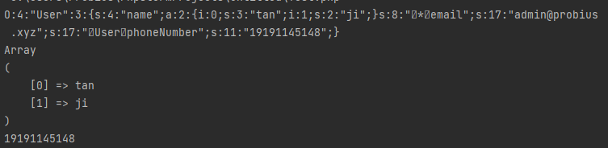
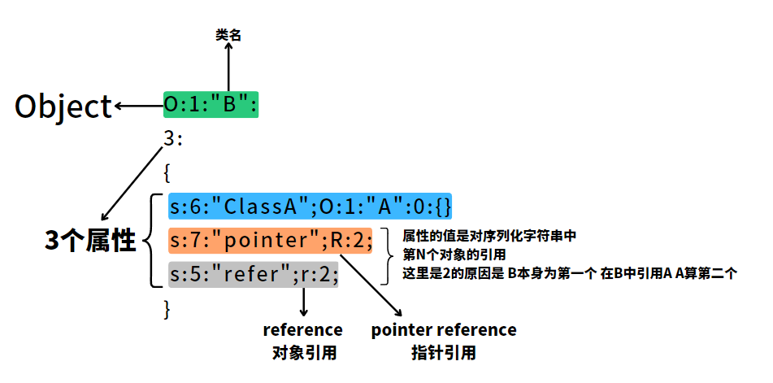

# PHP 序列化及反序列化基础

### 介绍

标题有说道，这两种数据处理方式， 序列化 和 反序列化。  

- **序列化** 是将 PHP 对象转换为字符串的过程，可以使用 `serialize()` 函数来实现。该函数将对象的状态以及它的类名和属性值编码为一个字符串。序列化后的字符串可以存储在文件中，存储在数据库中，或者通过网络传输到其他地方。
- **反序列化** 是将序列化后的字符串转换回 PHP 对象的过程，可以使用 `unserialize()` 函数来实现。该函数会将序列化的字符串解码，并将其转换回原始的 PHP 对象。
- 序列化的目的是方便数据的存储，在PHP中，他们常被用到缓存、session、cookie等地方。

下面我们从数组的反序列化开始 一步一步讲解。

### 数组的反序列化

```php  
<?php
$username = array("tan","ji");

$username = serialize($username);

echo ($username. "\n");

print_r(unserialize($username));

var_dump(unserialize($username));
```

上面对数组的反序列化会输出：

```php
a:2:{i:0;s:3:"tan";i:1;s:2:"ji";} ----- echo ($username. "\n");
Array  -------------------------------- print_r(unserialize($username));
(
    [0] => tan
    [1] => ji
)
array(2) { ---------------------------- var_dump(unserialize($username));
  [0]=>
  string(3) "tan"
  [1]=>
  string(2) "ji"
}
```

在上面反序列化中的字符中，每个部分代表不同的属性：


以此类推ww

### **普通对象的反序列化**

我们先看一个简单的对象示例：

```php
<?php
class User {
public $name;

public function __construct($name) {
        $this->name = $name;
    }
}
```

该对象允许使用下面的语法创建：

```php
$user = new User("Probius_Official");
```

下面我们对其进行序列化，并且输出出来：

```php
$serializedData = serialize($user);
echo $serializedData . "\n";
```

可以得到下面的输出：

```
O:4:"User":1:{s:4:"name";s:16:"Probius_Official";}
```


此时我们如果采用数组为姓名变量：

```php
$user = new User(array("Probius","Official"));
```

则再次运行，输出就变成了：

```
O:4:"User":1:{s:4:"name";a:2:{i:0;s:7:"Probius";i:1;s:8:"Official";}}
```


其实拆分开来没那么难理解。

然后我们针对上面的代码，添加点类中的其他属性，如：`保护变量` `私有变量` `自定义函数`

```php
<?php
class User {
    public $name;
    protected $email;
    private $phoneNumber;
    public function __construct($name, $email,$phoneNumber) {
        $this->name = $name;
        $this->email = $email;
        $this ->phoneNumber = $phoneNumber;
    }
    public function getPhoneNumber(){
        echo $this ->phoneNumber;
    }
}
$user = new User(array("tan","ji"), 'admin@probius.xyz','19191145148');

$serializedData = serialize($user);
echo $serializedData . "\n";
$deserializedUser = unserialize($serializedData);
print_r($deserializedUser -> name);
echo $deserializedUser -> getPhoneNumber();
?>
```

其输出为：  

```php title="Serialized Data"
O:4:"User":3:{s:4:"name";a:2:{i:0;s:3:"tan";i:1;s:2:"ji";}s:8:" * email";s:17:"admin@probius.xyz";s:17:" User phoneNumber";s:11:"19191145148";}
Array
(
    [0] => tan
    [1] => ji
)
19191145148
```

为了方便理解，我们这样拆分一下：

```
O:4:"User":3:{s:4:"name";a:2:{i:0;s:3:"tan";i:1;s:2:"ji";}---- public $name;

s:8:" * email";s:17:"admin@probius.xyz";---------------------- protected $email;

s:17:" User phoneNumber";s:11:"19191145148";}----------------- private $phoneNumber;
```

观察不同类型变量名的字符长度标识，你会发现长度和你看到的好像有些不一样，那是因为在 `protected` 和 `private`类型的变量中都加入了不可见字符：

如果是 `protected` 变量，则会在变量名前加上`\x00*\x00`

如果是 `private` 变量，则会在变量名前加上`\x00类名`

或许下面控制台的输出比起上面不可见字符变成了类似"` `"空格的字符更直观（虽然也直观不到哪里去。



所以一般我们在输出的时候都会先编码后输出，以免遇到保护和私有类序列化后不可见字符丢失的问题。

```php
O:4:"User":3:{s:4:"name";a:2:{i:0;s:3:"tan";i:1;s:2:"ji";}---------- public $name;

s:8:"\x00*\x00email";s:17:"admin@probius.xyz";---------------------- protected $email;

s:17:"\x00User\x00phoneNumber";s:11:"19191145148";}----------------- private $phoneNumber;
```

`echo  urlencode($serializedData)` :


```php
 O%3A4%3A%22User%22%3A3%3A%7Bs%3A4%3A%22name%22%3Ba%3A2%3A%7Bi%3A0%3Bs%3A3%3A%22tan%22%3Bi%3A1%3Bs%3A2%3A%22ji%22%3B%7D-------------------------------------------------------------- public $name;
 
 s%3A8%3A%22%00%2A%00email%22%3Bs%3A17%3A%22admin%40probius.xyz%22%3B------- protected $email;
 
 s%3A17%3A%22%00User%00phoneNumber%22%3Bs%3A11%3A%2219191145148%22%3B%7D---- private $phoneNumber;
```

### **自定义类的反序列化**

如果我们把上面的类改成这样：

```php
<?php
class User implements Serializable {
    public $name;
    protected $email;
    private $phoneNumber;

    public function __construct($name, $email, $phoneNumber) {
        $this->name = $name;
        $this->email = $email;
        $this->phoneNumber = $phoneNumber;
    }

    public function serialize() {
        return serialize([
            'name' => $this->name,
            'email' => $this->email,
            'phoneNumber' => $this->phoneNumber,
        ]);
    }

    public function unserialize($serialized) {
        $data = unserialize($serialized);
        $this->name = $data['name'];
        $this->email = $data['email'];
        $this->phoneNumber = $data['phoneNumber'];
    }

    public function getPhoneNumber() {
        echo $this->phoneNumber;
    }

    public function getEmail() {
        return $this->email;
    }
}

$user = new User(array("tan","ji"), 'admin@probius.xyz', '19191145148');

$serializedData = serialize($user);

echo $serializedData . "\n";

$deserializedUser = unserialize($serializedData);

print_r($deserializedUser->name);

echo $deserializedUser->getPhoneNumber() . "\n";

echo $deserializedUser->getemail() . "\n";


```

在User类中，通过 `class User implements Serializable` 中的 `Serializable` 接口，我们可以定义`serialize()` 和 `unserialize()` 两个方法，实现控制类实例在序列化和反序列化过程中的行为。

这两个方法分别负责将类实例的属性序列化为字符串和从字符串中还原属性。

当我们使用全局的 `serialize()` 和 `unserialize()` 函数时，这些方法会自动调用，从而让我们更好地控制序列化和反序列化过程。这也是该类型的类叫做 "CustomObject"的原因。

当我们运行上面的程序时，控制台输出如下：

```php
C:4:"User":125:{a:3:{s:4:"name";a:2:{i:0;s:3:"tan";i:1;s:2:"ji";}s:5:"email";s:17:"admin@probius.xyz";s:11:"phoneNumber";s:11:"19191145148";}} ---------------------------------------------------- echo $serializedData . "\n";
Array ------------------------------------------------ print_r($deserializedUser->name);
(
    [0] => tan
    [1] => ji
)
19191145148 ------------------------------------------ echo $deserializedUser->getPhoneNumber() . "\n";
admin@probius.xyz ------------------------------------ echo $deserializedUser->getemail() . "\n";
```


其格式大致为：`C:<className length>:"<class name>":<data length>:{<data>}`

为了方便理解，我们这样同样拆分一下：


### 其他标识

除了上面常见的几个序列化字母标识外，还有其他标识,这里我们一起总结一下:

- a:array 数组

  ```php
  echo serialize(array(1,2)); --- a:2:{i:0;i:1;i:1;i:2;}
  ```

- b:boolean bool值

  ```php
  echo serialize(true);  ---- b:1;
  echo serialize(false); ---- b:0;
  ```

- C:custom object 自定义对象序列化

  使用 Serializable 接口定义了序列化和反序列化方法的类

  ```php
  class yourClassName implements Serializable
  ```

- d:double 小数

  ```php
  echo serialize(1.1); ---- d:1.1;
  ```

- i:integer 整数

  ```php
  echo serialize(114); ---- i:114;
  ```

- o:commonObject 对象

  ```
  似乎在php4的时候就弃用了
  ```

- O:Object 对象

  ```php
  class a{}
  echo serialize(new a());
  ------ O:1:"a":0:{}
  ```

- r:reference 对象引用 && R:pointer reference 指针引用

  ```php
  <?php
  class A{
  
  }
  class B{
      public $ClassA;
      public $refer;
      public $pointer;
      public function __construct(){
          $this->ClassA = new A();
          $this->refer = $this->ClassA;
          $this->pointer = &$this->ClassA;
      }
  }
  $a = new B();
  echo serialize($a);
  ```

  控制台输出：

  ```php
  O:1:"B":3:
  {
      s:6:"ClassA";O:1:"A":0:{}
      s:5:"refer";r:2;
      s:7:"pointer";R:2;
  }
  ```

  

  此外，引用对象的属性值取决于声明顺序。

  ```php
  <?php
  class A{
  
  }
  class C{
  
  }
  class B{
      public $ClassA;
      public $ClassC;
      public $pointer_1;
      public $pointer_2;
  
      public $refer;
  
      public function __construct(){
          $this->ClassA = new A();
          $this->ClassC = new C();
          $this->refer = $this->ClassA;
          $this->pointer_1 = &$this->ClassA;
          $this->pointer_2 = &$this->ClassC;
  
      }
  }
  $a = new B();
  echo serialize($a);
  // ----------------------- 当改变ClassA / C 的声明顺序的时候输出如下:
  // O:1:"B":5:{s:6:"ClassC";O:1:"C":0:{}s:6:"ClassA";O:1:"A":0:{}s:9:"pointer_1";R:3;s:9:"pointer_2";R:2;s:5:"refer";r:3;}
  // O:1:"B":5:{s:6:"ClassA";O:1:"A":0:{}s:6:"ClassC";O:1:"C":0:{}s:9:"pointer_1";R:2;s:9:"pointer_2";R:3;s:5:"refer";r:2;}
  ```

  

- s:string 字符串

  ```php
  class a{}
  echo serialize(new a());
  ------ O:1:"a":0:{}
  ```

- S:encoded string

  ```php
  S:1:"\61"; --- 可以将16进制编码成字符，可以进行绕过特定字符
  ```

- N:null NULL值

  ```php
  echo serialize(NULL); --- N;
  ```

### 魔术方法

在 PHP 的序列化中，魔术方法（Magic Methods）是一组特殊的方法，这些方法以双下划线（`__`）作为前缀，可以在特定的序列化阶段触发从而使开发者能够进一步的控制 序列化 / 反序列化 的过程。

你可以在PHP官方文档中查找到对应魔术方法的定义和使用方法：[PHP: 魔术方法 - Manual](https://www.php.net/manual/zh/language.oop5.magic.php)

一般在题目中常见的几个方法如下：

```php
 __wakeup() //------ 执行unserialize()时，先会调用这个函数
 __sleep() //------- 执行serialize()时，先会调用这个函数
 __destruct() //---- 对象被销毁时触发
 __call() //-------- 在对象上下文中调用不可访问的方法时触发
 __callStatic() //-- 在静态上下文中调用不可访问的方法时触发
 __get() //--------- 用于从不可访问的属性读取数据或者不存在这个键都会调用此法
 __set() //--------- 用于将数据写入不可访问的属性
 __isset() //------- 在不可访问的属性上调用isset()或empty()触发
 __unset() //------- 在不可访问的属性上使用unset()时触发
 __toString() //---- 把类当作字符串使用时触发
 __invoke() //------ 当尝试将对象调用为函数时触发
```

一份比较全面的表格：

| magicMethods | attribute                                                    |
| ------------ | :----------------------------------------------------------- |
| __construct  | 当一个对象被创建时自动调用这个方法，可以用来初始化对象的属性。 |
| __destruct   | 当一个对象被销毁时自动调用这个方法，可以用来释放对象占用的资源。 |
| __call       | 在对象中调用一个不存在的方法时自动调用这个方法，可以用来实现动态方法调用。 |
| __callStatic | 在静态上下文中调用一个不存在的方法时自动调用这个方法，可以用来实现动态静态方法调用。 |
| __get        | 当一个对象的属性被读取时自动调用这个方法，可以用来实现属性的访问控制。 |
| __set        | 当一个对象的属性被设置时自动调用这个方法，可以用来实现属性的访问控制。 |
| __isset      | 当使用 isset() 或 empty() 测试一个对象的属性时自动调用这个方法，可以用来实现属性的访问控制。 |
| __unset      | 当使用 unset() 删除一个对象的属性时自动调用这个方法，可以用来实现属性的访问控制。 |
| __toString   | 当一个对象被转换为字符串时自动调用这个方法，可以用来实现对象的字符串表示。 |
| __invoke     | 当一个对象被作为函数调用时自动调用这个方法，可以用来实现对象的可调用性。 |
| __set_state  | 当使用 var_export() 导出一个对象时自动调用这个方法，可以用来实现对象的序列化和反序列化。 |
| __clone      | 当一个对象被克隆时自动调用这个方法，可以用来实现对象的克隆。 |
| __debugInfo  | 当使用 var_dump() 或 print_r() 输出一个对象时自动调用这个方法，可以用来控制对象的调试信息输出。 |
| __sleep      | 在对象被序列化之前自动调用这个方法，可以用来控制哪些属性被序列化。 |
| __wakeup     | 在对象被反序列化之后自动调用这个方法，可以用来重新初始化对象的属性。 |

PHP官方文档已经很详细了，这里不在赘述，不一定需要学会所有的函数，除开常见的，其他的在遇到的时候查阅即可。

