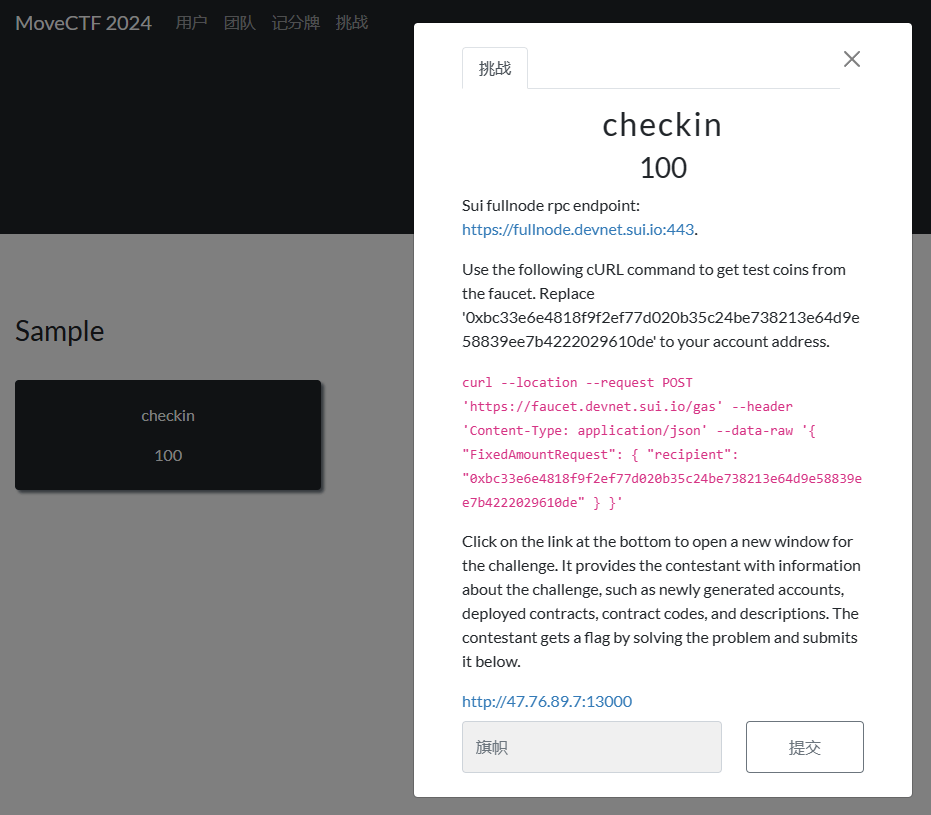
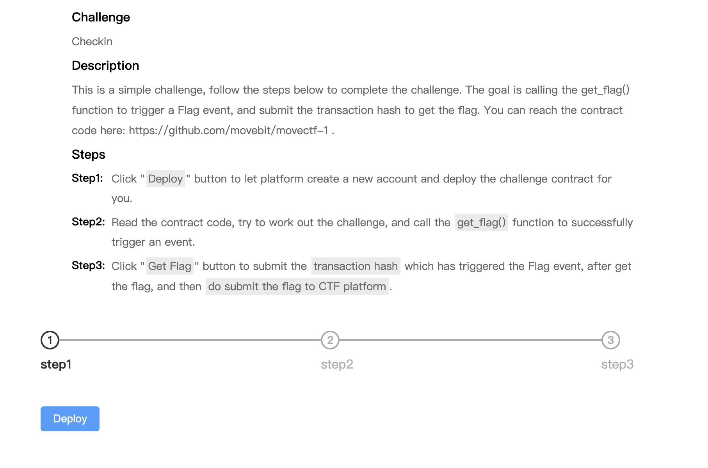
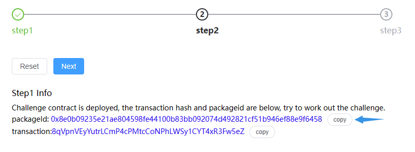
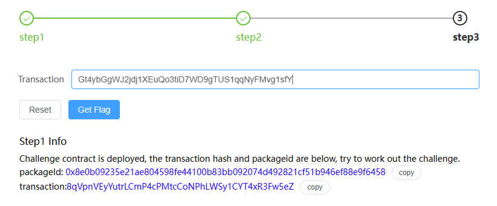
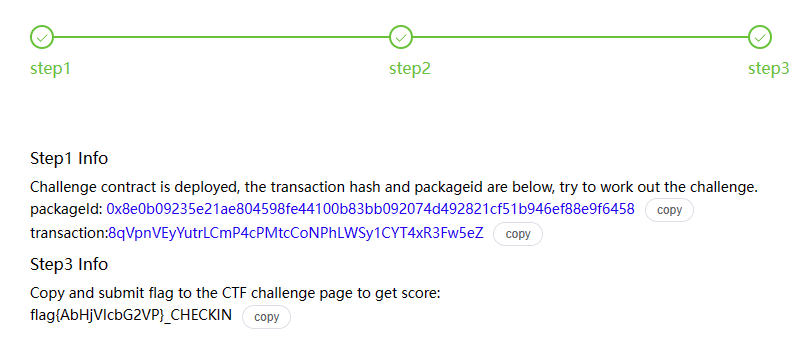

## 开始之前



初次看到题是否有些懵？在开始之前，我们先给大家介绍一下这个题面的构成。

在传统CTF中，我们的动态题目通常使用Docker实现，这一点在区块链题目中稍有不同。

在区块链题目中，题目通常是围绕一个运行中的区块链网络展开的。这个网络可以是一个公共的测试网，也可以是专门为比赛搭建的私有网络。

而题目的交互则由 **全节点RPC端点 (Fullnode rpc endpoint)** 实现 —— 区块链网络中的全节点提供了一个RPC（远程过程调用）接口，允许选手通过网络请求与区块链交互。这就是题目中提到的 `Sui fullnode rpc endpoint`的作用。

如下便是本题目运行的网络，也是答题需要接入的测试网。

```
Sui fullnode rpc endpoint: https://fullnode.devnet.sui.io:443
```

当然这种独特的交互方式从一定意义上影响了环境需求 —— 选手可能需要配置特定的区块链开发环境，从而实现连接到指定的RPC端点。

---


```
Use the following cURL command to get test coins from the faucet. Replace '0xbc33e6e4818f9f2ef77d020b35c24be738213e64d9e58839ee7b4222029610de' to your account address.

curl --location --request POST 'https://faucet.devnet.sui.io/gas' --header 'Content-Type: application/json' --data-raw '{ "FixedAmountRequest": { "recipient": "<Your_Addresses>" } }'
```

在区块链中，每一个动作都需要一定的成本，我们称之为 **Gas** ，即衡量动作消耗的计算资源的基本单位，每次操作都会以  **Gas * Gas Price** ，即单位 Gas 所需的手续费，扣除你的对应币种。

这里给出了测试币的获取方法，在Sui中，地址由 32 字节（bytes）组成，经常以 base58 编码形式呈现，并带有 0x 前缀，如示例中给出的形式。

在配置好Sui的开发环境后，使用 `sui client addresses` 可获取你的账户地址，别担心，我们后面会详细的介绍如何配置好Sui的开发环境。

然后按照题目中给出的curl指令向测试网络发送对应请求即可领取测试币。

---


```
Click on ... below.
http://47.76.89.7:13000
```

这个底部的链接就是题面，在题面中会告知你需要完成的任务。

完成对应任务后即可获取flag。

## 环境配置

前面我们说到区块链题目独特的交互方式会产生一定的环境需求，对于MoveCTF来讲，我们需要配置Sui的开发环境才能进行答题。

对于Sui的环境配置有多种方法，Mac可以最简单的使用 homebrew 一键安装。

而 Windows 和 Linux 这需要依赖 Rust和Cargo 进行编译安装。

当然 也可以直接下载官网编译好的二进制文件使用。

或者如果你熟悉 docker 也可以使用docker进行构建。

### 二进制文件自动化构建

=== "MacOS"

    ```
    brew tap mystenlabs/tap
    brew install mystenlabs/tap/sui
    ```
    
    没有Homebrew？>使用下面命令一键安装
    
    ```
    /bin/bash -c "$(curl -fsSL https://raw.githubusercontent.com/Homebrew/install/HEAD/install.sh)"
    ```

=== "Windows"

    ```powershell
    # author: 不霁何虹@WGB5445
    Invoke-Expression (Invoke-WebRequest -Uri "https://gist.githubusercontent.com/WGB5445/73b3b54f8293125d4ba74260ea5a39ce/raw" -UseBasicParsing).Content
    ```

=== "Linux-Ubuntu"

    ```bash
    curl -fsSL https://raw.githubusercontent.com/ProbiusOfficial/Sui-DevSetup/main/sui-ubuntu-x86_64.sh | bash
    ```


### 使用Docker构建

拉取官方的Docker镜像并使用容器中的终端。

```bash
docker pull mysten/sui-tools:devnet

docker run --name suidevcontainer -itd mysten/sui-tools:devnet

docker exec -it suidevcontainer bash
```

### 使用二进制文件手动安装

在官方Github仓库的Release中有编译好的二进制文件

/> https://github.com/MystenLabs/sui/releases

Release 提供四种不同类型的操作系统的二进制文件：


下载对应系统的压缩包后解压你能得到类似于下面结构：

```
+ target
 + release
   - sui-faucet-ubuntu-x86_64
   - sui-node-ubuntu-x86_64
   - sui-test-validator-ubuntu-x86_64
   - sui-tool-ubuntu-x86_64
   - sui-ubuntu-x86_64
external-crates\move\target\release\move-analyzer-ubuntu-x86_64
```

文件名格式为 sui-`<操作系统>`-`<架构>`：

- sui-faucet-`<操作系统>`-`<架构>`：本地网络上用于铸币的工具。
- sui-indexer-`<操作系统>`-`<架构>`：本地 Sui 网络的索引器。
- sui-`<操作系统>`-`<架构>`：Sui 的主要执行文件。
- sui-node-`<操作系统>`-`<架构>`：用于运行本地节点。
- sui-test-validator-`<操作系统>`-`<架构>`：用于开发的本地网络测试验证器。
- sui-tool-`<操作系统>`-`<架构>`：提供 Sui 相关的工具。

然后你需要做的就是将这些文件放在一起，移除掉 -`<操作系统>`-`<架构>` 部分，再将他们添加到系统的环境变量中。

假设，你已经处理了所有文件并将它们放在了当前目录的 sui 文件夹中，那么对应不同系统的操作如下：

=== "Mac"

    ```
    echo 'export PATH="$PATH:'$(pwd)'/sui"' >> ~/.zshrc
    source ~/.zshrc
    ```

=== "Linux"

    ```	
    echo 'export PATH="$PATH:'$(pwd)'/sui"' >> ~/.bashrc
    source ~/.bashrc
    ```

=== "Windows"

    打开“控制面板” > “系统和安全” > “系统” > “高级系统设置”。
    
    在“系统属性”窗口中，点击“环境变量”。
    
    在“系统变量”区域中找到并选择“Path”变量，然后点击“编辑”。
    
    在“编辑环境变量”窗口中，点击“新建”并添加Sui文件夹的路径。假设Sui文件夹位于 `C:\sui`，则添加 `C:\sui`。
    
    点击“确定”保存更改。

完成上述操作后便能在命令行中使用 sui 命令。

### 编译安装

##### 必要组件

当你选择要进行 **编译安装** 时，你需要根据你的系统安装对应的必要依赖。

=== "Linux"

    Linux 操作系统需要以下必要依赖：
    
    - cURL
    - Rust 和 Cargo
    - Git 命令行界面（CLI）
    - CMake
    - GNU 编译器集合（GCC）
    - libssl-dev
    - libclang-dev
    - libpq-dev
    - build-essential
    
    使用下面命令一键安装
    ```bash
    sudo apt-get install -y curl git-all cmake gcc libssl-dev pkg-config libclang-dev libpq-dev build-essential
    ```
    
    如果您的 Linux 版本在安装 [`libssl-dev`](https://index.ros.org/d/libssl-dev/)、[`libclang-dev`](https://index.ros.org/d/libclang-dev/) 或 [`libpq-dev`](https://index.ros.org/d/libpq-dev/) 存在问题，请点击对应的链接寻找等价包。
=== "Windows"

    Windows 10 / 11 操作系统需要以下必要依赖：
    
    - cURL
    - Rust 和 Cargo
    - Git 命令行界面（CLI）
    - CMake
    - C++ 构建工具
    - LLVM 编译器
    
    **cURL**
    
    Windows 11 预装了 Microsoft 版本的 [cURL](https://curl.se/windows/microsoft.html)。如果您更喜欢使用 curl 项目的版本，请从 https://curl.se/windows/ 下载并安装。
    
    **Git 命令行界面** 
    
    请从 [Git 官网](https://git-scm.com/download/) 下载并安装 Git 命令行界面。
    
    **CMake** 
    
    请访问 CMake 官网 [CMake](https://cmake.org/download/) 下载并安装 CMake。
    
    **Protocol Buffers** 
    
    下载 [Protocol Buffers](https://github.com/protocolbuffers/protobuf/releases)（protoc-xx.x-win32.zip 或 protoc-xx.x-win64.zip），并将 \bin 目录添加到您的 Windows PATH 环境变量。
    
    **Windows 的附加工具** 
    
    在 Windows 系统上运行 Sui 需要以下附加工具：
    
    - 安装 Rust 需要 [C++ 构建工具](https://visualstudio.microsoft.com/downloads/)。（即请确定在安装Rust的时候配置了MVC环境）
    - [LLVM 编译器](https://releases.llvm.org/

##### 安装 Rust 及 Cargo

在编译安装的过程中，由Cargo构建依赖，由Rust来完成编译。

在 macOS 或 Linux 上安装 Rust 和 Cargo，请使用以下命令，这也是我们推荐的安装方式。

```bash
curl --proto '=https' --tlsv1.2 -sSf https://sh.rustup.rs | sh
```

如果您使用的是 Windows 10/11，请参阅 Rust 官网上的 [Rust 安装程序](https://www.rust-lang.org/tools/install) 相关信息。该安装程序会检查您是否安装了 C++ 构建工具，并在需要时提示您安装。请选择最适合您环境的选项，并按照安装向导的指示进行操作。

想了解更多安装选项，请访问 [安装 Rust](https://www.rust-lang.org/tools/install)。

Sui 使用最新版本的 Cargo 来构建项目和管理其依赖。更多信息请参阅 Rust 官网的 [Cargo 安装](https://doc.rust-lang.org/cargo/getting-started/installation.html) 页面。

使用以下命令通过 `rustup` 更新 Rust 至稳定版：

```bash
rustup update stable
```

##### 安装Sui

当一切准备就绪，键入下面命令等待几杯咖啡的时间即可完成 Sui 的安装：

```
cargo install --locked --git https://github.com/MystenLabs/sui.git --branch devnet sui
```

⚠️请确保在运行该命令的时候 所有必要依赖已经配置完全，终端已经重启，否则一个报错就会使长达2000多项编译从头来过！

安装完成后，使用 sui -version 命令检查安装情况。

即时清理临时目录缓存。


## 解题时间

### 题面



```markdown title="合约代码"
module movectf::checkin {
    use sui::event;
    use sui::tx_context::{Self, TxContext};

    struct Flag has copy, drop {
        user: address,
        flag: bool
    }

    public entry fun get_flag(ctx: &mut TxContext) {
        event::emit(Flag {
            user: tx_context::sender(ctx),
            flag: true
        })
    }
}
```

### 思路

题目已经给出了任务要求和合约代码：

调用 get_flag() 函数触发 Flag 事件，提交 交易哈希 即可获取 flag。

### 部署

点击 Deploy 部署合约，获取自己的 **PACKAGE-ID**。



```
Step1 Info
Challenge contract is deployed, the transaction hash and packageid are below, try to work out the challenge.
packageId: 0x8e0b09235e21ae804598fe44100b83bb092074d492821cf51b946ef88e9f6458
transaction:8qVpnVEyYutrLCmP4cPMtcCoNPhLWSy1CYT4xR3Fw5eZ
```

### 链接到测试网

首先我们链接到题目部署的测试网络，大概步骤如下：

```
> sui client

Config file ["/home/tj/.sui/sui_config/client.yaml"] doesn't exist, do you want to connect to a Sui Full node server [y/N]?y
Sui Full node server URL (Defaults to Sui Devnet if not specified) : https://fullnode.devnet.sui.io:443
Environment alias for [https://fullnode.devnet.sui.io:443] : moveCTF2024
Select key scheme to generate keypair (0 for ed25519, 1 for secp256k1, 2: for secp256r1):
0
Generated new keypair for address with scheme "ed25519" [0xcef64a585358ba722e0e1b860f11eb7e05eaf9347162ac6743c15cc0b60dd877]
Secret Recovery Phrase : [absent weird horn travel ghost polar jazz thank innocent funny cancel warfare]
Client for interacting with the Sui network
```

第一次运行sui client时会检查有无现有网络即client.yaml文件是否存在，否则会要求如上述创建。

如果不小心略过啦这个过程，可以使用下面的命令添加并且切换到题目网络：

```
sui client new-env --alias <ALIAS> --rpc <RPC-SERVER-URL>
eg.> sui client new-env --alias moveCTF_demo --rpc https://fullnode.devnet.sui.io:443

sui client switch --env <ALIAS>
eg.> sui client switch --env moveCTF_demo
```

您也可以使用 `sui client envs` 来查看您所有的网络环境。

```
 sui client envs
╭─────────────┬────────────────────────────────────┬────────╮
│ alias       │ url                                │ active │
├─────────────┼────────────────────────────────────┼────────┤
│ moveCTF2024 │ https://fullnode.devnet.sui.io:443 │ *      │
╰─────────────┴────────────────────────────────────┴────────╯
```

/> 更多网络的操作可以查看官方文档 [Connect to a Sui Network](https://docs.sui.io/guides/developer/getting-started/connect)

### 获取钱包地址

在前面创建操作的时候其实就会输出你的钱包地址。如果你没有及时备份，可以使用下面的命令来获取：

`sui client addresses` 这将列出所有的钱包地址

```
> sui client addresses
╭───────────────┬──────────────────────────────────────────────────────────────────────────╮
│ activeAddress │  0xcef64a585358ba722e0e1b860f11eb7e05eaf9347162ac6743c15cc0b60dd877      │
│ addresses     │ ╭──────────────────────────────────────────────────────────────────────╮ │
│               │ │  0xcef64a585358ba722e0e1b860f11eb7e05eaf9347162ac6743c15cc0b60dd877  │ │
│               │ ╰──────────────────────────────────────────────────────────────────────╯ │
╰───────────────┴──────────────────────────────────────────────────────────────────────────╯
```

/> 了解更多请查阅官网 [Get Sui Address](https://docs.sui.io/guides/developer/getting-started/get-address)

### 获取测试币

在得到自己的钱包地址后，就能向测试网获取测试币了，使用题目对应命令即可：

```
> curl --location --request POST 'https://faucet.devnet.sui.io/gas' --header 'Content-Type: application/json' --data-raw '{ "FixedAmountRequest": { "recipient": "替换为你的钱包地址" } }'
```

**.eg:**

```
> curl --location --request POST 'https://faucet.devnet.sui.io/gas' --header 'Content-Type: application/json' --data-raw '{ "FixedAmountRequest": { "recipient": "0xcef64a585358ba722e0e1b860f11eb7e05eaf9347162ac6743c15cc0b60dd877" } }'

{"transferredGasObjects":[{"amount":10000000000,"id":"0x3a3ff4584e5705135870052ad8f1720835fbbb5ced1649183e238833c36b2213","transferTxDigest":"EnpLBRrThVBdVe3Jd9Re8gWiX7yt4AsYfC14TWxDXME3"}],"error":null}
```


### 触发函数

终于到了最重要的一步，触发get_flag函数，根据官方文档

/> [Check Sui CLI installation](https://docs.sui.io/references/cli/client#help)

可知，对于函数调用的语法如下：

```
Call Move function

Usage: sui client call [OPTIONS] --package <PACKAGE> --module <MODULE> --function <FUNCTION> --gas-budget <GAS_BUDGET>

Options:
    --package <PACKAGE>             Object ID of the package, which contains the module
    --module <MODULE>               The name of the module in the package
    --function <FUNCTION>           Function name in module
    --type-args <TYPE_ARGS>...      Type arguments to the generic function being called. All must be specified, or the call will fail
    --args <ARGS>...                Simplified ordered args like in the function syntax ObjectIDs, Addresses must be hex strings
    --gas <GAS>                     ID of the gas object for gas payment, in 20 bytes Hex string If not provided, a gas object with at least gas_budget value will be selected
    --gas-budget <GAS_BUDGET>       Gas budget for this call
    --serialize-unsigned-transaction  Instead of executing the transaction, serialize the bcs bytes of the unsigned transaction data (TransactionData) using base64 encoding, and print out
                                        the string
    --serialize-signed-transaction  Instead of executing the transaction, serialize the bcs bytes of the signed transaction data (SenderSignedData) using base64 encoding, and print out the
                                        string
    --json                          Return command outputs in json format
  -h, --help                            Print help
```

那么根据合约代码，很容易就能构建出Payload：

````
sui client call --function get_flag --package 0x8e0b09235e21ae804598fe44100b83bb092074d492821cf51b946ef88e9f6458 --module checkin --gas-budget 10000000
````

网络会返回你这次的交易详细信息，而头部就是我们要的交易hash：

```
> sui client call --function get_flag --package 0x8e0b09235e21ae804598fe44100b83bb092074d492821cf51b946ef88e9f6458 --module checkin --gas-budget 10000000
Transaction Digest: Gt4ybGgWJ2jdj1XEuQo3tiD7WD9gTUS1qqNyFMvg1sfY
```

### 获取Flag

提交该交易hash即可：



返回Flag串：




注意提交flag的时候 需要提交 flag{ } + challenge_name

Flag: flag{AbHjVIcbG2VP}_CHECKIN

## 意犹未尽？

- Sui Move 中文导论: https://intro-zh.sui-book.com/unit-one/  
- Sui 官方文档: https://docs.sui.io/  
- Move 中文资料: https://github.com/movefuns/learning-sui 
- MoveCTF 2022赛题：
  - https://github.com/movebit/movectf-1
  - https://github.com/movebit/movectf-4
  - https://github.com/movebit/movectf-5
  - https://github.com/movebit/movectf-6
  - https://github.com/movebit/movectf-sample
