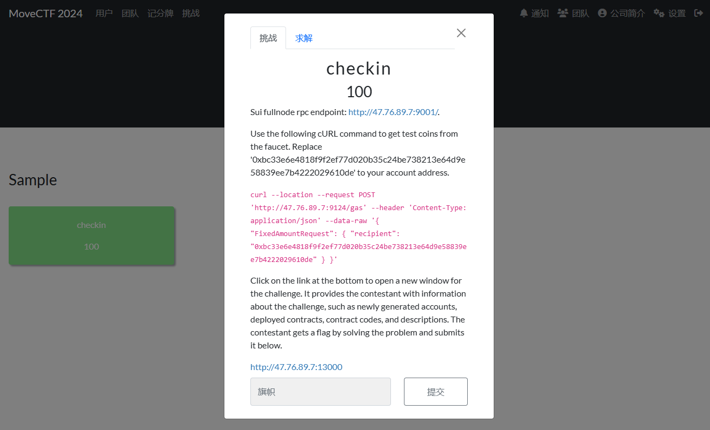

## 开始之前



初次看到题是否有些懵？在开始之前，我们先给大家介绍一下这个题面的构成。

在传统CTF中，我们的动态题目通常使用Docker实现，这一点在区块链题目中稍有不同。

在区块链题目中，挑战通常是围绕一个运行中的区块链网络展开的。这个网络可以是一个公共的测试网，也可以是专门为比赛搭建的私有网络。

而题目的交互则由 **全节点RPC端点 (Fullnode rpc endpoint)** 实现—— 区块链网络中的全节点提供了一个RPC（远程过程调用）接口，允许选手通过网络请求与区块链交互。这就是题目中提到的 `Sui fullnode rpc endpoint`的作用。

当然这种独特的交互方式从一定意义上影响了环境需求 —— 选手可能需要配置特定的区块链开发环境，从而实现连接到指定的RPC端点。

```
Sui fullnode rpc endpoint: http://47.76.89.7:9001/.
```

在开头给出的就是题目运行的测试网络，要完成题目，你需要接入这个网络。

```
Use the following cURL command to get test coins from the faucet. Replace '0xbc33e6e4818f9f2ef77d020b35c24be738213e64d9e58839ee7b4222029610de' to your account address.

curl --location --request POST 'http://47.76.89.7:9124/gas' --header 'Content-Type: application/json' --data-raw '{ "FixedAmountRequest": { "recipient": "<Your_Addresses>" } }'
```

在区块链中，每一个动作都需要一定的成本，我们称之为 **Gas** ，即衡量动作消耗的计算资源的基本单位，每次操作都会以  **Gas * Gas Price** ，即单位 Gas 所需的手续费，扣除你的对应币种。

这里给出了测试币的获取方法，在Sui中，地址由 32 字节（bytes）组成，经常以 base58 编码形式呈现，并带有 0x 前缀，如示例中给出的形式。

在配置好Sui的开发环境后，使用 `sui client addresses` 可获取你的账户地址，别担心，我们后面会详细的介绍如何配置好Sui的开发环境。

然后按照题目中给出的curl指令向测试网络发送对应请求即可领取测试币。

```
Click on ... below.
http://47.76.89.7:13000
```

这个底部的链接就是题面，在题面中会告知你需要完成的任务。

完成对应任务后即可获取flag。

## 环境配置

