# 前言

> 版权声明：
>
> ​	文档源于项目[ProbiusOfficial/CTF-QuickStart: 针对0基础新手编写的CTF快速入门手册 (github.com)](https://github.com/ProbiusOfficial/CTF-QuickStart)
>
> ​	原作者为 白猫。

在ctf比赛中，misc方向是必考的一个方向，其中，图片隐写也是最常见的题目类型，在本篇文章中，将教授以下内容

```
1.各种图片文件的头数据以及判断是什么类型的图片
2.png图片隐写
3.jpg图片隐写
4.gif图片隐写
5.bmp图片隐写
6.从图片中提取文件
7.lsb隐写
8.盲水印
9.exif隐写
10.图片宽高修改
……
```

题目以及本文所使用的所有工具项目地址，环境也配置好了，一键安装即可：

```
https://github.com/baimao-box/Misc_Picture_Steganography
```


安装完后，可以直接在终端输入脚本名称即可运行


我不喜欢一开始就在文章前面抛出一大堆生涩的原理，我个人喜欢遇到什么就讲什么，这样也方便理解，各位可以点击右边目录自动跳转到需要的部分

# 什么是计算机文件


文件由一大堆10101110……的二进制码组成，现代大多数电脑的操作系统中，文件是数据的容器，格式主要它的内容定义

# PNG隐写

## 判断图片类型

我们将图片拖入winhex里，就能看见文件的十六进制码


文件通过特殊的格式，能让操作系统知道这是一个什么类型的文件

PNG图像格式文件由一个8字节的PNG文件标识域和3个以上的后续数据块如:IHDR、IDAT、IEND等组成

```
89 50 4E 47 0D 0A 1A 0A
```

```
89：用于检测传输系统是否支持8位的字符编码，用以减少将文本文件被错误的识别成PNG文件的机会，反之亦然
50 4E 47：PNG每个字母对应的ASCII，让用户可以使用文本编辑器查看时，识别出是PNG文件
0D 0A：DOS风格的换行符，用于DOS-Unix数据的换行符转换
1A：在DOS命令行下，用于阻止文件显示的文件结束符
0A：Unix风格的换行符，用于Unix-DOS换行符的转换
```

### 判断文件格式


这是一个exe程序，我们将它拖入winhex里查看


可以看到，这个文件头标识为

```
89 50 4E 47 0D 0A 1A 0A
```

标准的png图片格式，我们将后缀改为png


扫码就能获得flag

### 倒转文件byte


这是一个后缀为jpg的图片，我们用winhex打开这个图片看看


在最下面，可以看到一个倒过来的PNG和IHDR标识，说明这个png的图片格式都倒过来了，我们需要写一个小脚本来让他复原

```
a = open('flag.jpg','rb')  #读取flag.jpg图片的byte数据
b = open('png.png','wb')  #新建一个名为png.png的图片，写入byte数据
b = b.write(a.read()[::-1])  #将flag.jpg图片的byte数据，倒着写入png.png图片里
```

运行脚本，就能得到flag

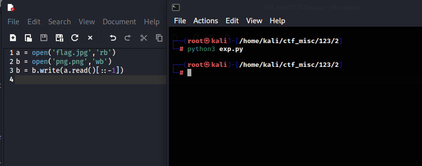


### 添加文件头数据


 这个图片无法打开，我们拖入winhex里看看


文件头部只有

```
0D 0A 1A 0A
```

而png文件头部为

```
89 50 4E 47 0D 0A 1A 0A
```

我们需要写入89 50 4E 47，ctrl+n新建一个文件


随意设置一个大小，然后ctrl+a全选数据，然后ctrl+c复制后粘贴到新文件里


点击第一个值，写入89 50 4E 47


然后ctrl+s保存为png格式的文件


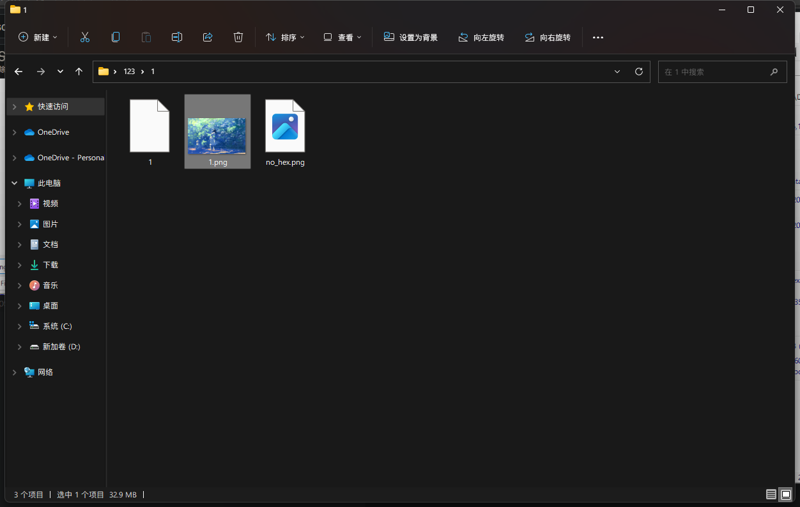

现在图片就显示正常了

## 图片宽高以及CRC爆破

PNG文件中，每个数据块都由四个部分组成，如下:

```
长度(Length)：指定数据块中数据区域的长度，长度不可超过(2^31-1)个字节
数据块类型码(Chunk Type Code)：数据块类型码由ASCII字母(A-Z和a-z)组成的"数据块符号"
数据块数据(Chunk Data)：存储数据块类型码指定的数据
循环冗余检测(CRC)：存储用来检测是否文件传输有误的循环冗余码
```


### 图片高度修改


这是一个png图片，但是感觉高度不太对，我们把图片拖入winhex里


修改图片高度的值

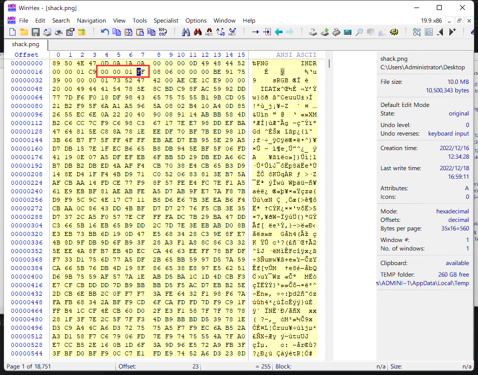

ctrl+s保存后查看图片


出现了flag

### 图片宽度和CRC值爆破

目前手上没这种类型的题，可以去看看落雪wink师傅的文章，因为csdn不让我添加太多外链，所以手动去掉链接中的字符即可

```
ht去掉字符tps://blog.csdn.net/weixin_44145452/article/details/109612189
```

# 从图片中提取文件

通过cmd的copy命令，可以将文件隐藏在图片里，我们需要从图片中提取文件，这也是ctf经常考的点


这是一张正常的jpg图片，但是在最下面可以看到一个文件


说明有其他文件在这个图片里，我们需要提取出来

## 通过binwalk提取图片中的文件

binwalk扫描图片内是否存在其他文件

```
binwalk dog.jpg
```

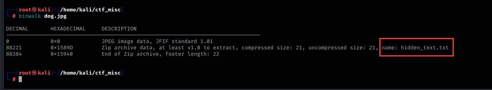

可以看到，这个图片里有一个名为hidden_text.txt的文件，现在我们提取这个文件

```
binwalk -e dog.jpg --run-as=root
```


他会自动生成一个文件夹，将提取出来的文件放入这个文件夹里


## 通过foremost提取图片中的文件

我常用的提取工具是foremost，因为他比binwalk更精确一些

```
foremost dog.jpg -o dog  //-o：指定输出的文件夹
```

在文件夹里有一个名为audit.txt的文件，这个文件里可以查看一些图片的信息


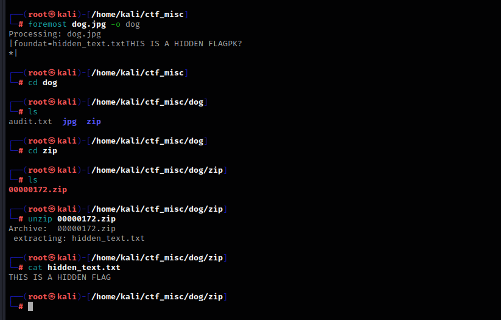

# JPG图片隐写

## jpg图片格式

jpg图片的头数据为

```
FF D8 FF
```

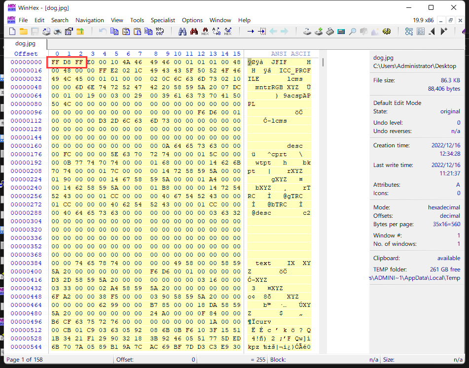

## jpg图片高度修改

这是一个jpg图片，但是在最下面，可以看到flag的一些信息


我们将图片拖入winhex里


我们修改高度，然后ctrl+s保存


就能看见flag了

# EXIF信息

在我们拍摄图片时，exif可以记录数码照片的属性信息和拍摄数据

右击图片，点击熟悉，选择详细信息，这里面可以看到图片拍摄的一些值，有时候还能找到经纬度


在kali里，我们可以用exiftool工具来查看更详细的exif数据

```
exiftool cat.jpg
```


在这里可以看到一串base64编码，我们解密看看

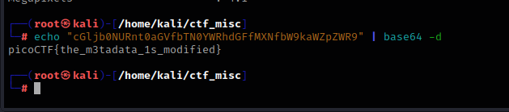

得到flag

在做osint类题目时，需要留意图片的exif信息里有没有经纬度，在做不出来题的时候，可以看看图片的exif信息

# BMP图片隐写

## BMP图片格式

BMP 文件格式能够存储单色和彩色的二维数字图像，具有各种颜色深度，并且可以选择使用数据压缩、alpha 通道和颜色配置文件

bmp的头文件数据为

```
42 4D
```


头数据后四位是图片大小


由于个人计算机都是以小端序，所以数据要从右往左写

```
0x002c268e == 2893454(Byte) == 2.75M
```

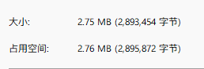

## BMP图片高度修改


这是一个没有后缀名的文件，我们用winhex打开这个文件


文件头为42 4D，这是一个bmp文件，我们将后缀名改成bmp


用ps打开这个图片，可以看到一个假的flag，并且高度也有些不对

这是维基百科对bmp图片结构的解释

```
https://en.wikipedia.org/wiki/BMP_file_format
```


我们将32 01 修改为 32 04，再拖进ps里就能看见flag了

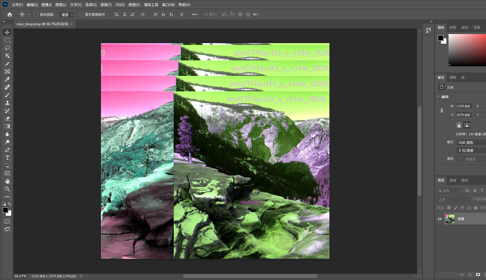

# GIF图片隐写

gif图片是动图，它是由一帧一帧的图片拼接而成

## GIF图片格式

gif头文件数据为

```
47 49 46 38 39 61
```


## GIF帧分离再拼接


这是一个很细的gif图片，我们需要分离它的每一帧后再拼接

```
convert glance.gif flag.png   #一帧一帧分割图片
```

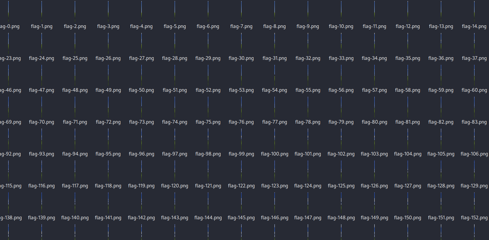

分离出了很多图片，现在我们要把他们拼成一张图片

```
montage flag*.png -tile x1 -geometry +0+0 flag.png     #合并图片
```


得到flag

## GIF图像格式和特征

有些GIF图片每一帧都可能存在规律，这也是常考的点


发现打不开这个gif图片，我们把它拖到winhex里看看


发现文件头数据不见了，我们ctrl+n新建一个文档，然后输入gif的头数据

```
47 49 46 38 39 61
```


回到第一个图片数据，ctrl+a全选，然后复制粘贴到新文件里


ctrl+s保存


现在就能正常读取gif图片了，但是并没有显示flag，而且图片也不是动图，我们猜测它的每一帧都有规律

现在用identify工具来识别规律

```
identify -format "%T" flag.gif
```

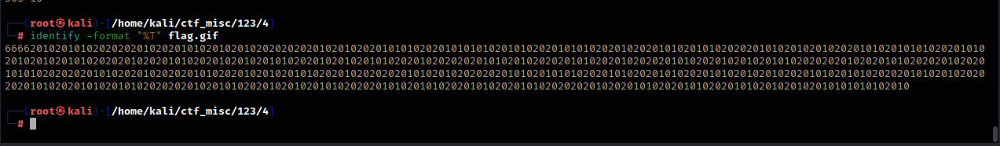

我们将这些值复制出来，新建一个文本文档，将开头的四个6删除过，ctrl+h替换数字


将10全部替换为1，将20全部替换为0


把这些二进制值复制下来，去这个网站对应位置粘贴上去

```
https://www.rapidtables.com/convert/number/ascii-hex-bin-dec-converter.html
```


得到flag

## GIF每一帧查看

如果想查看gif图片的每一帧，则可以使用Stegsolve工具


选择要查看的图片导入


选择frame browser即可查看每一帧

或者用pr也行

# 盲水印

盲水印是一种肉眼不可见的水印方式，可以保持图片美观的同时，保护版权，隐藏式的水印是以数字数据的方式加入音频、图片或影片中，但在一般的状况下无法被看见

这里就用官方图片做演示


这里有两张一模一样的图片，现在我们查看水印

```
bwm decode hui.png hui_with_wm.png flag.png
```

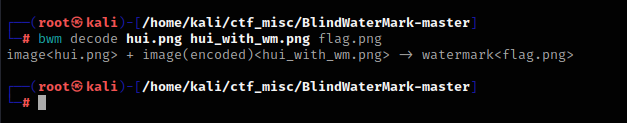


# LSB隐写

lsb隐写题在ctf中也经常考到，LSB即为最低有效位，我们知道，图片中的图像像素一般是由RGB三原色（红绿蓝）组成，每一种颜色占用8位，取值范围为0x00~0xFF，即有256种颜色，一共包含了256的3次方的颜色，即16777216种颜色。而人类的眼睛可以区分约1000万种不同的颜色，这就意味着人类的眼睛无法区分余下的颜色大约有6777216种。 


LSB隐写就是修改RGB颜色分量的最低二进制位也就是最低有效位（LSB），而人类的眼睛不会注意到这前后的变化，每个像数可以携带3比特的信息。 


上图我们可以看到，十进制的235表示的是绿色，我们修改了在二进制中的最低位，但是颜色看起来依旧没有变化。我们就可以修改最低位中的信息，实现信息的隐写

这里就需要用到Stegsolve工具了


这是一个正常的png图片，但是用binwalk工具发现了这个图片里还隐藏了一张图片

```
binwalk final.png 
```


我们用foremost工具提取图片

```
foremost final.png -o flag
```

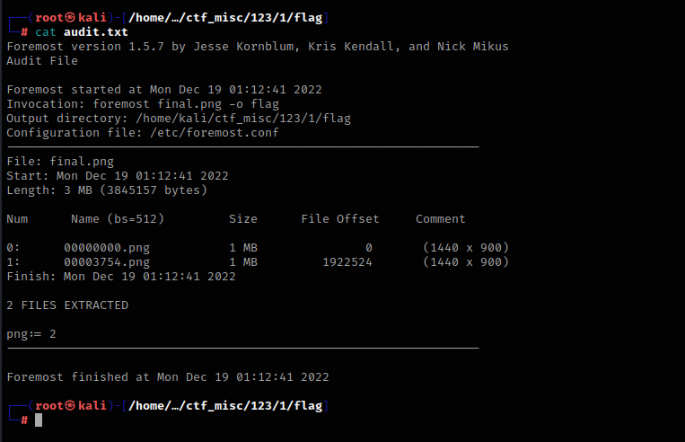

提取出来的图片名叫00003745.png


然后用Stegsolve打开这个图片


选择data extract


设置red位和lsb模式后，点击preview


往上查看就能看见flag


有些题需要一个一个试，或者使用一开始的图标查看图片有没有什么特殊的变化，然后对应左上角的模式去data extract里查看


## 提取图像中的隐藏数据

有些题目是利用LSB的特性来往里面隐藏一些字符串


这是一张正常的png图片，我们把它拖入winhex里查看


在最下面发现了隐藏的图片和一串字符串7his_1s_p4s5w0rd，猜测是lsb隐写解密的key值

现在使用foremost提取图片

```
foremost FindHideMsg.png -o test
```


图片提示我们是lsb隐写，现在我们就需要用到刚刚的key值去解密信息

```
lsb extract secret.png flag.txt  7his_1s_p4s5w0rd
//extract：提取，后面为需要提取信息的图片和输出的文件名，以及key值
```


# 查看文件里的字符串

有些题目往图片里添加一些字符串，列如上一道题目，我们可以使用strings工具来查看文件里的字符串


这是一张正常的jpg图片，现在我们提取文件里的字符串


```
strings hex.jpg
```


# 总结

很多题目都是考了不同或者多方向的知识点，总之，学得越多越好