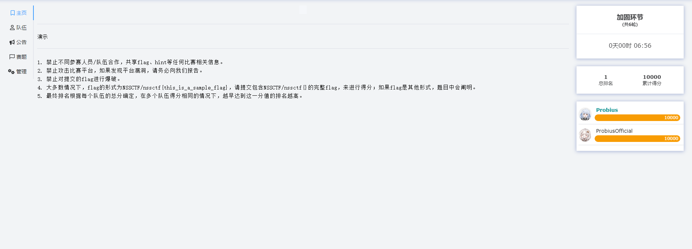

# AWD平台

国内目前能够提供AWD训练的平台：

**[NSSCTF](https://www.nssctf.cn/)**

- 上线不久的AWD功能，题目比较少但持续更新。

- 每隔一段时间会有官方AWD比赛，也可自定义比赛。

**[Bugku](https://ctf.bugku.com/)**

- 国内成熟的AWD供应平台，题目基数大。

- 定期会有排位赛，也可自定义比赛训练。


## NSSCTF 使用

### 流程

请在进行比赛前仔细阅读平台规则。

#### 报名比赛

登录NSSCTF平台后 在上方导航栏中选择 **比赛**

跳转到比赛页面后 在右侧功能区的 **来源** 选择 **自定义竞赛**

**权限** 选择为 **公开** 时 可报名公开比赛 **私密** 同理 但需要提供比赛密码。


报名成功后，

在比赛开始前 点击 **已报名** 即可进入比赛界面 以配置队伍；

若比赛 **已开始** 或者 **已结束** 则点击绿色的 **进入** 可进入比赛页面


通过输入队伍token加入队伍。


比赛开始后，点击 **进入** 按钮进入比赛


在比赛主页 会显示比赛信息，右侧会显示计分板。



在赛题选项中查看队伍GameBox信息，计分板会一直跟随显示。


#### 建立连接

```
beescms(AWD)

题目描述：NULL

攻击标识：curl http://flagserver/flag?token=NSS_XDNEMU
状态：
运行中

题目端口：80

靶机地址：sjcyns1995-1.ecs190.awd.nssctf.cn

SSH端口：22300

SSH用户密码：nss/265i7ckumxqh
```

对于该靶机，我们使用ssh如下指令可建立连接：

```
ssh nss@sjcyns1995-1.ecs190.awd.nssctf.cn -p 22300
```


通常为了方便管理，我们会依赖一些ssh工具，因为他们会集成一些 诸如 文件下载 修改的交互功能。


#### 备份加固

通常我们选择将整个 www 文件夹 下载下来


- 用作备份
- 本地审计加固

#### 攻击得分

另一队视角：


在对方机器上面任意能够执行命令的地方成功运行攻击标识时，我方得分，对方扣分 ( NSS平台目前为被攻击不扣分) ：


攻击成功后，在服务器check后则会反应得分情况：（分数数据会稍有延迟）


每一轮中，对每个队伍只能攻击成功一次：


### 规则

见 [ [Version 2.4 更新说明 ](https://www.nssctf.cn/note/set/2716)] ，内容如下：

- 在NSS AWD中，你只需要向`flagserver`发送相应的请求即算攻击成功。例如题目界面为


- 这里你只需要成功入侵其他队伍/人员靶机后发起这个请求即算攻击成功，你可以通过flagserver的返回内容判断是否攻击成功，响应如下

```Plaintext
code: 0, 攻击成功
code: -1, 参数不全，例如token没有带上
code: -2, 无效的Token参数，请检测token是否正确或者是否被过滤
code: -3, 您不能攻击自己的靶机
code: -4, 该轮已攻击过当前靶机，每轮只会有一次请求会被判定为有效攻击
code: -5, 还未到攻击时间
code: -999, 其他错误
```

- 开赛后你可以通过SSH服务登录自己（队伍）的靶机进行源码下载、防御部署等服务。每个队伍的SSH端口和密码都不相同，你可以通过下列命令进行登录

```Plaintext
ssh nss@靶机地址 -p SSH端口
```

- 同样你也可以使用其他SSH管理软件进行访问。
- **你不需要扫描其他服务器的地址** ，可在题目界面右侧获得本题所有 **靶机地址** （包括自己的也在内）用于编写自动化脚本。
- 同时所有题目除了 **题目端口** 和 **SSH端口** 外，其他端口上不包含任何题目相关信息。你不需要对靶机服务器发起端口扫描。
- 攻击成功的反馈不会实时更新在页面上，你可以通过上述提到的flagserver返回内容来进行判定。
- 服务器会在每轮 **随机** 时间对靶机进行检查，检查内容包括但不限于
  - 特定内容是否存在
  - 特定功能是否可用
  - 特定流程是否完整
- 任意一项检查不可用时将会判断服务器为宕机，并进行扣分，服务器状态会在每轮结束时进行更新，请不要对靶机上的正常功能或题目描述中指定的特殊内容进行修改，被判定宕机你可以通过备份更新等操作重新恢复（服务器状态不会立即更新，同样是在每轮结束时进行更新）