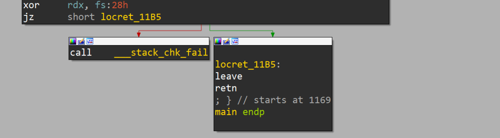
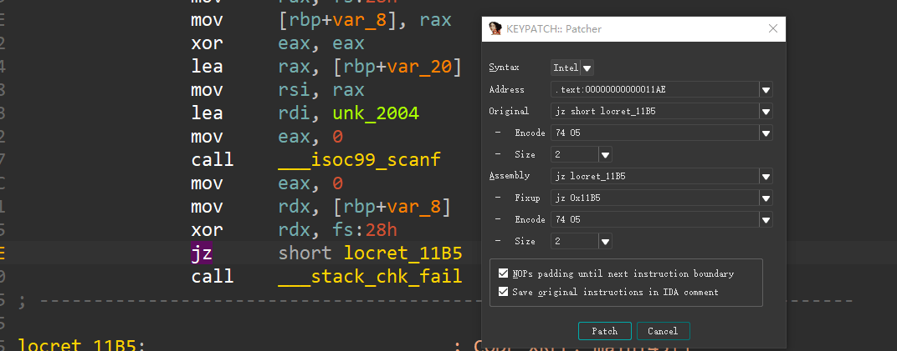
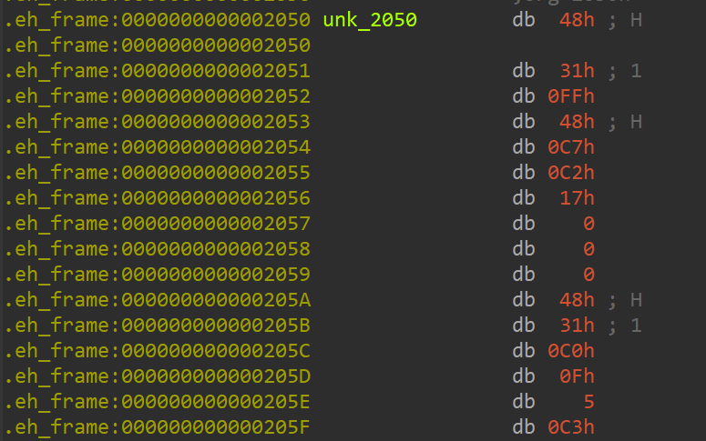
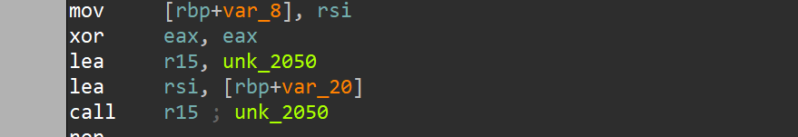
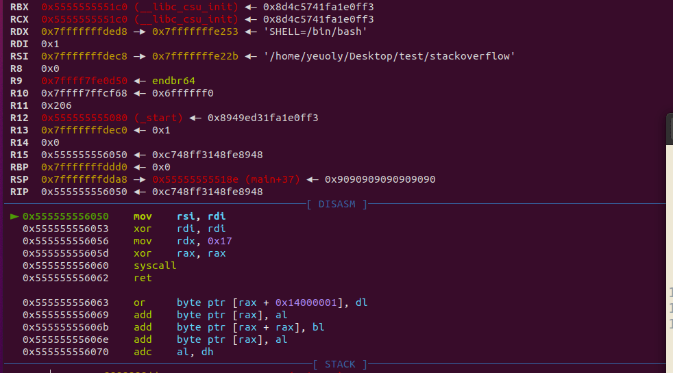
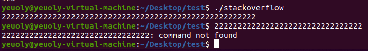
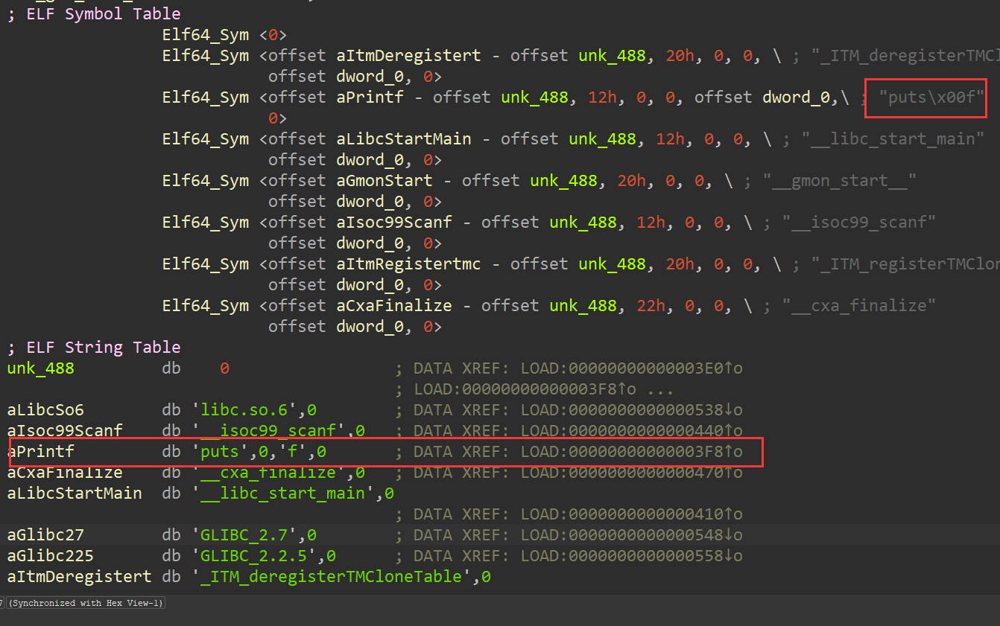

# 【PWN】AWD技巧
**开始之前**：
在了解AWD的PWN之前，我们需要考虑AWD中PWN的位置，在大部分AWD比赛中，WEB的得分都会变得非常困难，其涉及知识面广，难度大，调试时间长，并且简单的修复也可能会需要很长的时间，但PWN相对没有那么复杂。

就算是这两年很火的LLVM等题型，其实也就是加大了逆向难度，而PWN本身难度依然不大，因此，大部分的比赛中，PWN都会成为拉开差距的点，虽然攻击依旧困难，但是修复是相对很简单的（只要出题人别瞎出。。）

### PWN题攻击

这个其实就没什么好说的了，和常规CTF那是一模一样的，比较大的区别应该就是AWD中的PWN一般很少会出堆题，主要是因为太好修了。。。为了应对这个问题，出题人也经常会将堆和栈结合在一起出，比较经典的就是setcontext、打environ指针之类的方法，具体怎么修我们下文中会提。

### PWN题修复

关于pwn的修复这个东西我们这里考虑两种场景，第一个给了源码时的修复，第二个是没给源码时的修复

#### 有源码时的基础修复
先考虑有源码时的修复，这个其实很好操作，主要是熟练gcc g++的各种指令，还有就是要能快速发现漏洞点，由于pwn题中经常是溢出类题型和UAF类题型偏多，所以要分别考虑这两种情况，先看有码的溢出类题型（要非常注意strcat strcpy等会造成off by null的函数

```c
int main(){
    char buf[24];
    scanf("%s", buf);
    return 0;
}
```

像这种那肯定是改%s为%23s，不能有更长的了，或者适当增扩buf的大小，而且它方法也是类似的，有源码的情况下那可太好修复了

#### 无源码时的程序修改
那么无源码应该怎么修复？这似乎就是pwn里面的patch了

先列出来几张表，下面是jmp的相关指令，对于负数等情况需要用到

| 指令 | 机器码 | 指令 | 机器码 |
| ---- | ------ | ---- | ------ |
| jmp  | EB XX  | jz   | 74 XX  |
| je   | 74 XX  | jne  | 75 XX  |
| jg   | 7F XX  | jge  | 7D XX  |
| jl   | 7C XX  | jle  | 7E XX  |
| ja   | 77 XX  | jae  | 73 XX  |
| jb   | 72 XX  | jbe  | 76 XX  |
| jna  | 76 XX  | jnb  | 73 XX  |
| jnae | 72 XX  | jnc  | 73 XX  |
| jnb  | 73 XX  | jng  | 7E XX  |
| jnge | 7C XX  | jnl  | 7D XX  |

现在我们以单纯的篡改程序的思想来看下面这个逻辑（注意不是修复哦，只是试一试改程序）



这是一个很明显的canary，那么我们想让这个canary反过来应该怎么做呢？即不溢出的时候调用__stack_chk_fail，溢出的时候不调用

选择IDA中的key -> patcher



可以发现jz的指令是74 05，即jz $.+5，我们将其修改为jnz


指令就变成了75 05，当然，也可以使用pwntools的asm，也可以帮助我们快速找opcode

然后选择IDA中的edit ->patch program -> apply patches to input file即可保存文件，然后去跑一跑就会发现雀食达到了我们要的效果


#### 常规补丁

好这是上面是第一个最简单的patch修改指令，下面我们来一个难点的，对于scanf("%s")我们应该如何patch？

我搜了很多其他师傅的思路，第一个是利用eh_frame段，这个段在程序正常运行的时候一般用不到，但是它是被赋予了X权限的，也就是说可执行，你比如说对于这个


这里call了__isoc99_scanf的PLT，那么我们在eh_frame上自己写一个函数，让它call到我们自己的函数上去，而我们自己的函数我们就严格限制输入大小，注意这里传入的第二个参数为缓冲区地址

我们这里非常简单暴力，自己通过syscall来输入，然后我们去修改eh_frame，编写如下脚本用于生成字节码

```python
from pwn import *

context.arch = 'amd64'

code = '''
	xor rdi, rdi
	mov rdx, 23
	xor rax, rax
	syscall
	ret
'''

for i in list(asm(code, arch='amd64')):
	print(hex(i)[2:].rjust(2, '0'), end = ' ')
print()
```

然后去修改 **call scanf**



最后，修改call scanf到call eh_frame上来，由于这里我们开了PIE，所以需要call一个相对坐标

先看看原本的地方


我们需要把这个函数除了对我们有用的部分全部劫持到我们在eh_frame上的代码，多余的部分全部改为nop



这是我改完以后的，主要就是lea r15, qword_2050这个点，我们需要使用相对寻址来计算目标代码的位置，生成opcode的代码如下，当然也可以直接用keypatch

```python
from pwn import *

context.arch = 'amd64'

code = '''
	lea r15, [rip + 0xec5]
	lea rsi, [rbp - 0x20]
	call r15
'''

for i in list(asm(code, arch='amd64')):
	print(hex(i)[2:].rjust(2, '0'), end = ' ')
print()
```

至于这个 **0xec5** 怎么来的，首先，lea的长度为7，所以lea的下一条指令的地址是0x118b，使用0x2050 - 0x118b得到0xec5

好了现在我们将程序打包到gdb里调试看看



现在雀食是可以跳转过来执行了，但是还有最后的问题，即eh_frame没有执行权限，这个我们通过IDA修改ELF的头来实现


Type一定得是LOAD，而我们的补丁打在第三个LOAD里，所以我将Flags修改为了7，当然啊，这样做其实是非常不负责的，但是做题嘛，怎么快怎么来，如果想要负责的话，那就得加一个LOAD，并且还需要处理好PIE，至少现在是正常跑起来了也不会溢出



#### 替换PLT|GOT修复
如果说程序东西不多而且敏感函数就调用那么一两次的话我们也可以通过修改重定位表来修复

先来看源码

```c
#include<stdio.h>

int main(){
        char buf[24];
        scanf("%s", buf);
        printf(buf);
        return 0;
}
```

这里我们只考虑修复printf而不考虑修复scanf，修scanf参考上文的方案即可

编译

> gcc replace_plt.c -o replace_plt -fno-stack-protector -z lazy

修printf，这里我们通过篡改printf为puts来实现，但是源程序里并没有puts，所以需要更改dyn

我们找到printf的dynsym


我们去修改printf为puts



然后patch，再次打开程序的时候可以发现就变成puts了


这里涉及到的其实是一个ret2resolve里的小知识，我们简单提一嘴，就是Libc动态链接的过程其实是依靠函数名的，虽然我们平时看到的PLT GOT等表中都没有包含函数名，但实际上它储存了一些索引，方便动态链接函数通过PLT找到这个函数名，最后再通过去Libc中对比函数名寻找真实的函数地址，因此修改函数名的修复是有效的，玩的花一点我们还可以把free的函数名修改为atoi之类的东西，直接pass掉大部分堆题。。

不过这样其实还是有问题，因为我们这里使用的是puts，它比printf短，那如果需要替换为__printf_chk呢？

还是使用到了eh_frame段，主要是因为这个段一般真用不到，不会影响程序正常运行，不过如果想的话也可以自己再加点东西进来


然后修改printf到这里来 0x2060 - 0x488 = 0x1bd8


最后我们执行


虽然说报错了，但是可以发现报错信息也只是说找不到这个符号，我们的替换还是正确的，换成别的函数是没问题的，只是IDA这个地方会报错，但是不影响

#### 堆题的一些通用修复

我们都知道堆题高度依赖于 free 函数，如果说malloc等函数的不正确使用是造成漏洞的主要原因（比如说溢出就属于长度没控制好），那free就是触发漏洞的关键，当然了，还有别的触发方式，我们这里不深入

那么我们如何修复free呢？很简单啊， **nop** 掉就完事了，这样的做法有时候在比赛中比较管用，但也不是啥时候都管用，因此我们还有另外几种方案

因为现在的PWN题运行过程动不动就有个 **5s** 以上（比如说要打IO爆破），而checker的运行只有短短 **1~5** 秒，那么为什么不从alarm上下手呢？

alarm函数会在时间到了以后强制结束进程，那么我们可以patch程序最开始的 **alarm(60)** 为 **alarm(3)**，这样就有可能造成checker通过而exp不通过，从而通过check逻辑

#### 通防
##### EvilPatcher
这个东西是我在某次比赛中看到的，基本上通杀。。神挡杀神佛挡杀佛，那次比赛吃了大亏，全场貌似就包括我在内的少数几个人不知道这东西，我们就简单给出链接吧

[https://github.com/TTY-flag/evilPatcher](https://github.com/TTY-flag/evilPatcher)

##### 自制通防思路

**写在前面**：
这种方法对于Docker环境不适用，因为需要Docker开启 **CAP_SYS_PTRACE** 权限，但是这玩意会导致Docker逃逸，不过当然了，如果是纯黑盒的话，想逃还是很难的，360等平台使用的似乎就是Docker的环境，而永信至诚的平台似乎是VM环境，这种方法可以使用

**开始吧**：
要拼速度的话，慢慢找洞慢慢替换肯定是不行的，所以要提前准备好通防操作，在pwn中，通防肯定就是不让你开shell不让你读文件了，主要就是要关掉open openat execve等系统调用了

这里的我的思路是将注入代码写入eh_frame中，并且劫持程序入口到这个地方来，先执行注入逻辑，将原本的进程作为子进程启动，父进程通过ptrace等函数来监控子进程的行为，如果发现子进程调用了open openat execve等函数，那么就kill掉子进程

shellcode的C版本如下，为了避免外部引入的库函数用到了plt等结构（用到了的话就g了），如ptrace等函数我都换成了用汇编编写的syscall

```c
#include <sys/ptrace.h>
#include <sys/types.h>
#include <sys/wait.h>
#include <unistd.h>
#include <sys/user.h>
#include <stdio.h>

void d(){  
    register pid_t child;
    int status;

    struct user_regs_struct regs;

    asm(
        "movq $57, %%rax;"
		"syscall;"
		"movl %%eax,%0":"=r"(child)
    );
    if(child == 0) {
	asm(
	    "movl $101, %eax;"
	    "xorq %rsi, %rsi;"
	    "xorq %rdx, %rdx;"
	    "xorq %r10, %r10;"
	    "xorq %rdi, %rdi;"
 	    "syscall;" //ptrace(PTRACE_TRACEME)
	    "movl $39, %eax;"
	    "syscall;" 
	    "movl %eax, %edi;"
	    "movl $19, %esi;"
	    "movl $62, %eax;"
	    "syscall;"
	);
	//kill(getpid(), 19);
	goto end;
    } else {
	asm(
	    "movl $61, %eax;"
	    "xorq %rdi, %rdi;"
	    "syscall;"	    
	);
	//wait(NULL);
	while(1){
	    asm(
			"movl %0, %%esi"::"r"(child):"%esi"
	    );
	    asm(
			"movl $101, %eax;"
			"movl $24, %edi;"
			"xorq %rdx, %rdx;"
			"xorq %r10, %r10;"
			"syscall;"
	    );		      	//ptrace(PTRACE_SYSCALL, child, NULL, NULL);
	    void *p = (void *)&status;
	    asm(
			"movl %0, %%edi"::"r"(child):"%edi"
	    );
	    asm(
			"movq %0, %%rsi"::"r"(p):"%rsi"		    
	    );
	    asm(
			"xorq %rdx, %rdx;"
			"movl $61, %eax;"
			"syscall;" //waitpid(pid)
	    );
	    void *regs_addr = (void *)&regs;
	    asm(
			"movq %0, %%r10"::"r"(regs_addr):"%r10"
	    );
	    asm(
			"movl %0, %%esi"::"r"(child):"%esi"
	    );
	    asm(
			"movl $12, %edi;"
			"xorq %rdx, %rdx;"
			"movl $101, %eax;"
			"syscall;"		//ptrace(PTRACE_GETREGS)
	    );
	    if((regs.orig_rax >= 56 && regs.orig_rax <= 59 ||
          regs.orig_rax == 231)){
		asm(
		    "movl %0, %%edi"::"r"(child):"%edi"	
		);
		asm(
		    "movl $9, %esi;"
		    "movl $62, %eax;"
		    "syscall;"
		);
		//kill(child, 9);
		break;
		}
	}
	asm(
		"movl $555, %edi;"
		"movl $60, %eax;"
		"syscall;"
	);
	}
end:
return;
}

int main(){
	d();
	//execl("/bin/ls", ".");
	system("ls");
	return 0;
}

```

现在只要调用到了execve clone vfork fork等系统调用就会被拦截然后强制终止程序的执行，限制执行了system，如果没有d函数执行的话应该是会执行ls指令的，但是现在d函数开启了沙盒，那么按道理来说会直接退出


可以发现去雀食没有执行了

后面我又加了几段代码用来平衡栈和保存环境

生成完的shellcode如下（没有包含jmp start，64位，这个shellcode不包含open和openat

```
57 56 52 51 55 48 89 E5 53 48 83 EC 78 48 C7 C0 
39 00 00 00 0F 05 89 C0 89 C3 85 DB 75 2D B8 65 
00 00 00 48 31 F6 48 31 D2 4D 31 D2 48 31 FF 0F 
05 B8 27 00 00 00 0F 05 89 C7 BE 13 00 00 00 B8 
3E 00 00 00 0F 05 E9 97 00 00 00 B8 3D 00 00 00 
48 31 FF 0F 05 89 DE B8 65 00 00 00 BF 18 00 00 
00 48 31 D2 4D 31 D2 0F 05 48 8D 45 E4 48 89 45 
F0 89 DF 48 8B 45 F0 48 89 C6 48 31 D2 B8 3D 00 
00 00 0F 05 48 8D 85 08 FF FF FF 48 89 45 E8 48 
8B 45 E8 49 89 C2 89 DE BF 0C 00 00 00 48 31 D2 
B8 65 00 00 00 0F 05 48 8B 45 80 48 83 F8 37 76 
0A 48 8B 45 80 48 83 F8 3B 76 0C 48 8B 45 80 48 
3D E7 00 00 00 75 8E 89 DF BE 09 00 00 00 B8 3E 
00 00 00 0F 05 90 BF 2B 02 00 00 B8 3C 00 00 00 
0F 05 90 48 83 C4 78 5B 5D 59 5a 5e 5f
```

包含open和openat的shellcode
```
57 56 52 51 55 48 89 E5 53 48 83 EC 78 48 C7 C0 
39 00 00 00 0F 05 89 C0 89 C3 85 DB 75 2D B8 65 
00 00 00 48 31 F6 48 31 D2 4D 31 D2 48 31 FF 0F 
05 B8 27 00 00 00 0F 05 89 C7 BE 13 00 00 00 B8 
3E 00 00 00 0F 05 E9 B1 00 00 00 B8 3D 00 00 00 
48 31 FF 0F 05 89 DE B8 65 00 00 00 BF 18 00 00 
00 48 31 D2 4D 31 D2 0F 05 48 8D 45 E4 48 89 45 
F0 89 DF 48 8B 45 F0 48 89 C6 48 31 D2 B8 3D 00 
00 00 0F 05 48 8D 85 08 FF FF FF 48 89 45 E8 48 
8B 45 E8 49 89 C2 89 DE BF 0C 00 00 00 48 31 D2 
B8 65 00 00 00 0F 05 48 8B 45 80 48 83 F8 37 76 
0A 48 8B 45 80 48 83 F8 3B 76 26 48 8B 45 80 48 
3D E7 00 00 00 74 1A 48 8B 45 80 48 83 F8 02 74 
10 48 8B 45 80 48 3D 01 01 00 00 0F 85 74 FF FF 
FF 89 DF BE 09 00 00 00 B8 3E 00 00 00 0F 05 90 
BF 2B 02 00 00 B8 3C 00 00 00 0F 05 90 48 83 C4 
78 5B 5D 59 5a 5e 5f
```

32位的C代码和shellcode如下，编译的时候要关闭位置无关代码，否则gcc在32位下会引入__x86.get_pc_thunk.ax函数，从而用到了GOT，导致生成的shellcode不能移植

```c
#include <sys/ptrace.h>
#include <sys/types.h>
#include <sys/wait.h>
#include <unistd.h>
#include <sys/user.h>
#include <stdio.h>

void d(){
    pid_t child;
    int status;

    struct user_regs_struct regs;

    asm(
        "movl $2, %%eax;" //fork
		"int $0x80;"
		"movl %%eax,%0":"=r"(child)
    );
    if(child == 0) {
	asm(
	    "movl $26, %eax;" // ptrace
	    "xorl %ecx, %ecx;" //2
	    "xorl %edx, %edx;" //3
	    "xorl %esi, %esi;" //4
	    "xorl %ebx, %ebx;" //1
 	    "int $0x80;" //ptrace(PTRACE_TRACEME)
	    "movl $20, %eax;" // getpid
	    "int $0x80;" 
	    "movl %eax, %ebx;" // 0 1
	    "movl $19, %ecx;" // 2
	    "movl $37, %eax;" // 0 kill
	    "int $0x80;"
	);
	//kill(getpid(), 19);
	goto end;
    } else {
	asm(
	    "movl $114, %eax;" // 0 wait4
	    "xorl %ebx, %ebx;" // 1
	    "int $0x80;"	    
	);
	//wait(NULL);
	while(1){
	    asm(
			"movl %0, %%ecx"::"r"(child):"%ecx" // 0 2
	    );
	    asm(
			"movl $26, %eax;" // 0 ptrace
			"movl $24, %ebx;" // 1
			"xorl %edx, %edx;" // 3
			"xorl %esi, %esi;" // 4
			"int $0x80;"
	    );		      	//ptrace(PTRACE_SYSCALL, child, NULL, NULL);
	    void *p = (void *)&status;
	    asm(
			"movl %0, %%ebx"::"r"(child):"%ebx" // 0 1
	    );
	    asm(
			"movl %0, %%ecx"::"r"(p):"%ecx" // 0 2    
	    );
	    asm(
			"xorl %edx, %edx;" // 3
			"movl $114, %eax;" // 0 0 wait4
			"int $0x80;" //waitpid(pid)
	    );
	    void *regs_addr = (void *)&regs;
	    asm(
			"movl %0, %%esi"::"r"(regs_addr):"%esi" // 0 4
	    );
	    asm(
			"movl %0, %%ecx"::"r"(child):"%ecx" // 2 
	    );
	    asm(
			"movl $12, %ebx;" // 0 1
			"xorl %edx, %edx;" // 3
			"movl $26, %eax;" // 0 0 ptrace
			"int $0x80;"		//ptrace(PTRACE_GETREGS)
	    );
	    if((regs.orig_eax == 2 || regs.orig_eax == 11 || 
            regs.orig_eax == 190 || regs.orig_eax == 120 || 
            regs.orig_eax == 252)){
            asm(
                "movl %0, %%ebx"::"r"(child):"%ebx" // 0 1	
            );
            asm(
                "movl $9, %ecx;" // 0 2
                "movl $37, %eax;" // 0 0 kill
                "int $0x80;"
            );
            //kill(child, 9);
            break;
		}
	}
	asm(
		"movl $555, %ebx;" // 0 1
		"movl $1, %eax;" // 0 0 exit
		"int $0x80;"
	);
	}
end:
return;
}

int main(){
	d();
	execl("/bin/ls", ".");
	//system("ls");
	return 0;
}
```

shellcode（加入了pusha 和popa）：

```
60 55 89 E5 56 53 83 EC 60 B8 02 00 00 00 CD 80 
89 C0 89 45 F4 83 7D F4 00 75 29 B8 1A 00 00 00 
31 C9 31 D2 31 F6 31 DB CD 80 B8 14 00 00 00 CD 
80 89 C3 B9 13 00 00 00 B8 25 00 00 00 CD 80 E9 
9F 00 00 00 B8 72 00 00 00 31 DB CD 80 8B 45 F4 
89 C1 B8 1A 00 00 00 BB 18 00 00 00 31 D2 31 F6 
CD 80 8D 45 E8 89 45 F0 8B 45 F4 89 C3 8B 45 F0 
89 C1 31 D2 B8 72 00 00 00 CD 80 8D 45 A4 89 45 
EC 8B 45 EC 89 C6 8B 45 F4 89 C1 BB 0C 00 00 00 
31 D2 B8 1A 00 00 00 CD 80 8B 45 D0 83 F8 02 74 
24 8B 45 D0 83 F8 0B 74 1C 8B 45 D0 3D BE 00 00 
00 74 12 8B 45 D0 83 F8 78 74 0A 8B 45 D0 3D FC 
00 00 00 75 88 8B 45 F4 89 C3 B9 09 00 00 00 B8 
25 00 00 00 CD 80 90 BB 2B 02 00 00 B8 01 00 00 
00 CD 80 90 83 C4 60 5B 5E 5D 61
```

那么接下来我们实践看一下，编写程序如下

```c
#include<stdio.h>

int main(){
	system("ls");
}
```

执行效果如下


然后开始植入代码到eh_frame


篡改程序入口到eh_frame


修改eh_frame的权限为7


计算jmp到start上去的偏移，lea的指令长度为7，我们shellcode结束的地方是0x213c，所以lea的地址是0x213d，所以这个时候的rip是0x2144，计算start函数到这里的偏移（如果没有开启PIE的话就直接jmp绝对地址


生成shellcode

```python
from pwn import *

context.arch = 'amd64'

code = '''
	lea r15, [rip-0x10e4]
	jmp r15
'''

for i in list(asm(code, arch='amd64')):
	print(hex(i)[2:].rjust(2, '0'), end = ' ')
print()
```


植入在之前通防壳的后面


现在我们再去执行一下system看看


另外说一句，对于32位的程序，由于pwntools在生成代码的时候很蛋疼，对重定位的检测很离谱，所以我们最好直接用opcode来写，jmp指令的opcode为E9，操作数为4字节，指令长度为5字节，4字节的操作数即为相对偏移，支持负数，所以我在32位程序上就是直接写jmp指令，当然，64位下也是一样的，区别不大，大概改成下面这样即可

