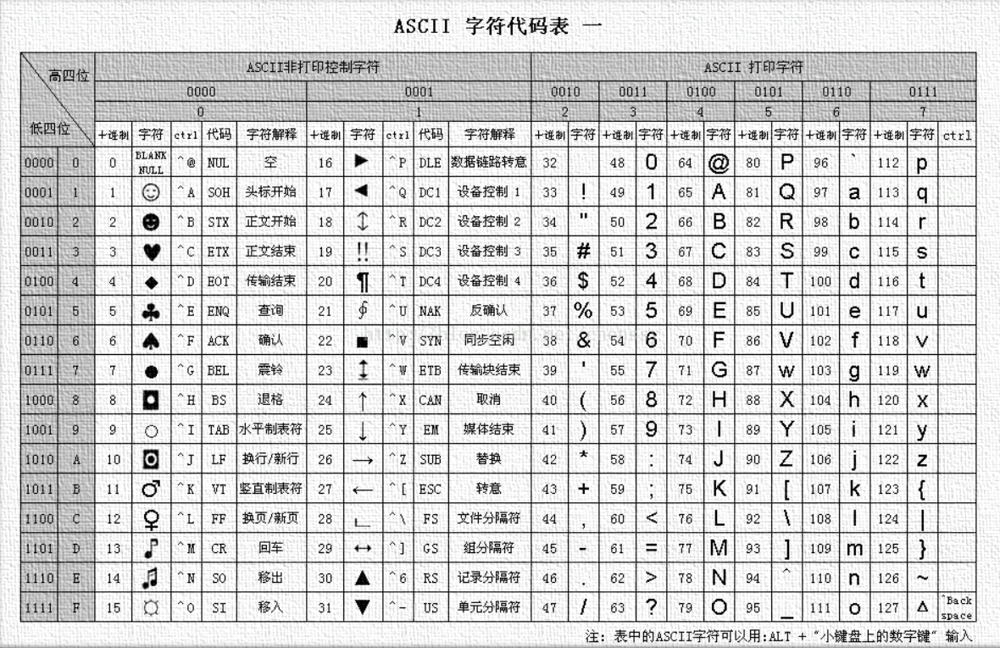

## 编码 / Encoding

### 简述

编码不同于密码，他的关键不是隐藏信息，而是处理信息，是信息的另一种表示形式，用于解决一些特殊字符、不可见字符的传输问题。

将原始信息变成编码信息的过程为 **「编码 Encoding  」**，反之，将编码信息转化回原始信息，转化的过程称之为 **「解码 Decoding  」**。

编码很少单独作为题目出现在CTF中，除开T0级别的签到题目，多数情况都贯穿CTF的各个方向，包括但不限于 杂项 和 密码学。

### 工具

编码是一个很庞大的家族，即使我们能记住每个编码的特征，但也无法做到颅内编译，所以使用工具来处理编码是极其必要的。

#### CyberChef

[ CyberChef  ](https://github.com/gchq/CyberChef)是CTF中最常用的编码解码工具之一，内含多种编码和解码方式。

{ width="80%" }

#### Ciphey

[Ciphey](https://github.com/Ciphey/Ciphey) is a Fully automated decryption/decoding/cracking tool using natural language processing & artificial intelligence, along with some common sense.

{ width="80%" }


#### 随波逐流

[[随波逐流]CTF编码工具](http://1o1o.xyz/bo_ctfcode.html)  由随波逐流编写开发，CTF编码工具为用户提供丰富的离线符编码进行转换，加密解密功能。

{ width="80%" }


### 常见编码

{ width="80%" }

接下来我们使用经典的通信测试信息—— " `Squdgy fez, blank jimp crwth vox` " 来给大家简述一下一些常见的编码。

#### ASCII 编码



一种使用指定的 7 位或 8 位二进制数组合来表示 128 或 256 种可能的字符的编码方式。 

`Squdgy fez, blank jimp crwth vox`

上面的ASCII表使用的「**十进制 Decimal** 」来表示对应的值，这也是我们通常使用的方法：

> "Decimal" 来自拉丁词 "decimus"，意为 "tenth"（第十）。在数学和日常生活中，我们使用的最常见的数字系统是十进制（decimal）数字系统。


当然，您也可以将其转换为其他进制表示：


#### Hex

**「Hex Hexadecimal 」** 意为 "十六进制"，虽然十六进制经常用于与编码相关的上下文中，但它并不是一种编码，只是一种数值表示法。只不过在CTF中有时会以签到题目出现，比如：

```
666c61677b5371756467792066657a2c20626c616e6b206a696d7020637277746820766f787d
```


**From Hex to String** ,目前在赛题已经不再常见，而在此写出的目的也是为了提醒大家，良好的计算机基础，包括对各种进制的熟悉程度在CTF中也是相当重要。

#### Base家族

Base家族的编码方式提供了一种方法，将原始的二进制数据转换成一个更“友好”的、由特定字符集组成的字符串格式，比如base64、base32、base16可以分别编码转化8位字节为6位、5位、4位。16,32,64分别表示用多少个字符来编码。

以Base64为例：

编码过程：

1. 将输入数据分割成长度为 3 的字节组。
2. 将这三个字节转换为4个6位的组。这样做是通过将这三个字节（总共24位）重组为4个6位的数值。
3. 使用这4个6位的数值作为索引，从BASE64字符集中选择对应的字符。
4. 如果输入数据的字节长度不是3的倍数，就在输出的BASE64字符串后面加上一个或两个'='字符作为填充。

```
源文本：Go

G -> 01000111
o -> 01101111

得到8位binary：01000111 01101111

分组为6位binary：010001 110110 1111

补0：010001 110110 111100

对应十进制：17 54 60 (为数组下标)

ABCDEFGHIJKLMNOPQRSTUVWXYZabcdefghijklmnopqrstuvwxyz0123456789+/
-----------------↑------------------------------------↑-----↑---

010001 -> R
110110 -> 2
111100 -> 8

查表得：R28
补齐得：R28=
```
解码过程则是编码的逆过程：

1. 把 Base64 字符串去掉等号，转为二进制数
2. 从左到右，8 个位一组，多余位的扔掉，转为对应的 ASCII 码

```
密文： R28=
去掉=：R28
对应十进制（ASCII 码）：    17     54     60 
还原位6位二进制 ：       010001 110110 111100
重新分组为8位二进制：     01000111 01101111 00
8位二进制转换为对应ASCII码：  G        o     /(丢弃不完整部分)
得到原文：Go
```


其他Base编码过程同理，这里给出一些常见base的字符集和对应说明，读者可以自行尝试。

| 编码      | 字符集                                                       | 备注                |
| --------- | ------------------------------------------------------------ | ------------------- |
| BASE2     | `01                                                                                    ` | 二进制             |
| BASE16    | `0123456789ABCDEF (或0123456789abcdef)                                                 ` | 十六进制            |
| BASE32    | `ABCDEFGHIJKLMNOPQRSTUVWXYZ234567                                                      ` |                    |
| BASE32Hex | `0123456789ABCDEFGHIJKLMNOPQRSTUV                                                      ` | Base32的变体        |
| BASE58    | `123456789ABCDEFGHJKLMNPQRSTUVWXYZabcdefghijkmnopqrstuvwxyz                            ` | 注意，这个集合避免了容易混淆的字符，例如数字“0”和大写的字母“O”;主要用于比特币地址 |
| BASE64    | `ABCDEFGHIJKLMNOPQRSTUVWXYZabcdefghijklmnopqrstuvwxyz0123456789+/                      ` |                     |
| BASE64URL | `ABCDEFGHIJKLMNOPQRSTUVWXYZabcdefghijklmnopqrstuvwxyz0123456789-_                      ` | 适用于URL和文件名    |
| BASE85    | `!\"#$%&'()*+,-./0123456789:;<=>?@ABCDEFGHIJKLMNOPQRSTUVWXYZ[\\]^_abcdefghijklmnopqrstu` | 例如Adobe's ASCII85 |


#### URL编码

**URL编码**,也被称为百分号编码，是一种编码机制，用于将不安全或特殊的字符转换为`%`后跟其ASCII的十六进制表示，以确保URL的安全传输。

通常的url编码只会处理符号和不可见字符，比如 `Squdgy fez, blank jimp crwth vox`

会被编码为 `Squdgy%20fez%2C%20blank%20jimp%20crwth%20vox `  (普通类型)

但在CTF中我们可能会将其编码为

 `%53%71%75%64%67%79%20%66%65%7a%2c%20%62%6c%61%6e%6b%20%6a%69%6d%70%20%63%72%77%74%68%20%76%6f%78` (复杂类型)

甚至出现多次Url编码的情况，当然这可能存在一些恶趣味，但是在渗透过程中，多次url编码确实是一种有效的Bypass手段。

#### 其他编码

原文：`Test@123 / 测试@123`

- Unicode编码

  ```
  # 默认模式
  \u0054\u0065\u0073\u0074\u0040\u0031\u0032\u0033
  # 宽字符
  \u{54}\u{65}\u{73}\u{74}\u{40}\u{31}\u{32}\u{33}
  # 编码模式
  U+0054U+0065U+0073U+0074U+0040U+0031U+0032U+0033
  # HTML实体 十进制
  &#84;&#101;&#115;&#116;&#64;&#49;&#50;&#51;
  # CSS实体 十六进制
  \0054\0065\0073\0074\0040\0031\0032\0033
  ```

- XXencode编码

    ```
    6J4JnR2+lAXA+
    ```


- UUencode编码

    ```
    (5&5S=$`Q,C,`
    ```

- Escape/Unescape编码

    ```
    %u6d4b%u8bd5@123
    ```
  
- Quoted-printable 编码

    ```
    =E6=B5=8B=E8=AF=95@123
    ```
  
- HTML实体编码

    ```
    # HTML实体 10进制
    &#84;&#101;&#115;&#116;&#64;&#49;&#50;&#51;
    # HTML实体 16进制
    &#x0054;&#x0065;&#x0073;&#x0074;&#x0040;&#x0031;&#x0032;&#x0033;
    ```

- shellcode编码

    ```
    \x54\x65\x73\x74\x40\x31\x32\x33
    ```

#### 莫尔斯电码

「 **摩尔斯电码 Morse code** 」也被称作摩斯密码，当然虽然有密码一词，但其并不属于加解密算法，而是一种经典的编码方式。

```
A  .-    N  -.    .  .-.-.-  +  .-.-.    1  .----
B  -...  O  ---   ,  --..--  _  ..--.-   2  ..---
C  -.-.  P  .--.  :  ---...  $  ...-..-  3  ...--
D  -..   Q  --.-  "  .-..-.  &  .-...    4  ....-
E  .     R  .-.   '  .----.  /  -..-.    5  .....
F  ..-.  S  ...   !  -.-.--              6  -....
G  --.   T  -     ?  ..--..              7  --...
H  ....  U  ..-   @  .--.-.              8  ---..
I  ..    V  ...-  -  -....-              9  ----.
J  .---  W  .--   ;  -.-.-.              0  -----
K  -.-   X  -..-  (  -.--.           
L  .-..  Y  -.--  )  -.--.-          
M  --    Z  --..  =  -...- 
```

下面是一个示例：

原文  `Squdgy fez, blank jimp crwth vox`

编码后  `... --.- ..- -.. --. -.--:..-. . --.. --..--:-... .-.. .- -. -.-:.--- .. -- .--.:-.-. .-. .-- - ....:...- --- -..-`


#### 敲击码

「 **敲击码 Tap code** 」是一种以非常简单的方式对文本信息进行编码的方法。因该编码对信息通过使用一系列的点击声音来编码而命名.

敲击码是基于5×5 方格 **波利比奥斯方阵** 来实现的，不同点是用K字母被整合到C中。

敲击码表:

```
  1  2  3  4  5
1 A  B C/K D  E
2 F  G  H  I  J
3 L  M  N  O  P
4 Q  R  S  T  U
5 V  W  X  Y  Z            
```


#### 小结
目前CTF中单独对编码的考察已经很少见了，更多的是与各个方向相结合，编码本身作为信息的另一种表示方式，或者说"载体"，贯穿CTF或者安全领域乃至整个计算机领域才是它真正的归宿。

当然，各位也无需刻意的去记忆各种编码的特征，它不是密码，它诞生的意义本就是让人看懂，所以依靠搜索引擎就能够解决大部分问题，如果不能解决，那多半是题的问题。

