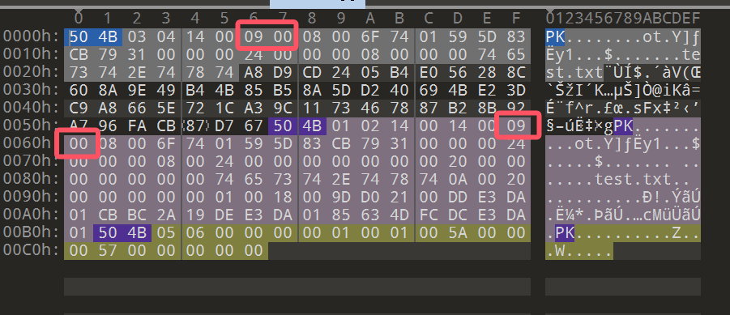

# 压缩包

## 文件结构

### .Zip

一个 ZIP 文件由三个部分组成:

**\+ 压缩源文件数据区**

{ width="85%" }  
 \- `local file header` 由固定值 `50 4B 03 04` 即 .zip 文件的魔法数字作为开始。  
 \- `file data` 记录相应压缩文件的数据  
 \- `data descriptor` 数据描述符用于标识该文件压缩结束，该结构只有在相应的 `local file header` 中通用标记字段的第 `3 bit` 设为 `1` 时才会出现，紧接在压缩文件源数据后。  
**\+ 压缩源文件目录区**

{ width="85%" }  
 \- `Central directory` 记录了压缩文件的目录信息，在这个数据区中每一条纪录对应在压缩源文件数据区中的一条数据。  
**\+ 压缩源文件目录结束标志**

{ width="85%" }  
 \- `End of central directory record(EOCD)` 目录结束标识存在于整个归档包的结尾，用于标记压缩的目录数据的结束。每个压缩文件必须有且只有一个 `EOCD` 记录。  

具体详细的结构可以参考下面 010Editor .zip 模板对照表.

??? note "010Editor .zip 模板对照表"
    ```
    + ZIPFILERECORD record # 压缩源文件数据区
        - char frSignature[4] # 压缩源文件标志
        - ushort frVersion # 压缩源文件版本
        - ushort frFlags # 压缩源文件标志 （有无加密，这个更改这里进行伪加密，改为01 00打开就会提示有密码了）
        - enum COMPTYPE frCompression
        - DOSTIME frFileTime # 压缩源文件时间
        - DOSDATE frFileDate # 压缩源文件日期
        - uint frCrc # 压缩源文件CRC32校验值
        - uint frCompressedSize # 压缩源文件压缩后大小
        - uint frUncompressedSize # 压缩源文件压缩前大小
        - ushort frFileNameLength # 压缩源文件名长度
        - ushort frExtraFieldLength # 压缩源文件扩展域长度
        - char frFileName[frFileNameLength] # 压缩源文件名
        - uchar frData[frCompressedSize] # 压缩源文件数据
    + ZIPDIRENTRY dirEntry # 压缩源文件目录区
        - char deSignature[4] # 目录标志
        - ushort deVersionMadeBy # 创建该条目的版本
        - ushort deVersionNeeded # 解压该条目所需的版本
        - ushort deFlags # 标志位
        - enum COMPTYPE deCompression # 压缩方法
        - DOSTIME deFileTime # 最后修改时间
        - DOSDATE deFileDate # 最后修改日期
        - uint deCrc # CRC32校验值
        - uint deCompressedSize # 压缩后的大小
        - uint deUncompressedSize # 压缩前的大小
        - ushort deFileNameLength # 文件名长度
        - ushort deExtraFieldLength # 扩展域长度
        - ushort deFileCommentLength # 文件评论长度
        - ushort deDiskNumberStart # 起始磁盘编号
        - ushort deInternalAttributes # 内部属性
        - uint deExternalAttributes # 外部属性
        - uint deRelativeOffset # 该条目在 ZIP 文件中的偏移位置
        - char deFileName[deFileNameLength] # 文件名
        - char deExtraField[deExtraFieldLength] # 扩展域
        - char deFileComment[deFileCommentLength] # 文件评论
    + ZIPENDLOCATOR endLocator # 压缩源文件目录结束标志
        - char elSignature[4] # 结束标志
        - ushort elDiskNumber # 当前磁盘编号
        - ushort elStartDiskNumber # 目录开始的磁盘编号
        - ushort elEntriesOnDisk # 当前磁盘上的条目数量
        - ushort elEntriesTotal # 总条目数量
        - uint elSizeOfDirectory # 目录的总大小
        - uint elOffsetOfDirectory # 目录开始的偏移位置
        - ushort elCommentLength # 注释长度
        - char elComment[elCommentLength] # 注释
    ```

### .RAR

一个 RAR 文件主要由以下部分组成:

**+ 标记块和压缩文件头块**


\- `RAR 文件头` 为 `0x 52 61 72 21 1A 07 00`，是RAR文件的魔法数字作为开始。

**+ 文件头块**


\- `File Header` 包含多个字段，如文件CRC、压缩方法、文件大小、文件名等等。

**+ 结尾块**


\- `Terminator` 是每个RAR文件的结尾块，其结构固定，主要用于标记RAR文件的结束。

## 爆破攻击

最简单，最直接的攻击方式，适合密码较为容易或已知密码范围 / 格式，包括字典爆破、掩码攻击等。

### ARCHPR


### Ziperello


### fcrackzip

**Usage**

```
USAGE: fcrackzip
          [-b|--brute-force]            use brute force algorithm
          [-D|--dictionary]             use a dictionary
          [-B|--benchmark]              execute a small benchmark
          [-c|--charset characterset]   use characters from charset
          [-h|--help]                   show this message
          [--version]                   show the version of this program
          [-V|--validate]               sanity-check the algorithm
          [-v|--verbose]                be more verbose
          [-p|--init-password string]   use string as initial password/file
          [-l|--length min-max]         check password with length min to max
          [-u|--use-unzip]              use unzip to weed out wrong passwords
          [-m|--method num]             use method number "num" (see below)
          [-2|--modulo r/m]             only calculcate 1/m of the password
          file...                    the zipfiles to crack
```

 **实例**

暴力破解 hello.zip ，密码为数字+大小写字母，长度为1-10

```
fcrackzip -b -c 'aA1' -l 1-10 -u hello.zip
```

暴力破解 ctf.zip ，密码为纯数字，长度为3

```bash
fcrackzip -b -c'1' -l 3 -u ctf.zip 
```

用 rockyou.txt 作为字典爆破 flag.zip

```
fcrackzip  -D -p rockyou.txt -u flag.zip
```

## 伪加密

伪加密就是通过修改压缩文件的加密标志位，使得压缩文件在解压时不需要密码。

### ZIP

先介绍一下关于zip伪加密的小知识点~

zip伪加密是在文件头的加密标志位做修改，进而再打开文件时识被别为加密压缩包
一个 ZIP 文件由三个部分组成：
压缩源文件数据区+压缩源文件目录区+压缩源文件目录结束标志

压缩源文件数据区
数据区主要记录了压缩前后文件的元数据以及存放压缩后的文件，记录格式如下：

```bash
第0~3个字节：50 4B 03 04，代表了文件头标志
第4~5个字节：14 00，代表了解压文件所需的pkware版本
第6~7个字节：00 00，代表了全局方式位标记（用来判断有没有加密）
第8~9个字节：08 00，代表了压缩方式
第10~11个字节：1D 9B，代表了最后修改文件的时间
第12~13个字节：3D 56，代表了最后修改文件的日期
第14~17个字节：5A 48 63 5C，是zip文件的crc-32校验值
第18~21个字节：77 00 00 00，是文件压缩后的尺寸
第22~25个字节：B1 00 00 00，是文件未压缩前的尺寸
第26~27个字节：10 00，代表文件名长度
第28~29个字节：00 00，代表扩展记录长度
```

压缩源文件目录区

压缩源文件目录区是由一系列压缩源文件目录记录所组成，一条压缩文件目录记录对应数据区中的一个压缩文件记录，压缩源文件目录记录由以下部分构成：

```bash
1、第0~3个字节：50 4B 01 02，代表了目录文件头标记

2、第4~5个字节：02 3F，代表了压缩使用的pkware版本

3、第6~7个字节：14 00，代表了解压文件所需的pkware版本

4、第8~9个字节：00 00，代表了全局方式位标记（用来判断是否为伪加密）

5、第10~11个字节：08 00，代表了压缩方式

6、第12~13个字节：1D 9B，代表了最后修改文件的时间

7、第14~15个字节：3D 56，代表了最后修改文件的日期

8、第16~19个字节：5A 48 63 5C，是zip文件的crc-32校验值

9、第16~19个字节：77 00 00 00，是文件压缩后的大小

10、第24~27个字节：B1 00 00 00，是文件未压缩前的大小

11、第28~29个字节：10 00，代表文件名长度

12、第30~31个字节：00 00，代表扩展字段长度

13、第32~33个字节：00 00，代表文件注释长度
```

压缩源文件目录结束标志

```bash
1、第0~3个字节：50 4B 05 06，代表目录结束标记

2、第4~5个字节：00 00，代表当前磁盘编号

3、第6~7个字节：00 00，代表目录区开始磁盘编号

4、第8~9个字节：01 00，代表本磁盘上纪录总数

5、第10~11个字节：01 00，代表目录区中纪录总数

6、第12~15个字节：62 00 00 00，代表目录区尺寸大小

7、第16~19个字节：A5 00 00 00，代表目录区对第一张磁盘的偏移量

8、第20~21个字节：00 00，代表zip文件注释长度
```
#### 判断加密方式
在了解了ZIP的构成以后可以发现识别一个zip文件是否加密主要是看压缩源文件数据的全局方式位标记和压缩源文件目录区的全局方式位标记，关键操作在其中的全局方式标记的第一字节数字的奇偶上，其它的不管为何值，都不影响它的加密属性。通常全局方式位标记为2 bytes长度，第一字节数字为偶数表示无加密，例如：00,02,04等；为奇数表示有加密，例如01,03,09等。
##### 无加密
无加密的zip压缩包压缩源文件数据区的全局加密应当为00 00，且压缩源文件目录区的全局方式位标记也为 00 00。


##### 真加密
真加密的zip压缩包压缩源文件数据区的全局加密应当为09 00，且压缩源文件目录区的全局方式位标记也为 09 00。


##### 伪加密
伪加密的zip压缩包压缩源文件数据区的全局加密应当为09 00，且压缩源文件目录区的全局方式位标记也为 00 00或者01 00。


<!-- Imported from D:\\Book\\Misc\\Chapter3\3-1.md -->

Zip 伪加密是在文件头的加密标志位做修改，进而再打开文件时识被别为加密压缩包

话不多说，直接上题（BugKu CTF）


下载文件后打开会发现需要密码


Zip 文件结构分析：

```
1. 固定头文件：50 4B 03 04
2. 解压所需 pkware 版本：14 00
3. 全局方式位标记（有无加密）：00 00
```

伪加密只需知道这些就可以了


09 00 一般都是伪加密，改为 00 00 即可打开，有多个则都改为 00


成功拿到 flag


<!-- Imported from D:\\Book\\Misc\\Chapter3\3-10.md -->
### 加密宏破解

话不多说，直接上题（BUUCTF）


解压缩有三个文件


首先是 hint.txt

```
The length of docm 's password is 6
The Regular Expression of the password is:
[a-z] [a-z] q [a-z] b [a-z]
```

得知 `password.docm` 密码全小写字母，且满足 `??q?b?`，使用 john 爆破（当然也可以直接用 Archpr）

将 **Office** 文档中的哈希提取出来，保存为 `hash.txt`

```shell
office2john password.docm > word.hash
```

使用 **掩码攻击（mask attack）** 尝试爆破 `hash.txt` 中的密码哈希

```sh
john --mask='?l?lq?lb?l' word.hash
# ?l 表示 小写字母（a-z）
# q 和 b 是固定字符
```


打开 word


得先破解宏，将 word 文件用压缩包方式打开，找到 `vbaProject.bin` 文件以十六进制方式查看，将  `DBP`  改为  `DBX`  并保存，[参考博客](https://blog.csdn.net/Cody_Ren/article/details/100895394)


注意不要减少或者增加其他字符，保存退出


重新打开文件，Alt + F11打开


右键打开属性，设置一个密码保存，重新打开文件 Alt + F11 输入密码即可查看宏代码


```vbscript
Private Sub CB_OK_Click()
Dim strpasw As String
Dim strdec As String
Dim strusrinput As String
Dim t As String
t = ChrW(21152) & ChrW(27833) & ChrW(21543) & ChrW(65292) & ChrW(21516) & ChrW(23398) & ChrW(20204) & ChrW(65281)

strusrinput = Dialog.TextBox_Pasw
Dim sinput As String
sinput = strusrinput

If (strusrinput <> "") Then
  strusout = Encode(strusrinput, t)
  If (strusout = "┤℡ǒqｘ~") Then
      strdec = Decode(Dialog.Label_ls.Caption, sinput)
  Else
     If (strusout = "ｋGJEｇｑ") Then
        strdec = Decode(Dialog.Label_ls1.Caption, sinput)
     Else
          If (strusout = "ЮΟopz+") Then
             strdec = Decode(Dialog.Label_ls2.Caption, sinput)
          Else
                If (strusout = "ｚΚjrШφεあ") Then
                    strdec = Decode(Dialog.Label_ls4.Caption, sinput)
                Else
                    If (strusout = "àǖtＵｗ┧ｈè") Then
                          strdec = Decode(Dialog.Label_ls3.Caption, sinput)
                    Else
                          strdec = StrConv(t, vbFromUnicode)
                    End If
                End If
           End If
      End If
   End If
   Label_CLUE.Caption = strdec
End If
```

无需分析加解密算法，输出结果 `strusout` 由 `Encode(strusrinput, t)` 加密得到，只需分别用解密函数反推五个 if 分支条件对应的明文即可

修改 `Label_CLUE.Caption = strdec` 为 `Label_CLUE.Caption = Decode(xxx,t)`，回到 word 运行 `AutoOpen` 宏

随便输入字符点击确定即可在 Dialog 的 label 处显示对应明文，分别是 `123456`、`aaaaaa`、`000000`、`墙角数枝`、`iloveyou`

将 `Label_CLUE.Caption = Decode(xxx,t)` 改回 `Label_CLUE.Caption = strdec`，分别输入五段明文，发现输入 `墙角数枝` 得到 `解压密码：两只黄鹂鸣翠柳,一行白鹭上青天!`

结合 word 里的 hint `Rar 密码为复杂型，长度为16位，包含了字母、数字和符号。`

压缩包密码猜出为 `2zhlmcl,1hblsqt.`，解压拿到 flag：`Dest0g3{VBScr1pt_And_Hashc4t_1s_g00d}`

[参考博客](https://lazzzaro.github.io/2022/05/26/match-Dest0g3-520%E8%BF%8E%E6%96%B0%E8%B5%9B/index.html)


<!-- Imported from D:\\Book\\Misc\\Chapter3\3-11.md -->
### 不可见字符密码爆破

话不多说，直接上题（BUUCTF）


给了三个文件


压缩包里还有一层


先尝试利用 key 文件做一个明文攻击

```sh
bkcrack.exe -C purezip.zip -c "secret key.zip" -p key
```


再利用密钥直接解压

```sh
bkcrack.exe -C purezip.zip -c "secret key.zip" -k e63af7cc 55ef839d dc10b922 -d 1.zip
```


注意此时的 ZIP 是压缩之后的，需要解压一下，放到 cyberchef 里面使用 raw inflate 解一下并保存压缩包


告诉我们密码为两个字节


写脚本爆破

```python
import zipfile
import libnum
from tqdm import trange

for i in trange(256):
    for j in range(256):
        fz = zipfile.ZipFile('11.zip', 'r')
        password = libnum.n2s(i) + libnum.n2s(j)
        try:
            fz.extractall(pwd=password)
            print(password)
            fz.close()
            break
        except:
            fz.close()
            continue
    else:
        continue
    break
```

得到密码：`\x9c\x07`

再写脚本解压

```python
import zipfile

with zipfile.ZipFile('download.zip', 'r') as fz:
    # 直接解压，指定密码
    fz.extractall(pwd=b'\x9c\x07')
```

打开又得到密钥


同时在 zpaq 文件的文件尾得到


密码是 md5（明文的密钥，长度为 3 个字节）

因此还需要还原 pkzip 的三段密匙，使用下面指令直接破解

```sh
bkcrack.exe -k e48d3828 5b7223cc 71851fb0 -r 3 ?b
# -r 3 表示使用反推阶段（reverse）进行 第 3 次迭代尝试，即从 key2 推回 key0 的过程的步骤次数
# ?b 是一个通配符，通常是 bkcrack 的参数，表示用 brute-force（暴力枚举） 去补全某些信息
```


最后使用 md5 加密后的密码解压缩即可


<!-- Imported from D:\\Book\\Misc\\Chapter3\3-12.md -->
### PKZIP 密钥还原

话不多说，直接上题（BUUCTF）


给了三个文件


压缩包里还有一层


先尝试利用 key 文件做一个明文攻击

```sh
bkcrack.exe -C purezip.zip -c "secret key.zip" -p key
```


再利用密钥直接解压

```sh
bkcrack.exe -C purezip.zip -c "secret key.zip" -k e63af7cc 55ef839d dc10b922 -d 1.zip
```


注意此时的 ZIP 是压缩之后的，需要解压一下，放到 cyberchef 里面使用 raw inflate 解一下并保存压缩包


告诉我们密码为两个字节


写脚本爆破

```python
import zipfile
import libnum
from tqdm import trange

for i in trange(256):
    for j in range(256):
        fz = zipfile.ZipFile('11.zip', 'r')
        password = libnum.n2s(i) + libnum.n2s(j)
        try:
            fz.extractall(pwd=password)
            print(password)
            fz.close()
            break
        except:
            fz.close()
            continue
    else:
        continue
    break
```

得到密码：`\x9c\x07`

再写脚本解压

```python
import zipfile

with zipfile.ZipFile('download.zip', 'r') as fz:
    # 直接解压，指定密码
    fz.extractall(pwd=b'\x9c\x07')
```

打开又得到密钥


同时在 zpaq 文件的文件尾得到


密码是 md5（明文的密钥，长度为 3 个字节）

因此还需要还原 pkzip 的三段密匙，使用下面指令直接破解

```sh
bkcrack.exe -k e48d3828 5b7223cc 71851fb0 -r 3 ?b
# -r 3 表示使用反推阶段（reverse）进行 第 3 次迭代尝试，即从 key2 推回 key0 的过程的步骤次数
# ?b 是一个通配符，通常是 bkcrack 的参数，表示用 brute-force（暴力枚举） 去补全某些信息
```


最后使用 md5 加密后的密码解压缩即可


<!-- Imported from D:\\Book\\Misc\\Chapter3\3-2.md -->
### ZIP 明文破解（相同文件）

明文攻击主要利用大于 12 字节的一段已知明文数据进行攻击，从而获取整个加密文档的数据，具体的原理这里不阐述

话不多说，直接上题（BugKu CTF）


下载文件后得到一张图片与一个加密压缩包


图片与压缩包中的图片是一样的（这里就不打开看了），明显提示了要明文攻击，具体怎么做呢？

首先去看压缩包的算法


再将另一个文件也压缩成压缩包，需要保证算法一致

不同的压缩软件算法各不同，这里要使用 WinRAR


使用工具 ARCHPR 明文攻击，在明文选项中选择我们压缩的文件，这样就拿到了密码


<!-- Imported from D:\\Book\\Misc\\Chapter3\3-3.md -->
### RAR 文件头修复

当使用 WinRAR 打开时会提示文件头错误，我们需要做的就是去修改错误的文件头

话不多说，直接上题（BugKu CTF）


打开文件报错


RAR 文件格式解析：

```
1. 固定文件头：52 61 72 21 1A 07 00（其中 0x6152 表示 CRC，0x72 表示头类型，0x1A21 表示 FLAGS，0x0007 表示 SIZE）
2. 压缩文件头：CF 90 73 00 00 0D 00 00 00 00 00 00 00（结构与上面一致，0x73 表示头类型，只是多了六个字节的保留位）
3. 文件头：D5 56 74…………（这里内容太多（图中全是蓝色部分全是），我们只需知道前三个字节同样与上面一致，0x74 表示头类型）
```


txt 的内容后面就是 secret.png 的文件头（txt 是可以打开的，内容就是图中字符串）

文件头的头类型是 0x7A，将其改为 0x74


成功解压缩出图片


<!-- Imported from D:\\Book\\Misc\\Chapter3\3-4.md -->
### 压缩密码爆破

大型比赛中官方都会提供字典，所以还是比较简单的

直接上题（BugKu CTF）


这里需要网上去下载一个 rockyou 字典


题目给的是 ZIP 文件，使用工具 Ziperello 爆破


选择字典模式


选择字典


成功爆破出密码


<!-- Imported from D:\\Book\\Misc\\Chapter3\3-5.md -->
### ZIP 明文破解（文件头）

话不多说，直接上题（BugKu CTF）


打开压缩包需要密码，查看其文件类型


知道文件类型后在 WinHex 中创建相同格式文件


首先根据文件头爆破出 key 值

```shell
bkcrack.exe -C flag.zip -c flag.png -p 6.png -o 0 >1.log

-C：被爆破的文件名
-c：密文
-p：明文
```


```shell
bkcrack.exe -C flag.zip -c flag.png -k key -d flag.png
```

最后还需要修改下 CRC 宽高即可


<!-- Imported from D:\\Book\\Misc\\Chapter3\3-6.md -->
### ZIP 明文破解（Key）

话不多说，直接上题（BugKu CTF）


继上一节通过文件头明文攻击拿到 Key 后

```shell
bkcrack.exe -C flag.zip -c flag.png -k key -d flag.png
```

最后还需要修改下 CRC 宽高即可


<!-- Imported from D:\\Book\\Misc\\Chapter3\3-7.md -->
### CRC 碰撞

话不多说，直接上题（BugKu CTF）


打开文件需要密码，但是发现了三个大小相同的文件，多个相同大小文件可以确定为 CRC 碰撞


使用脚本碰撞即可


<!-- Imported from D:\\Book\\Misc\\Chapter3\3-8.md -->
### RAR 伪加密破解

话不多说，直接上题（BUUCTF）


下载附件解压报错


放入 010 中解析，首先是文件头签名

```
52 61 72 21 1A 07 00
```


第二个部分是关键

| 偏移 | 大小   | 名称       | 说明                               |
| ---- | ------ | ---------- | ---------------------------------- |
| 0x00 | 1 字节 | HEAD_CRC   | 头部校验码                         |
| 0x01 | 1 字节 | HEAD_TYPE  | 类型（`0x74` 表示 File Header）    |
| 0x02 | 2 字节 | HEAD_FLAGS | 标志位（这里是伪加密的关键）       |
| 0x04 | 2 字节 | HEAD_SIZE  | 头部大小                           |
| 0x06 | 4 字节 | PACK_SIZE  | 压缩后大小                         |
| 0x0A | 4 字节 | UNP_SIZE   | 解压后大小                         |
| 0x0E | 1 字节 | HOST_OS    | 操作系统标识                       |
| ...  | 可变   | 其余内容   | 包括文件名长度、压缩方法、时间戳等 |

在 **RAR 4.x** 中也就是第 11 个字节处实现伪加密

也就是 010 Editor 显示的文件结构中的 `ubyte BLOCK_HEADERS_ENCRYPTED` 字段的值改为 1


在 5.x 中还可以是第 24 个字节处


题目中的版本应该 5.x，将 `84` 改为 `80` 即可

（WinRAR 或者 ForeMost 均可直接提取图片）


<!-- Imported from D:\\Book\\Misc\\Chapter3\3-9.md -->
### 加密 Word 爆破

话不多说，直接上题（BUUCTF）


解压缩有三个文件


首先是 hint.txt

```
The length of docm 's password is 6
The Regular Expression of the password is:
[a-z] [a-z] q [a-z] b [a-z]
```

得知 `password.docm` 密码全小写字母，且满足 `??q?b?`，使用 john 爆破（当然也可以直接用 Archpr）

将 **Office** 文档中的哈希提取出来，保存为 `hash.txt`

```shell
office2john password.docm > word.hash
```

使用 **掩码攻击（mask attack）** 尝试爆破 `hash.txt` 中的密码哈希

```sh
john --mask='?l?lq?lb?l' word.hash
# ?l 表示 小写字母（a-z）
# q 和 b 是固定字符
```


打开 word


得先破解宏，将 word 文件用压缩包方式打开，找到 `vbaProject.bin` 文件以十六进制方式查看，将  `DBP`  改为  `DBX`  并保存，[参考博客](https://blog.csdn.net/Cody_Ren/article/details/100895394)


注意不要减少或者增加其他字符，保存退出


重新打开文件，Alt + F11打开


右键打开属性，设置一个密码保存，重新打开文件 Alt + F11 输入密码即可查看宏代码


```vbscript
Private Sub CB_OK_Click()
Dim strpasw As String
Dim strdec As String
Dim strusrinput As String
Dim t As String
t = ChrW(21152) & ChrW(27833) & ChrW(21543) & ChrW(65292) & ChrW(21516) & ChrW(23398) & ChrW(20204) & ChrW(65281)

strusrinput = Dialog.TextBox_Pasw
Dim sinput As String
sinput = strusrinput

If (strusrinput <> "") Then
  strusout = Encode(strusrinput, t)
  If (strusout = "┤℡ǒqｘ~") Then
      strdec = Decode(Dialog.Label_ls.Caption, sinput)
  Else
     If (strusout = "ｋGJEｇｑ") Then
        strdec = Decode(Dialog.Label_ls1.Caption, sinput)
     Else
          If (strusout = "ЮΟopz+") Then
             strdec = Decode(Dialog.Label_ls2.Caption, sinput)
          Else
                If (strusout = "ｚΚjrШφεあ") Then
                    strdec = Decode(Dialog.Label_ls4.Caption, sinput)
                Else
                    If (strusout = "àǖtＵｗ┧ｈè") Then
                          strdec = Decode(Dialog.Label_ls3.Caption, sinput)
                    Else
                          strdec = StrConv(t, vbFromUnicode)
                    End If
                End If
           End If
      End If
   End If
   Label_CLUE.Caption = strdec
End If
```

无需分析加解密算法，输出结果 `strusout` 由 `Encode(strusrinput, t)` 加密得到，只需分别用解密函数反推五个 if 分支条件对应的明文即可

修改 `Label_CLUE.Caption = strdec` 为 `Label_CLUE.Caption = Decode(xxx,t)`，回到 word 运行 `AutoOpen` 宏

随便输入字符点击确定即可在 Dialog 的 label 处显示对应明文，分别是 `123456`、`aaaaaa`、`000000`、`墙角数枝`、`iloveyou`

将 `Label_CLUE.Caption = Decode(xxx,t)` 改回 `Label_CLUE.Caption = strdec`，分别输入五段明文，发现输入 `墙角数枝` 得到 `解压密码：两只黄鹂鸣翠柳,一行白鹭上青天!`

结合 word 里的 hint `Rar 密码为复杂型，长度为16位，包含了字母、数字和符号。`

压缩包密码猜出为 `2zhlmcl,1hblsqt.`，解压拿到 flag：`Dest0g3{VBScr1pt_And_Hashc4t_1s_g00d}`

[参考博客](https://lazzzaro.github.io/2022/05/26/match-Dest0g3-520%E8%BF%8E%E6%96%B0%E8%B5%9B/index.html)


<!-- Imported from D:\\Book\\Misc\\Chapter3\README.md -->