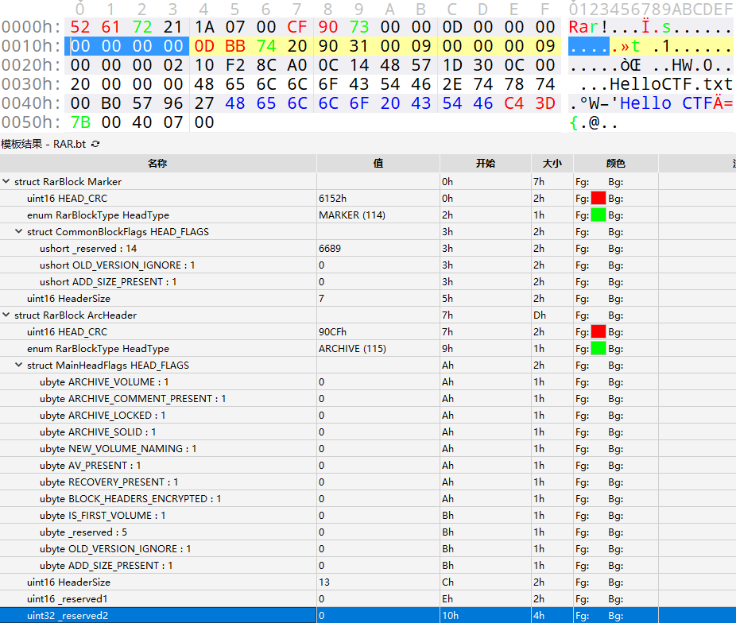
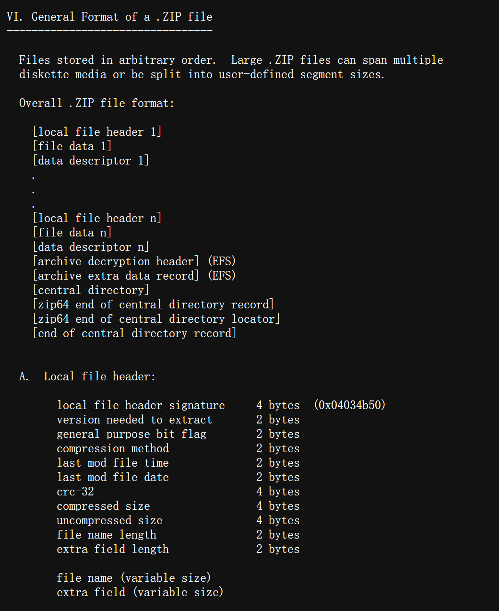
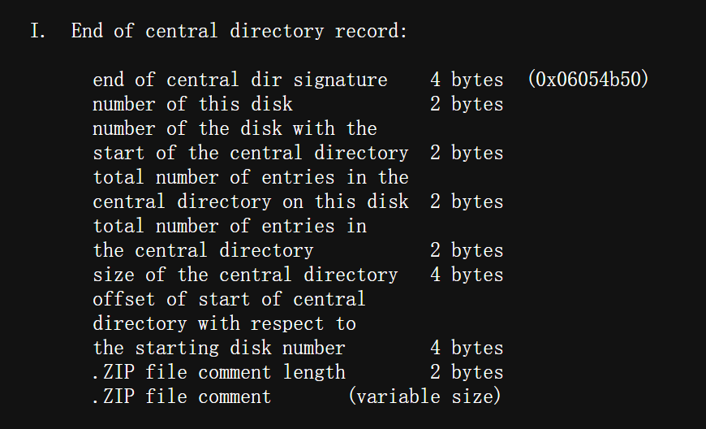
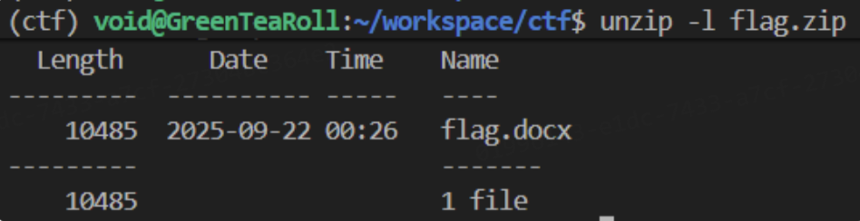
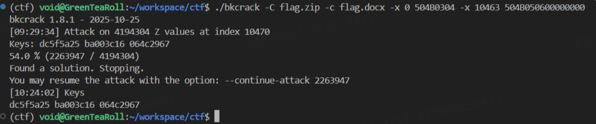

# 压缩包

## 文件结构

### .ZIP

一个 ZIP 文件由三个部分组成:

**\+ 压缩源文件数据区**

{ width="85%" }  
 \- `local file header` 由固定值 `50 4B 03 04` 即 .zip 文件的魔法数字作为开始。  
 \- `file data` 记录相应压缩文件的数据  
 \- `data descriptor` 数据描述符用于标识该文件压缩结束，该结构只有在相应的 `local file header` 中通用标记字段的第 `3 bit` 设为 `1` 时才会出现，紧接在压缩文件源数据后。  
**\+ 压缩源文件目录区**

{ width="85%" }  
 \- `Central directory` 记录了压缩文件的目录信息，在这个数据区中每一条纪录对应在压缩源文件数据区中的一条数据。  
**\+ 压缩源文件目录结束标志**

{ width="85%" }  
 \- `End of central directory record(EOCD)` 目录结束标识存在于整个归档包的结尾，用于标记压缩的目录数据的结束。每个压缩文件必须有且只有一个 `EOCD` 记录。  

具体详细的结构可以参考下面 010Editor .zip 模板对照表.

??? note "010Editor .zip 模板对照表"
    ```
    + ZIPFILERECORD record # 压缩源文件数据区
        - char frSignature[4] # 压缩源文件标志
        - ushort frVersion # 压缩源文件版本
        - ushort frFlags # 压缩源文件标志 （有无加密，这个更改这里进行伪加密，改为01 00打开就会提示有密码了）
        - enum COMPTYPE frCompression
        - DOSTIME frFileTime # 压缩源文件时间
        - DOSDATE frFileDate # 压缩源文件日期
        - uint frCrc # 压缩源文件CRC32校验值
        - uint frCompressedSize # 压缩源文件压缩后大小
        - uint frUncompressedSize # 压缩源文件压缩前大小
        - ushort frFileNameLength # 压缩源文件名长度
        - ushort frExtraFieldLength # 压缩源文件扩展域长度
        - char frFileName[frFileNameLength] # 压缩源文件名
        - uchar frData[frCompressedSize] # 压缩源文件数据
    + ZIPDIRENTRY dirEntry # 压缩源文件目录区
        - char deSignature[4] # 目录标志
        - ushort deVersionMadeBy # 创建该条目的版本
        - ushort deVersionNeeded # 解压该条目所需的版本
        - ushort deFlags # 标志位
        - enum COMPTYPE deCompression # 压缩方法
        - DOSTIME deFileTime # 最后修改时间
        - DOSDATE deFileDate # 最后修改日期
        - uint deCrc # CRC32校验值
        - uint deCompressedSize # 压缩后的大小
        - uint deUncompressedSize # 压缩前的大小
        - ushort deFileNameLength # 文件名长度
        - ushort deExtraFieldLength # 扩展域长度
        - ushort deFileCommentLength # 文件评论长度
        - ushort deDiskNumberStart # 起始磁盘编号
        - ushort deInternalAttributes # 内部属性
        - uint deExternalAttributes # 外部属性
        - uint deRelativeOffset # 该条目在 ZIP 文件中的偏移位置
        - char deFileName[deFileNameLength] # 文件名
        - char deExtraField[deExtraFieldLength] # 扩展域
        - char deFileComment[deFileCommentLength] # 文件评论
    + ZIPENDLOCATOR endLocator # 压缩源文件目录结束标志
        - char elSignature[4] # 结束标志
        - ushort elDiskNumber # 当前磁盘编号
        - ushort elStartDiskNumber # 目录开始的磁盘编号
        - ushort elEntriesOnDisk # 当前磁盘上的条目数量
        - ushort elEntriesTotal # 总条目数量
        - uint elSizeOfDirectory # 目录的总大小
        - uint elOffsetOfDirectory # 目录开始的偏移位置
        - ushort elCommentLength # 注释长度
        - char elComment[elCommentLength] # 注释
    ```

### .RAR

一个 RAR 文件主要由以下部分组成:

**+ 标记块和压缩文件头块**



\- `RAR 文件头` 为 `0x 52 61 72 21 1A 07 00`，是RAR文件的魔法数字作为开始。

**+ 文件头块**


\- `File Header` 包含多个字段，如文件CRC、压缩方法、文件大小、文件名等等。

**+ 结尾块**


\- `Terminator` 是每个RAR文件的结尾块，其结构固定，主要用于标记RAR文件的结束。

## 爆破工具

爆破攻击是最简单，最直接的攻击方式，适合密码较为容易或已知密码范围 / 格式，包括字典爆破、掩码攻击等。

下面我们来介绍几种常见的爆破工具。

### ARCHPR


### Ziperello


### fcrackzip

**Usage**

```
USAGE: fcrackzip
          [-b|--brute-force]            use brute force algorithm
          [-D|--dictionary]             use a dictionary
          [-B|--benchmark]              execute a small benchmark
          [-c|--charset characterset]   use characters from charset
          [-h|--help]                   show this message
          [--version]                   show the version of this program
          [-V|--validate]               sanity-check the algorithm
          [-v|--verbose]                be more verbose
          [-p|--init-password string]   use string as initial password/file
          [-l|--length min-max]         check password with length min to max
          [-u|--use-unzip]              use unzip to weed out wrong passwords
          [-m|--method num]             use method number "num" (see below)
          [-2|--modulo r/m]             only calculcate 1/m of the password
          file...                    the zipfiles to crack
```

 **实例**

暴力破解 hello.zip ，密码为数字+大小写字母，长度为1-10

```
fcrackzip -b -c 'aA1' -l 1-10 -u hello.zip
```

暴力破解 ctf.zip ，密码为纯数字，长度为3

```bash
fcrackzip -b -c'1' -l 3 -u ctf.zip 
```

用 rockyou.txt 作为字典爆破 flag.zip

```
fcrackzip  -D -p rockyou.txt -u flag.zip
```

## ZIP相关攻击

先介绍一下关于ZIP的一些小知识点~

### ZIP文件格式

一个常规的 ZIP 文件由三个部分组成：

**压缩源文件数据区+压缩源文件目录区+压缩源文件目录结束标志**

#### 压缩源文件数据区 (Local file header)

压缩源文件数据区主要记录了压缩前后文件的元数据并存放压缩后的文件，一条压缩文件数据记录对应数据区中的一个压缩文件记录，记录格式如下：

```bash
 1. 第0~3个字节：50 4B 03 04，代表了文件头标志, 对应文本 PK

 2. 第4~5个字节：14 00，代表了解压文件所需的pkware版本

 3. 第6~7个字节：00 00，代表了全局方式位标记（用来判断有没有加密）

 4. 第8~9个字节：08 00，代表了压缩方式, 比如这里的 0x0008 对应 Deflated

 5. 第10~11个字节：1D 9B，代表了最后修改文件的时间(MS-DOS 时间格式)

 6. 第12~13个字节：3D 56，代表了最后修改文件的日期(MS-DOS 时间格式)

 7. 第14~17个字节：5A 48 63 5C，是原始数据的crc-32校验值

 8. 第18~21个字节：77 00 00 00，是文件压缩后的大小

 9. 第22~25个字节：B1 00 00 00，是文件压缩前的大小

10. 第26~27个字节：10 00，代表文件名长度

11. 第28~29个字节：00 00，代表扩展记录长度

12. 接下来的若干个字节（变长）：文件名与扩展字段（如果有）
```

#### 压缩源文件目录区 (Central directory)

压缩源文件目录区是由一系列压缩源文件目录记录所组成，一条压缩文件目录记录对应 **数据区** 中的一个压缩文件记录，压缩源文件目录记录由以下部分构成：

```bash
 1. 第0~3个字节：50 4B 01 02，代表了目录文件头标记

 2. 第4~5个字节：02 3F，代表了压缩使用的pkware版本

 3. 第6~7个字节：14 00，代表了解压文件所需的pkware版本

 4. 第8~9个字节：00 00，代表了全局方式位标记（用来判断有没有加密）

 5. 第10~11个字节：08 00，代表了压缩方式

 6. 第12~13个字节：1D 9B，代表了最后修改文件的时间

 7. 第14~15个字节：3D 56，代表了最后修改文件的日期

 8. 第16~19个字节：5A 48 63 5C，是所对应压缩文件记录中原始数据的crc-32校验值

 9. 第20~23个字节：77 00 00 00，是文件压缩后的大小

10. 第24~27个字节：B1 00 00 00，是文件压缩前的大小

11. 第28~29个字节：10 00，代表文件名长度

12. 第30~31个字节：00 00，代表扩展字段长度

13. 第32~33个字节：00 00，代表文件注释长度（0字节，表示没有注释）

14. 第34~35个字节：00 00，代表磁盘开始号（0，表示文件不跨磁盘）

15. 第36~37个字节：00 00，代表内部文件属性

16. 第38~41个字节：20 00 00 00，代表外部文件属性

17. 第42~45个字节：00 00 00 00，代表局部头部偏移量

18. 接下来的若干个字节（变长），代表文件名

19. 之后的若干个字节（变长），代表扩展信息（可能存放着 ZIP64、NTFS 时间戳等）

20. 最后的若干个字节（变长），代表文件注释
```

#### 压缩源文件目录结束标志 (End of Central Directory Record)

!!! Note "这里介绍的是标准版EOCD哦……"
    这里介绍的版本是一般情况下的End of Central Directory Record，即里面的文件大小小于4GB，且文件数量少于65535个的情况。  
    当文件大小或数量超过标准限制时，ZIP 文件将使用 ZIP64 扩展规范。此时，在文件末尾，这些结构按照以下顺序排列（**从文件末尾向前**）：  
    1. End of Central Directory Record (标准中央目录结束记录)：这是最靠近文件末尾的固定结构。如果文件总数、大小等任一属性超出了其16位/32位字段的容量，对应的字段值将被设置为溢出标记（0xFFFF或 0xFFFFFFFF），以表明需要查找 ZIP64 扩展信息。  
    2. Zip64 End of Central Directory Locator (ZIP64中央目录定位器)：此结构紧接在标准结束记录之前。它的核心作用是提供一个指针，指明下一个结构的起始位置。  
    3. Zip64 End of Central Directory Record (ZIP64中央目录结束记录)：此结构位于定位器之前。它包含了文件总数、中央目录大小和起始偏移量等属性的真实64位值，用于替代标准记录中那些已溢出的字段。  
    这里也算是为了ZIP文件的兼容性服务啦~  
    如果对这些细节感兴趣的话可以去阅读页面底部的参考文献中.ZIP File Format Specification喵~  


```bash
1. 第0~3个字节：50 4B 05 06，代表目录结束标记

2. 第4~5个字节：00 00，代表当前磁盘编号（0，代表该 ZIP 文件没有分卷，不跨越多张磁盘）

3. 第6~7个字节：00 00，代表目录区开始磁盘编号（同上，表示中央目录也位于第一个磁盘上）

4. 第8~9个字节：01 00，代表本磁盘上纪录总数（这里表示当前磁盘上有 1 条中央目录记录）

5. 第10~11个字节：01 00，代表目录区中纪录总数（这里表示这个 ZIP 文件中总共包含 1 个文件）

6. 第12~15个字节：62 00 00 00，代表目录区尺寸大小（ 50 4B 01 02 开始到中央目录记录结束的所有字节长度，这里是十进制 98 字节）

7. 第16~19个字节：A5 00 00 00，代表目录区对第一张磁盘的偏移量（中央目录相对于存档起始位置的偏移量，这里是十进制 165 字节。这意味着解压软件需要从 ZIP 文件开头跳过 165 个字节，就能找到中央目录(即 `PK\x01\x02` 签名)）

8. 第20~21个字节：00 00，代表zip文件注释长度

9. 最后的若干字节（变长）：代表 ZIP 文件注释内容
```

### 伪加密

zip伪加密是在文件头的加密标志位做修改，进而再打开文件时使其被识别为加密压缩包。

#### 判断加密方式
在了解了ZIP的构成以后，我们可以发现，识别一个zip文件是否加密主要是看压缩源文件数据区的全局方式位标记(General Purpose Bit Flag​,通用位标记)和压缩源文件目录区的全局方式位标记，关键在其中第一字节的最低bit位上(在位索引表示中我们称其为 **Bit 0** ，但这里为了方便理解我们不妨多写几个字)，其它的不管为何值，都不会影响它的加密属性本身(但是会有其他作用)。通常全局方式位标记为2 bytes长度，第一字节最低bit位为0时表示无加密，例如：0x00,0x02,0x04等；为1时表示有加密，例如0x01,0x03,0x09等。

在010 Editor中我们可以看到，压缩源文件数据区的全局方式位标记对应模板ZIP.bt的`frFlags`(File Record Flags)，而压缩源文件目录区的全局方式位标记对应模板ZIP.bt的`deFlags`(Directory Entry Flags)。

??? Question "不同压缩软件对frFlags和deFlags的处理有区别吗？"
    经过实测，7-Zip 和 QQ预览 检测的是数据区的全局方式位标记，其他解压软件，例如 BandiZip 和 WinRAR 检测目录区的全局方式位标记，这四种软件都只检测一位，并不会检测另一个位置，同时也不会进行报错。

##### 伪加密的判断方法
当我们遇到一个被加密了的压缩包，需要判断是否是伪加密时，一个简单的方法就是，我们可以先尝试将deFlags和frFlags的最低有效位全部改成0，之后保存并尝试解压：


如果保存之后可以正常解压且没有提示损坏，那么就说明这里使用的就是伪加密。

<!-- Imported from D:\\Book\\Misc\\Chapter3\3-1.md -->
##### 案例


下载文件后打开会发现需要密码


Zip 文件结构分析：

```
1. 固定头文件：50 4B 03 04
2. 解压所需 pkware 版本：14 00
3. 全局方式位标记（有无加密）：09 00
4. 压缩方式：08 00
5. 最后修改时间：50 A3
6. 最后修改日期：A5 4A
7. CRC-32：21 38 76 65
8. 压缩后大小：19 00 00 00
9. 解压前大小：17 00 00 00
10. 文件名长度：08 00
11. 扩展字段长度：00 00
12. 文件名：66 6C 61 67 2E 74 78 74
13. 文件数据：4B CB 49 4C AF 76…………
14. 中央目录文件头：50 4B 01 02
15. ZIP 程序版本字段：1F 00
16. 解压所需 pkware 版本：14 00
17. 全局方式位标记（有无加密）：09 00
18. 压缩方式：08 00
19. 最后修改时间：50 A3
20. 最后修改日期：A5 4A
21. CRC-32：21 38 76 65
22. 压缩后大小：19 00 00 00
23. 解压前大小：17 00 00 00
24. 文件名长度：08 00
25. 扩展字段长度：24 00
26. 文件注释长度：00 00
27. 单卷 ZIP 文件：00 00
28. 内部文件属性：20 00
29. 文件权限字段: 00 00 00 00
30. 文件名：66 6C 61 67 2E 74 78 74
31. 额外字段: 0A 00…………
32. EOCD 文件头: 50 4B 05 06
33. 当前磁盘编号: 00 00 （表示 ZIP 不是分卷）
34. 中央目录所在磁盘: 00 00 （也表示 ZIP 不是多卷）
35. 此磁盘中央目录中的条目总数: 01 00（就一个 flag.txt）
36. 中央目录中的条目总数: 01 00（也只有一个 flag.txt）
37. 中央目录的大小：5A 00 00 00
38. 中央目录偏移量：3F 00 00 00
39. ZIP 注释长度: 00 00
```


首先我们来尝试一下是不是伪加密。

注意：ZIP 的压缩数据段应该被加密后变成随机字节流，但伪加密 ZIP 的压缩数据一般仍然是正常的 deflate 流或 store 流。（可以简记为“伪加密的字节流是可以正常读取的”）

解压软件解压前先看全局方式位标记，如果 Bit 0 = 1，则要求输入密码。

可以看到这个压缩包同时修改了deFlags和frFlags：


对于7-Zip，由于它只会检查frFlags的Bit 0，所以我们修改本地文件头的加密标志为 00 00 即可打开：


成功拿到 flag：


<!-- Imported from D:\\Book\\Misc\\Chapter3\3-10.md -->
### 加密Word爆破与宏破解


解压缩有三个文件


首先是 hint.txt

```
The length of docm 's password is 6
The Regular Expression of the password is:
[a-z] [a-z] q [a-z] b [a-z]
```

得知 `password.docm` 密码全小写字母，且满足 `??q?b?`，使用 john 爆破（当然也可以直接用 Archpr）

将 **Office** 文档中的哈希提取出来，保存为 `hash.txt`

```shell
office2john password.docm > word.hash
```

使用 **掩码攻击（mask attack）** 尝试爆破 `hash.txt` 中的密码哈希

```sh
john --mask='?l?lq?lb?l' word.hash
# ?l 表示 小写字母（a-z）
# q 和 b 是固定字符
```


打开 word


得先破解宏，将 word 文件用压缩包方式打开，找到 `vbaProject.bin` 文件以十六进制方式查看，将  `DBP`  改为  `DBX`  并保存，[参考博客](https://blog.csdn.net/Cody_Ren/article/details/100895394)


注意不要减少或者增加其他字符，保存退出


重新打开文件，Alt + F11打开


右键打开属性，设置一个密码保存，重新打开文件 Alt + F11 输入密码即可查看宏代码


```vbscript
Private Sub CB_OK_Click()
Dim strpasw As String
Dim strdec As String
Dim strusrinput As String
Dim t As String
t = ChrW(21152) & ChrW(27833) & ChrW(21543) & ChrW(65292) & ChrW(21516) & ChrW(23398) & ChrW(20204) & ChrW(65281)

strusrinput = Dialog.TextBox_Pasw
Dim sinput As String
sinput = strusrinput

If (strusrinput <> "") Then
  strusout = Encode(strusrinput, t)
  If (strusout = "┤℡ǒqｘ~") Then
      strdec = Decode(Dialog.Label_ls.Caption, sinput)
  Else
     If (strusout = "ｋGJEｇｑ") Then
        strdec = Decode(Dialog.Label_ls1.Caption, sinput)
     Else
          If (strusout = "ЮΟopz+") Then
             strdec = Decode(Dialog.Label_ls2.Caption, sinput)
          Else
                If (strusout = "ｚΚjrШφεあ") Then
                    strdec = Decode(Dialog.Label_ls4.Caption, sinput)
                Else
                    If (strusout = "àǖtＵｗ┧ｈè") Then
                          strdec = Decode(Dialog.Label_ls3.Caption, sinput)
                    Else
                          strdec = StrConv(t, vbFromUnicode)
                    End If
                End If
           End If
      End If
   End If
   Label_CLUE.Caption = strdec
End If
```

无需分析加解密算法，输出结果 `strusout` 由 `Encode(strusrinput, t)` 加密得到，只需分别用解密函数反推五个 if 分支条件对应的明文即可

修改 `Label_CLUE.Caption = strdec` 为 `Label_CLUE.Caption = Decode(xxx,t)`，回到 word 运行 `AutoOpen` 宏

随便输入字符点击确定即可在 Dialog 的 label 处显示对应明文，分别是 `123456`、`aaaaaa`、`000000`、`墙角数枝`、`iloveyou`

将 `Label_CLUE.Caption = Decode(xxx,t)` 改回 `Label_CLUE.Caption = strdec`，分别输入五段明文，发现输入 `墙角数枝` 得到 `解压密码：两只黄鹂鸣翠柳,一行白鹭上青天!`

结合 word 里的 hint `Rar 密码为复杂型，长度为16位，包含了字母、数字和符号。`

压缩包密码猜出为 `2zhlmcl,1hblsqt.`，解压拿到 flag：`Dest0g3{VBScr1pt_And_Hashc4t_1s_g00d}`


<!-- Imported from D:\\Book\\Misc\\Chapter3\3-11.md -->
### PKZIP 密钥还原


给了三个文件


压缩包里还有一层


先尝试利用 key 文件做一个明文攻击

```sh
bkcrack.exe -C purezip.zip -c "secret key.zip" -p key
```


再利用密钥直接解压

```sh
bkcrack.exe -C purezip.zip -c "secret key.zip" -k e63af7cc 55ef839d dc10b922 -d 1.zip
```


注意此时的 ZIP 是压缩之后的，需要解压一下，放到 cyberchef 里面使用 raw inflate 解一下并保存压缩包


告诉我们密码为两个字节


写脚本爆破

```python
import zipfile
import libnum
from tqdm import trange

for i in trange(256):
    for j in range(256):
        fz = zipfile.ZipFile('11.zip', 'r')
        password = libnum.n2s(i) + libnum.n2s(j)
        try:
            fz.extractall(pwd=password)
            print(password)
            fz.close()
            break
        except:
            fz.close()
            continue
    else:
        continue
    break
```

得到密码：`\x9c\x07`

再写脚本解压

```python
import zipfile

with zipfile.ZipFile('download.zip', 'r') as fz:
    # 直接解压，指定密码
    fz.extractall(pwd=b'\x9c\x07')
```

打开又得到密钥


<!-- Imported from D:\\Book\\Misc\\Chapter3\3-12.md -->

同时在 zpaq 文件的文件尾得到


密码是 md5（明文的密钥，长度为 3 个字节）

PKZIP 传统加密不是 AES，而是一种可逆弱流密码，内部维护三个 32-bit 状态：Key0、Key1、Key2

你只要恢复了这三个 key，就能解密 ZIP 内所有文件，即使你不知道用户密码

我们把整个加密分为两个阶段

```
阶段 1：用密码生成三段密钥（Key0/Key1/Key2）
阶段 2：用三段密钥加密数据
```

阶段一：用密码生成三段密钥

```c
Key0 = 0x12345678
Key1 = 0x23456789
Key2 = 0x34567890
```

再初始化密钥，对用户输入的 ZIP 密码的每一个字节（用 p 代替）：

```c
Key0 = CRC32(Key0, p)
Key1 = Key1 + (Key0 & 0xff)
Key1 = Key1 * 134775813 + 1
Key2 = CRC32(Key2, (Key1 >> 24))
```

阶段 2：用三段密钥加密数据

第 1 步：用 Key2 生成一个密钥流字节（keystream = 基于 Key2 算出来 1 字节）

第 2 步：明文 XOR keystream = 密文

第 3 步：用明文字节更新三段密钥（Key0/Key1/Key2）

```c
Key0 = CRC32(Key0, P)       // 明文字节 P
Key1 = Key1 + (Key0 & 0xff)
Key1 = Key1 * 134775813 + 1
Key2 = CRC32(Key2, (Key1 >> 24))
```

也就是说，每加密一个明文字节，都要：

    1. 生成一个 keystream（密钥流字节）
    2. 用它 XOR 明文得到密文
    3. 用“明文字节”更新 Key0 Key1 Key2

阶段一只进行一次，阶段二每加密一个明文字节就进行一次

那么怎么破解呢？？？

PKZIP 的三段密钥更新结构是可逆的（CRC32 可逆、乘法可逆、加法可逆），所以只要你知道某一刻的 Key0 / Key1 / Key2，就能倒推所有密码字节

逆向步骤 1：由 Key2 推出 Key1 的最高字节 & Key2_prev

正向是

```python
Key2 = CRC32(Key2_prev, MSB(Key1_prev))
```

逆向时枚举 Key1 的最高字节（0x00–0xFF），对 CRC32 进行逆变换

```python
Key2_prev = inverse_crc32(Key2, guessed_MSB_Key1)
```

逆向步骤 2：由 Key1_final 推出 Key1_prev 和 Key0_prev 的低字节

正向是

```python
Key1 = (Key1_prev + LSB(Key0_prev)) * 134775813 + 1
```

逆向是

```python
# 去掉 +1：
    Key1_minus1 = Key1_final - 1
# 乘法逆元恢复加之前的值：
    # 因为
    Key1_minus1 = (Key1_prev + LSB(Key0_prev)) * constant
    # 所以
    Key1_prev + LSB(Key0_prev) = Key1_minus1 * inverse(constant) mod 2^32
    # 其中 constant = 134775813
    # inverse(constant) 是其在 mod 2^32 下的乘法逆元
# 此时我们知道：
    Key1_prev + LSB(Key0_prev) = some_value
    # 这里未知的只有 8 bit
    # 所以枚举 256 种 LSB(Key0_prev)，即可得到 Key1_prev
```

逆向步骤 3：由 Key0_final 推出 Key0_prev 和密码字节 p

正向是

```python
Key0_final = CRC32(Key0_prev, p)
```

逆向是

```python
# 因为 CRC32 的单步更新
    CRC32(old, byte)  →  new
# 在数学上是完全可逆的：
    inverse_crc32(new, p) → old
    # 所以我们枚举密码字节 p（0x00–0xFF）
    Key0_prev = inverse_crc32(Key0_final, p)
```

最终组合成完整逆向流程

```
for i from N-1 down to 0:
    从 Key2_final 逆 CRC32 推 Key1_prev 的最高位
    从 Key1_final 逆乘法和加法推 Key1_prev & Key0_prev低位
    枚举 p 从 Key0_final 逆 CRC32 推 Key0_prev
    如果所有约束一致，则：
         p[i] = 当前枚举值
         Key0_final = Key0_prev
         Key1_final = Key1_prev
         Key2_final = Key2_prev
```

因此还需要还原 pkzip 的三段密匙，使用下面指令直接破解

```sh
bkcrack.exe -k e48d3828 5b7223cc 71851fb0 -r 3 ?b
# -r 3 表示使用反推阶段（reverse）进行 第 3 次迭代尝试，即从 key2 推回 key0 的过程的步骤次数
# ?b 是一个通配符，通常是 bkcrack 的参数，表示用 brute-force（暴力枚举） 去补全某些信息
```


最后使用 md5 加密后的密码解压缩即可


<!-- Imported from D:\\Book\\Misc\\Chapter3\3-2.md -->
### ZIP 明文破解

明文攻击主要利用不少于 12 字节（部分说法要求至少有8字节连续）的一段已知明文数据进行攻击，从而获取整个加密文档的数据，具体的原理这里不做太多阐述。

!!! Info
    需要注意的是，明文攻击的12字节限制并不是指不足12字节就无法进行攻击，只是更少的字节数代表着可能意味着更多的尝试次数和可能答案。


#### 基于已知文件


下载文件后得到一张图片与一个加密压缩包


图片与压缩包中的图片是一样的（这里就不打开看了），明显提示了要明文攻击，具体怎么做呢？

首先去看压缩包的算法


再将另一个文件也压缩成压缩包，需要保证算法一致

不同的压缩软件算法各不同，这里要使用 WinRAR

使用工具 ARCHPR 明文攻击，在明文选项中选择我们压缩的文件，这样就拿到了密码


<!-- Imported from D:\\Book\\Misc\\Chapter3\3-5.md -->
#### 基于文件头


打开压缩包需要密码，查看其文件类型


知道文件类型后在 WinHex 中创建相同格式文件


首先根据文件头爆破出 key 值

```shell
bkcrack.exe -C flag.zip -c flag.png -p 6.png -o 0 >1.log

-C：被爆破的文件名
-c：密文
-p：明文
```


```shell
bkcrack.exe -C flag.zip -c flag.png -k key -d flag.png
```

最后还需要修改下 CRC 宽高即可


#### 基于文件头+文件尾


压缩包里是一个 `.docx` ，众所周知 Office 三件套的文件格式一般都是一堆文件打包起来的 ZIP。

于是用7-Zip看了眼存储方式是ZipCrypto Store，用 bkcrack 去明文攻击，如果这里不确定明文是什么的话就打开 Word 然后新建一个空的文档保存看看。

一开始试了文件头的 12 个字节，还试了这个 Content_Types 的文件名，发现都跑不出来，一度开始怀疑人生。

查一下 ZIP 的结构定义：



可以看到只有开头的 local file header signature `50 4B 03 04` 是硬编码的 Magic Number，后面的值都有可能根据文件的不同而变化，但是这也才 4 个字节，不够用怎么办？

继续看到最后结尾的End of central directory record：




这里end of central dir signature是 `50 4B 05 06` 的 Magic Number，现在有 8 个字节了，还差 4 个，于是 010 Editor 打开空白的 docx 文件看看尾巴：


可以注意到其后的两个值都是 0，即 `00000000`。

现在我们终于有 12 个字节了，其中后半段的8字节组合在一起就是 `504B050600000000`，偏移量是从后往前推 22 个字节（根据 End of central directory record 结构的定义：2 + 4 + 4 + 2 + 2 + 2 + 2 + 4 = 22 ，最后的 .ZIP file comment 没有就不管），即文件大小（**注意是 ZIP 中的文件压缩前原始大小**，不是 ZIP 文件的大小，因为你是使用里面flag.docx那个压缩包的已知明文进行攻击的）减去22：



$$10485 - 22 = 10463$$

所以我们最终可以构造出这样的命令，其中`-x`是指定偏移和对应位置的连续字节流：
```bash
bkcrack -C flag.zip -c flag.docx -x 0 504B0304 -x 10463 504B050600000000
```



然后我们就可以利用得到的keys解密：

```bash
bkcrack -C flag.zip -k dc5f5a25 ba003c16 064c2967 -c flag.docx -d flag.docx
```

即可得到最终的flag：


```text
furryCTF{Ho0w_D1d_You_C0mE_H9re_xwx}
```

<!-- Imported from D:\\Book\\Misc\\Chapter3\3-4.md -->
### 压缩密码爆破

大型比赛中官方都会提供字典，所以还是比较简单的

直接上题（BugKu CTF）


这里需要网上去下载一个 rockyou 字典


题目给的是 ZIP 文件，使用工具 Ziperello 爆破


选择字典模式


选择字典


成功爆破出密码


<!-- Imported from D:\\Book\\Misc\\Chapter3\3-7.md -->
### CRC 碰撞


打开文件需要密码，但是发现了三个大小相同的文件，多个相同大小文件可以确定为 CRC 碰撞


使用脚本碰撞即可


## RAR
<!-- Imported from D:\\Book\\Misc\\Chapter3\3-3.md -->
### RAR 文件头修复

当使用 WinRAR 打开时会提示文件头错误，我们需要做的就是去修改错误的文件头


打开文件报错


RAR 文件格式解析：

```
1. 固定文件头：52 61 72 21 1A 07 00（其中 0x6152 表示 CRC，0x72 表示头类型，0x1A21 表示 FLAGS，0x0007 表示 SIZE）
2. 压缩文件头：CF 90 73 00 00 0D 00 00 00 00 00 00 00（结构与上面一致，0x73 表示头类型，只是多了六个字节的保留位）
3. 文件头：D5 56 74…………（这里内容太多（图中全是蓝色部分全是），我们只需知道前三个字节同样与上面一致，0x74 表示头类型）
```


txt 的内容后面就是 secret.png 的文件头（txt 是可以打开的，内容就是图中字符串）

文件头的头类型是 0x7A，将其改为 0x74


成功解压缩出图片


<!-- Imported from D:\\Book\\Misc\\Chapter3\3-8.md -->
### RAR 伪加密破解


下载附件解压报错


放入 010 中解析，首先是文件头签名

```
52 61 72 21 1A 07 00
```


第二个部分是关键

| 偏移 | 大小   | 名称       | 说明                               |
| ---- | ------ | ---------- | ---------------------------------- |
| 0x00 | 1 字节 | HEAD_CRC   | 头部校验码                         |
| 0x01 | 1 字节 | HEAD_TYPE  | 类型（`0x74` 表示 File Header）    |
| 0x02 | 2 字节 | HEAD_FLAGS | 标志位（这里是伪加密的关键）       |
| 0x04 | 2 字节 | HEAD_SIZE  | 头部大小                           |
| 0x06 | 4 字节 | PACK_SIZE  | 压缩后大小                         |
| 0x0A | 4 字节 | UNP_SIZE   | 解压后大小                         |
| 0x0E | 1 字节 | HOST_OS    | 操作系统标识                       |
| ...  | 可变   | 其余内容   | 包括文件名长度、压缩方法、时间戳等 |

在 **RAR 4.x** 中也就是第 11 个字节处实现伪加密

也就是 010 Editor 显示的文件结构中的 `ubyte BLOCK_HEADERS_ENCRYPTED` 字段的值改为 1


在 5.x 中还可以是第 24 个字节处


题目中的版本应该 5.x，将 `84` 改为 `80` 即可

（WinRAR 或者 ForeMost 均可直接提取图片）


## 参考文献
1. [APPNOTE.TXT 6.2.0 - .ZIP File Format Specification](https://pkware.cachefly.net/webdocs/APPNOTE/APPNOTE-6.2.0.txt)

2. [APPNOTE.TXT 最新版 - .ZIP File Format Specification](https://pkware.cachefly.net/webdocs/casestudies/APPNOTE.TXT)

3. [PKWARE® ZIP标准](https://support.pkware.com/pkzip/appnote)

4. [Mitunlnyの小宇宙-深入理解zip伪加密](https://czxh.top/2025/10/31/%E6%B7%B1%E5%85%A5%E7%90%86%E8%A7%A3zip%E4%BC%AA%E5%8A%A0%E5%AF%86/)

5. [加密宏破解(EasyWord)-Lazzaro Dest0g3 520迎新赛 WP](https://lazzzaro.github.io/2022/05/26/match-Dest0g3-520%E8%BF%8E%E6%96%B0%E8%B5%9B/index.html#EasyWord)

<!-- Imported from D:\\Book\\Misc\\Chapter3\README.md -->
