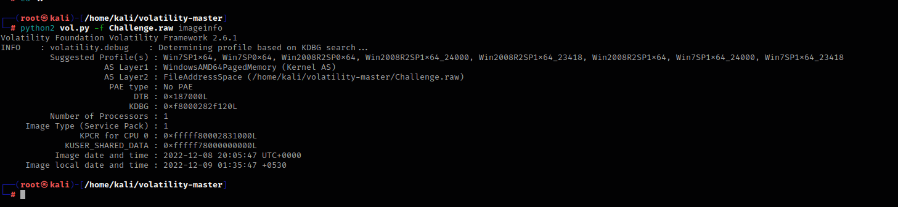
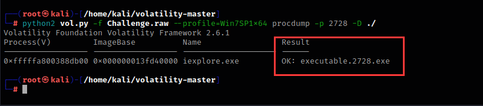
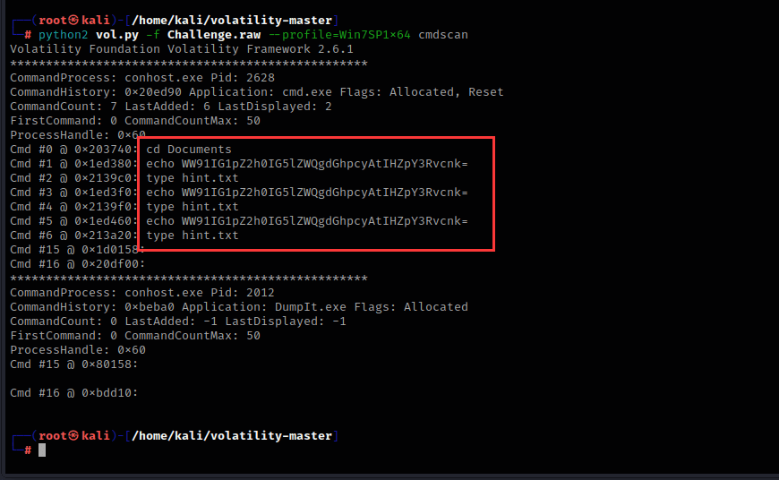
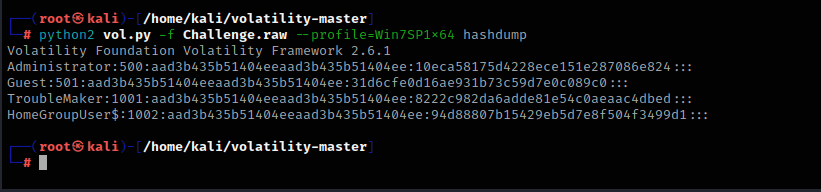
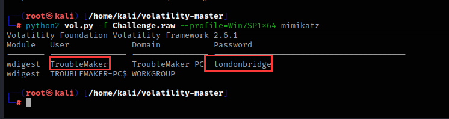
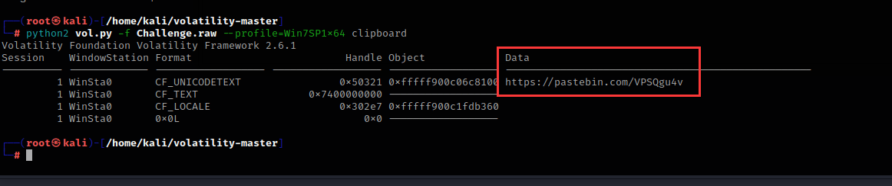
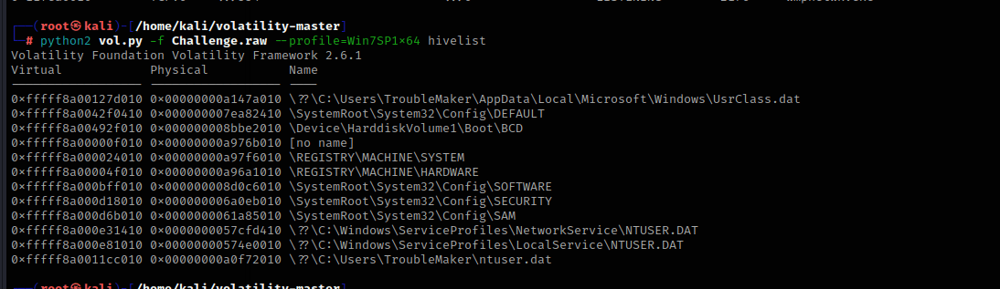

## 前言

> 版权声明：
>
> ​	文档源于项目[ProbiusOfficial/Hello-CTF: 针对0基础新手编写的CTF快速入门手册 (github.com)](https://github.com/ProbiusOfficial/Hello-CTF)
>
> ​	原作者为 白猫 ，橘墨基于 [Notion - ctf-archives](https://www.notion.so/ctf-archives) 和 [Forensics wiki ](https://www.forensics-wiki.com)进行补充

内存取证在ctf比赛中也是常见的题目，内存取证是指在计算机系统的内存中进行取证分析，以获取有关计算机系统当前状态的信息。内存取证通常用于分析计算机系统上运行的进程、网络连接、文件、注册表等信息，并可以用于检测和分析恶意软件、网络攻击和其他安全事件

对于ctf比赛中所接触到的内存取证，选手大多拿到的都是已经提取好的内存镜像文件，也就是内存数据的原始完整拷贝，这已经从开局就大大简化了内存取证的难度，并不需要选手去考虑如何获取内存数据的完整镜像。而选手接下来所要面对的，就是对内存数据进行解析。对于内存数据，最为常用的工具便是 `Volatility Framework` ，其为 `Volatility Foundation` 所开发的一款对内存取证分析提供支持的框架，对多平台电子设备的内存数据均提供了支持，并且也支持加载第三方模块来增加功能。

!!! Tip "小窍门"   
    虽说内存取证最为优雅的解法就是利用 `Volatility Framework` ，但是都戏称：“内存取证的终点是 strings + grep ”。因为由于内存其本身就为操作系统和软件运行时的动态数据，所以绝大多数的数据都是直接以明文形式储存在内存之中的，往往直接 strings 进行提取明文字符串并加以筛选，就能获得一些意想不到的惊喜

## 工具安装

### Python2&3与pip安装方法

首先就是安装Python和pip，在kali和一些linux发行版上，python都是自带的，但是需要注意的是，在新版本Ubuntu中，已经移除了Python2的预装。Python和pip安装方法如下：

```
sudo apt-get update  #更新源
sudo apt-get install python2   #安装python2
sudo apt-get install python-pip2   #安装pip2
sudo apt-get install python3-pip   #安装pip3
```

需要注意的是，在 `Debian` 系的系统（如 `Ubuntu` 或者 `Kali` ）中，默认的软件包管理器`apt`会将`pip2`和`pip3`识别为相互冲突的两个软件包，所以只是用`apt`是无法同时安装`pip2`和`pip3`两个软件包的。由于`Volatility2`依赖于`Python2`，而`Volatility3`依赖于`Python3`，所以两个版本的`pip`都需要安装

建议`python3-pip`直接通过`apt`安装，而`python2`的`pip`通过以下方式进行安装：

```shell
wget https://bootstrap.pypa.io/pip/2.7/get-pip.py
sudo python2 get-pip.py
```

### 下载和安装Volatility2

Volatility是一款开源的内存分析框架，主要用于从计算机内存中提取数字证据。它可以用于取证、恶意代码分析、漏洞研究、操作系统学习以及其他安全领域

当前，Volatility 已经开发到了Volatility 3，但是第三代仍然在开发阶段，其功能相较于第二代还不完善，但是第三代对Windows 10以上的Windows系统所导出的内存数据提供了更完善的支持，并实现了更快的分析速度，故建议进行内存取证工作的时候，两代Volatility 都备着（反正只是一个工具，相较于检材动辄大几G而言，完全不算大）。

Volatility2项目地址：

```
https://github.com/volatilityfoundation/volatility
```


如果你在国外的话，可以直接运行这个命令来获取Volatility项目

```
apt install git
git clone https://github.com/volatilityfoundation/volatility.git
```

在国内用这个命令的话，下载非常慢，建议直接从官方的GitHub仓库获取下来Vol2 的完整源码，直接Download ZIP即可：


从压缩包里提取文件

```
unzip [file_name] -d [destination]  #filename：你要提取的压缩包名称，destination：提取后的文件存放位置
```

进入文件夹，运行以下命令即可安装

```
python2 setup.py install
```

### 下载和安装Volatility3

!!! Warning "一些环境问题"   
    本人建议这类环境是基于`Linux`（本人推荐`Ubuntu`），使用`Windows`来开展工作也可以，那么`Volatility 3`使用pip直接安装。另外需要注意的是，`Volatility 3`在`Windows`的`cmd`中无法执行，因为`Volatility 3`所绑定的指令是`vol`，这与`cmd`中自带的指令发生冲突（`vol` in cmd：显示磁盘卷标和序列号(如果存在)），故如果要在`Windows`环境中使用`Volatility 3`，需要使用非`cmd`终端（例如`Powershell`）

相较于Vol 2要通过源码来编译安装，Vol 3的安装则更为人性化：直接通过pip来安装：

```shell
pip3 install volatility3
```

!!! Warning "2&3"   
    需要注意的是，Linux系统中，允许Python2与Python3环境并存，但是二者的依赖库（python-dev）和第三方包（通过pip包管理器安装的第三方包）并不会共享，也就意味着如果如上文安装好Vol 2之后，相关操作也要再重复一遍    

### 依赖安装

如果不安装依赖，Volatility很多功能都用不了

首先需要安装Python2的相关编译依赖库

```shell
sudo apt install python2-dev
```

然后安装pip相关包：

```
pip2 install pycryptodome -i https://pypi.tuna.tsinghua.edu.cn/simple
pip2 install yara -i https://pypi.tuna.tsinghua.edu.cn/simple
pip2 install distorm3 -i https://pypi.tuna.tsinghua.edu.cn/simple
```

### Volatility加载插件

mimikatz脚本文件下载地址

```
链接：https://pan.baidu.com/s/1HS65N4UXfuzChB9UU9vveA 
提取码：fywk 
```

然后将这个脚本文件移动到/volatility/plugins目录下

```
mv mimkatz.py /volatility/plugins/
```


然后安装construct库

```
sudo pip2 install construct==2.5.5-reupload
```

## 演示题目的下载地址

本篇文章使用的案例：

```
链接：https://pan.baidu.com/s/1nD-svI98v3yQPPKT0HyEjg 
提取码：0dnx 
```

## 工具的使用方法

### 获取内存镜像详细信息

imageinfo是Volatility中用于获取内存镜像信息的命令。它可以用于确定内存镜像的操作系统类型、版本、架构等信息，以及确定应该使用哪个插件进行内存分析

```
python2 vol.py -f Challenge.raw imageinfo  #f：指定分析的内存镜像文件名
```



```
上述输出中，Suggested Profile(s) 显示了 Volatility 推荐的几个内存镜像分析配置文件，可以根据这些配置文件来选择合适的插件进行内存分析
AS Layer2 显示了使用的内存镜像文件路径
KDBG 显示了内存镜像中的 KDBG 结构地址
Number of Processors 显示了处理器数量
Image Type 显示了操作系统服务包版本
Image date and time 显示了内存镜像文件的创建日期和时间
```

### 获取正在运行的程序

这里我们用Win7SP1x64配置文件进行分析，Volatility 的 pslist 插件可以遍历内存镜像中的进程列表，显示每个进程的进程 ID、名称、父进程 ID、创建时间、退出时间和路径等信息

```
python2 vol.py -f Challenge.raw --profile=Win7SP1x64 pslist
```


### 提取正在运行的程序

Volatility 的 procdump 插件可以根据进程 ID 或进程名称提取进程的内存映像，并保存为一个单独的文件

比如这里我要提取iexplore.exe这个程序


他的进程pid号为2728

```
python2 vol.py -f Challenge.raw --profile=Win7SP1x64 procdump -p 2728 -D ./
p：pid进程号
D：提取程序后保存的地址，./指的是当前shell正在运行的文件夹地址，输入pwd命令可以查看shell当前的地址，简单来说就是保存到当前文件夹
```




成功导出，导出后文件名为executable.2728.exe


### 查看在终端里执行过的命令

Volatility 的 cmdscan 插件可以扫描内存镜像中的进程对象，提取已执行的 cmd 命令，并将其显示在终端中

```
python2 vol.py -f Challenge.raw --profile=Win7SP1x64 cmdscan
```



他移动到了Documents目录下，echo了一次字符串，然后创建了一个名为hint.txt的文件

### 查看进程在终端里运行的命令

Volatility中的cmdline插件可以用于提取进程执行的命令行参数和参数值

```
python2 vol.py -f Challenge.raw --profile=Win7SP1x64 cmdline
```


### 查找内存中的文件

Volatility 的 filescan插件可以在内存中搜索已经打开的文件句柄，从而获取文件名、路径、文件大小等信息

我想找到hint.txt文件，可以使用以下命令

```
python2 vol.py -f Challenge.raw --profile=Win7SP1x64 filescan | grep hint.txt
```


grep是Linux下常用的命令之一，它用于在文件中查找指定的字符串，并将包含该字符串的行输出

如果只使用filescan而不配合grep的话，Volatility就会输出系统上的全部文件，例如：


### 提取内存中的文件

Volatility的dumpfiles插件可以用来提取系统内存中的文件


这里我要提取hint.txt文件，hint.txt的内存位置为0x000000011fd0ca70，这两个由于位置都一样，随便提取哪个都行

```
python2 vol.py -f Challenge.raw --profile=Win7SP1x64 dumpfiles -Q 0x000000011fd0ca70 -D ./
Q：内存位置
D：提取程序后保存的地址，./指的是当前shell正在运行的文件夹地址，输入pwd命令可以查看shell当前的地址，简单来说就是保存到当前文件夹
```


提取出来的文件名是包含内存地址的，更改一下后缀名即可运行

### 查看浏览器历史记录

Volatility中的iehistory插件可以用于提取Internet Explorer浏览器历史记录

```
python2 vol.py -f Challenge.raw --profile=Win7SP1x64 iehistory
```


### 提取用户密码hash值并爆破

Volatility中的Hashdump插件可以用于提取系统内存中的密码哈希值

```
python2 vol.py -f Challenge.raw --profile=Win7SP1x64 hashdump
```



这里提取了四个用户的密码hash值，我们将这些字符串复制一下，粘贴到本地本文里


我们可以使用这个在线网站：

```
https://crackstation.net/
```


将hash值粘贴上去


就可以得到用户密码明文

### 使用mimikatz提取密码

mimikatz是一个开源的用于从Windows操作系统中提取明文密码，哈希值以及其他安全凭据的工具

```
python2 vol.py -f Challenge.raw --profile=Win7SP1x64 mimikatz
```



成功提取到TroubleMaker用户的密码

### 查看剪切板里的内容

Volatility中的clipboard插件可以用于从内存转储中提取剪贴板数据

```
python2 vol.py -f Challenge.raw --profile=Win7SP1x64 clipboard
```



### 查看正在运行的服务

svcscan是Volatility中的一个插件，用于扫描进程中所有的服务

```
svcscan
```


执行了svcscan之后，每列代表服务的一些信息，包括服务名、PID、服务状态、服务类型、路径等等

### 查看网络连接状态

Volatility中的netscan插件可以在内存转储中查找打开的网络连接和套接字，该命令将显示所有当前打开的网络连接和套接字。输出包括本地和远程地址、端口、进程ID和进程名称等信息

```
python2 vol.py -f Challenge.raw --profile=Win7SP1x64 netscan
```


### 查看注册表信息

printkey是Volatility工具中用于查看注册表的插件之一。它可以帮助分析人员查看和解析注册表中的键值，并提供有关键值的详细信息，如名称、数据类型、大小和值等

```
python2 vol.py -f Challenge.raw --profile=Win7SP1x64 printkey
```


然后使用hivelist插件来确定注册表的地址

```
python2 vol.py -f Challenge.raw --profile=Win7SP1x64 hivelist
```



查看注册表software项

hivedump是一个Volatility插件，用于从内存中提取Windows注册表的内容，这里我们选择第一个来演示

```
python2 vol.py -f Challenge.raw --profile=Win7SP1x64 hivedump -o 0xfffff8a00127d010
o：hivelist列出的Virtual值
```


根据名称查看具体子项的内容，这里以SAM\Domains\Account\Users\Names做演示，这个是Windows系统中存储本地用户账户信息的注册表路径，它包含了每个本地用户账户的名称和对应的SID信息

```
python2 vol.py -f Challenge.raw --profile=Win7SP1x64 printkey -K "SAM\Domains\Account\Users\Names"
```


如果要提取全部的注册表，可以用这个命令

```
python2 vol.py -f Challenge.raw --profile=Win7SP1x64 dumpregistry -D ./
```


### 全部插件

```
amcache        	查看AmCache应用程序痕迹信息
apihooks       	检测内核及进程的内存空间中的API hook
atoms          	列出会话及窗口站atom表
atomscan       	Atom表的池扫描(Pool scanner)
auditpol       	列出注册表HKLMSECURITYPolicyPolAdtEv的审计策略信息
bigpools       	使用BigPagePoolScanner转储大分页池(big page pools)
bioskbd        	从实时模式内存中读取键盘缓冲数据(早期电脑可以读取出BIOS开机密码)
cachedump      	获取内存中缓存的域帐号的密码哈希
callbacks      	打印全系统通知例程
clipboard      	提取Windows剪贴板中的内容
cmdline        	显示进程命令行参数
cmdscan        	提取执行的命令行历史记录（扫描_COMMAND_HISTORY信息）
connections    	打印系统打开的网络连接(仅支持Windows XP 和2003)
connscan       	打印TCP连接信息
consoles       	提取执行的命令行历史记录（扫描_CONSOLE_INFORMATION信息）
crashinfo      	提取崩溃转储信息
deskscan       	tagDESKTOP池扫描(Poolscaner)
devicetree     	显示设备树信息
dlldump        	从进程地址空间转储动态链接库
dlllist        	打印每个进程加载的动态链接库列表
driverirp      	IRP hook驱动检测
drivermodule   	关联驱动对象至内核模块
driverscan     	驱动对象池扫描
dumpcerts      	提取RAS私钥及SSL公钥
dumpfiles      	提取内存中映射或缓存的文件
dumpregistry   	转储内存中注册表信息至磁盘
editbox        	查看Edit编辑控件信息 (Listbox正在实验中)
envars         	显示进程的环境变量
eventhooks     	打印Windows事件hook详细信息
evtlogs        	提取Windows事件日志（仅支持XP/2003)
filescan       	提取文件对象（file objects）池信息
gahti          	转储用户句柄（handle）类型信息
gditimers      	打印已安装的GDI计时器(timers)及回调(callbacks)
gdt            	显示全局描述符表(Global Deor Table)
getservicesids 	获取注册表中的服务名称并返回SID信息
getsids        	打印每个进程的SID信息
handles        	打印每个进程打开的句柄的列表
hashdump       	转储内存中的Windows帐户密码哈希(LM/NTLM)
hibinfo        	转储休眠文件信息
hivedump       	打印注册表配置单元信息
hivelist       	打印注册表配置单元列表
hivescan       	注册表配置单元池扫描
hpakextract    	从HPAK文件（Fast Dump格式）提取物理内存数据
hpakinfo       	查看HPAK文件属性及相关信息
idt            	显示中断描述符表(Interrupt Deor Table)
iehistory      	重建IE缓存及访问历史记录
imagecopy      	将物理地址空间导出原生DD镜像文件
imageinfo      	查看/识别镜像信息
impscan        	扫描对导入函数的调用
joblinks       	打印进程任务链接信息
kdbgscan       	搜索和转储潜在KDBG值
kpcrscan       	搜索和转储潜在KPCR值
ldrmodules     	检测未链接的动态链接DLL
lsadump        	从注册表中提取LSA密钥信息（已解密）
machoinfo      	转储Mach-O 文件格式信息
malfind        	查找隐藏的和插入的代码
mbrparser      	扫描并解析潜在的主引导记录(MBR)
memdump        	转储进程的可寻址内存
memmap         	打印内存映射
messagehooks   	桌面和窗口消息钩子的线程列表
mftparser      	扫描并解析潜在的MFT条目
moddump        	转储内核驱动程序到可执行文件的示例
modscan        	内核模块池扫描
modules        	打印加载模块的列表
multiscan      	批量扫描各种对象
mutantscan     	对互斥对象池扫描
notepad        	查看记事本当前显示的文本
objtypescan    	扫描窗口对象类型对象
patcher        	基于页面扫描的补丁程序内存
poolpeek       	可配置的池扫描器插件
printkey       	打印注册表项及其子项和值
privs          	显示进程权限
procdump       	进程转储到一个可执行文件示例
pslist         	按照EPROCESS列表打印所有正在运行的进程
psscan         	进程对象池扫描
pstree         	以树型方式打印进程列表
psxview        	查找带有隐藏进程的所有进程列表
qemuinfo       	转储 Qemu 信息
raw2dmp        	将物理内存原生数据转换为windbg崩溃转储格式
screenshot     	基于GDI Windows的虚拟屏幕截图保存
servicediff    	Windows服务列表(ala Plugx)
sessions       	_MM_SESSION_SPACE的详细信息列表(用户登录会话)
shellbags      	打印Shellbags信息
shimcache      	解析应用程序兼容性Shim缓存注册表项
shutdowntime   	从内存中的注册表信息获取机器关机时间
sockets        	打印已打开套接字列表
sockscan       	TCP套接字对象池扫描
ssdt           	显示SSDT条目
strings        	物理到虚拟地址的偏移匹配(需要一些时间，带详细信息)
svcscan        	Windows服务列表扫描
symlinkscan    	符号链接对象池扫描
thrdscan       	线程对象池扫描
threads        	调查_ETHREAD 和_KTHREADs
timeliner      	创建内存中的各种痕迹信息的时间线
timers         	打印内核计时器及关联模块的DPC
truecryptmaster	Recover 	恢复TrueCrypt 7.1a主密钥
truecryptpassphrase		查找并提取TrueCrypt密码
truecryptsummary	TrueCrypt摘要信息
unloadedmodules	打印卸载的模块信息列表
userassist     	打印注册表中UserAssist相关信息
userhandles    	转储用户句柄表
vaddump        	转储VAD数据为文件
vadinfo        	转储VAD信息
vadtree        	以树形方式显示VAD树信息
vadwalk        	显示遍历VAD树
vboxinfo       	转储Virtualbox信息（虚拟机）
verinfo        	打印PE镜像中的版本信息
vmwareinfo     	转储VMware VMSS/VMSN 信息
volshell       	内存镜像中的shell
windows        	打印桌面窗口(详细信息)
wintree        	Z顺序打印桌面窗口树
wndscan        	池扫描窗口站
yarascan       	以Yara签名扫描进程或内核内存
```

## 磁盘镜像取证

<!-- Imported from D:\\Book\\Forensics\\Chapter1\1-1.md -->
### 未知文件（VS Code）


[附件下载](https://shell-storm.org/repo/CTF/CSAW-2011/Networking/)


让咱找邮件地址


数据太多了，关键字搜索找到可疑邮件地址


<!-- Imported from D:\\Book\\Forensics\\Chapter1\1-2.md -->
### VMDK（DiskGenius）


使用工具 DiskGenius 打开虚拟磁盘拿到解压密码


<!-- Imported from D:\\Book\\Forensics\\Chapter1\1-3.md -->
### AD1（FTK Imager）


前面已经解出密码是 123

使用工具 FTK Imager 打开文件


成功解出，慢慢找线索吧


<!-- Imported from D:\\Book\\Forensics\\Chapter1\1-4.md -->
### Ext4（WinHex）


[题目附件下载链接](https://github.com/juliancasaburi/irisctf-2024/blob/main/investigator-alligator.forensics/writeup.md)

```
JoSchmoTechCo 的服务器遭到攻击！包含他们极其重要的公司机密的文件夹全部被锁起来了
幸运的是，系统管理员足够聪明，在整个过程结束时捕获了网络流量并获取了内存样本
受害用户在损失已经造成后，也在慌乱之中输入了一些内容。我们有该事件发生后的磁盘图像
您能恢复他们的文件并找出受害者输入的内容吗？
```

首先先解压缩文件，我 Windows 可以直接用 7-Zip


拖入 WinHex 中将镜像文件转换为磁盘


在 home 目录下找到加密的 img 以及一个 Python 文件


右键这两个文件恢复出来


Python 文件代码如下：

```python
#!/usr/bin/env python3

import random
import socket
import sys
import time

f_if = sys.argv[1]
f_of = sys.argv[2]

s = socket.socket(socket.AF_INET, socket.SOCK_STREAM)
s.connect(("149.28.14.135", 9281))

seed = s.recv(1024).strip()
s.close()

random.seed(seed)

with open(f_if, "rb") as f:
	data = f.read()

stream = random.randbytes(len(data))
encrypted = bytearray()

for i in range(len(data)):
	encrypted.append(data[i] ^ stream[i])

with open(f_of, "wb") as f:
	f.write(encrypted)
```

做了一个异或加密，我们再异或回去即可，但是得先拿到随机数种子

```shell
tshark -r network -Y "tcp.port == 9281" -T fields -e data | xxd -r -p
```


再编写脚本异或解密

```python
import random


def main():
    seed = "eng0jieh7ahga7eidae6taebohhaicaeraef5ahng8ohb2Tho3ahz7ojooXeixoh0thoolung7eingietai8hiechar6ahchohn6uwah2Keid5phoil7Oovool3Quai"

    random.seed(seed)

    with open('./encrypted.img', "rb") as f:
        data = f.read()

    stream = random.randbytes(len(data))

    decrypted = bytearray()

    for i in range(len(data)):
        decrypted.append(data[i] ^ stream[i])

    with open('./decrypted.img', "wb") as f:
        f.write(decrypted)


if __name__ == '__main__':
    main()
```

解密后再托入 WinHex 中找到一张图片


同样恢复出来


打开拿到第一段 flag


第二段将内存转储 mem 恢复出来（试过但是报错了）


<!-- Imported from D:\\Book\\Forensics\\Chapter1\1-5.md -->
### FAT32（VeraCrypt）


7-Zip 提取 FAT32 文件


使用工具 VeraCrypt 挂载文件，密码是 rctf

在 vmdk 十六进制中可以找到密码和第一段 flag


图片本身没用，只有名字是提示，password 给出了第二个密钥


在挂载输入密码的时候，不同的密码可以进入不同的文件系统


这里打不开磁盘提示格式化，使用 WinHex


拿到第二段 flag


<!-- Imported from D:\\Book\\Forensics\\Chapter1\1-6.md -->
### FAT16 文件恢复


在 Kali Linux 中使用 file 查看文件类型


在 WinHex 中将文件转为磁盘


有个 payload.dd 文件，结合题目应该就是我们想要的


右键将其恢复即可


<!-- Imported from D:\\Book\\Forensics\\Chapter1\1-7.md -->
### UBIfs（Ubireader Extract Files）


下载附件并解压得到四个 bin 文件


如果我们对所有图像运行文件，我们可以看到它们是 UBIFS 图像


安装工具

```
sudo apt-get update
sudo apt-get install liblzo2-dev
sudo pip3 install python-lzo
sudo pip3 install ubi_reader
```

挂载

```shell
# ubireader_extract_files 工具提取每个 .bin 文件的内容，并将提取的文件保存到以 extracted_ 为前缀、原始 .bin 文件名为后缀的目录中
for i in `ls *.bin`; do ubireader_extract_files $i -o extracted_$i; done
```


在最后一个文件下发现 `video`


最后成功找到 flag


<!-- Imported from D:\\Book\\Forensics\\Chapter1\1-8.md -->
### dd（Autopsy）


先解压缩

```sh
gzip -d disko-2.dd.gz
```


启动

```sh
sudo autopsy
```


创建新案例


创建成功


然后这一步可以什么都不填


添加镜像


添加完后如下


点击第一个分析


选择关键字搜索，输入关键字，点击搜索


点击左边的 Hex 看到原始数据拿到 flag


点击右边的 ASCII 也可以，看上图可以看到有很多个值

切换到 `/1/` 只找到一个 flag，提交为真


## Windows 取证

<!-- Imported from D:\\Book\\Forensics\\Chapter3\3-1.md -->
### 查看编辑内容（Volatility 2）


取证第一步先确定操作系统


查看编辑内容


往下滚动看到加密字符，结合倒转的题目名，推测出这个倒转的 AES 加密


<!-- Imported from D:\\Book\\Forensics\\Chapter3\3-10.md -->
### 抓取流量


解压缩文件使用 imageinfo 查看镜像，具体步骤可参考上一节


继续使用 pslist 查看进程，注意这个 nc.exe


木马肯定要建立远程连接的，使用 netscan 扫描网络连接


使用进程号 dump 出来


使用 BinWalk 发现啥文件也没有


使用 Strings 过滤出来拿到 flag


<!-- Imported from D:\\Book\\Forensics\\Chapter3\3-11.md -->
### TrueCrypt 解密（VeraCrypt）


下载附件，由题可知内存镜像为`附件 1`


先查看什么系统

```shell
python2 vol.py -f '/home/morant/附件1' imageinfo
```


查看进程，发现有 `TrueCrypt` 的存在

```shell
python2 vol.py -f '/home/morant/附件1' --profile=Win7SP1x64 pslist
```


同时进一步分析 `附件 2`，特征非常明显，基本无法看出文件结构，几乎没有可以提取的字符串，且大小刚好为 100MiB 整

因此推测可能为 `TrueCrypt` 或者`VeraCrypt` 加密容器，结合内存分析，推测为 `TrueCrypt` 加密容器，因此继续分析内存镜像

使用 `Volatility2` 的 `truecrypt` 相关插件进行分析：

```shell
python2 vol.py -f '/home/morant/附件1' --profile=Win7SP1x64 truecryptsummary
```

拿到密码

```shell
CZYWS_s4zyd_User
```


（下面的因为笔者的 `VeraCrypt` 不支持 `truecrypt` 了，所以用下[原文](https://blog.csdn.net/m0_62584492/article/details/134758030)的图）


挂载上之后，可以看到目录下有一个文件，名为 `ECB`，内容乱码


根据常识可知，ECB 为 AES 加密的一种工作模式

尝试进行解密，但是密码是什么呢？

通过回顾解题过程，能发现找到了一个密码，即 `CZYWS_s4zyd_User`，长度刚好为 16 字节，即 128bit，符合 AES 128 位密钥的特征，尝试解密


翻译一下

```
您知道如何通过这个解密文件解密隐藏卷吗？
```

怀疑使用了 `VeraCrypt` 的隐藏卷功能，因此尝试打开该加密卷的隐藏加密卷


发现解密失败，无法挂载，不知道哪里错了，重新往回看，发现提到了 "by this decrypted file"

怀疑是使用了密钥文件来作为解密密钥，因此将之前解密后的文件下载并尝试使用密钥文件的模式来解密


成功挂载后就能看到 `专家名单`


获取 md5

```shell
md5sum 专家名单.xslx		# DASCTF{c2c68e18fa4f01a4877a586104e7c721}
```


<!-- Imported from D:\\Book\\Forensics\\Chapter3\3-12.md -->
### 查看计算机名（MemProcFS）


工具使用说明

| 参数                                  | 说明                                                         |
| ------------------------------------- | ------------------------------------------------------------ |
| `-device`                             | 选择内存获取设备或转储文件。例如：PMEM、FPGA、<内存转储文件路径>。 `-f` 和 `-z` 等价于 `-device`。 |
| `-remote`                             | 连接到运行 LeechAgent 的远程主机。详见 LeechCore 文档。      |
| `-remotefs`                           | 连接到远程 LeechAgent 所托管的 MemProcFS。                   |
| `-v` / `-vv` / `-vvv`                 | 不同等级的详细输出模式（普通、非常详细、超级详细）。         |
| `-version`                            | 显示版本信息。                                               |
| `-logfile`                            | 指定日志文件路径。                                           |
| `-loglevel`                           | 指定日志的详细级别，使用逗号分隔。例：`-loglevel 4,f:5,f:VMM:6` |
| `-max`                                | 指定最大内存地址范围（默认自动检测）。范围：`0x0` 到 `0xffffffffffffffff`。 |
| `-memmap-str`                         | 直接在参数中指定物理内存映射。                               |
| `-memmap`                             | 指定内存映射文件或使用 `auto` 自动识别。例：`-memmap auto` 或 `-memmap c:\temp\map.txt` |
| `-pagefile0..9`                       | 指定页面文件或交换文件。例：`-pagefile0 pagefile.sys`，`-pagefile1 swapfile.sys` |
| `-pythonexec`                         | 启动时在 memprocfs 上下文中执行 Python 脚本。例：`-pythonexec C:\Temp\my_script.py` |
| `-pythonpath`                         | 指定 Python3 安装目录（含 python.dll）。例：`-pythonpath "C:\Program Files\Python37"` |
| `-disable-python`                     | 禁用 Python 插件子系统加载。                                 |
| `-disable-symbolserver`               | 禁用 Microsoft 符号服务器集成。                              |
| `-disable-symbols`                    | 禁用 `.pdb` 符号文件的查找。                                 |
| `-disable-infodb`                     | 禁用 infoDB 以及相关符号查找功能。                           |
| `-mount`                              | 指定挂载驱动器（默认：M 盘）。例：`-mount Q`                 |
| `-norefresh`                          | 禁止自动缓存/进程刷新（不推荐）。适用于 FPGA/live memory。   |
| `-waitinitialize`                     | 等待 `.pdb` 符号系统完全初始化后再挂载文件系统。             |
| `-userinteract`                       | 允许控制台交互（如选择设备选项）。默认禁用。可与 `-forensic` 联用。 |
| `-vm`                                 | 启用虚拟机（VM）解析。                                       |
| `-vm-basic`                           | 启用仅解析物理内存的虚拟机模式。                             |
| `-vm-nested`                          | 支持嵌套虚拟机解析。                                         |
| `-license-accept-elastic-license-2-0` | 接受 Elastic License 2.0，用于启用内置 Yara 规则。           |
| `-forensic-process-skip`              | 指定不扫描的进程名列表（用逗号分隔）。                       |
| `-forensic-yara-rules`                | 指定用于法医扫描的 Yara 规则文件（源文件或编译文件）。例：`-forensic-yara-rules "C:\Temp\rules.yar"` |
| `-forensic`                           | 启动后立即进行内存法医扫描（非实时内存适用）。可选值如下： - `0`：禁用（默认） - `1`：使用内存中的 sqlite 数据库 - `2`：使用临时 sqlite，退出后删除 - `3`：使用临时 sqlite，退出后保留 - `4`：使用静态数据库（`vmm.sqlite3`）例：`-forensic 4` |

执行命令

```sh
MemProcFS.exe -f 20241029-055419.dmp -forensic 1 -pythonpath "D:\Python-3.12.4"
```

第一次会要求安装 Dokan，点击它给出的链接安装 Setup 版本，有报错参考下面


此时你的电脑上会多出一个 M 盘


在 `M:\sys\sysinfo\sysinfo.txt` 中可以找到


<!-- Imported from D:\\Book\\Forensics\\Chapter3\3-13.md -->
### 查看 bulid 版本号（MemProcFS）


工具使用说明

| 参数                                  | 说明                                                         |
| ------------------------------------- | ------------------------------------------------------------ |
| `-device`                             | 选择内存获取设备或转储文件。例如：PMEM、FPGA、<内存转储文件路径>。 `-f` 和 `-z` 等价于 `-device`。 |
| `-remote`                             | 连接到运行 LeechAgent 的远程主机。详见 LeechCore 文档。      |
| `-remotefs`                           | 连接到远程 LeechAgent 所托管的 MemProcFS。                   |
| `-v` / `-vv` / `-vvv`                 | 不同等级的详细输出模式（普通、非常详细、超级详细）。         |
| `-version`                            | 显示版本信息。                                               |
| `-logfile`                            | 指定日志文件路径。                                           |
| `-loglevel`                           | 指定日志的详细级别，使用逗号分隔。例：`-loglevel 4,f:5,f:VMM:6` |
| `-max`                                | 指定最大内存地址范围（默认自动检测）。范围：`0x0` 到 `0xffffffffffffffff`。 |
| `-memmap-str`                         | 直接在参数中指定物理内存映射。                               |
| `-memmap`                             | 指定内存映射文件或使用 `auto` 自动识别。例：`-memmap auto` 或 `-memmap c:\temp\map.txt` |
| `-pagefile0..9`                       | 指定页面文件或交换文件。例：`-pagefile0 pagefile.sys`，`-pagefile1 swapfile.sys` |
| `-pythonexec`                         | 启动时在 memprocfs 上下文中执行 Python 脚本。例：`-pythonexec C:\Temp\my_script.py` |
| `-pythonpath`                         | 指定 Python3 安装目录（含 python.dll）。例：`-pythonpath "C:\Program Files\Python37"` |
| `-disable-python`                     | 禁用 Python 插件子系统加载。                                 |
| `-disable-symbolserver`               | 禁用 Microsoft 符号服务器集成。                              |
| `-disable-symbols`                    | 禁用 `.pdb` 符号文件的查找。                                 |
| `-disable-infodb`                     | 禁用 infoDB 以及相关符号查找功能。                           |
| `-mount`                              | 指定挂载驱动器（默认：M 盘）。例：`-mount Q`                 |
| `-norefresh`                          | 禁止自动缓存/进程刷新（不推荐）。适用于 FPGA/live memory。   |
| `-waitinitialize`                     | 等待 `.pdb` 符号系统完全初始化后再挂载文件系统。             |
| `-userinteract`                       | 允许控制台交互（如选择设备选项）。默认禁用。可与 `-forensic` 联用。 |
| `-vm`                                 | 启用虚拟机（VM）解析。                                       |
| `-vm-basic`                           | 启用仅解析物理内存的虚拟机模式。                             |
| `-vm-nested`                          | 支持嵌套虚拟机解析。                                         |
| `-license-accept-elastic-license-2-0` | 接受 Elastic License 2.0，用于启用内置 Yara 规则。           |
| `-forensic-process-skip`              | 指定不扫描的进程名列表（用逗号分隔）。                       |
| `-forensic-yara-rules`                | 指定用于法医扫描的 Yara 规则文件（源文件或编译文件）。例：`-forensic-yara-rules "C:\Temp\rules.yar"` |
| `-forensic`                           | 启动后立即进行内存法医扫描（非实时内存适用）。可选值如下： - `0`：禁用（默认） - `1`：使用内存中的 sqlite 数据库 - `2`：使用临时 sqlite，退出后删除 - `3`：使用临时 sqlite，退出后保留 - `4`：使用静态数据库（`vmm.sqlite3`）例：`-forensic 4` |

执行命令

```sh
MemProcFS.exe -f 20241029-055419.dmp -forensic 1 -pythonpath "D:\Python-3.12.4"
```

第一次会要求安装 Dokan，点击它给出的链接安装 Setup 版本，有报错参考下面


此时你的电脑上会多出一个 M 盘


在 `M:\sys\sysinfo\sysinfo.txt` 中可以找到


<!-- Imported from D:\\Book\\Forensics\\Chapter3\3-14.md -->
### 查看镜像 IP（MemProcFS）


工具使用说明

| 参数                                  | 说明                                                         |
| ------------------------------------- | ------------------------------------------------------------ |
| `-device`                             | 选择内存获取设备或转储文件。例如：PMEM、FPGA、<内存转储文件路径>。 `-f` 和 `-z` 等价于 `-device`。 |
| `-remote`                             | 连接到运行 LeechAgent 的远程主机。详见 LeechCore 文档。      |
| `-remotefs`                           | 连接到远程 LeechAgent 所托管的 MemProcFS。                   |
| `-v` / `-vv` / `-vvv`                 | 不同等级的详细输出模式（普通、非常详细、超级详细）。         |
| `-version`                            | 显示版本信息。                                               |
| `-logfile`                            | 指定日志文件路径。                                           |
| `-loglevel`                           | 指定日志的详细级别，使用逗号分隔。例：`-loglevel 4,f:5,f:VMM:6` |
| `-max`                                | 指定最大内存地址范围（默认自动检测）。范围：`0x0` 到 `0xffffffffffffffff`。 |
| `-memmap-str`                         | 直接在参数中指定物理内存映射。                               |
| `-memmap`                             | 指定内存映射文件或使用 `auto` 自动识别。例：`-memmap auto` 或 `-memmap c:\temp\map.txt` |
| `-pagefile0..9`                       | 指定页面文件或交换文件。例：`-pagefile0 pagefile.sys`，`-pagefile1 swapfile.sys` |
| `-pythonexec`                         | 启动时在 memprocfs 上下文中执行 Python 脚本。例：`-pythonexec C:\Temp\my_script.py` |
| `-pythonpath`                         | 指定 Python3 安装目录（含 python.dll）。例：`-pythonpath "C:\Program Files\Python37"` |
| `-disable-python`                     | 禁用 Python 插件子系统加载。                                 |
| `-disable-symbolserver`               | 禁用 Microsoft 符号服务器集成。                              |
| `-disable-symbols`                    | 禁用 `.pdb` 符号文件的查找。                                 |
| `-disable-infodb`                     | 禁用 infoDB 以及相关符号查找功能。                           |
| `-mount`                              | 指定挂载驱动器（默认：M 盘）。例：`-mount Q`                 |
| `-norefresh`                          | 禁止自动缓存/进程刷新（不推荐）。适用于 FPGA/live memory。   |
| `-waitinitialize`                     | 等待 `.pdb` 符号系统完全初始化后再挂载文件系统。             |
| `-userinteract`                       | 允许控制台交互（如选择设备选项）。默认禁用。可与 `-forensic` 联用。 |
| `-vm`                                 | 启用虚拟机（VM）解析。                                       |
| `-vm-basic`                           | 启用仅解析物理内存的虚拟机模式。                             |
| `-vm-nested`                          | 支持嵌套虚拟机解析。                                         |
| `-license-accept-elastic-license-2-0` | 接受 Elastic License 2.0，用于启用内置 Yara 规则。           |
| `-forensic-process-skip`              | 指定不扫描的进程名列表（用逗号分隔）。                       |
| `-forensic-yara-rules`                | 指定用于法医扫描的 Yara 规则文件（源文件或编译文件）。例：`-forensic-yara-rules "C:\Temp\rules.yar"` |
| `-forensic`                           | 启动后立即进行内存法医扫描（非实时内存适用）。可选值如下： - `0`：禁用（默认） - `1`：使用内存中的 sqlite 数据库 - `2`：使用临时 sqlite，退出后删除 - `3`：使用临时 sqlite，退出后保留 - `4`：使用静态数据库（`vmm.sqlite3`）例：`-forensic 4` |

执行命令

```sh
MemProcFS.exe -f 20241029-055419.dmp -forensic 1 -pythonpath "D:\Python-3.12.4"
```

第一次会要求安装 Dokan，点击它给出的链接安装 Setup 版本，有报错参考下面


此时你的电脑上会多出一个 M 盘


在 `M:\sys\sysinfo\sysinfo.txt` 中可以找到


<!-- Imported from D:\\Book\\Forensics\\Chapter3\3-15.md -->
### 查看登录的 QQ 号（MemProcFS）


工具使用说明

| 参数                                  | 说明                                                         |
| ------------------------------------- | ------------------------------------------------------------ |
| `-device`                             | 选择内存获取设备或转储文件。例如：PMEM、FPGA、<内存转储文件路径>。 `-f` 和 `-z` 等价于 `-device`。 |
| `-remote`                             | 连接到运行 LeechAgent 的远程主机。详见 LeechCore 文档。      |
| `-remotefs`                           | 连接到远程 LeechAgent 所托管的 MemProcFS。                   |
| `-v` / `-vv` / `-vvv`                 | 不同等级的详细输出模式（普通、非常详细、超级详细）。         |
| `-version`                            | 显示版本信息。                                               |
| `-logfile`                            | 指定日志文件路径。                                           |
| `-loglevel`                           | 指定日志的详细级别，使用逗号分隔。例：`-loglevel 4,f:5,f:VMM:6` |
| `-max`                                | 指定最大内存地址范围（默认自动检测）。范围：`0x0` 到 `0xffffffffffffffff`。 |
| `-memmap-str`                         | 直接在参数中指定物理内存映射。                               |
| `-memmap`                             | 指定内存映射文件或使用 `auto` 自动识别。例：`-memmap auto` 或 `-memmap c:\temp\map.txt` |
| `-pagefile0..9`                       | 指定页面文件或交换文件。例：`-pagefile0 pagefile.sys`，`-pagefile1 swapfile.sys` |
| `-pythonexec`                         | 启动时在 memprocfs 上下文中执行 Python 脚本。例：`-pythonexec C:\Temp\my_script.py` |
| `-pythonpath`                         | 指定 Python3 安装目录（含 python.dll）。例：`-pythonpath "C:\Program Files\Python37"` |
| `-disable-python`                     | 禁用 Python 插件子系统加载。                                 |
| `-disable-symbolserver`               | 禁用 Microsoft 符号服务器集成。                              |
| `-disable-symbols`                    | 禁用 `.pdb` 符号文件的查找。                                 |
| `-disable-infodb`                     | 禁用 infoDB 以及相关符号查找功能。                           |
| `-mount`                              | 指定挂载驱动器（默认：M 盘）。例：`-mount Q`                 |
| `-norefresh`                          | 禁止自动缓存/进程刷新（不推荐）。适用于 FPGA/live memory。   |
| `-waitinitialize`                     | 等待 `.pdb` 符号系统完全初始化后再挂载文件系统。             |
| `-userinteract`                       | 允许控制台交互（如选择设备选项）。默认禁用。可与 `-forensic` 联用。 |
| `-vm`                                 | 启用虚拟机（VM）解析。                                       |
| `-vm-basic`                           | 启用仅解析物理内存的虚拟机模式。                             |
| `-vm-nested`                          | 支持嵌套虚拟机解析。                                         |
| `-license-accept-elastic-license-2-0` | 接受 Elastic License 2.0，用于启用内置 Yara 规则。           |
| `-forensic-process-skip`              | 指定不扫描的进程名列表（用逗号分隔）。                       |
| `-forensic-yara-rules`                | 指定用于法医扫描的 Yara 规则文件（源文件或编译文件）。例：`-forensic-yara-rules "C:\Temp\rules.yar"` |
| `-forensic`                           | 启动后立即进行内存法医扫描（非实时内存适用）。可选值如下： - `0`：禁用（默认） - `1`：使用内存中的 sqlite 数据库 - `2`：使用临时 sqlite，退出后删除 - `3`：使用临时 sqlite，退出后保留 - `4`：使用静态数据库（`vmm.sqlite3`）例：`-forensic 4` |

执行命令

```sh
MemProcFS.exe -f 20241029-055419.dmp -forensic 1 -pythonpath "D:\Python-3.12.4"
```

第一次会要求安装 Dokan，点击它给出的链接安装 Setup 版本，有报错参考下面


此时你的电脑上会多出一个 M 盘


登录 QQ 号会在本地创建一个 QQ 号相关的文件夹，可以直接看工具生成的 Forensic 目录下的 cvs 目录

用于**全局分析系统关键组件**，例如进程、线程、模块、内存映射等

里面有个  `timeline_ntfs.csv`，搜索与 QQ，tencent 相关的字符串


<!-- Imported from D:\\Book\\Forensics\\Chapter3\3-16.md -->
### 查看观看的 bilibili 视频 BV 号（MemProcFS）


工具使用说明

| 参数                                  | 说明                                                         |
| ------------------------------------- | ------------------------------------------------------------ |
| `-device`                             | 选择内存获取设备或转储文件。例如：PMEM、FPGA、<内存转储文件路径>。 `-f` 和 `-z` 等价于 `-device`。 |
| `-remote`                             | 连接到运行 LeechAgent 的远程主机。详见 LeechCore 文档。      |
| `-remotefs`                           | 连接到远程 LeechAgent 所托管的 MemProcFS。                   |
| `-v` / `-vv` / `-vvv`                 | 不同等级的详细输出模式（普通、非常详细、超级详细）。         |
| `-version`                            | 显示版本信息。                                               |
| `-logfile`                            | 指定日志文件路径。                                           |
| `-loglevel`                           | 指定日志的详细级别，使用逗号分隔。例：`-loglevel 4,f:5,f:VMM:6` |
| `-max`                                | 指定最大内存地址范围（默认自动检测）。范围：`0x0` 到 `0xffffffffffffffff`。 |
| `-memmap-str`                         | 直接在参数中指定物理内存映射。                               |
| `-memmap`                             | 指定内存映射文件或使用 `auto` 自动识别。例：`-memmap auto` 或 `-memmap c:\temp\map.txt` |
| `-pagefile0..9`                       | 指定页面文件或交换文件。例：`-pagefile0 pagefile.sys`，`-pagefile1 swapfile.sys` |
| `-pythonexec`                         | 启动时在 memprocfs 上下文中执行 Python 脚本。例：`-pythonexec C:\Temp\my_script.py` |
| `-pythonpath`                         | 指定 Python3 安装目录（含 python.dll）。例：`-pythonpath "C:\Program Files\Python37"` |
| `-disable-python`                     | 禁用 Python 插件子系统加载。                                 |
| `-disable-symbolserver`               | 禁用 Microsoft 符号服务器集成。                              |
| `-disable-symbols`                    | 禁用 `.pdb` 符号文件的查找。                                 |
| `-disable-infodb`                     | 禁用 infoDB 以及相关符号查找功能。                           |
| `-mount`                              | 指定挂载驱动器（默认：M 盘）。例：`-mount Q`                 |
| `-norefresh`                          | 禁止自动缓存/进程刷新（不推荐）。适用于 FPGA/live memory。   |
| `-waitinitialize`                     | 等待 `.pdb` 符号系统完全初始化后再挂载文件系统。             |
| `-userinteract`                       | 允许控制台交互（如选择设备选项）。默认禁用。可与 `-forensic` 联用。 |
| `-vm`                                 | 启用虚拟机（VM）解析。                                       |
| `-vm-basic`                           | 启用仅解析物理内存的虚拟机模式。                             |
| `-vm-nested`                          | 支持嵌套虚拟机解析。                                         |
| `-license-accept-elastic-license-2-0` | 接受 Elastic License 2.0，用于启用内置 Yara 规则。           |
| `-forensic-process-skip`              | 指定不扫描的进程名列表（用逗号分隔）。                       |
| `-forensic-yara-rules`                | 指定用于法医扫描的 Yara 规则文件（源文件或编译文件）。例：`-forensic-yara-rules "C:\Temp\rules.yar"` |
| `-forensic`                           | 启动后立即进行内存法医扫描（非实时内存适用）。可选值如下： - `0`：禁用（默认） - `1`：使用内存中的 sqlite 数据库 - `2`：使用临时 sqlite，退出后删除 - `3`：使用临时 sqlite，退出后保留 - `4`：使用静态数据库（`vmm.sqlite3`）例：`-forensic 4` |

执行命令

```sh
MemProcFS.exe -f 20241029-055419.dmp -forensic 1 -pythonpath "D:\Python-3.12.4"
```

第一次会要求安装 Dokan，点击它给出的链接安装 Setup 版本，有报错参考下面


此时你的电脑上会多出一个 M 盘


登录 QQ 号会在本地创建一个 QQ 号相关的文件夹，可以直接看工具生成的 Forensic 目录下的 cvs 目录

用于**全局分析系统关键组件**，例如进程、线程、模块、内存映射等

B 站视频一般是在浏览器里，直接去看 `timeline_web.csv` 即可


<!-- Imported from D:\\Book\\Forensics\\Chapter3\3-17.md -->
### 查看隐藏恶意文件（MemProcFS）


工具使用说明

| 参数                                  | 说明                                                         |
| ------------------------------------- | ------------------------------------------------------------ |
| `-device`                             | 选择内存获取设备或转储文件。例如：PMEM、FPGA、<内存转储文件路径>。 `-f` 和 `-z` 等价于 `-device`。 |
| `-remote`                             | 连接到运行 LeechAgent 的远程主机。详见 LeechCore 文档。      |
| `-remotefs`                           | 连接到远程 LeechAgent 所托管的 MemProcFS。                   |
| `-v` / `-vv` / `-vvv`                 | 不同等级的详细输出模式（普通、非常详细、超级详细）。         |
| `-version`                            | 显示版本信息。                                               |
| `-logfile`                            | 指定日志文件路径。                                           |
| `-loglevel`                           | 指定日志的详细级别，使用逗号分隔。例：`-loglevel 4,f:5,f:VMM:6` |
| `-max`                                | 指定最大内存地址范围（默认自动检测）。范围：`0x0` 到 `0xffffffffffffffff`。 |
| `-memmap-str`                         | 直接在参数中指定物理内存映射。                               |
| `-memmap`                             | 指定内存映射文件或使用 `auto` 自动识别。例：`-memmap auto` 或 `-memmap c:\temp\map.txt` |
| `-pagefile0..9`                       | 指定页面文件或交换文件。例：`-pagefile0 pagefile.sys`，`-pagefile1 swapfile.sys` |
| `-pythonexec`                         | 启动时在 memprocfs 上下文中执行 Python 脚本。例：`-pythonexec C:\Temp\my_script.py` |
| `-pythonpath`                         | 指定 Python3 安装目录（含 python.dll）。例：`-pythonpath "C:\Program Files\Python37"` |
| `-disable-python`                     | 禁用 Python 插件子系统加载。                                 |
| `-disable-symbolserver`               | 禁用 Microsoft 符号服务器集成。                              |
| `-disable-symbols`                    | 禁用 `.pdb` 符号文件的查找。                                 |
| `-disable-infodb`                     | 禁用 infoDB 以及相关符号查找功能。                           |
| `-mount`                              | 指定挂载驱动器（默认：M 盘）。例：`-mount Q`                 |
| `-norefresh`                          | 禁止自动缓存/进程刷新（不推荐）。适用于 FPGA/live memory。   |
| `-waitinitialize`                     | 等待 `.pdb` 符号系统完全初始化后再挂载文件系统。             |
| `-userinteract`                       | 允许控制台交互（如选择设备选项）。默认禁用。可与 `-forensic` 联用。 |
| `-vm`                                 | 启用虚拟机（VM）解析。                                       |
| `-vm-basic`                           | 启用仅解析物理内存的虚拟机模式。                             |
| `-vm-nested`                          | 支持嵌套虚拟机解析。                                         |
| `-license-accept-elastic-license-2-0` | 接受 Elastic License 2.0，用于启用内置 Yara 规则。           |
| `-forensic-process-skip`              | 指定不扫描的进程名列表（用逗号分隔）。                       |
| `-forensic-yara-rules`                | 指定用于法医扫描的 Yara 规则文件（源文件或编译文件）。例：`-forensic-yara-rules "C:\Temp\rules.yar"` |
| `-forensic`                           | 启动后立即进行内存法医扫描（非实时内存适用）。可选值如下： - `0`：禁用（默认） - `1`：使用内存中的 sqlite 数据库 - `2`：使用临时 sqlite，退出后删除 - `3`：使用临时 sqlite，退出后保留 - `4`：使用静态数据库（`vmm.sqlite3`）例：`-forensic 4` |

执行命令

```sh
MemProcFS.exe -f 20241029-055419.dmp -forensic 1 -pythonpath "D:\Python-3.12.4"
```

第一次会要求安装 Dokan，点击它给出的链接安装 Setup 版本，有报错参考下面


此时你的电脑上会多出一个 M 盘


可以直接去看工具生成的 Forensic 目录下的 findevil 目录

用于**自动检测可疑/恶意行为**，例如隐藏进程、被注入的线程、挂钩的系统调用等

`EvPROC` 系列模块（可疑进程检测）

| type 值              | 含义                                         |
| -------------------- | -------------------------------------------- |
| `NO_IMAGE`           | 没有找到映像路径（可能为反取证/已删除）      |
| `IMAGE_IN_HEAP`      | 映像加载在堆中（可能为手动映像加载或反沙箱） |
| `IMAGE_IN_UNKNOWN`   | 映像地址异常（不在常规模块/映像区域）        |
| `NO_HANDLE_TABLE`    | 缺失句柄表（可能为隐藏进程）                 |
| `NO_THREAD`          | 没有线程（可能是僵尸/残留进程）              |
| `PPID_UNKNOWN`       | 父进程异常或未知（潜在伪装）                 |
| `FROM_UNKNOWN_IMAGE` | 起源于未知模块的进程                         |
| `TOK_PRIVS_HIGH`     | 进程权限异常高（可能为提权）                 |
| `MANUAL_MAPPING`     | 手动映像加载（通常用于内存注入）             |

`EvTHRD1`（线程相关）

| type 值                  | 含义                                          |
| ------------------------ | --------------------------------------------- |
| `THREAD_REMOTE`          | 是远程线程（远程注入）                        |
| `THREAD_APC`             | 异步过程调用线程（APC 注入）                  |
| `THREAD_UNKNOWN_START`   | 起始地址不在任何模块内（可疑线程）            |
| `THREAD_HIDDEN`          | 被隐藏的线程（通过 DirectKernelObjectHijack） |
| `THREAD_NO_START_MODULE` | 无法关联起始模块                              |

`EvAPC1`（APC 注入行为）

| type 值              | 含义                      |
| -------------------- | ------------------------- |
| `APC_QUEUE_USER`     | 向用户线程 APC 队列中注入 |
| `APC_QUEUE_KERNEL`   | 内核 APC 注入             |
| `APC_SUSPICIOUS_DLL` | 通过 APC 注入载入 DLL     |
| `APC_NO_MODULE`      | 注入地址不在合法模块中    |

`EvAV1`（反杀毒/钩子检测）

| type 值          | 含义                           |
| ---------------- | ------------------------------ |
| `INLINE_HOOK`    | 检测到内联钩子（如系统调用表） |
| `IAT_HOOK`       | 导入地址表（IAT）钩子          |
| `KERNEL_HOOK`    | 内核函数被挂钩（如 SSDT）      |
| `SYSENTER_PATCH` | SYSENTER/SYSCALL 被修改        |
| `DEBUGPORT_HOOK` | DebugPort 被劫持或清空         |

`EvKRNL1`（内核级 rootkit 检测）

| type 值         | 含义                                                  |
| --------------- | ----------------------------------------------------- |
| `DRIVER_HIDDEN` | 驱动模块未在系统驱动链表中                            |
| `SSDT_HOOKED`   | SSDT 项被替换（内核钩子）                             |
| `IRP_HOOKED`    | IRP 函数被修改（驱动层钩子）                          |
| `DKOM`          | 内核对象直接修改（Direct Kernel Object Manipulation） |

PE_INJECT 和 PE_PATCHED 这些标识通常表示该程序可能注入了代码或对原始代 码进行了修改，可能是恶意行为的迹象

同时又没有路径，推测为恶意文件做了隐藏


直接去 cvs 里看 `timeline_proccess,csv` 进程信息


在 M 盘中路径如下

```
M:\forensic\files\ROOT\Users\h\AppData\Roaming\ToDesk\dev
```


<!-- Imported from D:\\Book\\Forensics\\Chapter3\3-18.md -->
### 查看 IE 浏览器记录（Volatility 2）


先确定镜像系统

```sh
python2 vol.py -f '/home/kali/内存取证.raw' imageinfo
```


先看进程发现最开始调用了浏览器

```sh
python2 vol.py -f '/home/kali/内存取证.raw' --profile=Win7SP1x64 pstree
```


直接查看浏览器记录

```
python2 vol.py -f '/home/kali/内存取证.raw' --profile=Win7SP1x64 iehistory
```


打开三条链接


可以看到还有一个 key.png 文件，去搜索一下


dump 出来

```
python2 vol.py -f '/home/kali/内存取证.raw' --profile=Win7SP1x64 dumpfiles -Q 0x000000003e5e94c0 -D ../
```

key.png 是文本文件，内容为：

```
我记得我存了一个非常棒的视频，但怎么找不到了，会不会在默认文件夹下
```

视频的默认文件夹是 Video，尝试搜索一下 Video


dump 出来


前面进程还有给 `cmd.exe`，去看看执行了什么

```sh
python2 vol.py -f '/home/kali/内存取证.raw' --profile=Win7SP1x64 cmdscan
```


之前 IE 搜索记录里有文件名加前缀的提示，怀疑就是加了 5201314，故 filescan 一下 5201314，得到一个 tips


dumpfiles 出来，是一个加密压缩包，ohhhh 文件内的 Key 也不是密码


还可能存在 Key 的地方，也许会是管理员登录密码，尝试 mimikatz 一下

因为是 raw 文件（完整的 Windows 内存镜像）所以不能直接抓取，得先单独 dump 出 `lsass.exe` 进程

```sh
python2 vol.py -f '/home/kali/内存取证.raw' --profile=Win7SP1x64 memdump -p 500 -D ../
```


抓取到密码是 `MahouShoujoYyds`

解密压缩包成功，压缩包内是个 Python 文件

```python
import struct
key = 'xxxxxxxxx'
fp = open('!@#$importance', 'rb')
fs = open('!@#$unimportance', 'wb')
data = fp.read()
for i in range(0, len(data)):
    result = struct.pack('B', data[i] ^ ord(*key[i % len(key)]))
    fs.write(result)
fp.close()
fs.close()
```

正好就是刚开始的 !@#$unimportance 文件的加密方式，缺少一个 key，有 key 即可复原。

根据 key 的位数为 9 位，正好就是 ohhh 文件内的 xzkbyyds!

写一个逆脚本解密一下，得到一个头文件为 GIF89a 的文件，可知是 GIF 图片

```python
import struct
key = 'xzkbyyds!'
fp = open('!@#$importance', 'wb')
fs = open('!@#$unimportance', 'rb')
data = fs.read()
for i in range(0, len(data)):
    result = struct.pack('B', data[i] ^ ord(*key[i % len(key)]))
    fp.write(result)
fp.close()
fs.close()
```

修改 GIF 高度，其中 6 7 字节为宽， 8 9 字节为高


在第 115 帧发现 flag


<!-- Imported from D:\\Book\\Forensics\\Chapter3\3-2.md -->
### PowerShell


下载文件有 Base64 编码，先解码


在 VS Code 中替换 ; 为回车美化一下


看到了 PowerShell，`-enc` 参数后跟着 Base64 编码的字符串，它可以隐藏实际执行的命令，我们需要通过 PowerShell 执行解码后的命令


找到一串 Base64 编码


解码就是 flag


<!-- Imported from D:\\Book\\Forensics\\Chapter3\3-3.md -->
### 查找提取图片（Volatility 2）


下载文件先用 Foremost 分离


有个 flag 文件，提取需要密码


使用工具查找 jpg 图片


导出图片，通过 16 进制位置 dump 出相关的文件


成功拿到密码


<!-- Imported from D:\\Book\\Forensics\\Chapter3\3-4.md -->
### SAM 注册表（RegRipper 3.0、RegistryExplorer）


下载文件没有后缀，放入 WinHex 中发现是 Reg 注册表


使用工具 RegRipper 3.0 解析


题目翻译过来是提示管理员权限，搜索关键字找到 flag

grodno{user_7565}


当然，使用图形化工具 RegistryExplorer 更简单


俄语的 Administrators


<!-- Imported from D:\\Book\\Forensics\\Chapter3\3-5.md -->
### ntds.dit 域控文件（Impacket-Secretsdump）


给的是一个 dit 域控文件以及 SYSTEM

ntds.dit文件是域环境中域控上会有的一个文件，这个文件存储着域内所有用户的凭据信息

想要破解 SAM 文件与 ntds.dit 文件都需要拥有一个 SYSTEM 文件


Kali Linux 中下载好工具，impacket-secretsdump


题目让咱提取用户密码

```shell
impacket-secretsdump -system SYSTEM -ntds ntds.dit LOCAL -history

# -history 转储密码历史记录和 LSA 机密 OldVal
# LOCAL 从本地文件提取数据
```


在结果中快速搜索用户名找到密码


Windows 中的密码都是 MD5 加密，解密即可


<!-- Imported from D:\\Book\\Forensics\\Chapter3\3-6.md -->
### 远程连接日志溯源


下载文件是一堆 Windows 日志文件，RDP 则是远程桌面协议


Microsoft > Windows > TerminalServices - RemoteConnectionManager，专用于查看远程桌面连接历史记录

Operational 表示操作日志，Admin 表示管理日志


反查 IP 拿到地址


<!-- Imported from D:\\Book\\Forensics\\Chapter3\3-7.md -->
### 访问资源日志溯源


在以下日志文件中，security.evtx 记录了登录事件、对象访问、进程追踪、特权调用、帐号管理、策略变更事件


打开文件只有一个用户登录，那就是它了


<!-- Imported from D:\\Book\\Forensics\\Chapter3\3-8.md -->
### .dmp 错误转储文件（Mimikatz）


只讲重点，导出流量包中的 dmp 文件


GitHub 上下载工具 mimikatz 使用


先载入文件（同一目录下）


获取账户密码


<!-- Imported from D:\\Book\\Forensics\\Chapter3\3-9.md -->
### EXE dump（Volatility 2）


先 imageinfo 看看系统版本


再指定系统版本为 --profile==Win2003SP1x86，跟上 cmdscan 查看命令，看到了 DumpIt.exe 中有 FLAG


跟上 pslist 查看进程，所有插件命令系统版本不能掉！！！


进程号为 1992，dump 出相关文件（报错不管）


ForeMost 提出文件


扫码拿到下一步的 Key


## 流量包取证

<!-- Imported from D:\\Book\\Forensics\\Chapter4\4-1.md -->
### 攻击 IP 地址


看流量包出现次数最多的 IP


<!-- Imported from D:\\Book\\Forensics\\Chapter4\4-2.md -->
### 黑客电子邮箱


打开流量包看到 SMTP 直接过滤


不确定邮箱可以追踪 TCP 查看发送的内容


解码发现是钓鱼邮件


锁定黑客邮箱


<!-- Imported from D:\\Book\\Forensics\\Chapter4\4-3.md -->
### WebShell


首先确认网站是 PHP 架构


找后门 PHP 文件


<!-- Imported from D:\\Book\\Forensics\\Chapter4\4-4.md -->
### Web 漏洞页面


导出 HTTP 中查找可疑文件，发现一个 wh1t3g0d.php


过滤找请求


追踪流来回查看拿到用户名


因为前面请求都是 404，而这个则是 200，推测这个页面存在漏洞


<!-- Imported from D:\\Book\\Forensics\\Chapter4\4-5.md -->
### 黑客内网扫描次数


给了 log 文件，打开却乱码


file 一下发现是流量包


改后缀打开


只有 ICMP 和 TCP，题目说了是内网那先看 ICMP


只有下面四个地址 Ping 了 192.168.0.99

```
192.168.0.9
192.168.0.1
192.168.0.254
192.168.0.199
```

按顺序来说第四次就是 192.168.0.199

也就是 `flag{155989}`

## 浏览器取证

<!-- Imported from D:\\Book\\Forensics\\Chapter5\5-1.md -->
### 火狐登录凭证（Firepwd）


使用工具 firepwd 破解 json 文件


## 文件取证

<!-- Imported from D:\\Book\\Forensics\\Chapter6\6-1.md -->
### PDF 取证


题目名：Romulan Business Network（250）


[下载文件](https://shell-storm.org/repo/CTF/Hacklu-2011/Forensic/)

用 PDF 编辑器打开发现需要输入密码


使用工具 pdfextract 提出 JS


```js
function ___________________a(arg1){

        ozjcYQp = false;
        ozjcYQp = "TS779Q81xBa2g7kP2qABK00";

        if(ozjcYQp)
        {
                HeGJR4 = YcQpjo+cYQpjo+zjocYQp;

        }


}

var ozFjcYQp=this;
var okzFfjcYQp=info;
var YcQpjo=ozFjcYQp.okzFfjcYQp.author;
var cYQpjo=ozFjcYQp.okzFfjcYQp.title;
var zjocYQp=ozFjcYQp.okzFfjcYQp.subject;
```

尝试 node 直接运行 JS


第 18 行的 `var okzFfjcYQp=info;` 使用了 `info`，但 `info` 并未在当前作用域中定义

使用工具 pdfmetadata 提取元数据


编辑 JS 文件加入 author、titile、subject 三个数据值删掉 info


我们知道使用 JavaScript 方法 app.response 调用提示输入密钥的对话框

因此，我们将通过定义方法直接将其挂钩，[原 WP](https://sogeti33.rssing.com/chan-61982469/article222.html?utm_source=chatgpt.com)

```js
var app = {
    response: function(str) {
        print(str);
        print(arguments.callee.caller.toString());
    }
};
```

老版本 d8 会直接打印出提示信息，但 node.js 不会

```shell
$d8 payload.js Enterthekey for validation function eval(){[nativecode]}
```

我们设法获取了对 app.response 的调用，因此模拟似乎运行正常

现在我们需要知道传递给 eval 方法的参数是什么，因此我们只需通过重新定义它来挂钩它即可

由于脚本中有很多对 eval 的垃圾调用，我们过滤掉结果

```js
// 保存原始 eval 的引用
var _eval = eval;

// 重写 eval 方法
eval = function(str) {
    // 过滤条件：参数是字符串且包含 "app.response"
    if (typeof str === 'string' && str.match(/app\.response/)) {
        // 打印被执行的代码片段
        print("[Hooked eval] Code snippet:\n" + str + "\n" + "-".repeat(50));
    }
    // 继续执行原始 eval（保持原有逻辑）
    return _eval.apply(this, arguments);  // 或 _eval(str)
};
```

现在得到

```shell
$d8 payload.js varkey='tXy'+cYQpjo+'YxK';varanswer=app.response('Enter the key for validation','Hac…………
```

最后只需要定义

```js
var app = {
    response: function() {
        print(key);
    }
};
```

成功拿到 key

```shell
$ d8 payload.js
tXyxj5oWJOch2E0ir5BI05QuClyYTCnHBmzYxK
```

## Linux 取证

<!-- Imported from D:\\Book\\Forensics\\Chapter7\7-1.md -->
### 查看当前系统发行版信息]


先 SSH 连接

```shell
ssh root@challenge.qsnctf.com -p 31212
```

然后查看 `/etc/issue`

`/etc/issue` 的主要作用是：

- 在本地终端登录前显示系统欢迎信息
- 通常包含系统名称、版本号等基本信息
- 可以用于显示自定义登录提示或警告信息


<!-- Imported from D:\\Book\\Forensics\\Chapter7\7-2.md -->
### 查看新用户


登录进去查看 `/etc/passwd` 即可


## 总结

很多题目都是考了不同或者多方向的知识点，总之，学得越多越好