## 前言

> 版权声明：
>
> ​	文档源于项目[ProbiusOfficial/Hello-CTF: 针对0基础新手编写的CTF快速入门手册 (github.com)](https://github.com/ProbiusOfficial/Hello-CTF)
>
> ​	原作者为 白猫。

在ctf比赛中，misc方向是必考的一个方向，其中，图片隐写也是最常见的题目类型，在本篇文章中，将教授以下内容

```
1.各种图片文件的头数据以及判断是什么类型的图片
2.png图片隐写
3.jpg图片隐写
4.gif图片隐写
5.bmp图片隐写
6.从图片中提取文件
7.lsb隐写
8.盲水印
9.exif隐写
10.图片宽高修改
……
```

题目以及本文所使用的所有工具项目地址，环境也配置好了，一键安装即可：

```
https://github.com/baimao-box/Misc_Picture_Steganography
```


安装完后，可以直接在终端输入脚本名称即可运行


我不喜欢一开始就在文章前面抛出一大堆生涩的原理，我个人喜欢遇到什么就讲什么，这样也方便理解，各位可以点击右边目录自动跳转到需要的部分

## 什么是计算机文件


文件由一大堆10101110……的二进制码组成，现代大多数电脑的操作系统中，文件是数据的容器，格式主要它的内容定义

## PNG隐写

### 判断图片类型

我们将图片拖入winhex里，就能看见文件的十六进制码


文件通过特殊的格式，能让操作系统知道这是一个什么类型的文件

PNG图像格式文件由一个8字节的PNG文件标识域和3个以上的后续数据块如:IHDR、IDAT、IEND等组成

```
89 50 4E 47 0D 0A 1A 0A
```

```
89：用于检测传输系统是否支持8位的字符编码，用以减少将文本文件被错误的识别成PNG文件的机会，反之亦然
50 4E 47：PNG每个字母对应的ASCII，让用户可以使用文本编辑器查看时，识别出是PNG文件
0D 0A：DOS风格的换行符，用于DOS-Unix数据的换行符转换
1A：在DOS命令行下，用于阻止文件显示的文件结束符
0A：Unix风格的换行符，用于Unix-DOS换行符的转换
```

#### 判断文件格式

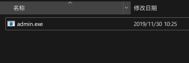

这是一个exe程序，我们将它拖入winhex里查看


可以看到，这个文件头标识为

```
89 50 4E 47 0D 0A 1A 0A
```

标准的png图片格式，我们将后缀改为png


扫码就能获得flag

#### 倒转文件byte


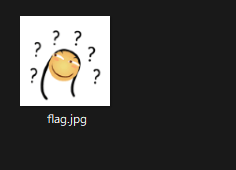

这是一个后缀为jpg的图片，我们用winhex打开这个图片看看


在最下面，可以看到一个倒过来的PNG和IHDR标识，说明这个png的图片格式都倒过来了，我们需要写一个小脚本来让他复原

```
a = open('flag.jpg','rb')  #读取flag.jpg图片的byte数据
b = open('png.png','wb')  #新建一个名为png.png的图片，写入byte数据
b = b.write(a.read()[::-1])  #将flag.jpg图片的byte数据，倒着写入png.png图片里
```

运行脚本，就能得到flag

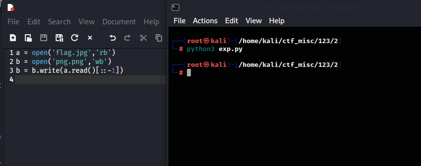


#### 添加文件头数据


 这个图片无法打开，我们拖入winhex里看看


文件头部只有

```
0D 0A 1A 0A
```

而png文件头部为

```
89 50 4E 47 0D 0A 1A 0A
```

我们需要写入89 50 4E 47，ctrl+n新建一个文件


随意设置一个大小，然后ctrl+a全选数据，然后ctrl+c复制后粘贴到新文件里

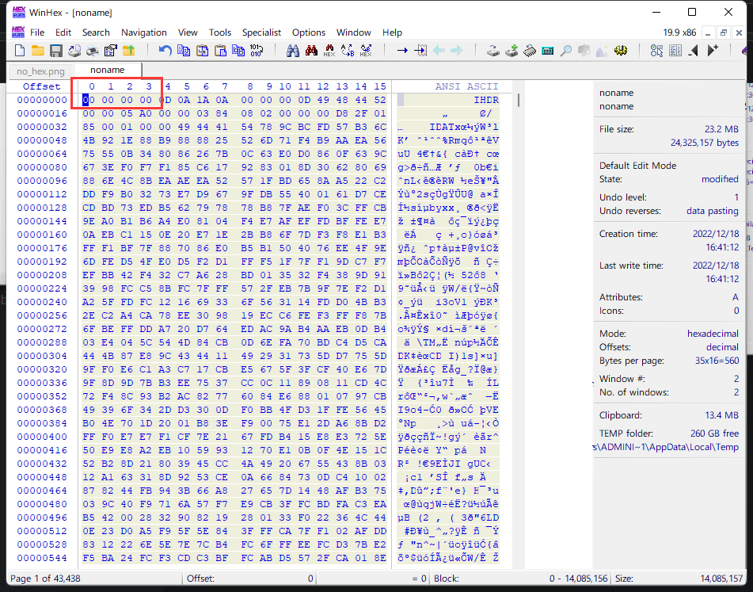

点击第一个值，写入89 50 4E 47


然后ctrl+s保存为png格式的文件

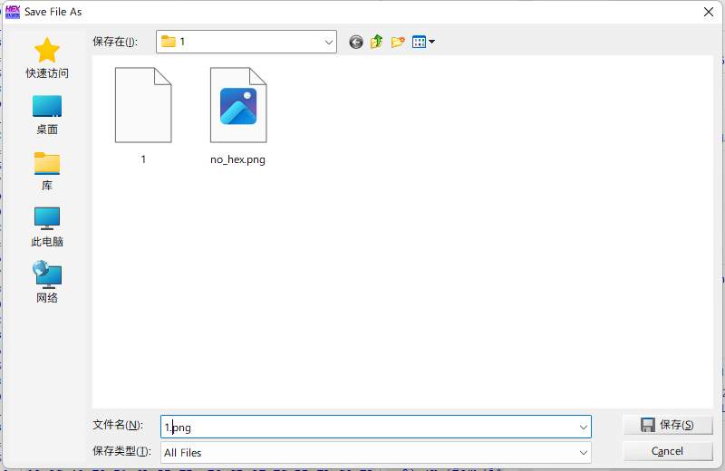


现在图片就显示正常了

### 图片宽高以及CRC爆破

PNG文件中，每个数据块都由四个部分组成，如下:

```
长度(Length)：指定数据块中数据区域的长度，长度不可超过(2^31-1)个字节
数据块类型码(Chunk Type Code)：数据块类型码由ASCII字母(A-Z和a-z)组成的"数据块符号"
数据块数据(Chunk Data)：存储数据块类型码指定的数据
循环冗余检测(CRC)：存储用来检测是否文件传输有误的循环冗余码
```


#### 图片高度修改


这是一个png图片，但是感觉高度不太对，我们把图片拖入winhex里


修改图片高度的值


ctrl+s保存后查看图片


出现了flag

#### 图片宽度和CRC值爆破

目前手上没这种类型的题，可以去看看落雪wink师傅的文章

```
https://blog.csdn.net/weixin_44145452/article/details/109612189
```

## 从图片中提取文件

通过cmd的copy命令，可以将文件隐藏在图片里，我们需要从图片中提取文件，这也是ctf经常考的点


这是一张正常的jpg图片，但是在最下面可以看到一个文件


说明有其他文件在这个图片里，我们需要提取出来

### 通过binwalk提取图片中的文件

binwalk扫描图片内是否存在其他文件

```
binwalk dog.jpg
```


可以看到，这个图片里有一个名为hidden_text.txt的文件，现在我们提取这个文件

```
binwalk -e dog.jpg --run-as=root
```


他会自动生成一个文件夹，将提取出来的文件放入这个文件夹里


### 通过foremost提取图片中的文件

我常用的提取工具是foremost，因为他比binwalk更精确一些

```
foremost dog.jpg -o dog  //-o：指定输出的文件夹
```

在文件夹里有一个名为audit.txt的文件，这个文件里可以查看一些图片的信息


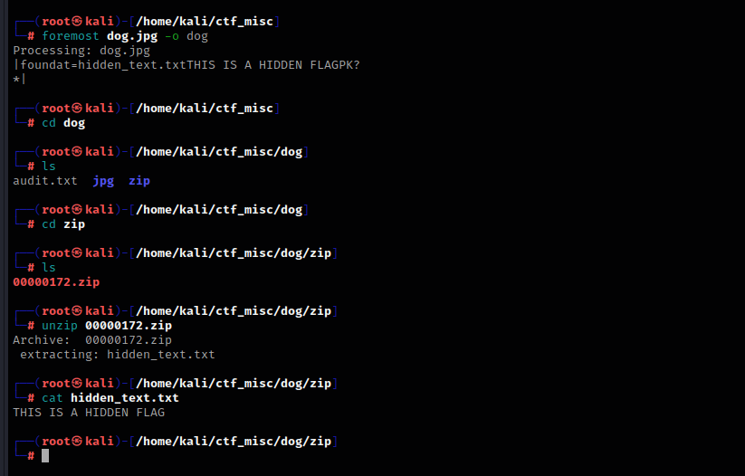

## JPG图片隐写

### jpg图片格式

jpg图片的头数据为

```
FF D8 FF
```


### jpg图片高度修改

这是一个jpg图片，但是在最下面，可以看到flag的一些信息

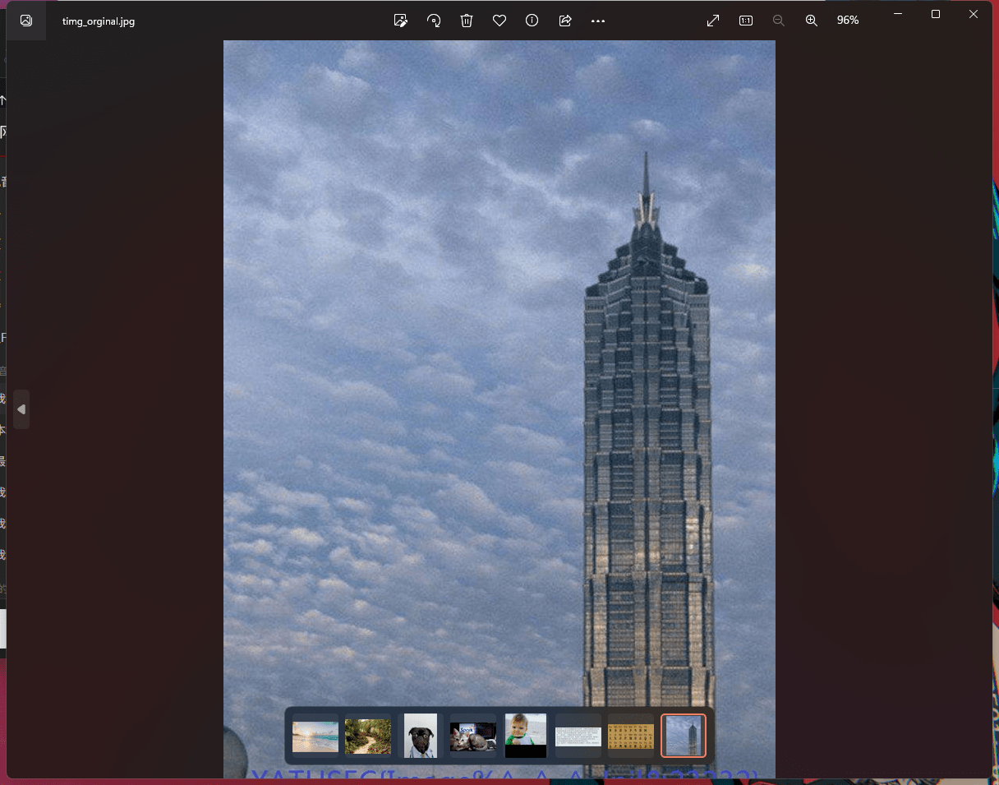


我们将图片拖入winhex里


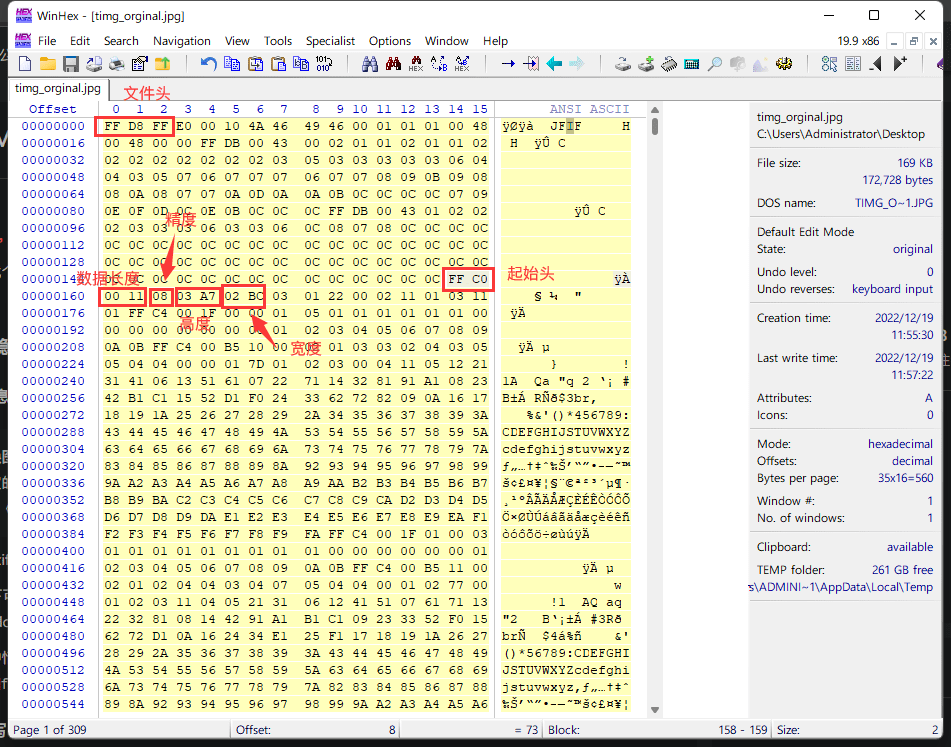

我们修改高度，然后ctrl+s保存


就能看见flag了

## EXIF信息

在我们拍摄图片时，exif可以记录数码照片的属性信息和拍摄数据

右击图片，点击熟悉，选择详细信息，这里面可以看到图片拍摄的一些值，有时候还能找到经纬度


在kali里，我们可以用exiftool工具来查看更详细的exif数据

```
exiftool cat.jpg
```


在这里可以看到一串base64编码，我们解密看看


得到flag

在做osint类题目时，需要留意图片的exif信息里有没有经纬度，在做不出来题的时候，可以看看图片的exif信息

## BMP图片隐写

### BMP图片格式

BMP 文件格式能够存储单色和彩色的二维数字图像，具有各种颜色深度，并且可以选择使用数据压缩、alpha 通道和颜色配置文件

bmp的头文件数据为

```
42 4D
```


头数据后四位是图片大小


由于个人计算机都是以小端序，所以数据要从右往左写

```
0x002c268e == 2893454(Byte) == 2.75M
```


### BMP图片高度修改


这是一个没有后缀名的文件，我们用winhex打开这个文件

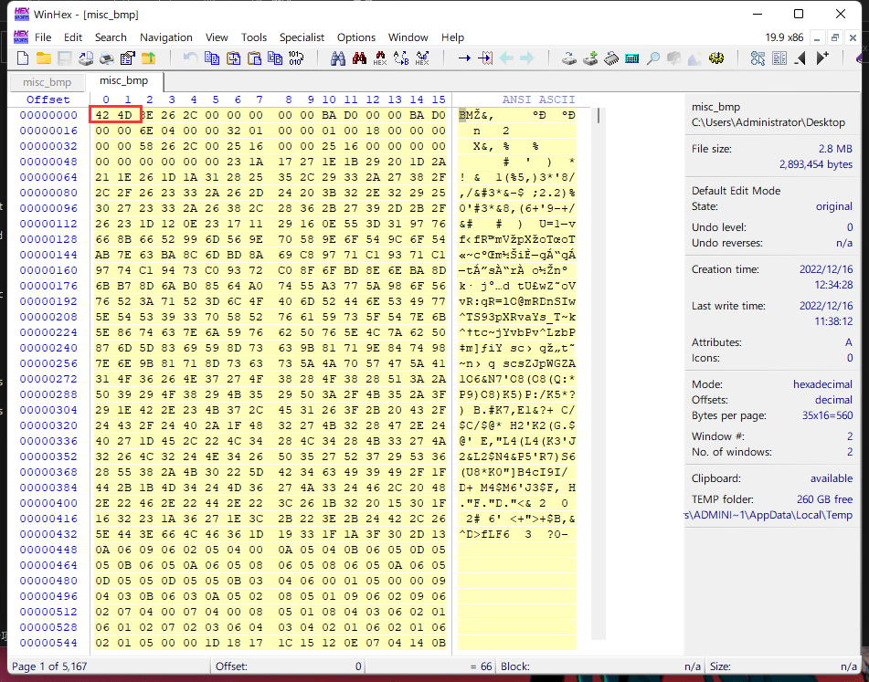

文件头为42 4D，这是一个bmp文件，我们将后缀名改成bmp


用ps打开这个图片，可以看到一个假的flag，并且高度也有些不对

这是维基百科对bmp图片结构的解释

```
https://en.wikipedia.org/wiki/BMP_file_format
```


我们将32 01 修改为 32 04，再拖进ps里就能看见flag了


## GIF图片隐写

gif图片是动图，它是由一帧一帧的图片拼接而成

### GIF图片格式

gif头文件数据为

```
47 49 46 38 39 61
```

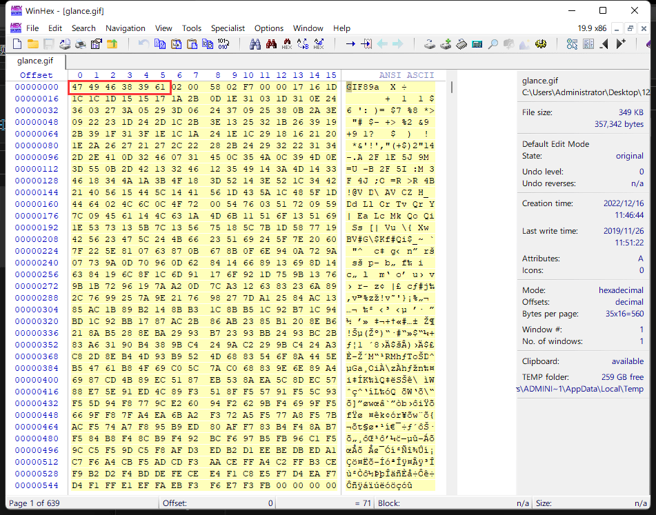

### GIF帧分离再拼接

下面会用到imagemagick

```
sudo apt install imagemagick
```


这是一个很细的gif图片，我们需要分离它的每一帧后再拼接

```
convert glance.gif flag.png   #一帧一帧分割图片
```


分离出了很多图片，现在我们要把他们拼成一张图片

```
montage flag*.png -tile x1 -geometry +0+0 flag.png     #合并图片
```


得到flag

### GIF图像格式和特征

有些GIF图片每一帧都可能存在规律，这也是常考的点


发现打不开这个gif图片，我们把它拖到winhex里看看


发现文件头数据不见了，我们ctrl+n新建一个文档，然后输入gif的头数据

```
47 49 46 38 39 61
```

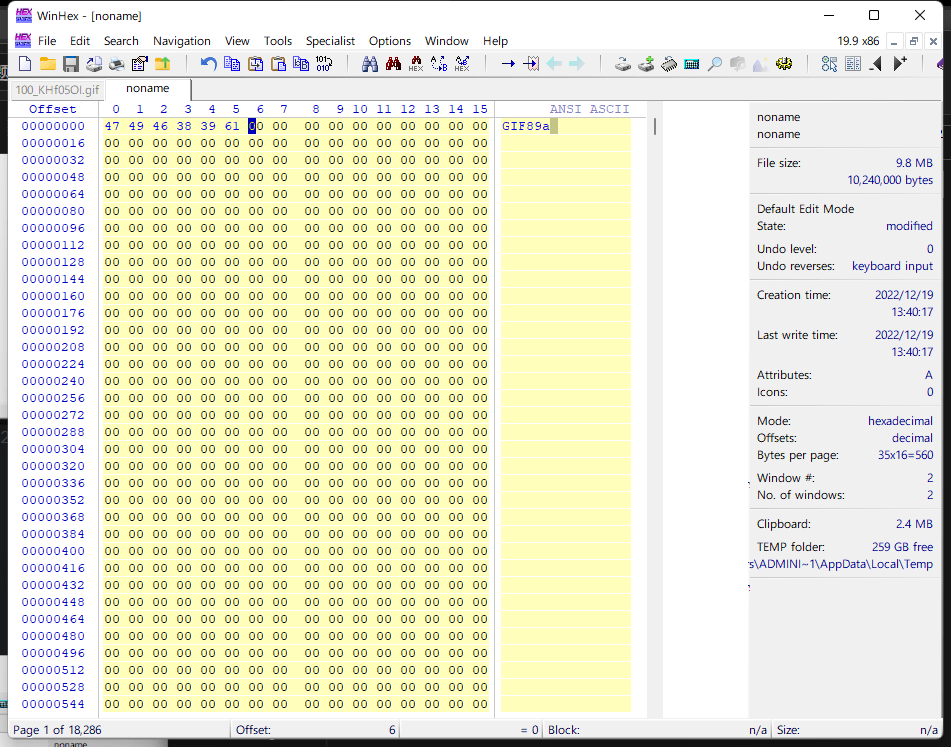


回到第一个图片数据，ctrl+a全选，然后复制粘贴到新文件里

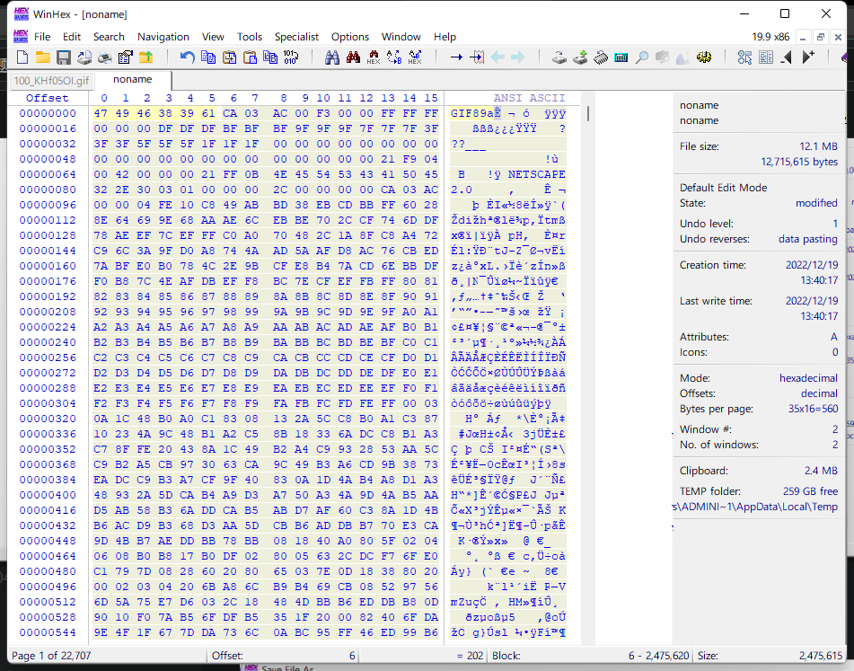


ctrl+s保存


现在就能正常读取gif图片了，但是并没有显示flag，而且图片也不是动图，我们猜测它的每一帧都有规律

现在用identify工具来识别规律

```
identify -format "%T" flag.gif
```


我们将这些值复制出来，新建一个文本文档，将开头的四个6删除过，ctrl+h替换数字


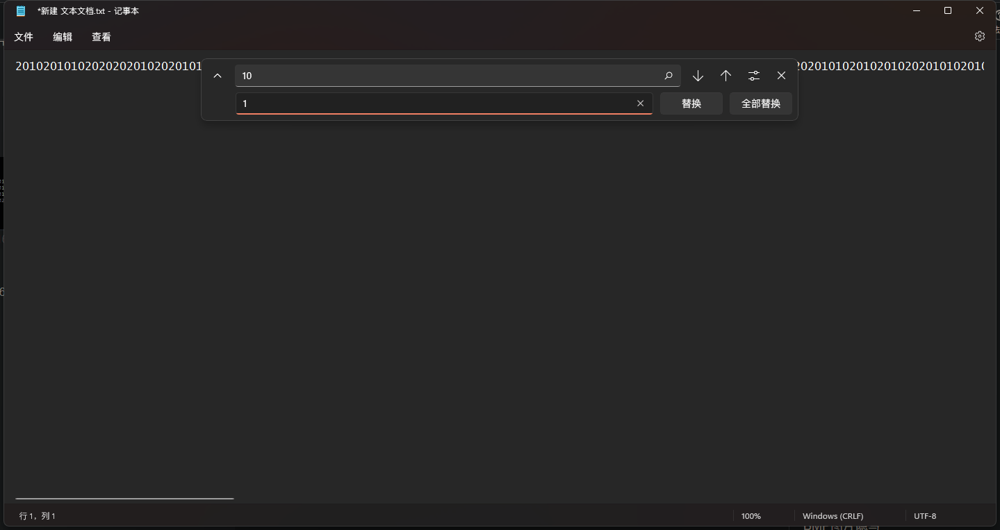

将10全部替换为1，将20全部替换为0


把这些二进制值复制下来，去这个网站对应位置粘贴上去

```
https://www.rapidtables.com/convert/number/ascii-hex-bin-dec-converter.html
```

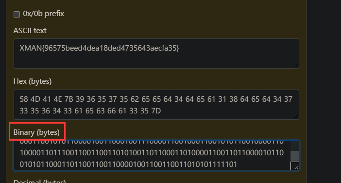

得到flag

### GIF每一帧查看

如果想查看gif图片的每一帧，则可以使用Stegsolve工具


选择要查看的图片导入


选择frame browser即可查看每一帧

或者用pr也行

## 盲水印

盲水印是一种肉眼不可见的水印方式，可以保持图片美观的同时，保护版权，隐藏式的水印是以数字数据的方式加入音频、图片或影片中，但在一般的状况下无法被看见

这里就用官方图片做演示


这里有两张一模一样的图片，现在我们查看水印

```
bwm decode hui.png hui_with_wm.png flag.png
```


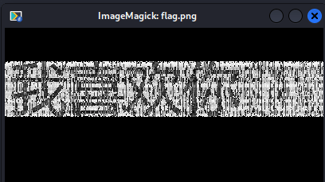


## 查看文件里的字符串

有些题目往图片里添加一些字符串，列如上一道题目，我们可以使用strings工具来查看文件里的字符串


这是一张正常的jpg图片，现在我们提取文件里的字符串


```
strings hex.jpg
```


## 其他图片隐写

<!-- Imported from D:\\Book\\Misc\\Chapter2\2-11.md -->
### StegHide 隐写（Key）

直接上题（BugKu CTF）


继上节 FTP-DATA 后拿到图片，使用工具 StegHide 检测发现有隐藏文件

按 y 确认，没有密码直接回车


<!-- Imported from D:\\Book\\Misc\\Chapter2\2-12.md -->

话不多说，直接上题（BugKu CTF）


使用工具 ExifTools 提取所有元数据

```shell
exftool.exe reveille.jpg
```


将其转为摩斯密码拿到 flag


<!-- Imported from D:\\Book\\Misc\\Chapter2\2-13.md -->
### Extract 隐写（Key）

话不多说，直接上题（BugKu CTF）


下载文件后先用 stegsolve 拿到密码


使用命令 extract 提取隐写内容到 txt 中


<!-- Imported from D:\\Book\\Misc\\Chapter2\2-14.md -->
### SilentEye 隐写（图片）

话不多说，直接上题（BugKu CTF）


首先是 bmp 图片隐写

使用 SilentEye 解码即可


<!-- Imported from D:\\Book\\Misc\\Chapter2\2-15.md -->
### JPHS 隐写（Key）

话不多说，直接上题（BugKu CTF）


前门的步骤参考上一节 SilentEye 隐写

使用 JPHS 解码 jpeg 图片，点击 Open jpeg


点击 Seek 提取数据（这题密码在属性中）


保存文件即可


<!-- Imported from D:\\Book\\Misc\\Chapter2\2-16.md -->
### 抽象画隐写

原理是 Piet 这门编程语言

话不多说，直接上题（BugKu CTF）


打开 Word 文档另存其中图片


使用工具 NPiet 提取


还有另一半解码即可


<!-- Imported from D:\\Book\\Misc\\Chapter2\2-17.md -->
### FFC 隐写（Key）

FFC 是 Free File Camouflage 的简称

话不多说，直接上题（BugKu CTF）


发现注释有段编码


解码得到提示这个工具


题目给出了密码，使用工具提取数据即可

最后执行 txt 文件中的代码拿到 flag


<!-- Imported from D:\\Book\\Misc\\Chapter2\2-18.md -->
### Java 盲水印隐写

话不多说，直接上题（BugKu CTF）


前面的步骤是先 Foremost 分离，然后爆破（有提示密码是四位数字），拿到图片


使用工具提取图片（图中有工具名）


成功拿到下一步的 Key 值


<!-- Imported from D:\\Book\\Misc\\Chapter2\2-19.md -->
### S-Tools 隐写（Key）

话不多说，直接上题（BugKu CTF）


文件末尾有段加密字符


解密得到提示工具及 Key 值


使用工具 S-Tools 解出 Key.txt 文件


<!-- Imported from D:\\Book\\Misc\\Chapter2\2-2.md -->
### 坐标点隐写

这类题通常是一大串坐标点数据

你需要格式化数据然后绘制图形

话不多说，直接上题（BugKu CTF）


下载文件扔进 WinHex 中发现一大串 16 进制数据


编写脚本将 16 进制转 ASCII

```python
def hex_to_ascii(hex_string):
    # 确保输入的十六进制字符串长度是偶数
    if len(hex_string) % 2 != 0:
        print("输入的十六进制字符串长度不是偶数，请输入有效的十六进制字符串。")
        
        return None

    # 将十六进制字符串分割成每两个字符一组
    hex_bytes = [hex_string[i:i + 2] for i in range(0, len(hex_string), 2)]

    # 将每组十六进制字符转换为 ASCII 字符
    ascii_string = ''.join(chr(int(b, 16)) for b in hex_bytes)

    return ascii_string


# 读取文件中的十六进制数据
def read_hex_from_file(file_path):
    try:
        with open(file_path, 'r') as file:
            hex_data = file.read().strip()
            
            return hex_data
        
    except FileNotFoundError:
        print(f"文件 {file_path} 未找到。")
        
        return None


# 将 ASCII 字符串写入文件
def write_ascii_to_file(file_path, ascii_string):
    try:
        with open(file_path, 'w') as file:
            file.write(ascii_string)
            
            print(f"ASCII字符串已保存到文件：{file_path}")
            
    except Exception as e:
        print(f"无法写入文件 {file_path}，错误：{e}")


def main():
    # 你的文件路径
    file_path = '16 进制数据.txt'
    
    # 输出文件路径
    output_file_path = 'ascii_output.txt'
    
    hex_input = read_hex_from_file(file_path)

    if hex_input:
        ascii_output = hex_to_ascii(hex_input)
        if ascii_output:
            write_ascii_to_file(output_file_path, ascii_output)


if __name__ == "__main__":
    main()
```

这样我们就得到了坐标


继续使用 Python 绘图拿到 flag

```python
import matplotlib.pyplot as plt


# 读取文件中的坐标数据
def read_data_from_file(file_path):
    try:
        with open(file_path, 'r') as file:
            lines = file.readlines()
            
            points = []
            
            for line in lines:
                # 移除空白字符和括号，然后分割字符串获取 x 和 y 值
                x, y = map(int, line.strip().replace('(', '').replace(')', '').split(','))
                
                points.append((x, y))
                
            return points
        
    except FileNotFoundError:
        print(f"文件 {file_path} 未找到。")
        
        return None


# 绘制点
def plot_points(points):
    # 分离 x 和 y 坐标
    x_coords = [point[0] for point in points]
    
    y_coords = [point[1] for point in points]

    # 创建散点图
    plt.scatter(x_coords, y_coords)
    
    plt.xlabel('X Coordinate')
    
    plt.ylabel('Y Coordinate')
    
    plt.title('Scatter Plot of Points')
    
    plt.grid(True)
    
    plt.show()


def main():
	# 你的文件路径
    file_path = 'ascii_output.txt'
    
    points = read_data_from_file(file_path)

    if points:
        plot_points(points)


if __name__ == "__main__":
    main()
```


<!-- Imported from D:\\Book\\Misc\\Chapter2\2-20.md -->
### Stegpy 隐写

话不多说，直接上题（BugKu CTF）


这里是本题的最后一步，使用工具 stegpy 提取字符


<!-- Imported from D:\\Book\\Misc\\Chapter2\2-21.md -->
### PDF 密码爆破

话不多说，直接上题（BugKu CTF）


前面先爆破出文件解压缩密码是 1337h4x0r，接下来爆破 PDF 密码


使用工具 pdfcrack 爆破，rockyou 字典爆破出密码

```shell
-f FILE：选择 FILE 文件
-b：执行基准测试并退出
-c STRING：使用 STRING 中的字符作为字符集
-w FILE：使用 FILE 作为密码源进行尝试
-n INTEGER：跳过尝试短于 INTEGER 的密码
-m INTEGER：达到此 INTEGER 密码长度时停止
-l FILE：从 FILE 中保存的状态继续
-o：使用所有者密码
-u：使用用户密码（默认）
-p STRING：提供用户密码以加快破解所有者密码的速度（隐含 -o）
-q：安静运行
-s：尝试排列密码（目前仅支持将第一个字符切换为大写）
-v：打印版本并退出
```


成功拿到 flag


<!-- Imported from D:\\Book\\Misc\\Chapter2\2-22.md -->
### StegSeek 爆破

话不多说，直接上题（BugKu CTF）


第一个文件提示需要 Steg 工具，使用 StegSeek 爆破


<!-- Imported from D:\\Book\\Misc\\Chapter2\2-23.md -->
### PPT 隐写

话不多说，直接上题（BugKu CTF）


放大 PPT 即可


<!-- Imported from D:\\Book\\Misc\\Chapter2\2-24.md -->
### PDF 哈希爆破

话不多说，直接上题（BugKu CTF）


打开 PDF 需要密码


原题目给出了提示


密码是一串九位数字，可以使用 pdfcrack 爆破，但之前介绍过了，所以这里介绍另一种方法


先获取 PDF 的哈希值


再格式化一下删除多余的字符


最后爆破即可


<!-- Imported from D:\\Book\\Misc\\Chapter2\2-25.md -->
### F5-steganography 隐写

话不多说，直接上题（BUUCTF）


下载文件得到一张图片


使用工具 F5-steganography 测试提取出文件


<!-- Imported from D:\\Book\\Misc\\Chapter2\2-26.md -->
### Outguess 隐写（Key）

话不多说，直接上题（BUUCTF）


查看图片属性发现核心价值观编码


解码拿到 abc


根据题目提示使用工具 Outguess -k 指定密码 abc -r 指定文件


<!-- Imported from D:\\Book\\Misc\\Chapter2\2-27.md -->
### 视频帧隐写

话不多说，直接上题（BUUCTF）


使用工具 Kinovea 打开视频后看到二维码就截图扫码


<!-- Imported from D:\\Book\\Misc\\Chapter2\2-28.md -->
### BPG 隐写

话不多说，直接上题（BUUCTF）


分离出末尾的 BPG 文件


网上查找相关资料


网上下载工具


使用命令打开


<!-- Imported from D:\\Book\\Misc\\Chapter2\2-29.md -->
### APNG 隐写

话不多说，直接上题（BUUCTF）


使用工具分离


<!-- Imported from D:\\Book\\Misc\\Chapter2\2-3.md -->

这类题一般都是两张一模一样的图片

但是其中一张的大小比另一种大的多

话不多说，直接上题（BugKu CTF）


打开文件发现两张相同图片，且另一个大小是其中一个好几倍


使用工具 BlindWaterMark 提取隐藏图片（原图不在了用用别人的）


成功拿到图片，这里是压缩包的解压密码

解压缩后 Base64 多行解码即可


<!-- Imported from D:\\Book\\Misc\\Chapter2\2-30.md -->
### 频域盲水印隐写

话不多说，直接上题（BUUCTF）


19 年的题，版本有点老，用的 python2 

```python
import cv2
import numpy as np
import random
import os
from argparse import ArgumentParser

ALPHA = 5

def build_parser():
    parser = ArgumentParser()
    
    parser.add_argument('--original', dest='ori', required=True)
    
    parser.add_argument('--image', dest='img', required=True)
    
    parser.add_argument('--result', dest='res', required=True)
    
    parser.add_argument('--alpha', dest='alpha', default=ALPHA, type=float)
    
    return parser

def check_file_exists(file_path, parser, file_name):
    if not os.path.exists(file_path):
        parser.error(f"{file_name} {file_path} does not exist.")

def main():
    parser = build_parser()
    
    options = parser.parse_args()

    ori, img, res, alpha = options.ori, options.img, options.res, options.alpha

    check_file_exists(ori, parser, 'Original image')
    
    check_file_exists(img, parser, 'Image')

    decode(ori, img, res, alpha)

def decode(ori_path, img_path, res_path, alpha):
    ori = cv2.imread(ori_path)
    
    img = cv2.imread(img_path)

    # 对两个图像执行 FFT
    ori_f = np.fft.fft2(ori)
    
    img_f = np.fft.fft2(img)

    # 计算水印
    watermark = np.real((ori_f - img_f) / alpha)

    # 创建结果矩阵
    res = np.zeros_like(watermark)

    # 随机索引
    height, width = ori.shape[:2]
    
    x = np.arange(height // 2)
    
    y = np.arange(width)
    
    # Shuffle 高效协调
    np.random.shuffle(x)
    
    np.random.shuffle(y)

    # 分配混洗水印值
    res[x[:, None], y] = watermark[x[:, None], y]

    # Save result image
    cv2.imwrite(res_path, res, [int(cv2.IMWRITE_JPEG_QUALITY), 100])

if __name__ == '__main__':
    main()
```


<!-- Imported from D:\\Book\\Misc\\Chapter2\2-31.md -->
### WbStego 隐写（Key）

**如何判断是否文件采用`wbStego4open`加密？**

1. **将文件导入010editor、winhex之类的十六进制查看工具**
2. **如果 `20`、`09` 出现次数较多，则有可能为`wbStego4open`加密**

话不多说，直接上题（BugKu CTF）


拿到文件是一个 PDF，首先尝试 WbStego 隐写，打开软件点击 Continue


再选择 Decode 解码点击 Continue


接着将我们文件托进去点击 Continue


要我们填写密码，但是不知道密码，所以直接下一步


在选择输出的位置


直接下一步


完成！！！


打开输出文件拿到 flag


<!-- Imported from D:\\Book\\Misc\\Chapter2\2-32.md -->
### GPS 数据隐写

话不多说，直接上题（攻防世界）


题目提示了 GPS，给的附近打开也都是些数据


去[在线网站](https://www.gpsvisualizer.com/map_input?form=leaflet)绘制


成功拿到 flag


<!-- Imported from D:\\Book\\Misc\\Chapter2\2-33.md -->
### 图片拼接隐写（Online）

话不多说，直接上题（攻防世界）


打开文件都是些图片碎片


按时间排序后去[在线网站](https://cdkm.com/cn/merge-image#google_vignette)合并，一定要选水平


合并后下载文件


设置曝光度扫码拿到 flag


<!-- Imported from D:\\Book\\Misc\\Chapter2\2-34.md -->
### TIFF 图层隐写

话不多说，直接上题（攻防世界）


首先使用 ForeMost 提取隐写文件


解压出来的 exe 文件运行得到一个 tiff 文件

**用 PS 编辑后的 Tiff 文件可以保存路径和图层**


去掉遮挡的图层拿到 flag 计算式


在 WinHex 中结尾发现字符

```
njCp1HJBPLVTxcMhUHDPwE7mPW
```

编写脚本解密

```python
bytearray = b"njCp1HJBPLVTxcMhUHDPwE7mPW"
 
flag = ""
 
for i in range(len(bytearray)):
    if i % 2==0:
        c = bytearray[i]
        c -= 1
        flag += chr(c)
    else:
        c = bytearray[i]
        c += 1
        flag += chr(c)
 
print(flag)
```


<!-- Imported from D:\\Book\\Misc\\Chapter2\2-35.md -->
### BMP 隐写

话不多说，直接上题（攻防世界）


打开附件给了一张 bmp 类型图片


在 Stegsolve 中换其他通道看到疑似二维码的碎片


用画图工具打开 bmp 图片将其另存为 png 格式再放入 Stegsolve 中拿到二维码

扫码拿到 flag


<!-- Imported from D:\\Book\\Misc\\Chapter2\2-36.md -->
### GIF 帧像素隐写

话不多说，直接上题（攻防世界）


给了一个 GIF 文件，先将其分解

```python
import os
from PIL import Image

def main(gif_file):
    png_dir = 'frame/'
    img = Image.open(gif_file)
    try:
        while True:
            current = img.tell()
            img.save(png_dir + str(current + 1) + '.png')
            img.seek(current + 1)
    except:
        pass
if __name__ == '__main__':
    gif_file = 'out.gif'
    main(gif_file)
```

发现每个图像素点位置都不一样


读取每个 PNG 中的对应点的信息，并按照 8bit 转换为 ascii

```python
import os
from PIL import Image

def main():
    png_dir = 'frame/'
    ret = ""
    for i in range(0,24):
        line = ""
        for j in range(0,24):
            file_name = "frame/" + str(i * 24 + j + 1) + ".png"
            x = j * 10 + 5
            y = i * 10 + 5
            img = Image.open(file_name)
            img = img.convert("RGB") 
            img_array = img.load()
            r, g, b = p = img_array[x, y]
            if g == 255:
                line += "0"
            if r == 255 and b == 255:
                line += "1"
            if len(line) == 8:
                ret += chr(int(line, 2))
                line = ""
                
    print(ret)

if __name__ == '__main__':
    main()
```

运行脚本得到

```
o8DlxK+H8wsiXe/ERFpAMaBPiIcj1sHyGOMmQDkK+uXsVZgre5DSXw==
```

再 Foremost 分离 GIF 文件


拿着密钥去解密即可


<!-- Imported from D:\\Book\\Misc\\Chapter2\2-37.md -->
### Cloacked-pixel隐写

话不多说，直接上题（攻防世界）


给了个图片


下载工具


经过一系列报错安装库（本人从不用 Python2）终于成功


成功拿到数据


解密


<!-- Imported from D:\\Book\\Misc\\Chapter2\2-38.md -->
### 二维码手动修补隐写

话不多说，直接上题（攻防世界）


下载拿到图片


手动处理二维码

此二维码的大小为 29x29，版本 V 的大小为 N × N，N = 17 + 4V，所以这是版本 3


图中红框该区域表示二维码的格式信息，实际上格式信息是 15 位长，区域有最后 8 位


搜索所有格式信息字符串的列表，我们可以发现类型信息位是`001001110111110`，所以这个二维码有ECC级别 H 和掩码模式 1

| ECC 级别 | 蒙版图案 | 类型信息位      |
| :------- | :------- | :-------------- |
| L        | 0        | 111011111000100 |
| L        | 1        | 111001011110011 |
| L        | 2        | 111110110101010 |
| L        | 3        | 111100010011101 |
| L        | 4        | 110011000101111 |
| L        | 5        | 110001100011000 |
| L        | 6        | 110110001000001 |
| L        | 7        | 110100101110110 |
| M        | 0        | 101010000010010 |
| M        | 1        | 101000100100101 |
| M        | 2        | 101111001111100 |
| M        | 3        | 101101101001011 |
| M        | 4        | 100010111111001 |
| M        | 5        | 100000011001110 |
| M        | 6        | 100111110010111 |
| M        | 7        | 100101010100000 |
| Q        | 0        | 011010101011111 |
| Q        | 1        | 011000001101000 |
| Q        | 2        | 011111100110001 |
| Q        | 3        | 011101000000110 |
| Q        | 4        | 010010010110100 |
| Q        | 5        | 010000110000011 |
| Q        | 6        | 010111011011010 |
| Q        | 7        | 010101111101101 |
| H        | 0        | 001011010001001 |
| H        | 1        | 001001110111110 |
| H        | 2        | 001110011100111 |
| H        | 3        | 001100111010000 |
| H        | 4        | 000011101100010 |
| H        | 5        | 000001001010101 |
| H        | 6        | 000110100001100 |
| H        | 7        | 000100000111011 |

QR 掩码说明

| Mask Number | If the formula below is true for a given row/column coordinate, switch the bit at that coordinate |
| ----------- | ------------------------------------------------------------ |
| 0           | (row + column) mod 2 == 0                                    |
| 1           | (row) mod 2 == 0                                             |
| 2           | (column) mod 3 == 0                                          |
| 3           | (row + column) mod 3 == 0                                    |
| 4           | ( floor(row / 2) + floor(column / 3) ) mod 2 == 0            |
| 5           | ((row * column) mod 2) + ((row * column) mod 3) == 0         |
| 6           | ( ((row * column) mod 2) + ((row * column) mod 3) ) mod 2 == 0 |
| 7           | ( ((row + column) mod 2) + ((row * column) mod 3) ) mod 2 == 0 |

参考上面的表格

掩码编号 1 具有公式`(row) mod 2 == 0`

请注意行号从 0 开始，因此我们必须交换坐标为 0、2、4、…、28 的行的位

另外，QR 码有固定的模式，所以我们只需切换数据部分的位

参考下面数据区域和位顺序


因此，原始的 D1–D26 为：

```
D1  = 0b11101100
D14 = 0b10000010
D2  = 0b11111000
D15 = 0b10010101
D3  = 0b00110110
D16 = 0b00111101
D4  = 0b01110110
D17 = 0b01100010
D5  = 0b00100010
D18 = 0b11101001
D6  = 0b11110001
D19 = 0b10100001
D7  = 0b00110111
D20 = 0b11100101
D8  = 0b01010010
D21 = 0b11010101
D9  = 0b00010111
D22 = 0b00101101
D10 = 0b11011110
D23 = 0b10010111
D11 = 0b01000100
D24 = 0b10001011
D12 = 0b01010100
D25 = 0b01111000
D13 = 0b11001101
D26 = 0b11000110
```

mod 2 == 0 掩码之后

```
D1  = 0b00100000
D14 = 0b01001110
D2  = 0b00110100
D15 = 0b01011001
D3  = 0b11111010
D16 = 0b00001110
D4  = 0b01000101
D17 = 0b01010001
D5  = 0b00010001
D18 = 0b11011010
D6  = 0b00111101
D19 = 0b10010010
D7  = 0b00000100
D20 = 0b11010101
D8  = 0b10011110
D21 = 0b00011001
D9  = 0b11010100
D22 = 0b00010001
D10 = 0b00010100
D23 = 0b00001110
D11 = 0b11011101
D24 = 0b00010010
D12 = 0b11010010
D25 = 0b00011111
D13 = 0b01010100
D26 = 0b01000000
```

现在我们可以开始解码数据了

有解码的模式指示器：

- `0001`：数字模式（每 3 位 10 位）
- `0010`：字母数字模式（每 2 个字符 11 位）
- `0100`：字节模式（每个字符 8 位）
- `1000`：汉字模式（每个字符 13 位）
- `0111`：ECI 模式

字符数指示符跟在模式指示符之后。

- 版本 1–9
  - 数字模式：10位
  - 字母数字模式：9 位
  - 字节模式：8位
  - 汉字模式：8位
- 版本 10–26
  - 数字模式：12位
  - 字母数字模式：11 位
  - 字节模式：16位
  - 汉字模式：10位
- 版本 27–40
  - 数字模式：14位
  - 字母数字模式：13 位
  - 字节模式：16位
  - 汉字模式：12位

查看每种模式的编码过程：

- 数字模式编码
- 字母数字模式编码
- 字节模式编码
- 汉字模式编码

让我们从上面的数据 D1–D26 开始：

```ruby
data = '00100000' \
       '00110100' \
       '11111010' \
       '01000101' \
       '00010001' \
       '00111101' \
       '00000100' \
       '10011110' \
       '11010100' \
       '00010100' \
       '11011101' \
       '11010010' \
       '01010100' \
       '01001110' \
       '01011001' \
       '00001110' \
       '01010001' \
       '11011010' \
       '10010010' \
       '11010101' \
       '00011001' \
       '00010001' \
       '00001110' \
       '00010010' \
       '00011111' \
       '01000000'
alphanumeric = '0123456789ABCDEFGHIJKLMNOPQRSTUVWXYZ $%*+-./:'.chars

def read(str, size)
  str.slice!(0, size)
end

def kanji(num)
  if num >= 0x1740
    (0xC140 + num / 0xC0 * 0x100 + num % 0xC0)
      .chr(Encoding::Shift_JIS).encode(Encoding::UTF_8)
  else
    (0x8140 + num / 0xC0 * 0x100 + num % 0xC0)
      .chr(Encoding::Shift_JIS).encode(Encoding::UTF_8)
  end
end

loop do
  case mode = read(data, 4)
  when '0010' # Alphanumeric
    count = read(data, 9).to_i(2)
    (count / 2).times do
      chunk = read(data, 11).to_i(2)
      print alphanumeric[chunk / 45] + alphanumeric[chunk % 45]
    end
    print alphanumeric[read(data, 11).to_i(2)] if count.odd?
  when '0100' # Byte
    count = read(data, 8).to_i(2)
    count.times do
      print read(data, 8).to_i(2).chr
    end
  when '1000' # Kanji
    count = read(data, 8).to_i(2)
    count.times do
      print kanji(read(data, 13).to_i(2))
    end
  when '0000' # Terminate
    break
  else
    fail "Unhandled mode #{mode}"
  end
end
```


<!-- Imported from D:\\Book\\Misc\\Chapter2\2-39.md -->
### OGG/WAV 单色图像隐写

话不多说，直接上题（攻防世界）


“120 LPM”提示指的是[天气传真](http://en.wikipedia.org/wiki/Radiofax)，一种传输单色图像的模拟模式

有一个名为 Multimode 的 OS X 应用程序可用于将音频转换回原始传真图像

但它只接受 WAV 文件作为输入，所以我首先转换 `similar.ogg` 为 `similar.wav` 使用 Audacity


正文如下：

```
section 1 of 1 of file rfax_man
begin 644 rfax_man
h5sg60BSxwp62+57aMLVTPK3i9b-t+5pGLKyPA-FxxuysvFs+BT8+o0dVsM24
hcZHRaWYEHRBGFGtqk-cMV7oqqQRzbobGRB9Kwc-pTHzCDSSMJorR8d-pxdqd
hLWpvQWRv-N33mFwEicqz+UFkDYsbDvrfOC7tko5g1JrrSX0swhn64neLsohr
h26K1mSxnS+TF1Cta8GHHQ-t1Cfp7nh-oZeFuVi5MEynqyzX8kMtXcAynSLQx
hg4o56Pu4YUZHMqDGtczKeCwXU8PZEc4lY0FbDfFfgZpJFC-a-sHGLtGJgCMZ
hksr6XNTedEUdVJqxOO5VaReoH68eEPJ2m6d9mKhlhVE7zw4Yru4DUWRCJH28
hyeth+l2I0gPnEfrTLwAc+-TPS0YKYY3K0np58gVPgdAN8RY7+rQfRDin9JSa
hPG32WG7-rTl3uthvrnDO-wD09GDIRCniuoefs8UsfiWZOLq+0awOrQxAPM+C
hxLwOJ9VUKwdn7dJduLn1KhBucvL1pr5lGiBFfUbL79cFFex+G27kT+fsQ7X5
h87mgPivWhDSQHKPXqpKGniDkYsIYpg66ZWbHp4PfcgtPukElDWENlQPSuNAQ
hnboE4Bd8kyyokt67GgfGvBVS45sMFPtlgKRlG-QPFSgbMHujA3qYemxnuqGx
hp97aXpdKpvAE8zx-oUzazoVFz32X3OxAuiWJhKEjaYKpM7f95yv1S62v+k++
+
end
sum —r/size 7468/769 section (from "begin" to "end")
sum —r/size 36513/540 entire input file
```

使用 XXdecoder 解码生成一个名为 的文件 `rfax_man`


```shell
$ file rfax_man
rfax_man: gzip compressed data, was "rfax_man.py", from FAT filesystem (MS-DOS, OS/2, NT), last modified: Thu Feb  6 17:52:39 2014, max speed
```

解压缩是一个 Python 脚本

```python
import socket,os,sys,hashlib

KEY  = "CTF{4BDF4498E4922B88642D4915C528DA8F}" # DO NOT SHARE THIS!
HOST = '109.233.61.11'
PORT = 8001

if len(sys.argv)<3:
  print 'Usage: rfax_man.py add|del file.png'
  print '\nAdd your pictures to transmission!\nSizes: 800<=width<=3200 and height/width <= 2.0.\nUse contrast grayscale pictures.'
  sys.exit(0)

data=open(sys.argv[2],'rb').read(1000000)

m=hashlib.md5(); m.update(KEY); KEYH=m.hexdigest().upper()
m=hashlib.md5(); m.update(data); h=m.hexdigest().upper()
print 'File hash',h

s = socket.socket(socket.AF_INET, socket.SOCK_STREAM)
s.connect((HOST, PORT))
print 'Connected.'

if sys.argv[1]=='add':
  s.sendall(KEYH+':ADD:'+data)
  s.shutdown(socket.SHUT_WR)
  print s.recv(1024)
elif sys.argv[1]=='del':
  s.sendall(KEYH+':DEL:'+h)
  print s.recv(1024)

s.close()
print 'Done.'
```


<!-- Imported from D:\\Book\\Misc\\Chapter2\2-4.md -->
### ZSteg 隐写

这是最常见的隐写方法

通过修改图像像素值的有效位来嵌入信息

话不多说，直接上题（BugKu CTF）


拿到图片后先用 Zsteg 提取，比 Stegsolve 更快


报错了是因为默认从最低有效位开始，可以加上 --msb 从最高有效位开始提取


<!-- Imported from D:\\Book\\Misc\\Chapter2\2-40.md -->
### 傅里叶盲水印隐写

话不多说，直接上题（BUUCTF）


继上一节伪加密后拿到图片


压缩包的名称为 FFT，明显的傅叶里变换

**基本原理**

1. 傅里叶变换：将原始图像进行二维离散傅里叶变换（DFT），得到频域表示。频域图像的每个点包含幅度和相位信息，分别代表图像中不同频率成分的强度和位置
2. 水印嵌入：选择频域中的特定区域（通常是中频区域）嵌入水印信息。为了保持频谱的对称性，通常会将水印对称地嵌入频域的两个区域。嵌入方式可以是直接修改幅度值，也可以通过相位调制等方法
3. 傅里叶逆变换：将嵌入水印后的频域图像进行傅里叶逆变换，得到含有水印的空间域图像。由于水印嵌入在频域中，空间域图像的视觉质量变化较小，难以被察觉
4. 水印提取：在不需要原始图像的情况下，对含水印图像进行傅里叶变换，提取频域中的水印信息。这就是“盲”水印的含义，即提取水印时不依赖原始图像

上脚本

```python
import cv2 as cv
import numpy as np
import matplotlib.pyplot as plt

img = cv.imread('FFT.png', 0) 		# 直接读为灰度图像，不过此题已经是灰度图片了
f = np.fft.fft2(img)            	# 做频率变换
fshift = np.fft.fftshift(f)     	# 转移像素做幅度谱
s1 = np.log(np.abs(fshift))			# 取绝对值：将复数变化成实数取对数的目的为了将数据变化到 0-255
plt.subplot(121)
plt.imshow(img, 'gray')
plt.title('original')
plt.subplot(122)
plt.imshow(s1,'gray')
plt.title('center')
plt.show()
```


<!-- Imported from D:\\Book\\Misc\\Chapter2\2-41.md -->
### 隐写水印工具隐写

话不多说，直接上题（BUUCTF）


继上一节伪加密后拿到图片


使用工具提取水印


<!-- Imported from D:\\Book\\Misc\\Chapter2\2-42.md -->
### Arnold 加密隐写

话不多说，直接上题（攻防世界）


下载附件给了不知道什么东东的图片


提取图片上的字

```
61726e6f6c64
```

转 ASCII 码得到

```
arnold
```

Arnold 加密算法是一种基于图像置乱的加密方法，也称为 Arnold 变换或猫脸变换

（刚好与题目描述相呼应了）

Arnold 变换是一种二维的可逆映射，它将图像中的像素点从位置 (x,y) 映射到新的位置 (x',y')。其数学表达式为：

```
[x']   [1 1][x]      mod N
[y'] = [1 2][y] 
```

其中 N 是图像的大小（假设图像为 N×N 的正方形）

展开后的公式为：

```
x' = (x + y) mod N
y' = (x + 2y) mod N
```

**加密过程：**

1. 读取 N×N 的原始图像
2. 对每个像素点 (x,y)，计算新的位置 (x',y')：
   - x' = (x + y) mod N
   - y' = (x + 2y) mod N
3. 将像素移动到新位置
4. 可以重复多次变换以增强加密效果

**解密过程：**

1. 计算变换矩阵的逆矩阵：

   ```
   [x]   [ 2 -1][x']      mod N
   [y] = [-1  1][y'] 
   ```

2. 对加密图像中的每个像素点 (x',y')，计算原始位置 (x,y)：

   - x = (2x' - y') mod N
   - y = (-x' + y') mod N

3. 将像素移回原始位置

4. 重复与加密相同次数的变换

编写脚本：

```python
import cv2
import numpy as np
import matplotlib.image as mpimg

def arnold_decode(imgfile, outfile, shuffle_times, a, b):
    image= cv2.imread(imgfile)
    decode_image = np.zeros(image.shape, np.uint8)
    h, w = image.shape[0], image.shape[1]
    N = h
    for time in range(shuffle_times):
        for ori_x in range(h):
            for ori_y in range(w):
                new_x = ((a * b + 1) * ori_x + (-b) * ori_y) % N
                new_y = ((-a) * ori_x + ori_y) % N
                decode_image[new_x, new_y, :] = image[ori_x, ori_y, :]

    cv2.imwrite(outfile, decode_image)
    print("得到图片：" + outfile)

arnold_decode("girlfriend.png","girlfriend.png",0x61,0x726e,0x6f6c64)
```


<!-- Imported from D:\\Book\\Misc\\Chapter2\2-43.md -->
### Tupper 隐写

话不多说，直接上题（BUUCTF）


下载附件给出了很多图片


用脚本识别出来

```python
import ddddocr

ocr = ddddocr.DdddOcr()

for i in range(0,136):
     with open('{}.png'.format(i), 'rb') as f:
          img_bytes = f.read()
          tmp = ocr.classification(img_bytes).replace('o','0')
          print("".join(list(tmp)), end='')
```

查看提示给出了 Tupper


Jeff Tupper 的自引用公式（Tupper's self-referential formula）是 2001 年提出的一个著名数学公式，它在特定条件下绘制出的图形就是公式本身

这个公式展示了数学与计算机图形的奇妙联系，具有以下特点

原始不等式形式为：

```
1/2 < ⌊mod(⌊y/17⌋×2^(-17x-mod(y,17)),2)⌋
```

其中：

- ⌊·⌋ 表示向下取整函数
- mod 表示取模运算
- x 和 y 是坐标变量

**基本机制：**

- 公式定义了一个位图编码系统，可以将任何 106 像素宽 × 17 像素高的二值图像编码为一个超大整数 k
- 当在 0 ≤ x < 106 和 k ≤ y < k+17 的范围内绘制满足不等式的点时，就会重现编码的图像
- 神奇的是，当 k 取特定值时，绘制出的图像就是公式本身的不等式形式

**编码原理：**

1. 像素网格：将图像视为 17 行(高) × 106 列(宽)的网格
2. 二进制编码：
   - 每列 17 个像素可以看作 17 位二进制数（从下到上）
   - 将 106 列这样的 17 位数连接起来，形成一个超长的二进制数
3. 转换为十进制：将这个二进制数转换为十进制，就得到了 k 值

**解码过程（即绘图过程）：**

1. 对于每个像素位置 (x,y)（x∈[0,105], y∈[k,k+16]）
2. 计算`v = ⌊y/17⌋ × 2^(-17x - mod(y,17))`
3. 判断 mod(v,2) 是否大于 1/2
4. 如果满足，则在 (x,y-k) 位置绘制一个点

上脚本

```python
import numpy as np
import matplotlib.pyplot as plt


def Tupper_self_referential_formula(k):
    aa = np.zeros((17, 106))

    def f(x, y):
        y += k
        a1 = 2 ** -(-17 * x - y % 17)
        a2 = (y // 17) // a1
        return 1 if a2 % 2 > 0.5 else 0

    for y in range(17):
        for x in range(106):
            aa[y, x] = f(x, y)

    return aa[:, ::-1]


k = 1594199391770250354455183081054802631580554590456781276981302978243348088576774816981145460077422136047780972200375212293357383685099969525103172039042888918139627966684645793042724447954308373948403404873262837470923601139156304668538304057819343713500158029312192443296076902692735780417298059011568971988619463802818660736654049870484193411780158317168232187100668526865378478661078082009408188033574841574337151898932291631715135266804518790328831268881702387643369637508117317249879868707531954723945940226278368605203277838681081840279552
aa = Tupper_self_referential_formula(k)
plt.figure(figsize=(15, 10))
plt.imshow(aa, origin='lower')
plt.gca().invert_xaxis() # 这里发现图像是倒着的，需要反转
plt.show()
```


<!-- Imported from D:\\Book\\Misc\\Chapter2\2-44.md -->
### Strings 隐写

话不多说，直接上题（CTFLearn）


打卡链接下载图片


直接提取有关 flag 的字符串拿到 flag

```sh
strings '/home/morant/95f6edfb66ef42d774a5a34581f19052.jpg' | grep "flag"
```


<!-- Imported from D:\\Book\\Misc\\Chapter2\2-45.md -->
### 塔珀自指公式（Tupper's self-referential formula）隐写

话不多说，直接上题（BUUCTF）


下载文件后先把后缀名 `.zip` 补上，再解压缩


`.kdbx` 文件需要 keepass 打开，打开发现需要密码


`keepass2john` 是 **John The Ripper**（简称 **JtR**）自带的辅助工具

用于把 **KeePass** 密码库（`.kdbx` 文件）转换为 **John the Ripper 可识别的哈希格式**

从而可以使用暴力破解（如字典攻击、规则攻击等）去破解主密码

```sh
keepass2john '/home/kali/len5.kdbx'
```


删掉开头的 `len5:`


使用工具 HashCat 爆破

```sh
hashcat -m 13400 keepass.hash  -a 0 password.txt  --force
# m：破解的 hash类型，hashcat -h 何查看类型
# a：爆破的方法，0 表示字典爆破
# force：不报错
```

得到密码 13152，打开文件得到压缩包的密码


解压得到两个文件


`hint.txt` 是零宽隐写，得到 `22*160`


这里涉及到 `塔珀自指公式(Tupper's self-referential formula)` 知识点，但默认的 online decode 标准是 `17*106` 的


参考提示写脚本重新绘图

```python
from functools import reduce


def Tuppers_Self_Referential_Formula():
    k = 92898203278702907929705938676672021500394791427205757369123489204565300324859717082409892641951206664564991991489354661871425872649524078000948199832659815275909285198829276929014694628110159824930931595166203271443269827449505707655085842563682060910813942504507936625555735585913273575050118552353192682955310220323463465408645422334101446471078933149287336241772448338428740302833855616421538520769267636119285948674549756604384946996184385407505456168240123319785800909933214695711828013483981731933773017336944656397583872267126767778549745087854794302808950100966582558761224454242018467578959766617176016660101690140279961968740323327369347164623746391335756442566959352876706364265509834319910419399748338894746638758652286771979896573695823608678008814861640308571256880794312652055957150464513950305355055495262375870102898500643010471425931450046440860841589302890250456138060738689526283389256801969190204127358098408264204643882520969704221896973544620102494391269663693407573658064279947688509910028257209987991480259150865283245150325813888942058

    def f(x, y):
        d = ((-22 * x) - (y % 22))
        e = reduce(lambda x, y: x * y, [2 for x in range(-d)]) if d else 1
        g = ((y // 22) // e) % 2
        return 0.5 < g

    for y in range(k + 21, k - 1, -1):
        line = ""
        for x in range(0, 160):
            if f(x, y):
                line += " ■"
            else:
                line += "  "
        print(line)


if __name__ == '__main__':
    Tuppers_Self_Referential_Formula()
```

运行结果得到三个数 `33`、`121`、`144`

```python
 ■ ■ ■ ■ ■ ■ ■ ■ ■ ■ ■ ■ ■ ■ ■ ■ ■ ■ ■ ■ ■ ■ ■ ■ ■ ■ ■ ■ ■ ■ ■ ■ ■ ■ ■ ■ ■ ■ ■ ■ ■ ■ ■ ■ ■ ■ ■ ■ ■ ■ ■ ■ ■ ■ ■ ■ ■ ■ ■ ■ ■ ■ ■ ■ ■ ■ ■ ■ ■ ■ ■ ■ ■ ■ ■ ■ ■ ■ ■ ■ ■ ■ ■ ■ ■ ■ ■ ■ ■ ■ ■ ■ ■ ■ ■ ■ ■ ■ ■ ■ ■ ■ ■ ■ ■ ■ ■ ■ ■ ■ ■ ■ ■ ■ ■ ■ ■ ■ ■ ■ ■ ■ ■ ■ ■ ■ ■ ■ ■ ■ ■ ■ ■ ■ ■ ■ ■ ■ ■ ■ ■ ■ ■ ■ ■ ■ ■ ■ ■ ■ ■ ■ ■ ■ ■ ■ ■ ■ ■ ■
 ■ ■ ■ ■ ■ ■ ■ ■ ■ ■ ■ ■ ■ ■ ■ ■ ■ ■ ■ ■ ■ ■ ■ ■ ■ ■ ■ ■ ■ ■ ■ ■ ■ ■ ■ ■ ■ ■ ■ ■ ■ ■ ■ ■ ■ ■ ■ ■ ■ ■ ■ ■ ■ ■ ■ ■ ■ ■ ■ ■ ■ ■ ■ ■ ■ ■ ■ ■ ■ ■ ■ ■ ■ ■ ■ ■ ■ ■ ■ ■ ■ ■ ■ ■ ■ ■ ■ ■ ■ ■ ■ ■ ■ ■ ■ ■ ■ ■ ■ ■ ■ ■ ■ ■ ■ ■ ■ ■ ■ ■ ■ ■ ■ ■ ■ ■ ■ ■ ■ ■ ■ ■ ■ ■ ■ ■ ■ ■ ■ ■ ■ ■ ■ ■ ■ ■ ■ ■ ■ ■ ■ ■ ■ ■ ■ ■ ■ ■ ■ ■ ■ ■ ■ ■ ■ ■ ■ ■ ■ ■
 ■ ■ ■ ■ ■ ■ ■ ■ ■ ■ ■ ■ ■ ■ ■ ■ ■ ■ ■ ■ ■ ■ ■ ■ ■ ■ ■ ■ ■ ■ ■ ■ ■ ■ ■ ■ ■ ■ ■ ■ ■ ■ ■ ■ ■ ■ ■ ■ ■ ■ ■ ■ ■ ■ ■ ■ ■ ■ ■ ■ ■ ■ ■ ■ ■ ■ ■ ■ ■ ■ ■ ■ ■ ■ ■ ■ ■ ■ ■ ■ ■ ■ ■ ■ ■ ■ ■ ■ ■ ■ ■ ■ ■ ■ ■ ■ ■ ■ ■ ■ ■ ■ ■ ■ ■ ■ ■ ■ ■ ■ ■ ■ ■ ■ ■ ■ ■ ■ ■ ■ ■ ■ ■ ■ ■ ■ ■ ■ ■ ■ ■ ■ ■ ■ ■ ■ ■ ■ ■ ■ ■ ■ ■ ■ ■ ■ ■ ■ ■ ■ ■ ■ ■ ■ ■ ■ ■ ■ ■ ■
 ■ ■ ■ ■ ■ ■ ■ ■ ■ ■ ■         ■ ■ ■ ■         ■ ■ ■ ■ ■ ■ ■ ■ ■ ■ ■ ■ ■ ■ ■ ■ ■ ■ ■ ■ ■ ■ ■ ■ ■ ■ ■ ■ ■ ■ ■ ■ ■ ■ ■ ■ ■ ■ ■ ■ ■ ■ ■ ■ ■ ■ ■ ■ ■ ■ ■ ■ ■ ■ ■ ■ ■ ■ ■ ■ ■ ■ ■ ■ ■ ■ ■ ■ ■ ■ ■ ■ ■ ■ ■ ■ ■ ■ ■ ■ ■ ■ ■ ■ ■ ■ ■ ■ ■ ■ ■ ■ ■ ■ ■ ■ ■ ■ ■ ■ ■ ■ ■ ■ ■ ■ ■ ■ ■ ■ ■ ■ ■ ■ ■ ■ ■ ■ ■ ■ ■ ■ ■ ■ ■ ■ ■ ■ ■ ■ ■ ■ ■ ■ ■ ■ ■
 ■ ■ ■ ■ ■ ■ ■ ■ ■ ■ ■ ■ ■ ■   ■ ■ ■ ■ ■ ■ ■   ■ ■ ■ ■ ■ ■ ■ ■ ■ ■ ■ ■ ■ ■ ■ ■ ■ ■ ■ ■ ■ ■ ■ ■ ■ ■ ■ ■ ■ ■ ■ ■ ■ ■ ■ ■ ■ ■ ■ ■ ■ ■ ■ ■ ■ ■ ■ ■ ■ ■ ■ ■ ■ ■ ■ ■ ■ ■ ■ ■ ■ ■ ■ ■ ■ ■ ■ ■ ■ ■ ■ ■ ■ ■ ■ ■ ■ ■ ■ ■ ■ ■ ■ ■ ■ ■ ■ ■ ■ ■ ■ ■ ■ ■ ■ ■ ■ ■ ■ ■ ■ ■ ■ ■ ■ ■ ■ ■ ■ ■ ■ ■ ■ ■ ■ ■ ■ ■ ■ ■ ■ ■ ■ ■ ■ ■ ■ ■ ■ ■ ■ ■ ■ ■ ■ ■ ■
 ■ ■ ■ ■ ■ ■ ■ ■ ■ ■ ■         ■ ■ ■ ■         ■ ■ ■ ■ ■ ■ ■ ■ ■ ■ ■ ■ ■ ■ ■ ■ ■ ■ ■ ■ ■ ■ ■ ■ ■ ■ ■ ■ ■ ■ ■ ■ ■ ■ ■ ■ ■ ■ ■ ■ ■ ■ ■ ■ ■ ■ ■ ■ ■ ■ ■ ■ ■ ■ ■ ■ ■ ■ ■ ■ ■ ■ ■ ■ ■ ■ ■ ■ ■ ■ ■ ■ ■ ■ ■ ■ ■ ■ ■ ■ ■ ■ ■ ■ ■ ■ ■ ■ ■ ■ ■ ■ ■ ■ ■ ■ ■ ■ ■ ■ ■ ■ ■ ■ ■ ■ ■ ■ ■ ■ ■ ■ ■ ■ ■ ■ ■ ■ ■ ■ ■ ■ ■ ■ ■ ■ ■ ■ ■ ■ ■ ■ ■ ■ ■ ■ ■
 ■ ■ ■ ■ ■ ■ ■ ■ ■ ■ ■ ■ ■ ■   ■ ■ ■ ■ ■ ■ ■   ■ ■ ■ ■ ■ ■ ■ ■ ■ ■ ■ ■ ■ ■ ■ ■ ■ ■ ■ ■ ■ ■ ■ ■ ■ ■ ■ ■ ■ ■ ■ ■ ■ ■ ■ ■ ■ ■ ■ ■ ■ ■ ■ ■ ■ ■ ■ ■ ■ ■ ■ ■ ■ ■ ■ ■ ■ ■ ■ ■ ■ ■ ■ ■ ■ ■ ■ ■ ■ ■ ■ ■ ■ ■ ■ ■ ■ ■ ■ ■ ■ ■ ■ ■ ■ ■ ■ ■ ■ ■ ■ ■ ■ ■ ■ ■ ■ ■ ■ ■ ■ ■ ■ ■ ■ ■ ■ ■ ■ ■ ■ ■ ■ ■ ■ ■ ■ ■ ■ ■ ■ ■ ■ ■ ■ ■ ■ ■ ■ ■ ■ ■ ■ ■ ■ ■ ■
 ■ ■ ■ ■ ■ ■ ■ ■ ■ ■ ■         ■ ■ ■ ■         ■ ■ ■ ■ ■ ■ ■ ■ ■ ■ ■ ■ ■ ■ ■ ■ ■ ■ ■ ■ ■ ■ ■ ■ ■ ■ ■ ■ ■ ■ ■ ■ ■ ■ ■ ■ ■ ■ ■ ■ ■ ■ ■ ■ ■ ■ ■ ■ ■ ■ ■ ■ ■ ■ ■ ■ ■ ■ ■ ■ ■ ■ ■ ■ ■ ■ ■ ■ ■ ■ ■ ■ ■ ■ ■ ■ ■ ■ ■ ■ ■ ■ ■ ■ ■ ■ ■ ■ ■ ■ ■ ■ ■ ■ ■ ■ ■ ■ ■ ■ ■ ■ ■ ■ ■ ■ ■ ■ ■ ■ ■ ■ ■ ■ ■ ■ ■ ■ ■ ■ ■ ■ ■ ■ ■ ■ ■ ■ ■ ■ ■ ■ ■ ■ ■ ■ ■
 ■ ■ ■ ■ ■ ■ ■ ■ ■ ■ ■ ■ ■ ■ ■ ■ ■ ■ ■ ■ ■ ■ ■ ■ ■ ■ ■ ■ ■ ■ ■ ■ ■ ■ ■ ■ ■ ■ ■ ■ ■ ■ ■ ■ ■ ■ ■ ■ ■ ■ ■ ■ ■ ■ ■ ■ ■ ■ ■ ■ ■ ■ ■ ■ ■ ■ ■ ■ ■ ■ ■ ■ ■ ■ ■ ■ ■ ■ ■ ■ ■ ■ ■ ■ ■ ■ ■ ■ ■ ■ ■ ■ ■ ■ ■ ■ ■ ■ ■ ■ ■ ■ ■ ■ ■ ■ ■ ■ ■ ■ ■ ■ ■ ■ ■ ■ ■ ■ ■ ■ ■ ■ ■ ■ ■ ■ ■ ■ ■ ■ ■ ■ ■ ■ ■ ■ ■ ■ ■ ■ ■ ■ ■ ■ ■ ■ ■ ■ ■ ■ ■ ■ ■ ■ ■ ■ ■ ■ ■ ■
 ■ ■ ■ ■ ■ ■ ■ ■ ■ ■ ■ ■ ■ ■ ■ ■ ■ ■ ■ ■ ■ ■ ■ ■ ■ ■ ■ ■ ■ ■ ■ ■ ■ ■ ■ ■ ■ ■ ■ ■ ■ ■ ■ ■ ■ ■ ■ ■ ■ ■ ■ ■ ■ ■ ■ ■ ■ ■ ■ ■ ■ ■ ■ ■ ■ ■ ■ ■ ■ ■ ■ ■ ■ ■ ■ ■ ■ ■ ■ ■ ■ ■ ■ ■ ■ ■ ■ ■ ■ ■ ■ ■ ■ ■ ■ ■ ■ ■ ■ ■ ■ ■ ■ ■ ■ ■ ■ ■ ■ ■ ■ ■ ■ ■ ■ ■ ■ ■ ■ ■ ■ ■ ■ ■ ■ ■ ■ ■ ■ ■ ■ ■ ■ ■ ■ ■ ■ ■ ■ ■ ■ ■ ■ ■ ■ ■ ■ ■ ■ ■ ■ ■ ■ ■ ■ ■ ■ ■ ■ ■
 ■ ■ ■ ■ ■ ■ ■ ■ ■ ■ ■ ■ ■ ■ ■ ■ ■ ■ ■ ■ ■ ■ ■ ■ ■ ■ ■ ■ ■ ■ ■ ■ ■ ■ ■ ■ ■ ■ ■ ■ ■ ■ ■ ■ ■ ■ ■ ■ ■ ■ ■ ■ ■ ■ ■ ■ ■ ■ ■ ■ ■ ■ ■ ■ ■ ■ ■ ■ ■ ■ ■ ■ ■ ■ ■ ■ ■ ■ ■ ■ ■ ■ ■ ■ ■ ■ ■ ■ ■ ■ ■ ■ ■ ■ ■ ■ ■ ■ ■ ■ ■ ■ ■ ■ ■ ■ ■ ■ ■ ■ ■ ■ ■ ■ ■ ■ ■ ■ ■ ■ ■ ■ ■ ■ ■ ■ ■ ■ ■ ■ ■ ■ ■ ■ ■ ■ ■ ■ ■ ■ ■ ■ ■ ■ ■ ■ ■ ■ ■ ■ ■ ■ ■ ■ ■ ■ ■ ■ ■ ■
 ■ ■ ■ ■ ■ ■ ■ ■ ■ ■ ■ ■ ■ ■ ■ ■ ■ ■ ■ ■ ■ ■ ■ ■ ■ ■ ■ ■ ■ ■ ■ ■ ■ ■ ■ ■ ■ ■ ■ ■ ■ ■ ■ ■ ■ ■ ■ ■ ■ ■ ■ ■ ■ ■ ■ ■ ■ ■ ■ ■ ■ ■ ■ ■ ■ ■ ■ ■ ■ ■ ■ ■ ■ ■ ■ ■ ■ ■ ■ ■ ■ ■ ■ ■ ■ ■ ■ ■ ■ ■ ■ ■ ■ ■ ■ ■ ■ ■ ■ ■ ■ ■ ■ ■ ■ ■ ■ ■ ■ ■ ■ ■ ■ ■ ■ ■ ■ ■ ■ ■ ■ ■ ■ ■ ■ ■ ■ ■ ■ ■ ■ ■ ■ ■ ■ ■ ■ ■ ■ ■ ■ ■ ■ ■ ■ ■ ■ ■ ■ ■ ■ ■ ■ ■ ■ ■ ■ ■ ■ ■
 ■ ■ ■ ■ ■ ■ ■ ■ ■ ■ ■ ■ ■ ■ ■ ■ ■ ■ ■ ■ ■ ■ ■ ■ ■ ■ ■ ■ ■ ■ ■ ■ ■ ■ ■ ■ ■ ■ ■ ■ ■ ■ ■ ■ ■ ■ ■ ■ ■ ■ ■ ■ ■ ■ ■ ■ ■ ■ ■ ■ ■ ■ ■ ■ ■ ■ ■ ■ ■ ■ ■ ■ ■ ■ ■ ■ ■ ■ ■ ■ ■ ■ ■ ■ ■ ■ ■ ■ ■ ■ ■ ■ ■ ■ ■ ■ ■ ■ ■ ■ ■ ■ ■ ■ ■ ■ ■ ■ ■ ■ ■ ■ ■ ■ ■ ■ ■ ■ ■ ■ ■ ■ ■ ■ ■ ■ ■ ■ ■ ■ ■ ■ ■ ■ ■ ■ ■ ■ ■ ■ ■ ■ ■ ■ ■ ■ ■ ■ ■ ■ ■ ■ ■ ■ ■ ■ ■ ■ ■ ■
 ■ ■ ■ ■ ■ ■ ■ ■ ■ ■ ■ ■ ■ ■ ■ ■ ■ ■ ■ ■ ■ ■ ■ ■ ■ ■ ■ ■ ■ ■ ■ ■ ■ ■ ■ ■ ■ ■ ■ ■ ■ ■ ■ ■ ■ ■ ■   ■ ■ ■         ■ ■ ■   ■ ■ ■ ■ ■ ■ ■ ■ ■ ■ ■ ■ ■ ■ ■ ■ ■ ■ ■ ■ ■ ■ ■ ■ ■ ■ ■ ■ ■ ■ ■ ■ ■ ■ ■ ■ ■   ■ ■ ■   ■ ■   ■ ■ ■   ■ ■   ■ ■ ■ ■ ■ ■ ■ ■ ■ ■ ■ ■ ■ ■ ■ ■ ■ ■ ■ ■ ■ ■ ■ ■ ■ ■ ■ ■ ■ ■ ■ ■ ■ ■ ■ ■ ■ ■ ■ ■ ■ ■ ■ ■ ■ ■ ■ ■ ■
 ■ ■ ■ ■ ■ ■ ■ ■ ■ ■ ■ ■ ■ ■ ■ ■ ■ ■ ■ ■ ■ ■ ■ ■ ■ ■ ■ ■ ■ ■ ■ ■ ■ ■ ■ ■ ■ ■ ■ ■ ■ ■ ■ ■ ■ ■ ■   ■ ■ ■ ■ ■ ■   ■ ■ ■   ■ ■ ■ ■ ■ ■ ■ ■ ■ ■ ■ ■ ■ ■ ■ ■ ■ ■ ■ ■ ■ ■ ■ ■ ■ ■ ■ ■ ■ ■ ■ ■ ■ ■ ■ ■ ■   ■ ■ ■   ■ ■   ■ ■ ■   ■ ■   ■ ■ ■ ■ ■ ■ ■ ■ ■ ■ ■ ■ ■ ■ ■ ■ ■ ■ ■ ■ ■ ■ ■ ■ ■ ■ ■ ■ ■ ■ ■ ■ ■ ■ ■ ■ ■ ■ ■ ■ ■ ■ ■ ■ ■ ■ ■ ■ ■
 ■ ■ ■ ■ ■ ■ ■ ■ ■ ■ ■ ■ ■ ■ ■ ■ ■ ■ ■ ■ ■ ■ ■ ■ ■ ■ ■ ■ ■ ■ ■ ■ ■ ■ ■ ■ ■ ■ ■ ■ ■ ■ ■ ■ ■ ■ ■   ■ ■ ■         ■ ■ ■   ■ ■ ■ ■ ■ ■ ■ ■ ■ ■ ■ ■ ■ ■ ■ ■ ■ ■ ■ ■ ■ ■ ■ ■ ■ ■ ■ ■ ■ ■ ■ ■ ■ ■ ■ ■ ■   ■ ■ ■         ■ ■ ■         ■ ■ ■ ■ ■ ■ ■ ■ ■ ■ ■ ■ ■ ■ ■ ■ ■ ■ ■ ■ ■ ■ ■ ■ ■ ■ ■ ■ ■ ■ ■ ■ ■ ■ ■ ■ ■ ■ ■ ■ ■ ■ ■ ■ ■ ■ ■ ■ ■
 ■ ■ ■ ■ ■ ■ ■ ■ ■ ■ ■ ■ ■ ■ ■ ■ ■ ■ ■ ■ ■ ■ ■ ■ ■ ■ ■ ■ ■ ■ ■ ■ ■ ■ ■ ■ ■ ■ ■ ■ ■ ■ ■ ■ ■ ■ ■   ■ ■ ■   ■ ■ ■ ■ ■ ■   ■ ■ ■ ■ ■ ■ ■ ■ ■ ■ ■ ■ ■ ■ ■ ■ ■ ■ ■ ■ ■ ■ ■ ■ ■ ■ ■ ■ ■ ■ ■ ■ ■ ■ ■ ■ ■   ■ ■ ■ ■ ■ ■   ■ ■ ■ ■ ■ ■   ■ ■ ■ ■ ■ ■ ■ ■ ■ ■ ■ ■ ■ ■ ■ ■ ■ ■ ■ ■ ■ ■ ■ ■ ■ ■ ■ ■ ■ ■ ■ ■ ■ ■ ■ ■ ■ ■ ■ ■ ■ ■ ■ ■ ■ ■ ■ ■ ■
 ■ ■ ■ ■ ■ ■ ■ ■ ■ ■ ■ ■ ■ ■ ■ ■ ■ ■ ■ ■ ■ ■ ■ ■ ■ ■ ■ ■ ■ ■ ■ ■ ■ ■ ■ ■ ■ ■ ■ ■ ■ ■ ■ ■ ■ ■ ■   ■ ■ ■         ■ ■ ■   ■ ■ ■ ■ ■ ■ ■ ■ ■ ■ ■ ■ ■ ■ ■ ■ ■ ■ ■ ■ ■ ■ ■ ■ ■ ■ ■ ■ ■ ■ ■ ■ ■ ■ ■ ■ ■   ■ ■ ■ ■ ■ ■   ■ ■ ■ ■ ■ ■   ■ ■ ■ ■ ■ ■ ■ ■ ■ ■ ■ ■ ■ ■ ■ ■ ■ ■ ■ ■ ■ ■ ■ ■ ■ ■ ■ ■ ■ ■ ■ ■ ■ ■ ■ ■ ■ ■ ■ ■ ■ ■ ■ ■ ■ ■ ■ ■ ■
 ■ ■ ■ ■ ■ ■ ■ ■ ■ ■ ■ ■ ■ ■ ■ ■ ■ ■ ■ ■ ■ ■ ■ ■ ■ ■ ■ ■ ■ ■ ■ ■ ■ ■ ■ ■ ■ ■ ■ ■ ■ ■ ■ ■ ■ ■ ■ ■ ■ ■ ■ ■ ■ ■ ■ ■ ■ ■ ■ ■ ■ ■ ■ ■ ■ ■ ■ ■ ■ ■ ■ ■ ■ ■ ■ ■ ■ ■ ■ ■ ■ ■ ■ ■ ■ ■ ■ ■ ■ ■ ■ ■ ■ ■ ■ ■ ■ ■ ■ ■ ■ ■ ■ ■ ■ ■ ■ ■ ■ ■ ■ ■ ■ ■ ■ ■ ■ ■ ■ ■ ■ ■ ■ ■ ■ ■ ■ ■ ■ ■ ■ ■ ■ ■ ■ ■ ■ ■ ■ ■ ■ ■ ■ ■ ■ ■ ■ ■ ■ ■ ■ ■ ■ ■ ■ ■ ■ ■ ■ ■
 ■ ■ ■ ■ ■ ■ ■ ■ ■ ■ ■ ■ ■ ■ ■ ■ ■ ■ ■ ■ ■ ■ ■ ■ ■ ■ ■ ■ ■ ■ ■ ■ ■ ■ ■ ■ ■ ■ ■ ■ ■ ■ ■ ■ ■ ■ ■ ■ ■ ■ ■ ■ ■ ■ ■ ■ ■ ■ ■ ■ ■ ■ ■ ■ ■ ■ ■ ■ ■ ■ ■ ■ ■ ■ ■ ■ ■ ■ ■ ■ ■ ■ ■ ■ ■ ■ ■ ■ ■ ■ ■ ■ ■ ■ ■ ■ ■ ■ ■ ■ ■ ■ ■ ■ ■ ■ ■ ■ ■ ■ ■ ■ ■ ■ ■ ■ ■ ■ ■ ■ ■ ■ ■ ■ ■ ■ ■ ■ ■ ■ ■ ■ ■ ■ ■ ■ ■ ■ ■ ■ ■ ■ ■ ■ ■ ■ ■ ■ ■ ■ ■ ■ ■ ■ ■ ■ ■ ■ ■ ■
 ■ ■ ■ ■ ■ ■ ■ ■ ■ ■ ■ ■ ■ ■ ■ ■ ■ ■ ■ ■ ■ ■ ■ ■ ■ ■ ■ ■ ■ ■ ■ ■ ■ ■ ■ ■ ■ ■ ■ ■ ■ ■ ■ ■ ■ ■ ■ ■ ■ ■ ■ ■ ■ ■ ■ ■ ■ ■ ■ ■ ■ ■ ■ ■ ■ ■ ■ ■ ■ ■ ■ ■ ■ ■ ■ ■ ■ ■ ■ ■ ■ ■ ■ ■ ■ ■ ■ ■ ■ ■ ■ ■ ■ ■ ■ ■ ■ ■ ■ ■ ■ ■ ■ ■ ■ ■ ■ ■ ■ ■ ■ ■ ■ ■ ■ ■ ■ ■ ■ ■ ■ ■ ■ ■ ■ ■ ■ ■ ■ ■ ■ ■ ■ ■ ■ ■ ■ ■ ■ ■ ■ ■ ■ ■ ■ ■ ■ ■ ■ ■ ■ ■ ■ ■ ■ ■ ■ ■ ■ ■
 ■ ■ ■ ■ ■ ■ ■ ■ ■ ■ ■ ■ ■ ■ ■ ■ ■ ■ ■ ■ ■ ■ ■ ■ ■ ■ ■ ■ ■ ■ ■ ■ ■ ■ ■ ■ ■ ■ ■ ■ ■ ■ ■ ■ ■ ■ ■ ■ ■ ■ ■ ■ ■ ■ ■ ■ ■ ■ ■ ■ ■ ■ ■ ■ ■ ■ ■ ■ ■ ■ ■ ■ ■ ■ ■ ■ ■ ■ ■ ■ ■ ■ ■ ■ ■ ■ ■ ■ ■ ■ ■ ■ ■ ■ ■ ■ ■ ■ ■ ■ ■ ■ ■ ■ ■ ■ ■ ■ ■ ■ ■ ■ ■ ■ ■ ■ ■ ■ ■ ■ ■ ■ ■ ■ ■ ■ ■ ■ ■ ■ ■ ■ ■ ■ ■ ■ ■ ■ ■ ■ ■ ■ ■ ■ ■ ■ ■ ■ ■ ■ ■ ■ ■ ■ ■ ■ ■ ■ ■  

Process finished with exit code 0
```

题目名有提示猫，最后应该是 Arnold 变换

```python
from PIL import Image

img = Image.open('flag.png')
if img.mode == "P":
    img = img.convert("RGB")
assert img.size[0] == img.size[1]
dim = width, height = img.size

st = 33
a = 121
b = 144
for _ in range(st):
    with Image.new(img.mode, dim) as canvas:
        for nx in range(img.size[0]):
            for ny in range(img.size[0]):
                y = (ny - nx * a) % width
                x = (nx - y * b) % height
                canvas.putpixel((y, x), img.getpixel((ny, nx)))
canvas.show()
canvas.save('result.png')
```


<!-- Imported from D:\\Book\\Misc\\Chapter2\2-46.md -->
### GIF 宽高隐写

话不多说，直接上题（BUUCTF）


先确定镜像系统

```sh
python2 vol.py -f '/home/kali/内存取证.raw' imageinfo
```


先看进程发现最开始调用了浏览器

```sh
python2 vol.py -f '/home/kali/内存取证.raw' --profile=Win7SP1x64 pstree
```


直接查看浏览器记录

```
python2 vol.py -f '/home/kali/内存取证.raw' --profile=Win7SP1x64 iehistory
```


打开三条链接


可以看到还有一个 key.png 文件，去搜索一下


dump 出来

```
python2 vol.py -f '/home/kali/内存取证.raw' --profile=Win7SP1x64 dumpfiles -Q 0x000000003e5e94c0 -D ../
```

key.png 是文本文件，内容为：

```
我记得我存了一个非常棒的视频，但怎么找不到了，会不会在默认文件夹下
```

视频的默认文件夹是 Video，尝试搜索一下 Video


dump 出来


前面进程还有给 `cmd.exe`，去看看执行了什么

```sh
python2 vol.py -f '/home/kali/内存取证.raw' --profile=Win7SP1x64 cmdscan
```


之前 IE 搜索记录里有文件名加前缀的提示，怀疑就是加了 5201314，故 filescan 一下 5201314，得到一个 tips


dumpfiles 出来，是一个加密压缩包，ohhhh 文件内的 Key 也不是密码


还可能存在 Key 的地方，也许会是管理员登录密码，尝试 mimikatz 一下

因为是 raw 文件（完整的 Windows 内存镜像）所以不能直接抓取，得先单独 dump 出 `lsass.exe` 进程

```sh
python2 vol.py -f '/home/kali/内存取证.raw' --profile=Win7SP1x64 memdump -p 500 -D ../
```


抓取到密码是 `MahouShoujoYyds`

解密压缩包成功，压缩包内是个 Python 文件

```python
import struct
key = 'xxxxxxxxx'
fp = open('!@#$importance', 'rb')
fs = open('!@#$unimportance', 'wb')
data = fp.read()
for i in range(0, len(data)):
    result = struct.pack('B', data[i] ^ ord(*key[i % len(key)]))
    fs.write(result)
fp.close()
fs.close()
```

正好就是刚开始的 !@#$unimportance 文件的加密方式，缺少一个 key，有 key 即可复原。

根据 key 的位数为 9 位，正好就是 ohhh 文件内的 xzkbyyds!

写一个逆脚本解密一下，得到一个头文件为 GIF89a 的文件，可知是 GIF 图片

```python
import struct
key = 'xzkbyyds!'
fp = open('!@#$importance', 'wb')
fs = open('!@#$unimportance', 'rb')
data = fs.read()
for i in range(0, len(data)):
    result = struct.pack('B', data[i] ^ ord(*key[i % len(key)]))
    fp.write(result)
fp.close()
fs.close()
```

修改 GIF 高度，其中 6 7 字节为宽， 8 9 字节为高


在第 115 帧发现 flag


<!-- Imported from D:\\Book\\Misc\\Chapter2\2-47.md -->
### 图像合成隐写


解压缩文件是两个一模一样的图片


使用 StegSolve 打开选择 Image Combiner 模式（图像合成）


发现可疑内容


保存后再打开切换通道发现是二维码


扫码拿到 flag


<!-- Imported from D:\\Book\\Misc\\Chapter2\2-5.md -->
### 键盘 WASD 绘图

这类题一般都是一串 wasd 的字符串

在游戏中键盘的 wasd 常控制上下左右

话不多说，直接上题（BugKu CTF）


一段包含 wasd 的字符串


使用 Python 编写脚本绘图

```python
import matplotlib.pyplot as plt


def main():
    with open("dewas.txt", "r+") as file:
        content = file.read()

    contentListX = []
    
    contentListY = []
    
    x = 0
    
    y = 0
    
    for c in content:
        # 如果字符是 a，则 x 坐标减 1，相当于在水平方向向左移动
        if c == "a":
            x = x - 1

        # 如果字符是 d，则 x 坐标加 1，相当于在水平方向向右移动
        elif c == "d":
            x = x + 1

        # 如果字符是 w，则 y 坐标加 1，相当于在垂直方向向上移动
        elif c == "w":
            y = y + 1

        # 如果字符是 s，则 y 坐标减 1，相当于在垂直方向向下移动
        elif c == "s":
            y = y - 1
            
        else:
            continue
            
        # 将当前的 x 和 y 坐标添加到对应的列表中
        contentListX.append(x)
        
        contentListY.append(y)

    plt.plot(contentListX, contentListY)
    
    plt.show()


if __name__ == '__main__':
    main()
```

图就是 flag，但是好抽象（不能搞好看点吗）


<!-- Imported from D:\\Book\\Misc\\Chapter2\2-6.md -->
### StegSolve 隐写

话不多说，直接上题（BugKu CTF）


放入 Stegsolve 中尝试各种组合找到了隐写的压缩包


<!-- Imported from D:\\Book\\Misc\\Chapter2\2-7.md -->
### 通道隐写

通道隐写是一种在图像处理中隐藏信息的技术

它通过修改图像的颜色通道来实现信息的隐藏

话不多说，直接上题（BugKu CTF）


打开图片是空白


在 StegSolve 中切换通道拿到 flag


<!-- Imported from D:\\Book\\Misc\\Chapter2\2-8.md -->
### GIF 帧隐写

原理就是分别在 GIF 的每一帧中写入内容

话不多说，直接上题（BugKu CTF）


拿到图片的步骤在 RAR 文件头修复那一节，可以看到图片内容是空白


放入 WinHex 中发现原来被修改了后缀名，将其改为 GIF


打开后还是空白，检查过十六进制没有发现问题

网上在线工具分离每一帧


在 StegSolve 中换通道拿到二维码

最后补全二维码即可拿到 flag


<!-- Imported from D:\\Book\\Misc\\Chapter2\2-9.md -->
### 图片拼接隐写（十六进制）

话不多说，直接上题（BugKu CTF）


接 USB 流量隐写那一节，我们分离出的图片明显少了一半

但别忘了还有一个包我们没用到，打开发现结尾是 PNG 结尾 IEND


那这应该就是图片的下半部分，将其十六进制拼接在后面


成功打开拿到 flag


<!-- Imported from D:\\Book\\Misc\\Chapter2\README.md -->
## 总结

很多题目都是考了不同或者多方向的知识点，总之，学得越多越好