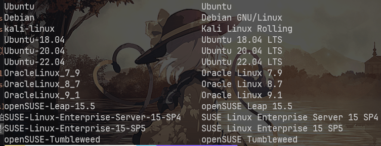

# WSL2 Environment

## 基础环境

虚拟机配置 Linux 环境

可以选择现在比较流行的`Linux`发行版
例如 Ubuntu,Arch 等等,下面我使用`kali`~~我用的环境~~的发行版

虚拟机环境也很多种 例如 VirtualBox,Docker
下面主要用`WSL 2`~~我用的环境~~为主
### WSL 2(安装麻烦,但是用起来简单)

**Windows 10 以上且有系统要求且对访问`微软商店(Microsoft Store)`有需求**

-   Windows10 版本要求
    Windows 10 2020 年 5 月(2004) 版, Windows 10 2019 年 5 月(1903) 版，或者 Windows 10 2019 年 11 月(1909) 版
-   Windows11 无要求

#### 前置

安装[Windows Terminal](https://apps.microsoft.com/store/detail/windows-terminal/9N0DX20HK701)
~~相信我 不会有人喜欢顶着蓝窗和黑窗看的 投入 Windows Terminal 的怀抱吧~~

#### 以管理员权限启动`PowerShell`

附:如果你也觉得天天觉得管理权限烦看看[这个文章](https://www.brokenpoems.xyz/archives/94/)
可以按 Win+X

-   启用 WSL

    ```shell
    dism.exe /online /enable-feature /featurename:Microsoft-Windows-Subsystem-Linux /all /norestart
    ```

-   启用虚拟机平台(Hyper-V)

    ```
    Windows 10(2004): dism.exe /online /enable-feature /featurename:VirtualMachinePlatform /all /norestart
    Windows 10(1903，1909): Enable-WindowsOptionalFeature -Online -FeatureName VirtualMachinePlatform -NoRestart
    ```

-   设置 wsl 2 为默认值

    ```shell
    wsl --set-default-version 2
    ```

#### 安装喜欢的 Linux 发行版

WSL 2 提供以下发行版(运行`wsl -l -o`就能看到)

这里选择 Kali 包括下文全部在 kali 环境上安装
`wsl install --install kali-linux`
如果网络不好可以试试加上`--web-download`参数
安装好配置密码就行了

#### apt 等包管理器的配置

如果你能够`珂学上网`那么可以试试使用以下`.bashrc/.zshrc`参数

```bashrc
# network proxy
host_ip=$(cat /etc/resolv.conf |grep "nameserver" |cut -f 2 -d " ")
export ALL_PROXY="http://$host_ip:proxy_port"
export HTTP_PROXY="http://$host_ip:proxy_port"
export HTTPS_PROXY="http://$host_ip:proxy_port"
export http_proxy="http://$host_ip:proxy_port"
export https_proxy="http://$host_ip:proxy_port"
```
其中`proxy_port`记得改为你代理工具的开放的port
如果不行请给 apt 等包管理器换为国内源
参见:[Ubuntu 22.04 换国内源](https://www.cnblogs.com/dier-gaohe/p/17379705.html)
最后输入

```
sudo apt update
sudo apt upgrade
```

wsl 基础环境基本配置完成
想要进入 wsl 只需要`win+r` wsl 或者进入终端在终端输入 wsl 运行

#### 安装`kali-linux-large` 和 `kali-win-kex`

```shell
sudo apt install kali-linux-large
sudo apt install kali-win-kex
```

`kali-linux-large` 是 kali 完整包 很大 不建议在晚上断网时下载
`kali-kex` 是 GUI 连接

附.

-   存储压缩

```shell
wsl --shutdown
diskpart
select vdisk file="%UserProfile%\AppData\Local\Packages\KaliLinux.54290C8133FEE_ey8k8hqnwqnmg\LocalState\ext4.vhdx"
attach vdisk readonly
compact vdisk
detach vdisk
```

-   设置内存大小
    修改 windows 系统 `%UserProfile%`目录下`.wslconfig`

```
memory=4GB
swap=0
```

-   备份&还原

```shell
备份:
wsl --export -d kali-linux [备份存储路径]
还原:
wsl --unregister kali-linux
wsl --import kali-linux [还原位置] [备份文件路径]
```

## 一些 tools

可以通过百度等搜索引擎来查找他们的安装教程

### [anaconda](https://www.anaconda.com/download#Downloads)

建议装上防止需要切换 python 版本或者有包冲突时用

### [pwndbg](https://github.com/pwndbg/pwndbg)

pwn 手必备 装了附带`checksec`和`ROPgadget`

### msfvenom

shellcode 转码 kali 自带
有兴趣可以学下 msf 全家桶

### [AE64](https://github.com/veritas501/ae64)

shellcode 转码

### [LibcSearcher](https://github.com/lieanu/LibcSearcher)


觉得不好用可以 clone 下来自己更新[libc-database](https://github.com/niklasb/libc-database)

### [glibc-all-in-one](https://github.com/matrix1001/glibc-all-in-one)

libc 不兼容时使用 为了找一个兼容能跑起来的 libc

参考链接:
[如何在 Windows 10 上安装 WSL 2](https://zhuanlan.zhihu.com/p/337104547)
[搭建 WSL2 下的 Kali 环境](https://zhuanlan.zhihu.com/p/263658960)

ps:再给一份我自己的`template`:

```python
from pwn import *
from LibcSearcher import *
context(
    terminal=["wt.exe", "wsl"],
    os = "linux",
    arch ='amd64',
    #arch = "i386",
    log_level='debug'
)
elf = ELF('')
io = process('')
#io = remote(,)
def debug():
    gdb.attach(io)
    pause()
#code here


io.interactive()
```
