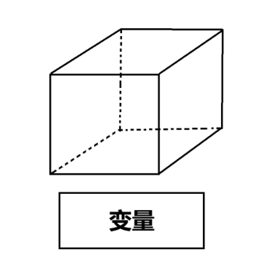
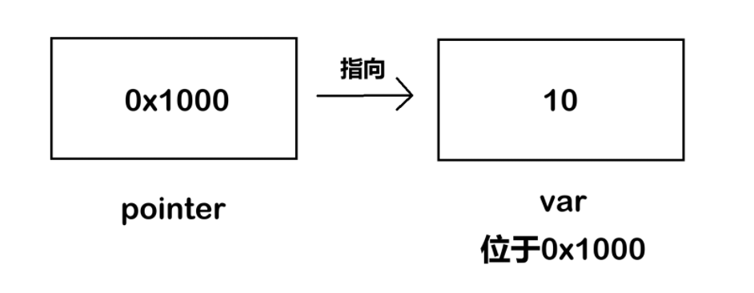
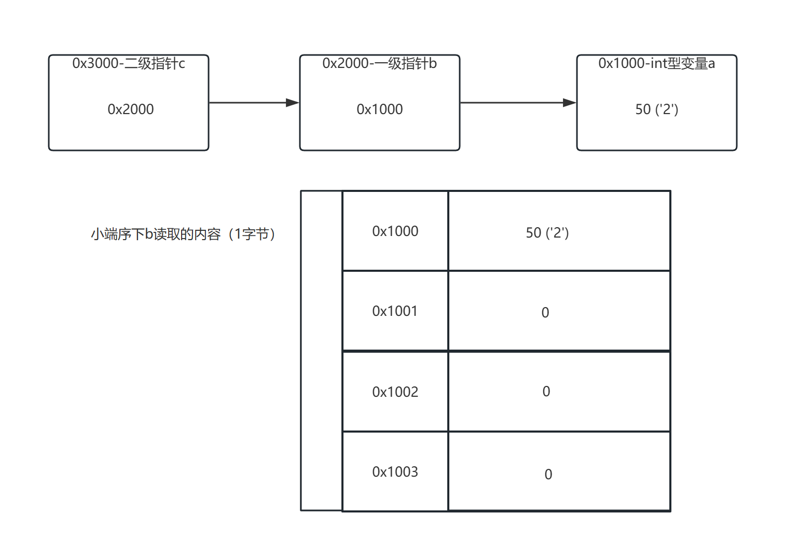
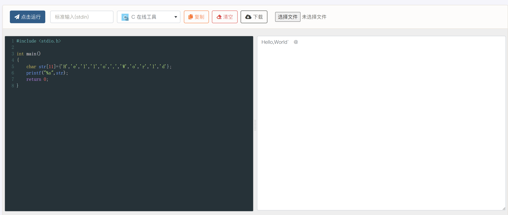
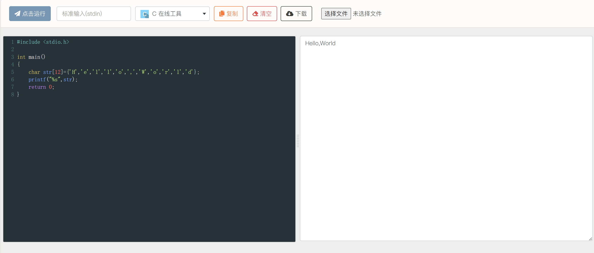

# C 语言基础
!!! Note "免责声明"
    请注意，本文并不是 0 基础 C 语言入门，所讲述的内容可能包含以下要素：  

    - 并不纯粹的 C 语言  
    - 粗糙的知识点讲解  
    - 猫猫莫名其妙的口癖（悲）  
    - 为了新手友好牺牲掉的部分内容的准确性

    如果你想找一个 C 语言入门教程，那你或许应该左转隔壁 MOOC 、 B站大学。  
    或者你也可以查阅网上的教程（比如CSDN，菜鸟教程，W3School还有其他师傅的博客等等）  
    本文所讲的 C 语言基础只是为了让新手师傅能够更好地看懂反汇编代码，因此只会讲解一些逆向过程中常见的内容。

## 为什么要学习 C 语言？

一个最简单的理由就是，因为 IDA 反编译出来的代码都是类 C 的伪代码。  

如果连 IDA 反编译出来的代码都看不懂，又谈何进行逆向工程呢？

同时 C 语言也是一门比较接近底层的语言，有利于我们更好的理解计算机系统的底层原理。

!!! Quote "说白了就是："
    因为要用，所以要学。

## 变量
首先我们先对变量进行介绍。

### 什么是变量？
简单来说，变量就是一个存储数据的盒子，位于计算机存储中的某个地址处：



我们可以向盒子里放入数据，比如 `int i=0;` 就是向一个 `int` 类型的“盒子”变量 `i` 中放入一个整数 `0` 。

根据 **预期中** 盒子存储的数据类型，我们可以对这些“盒子”变量进行分类：

!!! Note "注意"
    这里我们已经简化了部分细节，后续可能会在其他地方进行细节补充。

```c
// 你可以使用 sizeof(变量类型) 来确定变量占用的空间大小

// 有符号整数类型
__int8      // 有符号8位整数  -> signed char（或 char，取决于平台符号性）
__int16     // 有符号16位整数 -> short
__int32     // 有符号32位整数 -> int / (Windows或Linux/macOS 32-bit)long
__int64     // 有符号64位整数 -> long long / (Linux/macOS 64-bit)long

// 无符号整数类型

// 无符号8位整数  -> unsigned char
unsigned __int8
// 无符号16位整数 -> unsigned short
unsigned __int16
// 无符号32位整数 -> unsigned int / (Windows或Linux/macOS 32-bit)unsigned long
unsigned __int32
// 无符号64位整数 -> unsigned long long / (Linux/macOS 64-bit)unsigned long
unsigned __int64

// IDA 简写类型
_BYTE   // 等价于 unsigned __int8   (1字节)
_WORD   // 等价于 unsigned __int16  (2字节)
_DWORD  // 等价于 unsigned __int32  (4字节) (double word)
_QWORD  // 等价于 unsigned __int64  (8字节) (quad word)

// 浮点数类型
float           // 单精度浮点数 (4字节, IEEE 754)
double          // 双精度浮点数 (8字节, IEEE 754)
long double     // 扩展精度浮点数 (实现平台相关)

// 布尔类型
bool  // 1字节布尔值(实际上 C 语言里面是一个展开为 _Bool 的宏，C++ 则将 bool 作为关键字直接内置)
// 但在 C23 标准中，bool 已经正式变成了关键字，无需和以前一样需要 include stdbool.h 了
```

!!! Question "无符号整数和有符号整数有什么区别？"
    区别其实在于，无符号整数里面没有“负数”的概念。  
    有符号整数的最高二进制位是用来表示符号的，而无符号整数就是把符号位也用来表示数字了。  
    换句话说，在非负且不超出无符号范围的情况下，他们在内存中存储的数据是一样的。  
    这也就是为什么(unsigned int)-1的结果非常巨大。

同时，不同类型的数据之间可以相互转换，但这一过程有时候并不是完全无损的。

在多种类型的数据进行运算时，C 语言默认会将精度较低的数据类型转换为精度较高的数据类型，这一过程称之为隐式转换。

我们也可以强制转换数据类型，这一过程称之为显式转换：
```c
char c = 'A';
printf("%d",(int)c); //65, 字符 A 的 ASCII 码
```

!!! Question "什么是 ASCII 码？"
    ASCII 码，又称美国信息交换标准代码(American Standard Code for Information Interchange)，是基于拉丁字母的一套电脑编码系统。  
    它主要用于显示现代英语，而其扩展版本延伸美国标准信息交换码则可以部分支持其他西欧语言，并等同于国际标准ISO/IEC 646。   
    在目前的计算机中，常见的一些字符（比如'A','0',' '(空格),'a'）都是以 ASCII 码的形式存储在计算机中。  
    你可以在这里找到 ASCII 码表：[菜鸟教程-ASCII码表](https://www.runoob.com/w3cnote/ascii.html)  
    一个记忆的口诀是：**32 48 64 96**  
    其中 32 是空格的 ASCII 码，48 + 数字 是对应数字字符的 ASCII 码。  
    然后 64 + 字母表索引 是对应的大写字母，96 + 字母表索引 是对应的小写字母。  
    比如 'A' 的 ASCII 码就是 65(64+1)，'B' 的是 66(64+2)，'a' 的是 97(96+1)，'0' 的是 48(48+0)，'9' 的是 57(48+9)。

### 更进一步：指针
在 C 语言教学中，指针一直被认为是一个 **教学难点**。

但其实，指针（全称指针变量）本身也是一个变量，只不过他存储的数据类型是地址而已。

比如下面这个 C 程序片段：
```c
int var = 10; // 假如变量 var 的首地址是 0x1000
int* pointer = &var; // pointer 的内容就是 0x1000
printf("%d",*pointer); // 等效于访问var，所以这里输出10
```
其中 `&` 这里是获取变量 `var` 的 **首地址** ， `*` 则是有2种含义：

- `int*` 中的 `*` ：表示这是一个 **指向** `int` 类型变量的指针变量。  
- `*pointer` 中的 `*` ：将 `pointer` 中的数据当成 `int` 类型变量的地址进行解析，这里相当于访问了 `var` 。

这里 `int* pointer` 写成 `int *pointer` 效果是一样的。



接下来我们提升一下难度，你可以阅读下面这个 C 程序片段，判断程序最终会输出什么：

```c
int a = 0b00110010; //新版本 C 标准支持
char *b = (char *)&a; // 将 int* 类型指针强制转换为 char*
char **c = &b;
printf("%c",**c);
```

首先理解一下这个程序在干什么：

- 首先定义了 `int` 变量 `a` 并初始化为 `50`  
- 之后创建了一个 **指向** `char` 类型的指针 `b` ，指向了……？

??? Question "为什么指针类型和变量类型不同还能运行？"
    还记得前面所说的，取地址符取到的永远是首地址吗？  
    我们在前面强调过，指针的类型只会影响其解析地址的逻辑。  
    这里的 `char` 类型指针只是告诉编译器，这个地方应该只从我存的这个地址开始，解析 `sizeof(char) = 1` 个字节。  
    也就是其访问变量 `a` 时，取出了其第一个字节的内容并解析。（相当于解析了一个 `char`）  
    假设系统为 **小端序** ，这里第一个字节就是前面提到的 `50` 。  
    说白了就是，存储数据的盒子还是这么大，能放下一个地址，但是盒子的类型不同，解释地址的方式也不同。

- 之后有一个 **二级指针** `c` 指向了 `char*` 类型变量 `b` 的地址
- 最后解析 `char**` 指针 `c` ，并将解析结果作为字符输出

如果系统是 **64位小端序** ，首先 `**c` 可以表示成 `*(*c)` ，内层就是从 `char*` 变量 `b` 的首地址开始，读取 `sizeof(char*) = 8` 个字节。  

然后再在外层从 `int` 变量 `a` 的首地址开始，读取 `sizeof(char) = 1` 个字节，最终读取到了 `50` 。

在被 `%c` 隐式转换为 `char` 类型后，对应的字符就是 '2' ，所以程序最终会输出 `2` 。



### 连续空间：数组
当我们需要存储大量数据的时候，一个个申请变量就显得太慢了。

在 C 语言中，我们可以使用以下办法申请一大批“盒子”：
```c
int boxs[10]; // 申请 10 个 int 类型的盒子，分别编号为box[0],box[1],...,box[9]
// 注意 sizeof(boxs) = 40 ，这里计算的是盒子占用的空间(10 个 int 类型的盒子)
```
其中，方括号 `[]` 里的数字代表申请盒子的数目，这便是我们所提到的 **数组** 。

每个盒子的使用方法还是和前面所讲的内容相同，只是多了一些新的访问方式。

这里我们介绍一下数组名的特殊性：
```c
int boxs[10];
boxs[0] = 1;
boxs[1] = 2;
boxs[2] = 3;
printf("%d %d %d",*boxs,boxs[1],*(boxs+2)); // 程序将会输出1 2 3
```
发现了吗，这里的数组名似乎可以当指针用？

实际上，这里的 **下标运算符** `[]` 就等价于使用数组偏移进行访问，如 `boxs[i]` 等价于 `*(boxs + i)` 。

只不过，数组名和指针变量最大的区别：数组名指向的地址 **永远** 都是数组中第 0 个元素的地址，也就是说数组名是个 **指针常量** 。

!!! Note "关于指针加法"
    这里我们简化了部分内容，这里的加法是 C 语言标准定义的指针算术，其步长由指针所指向类型的大小决定。  
    如果对这方面感兴趣的话，可以搜索一下相关资料，但是这里能理解这么写是什么意思就好。  
    顺带一提，在 IDA 的反汇编结果中，很多时候我们都能看到类似于 `*(&v1+v2)` 的描述。  
    这里其实就代表了 `v1` 是个数组，只不过 IDA 没有正确识别这种模式，需要你进行手动修正。  
    我们会在后续介绍 IDA 使用时对这一点进行补充。

## C 字符串
接下来我们需要介绍的是 C 语言中的字符串。
### 字符串 or 字符数组
我们在下面给出了两个 C 语言片段：
```c
// 片段 1
char str[11]={'H','e','l','l','o',',','W','o','r','l','d'};
printf("%s",str);
```
```c
// 片段 2
char str[12]={'H','e','l','l','o',',','W','o','r','l','d'};
printf("%s",str);
```
是不是觉得两个程序片段都会输出“Hello,World”？如果读者在自己的电脑上运行的话 **可能** 确实如此。

现在的问题是，这两个 `char` 数组是否都是存储了一个 C 字符串的数组？

答案是否定的，只有片段 2 里面存储的是一个字符串，而片段 1 里其实是一个普通的字符数组。

两个程序的运行结果如下：




为什么会出现不同的结果？这里是因为 C 语言中定义的字符串是：使用 **空字符** `\0` 结尾的一维字符数组。

空字符（Null character）又称结束符，缩写 `NUL` ，是一个 ASCII 码为 `0` 的控制字符，`\0` 是转义字符，意思是告诉编译器，这不是字符 `0` ，而是空字符。

我们可以注意到，片段 2 的数组大小比片段 1 的数组大小大了 1，而由于传入的 `Hello,World` 只占据了 11 个字节，第 12 个字节就默认使用 `0` 进行了填充（也就是空字符 `\0`）。

!!! Question "为什么说“读者在自己的电脑上运行可能会得到一样的输出结果”？"
    这里其实是因为，C 语言程序在输出字符串时，一般都是以 `\0` 作为结尾字符的。  
    在片段 1 中，由于我们并没有在末尾添加 `\0`，所以程序在解析字符串时就会超出我们设定的范围，也就是所谓的“数组越界”。  
    在这个案例中，在数组之后的数值一般是未知的，取决于操作系统当时的环境。  
    特别的，如果数组之后的第一个字节恰好就是 `0x00`，那么字符串也会恰好停止，因为程序觉得自己找到了 `\0` ，字符串就输出完成了。

!!! Danger "不要总指望操作系统和编译器给你的程序兜底"
    数组越界后的实现是不明确的，如果你不缺那两个空间的话，多开几个变量是好文明zwz  
    不过现代计算机谁会缺这两个变量空间？

换言之，下面的数组也存储了 C 字符串：
```c
char str[6] = {65,112,112,108,101,0}; // ASCII 码
char str2[] = "Banana"; // 等效于 char str2[7] = "Banana";
printf("%s\n",str); // 输出 Apple(换行)
printf("%s\n",str2); // 输出 Banana(换行)
printf("%s",str2 + 1); // 输出 anana
```

### 字符串函数
在逆向工程的题目中，我们的程序中一般不只会存储一个字符串，而且还会对字符串进行一些操作。  

这里我们来介绍一些比较常用的字符串相关的函数。
#### strcmp
首先是 `strcmp` 和他的变式 `strncmp` ，可以理解为 `string compare` 字符串比较函数。

这类函数的用途就是比较两个字符串是否相同，如果两个字符串相同则返回 `0` (无差异)，不同时返回的是正数或负数（表示字典序大小关系）。  

而 `strncmp` 和 `strcmp` 唯一的区别就是，他只会比较前 `n` 个字符的内容是否相同，如果相同则返回 `0` 。

下面是一个常见结构：
```c
if(!strcmp(Str1,"HelloCTF{example_flag}")){
    printf("You Got it!");
}
else{
    printf("Try again!");
}
```
#### strcpy
接下来是 `strcpy` 和他的变式 `strncpy`，可以理解为 `string copy` 字符串复制函数。

这类函数主要用于将字符串在不同的数组之间复制，方便进行一些额外处理。

而 `strncpy` 和 `strcpy` 唯一的区别就是：`strncpy` 可以控制复制的字节数，也就是实现“部分复制”。

下面是一个例子：
```c
char origin[]="HelloCTF{Strcpy_Flag}";
char Str1[100];
strcpy(Str1,origin);
printf("%s",Str1); // 输出 HelloCTF{Strcpy_Flag}
```
#### strlen
下面是 `strlen` ，也就是 `string length` 计算字符串长度。

这个函数的返回值是 `size_t` 类型(一个平台相关的无符号整数类型)，即字符串的长度。

在主流的 32 位平台上， `size_t` 的空间占用为 4 字节，而在 64 位平台上则是 8 字节。

以下是一个例子：
```c
char Str[10]="Apple";
int len=strlen(Str); // 这里存在一个隐式转换，下同
int plen=strlen(Str+2);
printf("%d %d",len,plen); //输出 5 3
```
不同系统和编译器对 `strlen` 的实现不尽相同，但核心都是通过末尾的 `\0` 计算长度。

## 总结
虽然这里对 C 语言的一些基础语法进行了整理，但是如果想要写好逆向工程的题目的话，最好还是去系统的学习一下 C 语言。  

不过，我们的目标主要还是阅读和编写一些简单的(伪) C 语言代码，所以读者并不需要将 C 语言学到完全精通。

!!! Quote "猫猫の碎碎念"
    唉唉，虽然已经尽可能减少篇幅了，但还是难免出现一种“越往后写发现自己要讲的东西越多”的感觉。  
    只能说，学好一门语言有时候确实很重要叭\~  
    加油哦，各位RE手们，你们的旅程即将正式开始nwn\~  
    如果有什么不认识的函数或用法，记得去搜索引擎查一查哦\~