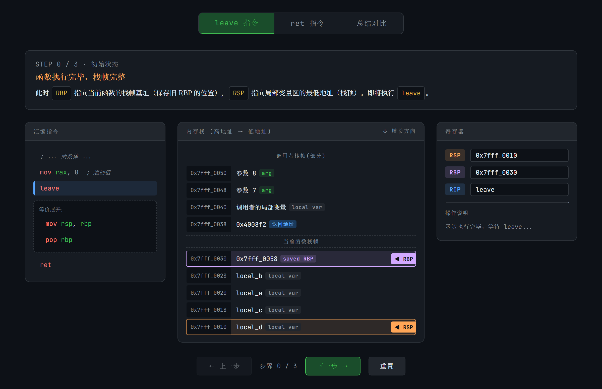
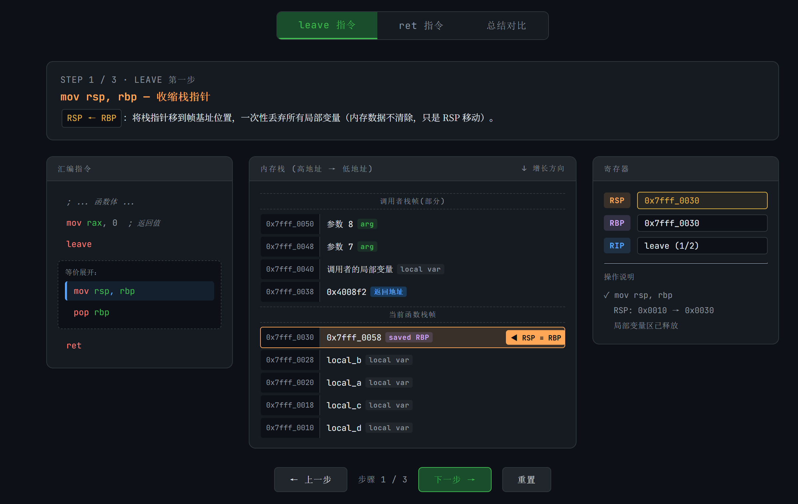
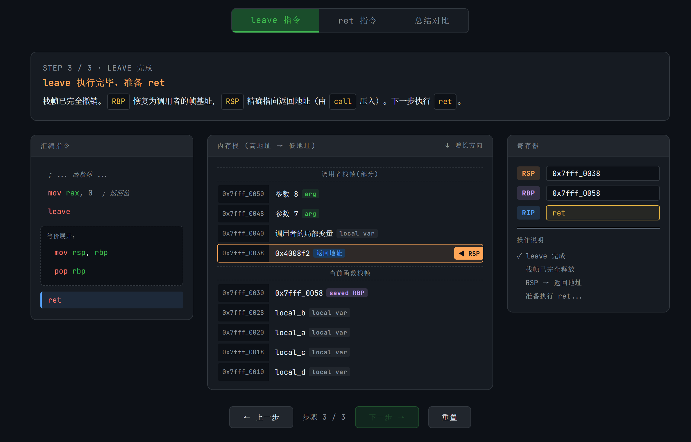
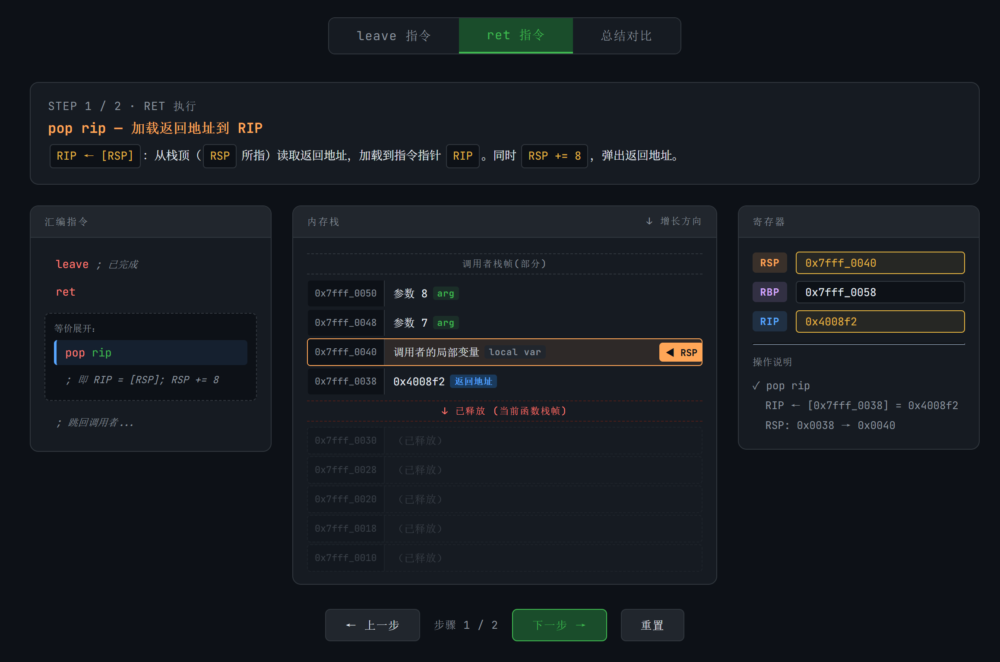
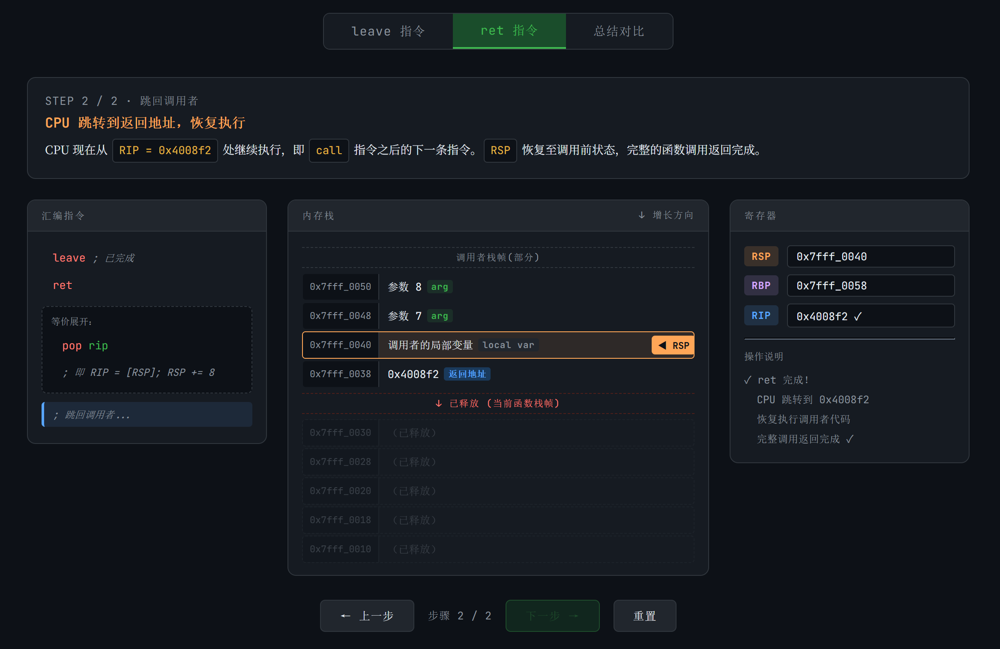

## Quick Start：汇编语言

本章节将会简单介绍一下汇编语言，汇编语言在逆向工程中占据的地位还是比较重要的。此章节并不会系统地去介绍整个汇编语言体系，而是以 CTF 逆向 为背景，介绍比较实用的部分。

!!! Note "如没有明确指出，本文采用的统一为x86汇编中的Intel风格"
    在x86汇编中除了Intel风格之外，还有一种风格叫做“AT&T风格”，最明显的一个区分特征就是AT&T风格下的寄存器前有`%`，立即数前有`$`。  
    同时AT&T风格的指令是从前往后读的（即`助记符 源,目的`），和Intel风格不同，注意区分。  
    (比如AT&T风格下`movl %eax,%ebx`是将`%eax`的值赋给`%ebx`)

------

### 前置知识：寄存器

为了方便读者理解下面的内容，猫猫决定先讲一下寄存器：

寄存器是中央处理器（CPU）内部的高速存储单元，用于临时存放指令、数据或地址。与内存相比，寄存器的访问速度极快，但数量有限（通常只有十几个到几十个）。在汇编语言中，寄存器通过名称直接引用（如 RAX、RBX 等）。  

寄存器主要用于存储操作数，保存地址，暂存中间结果，控制程序状态等等……  

看起来和高级语言里面“变量”的概念很像对吧？

以下表格展示了以 RAX 为例的寄存器嵌套关系，包含其各部分拆分：

| 寄存器 | 位宽   | 说明                                           |
|--------|--------|------------------------------------------------|
| RAX    | 64位   | 64位模式下的完整累加器寄存器                   |
| EAX    | 32位   | RAX 的低32位                                   |
| AX     | 16位   | EAX 的低16位                                   |
| AH     | 8位    | AX 的高8位（对应 EAX 的位 15-8）               |
| AL     | 8位    | AX 的低8位（对应 EAX 的位 7-0）                |

**说明：**  

- RAX 是 64 位寄存器，可用于存放 64 位数据或地址。  
- EAX 是 RAX 的低 32 位，常用于 32 位操作。  
- AX 是 EAX 的低 16 位，常用于 16 位操作。  
- AH 和 AL 是 AX 的高、低 8 位，分别用于 8 位操作。修改 AH 会影响 AX 的高字节，但不会影响 AL，反之亦然。  

这种分层设计允许程序灵活访问寄存器的不同部分，兼容 8/16/32/64 位操作。

------

### 你好，汇编

下面我们以一个简单的 Hello World 程序为背景，初步介绍汇编：

```c
#include <stdio.h>
int main(int argc, char* argv []) {
    printf("Hello, world!\n");
    return 0;
 }
```

我们通过 GCC 将以上程序编译为 ASM 形式并输出，可以得到以下内容：

```assembly
01      .section .rodata
02  .LC0:
03      .string "Hello, world!"
04      .text
05      .globl   main
06      .type    main, @function
07  main:
08      push     rbp
09      mov      rbp, rsp
10      sub      rsp, 16
11      mov      DWORD PTR [rbp-4], edi
12      mov      QWORD PTR [rbp-16], rsi
13      mov      edi, OFFSET FLAT:.LC0
14      call     puts
15      mov      eax, 0
16      leave
17      ret
```

这是一个很简单的执行过程，下面我们来简单的介绍一下这块汇编：

首先 `.LC0:` 定义了一个字符串，也即我们的 `“Hello, world!”`，它的作用就是告诉编译器这个字符串的位置（地址）。这种字符串字面量会被编译器放入 `.rodata` 只读数据段，在程序整个运行期间都存在。

下面就是 `main` 函数的汇编块了：

从第 8 行到第 12 行，进行的操作就是初始化堆栈，其中 8 ～ 10 行是为这个函数执行开辟适合的内存区域， 11 ～ 12 行是把参数保存到局部变量区域。

这里面提到的 `rbp，rsp，edi` 等都是寄存器，它们负责储存数据。

从第 13 行开始就进入了主要执行段：通过 `mov` 指令将字符串的 **首地址** 赋值给 `edi`，作为接下来 `call` 的函数的第一个参数，之后传参完毕，通过 `call` 指令调用 `printf` 函数（这里其实编译器进行了优化，因为 `printf` 只是输出固定字符串且带换行，编译器会优化为调用 `puts`（`puts` 会自动追加换行），因此字符串字面量本身不包含 `\n` ），输出字符串到屏幕；接着将 `eax` 赋值为 0，这里 `eax` 一般作为函数的返回值；之后 `leave` 然后 `ret` 返回，该函数就执行完毕了。

!!! Question "为什么传入字符串地址时赋值的是`edi`而不是`rdi`？"
    其实原因很简单：在这里，字符串的首地址是一个 32 位立即数。   
    在 x86-64 架构下，向 32 位寄存器 `edi` 写入数值时，CPU 会自动将对应的高 32 位（即 `RDI[63:32]`）清零。  
    因此，这里的操作`mov edi, OFFSET FLAT:.LC0`等价于是向 `rdi` 赋值。  
    这是 `x86-64` 的特性：写入 32 位寄存器会清零高 32 位，而写入 16 位或 8 位寄存器不会影响高位。  
    需要注意的是，这条规则只适用于 64 位模式下的程序；  
    在 32 位程序中不存在高 32 位，因此不会出现自动清零的现象。


在这个过程中，我们可以看到一些常见的汇编指令：`mov、sub、call、ret` 等，下面来说说它们的作用：  

- `mov` 是赋值指令，它的格式为 `mov 目标, 源`；  
- `sub` 是减法指令，其格式为 `sub 目标, 减去的值`；  
- `call` 为调用指令，其格式为 `call 要调用的函数地址`；  
- `ret` 和 `leave` 连用是函数返回时的指令序列，其中 `leave` 用于恢复堆栈框架，`ret` 用于返回调用点。需要注意的是，`leave` 指令一般会和 `ret` 配合使用以正确结束函数。   

为了方便读者理解 `ret` 和 `leave` 是如何合作的，这里猫猫将 `leave` 和 `ret` 等价展开，并简单生成了一个基于Linux x86-64的演示动画。

其中 `leave` 等价于 `mov rsp, rbp` 和 `pop rbp` ，用于恢复调用前的栈帧；而 `ret` 等价于 `pop rip`：









!!! Note "其实`pop rip`的写法不太严谨喵……"
    严格来说，x86-64 架构中 `rip` 不能作为 `pop` 的显式操作数，`pop rip` 并不是一条合法的汇编指令。  
    `ret` 是专门的控制流指令，而不是 `pop` 的语法变体。
    实际上这里的底层行为是：
    ```asm
    rip ← [rsp]
    rsp ← rsp + 8
    ```

    不过嘛，为了方便理解咱们就不纠结这些小瑕疵啦\~  


------

### 前置知识：标志位
在正式讲解汇编指令之前，猫猫觉得有必要介绍一下什么是标志位，不然很多读者读到后面可能就会迷糊啦\~  

这里我们以 x86 架构为例：

在 x86 汇编语言中， **标志寄存器** （EFLAGS Register, 又名程序状态字 Program Status Word）用于存储指令执行结果的状态信息和控制处理器的工作模式。

其中，各个二进制位被称为 **标志位** ，每个标志位有特定的含义。

根据功能，标志位可分为 **状态标志**（反映算术/逻辑运算结果）和 **控制标志**（控制处理器操作）。

<div align="center"><strong>常见标志位及其含义</strong></div>

| 标志位 | 名称            | 含义与置位条件                                                                 |
|--------|-----------------|--------------------------------------------------------------------------------|
| CF     | 进位标志         | 无符号数运算结果超出范围时置1，例如加法产生进位或减法产生借位。                |
| PF     | 奇偶标志         | 运算结果低8位中“1”的个数为偶数时置1，否则置0。常用于数据校验。                |
| AF     | 辅助进位标志     | 用于BCD码运算，表示低4位是否向高4位进位或借位。                                |
| ZF     | 零标志           | 运算结果为0时置1，否则置0。                                                    |
| SF     | 符号标志         | 运算结果的最高位（符号位）为1时置1，表示负数（对于有符号数）。                 |
| TF     | 陷阱标志         | 当置1时，处理器进入单步调试模式，每执行一条指令产生一次调试异常。              |
| IF     | 中断允许标志     | 置1时允许可屏蔽中断响应，置0时禁止。                                           |
| DF     | 方向标志         | 控制字符串操作指令的地址变化方向：DF=0时地址递增，DF=1时地址递减。             |
| OF     | 溢出标志         | 有符号数运算结果超出机器所能表示的范围时置1，例如正+正得负或负+负得正。        |

**说明：**  

- 状态标志（CF、PF、AF、ZF、SF、OF）通常由算术逻辑指令自动更新。  
- 控制标志（如DF、IF、TF）可通过专用指令（如STD、CLD、STI、CLI）修改。  
- 不同处理器（如x86-64）可能增加或调整部分标志位，但上述标志位是基本且通用的。

以上表格涵盖了主要的标志位，理解它们对于调试底层程序和掌握汇编语言至关重要。

------
### 常见汇编指令

介绍完标志位并了解了一些基本的汇编指令后，下面我们来看看 CTF 中常见的一些指令：

#### `loop` 循环指令

以 `x86-64` 为例（使用 `rcx`）：

```assembly
mov rax,0
mov rcx,236
s:
add rax,123
loop s
leave
ret
```

上面的指令执行的是对 123 累加 236 次，从上面的代码中我们可以看到，`rcx` 寄存器保存的是循环次数，每次遇到 `loop` 指令时，`loop` 会先将  `rcx` 的数值减少 1，之后如果 `rcx` 依旧不为0，则跳转到对应的标签处（这里是`s`）；当其数值减少到 0 时，`loop` 指令就会停止跳转，继续执行下面的指令。

顺带一提，`loop` 不依赖标志位哦~

!!! Quote "猫猫の碎碎念"
    老实说，loop指令在现代编译器中几乎不会生成惹……不过了解一下总归是好的，万一以后用到了捏\~？

#### 无条件跳转

```assembly
label:
mov edx,0

jmp label
```

无条件跳转指令为 `jmp`，其意思从字面上就可以看出来，只要是执行到 `jmp` 这里，无论什么情况，都会直接跳转到 `label` 的代码块中继续往下执行指令。

#### 条件跳转

```assembly
label:
mov ebx,1

cmp ebx,0
je label
```

以上代码将 `ebx` 的值与 `0` 对比(`cmp`的比较方法是左减右的“作差法”，但不会修改`ebx`中的数值，只会影响标志位)，如果相等，则会跳转到 `label` 处，条件跳转指令 `je` 代表相等则跳转，还有其他与之条件不一样的条件跳转指令，一般条件跳转指令是与 `cmp`、`test` 指令混在一起用的。以上代码也可以用 `test` 来写：

```assembly
label:
mov ebx,1

test ebx,ebx
jz label
```

`test` 是 **仅影响标志位** 的按位与指令，在本例中 `test` 等价于计算 `ebx & ebx`，并根据计算结果更新标志位。

在本例中，我们关心的是 ZF 标志位，当计算结果为0时该标志位将被 **置1** 。

而 `jz` 语句表示当 ZF 标志位为 1 时就跳转到`label`，在本例中的实现效果与 `cmp` 相同。

下面是一些常见的条件跳转指令：

| 指令 | 别名 | 英语全称 | 跳转条件 （标志位） | 含义 |
|------|------|----------|--------------------|------|
| `JE` | `JZ` | Jump if Equal / Jump if Zero | ZF = 1 | 等于 / 结果为零 |
| `JNE` | `JNZ` | Jump if Not Equal / Jump if Not Zero | ZF = 0 | 不等于 / 结果不为零 |
| `JS` | — | Jump if Sign | SF = 1 | 结果为负 |
| `JNS` | — | Jump if Not Sign | SF = 0 | 结果为正或零 |
| `JP` | `JPE` | Jump if Parity / Jump if Parity Even | PF = 1 | 奇偶位为偶 |
| `JNP` | `JPO` | Jump if Not Parity / Jump if Parity Odd | PF = 0 | 奇偶位为奇 |
| `JO` | — | Jump if Overflow | OF = 1 | 有符号溢出 |
| `JNO` | — | Jump if Not Overflow | OF = 0 | 无溢出 |
| `JC` | `JB` / `JNAE` | Jump if Carry / Jump if Below / Jump if Not Above or Equal | CF = 1 | 进位 / 无符号小于 |
| `JNC` | `JAE` / `JNB` | Jump if Not Carry / Jump if Above or Equal / Jump if Not Below | CF = 0 | 无进位 / 无符号大于等于 |
| `JBE` | `JNA` | Jump if Below or Equal / Jump if Not Above | CF = 1 或 ZF = 1 | 无符号小于等于 |
| `JA` | `JNBE` | Jump if Above / Jump if Not Below or Equal | CF = 0 且 ZF = 0 | 无符号大于 |
| `JL` | `JNGE` | Jump if Less / Jump if Not Greater or Equal | SF ≠ OF | 有符号小于 |
| `JGE` | `JNL` | Jump if Greater or Equal / Jump if Not Less | SF = OF | 有符号大于等于 |
| `JLE` | `JNG` | Jump if Less or Equal / Jump if Not Greater | ZF = 1 或 SF ≠ OF | 有符号小于等于 |
| `JG` | `JNLE` | Jump if Greater / Jump if Not Less or Equal | ZF = 0 且 SF = OF | 有符号大于 |

#### 位运算

下面是一些常见的位运算指令：

| 指令 | 示例 | 操作 | 结果保存 | 含义 |
|------|------|------|----------|------|
| `AND` | `AND AX, BX` | AX = AX & BX，并设置标志位 | 是，存入目标操作数 | 按位与运算 |
| `OR` | `OR AX, BX` | AX = AX \| BX，并设置标志位 | 是，存入目标操作数 | 按位或运算 |
| `XOR` | `XOR AX, BX` | AX = AX ^ BX，并设置标志位 | 是，存入目标操作数 | 按位异或运算 |
| `NOT` | `NOT CX` | CX = ~CX | 是，存入目标操作数 | 按位取反（不影响标志位） |
| `TEST` | `TEST AX, BX` | AX & BX，并设置标志位 | 否，结果丢弃 | 按位与运算（仅影响标志位） |

特别的，`AND`、`OR`、`XOR` 执行后会将 `CF` 和 `OF` 清零，而其他的寄存器（如`SF`、`ZF`、`PF`）则会根据结果更新。  

!!! Question "话说逻辑运算后为什么会把 `AF` 设为 `undefined`？"
    由于逻辑运算不涉及加减法的半字节进位，因此 AF 在这些指令后被定义为未定义状态，程序不应依赖其值。

#### `lea` 整数计算

其使用格式为：`lea rdx,[my_var]`，将 `my_var` 的 **地址** 赋值给 `rdx` 寄存器。

需要注意的是，`lea` 不会访问内存，也不会读取 `[my_var]` 中的内容，它只是把“地址这个数值”放入寄存器，等价于：`rdx = &my_var;`。

在实际使用中，`lea` 常被用于计算地址偏移，例如 `lea rax, [rbx + rcx*4 + 8]`，这条指令的真实含义是：`rax = rbx + rcx*4 + 8`。这里的 `[rbx + rcx*4 + 8]` 只是使用了 x86 的寻址格式 `[base + index*scale + displacement]` 来进行整数运算，并不会去访问该地址所指向的内存内容。

对比来看，`mov rax, [rbx + rcx*4 + 8]` 的含义是：`rax = *(rbx + rcx*4 + 8)`，即先计算地址，再访问内存读取数据；

而 `lea` 仅计算表达式本身，不发生解引用。

正因如此，`lea` 有时也被编译器当作一种“廉价的算术指令”来使用——它可以在一条指令内完成乘法（`scale=1/2/4/8`）、加法与常数偏移的组合运算，同时不影响任何标志位。例如 `lea rax, [rbx + rbx*4]` 等价于计算 `rbx * 5`。

因此，看到 `lea rax, [表达式]` 时，应理解为：`rax = 表达式的计算结果`。

#### `xchg` 数值交换

其使用格式为 `xchg ax,bx` 将 `ax` 和 `bx` 的数值交换。


### 关于函数传参

在汇编中，我们有时候需要知道参数被保存在哪个寄存器里，这里以常见的两种调用约定为例：

整数或指针类型的返回值通常保存在 `rax` 中（32 位时为 `eax`）。

**System V AMD64 ABI**（Linux / macOS 下 GCC/Clang 默认使用）：
函数参数按从左到右的顺序保存在 `rdi`、`rsi`、`rdx`、`rcx`、`r8`、`r9` 中，超出部分通过栈传递。

**Windows x64 调用约定**：
函数参数按从左到右的顺序保存在 `rcx`、`rdx`、`r8`、`r9` 中，超出部分通过栈传递。  

同时，Windows x64 要求调用者预留 32 字节的 `shadow space` ，即使函数没有用到这 4 个参数，也必须预留。

有时候根据函数调用约定以及编译器和平台的不同，这个储存规律也会发生改变，我们需要根据当时情况动态调整。