# 从零开始的IDA

!!! Tips "本文为重构版本"
    因为猫猫觉得以前的那篇《从零开始的IDA》讲的过于粗糙，于是决定对这篇教程进行重构。  
    以前的编写者们为此付出了许多心血，所以猫猫重构时保留了原始md文档，  
    如果读者感兴趣的话，可以前往Hello-CTF的仓库查看[原文](https://github.com/ProbiusOfficial/Hello-CTF/blob/main/docs/hc-reverse/%E4%BB%8E%E9%9B%B6%E5%BC%80%E5%A7%8B%E7%9A%84IDA.md)。  
    感谢各位创作者们的付出！

!!! Tips "写在前面"
    本文为新手向教程，内容主要基于未优化或优化较低的简单程序，在这类情况下 IDA 的反编译结果通常较为直观；  
    但在复杂或经过混淆的程序中，这些方法 **可能不再完全适用** 。  
    本文主要讲解如何使用 IDA Pro 进行基础逆向分析，因此不会深入介绍其全部功能。  
    感兴趣的读者可以在掌握基本使用后，再进一步学习 IDA 的高级功能及快捷键。  
    为了降低初学门槛，除常用快捷键外，本文不会涉及过多操作细节。  
    希望读者在阅读过程中能够跟随教程完成题目复现，相关题目可在 [这里](https://gz.imxbt.cn/games/13) 获取。

既然要上战场了，拥有一把趁手的“兵器”很重要，这里我们介绍一款著名逆向工具：IDA Pro。


## 什么是 IDA
IDA Pro（全称 Interactive Disassembler Professional，通常简称为 IDA）是 Hex-Rays 公司开发的一款强大的逆向工具，集反汇编、反编译和调试于一体。

它的反汇编器支持多种处理器架构和文件格式，在嵌入式系统、移动应用以及常规软件的静态分析中表现出色。对于未经过强混淆或复杂保护的二进制程序，IDA 通常能够生成结构较为清晰、可读性较好的分析结果；但在面对复杂混淆或加壳程序时，其分析能力可能受到限制，往往需要结合动态调试等手段进行进一步分析。

此外，IDA Pro 也提供了内置调试功能，支持本地与远程调试以及多种调试目标。不过在实际逆向分析中，通常会与专用调试器（如 x64dbg、GDB）配合使用，以获得更灵活和稳定的调试体验。

!!! Info "请注意你的IDA Pro版本……"
    根据Hex-Rays的发行公告，IDA Pro已经在8.3版本中弃用了IDA(32-bit)，并在9.0版本中正式将两个IDA可执行程序合并为一个，这意味着最新版本的 IDA Pro 中我们已经不会再看到存在两个 IDA 可执行程序了。  
    但这并不意味着我们从此不再能反编译32-bit/64-bit程序了，相反，现在的IDA Pro已经同时兼容了这两个版本！  
    “我们在几个版本前就弃用了IDA32。在IDA 9.0中，只需一个IDA二进制即可处理32位和64位代码。”  
    “将遗留IDB转换为I64文件格式是透明的，由IDA自动执行。”

## IDA 的基本操作
想要使用 IDA ，我们需要学习一点基本操作。  

请先下载BaseCTF 2024新生赛题目《You are good at IDA》的 [附件](https://download.imxbt.cn/ctf/Basectf2024/Reverse/You%20are%20good%20at%20ida.zip) ，解压后拖动到 IDA Pro 上打开。

前期我们基本不需要修改什么内容，保持默认配置一路 OK/Yes 下去即可。
### 切换汇编视图/图形视图
如果你正确打开了 IDA，你现在看到的应该类似这个界面：

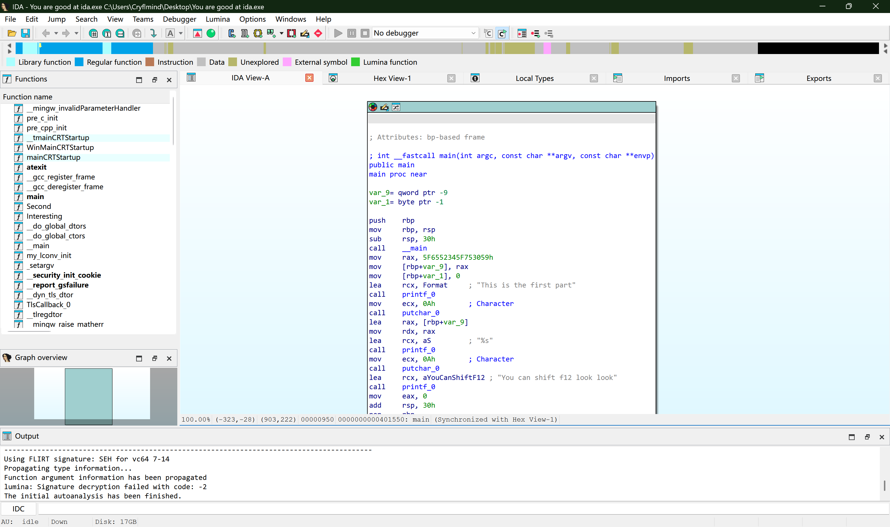

这就是 IDA 的图形视图（Graph View），你可以在这里看到程序各部分汇编块的执行流程。

如果想看完整的汇编，可以按下你的空格键(Space)，IDA 就会从图形视图切换到汇编视图(Text View)：

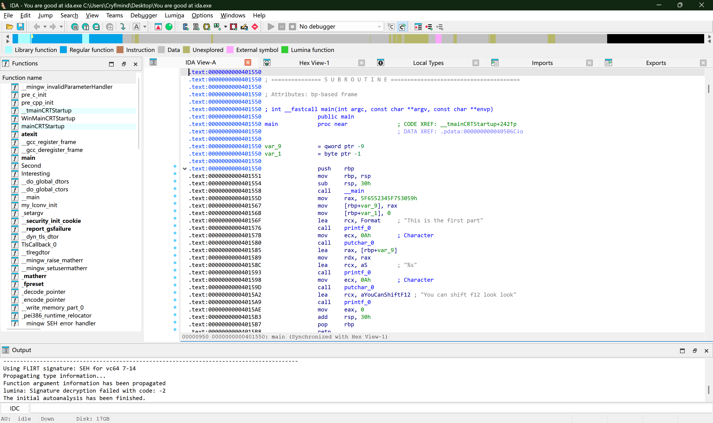

再按一下空格，IDA就会再次返回图形视图，此时上述操作都是在 `IDA View-A` 下进行的。

!!! Quote "你可以尝试多按几下你的空格\~"
    回味一下手感\~（bushi）

### 反编译: 好读的伪代码
如果只阅读汇编的话，看久了难免会有种无力感：你让我看懂这堆东西？

虽然汇编知识后面确实需要掌握，但我们现在有一些更好的选项。

你可以试着按下你的 F5 ，部分笔记本可能需要按住 Fn 再按 F5：

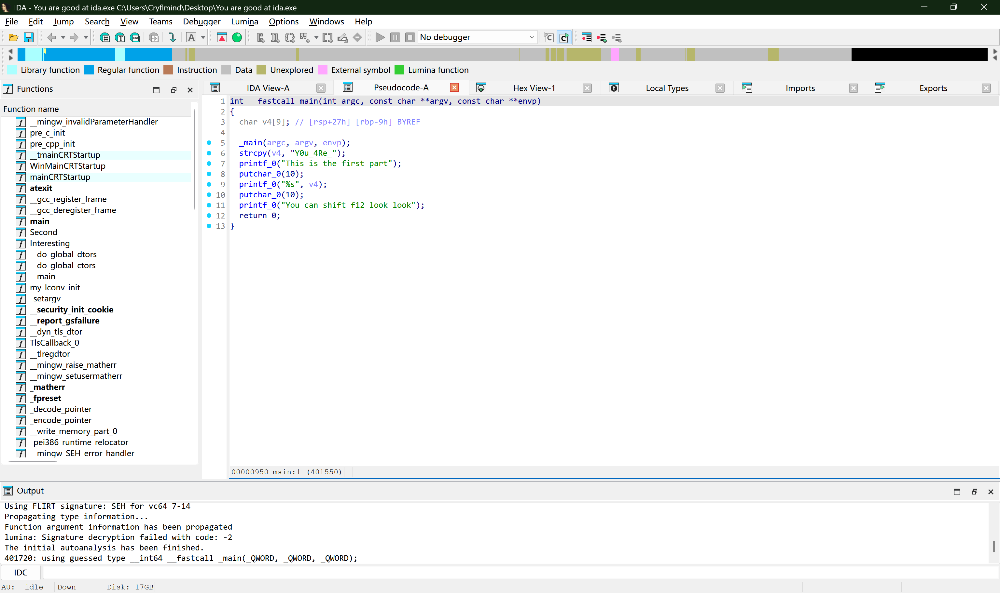

可以看到 IDA 跳转到了 `Pseudocode-A` ，难懂的汇编代码变成了我们相对熟悉一些的 C 风格伪代码。

这就是伪代码视图(Pseudocode View)，IDA 会通过程序的机器码尝试生成接近 C 语言风格的伪代码，但该结果并不等同于原始源码。

我们已经在前面的 C 语言基础教程中介绍过伪代码的阅读了，这里就不多赘述，不过我们可以看到第一部分的flag：`Y0u_4Re_`。

如果你想在伪代码视图和汇编视图/图形视图之间切换的话，只需要按下你的 Tab 即可。

!!! Note "小结"
    目前我们已经学习了以下几个快捷键：  

    - 切换汇编视图/图形视图：空格(Space)  
    - (重新)进行反编译：F5  
    - 在伪代码视图和汇编视图/图形视图之间切换：Tab  
    
    可以多按几次找找手感\~

### Strings：程序中的字符串
如果你能读懂伪代码的话，你应该能知道这个程序提示你使用 Shift + F12 可以查看一些东西。

不妨试一试，可以看到 IDA 来到了一个新的选项卡 `Strings`：

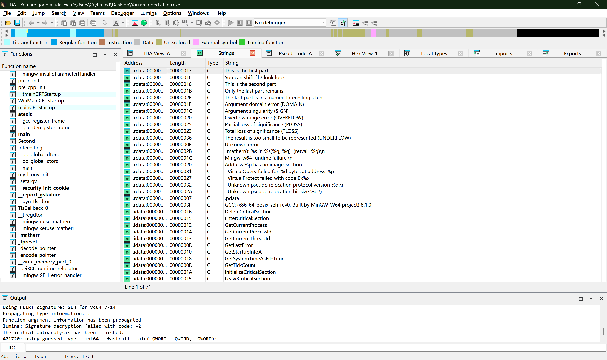

这里展示的是 IDA 在解析程序时 **识别出来的** 所有“疑似字符串”，除了一些编译器留下的字符串以外，我们还能看到一些明显是人手动写进去的东西。

如果想要查看某个字符串出现的位置的话，可以双击对应的字符串，这里我们以双击 `This is the first part` 为例：

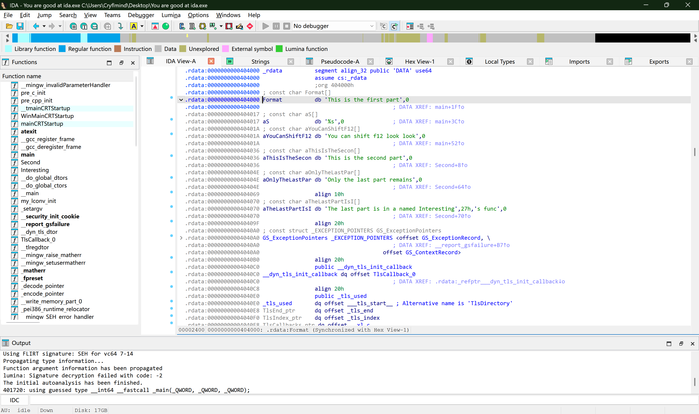

可以看到程序跳转到了对应的字符串，这里字符串下面有一个 `; DATA XREF:main+1F↑o` ，这是 IDA 识别出的引用该字符串的程序的位置。  

双击 `main+1F↑o` ，程序就会自动跳转到对应的位置：

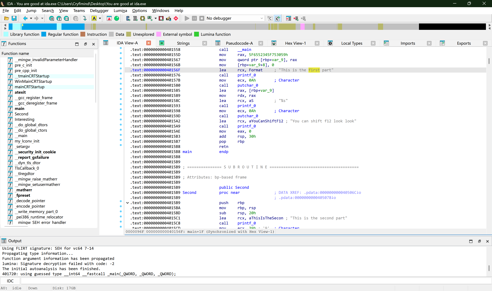

程序跳转到了汇编视图，之后就可以使用 F5 将这段汇编反编译为伪代码了。

!!! Note "这是快速定位目标函数的一个常用技巧"
    如果程序在编译时删除了符号表，IDA 将可能无法直接标注 `main` 。  
    解决方法是：虽然主函数无法正确识别，但是主函数中含有的字符串可能依旧正常编码在程序中。  
    此时就可以通过定位字符串的方式来确定主函数的位置。   
    不过，实战中我们其实有更多的定位方式，字符串法只是常见技巧之一。

### 转换：似曾相识的数字
仿照我们刚才查找字符串的逻辑，我们很容易可以发现一个名为 `Second` 的函数：

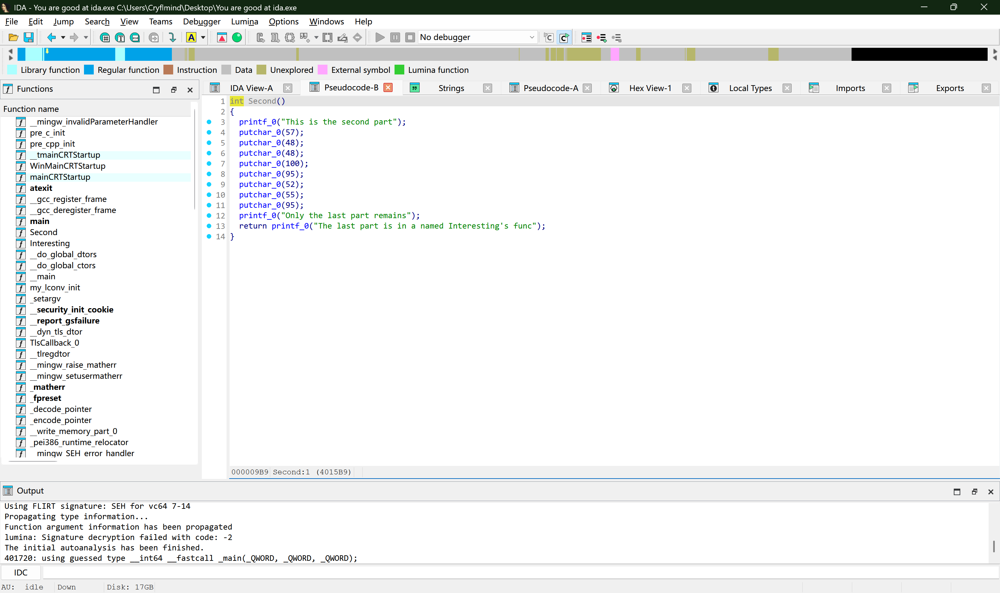

如果你对 ASCII 编码比较熟悉的话，可以发现这些数值大多落在可打印字符的范围内。

只是，看起来反编译视图中这些数据默认按数值显示，并没有正确解析成字符，怎么办呢？

我们只需要右键一下数据所在的位置：

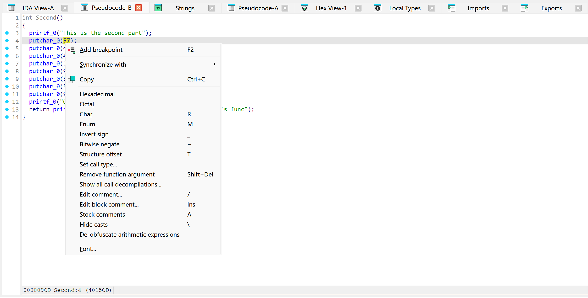

在右键菜单中，IDA提供了一些显示选项，比如这里我们可以点击 `Char` (或者使用快捷键 `R` )将数据转换为字符显示：

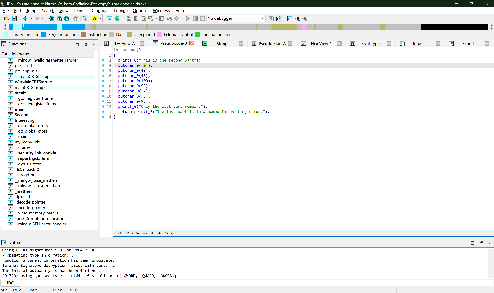

不过，对于这种需要大量使用的操作，还是直接按 `R` 比较好用。  

在伪代码视图下多戳几下 `R` 我们就可以得到：

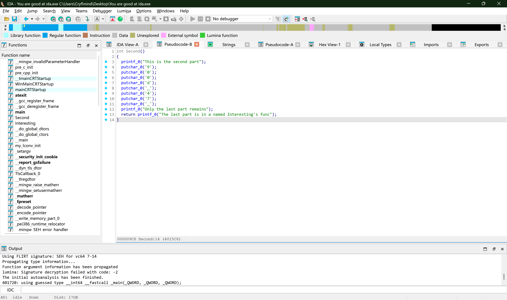

这就是第二部分flag的内容：`900d_47_` 。

当然，另一种查看转换结果的方式是直接在汇编视图下进行查看：

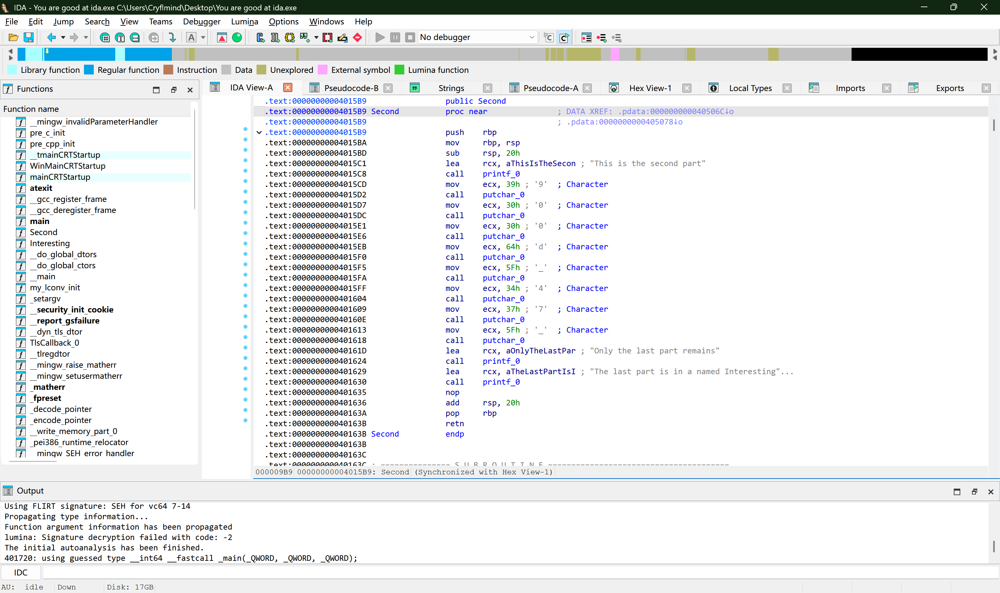

!!! Note "右键菜单中提供了各种各样的转换方式"
    对于初学者而言，这些快捷键并不是刚开始学就要都记住的。  
    你可以选择刚开始先进行右键，然后慢慢的记忆这些快捷键。  

### 捞针：快速找到目标函数
刚才在 `Second` 函数中我们找到了一条提示：`The last part is in a named Interesting's func` 。

它提示我们去找一个名为 `Interesting` 的函数。

我们可以在 IDA 的左侧看到一个函数窗口(Functions)：

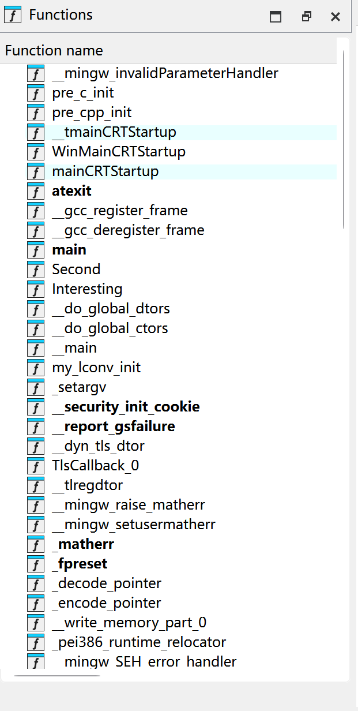

除了在里面慢慢翻找之外，一个更快的方法是点击一下函数窗口然后使用 Ctrl + F 搜索：

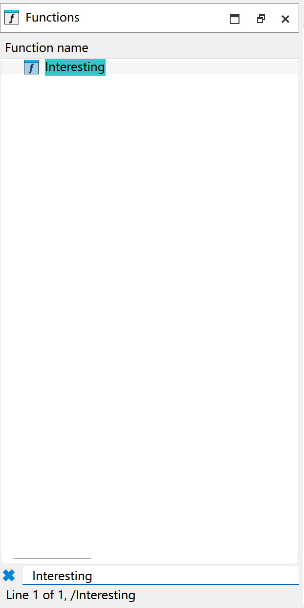

双击即可跳转到对应函数：

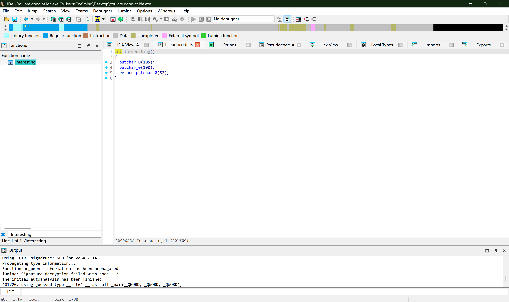

使用 `R` 转换为字符即可得到第三部分flag：`id4`。

所以本题最终的flag为：

```text
BaseCTF{Y0u_4Re_900d_47_id4}
```

---

!!! Note "在继续阅读前……"
    请确认你已经初步熟悉了上述题目过程中的相关操作，我们将在下一题中再次遇见其中的一些操作。  
    至少请确定你还记得上面讲了什么。

## IDA 实战初步：ez_maze
下面我们继续以BaseCTF 2024新生赛题目《ez_maze》为例，介绍一些 IDA 常用的其他操作。

你可以在 [这里](https://download.imxbt.cn/ctf/Basectf2024/Reverse/ez_maze.zip) 下载到题目的附件。

首先尝试运行一下附件，发现程序报错，根据报错文件缺失结合题目提示，猜测本题应该是故意不让人成功运行的。

!!! Warning "危险操作"
    请注意，逆向工程中接触的文件可能是病毒！逆向工程的主要工作就是分析程序逻辑，病毒分析也属于这一范畴。  
    所以，如果拿到一个未知程序，最好先进行静态和云沙箱分析，确保万无一失之后再尝试在虚拟机中运行。  
    目前笔者见过的案例包括但不限于有选手的电脑/服务器被挂上挖矿程序挖矿、文件都被病毒加密等等……   
    逆向千万条，安全第一条，操作不规范，机器两行泪喵\~

那就拖到 IDA 上看一眼吧，虽然报错了，但是一路 Yes/OK 下去还是能打开的：

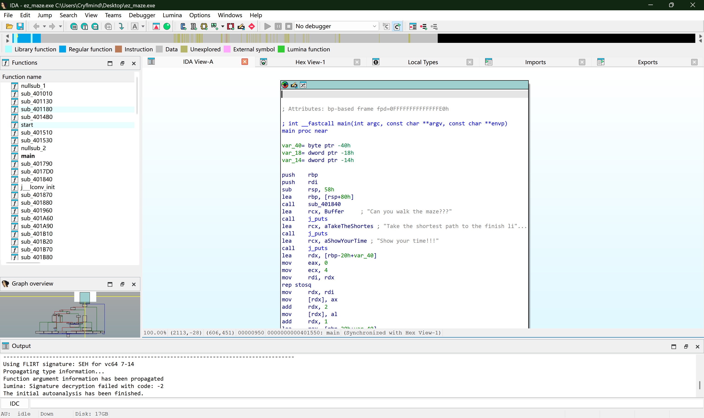

使用 F5 反编译可以看到如下代码：

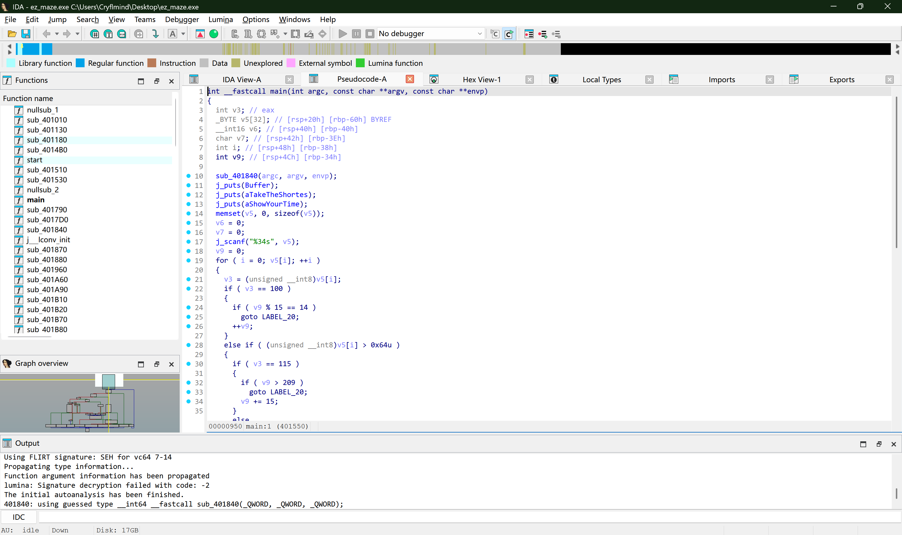

```c
int __fastcall main(int argc, const char **argv, const char **envp)
{
  int v3; // eax
  _BYTE v5[32]; // [rsp+20h] [rbp-60h] BYREF
  __int16 v6; // [rsp+40h] [rbp-40h]
  char v7; // [rsp+42h] [rbp-3Eh]
  int i; // [rsp+48h] [rbp-38h]
  int v9; // [rsp+4Ch] [rbp-34h]

  sub_401840(argc, argv, envp);
  j_puts(Buffer);
  j_puts(aTakeTheShortes);
  j_puts(aShowYourTime);
  memset(v5, 0, sizeof(v5));
  v6 = 0;
  v7 = 0;
  j_scanf("%34s", v5);
  v9 = 0;
  for ( i = 0; v5[i]; ++i )
  {
    v3 = (unsigned __int8)v5[i];
    if ( v3 == 100 )
    {
      if ( v9 % 15 == 14 )
        goto LABEL_20;
      ++v9;
    }
    else if ( (unsigned __int8)v5[i] > 0x64u )
    {
      if ( v3 == 115 )
      {
        if ( v9 > 209 )
          goto LABEL_20;
        v9 += 15;
      }
      else
      {
        if ( v3 != 119 )
        {
LABEL_21:
          j_puts(aInvalidInput);
          return -1;
        }
        if ( v9 <= 14 )
          goto LABEL_20;
        v9 -= 15;
      }
    }
    else
    {
      if ( v3 != 97 )
        goto LABEL_21;
      if ( !(v9 % 15) )
      {
LABEL_20:
        j_puts(aInvalidMoveOut);
        return -1;
      }
      --v9;
    }
    if ( asc_403020[v9] == 36 )
    {
      j_puts(aInvalidMoveHit);
      return -1;
    }
    if ( asc_403020[v9] == 121 )
    {
      j_puts(aYouWin);
      j_puts(aPlzBasectfLowe);
      return 0;
    }
  }
  j_puts(aYouDidnTReachT);
  return 0;
}
```

IDA 有时候会选择将字符串的一部分作为名称，比如上面的 `aYouWin` 就是获胜的提示 `You win!` ，这些 **蓝色名称** 都是可通过双击跳转的。

首先使用 `R` 将疑似 ASCII 码的地方恢复一下：

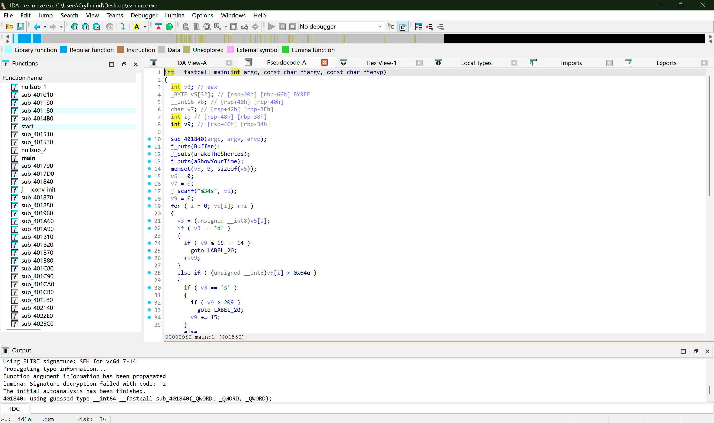

可以看到 WASD 这些游戏移动常常使用的按键，大胆猜测一下这里也是用于移动。

那么 `v9` 就是角色当前所在的位置索引，为了方便我们可以给 `v9` 改个名。

### 改名：却是旧相识
首先我们对着 `v9` 右键：

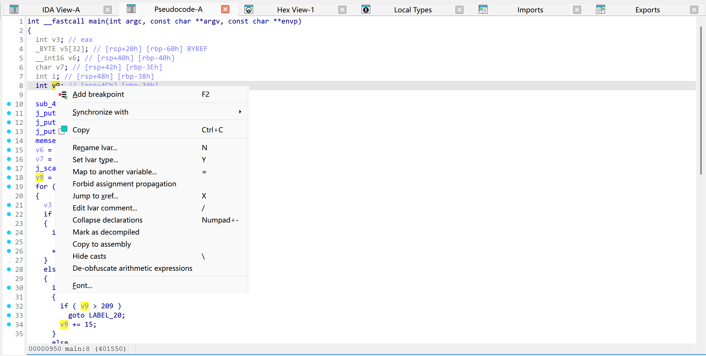

在右键菜单中我们选择 `Rename lvar...` (或者直接按 `N`)进行重命名，这里我们改成 `Pos` :

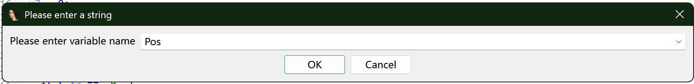

确认后，代码中所有的 `v9` 都被改名为 `Pos` 了。

!!! Note "改名的好处"
    将一个变量名修改成自己熟悉的意思，最大的好处就是可以更好的理清变量之间的关系。  
    比如如果你不知道某个函数的传参是什么类型，不妨给变量改个名（比如`Input`，`Buf`……），  
    这样你就可以更好的区分这些变量了。  

当然，能改名的并不只有变量，你也可以把 `LABEL_20` 改名成 `OutOfBound` 、把 `LABEL_21` 改名成 `InvalidMove` ……

### 修正：IDA也会推断失败
我们可以注意到，变量 `v5[i]` 的前面有一个强制类型转换 `(unsigned __int8)`，说明 `v5[i]` 的类型可能是不理想的。

对于这种情况，我们可以手动修复 `v5[i]` 的类型，只需要先对着 `v5` 右键：

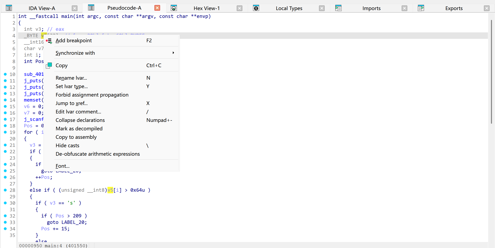

选择 `Set lvar type...` (或者按 `Y`)进行修改，这里我们把前面的类型直接修改为`unsigned char`：

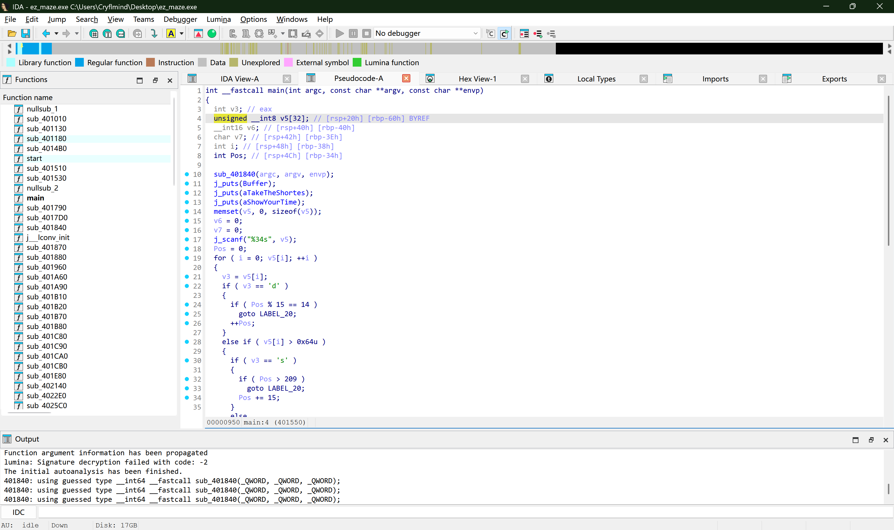

可以看到前面的强制类型转换消失了，说明识别的类型被修复了。

!!! Note "如果你看到有些代码写得很抽象……"
    在前面的 C 语言基础中我们介绍了 `a[i]` 的几种写法，实际逆向过程中这几种写法可能都会出现。  
    如果 IDA 在反编译过程中没有正确将其识别为 `a[i]` ，你可以手动将其修复为数组，过程和这里也是类似的。  
    “很多代码读起来抽象其实是因为 IDA 没有正确识别其数据类型”

于是我们得到了修正后的反编译伪代码：

```c
int __fastcall main(int argc, const char **argv, const char **envp)
{
  int v3; // eax
  unsigned __int8 move[32]; // [rsp+20h] [rbp-60h] BYREF
  __int16 v6; // [rsp+40h] [rbp-40h]
  char v7; // [rsp+42h] [rbp-3Eh]
  int i; // [rsp+48h] [rbp-38h]
  int Pos; // [rsp+4Ch] [rbp-34h]

  sub_401840(argc, argv, envp);
  j_puts(Buffer);
  j_puts(aTakeTheShortes);
  j_puts(aShowYourTime);
  memset(move, 0, sizeof(move));
  v6 = 0;
  v7 = 0;
  j_scanf("%34s", move);
  Pos = 0;
  for ( i = 0; move[i]; ++i )
  {
    v3 = move[i];
    if ( v3 == 'd' )
    {
      if ( Pos % 15 == 14 )
        goto OutOfBound;
      ++Pos;
    }
    else if ( move[i] > 100u )
    {
      if ( v3 == 's' )
      {
        if ( Pos > 209 )
          goto OutOfBound;
        Pos += 15;
      }
      else
      {
        if ( v3 != 'w' )
        {
InvalidMove:
          j_puts(aInvalidInput);
          return -1;
        }
        if ( Pos <= 14 )
          goto OutOfBound;
        Pos -= 15;
      }
    }
    else
    {
      if ( v3 != 'a' )
        goto InvalidMove;
      if ( !(Pos % 15) )
      {
OutOfBound:
        j_puts(aInvalidMoveOut);
        return -1;
      }
      --Pos;
    }
    if ( Maze[Pos] == '$' )
    {
      j_puts(aInvalidMoveHit);
      return -1;
    }
    if ( Maze[Pos] == 'y' )
    {
      j_puts(aYouWin);
      j_puts(aPlzBasectfLowe);
      return 0;
    }
  }
  j_puts(aYouDidnTReachT);
  return 0;
}
```

### 导出：断断续续的数据
程序的逻辑已经很清楚了，就是一个普通的走迷宫游戏。

现在我们只剩下最后一个问题了，如何导出数据？

如果你直接在 `Strings` 里面进行复制的话，你会得到这串东西：

```text
seg000:0000000000403020	000000E2	C	x$$$$$$$$$$$$$$&&&&&&$$$$$$$$$&$&$$&$$&&&&&$$&$&$$$&&$$$$&$$&$$$&&&$$$$$&$$&$$$&$&&$&$$$$$&$$$&$&$$&&&$$$&&&&&$&&&&$&$$$$$$$$$&&&&&&$$$$$$$$$&$$$$$$$$$$$&&&&$$&&&$$$$$$&&&&&&&$$$$$$$$$$$$$$&$$&$$$$$$$$$$$&$&$$$$$$$$$&&&&&&&&y
```

但其实，你可以先双击来到字符串对应的位置，然后选中字符串：

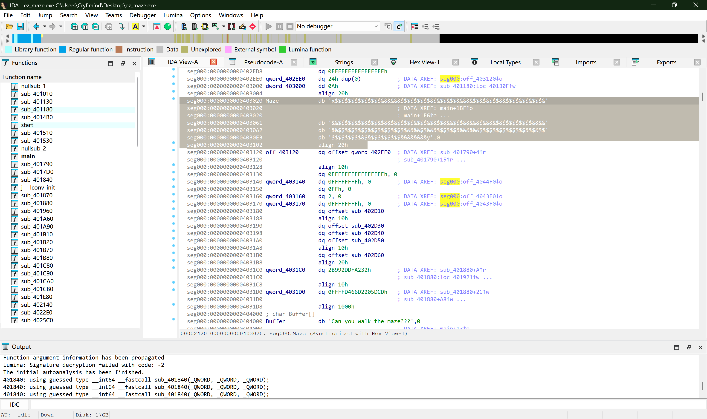

之后，我们按下 Shift + E ，然后以字符串形式导出(Export)：

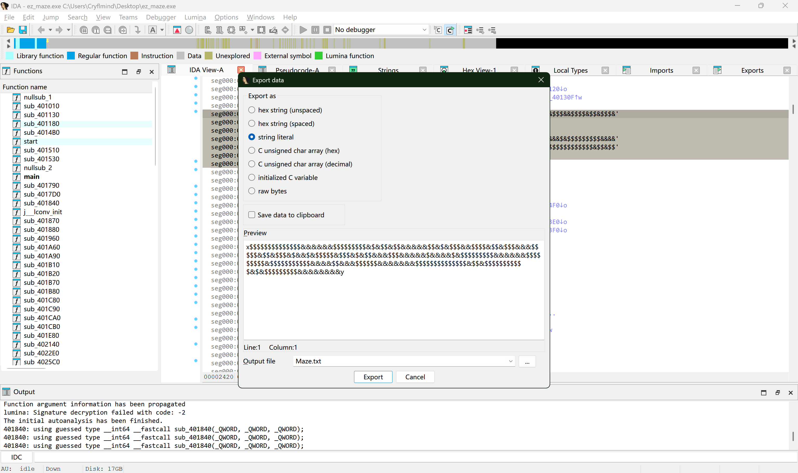

于是我们就可以得到：

```
x$$$$$$$$$$$$$$&&&&&&$$$$$$$$$&$&$$&$$&&&&&$$&$&$$$&&$$$$&$$&$$$&&&$$$$$&$$&$$$&$&&$&$$$$$&$$$&$&$$&&&$$$&&&&&$&&&&$&$$$$$$$$$&&&&&&$$$$$$$$$&$$$$$$$$$$$&&&&$$&&&$$$$$$&&&&&&&$$$$$$$$$$$$$$&$$&$$$$$$$$$$$&$&$$$$$$$$$&&&&&&&&y
```

根据前面的走迷宫程序，我们可以判断这是一个 15 * 15 的迷宫，根据题目要求 `Take the shortest path to the finish line.OK? plz BaseCTF{lower.MD5{your path}} by 32bit` ，你只需要提交最短路径对应的32位小写MD5值即可，这里就不进行计算了。

## 总结
总的来说，IDA 的使用其实并不困难。

虽然本文依旧用了很大的篇幅去介绍 IDA 的相关使用，但如果读者可以完整的跟随教程完成这两道题目的话，相信读者也已经体会到了 IDA 的魅力了。

限于篇幅，如果读者对 IDA 的其他功能或快捷键也感兴趣的话，可以自主学习一下相关内容，这里就不过多展开了。

后续读者如果想要尝试其他题目的话，可以前往BaseCTF 2024完成前两个Week的大多数逆向题目，或者去其他靶场刷刷题熟悉一下工具的使用。  

请时刻记得： **不顺手的工具，终是负担。**