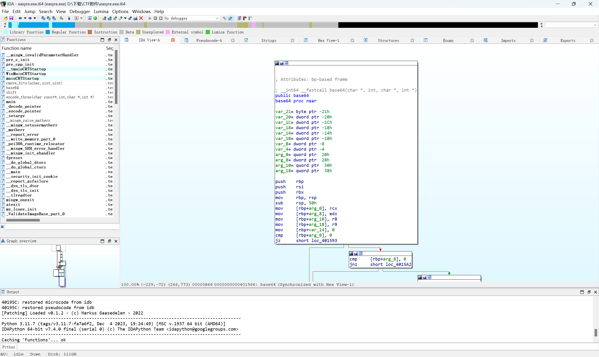
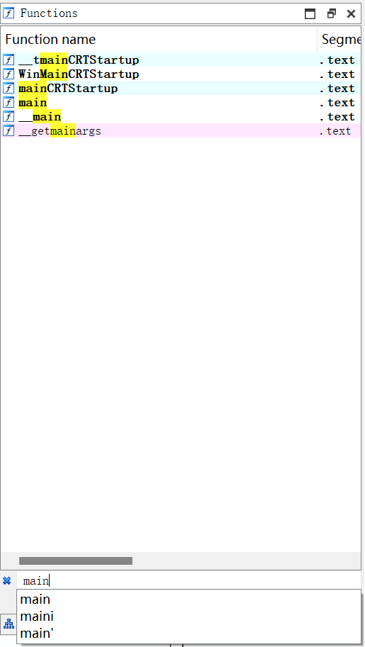
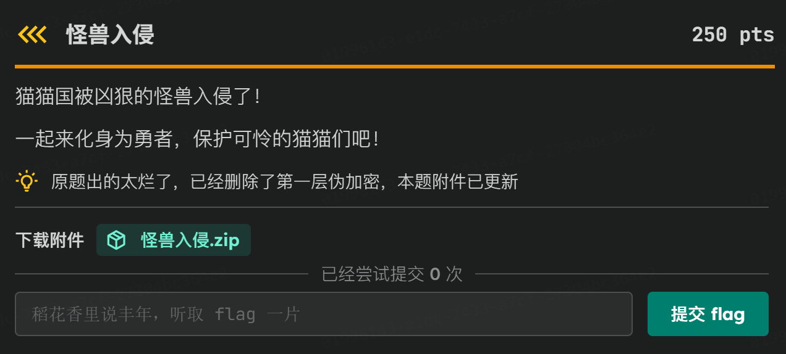
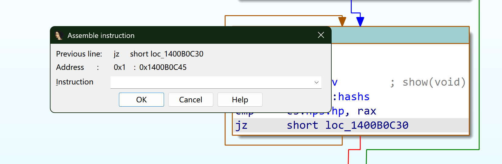

# 从零开始的IDA

对于re手来说，最基础和最重要的工具就是我们的 ~~老婆~~ **IDA** 了。

IDA Pro（Interactive Disassembler Professional）简称“IDA”，是Hex-Rays公司出品的一款交互式反汇编工具，是目前最棒的静态反编译软件 ~~之一~~ 。

!!! Info "请注意你的IDA Pro版本……"
    在目前最新版本的IDA Pro中，我们会注意到一个全新的IDA替代了以前的IDA+IDA64。  
    根据Hex-Rays的发行公告，IDA Pro已经在8.3版本中弃用了IDA(32-bit)，并在9.0版本中正式将两个IDA可执行程序合并为一个。  
    这并不意味着我们从此不再能反编译32-bit/64-bit程序了，相反，现在的IDA Pro已经同时兼容了这两个版本！  
    “我们在几个版本前就弃用了IDA32。在IDA 9.0中，只需一个IDA二进制即可处理32位和64位代码。”  
    “将遗留IDB转换为I64文件格式是透明的，由IDA自动执行。”

## IDA界面
随意用IDA打开一个文件，我们可以看到主界面：


### Function
左边的Function视窗，我们可以看到程序内识别出的所有函数。
Ctrl+F还可以搜索我们想找的函数：


### IDA View-A
右侧`IDA View-A`我们可以看到反汇编得到的汇编代码，以及控制流。

按空格键可以切换 **“平铺”** 和 **“控制流”** 两种模式。

平铺模式可以让我们看到所有代码在内存中保存的位置、顺序。

控制流模式可以让我们清晰地看到程序控制流的变化。

`IDA View-A`下的其他快捷键：  
- `G`：指定地址跳转
- `P`：解析函数
- `C`：将数据转化为代码
- `D`：将代码转化为数据
- `Shift+E`：提取数据


在`IDA View-A`视窗下按`Tab`或`F5`就可以自动将汇编代码翻译成 **伪C语言代码** 。（也就是传说中的 **“万能F5”** ）
伪C代码可以近似当做C语言代码阅读，只是有些地方语法不一定准确，也会受到源程序编码语言的影响 ~~（如Rust语言反编译出的依托答辩）~~


### Pseudocode-A
`Pseudocode-A`视窗下的快捷键：
- `/`：添加注释
- `\`：隐藏类型描述
- `Y`：更改变量类型
- `R`：将选中的数字转换为相应的ASCII字符
- `X`：查看函数的交叉引用
- `N`：更改变量名称

### String
除此之外，我们还可以通过String界面查看程序中所有的字符串：

- `Shift+F12`：打开String界面，查看字符串


至此，你就大致掌握了逆向工程最基础的逆向分析工具！

## 这就结束了吗……？
别急，IDA并不只是我们上面介绍的这么简单zwz~

现在的IDA可以完成更多有趣的工作，比如下面这些：
### patch
我们以一个题目为例([点击下载附件](https://wwbxs.lanzoup.com/ib2Il3j4hsda))：



本题下发了一个小游戏，需要你不断输入`attack`使怪兽的血量清零：


!!! Danger "危险操作"
    请注意，在逆向工程中接触的文件可能是有病毒的！  
    所以一个比较保险的做法是先进行静态分析和云沙箱分析，确保万无一失之后再尝试在虚拟机中运行。  
    目前笔者见过的案例包括但不限于有选手的电脑/服务器被挂上挖矿程序被迫挖矿、文件都被病毒加密等等……  
    逆向千万条，安全第一条，操作不规范，机器两行泪喵~

首先可以把可执行程序丢入DIE分析一下：


可以看到是64位的Windows程序（PE64），如果你是旧版本(<9.0)的IDA，需要拖给IDA64进行分析，否则直接拖给IDA分析就行了（笔者这里是IDA Pro 9.3，直接拖过去分析即可）：


等待加载完成，我们就会看到反汇编的控制流视图：


可以看到 IDA 已经找到 `main` 函数。此时可以按下 F5（刷新反编译结果）或 Tab（切换到当前指令处的反编译结果），查看对应的伪 C 代码：


```c
__int64 __fastcall main()
{
  std::ostream *v0; // rax
  std::ostream *v1; // rax
  std::ostream *v2; // rax
  std::ostream *v3; // rax
  std::ostream *v4; // rax
  std::ostream *v5; // rax

  _main();
  system_0("color 0e");
  while ( hps.hp != hashs )
    show();
  system_0("color 0a");
  v0 = (std::ostream *)std::operator<<<std::char_traits<char>>(refptr__ZSt4cout, (char *)&byte_1400B50B7);
  std::endl<char,std::char_traits<char>>(v0);
  v1 = (std::ostream *)std::operator<<<std::char_traits<char>>(refptr__ZSt4cout, (char *)&byte_1400B50CC);
  v2 = (std::ostream *)std::ostream::_M_insert<long long>(v1);
  v3 = (std::ostream *)std::operator<<<std::char_traits<char>>(v2, (char *)&byte_1400B50D5);
  v4 = (std::ostream *)std::ostream::_M_insert<long long>(v3);
  v5 = (std::ostream *)std::operator<<<std::char_traits<char>>(v4, (char *)&byte_1400B50DE);
  std::endl<char,std::char_traits<char>>(v5);
  system_0("pause>>nul");
  return 0;
}
```

看起来这是一个C++或者类似语言编写的小游戏，不妨双击show()函数查看内容：

```c
void __cdecl show()
{
  __int64 v0; // rax
  const std::ctype<char> *v1; // r13
  char v2; // dl
  std::ostream *v3; // rax
  __int64 v4; // rax
  const std::ctype<char> *v5; // r13
  char v6; // dl
  std::ostream *v7; // rax
  std::ostream *v8; // r13
  __int64 v9; // rax
  const std::ctype<char> *v10; // r14
  char v11; // dl
  std::ostream *v12; // rax
  __int64 v13; // rax
  const std::ctype<char> *v14; // r14
  char v15; // dl
  std::ostream *v16; // rax
  std::ctype<char>::char_type (__fastcall *v17)(const std::ctype<char> *const, char); // rax
  std::ctype<char>::char_type (__fastcall *v18)(const std::ctype<char> *const, char); // rax
  std::ctype<char>::char_type (__fastcall *v19)(const std::ctype<char> *const, char); // rax
  std::ctype<char>::char_type (__fastcall *v20)(const std::ctype<char> *const, char); // rax

  std::__ostream_insert<char,std::char_traits<char>>(refptr__ZSt4cout);
  v0 = *(_QWORD *)(*(_QWORD *)refptr__ZSt4cout - 24LL);
  v1 = *(const std::ctype<char> **)((char *)refptr__ZSt4cout + v0 + 240);
  if ( !v1 )
    goto LABEL_25;
  if ( *((_BYTE *)v1 + 56) )
  {
    v2 = *((_BYTE *)v1 + 67);
  }
  else
  {
    std::ctype<char>::_M_widen_init(*(_QWORD *)((char *)refptr__ZSt4cout + v0 + 240));
    v2 = 10;
    v17 = *(std::ctype<char>::char_type (__fastcall **)(const std::ctype<char> *const, char))(*(_QWORD *)v1 + 48LL);
    if ( v17 != std::ctype<char>::do_widen )
      v2 = v17(v1, 10);
  }
  v3 = (std::ostream *)std::ostream::put(refptr__ZSt4cout, v2);
  std::ostream::flush(v3);
  std::__ostream_insert<char,std::char_traits<char>>(refptr__ZSt4cout);
  v4 = *(_QWORD *)(*(_QWORD *)refptr__ZSt4cout - 24LL);
  v5 = *(const std::ctype<char> **)((char *)refptr__ZSt4cout + v4 + 240);
  if ( !v5 )
    goto LABEL_25;
  if ( *((_BYTE *)v5 + 56) )
  {
    v6 = *((_BYTE *)v5 + 67);
  }
  else
  {
    std::ctype<char>::_M_widen_init(*(_QWORD *)((char *)refptr__ZSt4cout + v4 + 240));
    v6 = 10;
    v18 = *(std::ctype<char>::char_type (__fastcall **)(const std::ctype<char> *const, char))(*(_QWORD *)v5 + 48LL);
    if ( v18 != std::ctype<char>::do_widen )
      v6 = v18(v5, 10);
  }
  v7 = (std::ostream *)std::ostream::put(refptr__ZSt4cout, v6);
  std::ostream::flush(v7);
  std::__ostream_insert<char,std::char_traits<char>>(refptr__ZSt4cout);
  v8 = (std::ostream *)std::ostream::_M_insert<long long>(refptr__ZSt4cout);
  v9 = *(_QWORD *)(*(_QWORD *)v8 - 24LL);
  v10 = *(const std::ctype<char> **)((char *)v8 + v9 + 240);
  if ( !v10 )
    goto LABEL_25;
  if ( *((_BYTE *)v10 + 56) )
  {
    v11 = *((_BYTE *)v10 + 67);
  }
  else
  {
    std::ctype<char>::_M_widen_init(*(_QWORD *)((char *)v8 + v9 + 240));
    v11 = 10;
    v19 = *(std::ctype<char>::char_type (__fastcall **)(const std::ctype<char> *const, char))(*(_QWORD *)v10 + 48LL);
    if ( v19 != std::ctype<char>::do_widen )
      v11 = v19(v10, 10);
  }
  v12 = (std::ostream *)std::ostream::put(v8, v11);
  std::ostream::flush(v12);
  std::operator>><char>(refptr__ZSt3cin);
  if ( !(unsigned int)std::string::compare(&ans[abi:cxx11], "attack") )
  {
    system_0("cls");
    hps.hp = hashs ^ ((hashs ^ hps.hp) - 1);
    system_0("color 0a");
  }
  else
  {
    system_0("cls");
    system_0("color 0c");
  }
  std::__ostream_insert<char,std::char_traits<char>>(refptr__ZSt4cout);
  v13 = *(_QWORD *)(*(_QWORD *)refptr__ZSt4cout - 24LL);
  v14 = *(const std::ctype<char> **)((char *)refptr__ZSt4cout + v13 + 240);
  if ( !v14 )
LABEL_25:
    std::__throw_bad_cast();
  if ( *((_BYTE *)v14 + 56) )
  {
    v15 = *((_BYTE *)v14 + 67);
  }
  else
  {
    std::ctype<char>::_M_widen_init(*(_QWORD *)((char *)refptr__ZSt4cout + v13 + 240));
    v15 = 10;
    v20 = *(std::ctype<char>::char_type (__fastcall **)(const std::ctype<char> *const, char))(*(_QWORD *)v14 + 48LL);
    if ( v20 != std::ctype<char>::do_widen )
      v15 = v20(v14, 10);
  }
  v16 = (std::ostream *)std::ostream::put(refptr__ZSt4cout, v15);
  std::ostream::flush(v16);
  system_0("pause");
  system_0("color 0e");
  system_0("cls");
}
```
!!! Tip "代码太长了？不要慌~"
    很多人在初学RE的时候，看着长篇大论的代码就有些发憷。  
    但其实完全没有这个必要哦\~逆向工程并不是要求你能完整阅读所有的代码，你只要能读懂你感兴趣的那部分就好啦\~  
    就比如这题我们直接阅读的是`show()`的逻辑，而不是先去研究比如`std::ostream::_M_insert`是什么\~  
    耐心仔细读读吧，多去了解一些常见的算法和开发逻辑，会有利于你理解别人编写的程序哦\~

我们很快就能看到和attack有关的东西：

```c
std::operator>><char>(refptr__ZSt3cin);
  if ( !(unsigned int)std::string::compare(&ans[abi:cxx11], "attack") )
  {
    system_0("cls");
    hps.hp = hashs ^ ((hashs ^ hps.hp) - 1);
    system_0("color 0a");
  }
  else
  {
    system_0("cls");
    system_0("color 0c");
  }
```

显然这是一个C语言风格的读入（cin），之后该程序会检验读入的字符串是不是`attack`，如果正确就将hp进行一个操作（我们前面已经尝试过了，这里是hp-1）。

但是显然这样太慢了，我们有没有什么更快的方法？

有的兄弟，有的，这里我们介绍patch(补丁)大法。

这里我们需要先了解一个汇编的基础常识：一般在汇编中实现分支逻辑结构的方法是使用 **有条件跳转** (比如`jz`(jump if ZF=0)和`jnz`(jump if ZF!=0))和 **无条件跳转** (比如`jmp`)。

在大概理清了程序逻辑之后，我们切换回`main()`的控制流视角。  

可以发现main函数的控制流可以归纳成这么几段（猫猫已经将内容复制出来了喵）：

```asm
; __int64 __fastcall main()
public main
main proc near
push    r12
sub     rsp, 20h
call    __main
lea     rcx, aColor0e   ; "color 0e"
call    system_0
mov     rax, cs:hashs
cmp     cs:hps.hp, rax
jz      short loc_1400B0C45
```
```asm
nop     word ptr [rax+rax+00000000h]
```
```asm
loc_1400B0C30:
call    _Z4showv        ; show(void)
mov     rax, cs:hashs
cmp     cs:hps.hp, rax
jnz     short loc_1400B0C30
```
```asm
loc_1400B0C45:
lea     rcx, aColor0a   ; "color 0a"
call    system_0
mov     r12, cs:_refptr__ZSt4cout
lea     rdx, byte_1400B50B7 ; Str
mov     rcx, r12        ; std::ostream *
call    _ZStlsISt11char_traitsIcEERSt13basic_ostreamIcT_ES5_PKc ; std::operator<<<std::char_traits<char>>(std::ostream &,char const*)
mov     rcx, rax        ; __os
call    _ZSt4endlIcSt11char_traitsIcEERSt13basic_ostreamIT_T0_ES6__isra_0 ; std::endl<char,std::char_traits<char>>(std::ostream &) [clone]
lea     rdx, byte_1400B50CC ; Str
mov     rcx, r12        ; std::ostream *
call    _ZStlsISt11char_traitsIcEERSt13basic_ostreamIcT_ES5_PKc ; std::operator<<<std::char_traits<char>>(std::ostream &,char const*)
mov     rdx, cs:argv.b
xor     rdx, cs:argv.ed
mov     rcx, rax        ; std::ostream *
call    _ZNSo9_M_insertIxEERSoT_ ; std::ostream::_M_insert<long long>(long long)
lea     rdx, byte_1400B50D5 ; Str
mov     rcx, rax        ; std::ostream *
call    _ZStlsISt11char_traitsIcEERSt13basic_ostreamIcT_ES5_PKc ; std::operator<<<std::char_traits<char>>(std::ostream &,char const*)
mov     rdx, cs:argv.d
xor     rdx, cs:argv.ed
mov     rcx, rax        ; std::ostream *
call    _ZNSo9_M_insertIxEERSoT_ ; std::ostream::_M_insert<long long>(long long)
lea     rdx, byte_1400B50DE ; Str
mov     rcx, rax        ; std::ostream *
call    _ZStlsISt11char_traitsIcEERSt13basic_ostreamIcT_ES5_PKc ; std::operator<<<std::char_traits<char>>(std::ostream &,char const*)
mov     rcx, rax        ; __os
call    _ZSt4endlIcSt11char_traitsIcEERSt13basic_ostreamIT_T0_ES6__isra_0 ; std::endl<char,std::char_traits<char>>(std::ostream &) [clone]
lea     rcx, aPauseNul  ; "pause>>nul"
call    system_0
xor     eax, eax
add     rsp, 20h
pop     r12
retn
main endp
```
这里可以先尝试去理解一下这些汇编语句是什么意思，可以对应着之前反汇编出来的`main()`解读。

我们把重点放在这里：
```c
while ( hps.hp != hashs )
    show();
```
根据汇编我们可以得知这一部分调用`show()`是进行了`call    _Z4showv        ; show(void)`，也就是说这里默认会进入`loc_1400B0C30`。

那什么情况下会进入`loc_1400B0C30`呢？

```asm
mov     rax, cs:hashs ;将hashs变量的数值存入rax
cmp     cs:hps.hp, rax ;将rax和hp变量比较(作差)
jnz     short loc_1400B0C30 ;如果比较之后差值不为0则跳转到loc_1400B0C30
```

显然，正常情况下只有血量的存储值等于hashs的时候jnz才会不成立，从而继续向下执行。

??? Question "为什么这里是和`hashs`比较，而不是和0进行比较？"
    还记得前面attack相关的逻辑吗？
    ```c
    hps.hp = hashs ^ ((hashs ^ hps.hp) - 1);
    ```
    这里可以分解为3个语句：
    ```c
    hps.hp = hps.hp ^ hashs;
    hps.hp = hps.hp - 1;
    hps.hp = hashs ^ hps.hp;
    ```
    根据异或(^)性质，对于任何数 $x,a$ ，一定存在 $x\^a\^a=x$ 恒成立，且 $0\^x=x$ 。
    所以这里hps.hp显然是经历过一次异或的，也就是：
    ```text
    将hp从存储值还原回真实数值；
    将hp减少1；
    将hp变为异或后的数值（存储值）。
    ```
    而我们原来想要的比较逻辑应该是“如果hp变为0，则显示我们想要的信息”。  

    对应的异或表达式就是“如果存储的hp和hashs相等，则显示我们想要的信息”。  


那么，如果我们将这里的`jnz`改成`jz`，是不是就可以实现直捣黄龙了？

说干就干，首先我们点击我们想要修改的`jnz     short loc_1400B0C30`那一行：


之后我们选择`Edit -> Patch Program -> Assemble`，就可以看到以下窗口：


下面我们把其改为`jz     short loc_1400B0C30`并按下OK，然后……他怎么又弹出来一个新窗口？



可以看到这里后面的汇编框里修改已经生效了，但是为什么会有一个新的窗口出现？

这里有一个细节：有时候我们会有修改为其他类型汇编语句的需求（比如将`jnz`修改为`nop`），但是修改之后我们会发现后面的代码丢失了。

如果出现这种情况那大概率是出现了 **代码移位** ，即你新替换的指令和原指令所占的字节数不同，导致整个指令流都出现了偏移，进而导致解析出错（在IDA里面会爆红提示错误）。  

解决方法有很多，最常见的就是多补几个`nop`，而新窗口的出现就是为了方便我们实现这项操作的：他会直接问你需不需要修改下一个字节的指令。

因为这里我们是直接把`jnz`修改成`jz`，两者所占的字节数相同，并不需要补字节操作，所以这里我们直接Cancel就好。

??? Question "思考题：还有其他可用的修改方式吗？"
    还记得我们前面那几段汇编语句吗，除了修改`jz`和`jnz`之外，我们还可以修改`jnz`的参数（就是前面那个`loc_1400B0C30`）。

    只要把这里修改成最终击败怪兽之后的地址（在这里是`loc_1400B0C45`，也就是刚结束while循环的那个逻辑框），我们就可以通过一次`attack`直接实现跳转。

    所以还有一种修改方式是`jnz     short loc_1400B0C45`。

    本题的修改方式有很多哦，可以多思考多探索一下，熟悉熟悉Patch操作\~

还没完，这里我们只是刚刚修改好我们想要的语句，现在我们需要保存。

保存Patch后程序的选项其实也在我们刚才那个菜单：`Edit -> Patch Program -> Apply patches to input file...`：


这里的`Create backup`是创建一个备份文件，`Restore original bytes`是还原所有更改（防止patch错误但是不小心覆盖掉了源文件）。

（顺带一提，如果你需要查看修改过的地方，可以按下Ctrl + Alt + P）

点击OK保存即可（记得关掉之前打开的可执行程序哦，不然会Permission Denied）。

最后，运行我们Patch完成的程序，输入一次attack之后回车两次：


成功啦\~

??? Question "话说，这题还有什么其他的解法喵？"
    本题的另一种解法是使用Cheat Engine动态调试，也就是通过追踪变化的HP，定位到HP的存储地址并将其篡改成我们想要的数值。

    如果你想要尝试这种方法的话，你可能需要知道hashs的值，只需要在反汇编的代码里面双击hashs就会自动跳转啦~