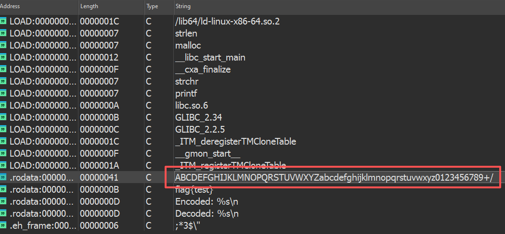
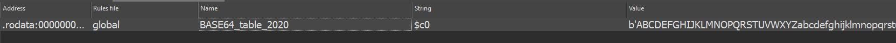

加密与解密

本章节会简单的介绍一下在逆向中的各种加密算法，加密算法在逆向中几乎无处不在。基本大部分的中等难度的题目都会使用主流/小众（或经魔改的）加密算法。因此，如何识别加密算法和如何解密在逆向的学习中是必不可少的。

关于加密算法的原理和具体种类，可以前往[Crypto](https://hello-ctf.com/hc-crypto/Recap/)分区查看，这里只讲如何识别和解密。

# XOR 异或加密

异或加密几乎是逆向题中最常见的算法之一。他的特性是**对称**，如下所示：

`A XOR B XOR B = A`

A 在经过两次异或运算后，会还原成 A 。

## 加密

以下会使用一个简单的C程序来进行演示：

```c
#include <stdio.h>
#include <string.h>
int main() {
    const unsigned char flag[] = "flag{test}";
    const unsigned char key[]  = "key";
    size_t flen = strlen(flag);
    size_t klen = strlen(key);
    for (size_t i = 0; i < flen; i++) {
        unsigned char c = flag[i] ^ key[i % klen];
        printf("%02x", c);
    }
}
```

在汇编里面，他是长这样的：

```assembly
section .data
fmt:    db "%02x",0
section .text
global main
extern printf
main:
    ; 数据
    mov     rax, 8315180360373726310 ; 入栈 flag{test}"
    mov     [rsp-36], rax
    mov     dword [rsp-29], 8221811 ; 入栈 key
    mov     dword [rsp-40], 7955819
    mov     rcx, 0              ; i = 0
.loop:
    cmp     rcx, 10
    jge     .done
    ; 取 flag[i]
    movzx   eax, byte [rsp-36+rcx]
    ; 取 key[i % 3]
    mov     rdx, 0
    mov     rbx, 3
    div     rbx                 ; rdx = i % 3
    movzx   edx, byte [rsp-40+rdx]
    ; xor
    xor     eax, edx
    ; printf("%02x", eax)
    mov     esi, eax
    lea     rdi, [rel fmt]
    xor     eax, eax
    call    printf
    inc     rcx
    jmp     .loop
.done:
    xor     eax, eax
    ret
```

# 识别

异或加密顾名思义，有一个很明显的特征就是会出现`xor`指令

简单介绍一下`xor`指令，`xor`指令的格式是`xor dest, src`。

其中`dest`是目标操作数，`src`则是来源操作数，操作数可以是是寄存器、内存单元或立即数。

    !!! Example 内存单元
        如 `[0x114514]`, `[eax]` 等

    !!! Example 立即数
        如 `0x114514`, `0x1919810` 等


而这一段汇编代码中的`xor eax, ecx`很明显就对应我们C代码中的`flag[i] ^ key[i % klen]`。

## 解密

接下来就到解密了，因为 XOR 是对称的，所以解密逻辑和加密完全一样：

```
A XOR B = C
C XOR B = A
```

拿密文再 XOR 一遍同样的 key，就能还原明文了。以下是一个使用python实现的解密程序：

```python
cipher = "0d09180c1e0d0e160d16" # 填入密文
key = b"key" # 填入反编译得来的key
cipher = bytes.fromhex(cipher)
plain = b""
for i in range(len(cipher)): # 这里需要跟加密的逻辑一致
    plain += bytes([cipher[i] ^ key[i % len(key)]])
print(f"{plain.decode()}")
```

运行结果：

```
$ python ./xor_dec.py
flag{test}
```

可以看到成功解密了。

## Base 编码

“Base” 严格来说不能算加密，他只能算作一种编码和解码的方式。

常见的 Base 编码有
- Base16
- Base32
- Base64
- 还有各种变体等等...

Base64 的原理就是将

# 识别

Base64编码后的字符串有一个很明显的特征就是

- 只包含：`A-Za-z0-9+/`

- 末尾可能有 `=` 或 `==`

- 长度通常是 4 的倍数

所以当你在IDA的String看到类似于以下字符串的东西的时候：

- `aGVsbG8gd29ybGQ=`

- `aGVsbG9fY3RmX2lsb3ZlX2N0Zg==`

基本可以断定百分之八十使用了Base64进行编码。

除此之外，Base系列编码还有一个非常明显的特征，那就是字符串表



图中可见，红框框住的的就是一个标准的Base64字符串表，当然，在实战情况下也有可能是魔改过的字符串表，但是也都大差不差。

当然，记住这么多加密(编码)算法的特征可不轻松，除此之外，我们也可以使用`Findcrypto`插件进行识别加密算法。

如图所示



关于插件的安装和使用会在插件篇提及更多内容。