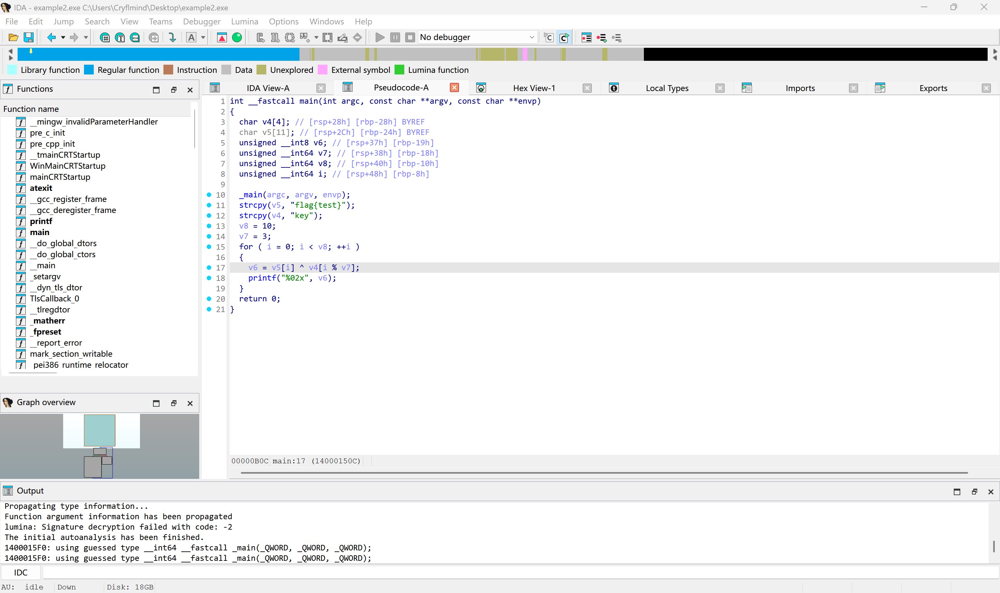
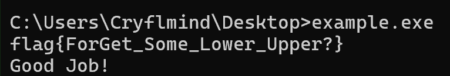

# 基本运算
对于初学者来说，“基本运算”这个词听起来就很让人头大，这似乎意味着又要学习很多奇奇怪怪的新东西了。  

但其实，情况倒也没这么糟糕，我们这里只是想介绍一些很基本的东西而已zwz。

## XOR 异或加密

### 前置知识：什么是异或XOR？
异或（XOR）是一种 **逻辑运算**，在数字电路和逻辑代数中广泛使用。  

在计算机中，它通常以 **按位运算（bitwise operation）** 的形式出现，即对两个二进制数的每一位分别进行异或计算。

其真值表如下：

| A | B | A⊕B |
|:---:|:---:|:-----:|
| 0 | 0 |  0  |
| 0 | 1 |  1  |
| 1 | 0 |  1  |
| 1 | 1 |  0  |

!!! Tips "有两个常见的真值表记忆口诀"
    1. 相同为0，不同为1。  
    2. 不带进位的二进制加法。（即“模2加法”）

显然的，这个运算和我们计算机里面的二进制很搭(?)，所以计算机中也实现了这个运算：`xor`。

`xor`指令的格式是`xor dest, src`。

其中`dest`是目标操作数，`src`则是来源操作数，操作数可以是寄存器、内存单元或立即数。

!!! example "寄存器（Register）"
    直接操作 CPU 寄存器中的值，速度最快。

!!! example "内存单元（Memory）"
    用方括号 `[]` 表示，访问对应地址处的内存内容。

!!! example "立即数（Immediate）"
    直接嵌入指令中的常数值，不涉及任何内存或寄存器访问。

但在 x86 架构中，两操作数指令通常有一个限制：

- **最多只能有一个操作数是内存操作数**
- **目标操作数不能是立即数**

顺带一提，汇编里`xor eax, eax`这种一般都是用来清零对应寄存器的喵~

### 原理
扯完了异或的一些简单介绍，我们来看看异或加密。

异或加密在逆向题中非常常见，因为它实现简单、特征明显，适合用于基础混淆。

他的特性是 **对称** ，核心原理是因为异或运算存在如下性质：

$$ A ⊕ B ⊕ B = A $$

A 在经过两次相同的异或运算后，会还原成 A 本身。

??? Question "怎么证明这个性质？"
    这里猫猫给出一种比较直观的证明思路（严格证明可以从布尔代数性质推出）：  
    首先我们先明确一个基本事实：异或运算每一位的结果都是 **独立** 产生的，这意味着每一位的异或结果并不会影响到其他位。  
    来回忆一下异或运算(XOR,⊕)的真值表，对于两个1位二进制 A 和 B ：
    
    | A | B | A⊕B |
    |:---:|:---:|:-----:|
    | 0 | 0 |  0  |
    | 0 | 1 |  1  |
    | 1 | 0 |  1  |
    | 1 | 1 |  0  |

    显然异或运算具有交换律，其结合律其实也很易得(或许这里读者可以自证一下？)    
    那么 `A XOR B XOR B` 显然等价于`A XOR (B XOR B)` ，也就是`A XOR 0` 。  
    而任何数和0进行异或，得到的结果就是这个数本身。  
    所以对于1位二进制数，我们有`A XOR B XOR B = A`，但因为每一位的运算都是相互独立的，所以这个结论可以自然推广到多位二进制数。  
    如果读者想要尝试一下的话，可以自己利用数学知识来严谨证明一下哦~

!!! Quote "猫猫の碎碎念"
    需要注意的是，单纯的 XOR 加密在真正的密码学中几乎没有安全性（除非使用一次性密钥 One-Time Pad）。   
    因此在 CTF 中它更多只是作为一种简单的混淆手段。


### 加密

以下我们用一个简单的C程序来进行演示：

```c
#include <stdio.h>
#include <string.h>
int main() {
    const unsigned char flag[] = "flag{test}";
    const unsigned char key[]  = "key";
    size_t flen = strlen(flag);
    size_t klen = strlen(key);
    for (size_t i = 0; i < flen; i++) {
        unsigned char c = flag[i] ^ key[i % klen];
        printf("%02x", c);
    }
}
```

首先将其编译成汇编并简化整理一下：

```assembly
; int __fastcall main(int argc, const char **argv, const char **envp)
main            proc near

                ; "flag{tes"的ASCII编码（小端序），因为x86是小端序存储，
                ; 所以低字节0x66（即'f'）存于低地址，对应字符串的首字节
                mov     rax, 7365747B67616C66h
                mov     qword ptr [rbp+var_24], rax
                mov     word ptr [rbp+var_24+8], 7D74h
                mov     [rbp+var_24+0Ah], 0
                mov     dword ptr [rbp+var_28], 79656Bh ; "key\0"
                mov     [rbp+var_8], 0              ; i = 0
                mov     [rbp+var_18], 3

.loop:
                cmp     [rbp+var_8], 10
                jge     .done
                lea     rax, [rbp+var_24]
                add     rax, [rbp+var_8]
                movzx   ecx, byte ptr [rax]         ; ecx = flag[i]
                mov     rax, [rbp+var_8]
                mov     rdx, 0
                div     [rbp+var_18]                ; rdx = i % 3
                movzx   eax, [rbp+rdx+var_28]       ; eax = key[i % 3]
                xor     eax, ecx                    ; flag[i] ^ key[i%3]
                mov     [rbp+var_19], al
                movzx   edx, [rbp+var_19]
                lea     rcx, Format                 ; "%02x"
                call    printf
                add     [rbp+var_8], 1              ; i++
                jmp     .loop

.done:
                mov     eax, 0
                retn
main            endp
```

异或加密顾名思义，就是利用 `xor` 指令对我们感兴趣的内容进行加密，从而在一定程度上起到 **简单混淆（obfuscation）** 的效果。

而这一段汇编代码中的`xor eax, ecx`很明显就对应我们C代码中的`flag[i] ^ key[i % klen]`。

那问题来了，万一我们没看出来哪个是加密用的 `xor` 怎么办？

很简单啊，进IDA按F5不就好了：



```c
int __fastcall main(int argc, const char **argv, const char **envp)
{
  char v4[4]; // [rsp+28h] [rbp-28h] BYREF
  char v5[11]; // [rsp+2Ch] [rbp-24h] BYREF
  unsigned __int8 v6; // [rsp+37h] [rbp-19h]
  unsigned __int64 v7; // [rsp+38h] [rbp-18h]
  unsigned __int64 v8; // [rsp+40h] [rbp-10h]
  unsigned __int64 i; // [rsp+48h] [rbp-8h]

  _main(argc, argv, envp);
  strcpy(v5, "flag{test}");
  strcpy(v4, "key");
  v8 = 10;
  v7 = 3;
  for ( i = 0; i < v8; ++i )
  {
    v6 = v5[i] ^ v4[i % v7];
    printf("%02x", v6);
  }
  return 0;
}
```

可以看到IDA的反汇编已经成功识别出了`v6 = v5[i] ^ v4[i % v7]`。

### 解密

接下来我们来聊聊解密，因为 XOR 运算是对称的，所以解密逻辑和加密完全一样：

由异或性质

```
A XOR B = C
C XOR B = A
```

可知，拿密文 C 再 XOR 一遍同样的 key B，就能把密文 C 还原成明文 A 了。

以下是一个使用Python 3实现的解密程序示例：

```python3
cipher = bytes.fromhex("0d09180c1e0d0e160d16") # 填入密文并转为bytes
key = b"key" # 填入反编译得来的key
plain = b""

for i in range(len(cipher)): # 这里需要跟加密的逻辑一致
    plain += bytes([cipher[i] ^ key[i % len(key)]])

print(f"{plain.decode()}")
```

运行结果：

```
$ python ./xor_dec.py
flag{test}
```

解密成功~

!!! Note "在逆向题目中不一定看到的就是明文喵~"
    可能有人会问了，我前面都已经看到明文就是`flag{test}`了，为什么还要费劲去写一个解密程序？  
    事实上，绝大多数的逆向题目里面存的都不是明文，而是加密后的密文，程序会要求我们输入正确的flag，在加密之后和程序存储的密文进行比较。   
    我们需要做的就是根据程序对输入内容的加密，来逆向编写出解密程序，从而实现对加密后flag的还原。

## int8 计算
接下来向我们走来的是我们的老朋友：`char`。

你可能会问了，标题不是 int8 吗？你把`char`喊来是几个意思？  

事实上，在计算机系统中，就算是`char`这些字符也是用数字来进行存储的。

我们在前面的C语言基础篇中已经介绍了ASCII码，当时我们就已经提到过，在键盘上的这些可见字符基本上都能用一个ASCII码来表示。

事实上计算机就是这么干的，所以，下面的这段代码是合法的：

```c
char str[4]="abc";
str[0]++;
str[1]+=2;
str[2]--;
printf("%s",str); //bdb
```

正如注释所说，这个字符串最终会从`abc`变成`bdb`，这也是防止做题人直接搜索flag的一个常见方法（什）。

??? Question "话说`char`到底是不是一个有符号数……？"
    事实上，C/C++标准里特意把这种问题设定为一种"实现定义行为"（implementation-defined behavior），也就是说，`char` 是否有符号取决于你的编译器和平台。  
    在大多数 x86/x64 平台上（如 MSVC、GCC/Linux），`char` 默认等价于 `signed char`；而在某些 ARM 平台上，`char` 默认等价于 `unsigned char`。  
    需要注意的是，尽管 `char`、`signed char`、`unsigned char` 是三种不同的类型，但 `char` 在运行时必然是其中某一种——要么有符号，要么无符号，并不存在第三种状态。  
    如果你的代码依赖 `char` 的符号性，建议显式使用 `signed char` 或 `unsigned char` 以避免平台差异带来的问题。

### 嘿，它看起来太像真flag了！
下面我们来一道例题(其中buffer为全局字符数组)：
```c
int __fastcall main(int argc, const char **argv, const char **envp)
{
  _DWORD v4[32]; // [rsp+20h] [rbp-B0h] BYREF
  char Str[32]; // [rsp+A0h] [rbp-30h] BYREF
  size_t v6; // [rsp+C0h] [rbp-10h]
  size_t i; // [rsp+C8h] [rbp-8h]

  //Mingw会有一个 mainCRTStartup -> main，IDA会解析成_main
  //做题时不用管这个
  _main(argc, argv, envp); 
  strcpy(Str, "flag{FOREST_so_enhance_Breath}");
  memset(v4, 0, 24);
  v4[6] = -32; //注意这里从index 6开始，因为v4前6项其实都是0
  v4[7] = -32;
  v4[8] = -2;
  v4[9] = -18;
  v4[10] = -32;
  v4[11] = 0;
  v4[12] = 32;
  v4[13] = 0;
  v4[14] = -14;
  v4[15] = 0;
  v4[16] = 15;
  v4[17] = 28;
  v4[18] = -14;
  v4[19] = -9;
  v4[20] = -2;
  v4[21] = -13;
  v4[22] = 0;
  v4[23] = -19;
  v4[24] = 2;
  v4[25] = -11;
  v4[26] = -4;
  v4[27] = 2;
  v4[28] = 41;
  v4[29] = 0;
  scanf("%99s", buffer);
  v6 = strlen(Str);
  for ( i = 0; i < v6; ++i )
    buffer[i] += LOBYTE(v4[i]);
  if ( !strcmp(buffer, Str) )
    printf("Good Job!");
  else
    printf("Try again!");
  return 0;
}
```

正如你所见，看起来出题人把flag直接写在里面了：`flag{FOREST_so_enhance_Breath}`。

[此处请脑补一张图片：当你信心满满的把这个flag交上去时，Wrong Flag的提示犹如当头一棒.jpg]

很不幸，这是个错误的flag，但是为什么呢？

注意到有这么一行：`buffer[i] += LOBYTE(v4[i])`，其中buffer是程序读取的输入字符串。

这说明程序并没有直接将你输入的字符串和目标字符串比较，而是对里面的很多字符都进行了偏移，而v4其实就是存储各个位置字符对应偏移量的数组。

### 解法
嘿，那怎么办？

怎么办， ~~凉拌~~ 我们不妨依葫芦画瓢一下，模仿着程序的逻辑，反推出目标字符串对应的flag原文。

它不是通过偏移来与目标字符串比较吗？我们也和它偏移一样的步数，只不过它用 **加法** 我们用 **减法** 。

于是我们就可以写出这样一个Python程序：

```python3
offset = [0,0,0,0,0,0,-32,-32,-2,-18,-32,0,32,0,-14,0,15,28,-14,-9,-2,-13,0,-19,2,-11,-4,2,41,0]
origin = "flag{FOREST_so_enhance_Breath}"
flag = ""

for i in range(30):
    flag += chr(ord(origin[i])-offset[i])

print(flag)
```

于是我们终于拿到了我们最终的flag：`flag{ForGet_Some_Lower_Upper?}`。

测试一下：



又解决了一题喵~

## 还有更多喵……？
有的有的，其实我们还可以介绍几个大类：移位密码，置换密码，替换密码……

以替换密码为例，和前面的int8计算有点像，但是他们采用的是“替换策略”，也就是根据一个或多个替换表，根据一定的规则对原文进行替换，比如凯撒密码和维吉尼亚密码。

如果对这种算法感兴趣的话，或许可以去Crypto方向看看喵~

[直达链接](https://hello-ctf.com/hc-crypto/Classicalcipher/)

这里就不过多介绍啦！

PS:如果读者真的需要省流的话，或许可以代入“披着羊皮的狼”？但还是更推荐去看看原理与细节哦~