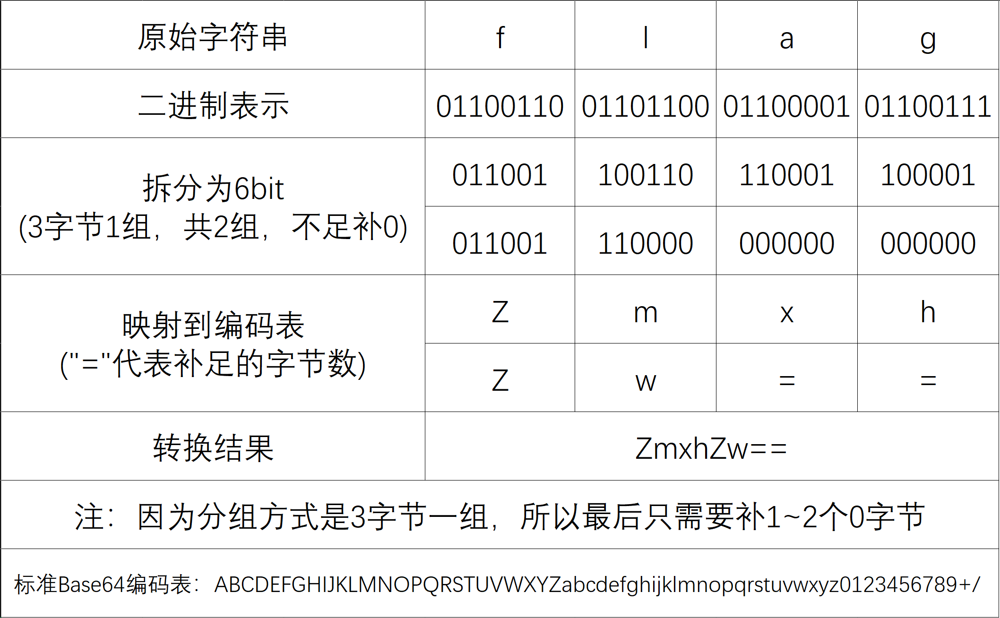
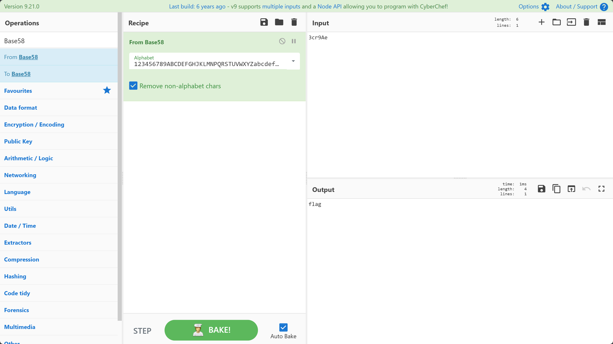

# 编码基础

由于 Reverse 方向涉及到的编码类型很多，这里只对一些较为经典的编码方式进行介绍。

## Hex 编码（十六进制编码）

### 定义与原理

Hex 编码是将二进制数据用 **16 进制数字** 表示的一种编码方式。它将每个字节拆分为高4位和低4位，分别映射为一个十六进制字符。

!!! example "十六进制字符有哪些？"
    大写版本：0123456789ABCDEF  
    小写版本：0123456789abcdef

设原始字节数据为 $B = [b_0, b_1, ..., b_{n-1}]$，每个字节 $b_i$ 的取值范围为 $[0, 255]$。

将每个字节拆分为高 4 位和低 4 位：

$$
b_i = 16 \times h_i + l_i
$$

其中：

- $h_i = \lfloor b_i / 16 \rfloor$ 为高半字节
- $l_i = b_i \bmod 16$ 为低半字节

### 编码示例

对于字符串 "Hello" 的 ASCII 字节序列：

| 字符 | ASCII | 高4位 | 低4位 | Hex编码 |
|:---:|:---:|:---:|:---:|:---:|
| H | 72 | 4 | 8 | 48 |
| e | 101 | 6 | 5 | 65 |
| l | 108 | 6 | c | 6c |
| l | 108 | 6 | c | 6c |
| o | 111 | 6 | f | 6f |

最终结果：$\text{"48656c6c6f"}$

## Unicode 编码

### 定义与数学本质

Unicode 常被误认为是一种编码方式，但它本质上是一个 **字符集** ，只负责为每个字符分配唯一的 **码点** （code point）。

至于如何将码点转换为字节，则由 UTF-8、UTF-16 等具体编码方案负责。

$$
\text{Unicode 码点空间} = \{0, 1, 2, ..., 0x10FFFF\}
$$

这一空间共可容纳约 111 万个字符位置，足以涵盖人类目前使用的所有书写系统。

### 常用编码方式

Unicode 需要通过特定的 **编码方式** 将目标字符串转换为字节序列，常见的有：

#### UTF-8（变长编码）
- ASCII 字符（U+0000 到 U+007F）占 1 字节
- 其他字符占 2-4 字节
- 无字节序问题

#### UTF-16（变长编码）
- BMP 字符（U+0000 到 U+FFFF）占 2 字节
- 补充平面字符占 4 字节，通过代理对（U+D800–U+DFFF）编码
- 分 UTF-16LE（小端）和 UTF-16BE（大端）

#### UTF-32（定长编码）
- 所有字符固定占 4 字节
- 分 UTF-32LE 和 UTF-32BE

### 常见形式识别

在二进制分析中，Unicode 字符串常以以下形式出现：

- **UTF-8**：ASCII 字符保持不变，非 ASCII 字符为多字节
- **UTF-16LE**：每两个字节表示一个字符，低字节在前，如 `H\x00e\x00l\x00l\x00o\x00`
- **UTF-16BE**：每两个字节表示一个字符，高字节在前，如 `\x00H\x00e\x00l\x00l\x00o`
- **UTF-32**：每四个字节表示一个字符

## Base 编码
简单来说，所有的 Base 编码本质上都是在做同一件事： **数字进制转换** 。

以下是一些常见的 Base 编码：  

- Base16  
- Base32  
- Base64  
- Base36  
- Base58  
- Base62  
- Base85  
- Base91   
- ...  

我们可以将这些编码的转换方式大致分为两类： **按位切分法** 和 **大整数除法** 。

### 按位切分法
对于编码表长度是2的幂次的Base编码，常用按位切分法(比如 Base16, Base32, Base64 ...)。

比如 Base64 编码，其编码表中有 $2^6=64$ 个字符，其核心原理就是将 3 个 8bit 切分成 4 个 6bit ，通过编码表映射实现编码。

这里以`flag`为例，展示一下 Base64 编码的过程：



我们可以使用 CyberChef 进行 Base64 编码的解码：


### 大整数除法
但还有很多 Base 编码不符合上述情况，这时候他们中的大多数会选择使用大整数除法。

简单来说就是，首先将原文通过256进制转换为一个大整数，然后不断地进行“取余”和“整除”操作，直到大整数变为0。

此时逆向拼接取余映射出来的字符，得到的新字符串就是编码结果。

!!! Quote "猫猫の碎碎念"
    还记得猫猫之前说的喵？Base就是进制转换呀！  
    这里的操作也和计算机课上学习的“十进制转二进制”做法一样的，只不过变成了转任意进制\~


以将`flag`通过 Base58 编码为例：

对于给定的一个字节数组 $B = [b₀, b₁, b₂, ..., bₙ₋₁]$ ，可以将其视为一个大整数 $V$ ：

$$V = b₀ × 256ⁿ⁻¹ + b₁ × 256ⁿ⁻² + ... + bₙ₋₂ × 256¹ + bₙ₋₁ × 256⁰$$

其中：  

- $b₀$ 是最高位字节（最左侧字节）  
- $bₙ₋₁$ 是最低位字节（最右侧字节）  
- $256 = 2⁸$（一个字节的取值范围）

就本例而言，字节数组 $B = ['f','l','a','g']$ ，计算(其中 ord() 表示对应字符的ASCII码)：

$$V = ord('f') \times 256^3+ord('l') \times 256^2+ord('a')\times 256+ord('g')$$

可以得出 $V=1718378855$ 。

之后就是不断地取余和整除了，标准流程如下：

标准 Base58 编码表： `123456789ABCDEFGHJKLMNPQRSTUVWXYZabcdefghijkmnopqrstuvwxyz` 。

$$
\begin{cases}
r_k = V_k \bmod 58 & \text{(取余数作为当前位的索引)} \\
V_{k+1} = \left\lfloor \dfrac{V_k}{58} \right\rfloor & \text{(取商用于下一轮计算)}
\end{cases}
$$

当满足以下条件时，**停止迭代**：

$$
V_{k+1} = 0
$$

我们来代入一下过程：

$$
\begin{aligned}
r_0 &= \text{V} \bmod 58, &\quad \text{char}_0 &= \text{base58\_alphabet}[r_0] = \text{'e'}, &\quad \text{V} &:= \left\lfloor \frac{\text{V}}{58} \right\rfloor \\
r_1 &= \text{V} \bmod 58, &\quad \text{char}_1 &= \text{base58\_alphabet}[r_1] = \text{'A'}, &\quad \text{V} &:= \left\lfloor \frac{\text{V}}{58} \right\rfloor \\
r_2 &= \text{V} \bmod 58, &\quad \text{char}_2 &= \text{base58\_alphabet}[r_2] = \text{'9'}, &\quad \text{V} &:= \left\lfloor \frac{\text{V}}{58} \right\rfloor \\
r_3 &= \text{V} \bmod 58, &\quad \text{char}_3 &= \text{base58\_alphabet}[r_3] = \text{'r'}, &\quad \text{V} &:= \left\lfloor \frac{\text{V}}{58} \right\rfloor \\
r_4 &= \text{V} \bmod 58, &\quad \text{char}_4 &= \text{base58\_alphabet}[r_4] = \text{'c'}, &\quad \text{V} &:= \left\lfloor \frac{\text{V}}{58} \right\rfloor \\
r_5 &= \text{V} \bmod 58, &\quad \text{char}_5 &= \text{base58\_alphabet}[r_5] = \text{'3'}, &\quad \text{V} &:= \left\lfloor \frac{\text{V}}{58} \right\rfloor = 0
\end{aligned}
$$

逆序拼接之后，我们可以得到最终的编码结果：

$$
\text{char}_5\ \text{char}_4\ \text{char}_3\ \text{char}_2\ \text{char}_1\ \text{char}_0 = \text{'3cr9Ae'}
$$

同样的，我们依旧可以使用 CyberChef 实现 Base58 编码的解码：



??? Question "是否有Base家族的成员选择了除"按位切分"和"大整数除法"之外的方案？"
    emm……其实是有的，比如 Base85 。  
    实际上 Base85 用的是分组块运算 ——这是一种介于两者之间的方案：每 4 个字节作为一组，通过大整数除法转换为 5 个字符。  
    它是在小块上做进制转换，而不是把整个输入当成一个大整数处理。

### 识别方式
这里以带 padding 的 Base64 为例： Base64 编码后的字符串具有以下特征：

- 末尾可能有 `=` 或 `==`

- 长度是 4 的倍数

同时 Base 系列编码的核心特征是 **字符映射表** 的存在。

在二进制程序中，该字符集通常以连续内存块的形式存在：


如图所示，红框内即为标准 Base64 字符表。在实战分析中，也可能遇到 **魔改版本** ：

$$
\mathcal{A}_{64}' = \text{自定义字符集（通常基于标准集置换）}
$$

但字符集长度恒为 64 这一数学特征保持不变。

以下是一些 Base64 编码的数据示例：

```text
aGVsbG8gd29ybGQ=
aGVsbG9fY3RmX2lsb3ZlX2N0Zg==
ZmxhZ3tUcnlfVG9fRmlndXJlX091dH0=
aGVsbG9DVEZ7RW5jb2RlX0FuZF9EZWNvZGV9
```

!!! Note "请不要迷信经验主义"
    存在字符表确实是 Base 家族一定有的特征，但这并不代表存在字符表就一定使用了 Base 家族的编码。  
    实战分析中建议结合处理算法进行综合研判，不然很可能会出现“聪明反被聪明误”哦\~


由于手动记忆各类 Base 编码特征较为繁琐，可使用自动化工具进行识别。

**Findcrypto** 插件通过以下方式检测加密算法：

- 扫描常量特征（如字符表、初始向量）
- 匹配算法特定常数（如 Base64 的字符集哈希值）
- 识别循环结构中的位运算模式


关于该插件的安装与使用，感兴趣的话读者可以自行探索。

!!! Abstract "还是那句话"
    不顺手的工具终究只会是负担。