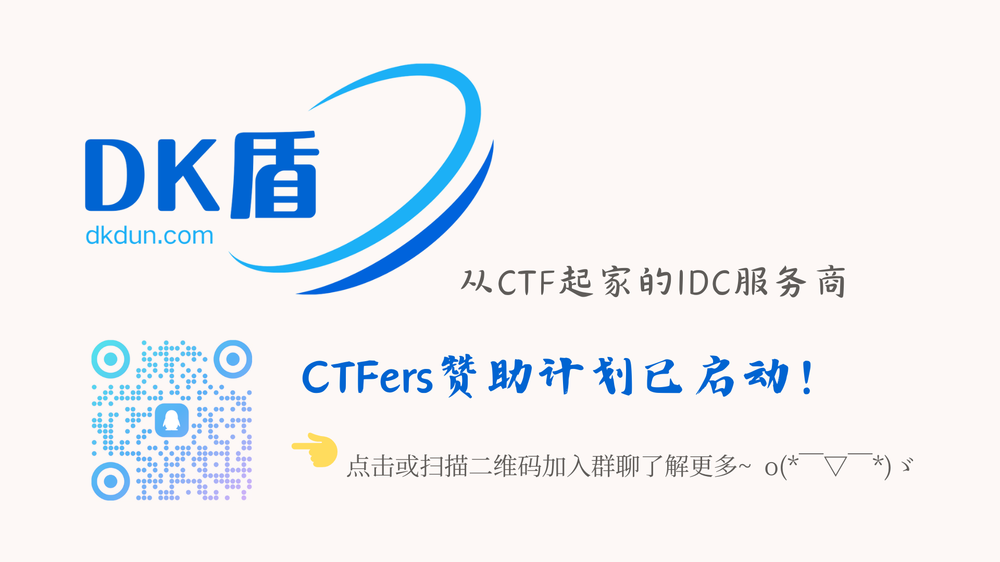
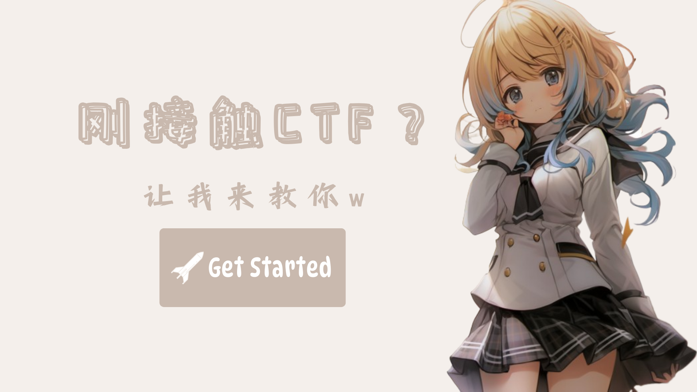
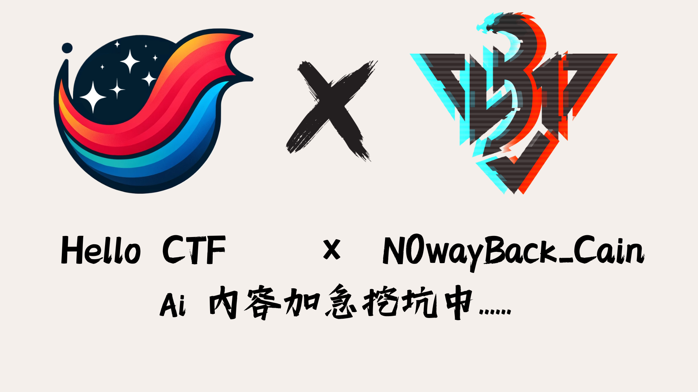

    <ul>
        <li>
            
<svg xmlns="http://www.w3.org/2000/svg"
                        viewBox="0 0 512 512"><!--! Font Awesome Free 6.5.1 by @fontawesome - https://fontawesome.com License - https://fontawesome.com/license/free (Icons: CC BY 4.0, Fonts: SIL OFL 1.1, Code: MIT License) Copyright 2023 Fonticons, Inc.-->
                        <path
                            d="M168 80c-13.3 0-24 10.7-24 24v304c0 8.4-1.4 16.5-4.1 24H440c13.3 0 24-10.7 24-24V104c0-13.3-10.7-24-24-24H168zM72 480c-39.8 0-72-32.2-72-72V112c0-13.3 10.7-24 24-24s24 10.7 24 24v296c0 13.3 10.7 24 24 24s24-10.7 24-24V104c0-39.8 32.2-72 72-72h272c39.8 0 72 32.2 72 72v304c0 39.8-32.2 72-72 72H72zm104-344c0-13.3 10.7-24 24-24h96c13.3 0 24 10.7 24 24v80c0 13.3-10.7 24-24 24h-96c-13.3 0-24-10.7-24-24v-80zm200-24h32c13.3 0 24 10.7 24 24s-10.7 24-24 24h-32c-13.3 0-24-10.7-24-24s10.7-24 24-24zm0 80h32c13.3 0 24 10.7 24 24s-10.7 24-24 24h-32c-13.3 0-24-10.7-24-24s10.7-24 24-24zm-176 80h208c13.3 0 24 10.7 24 24s-10.7 24-24 24H200c-13.3 0-24-10.7-24-24s10.7-24 24-24zm0 80h208c13.3 0 24 10.7 24 24s-10.7 24-24 24H200c-13.3 0-24-10.7-24-24s10.7-24 24-24z">
                        </path>
                    </svg> <strong>NEWS</strong>

            

                

                    

                        
                        
                        
                        
                        
                    

                    <!-- 触发 hover 的区域 -->
                    

                        <button class="carousel-btn left" onclick="leftShift()"></button>
                    

                    

                        <button class="carousel-btn right" onclick="rightShift()"></button>
                    

                    

                

            

        </li>
    </ul>

-   :material-clock-fast:{ .lg .middle } __最近比赛__

    ---
    <!-- 主页赛事展示_开始 -->
    === "国内比赛"
    
    === "国外比赛"
        ??? Quote "[Securinets CTF Quals 2024](https://ctf.securinets.tn/)"  
            [{ width="200" align=left }](https://ctf.securinets.tn/)  
            **比赛名称** : [Securinets CTF Quals 2024](https://ctf.securinets.tn/)  
            **比赛形式** : Jeopardy  
            **比赛时间** : 2024-10-13 03:00:00 - 2024-10-14 03:00:00 UTC+8  
            **比赛权重** : 0.00  
            **赛事主办** : Securinets (https://ctftime.org/team/5084)  
            **添加日历** : https://ctftime.org/event/2520.ics  
            
        ??? Quote "[GITEX GLOBAL CTF](https://gitex.ctf.ae/)"  
            [{ width="200" align=left }](https://gitex.ctf.ae/)  
            **比赛名称** : [GITEX GLOBAL CTF](https://gitex.ctf.ae/)  
            **比赛形式** : Jeopardy  
            **比赛时间** : 2024-10-14 15:00:00 - 2024-10-15 20:00:00 UTC+8  
            **比赛权重** : 0.00  
            **赛事主办** : CTF.ae (https://ctftime.org/team/151875)  
            **添加日历** : https://ctftime.org/event/2522.ics  
            
        ??? Quote "[Breach Bytes 2.0](https://unstop.com/hackathons/breach-bytes-20-shri-vile-parle-kelavani-mandals-dwarkadas-j-sanghvi-college-of-engineering-djsce-mumbai-1171442)"  
            [{ width="200" align=left }](https://unstop.com/hackathons/breach-bytes-20-shri-vile-parle-kelavani-mandals-dwarkadas-j-sanghvi-college-of-engineering-djsce-mumbai-1171442)  
            **比赛名称** : [Breach Bytes 2.0](https://unstop.com/hackathons/breach-bytes-20-shri-vile-parle-kelavani-mandals-dwarkadas-j-sanghvi-college-of-engineering-djsce-mumbai-1171442)  
            **比赛形式** : Jeopardy  
            **比赛时间** : 2024-10-15 10:30:00 - 2024-10-15 21:30:00 UTC+8  
            **比赛权重** : 0.00  
            **赛事主办** : The dangers of my heart (https://ctftime.org/team/300150)  
            **添加日历** : https://ctftime.org/event/2526.ics  
            
        ??? Quote "[CTF MetaRed Mexico Anuies-TIC 2024](https://ctfd.anuies.mx/)"  
            [{ width="200" align=left }](https://ctfd.anuies.mx/)  
            **比赛名称** : [CTF MetaRed Mexico Anuies-TIC 2024](https://ctfd.anuies.mx/)  
            **比赛形式** : Jeopardy  
            **比赛时间** : 2024-10-15 23:00:00 - 2024-10-16 11:00:00 UTC+8  
            **比赛权重** : 0.00  
            **赛事主办** : UV-CSIRT (https://ctftime.org/team/166955)  
            **添加日历** : https://ctftime.org/event/2482.ics  
            
    <!-- 主页赛事展示_结束 -->
    [→ 了解更多](./Event/)

  

-   :material-book-plus:{ .lg .middle } __更新动态__

    ---

    更新了Misc部分 首页改版优化ing

  

-   :material-alert-circle:{ .lg .middle } __公告__

    ---

    - 入门CTF/阅读本书前必读：[快速开始](./HC_Start/)以及[前言部分](./HC_Preface/)  
    - 请善用搜索功能来寻找你想要的内容！！
    - 站点已接入 CDN，感谢[渊龙Sec安全团队](https://dh.aabyss.cn)友情赞助

-   :fontawesome-regular-paper-plane:{ .lg .middle } __友链__

    ---

    [DK盾-从CTF起家的IDC服务商](https://www.dkdun.cn)

    [最棒的CTF平台-NSSCTF](https://www.nssctf.cn/)  

    [安全导航-渊龙Sec安全团队](https://dh.aabyss.cn)    

    [CTF导航-猫捉鱼铃](https://ctf.mzy0.com/)

    [CTF-Archive](https://github.com/CTF-Archives)

   

